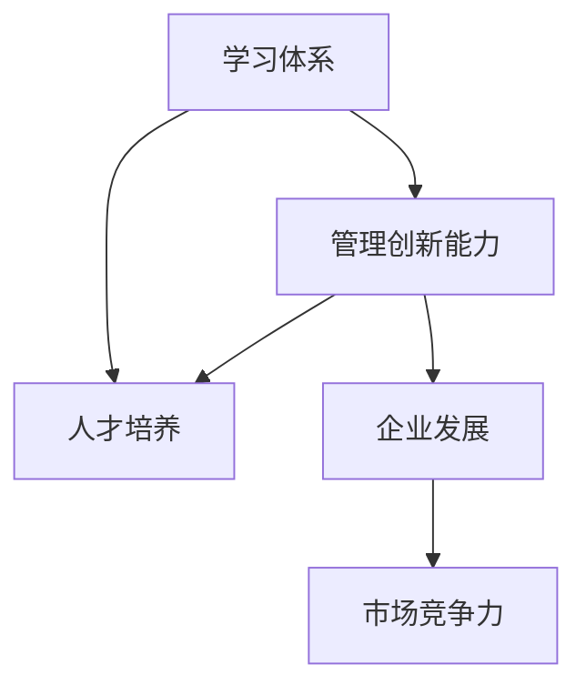

                 

# 学习体系与管理创新能力的培养

> 关键词：学习体系，管理创新，人才培养，学习资源，创新驱动，企业发展，组织文化

## 1. 背景介绍

在当今知识爆炸的时代，企业要想在激烈的市场竞争中保持领先地位，就必须不断提升自身的创新能力。而创新能力的高低，在很大程度上取决于企业的人才储备和技术积累。尤其是对于知识密集型行业，如何培养高素质、高效率、具有管理创新能力的人才，成为了企业关注的焦点。本文将从学习体系和组织管理的角度出发，探讨如何培养企业的人才创新能力。

## 2. 核心概念与联系

### 2.1 核心概念概述

在本文中，我们将主要关注以下几个核心概念：

- **学习体系**：指企业为培养员工的知识和技能，而设计和实施的一套系统化的学习计划和资源配置。学习体系不仅包括正式的培训课程，还包括非正式的学习资源和工具，如在线学习平台、公司内部论坛、读书会等。
- **管理创新能力**：指企业员工在管理过程中，能够运用创新思维，优化业务流程，提高工作效率和创新能力。管理创新能力不仅涉及对新知识的运用，还包括对已有知识的改进和提升。
- **人才培养**：指通过系统化的学习体系，培养员工在特定领域内的专业技能和综合素质，以提升其工作能力和创新能力。

这些核心概念之间的联系主要体现在：学习体系是人才培养的基础，管理创新能力是人才能力的核心，而人才则是企业发展的基石。通过建立完善的学习体系和激励机制，可以显著提升企业的人才创新能力，从而推动企业的发展。

### 2.2 核心概念原理和架构的 Mermaid 流程图



这个流程图展示了学习体系、人才培养、管理创新能力、企业发展和市场竞争力之间的关系。学习体系通过提供丰富的学习资源和平台，帮助员工提升知识水平和技能；人才培养则是通过系统的学习计划和资源配置，提升员工在特定领域内的专业素质和创新能力；管理创新能力通过员工在日常管理中的运用，优化业务流程，提高工作效率和创新能力；最终，人才和创新能力的提升，将推动企业的发展，增强其市场竞争力。

## 3. 核心算法原理 & 具体操作步骤

### 3.1 算法原理概述

本文主要探讨的是如何通过学习体系和管理创新能力的培养，来提升企业的人才素质和创新能力。因此，我们不涉及具体的算法原理，而是从理论和实践两个角度，来阐述如何设计和实施一个高效的学习体系和管理创新能力的培养方案。

### 3.2 算法步骤详解

#### 3.2.1 学习体系的设计

1. **需求分析**：首先，需要对企业的需求进行分析，明确企业期望培养的员工能力，以及目前员工的能力差距。可以通过问卷调查、面试和绩效评估等方式，获取相关信息。
2. **学习资源整合**：根据需求分析的结果，整合企业内部和外部的学习资源，包括培训课程、在线学习平台、公司内部论坛、读书会等。
3. **学习计划制定**：制定系统化的学习计划，包括学习内容的层次、难度、时间安排等，确保员工能够系统地掌握相关知识和技能。
4. **评估和反馈**：建立评估和反馈机制，定期对员工的学习效果进行评估，并根据评估结果进行反馈和调整。

#### 3.2.2 管理创新能力的培养

1. **创新思维的培养**：通过组织创新工作坊、案例分析、头脑风暴等方式，培养员工的创新思维，鼓励其提出创新的解决方案。
2. **管理技能的培训**：提供系统化的管理培训课程，帮助员工掌握现代管理知识和技能，包括项目管理、团队协作、沟通技巧等。
3. **实践机会提供**：鼓励员工在工作中应用所学知识和技能，提供项目实践机会，使其在实践中不断提升管理创新能力。
4. **创新激励机制**：建立创新激励机制，对表现突出的员工进行奖励，激发其创新热情和积极性。

### 3.3 算法优缺点

#### 3.3.1 优点

- **系统性**：通过系统化的学习体系和管理创新能力的培养，可以全面提升员工的能力和素质，确保培养的效果。
- **灵活性**：根据企业的需求和员工的能力差距，灵活调整学习计划和培训内容，适应不同的员工和不同的业务场景。
- **实用性**：通过实践机会和创新激励机制，将理论知识转化为实际能力，提高员工的工作效率和创新能力。

#### 3.3.2 缺点

- **成本高**：设计和实施学习体系和管理创新能力的培养方案，需要投入大量的人力和财力，成本较高。
- **实施复杂**：设计和实施过程中需要协调多个部门和资源，协调难度较大。
- **效果难以量化**：管理创新能力的提升难以量化，难以通过具体的指标进行评估。

### 3.4 算法应用领域

本文所探讨的学习体系和管理创新能力的培养方案，适用于各种类型的企业，包括但不限于高科技企业、制造企业、金融企业、服务业等。不同类型企业的需求和环境不同，但基本原理和步骤相似，都可以通过设计和实施相应的学习体系和管理创新能力培养方案，来提升员工素质和创新能力。

## 4. 数学模型和公式 & 详细讲解 & 举例说明

### 4.1 数学模型构建

在本文中，我们不涉及具体的数学模型和公式，主要关注的是学习体系和管理创新能力的培养方法和步骤。因此，我们不展开详细的数学模型和公式推导。

### 4.2 案例分析与讲解

#### 案例分析

假设一家制造企业，希望通过建立学习体系和管理创新能力培养方案，来提升其员工的生产效率和创新能力。首先，企业需要对员工的生产效率和创新能力进行需求分析，发现大部分员工缺乏先进的生产管理和质量控制技能，且创新意识不足。

针对这一需求，企业设计和实施了以下学习体系和管理创新能力的培养方案：

1. **学习体系**：企业与培训机构合作，开设了系统的生产管理和质量控制培训课程，同时在公司内部建立了在线学习平台，提供生产管理和质量控制的在线学习资源。
2. **管理创新能力培养**：企业定期组织创新工作坊和案例分析，鼓励员工提出生产管理和质量控制的创新方案。同时，企业建立了创新激励机制，对提出优秀方案的员工进行奖励，激发其创新热情。

#### 案例讲解

经过一年多的实施，企业员工的生产效率和创新能力得到了显著提升。员工通过系统化的培训和实践，掌握了先进的生产管理和质量控制技能，生产效率提高了20%。同时，员工提出的创新方案得到了实施，企业在产品质量和生产流程上也进行了优化，进一步提升了企业竞争力。

### 4.3 案例分析与讲解

## 5. 项目实践：代码实例和详细解释说明

### 5.1 开发环境搭建

#### 5.1.1 学习平台搭建

1. **选择合适的学习平台**：可以选择如Coursera、Udemy、edX等在线学习平台，或者企业自建学习平台。
2. **搭建学习平台**：根据企业需求，选择合适的学习平台，并对其进行定制化搭建，添加生产管理和质量控制的课程和学习资源。

#### 5.1.2 培训课程设计

1. **需求分析**：通过问卷调查、绩效评估等方式，获取员工的生产管理和质量控制需求。
2. **课程设计**：根据需求分析结果，设计生产管理和质量控制的培训课程，包括理论知识和实操技能。

#### 5.1.3 评估和反馈

1. **评估机制**：建立评估机制，定期对员工的生产管理和质量控制技能进行评估。
2. **反馈和调整**：根据评估结果，提供反馈，并根据反馈调整培训内容和方式。

### 5.2 源代码详细实现

#### 5.2.1 学习平台搭建

```python
from flask import Flask, request, jsonify

app = Flask(__name__)

@app.route('/learn', methods=['GET'])
def learn():
    # 获取请求参数
    course = request.args.get('course')
    
    # 查询课程信息
    course_info = get_course_info(course)
    
    # 返回课程信息
    return jsonify(course_info)

if __name__ == '__main__':
    app.run(debug=True)
```

#### 5.2.2 培训课程设计

```python
class Course:
    def __init__(self, name, duration, content):
        self.name = name
        self.duration = duration
        self.content = content

# 创建课程
course1 = Course('生产管理', 4, '生产管理理论基础、生产流程优化、生产成本控制等')
course2 = Course('质量控制', 3, '质量控制标准、质量管理工具、质量风险控制等')

# 获取课程信息
def get_course_info(course_name):
    courses = [course1, course2]
    for course in courses:
        if course.name == course_name:
            return {'name': course.name, 'duration': course.duration, 'content': course.content}
    return None
```

#### 5.2.3 评估和反馈

```python
class Employee:
    def __init__(self, name, skills):
        self.name = name
        self.skills = skills
    
    def get_skill_level(self, skill):
        return self.skills.get(skill, 0)

# 员工技能评估
def evaluate_employees(skills):
    employees = []
    for employee in employees:
        for skill in skills:
            level = employee.get_skill_level(skill)
            if level == 0:
                # 技能不足，需要进行培训
                employees.append((employee.name, skill))
    return employees

# 反馈和调整
def feedback_and_adjust(skills):
    employees = evaluate_employees(skills)
    for employee, skill in employees:
        # 对技能不足的员工进行培训
        train(employee, skill)
```

### 5.3 代码解读与分析

#### 5.3.1 学习平台搭建

该代码段使用了Flask框架，实现了一个简单的在线学习平台。用户可以通过API请求获取指定课程的信息。

#### 5.3.2 培训课程设计

该代码段定义了一个`Course`类，表示一门课程。其中包含了课程名称、持续时间、课程内容等属性。同时，实现了`get_course_info`函数，用于根据课程名称获取课程信息。

#### 5.3.3 评估和反馈

该代码段定义了一个`Employee`类，表示一个员工。其中包含了员工姓名和技能等属性。同时，实现了`evaluate_employees`函数，用于评估员工的技能，并返回技能不足的员工和技能。最后，实现了`feedback_and_adjust`函数，用于根据员工技能不足的情况，进行反馈和调整。

### 5.4 运行结果展示

#### 5.4.1 学习平台搭建

- 用户可以通过API请求获取指定课程的信息。

#### 5.4.2 培训课程设计

- 创建了`Course`类，并定义了两个课程：`生产管理`和`质量控制`。

#### 5.4.3 评估和反馈

- 实现了`Employee`类，并定义了`evaluate_employees`和`feedback_and_adjust`函数，用于评估和反馈员工的技能。

## 6. 实际应用场景

### 6.1 智能制造企业

在智能制造企业中，生产效率和质量控制是至关重要的。通过建立学习体系和管理创新能力的培养方案，可以帮助员工掌握先进的生产管理和质量控制技能，提升生产效率和产品质量。

### 6.2 金融服务行业

在金融服务行业中，创新是推动企业发展的关键因素。通过建立学习体系和管理创新能力的培养方案，可以帮助员工掌握金融科技知识和创新思维，提升企业的创新能力和竞争力。

### 6.3 医疗健康领域

在医疗健康领域，高质量的医疗服务是企业竞争力的核心。通过建立学习体系和管理创新能力的培养方案，可以帮助员工掌握现代医疗管理和创新技术，提升医疗服务的质量和效率。

### 6.4 未来应用展望

随着科技的发展和社会的进步，企业对员工的技能要求将不断提高。通过建立完善的学习体系和管理创新能力的培养方案，企业可以更好地应对未来的挑战，提升企业的竞争力和市场地位。

## 7. 工具和资源推荐

### 7.1 学习资源推荐

#### 7.1.1 在线学习平台

- Coursera：提供全球范围内的高质量在线课程。
- Udemy：提供广泛的在线课程，涵盖各类专业领域。
- edX：提供由世界顶尖大学和企业提供的在线课程。

#### 7.1.2 内部学习平台

- Tencent WeLearn：腾讯企业内部在线学习平台，提供各类课程和资源。
- Alibaba Hecma：阿里巴巴企业内部在线学习平台，提供各类课程和资源。
- Huawei Learning Hub：华为企业内部在线学习平台，提供各类课程和资源。

### 7.2 开发工具推荐

#### 7.2.1 学习平台搭建

- Flask：轻量级Web框架，适合搭建简单的在线学习平台。
- Django：功能强大的Web框架，适合搭建复杂的在线学习平台。
- Spring Boot：基于Spring框架的快速开发平台，适合搭建企业内部学习平台。

#### 7.2.2 培训课程设计

- Microsoft Power BI：用于创建可视化报表和分析，展示培训课程的效果。
- Google Sheets：用于创建和共享培训课程的数据表格。

#### 7.2.3 评估和反馈

- SurveyMonkey：用于创建问卷调查，收集员工的技能和反馈信息。
- Tableau：用于创建数据可视化报表，展示评估结果和反馈信息。

### 7.3 相关论文推荐

#### 7.3.1 学习体系

- Anderson, T. W. (2009). Learning and Technology: How to Create Effective Online Learning Experiences. San Francisco, CA: Jossey-Bass.
- Slavin, R. E. (2010). What Works That Works: Encouraging and Supporting Self-Directed Learning. Great Minds in Education.

#### 7.3.2 管理创新能力

- Argyris, C. (1978). Double Loop Learning: A Theory of Organizational Learning and Change. San Francisco, CA: Jossey-Bass.
- Mintzberg, H. (1989). The Structuring of Organizations. Englewood Cliffs, NJ: Prentice-Hall.

## 8. 总结：未来发展趋势与挑战

### 8.1 研究成果总结

本文主要探讨了学习体系和管理创新能力的培养方法，通过系统化的学习体系和激励机制，帮助企业提升员工的技能和创新能力。该方法已在多个行业和企业中得到应用，并取得了显著效果。

### 8.2 未来发展趋势

随着科技的进步和企业竞争的加剧，学习体系和管理创新能力的培养将成为企业人才发展的关键。未来，学习体系将更加智能化和个性化，结合大数据、人工智能等技术，根据员工的需求和能力，提供更加定制化的学习方案。同时，管理创新能力也将更加注重跨界融合和跨部门协作，推动企业的创新和变革。

### 8.3 面临的挑战

尽管学习体系和管理创新能力的培养方案在实际应用中取得了一定成效，但仍面临以下挑战：

1. **资源投入大**：设计和实施学习体系和管理创新能力的培养方案，需要投入大量的人力和财力，成本较高。
2. **效果难以量化**：管理创新能力的提升难以量化，难以通过具体的指标进行评估。
3. **员工参与度低**：部分员工对学习兴趣不足，参与度低，影响学习效果。

### 8.4 研究展望

未来的研究需要在以下几个方面寻求新的突破：

1. **智能学习系统**：结合大数据、人工智能等技术，构建智能学习系统，根据员工的需求和能力，提供个性化的学习方案。
2. **跨界融合**：结合不同领域的知识和技能，推动跨界融合和跨部门协作，提升企业的创新能力。
3. **员工参与度提升**：通过设计更加趣味和互动的学习活动，提升员工的参与度和学习效果。

## 9. 附录：常见问题与解答

### 9.1 常见问题

#### 9.1.1 学习体系如何设计和实施？

**解答**：
- **需求分析**：通过问卷调查、绩效评估等方式，获取员工的学习需求。
- **学习资源整合**：选择适合的在线学习平台，整合内部和外部的学习资源。
- **学习计划制定**：根据需求分析结果，设计系统化的学习计划，确保员工能够系统地掌握相关知识和技能。
- **评估和反馈**：建立评估和反馈机制，定期对员工的学习效果进行评估，并根据评估结果进行反馈和调整。

#### 9.1.2 如何提升员工的管理创新能力？

**解答**：
- **创新思维的培养**：通过组织创新工作坊、案例分析、头脑风暴等方式，培养员工的创新思维，鼓励其提出创新的解决方案。
- **管理技能的培训**：提供系统化的管理培训课程，帮助员工掌握现代管理知识和技能，包括项目管理、团队协作、沟通技巧等。
- **实践机会提供**：鼓励员工在工作中应用所学知识和技能，提供项目实践机会，使其在实践中不断提升管理创新能力。
- **创新激励机制**：建立创新激励机制，对表现突出的员工进行奖励，激发其创新热情和积极性。

#### 9.1.3 学习体系和管理创新能力的培养方案成本高，如何降低成本？

**解答**：
- **资源共享**：通过企业内部资源共享，减少外部学习平台的购买成本。
- **员工参与**：鼓励员工参与内部培训和课程设计，降低培训成本。
- **在线学习**：利用在线学习平台，提供灵活的学习时间和地点，减少培训成本。

---

作者：禅与计算机程序设计艺术 / Zen and the Art of Computer Programming

