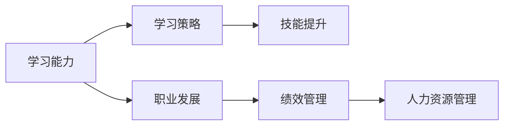

                 

# 学习能力与管理者的长期发展

> 关键词：学习能力,职业发展,学习策略,技能提升,绩效管理,人力资源管理

## 1. 背景介绍

在当今快速变化的商业环境中，终身学习已成为个人和组织成功的关键因素。管理者，作为组织的中坚力量，其学习能力的提升直接影响到企业的创新能力和竞争力。本文将深入探讨学习能力在管理者长期发展中的重要性，并提出一些切实可行的策略来促进这一过程。

## 2. 核心概念与联系

### 2.1 核心概念概述

为了更好地理解学习能力在管理者长期发展中的作用，本节将介绍几个关键概念：

- **学习能力（Learning Ability）**：指个体获取新知识、技能和信息的能力。对管理者而言，这包括但不限于批判性思维、适应性、问题解决能力等。
- **职业发展（Career Development）**：指个体在其职业生涯中的成长和进步，包括职位晋升、专业技能提升、领导力发展等。
- **学习策略（Learning Strategy）**：指为了达成学习目标所采取的具体方法和步骤。对管理者而言，这可能包括参加培训、读书学习、网络课程等。
- **技能提升（Skill Enhancement）**：指通过学习来提高特定领域的专业技能或通用技能的过程。
- **绩效管理（Performance Management）**：指通过持续的反馈和评估来提升个人和团队绩效的管理实践。
- **人力资源管理（Human Resource Management）**：指组织内部人才的获取、发展和保留的战略性管理过程。

这些概念之间的联系可以通过以下Mermaid流程图来展示：



这个流程图展示了学习能力如何通过学习策略提升技能，进而促进职业发展和绩效管理，最终与人力资源管理紧密相连。

## 3. 核心算法原理 & 具体操作步骤

### 3.1 算法原理概述

提升学习能力的管理者职业发展过程，本质上是一个系统性的学习和优化过程。其核心思想是：通过持续学习，不断提升个人的知识、技能和绩效，从而实现长期的职业成长。

形式化地，假设管理者当前的职业状态为 $S_0$，通过持续的学习，最终达到目标职业状态 $S_f$。则整个过程可以表示为：

$$
S_f = f(S_0, \text{learning\_strategy})
$$

其中 $f$ 为学习和优化函数，表示在特定学习策略的指导下，从初始状态 $S_0$ 到达最终状态 $S_f$ 的过程。

### 3.2 算法步骤详解

基于上述原理，提升学习能力的管理者职业发展过程一般包括以下几个关键步骤：

**Step 1: 自我评估**

- 识别当前职业状态和目标职业状态之间的差距。
- 分析差距形成的原因，识别需要提升的技能和知识领域。

**Step 2: 制定学习计划**

- 根据自我评估结果，制定详细的学习计划。
- 选择合适的学习资源和工具，如培训课程、书籍、在线课程等。
- 设定学习目标和评估标准。

**Step 3: 执行学习活动**

- 按照学习计划，参与培训、读书、实践等多种学习活动。
- 记录学习过程中的收获和挑战，定期进行反思和总结。

**Step 4: 评估和反馈**

- 定期评估学习效果，比较学习前后的变化。
- 根据评估结果调整学习策略，优化学习路径。

**Step 5: 应用与实践**

- 将学习到的知识和技能应用到实际工作中，提升工作绩效。
- 通过实践验证学习成果，进一步巩固和深化理解。

### 3.3 算法优缺点

提升学习能力的管理者职业发展方法具有以下优点：
1. 系统性：通过系统的学习和优化，能够全面提升个人的能力和绩效。
2. 灵活性：个人可以根据自己的需求和兴趣，选择适合自己的学习资源和方法。
3. 可持续性：通过持续的学习和反馈，能够保持长期的职业发展动力。

同时，该方法也存在一些局限性：
1. 需要持续投入时间和资源。对于时间紧张的管理者，可能难以坚持。
2. 学习效果难以量化。定性评价难以评估学习成果的真实价值。
3. 学习策略需要不断调整。需要根据学习过程中的反馈，不断优化学习路径。

### 3.4 算法应用领域

提升学习能力的管理者职业发展方法，广泛应用于各类组织和行业的职业发展和人才培养中。例如：

- **企业内部培训**：通过定期的培训和课程学习，帮助员工提升职业技能，促进个人和团队绩效提升。
- **在线学习平台**：如Coursera、edX等，提供丰富的学习资源，支持管理者灵活学习和自我提升。
- **行业认证和资格**：通过考取各类专业认证，提升个人在特定领域的权威性和竞争力。
- **领导力发展**：通过学习领导力相关的知识和技能，提升管理者的领导力和组织影响力。
- **跨职能培训**：通过跨职能的学习，增强管理者的综合素质和多元视角，促进团队协作和创新。

## 4. 数学模型和公式 & 详细讲解 & 举例说明

### 4.1 数学模型构建

为了更好地理解和计算学习对职业发展的具体影响，我们构建一个简单的数学模型来描述这一过程。

假设管理者当前的技能水平为 $S_0$，通过学习新知识 $K$ 和技能 $S$，提升到新的技能水平 $S_f$。则模型的形式可以表示为：

$$
S_f = S_0 + K + S
$$

其中 $K$ 表示通过学习获得的新知识，$S$ 表示通过实践获得的技能提升。

### 4.2 公式推导过程

对于 $K$ 和 $S$ 的计算，我们可以进一步细化。假设学习的过程是线性的，即每次学习都能带来一定比例的提升。则有：

$$
K = \alpha \cdot T_k
$$

$$
S = \beta \cdot T_s
$$

其中 $\alpha$ 和 $\beta$ 分别为知识和技能提升的系数，$T_k$ 和 $T_s$ 分别为学习时间和实践时间的累积。

将这些公式代入最初的模型中，可以得到：

$$
S_f = S_0 + \alpha \cdot T_k + \beta \cdot T_s
$$

### 4.3 案例分析与讲解

以某企业中一位销售经理的职业发展为例：

- 初始技能水平 $S_0 = 70$（假设评分范围为0-100）。
- 学习新知识 $K = 10$，通过参加一周的在线课程获得。
- 通过实际销售活动提升技能 $S = 15$，每月获得一次销售冠军称号。
- 学习时间和实践时间分别为 $T_k = 1$ 周和 $T_s = 1$ 月。
- 学习系数 $\alpha = 0.5$，表示学习效果随时间累积；技能提升系数 $\beta = 0.3$，表示技能提升的边际效果递减。

代入公式计算最终的技能水平 $S_f$：

$$
S_f = 70 + 0.5 \cdot 1 + 0.3 \cdot 1 = 76.5
$$

该经理通过持续的学习和实践，技能水平提升了约 $76.5 - 70 = 6.5$ 分。

## 5. 项目实践：代码实例和详细解释说明

### 5.1 开发环境搭建

在进行职业发展和学习策略的实践前，我们需要准备好开发环境。以下是使用Python进行开发的环境配置流程：

1. 安装Anaconda：从官网下载并安装Anaconda，用于创建独立的Python环境。

2. 创建并激活虚拟环境：
```bash
conda create -n career-env python=3.8 
conda activate career-env
```

3. 安装必要的库：
```bash
pip install pandas numpy matplotlib seaborn
```

4. 安装Jupyter Notebook：
```bash
pip install jupyterlab
```

完成上述步骤后，即可在`career-env`环境中开始实践。

### 5.2 源代码详细实现

我们以管理者学习策略和绩效管理为例，构建一个简单的模型来说明如何使用Python进行计算和分析。

首先，定义一些基本的数据结构：

```python
import pandas as pd
import numpy as np

# 假设数据集
learning_rate = 0.5
practice_rate = 0.3
initial_skill = 70
new_knowledge = 10
new_skill = 15
time_k = 1
time_s = 1

# 计算最终技能水平
final_skill = initial_skill + learning_rate * time_k + practice_rate * time_s
final_skill
```

接着，进行具体的计算和分析：

```python
# 构建数据表
data = pd.DataFrame({
    '初始技能': [initial_skill],
    '新知识': [new_knowledge],
    '新技能': [new_skill],
    '学习时间': [time_k],
    '实践时间': [time_s],
    '最终技能': [final_skill]
})

# 输出结果
print(data)
```

最后，使用图表对学习效果进行可视化：

```python
import matplotlib.pyplot as plt

# 绘制技能提升过程图
plt.plot(data['初始技能'], label='初始技能')
plt.plot(data['最终技能'], label='最终技能')
plt.xlabel('时间')
plt.ylabel('技能水平')
plt.legend()
plt.show()
```

### 5.3 代码解读与分析

让我们再详细解读一下关键代码的实现细节：

**学习模型定义**：
- 定义了学习率和技能提升率等关键参数，表示每次学习和实践对技能提升的具体贡献。
- 初始技能水平、新知识和技能、学习时间和实践时间等变量，用于计算最终技能水平。

**计算最终技能水平**：
- 通过公式 $S_f = S_0 + \alpha \cdot T_k + \beta \cdot T_s$ 计算最终技能水平。

**数据表构建**：
- 使用Pandas库创建数据表，记录学习前后的技能变化。

**可视化输出**：
- 使用Matplotlib库绘制技能提升过程图，直观展示学习效果。

通过这段代码，我们可以清晰地看到学习对技能提升的贡献，以及如何通过调整学习策略和实践时间来最大化提升效果。

## 6. 实际应用场景

### 6.1 企业内部培训

提升学习能力的管理者职业发展方法，在企业内部培训中得到了广泛应用。通过定期组织各类培训课程，帮助员工学习新知识和新技能，提升个人和团队绩效。

例如，某企业每年为员工安排至少两次外派培训，涵盖销售、管理、技术等多个领域。每次培训后，员工需要提交学习报告和绩效提升目标，公司根据反馈调整培训内容，持续提升员工能力。

### 6.2 在线学习平台

在线学习平台如Coursera、edX等，为管理者提供了丰富的学习资源。通过参与各类在线课程，管理者可以灵活安排学习时间，提升自身专业技能。

例如，某公司鼓励员工在Coursera上参加各类领导力课程和项目管理课程，学习后提交学习笔记和项目案例，公司对表现优异的员工给予绩效奖励。

### 6.3 行业认证和资格

考取各类行业认证和资格证书，也是提升管理者职业发展的重要手段。通过获得专业认证，提升个人在特定领域的权威性和竞争力。

例如，某公司要求所有销售经理必须考取CPM（Certified Professional Marketer）证书，通过定期的认证评估和知识更新，提升销售团队的营销能力和管理水平。

### 6.4 领导力发展

提升领导力是管理者职业发展的核心任务之一。通过学习领导力相关的知识和技能，提升管理者的领导力和组织影响力。

例如，某企业通过引入Leadership Framework（领导力框架）培训课程，帮助管理者提升沟通、团队建设、决策制定等方面的能力，提升整体领导力水平。

### 6.5 跨职能培训

跨职能培训有助于增强管理者的综合素质和多元视角，促进团队协作和创新。通过参与不同职能部门的培训，管理者可以更好地理解各部门的业务流程和挑战，提升跨部门协作能力。

例如，某公司每季度举办一次跨职能工作坊，邀请各部门经理参与，共同探讨业务问题，促进团队合作和知识共享。

## 7. 工具和资源推荐

### 7.1 学习资源推荐

为了帮助管理者系统掌握学习能力和职业发展的理论基础和实践技巧，这里推荐一些优质的学习资源：

1. 《终身学习：一个不断发展的未来》（作者：Alvin Toffler）：经典著作，探讨了终身学习的重要性及其对个人和社会的深远影响。
2. 《高效能人士的七个习惯》（作者：Stephen R. Covey）：介绍了一系列高效能人士的习惯，帮助管理者提升个人和团队绩效。
3. 《学习之道》（作者：Peter C. Brown）：详细讲解了高效学习的技巧和方法，帮助管理者优化学习策略。
4. 《哈佛商业评论》（Harvard Business Review）：定期发布各类管理案例和文章，提供丰富的学习资源和实践经验。
5. Coursera、edX、Udacity等在线学习平台：提供丰富的课程和资源，支持管理者灵活学习。

通过对这些资源的学习实践，相信你一定能够系统掌握学习能力和职业发展的关键技巧，从而更好地实现个人和团队的长期发展。

### 7.2 开发工具推荐

高效的开发离不开优秀的工具支持。以下是几款用于学习能力和职业发展开发的常用工具：

1. Jupyter Notebook：交互式编程环境，支持Python、R等多种语言，方便数据处理和可视化。
2. pandas：数据分析库，支持数据清洗、处理和分析，非常适合学习数据分析和数据可视化。
3. numpy：数学计算库，支持高性能数组运算和数学函数，适合进行复杂的数据处理和计算。
4. matplotlib：绘图库，支持各类图表绘制，非常适合进行数据可视化。
5. seaborn：基于matplotlib的高级绘图库，支持更丰富的图表类型和定制化设置。

合理利用这些工具，可以显著提升学习能力和职业发展的开发效率，加快创新迭代的步伐。

### 7.3 相关论文推荐

学习能力提升和管理者职业发展领域的研究，已经积累了丰富的理论基础和实践经验。以下是几篇经典论文，推荐阅读：

1. "What Makes Us Learn?"（作者：Thomas J. Bjork）：探讨了人类学习机制和记忆的心理学基础，对学习策略的设计具有重要参考价值。
2. "Learning to Win"（作者：Michael A. McAleese）：介绍了如何通过学习和绩效管理提升企业竞争力，提供了丰富的管理实践案例。
3. "Performance Appraisal in Practice"（作者：Joyce Beatty）：介绍了绩效评估和管理工具和方法，帮助管理者优化绩效管理流程。
4. "The Power of Learning"（作者：Robert M. Boice）：探讨了学习对个人成长和职业发展的深远影响，提供了丰富的学习资源和方法。
5. "The Learning Organization"（作者：Peter M. Senge）：介绍了学习型组织的构建和管理方法，帮助管理者提升组织学习能力。

这些论文代表了学习能力提升和管理者职业发展领域的研究方向和最新进展，通过学习这些前沿成果，可以帮助管理者更好地应对职业发展中的挑战，提升个人和团队的长期竞争力。

## 8. 总结：未来发展趋势与挑战

### 8.1 总结

本文对提升学习能力的管理者职业发展方法进行了全面系统的介绍。首先阐述了学习能力在管理者长期发展中的重要性，明确了职业发展和学习策略在提升个人绩效和组织竞争力方面的关键作用。其次，从原理到实践，详细讲解了提升学习能力的管理者职业发展过程，包括自我评估、学习计划制定、执行学习活动、评估和反馈、应用与实践等关键环节。通过构建数学模型和具体案例，展示了学习能力提升的计算方法和实际效果。

通过本文的系统梳理，可以看到，提升学习能力的管理者职业发展方法具有广阔的应用前景，有助于推动个人和组织的长期发展。管理者在面对职业挑战时，可以通过科学的学习策略和持续的学习实践，不断提升自身能力，实现职业目标。

### 8.2 未来发展趋势

展望未来，提升学习能力的管理者职业发展方法将呈现以下几个发展趋势：

1. 技术驱动：随着AI、大数据等技术的不断进步，学习能力和职业发展将更多依赖技术手段，如智能推荐系统、在线学习平台等。
2. 个性化学习：通过大数据和机器学习技术，为不同背景和管理者提供个性化的学习建议和资源，提升学习效果。
3. 多模态学习：结合视觉、听觉等多种感官信息，提升学习体验和效果。例如，通过视频课程、虚拟现实等方式，增强学习互动性和沉浸感。
4. 持续性学习：管理者需要不断更新知识技能，以应对快速变化的商业环境。通过构建终身学习体系，促进持续学习和自我提升。
5. 跨学科融合：学习能力和职业发展将更多结合心理学、管理学、社会学等多个学科的理论和方法，提升学习效果和应用价值。

这些趋势展示了未来学习能力提升和管理者职业发展的前景，为管理者的长期发展提供了更多可能性。

### 8.3 面临的挑战

尽管提升学习能力的管理者职业发展方法已经取得了显著成效，但在迈向更加智能化、普适化应用的过程中，仍面临诸多挑战：

1. 时间管理：管理者工作繁忙，难以持续投入时间和精力进行学习。如何在工作和学习之间找到平衡，是提升学习能力的关键挑战。
2. 知识更新：知识更新速度快，管理者需要不断学习新知识和新技能，以保持竞争力。如何有效筛选和管理海量学习资源，是提升学习效果的重要问题。
3. 实践应用：学习需要与实践相结合，才能真正提升能力。如何设计有效的实践活动，将学到的知识应用到实际工作中，是提升学习效果的关键。
4. 学习评估：如何科学评估学习效果，识别学习过程中存在的问题和改进点，是提升学习效果的重要手段。
5. 学习动力：管理者需要长期坚持学习，保持学习动力。如何在学习过程中提供持续激励，是提升学习效果的关键。

### 8.4 研究展望

面对提升学习能力管理者的职业发展所面临的挑战，未来的研究需要在以下几个方面寻求新的突破：

1. 学习策略的科学设计：研究科学有效的学习策略和方法，帮助管理者高效学习和提升能力。
2. 技术手段的应用：探索AI、大数据等技术手段在学习能力提升中的应用，提升学习效果和效率。
3. 学习动力的激励机制：设计科学的激励机制，激发管理者的学习动力和积极性。
4. 学习效果的科学评估：研究科学有效的学习效果评估方法，识别学习过程中存在的问题和改进点。
5. 跨学科知识的整合：研究跨学科知识整合的方法，提升学习效果和应用价值。

这些研究方向将有助于推动提升学习能力的管理者职业发展方法迈向更高的台阶，为管理者的长期发展提供更多科学和有效的手段。

## 9. 附录：常见问题与解答

**Q1：提升学习能力的管理者职业发展方法是否适用于所有管理者？**

A: 该方法在适用范围上没有严格限制，适用于各类行业和管理层级的管理者。但对于一些特殊领域，如医学、法律等，可能需要结合专业领域的具体需求进行调整。

**Q2：如何进行自我评估？**

A: 自我评估可以通过以下步骤进行：
1. 明确职业目标和期望。
2. 列出当前技能和知识水平。
3. 识别技能和知识缺口。
4. 分析技能和知识缺口的原因。
5. 制定改进计划和目标。

**Q3：如何选择学习资源和工具？**

A: 选择学习资源和工具时，可以考虑以下几个因素：
1. 学习目标和需求。选择与目标匹配的学习资源。
2. 学习方式和形式。选择适合自身学习习惯的学习方式，如线上课程、书籍、工作坊等。
3. 资源质量和可信度。选择权威和有质量的学习资源，如官方认证课程、知名出版物等。
4. 时间和成本。选择适合自己的时间和成本预算，合理安排学习时间和资源投入。

**Q4：如何制定学习计划？**

A: 制定学习计划时，可以考虑以下几个步骤：
1. 设定学习目标。明确想要提升的技能和知识。
2. 选择学习资源。根据目标选择合适的学习资源。
3. 安排学习时间。合理规划学习时间，避免时间冲突。
4. 设定评估标准。明确评估学习效果的指标和方法。
5. 设定评估频率。定期评估学习效果，及时调整学习策略。

**Q5：如何评估学习效果？**

A: 评估学习效果可以通过以下方式进行：
1. 自我评估。通过自我反思和总结，评估学习过程中的收获和不足。
2. 外部评估。通过上级或同事的反馈，评估学习效果和改进点。
3. 学习成果展示。通过项目报告、绩效提升等形式展示学习成果。
4. 持续改进。根据评估结果，调整学习策略和实践活动，提升学习效果。

通过这些常见问题的解答，相信你能够更好地理解提升学习能力的管理者职业发展方法，并有效应用于实际工作和学习中。

---

作者：禅与计算机程序设计艺术 / Zen and the Art of Computer Programming

