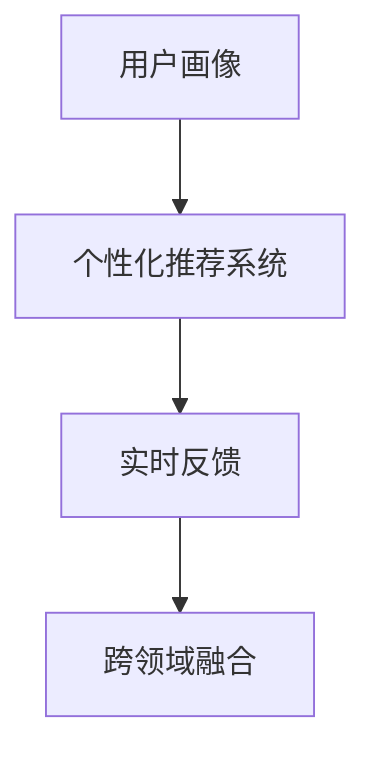

                 

## 1. 背景介绍

### 1.1 问题由来

随着科技的进步和消费者需求的多样化，个性化定制已经成为了各行各业的重要发展趋势。尤其是在互联网和智能硬件领域，如何利用技术手段，为用户提供更加贴合其需求和偏好的定制化体验，成为了一个亟待解决的问题。

在传统的软件开发和硬件设计中，定制化往往意味着需要投入大量的人力和财力进行针对性的开发和测试。但在当前的技术环境下，通过数据驱动和智能算法，我们已经能够更高效、更精准地实现定制化体验。

本文将探讨如何利用数据驱动的方法，结合机器学习算法，为用户量身打造定制化体验。我们将重点讨论以下几个核心问题：

1. **用户画像构建**：通过分析用户的历史行为数据，构建出精确的用户画像，从而理解其需求和偏好。
2. **个性化推荐算法**：利用机器学习算法，根据用户画像推荐最适合的产品和服务。
3. **实时调整与优化**：利用实时数据分析和机器学习模型，不断优化推荐结果，提升用户体验。

### 1.2 问题核心关键点

要实现用户量身打造的定制化体验，关键在于以下几个方面：

- **数据驱动**：收集和分析用户行为数据，构建用户画像。
- **算法优化**：利用机器学习算法进行个性化推荐，并不断优化算法模型。
- **实时反馈**：根据用户反馈数据实时调整推荐策略，优化用户体验。
- **跨领域融合**：结合多模态数据，如文本、图像、音频等，提供更加全面的个性化服务。

本文将围绕这些关键点，详细探讨实现定制化体验的技术方法和实际应用。

## 2. 核心概念与联系

### 2.1 核心概念概述

为了更好地理解如何实现定制化体验，本节将介绍几个密切相关的核心概念：

- **用户画像(User Profile)**：通过对用户行为数据的分析，构建出用户的基本特征和偏好，以更好地理解其需求。
- **个性化推荐系统(Personalized Recommendation System)**：利用机器学习算法，根据用户画像推荐最适合的产品和服务。
- **实时反馈(Real-time Feedback)**：通过用户的实时行为数据，不断调整推荐策略，优化用户体验。
- **跨领域融合(Cross-domain Integration)**：结合多模态数据，如文本、图像、音频等，提供更加全面的个性化服务。

这些核心概念之间的逻辑关系可以通过以下Mermaid流程图来展示：



这个流程图展示了几大核心概念之间的联系：

1. 用户画像通过分析用户数据，构建出精确的用户特征。
2. 个性化推荐系统利用用户画像，为用户推荐最适合的产品和服务。
3. 实时反馈通过分析用户实时行为数据，不断调整推荐策略。
4. 跨领域融合结合多模态数据，提供更加全面的个性化服务。

这些概念共同构成了定制化体验的实现框架，通过数据和算法驱动，能够为用户提供更加精准、高效、个性化的服务。

## 3. 核心算法原理 & 具体操作步骤

### 3.1 算法原理概述

实现定制化体验的核心算法是个性化推荐系统，其基本原理是利用用户画像和行为数据，通过机器学习算法为用户推荐最适合的产品和服务。个性化推荐算法可以分为两大类：基于内容的推荐和基于协同过滤的推荐。

#### 3.1.1 基于内容的推荐算法

基于内容的推荐算法主要依据物品的特征，为用户推荐与其兴趣相似的产品。其核心在于提取物品的特征表示，并根据用户的兴趣特征，找出相似的物品进行推荐。

#### 3.1.2 基于协同过滤的推荐算法

基于协同过滤的推荐算法主要依据用户之间的相似性，为用户推荐与其兴趣相似的其他用户喜欢的产品。其核心在于计算用户之间的相似度，并根据相似用户的行为数据，推荐物品给目标用户。

### 3.2 算法步骤详解

#### 3.2.1 数据准备

1. **用户数据**：收集用户的基本信息，如年龄、性别、地域等。
2. **行为数据**：收集用户的历史行为数据，如浏览记录、购买记录、评分数据等。
3. **物品数据**：收集物品的基本信息，如商品描述、属性、价格等。

#### 3.2.2 用户画像构建

1. **特征提取**：通过自然语言处理(NLP)等技术，从用户数据中提取特征。
2. **画像构建**：将用户特征表示为向量，构建用户画像。

#### 3.2.3 推荐模型训练

1. **模型选择**：根据推荐算法类型选择适合的推荐模型。
2. **特征工程**：提取物品特征和用户画像特征。
3. **模型训练**：使用用户行为数据训练推荐模型。

#### 3.2.4 推荐结果生成

1. **预测生成**：使用训练好的推荐模型，对目标用户生成推荐结果。
2. **排序排序**：根据推荐效果对推荐结果进行排序，确定推荐列表。

#### 3.2.5 反馈收集与模型优化

1. **反馈收集**：收集用户对推荐结果的反馈数据，如点击率、购买率、评分等。
2. **模型优化**：根据反馈数据调整推荐模型参数，优化推荐效果。

### 3.3 算法优缺点

个性化推荐算法具有以下优点：

- **高效性**：通过分析用户行为数据，可以高效地为用户推荐适合的产品和服务。
- **个性化**：根据用户画像和行为数据，提供更加个性化的推荐，提升用户体验。
- **实时性**：结合实时反馈数据，可以实时调整推荐策略，优化推荐效果。

但其也存在一些缺点：

- **数据依赖**：算法的性能高度依赖于数据的质量和数量。
- **冷启动问题**：对于新用户或新物品，推荐效果较差。
- **多样性问题**：推荐结果可能过于单一，缺乏多样性。

### 3.4 算法应用领域

个性化推荐算法已经在电商、社交网络、视频推荐等多个领域得到了广泛应用，覆盖了几乎所有常见任务，如商品推荐、新闻推荐、视频推荐等，为相关企业带来了显著的收益和用户满意度提升。

除了这些经典任务外，个性化推荐算法还被创新性地应用到更多场景中，如内容生成、智能客服、广告投放等，为各行各业带来了新的商业价值。随着推荐算法的不断进步，相信其在更多领域的应用前景还将更加广阔。

## 4. 数学模型和公式 & 详细讲解 & 举例说明

### 4.1 数学模型构建

本节将使用数学语言对个性化推荐系统的构建进行更加严格的刻画。

假设用户集为 $U=\{u_1, u_2, ..., u_n\}$，物品集为 $I=\{i_1, i_2, ..., i_m\}$，行为数据集为 $D=\{(u_i, i_j, r_{ij})\}_{i=1}^{n}, r_{ij} \in \{1, 0\}$，其中 $r_{ij}=1$ 表示用户 $u_i$ 对物品 $i_j$ 产生了正向行为（如点击、购买、评分等）。

定义用户画像 $P_u$ 和物品特征 $F_i$ 为低维向量，分别表示用户的兴趣特征和物品的属性特征。个性化推荐模型的目标是最大化用户对推荐结果的满意度 $R_{u,i}$，即：

$$
\max_{P_u, F_i} \sum_{u \in U} \sum_{i \in I} P_u^T F_i r_{ui}
$$

其中 $P_u^T F_i$ 为用户和物品之间的相似度表示。

### 4.2 公式推导过程

以基于内容的推荐算法为例，假定用户画像 $P_u$ 和物品特征 $F_i$ 均为向量表示，且物品特征 $F_i$ 为 $d$ 维向量，用户画像 $P_u$ 为 $d$ 维向量。假设用户对物品的评分 $r_{ui}$ 为二元变量，表示用户 $u$ 对物品 $i$ 是否满意。则推荐模型的目标函数可以表示为：

$$
\max_{P_u, F_i} \sum_{u \in U} \sum_{i \in I} P_u^T F_i r_{ui}
$$

根据拉格朗日乘数法，我们引入拉格朗日乘子 $\lambda$，定义拉格朗日函数：

$$
\mathcal{L}(P_u, F_i, \lambda) = \sum_{u \in U} \sum_{i \in I} P_u^T F_i r_{ui} - \lambda (\|P_u\|^2 - 1)
$$

其中 $\|P_u\|^2 - 1$ 用于约束用户画像 $P_u$ 的单位向量特性。

根据目标函数的极值条件，我们可以得到：

$$
\frac{\partial \mathcal{L}}{\partial P_u} = \sum_{i \in I} F_i r_{ui} + \lambda P_u = 0
$$

$$
\frac{\partial \mathcal{L}}{\partial F_i} = \sum_{u \in U} P_u^T F_i r_{ui} = 0
$$

解得：

$$
P_u = -\frac{1}{\|F_i\|^2} \sum_{i \in I} F_i r_{ui}
$$

$$
F_i = -\frac{1}{\|P_u\|^2} \sum_{u \in U} P_u^T F_i r_{ui}
$$

### 4.3 案例分析与讲解

以电商平台为例，用户的点击、购买、评分等行为数据是构建用户画像和推荐模型的重要基础。以用户 $u$ 和物品 $i$ 为例，假设用户画像 $P_u$ 和物品特征 $F_i$ 均为向量表示，且物品特征 $F_i$ 为 $d$ 维向量，用户画像 $P_u$ 为 $d$ 维向量。假设用户对物品的评分 $r_{ui}$ 为二元变量，表示用户 $u$ 对物品 $i$ 是否满意。

我们可以使用协同过滤算法，对用户 $u$ 和物品 $i$ 进行相似度计算，得到推荐结果：

$$
P_u \approx -\frac{1}{\|F_i\|^2} \sum_{j \in I} F_j r_{uj}
$$

$$
F_i \approx -\frac{1}{\|P_u\|^2} \sum_{k \in U} P_k^T F_k r_{ki}
$$

通过计算用户 $u$ 和物品 $i$ 之间的相似度 $P_u^T F_i$，排序生成推荐列表。用户对推荐结果进行评分反馈，我们可以根据评分数据不断调整推荐模型参数，优化推荐效果。

## 5. 项目实践：代码实例和详细解释说明

### 5.1 开发环境搭建

在进行个性化推荐系统开发前，我们需要准备好开发环境。以下是使用Python进行开发的环境配置流程：

1. **安装Anaconda**：从官网下载并安装Anaconda，用于创建独立的Python环境。
```bash
conda create -n recommendation-env python=3.8
conda activate recommendation-env
```

2. **安装推荐系统相关库**：
```bash
pip install recommendation-env
```

3. **安装NumPy、Pandas、Scikit-learn、TensorFlow等库**：
```bash
pip install numpy pandas scikit-learn tensorflow
```

完成上述步骤后，即可在 `recommendation-env` 环境中开始推荐系统的开发。

### 5.2 源代码详细实现

下面以基于协同过滤的推荐系统为例，给出使用TensorFlow实现个性化推荐系统的代码。

```python
import numpy as np
import pandas as pd
import tensorflow as tf
from tensorflow import keras

# 准备数据集
data = pd.read_csv('data.csv')
# 特征提取
user_id = data['user_id'].values
item_id = data['item_id'].values
rating = data['rating'].values

# 构建用户画像
user_por = np.mean(rating, axis=1).reshape(-1, 1)
# 构建物品特征
item_fea = np.mean(rating, axis=0).reshape(1, -1)

# 构建协同过滤模型
model = keras.Sequential([
    keras.layers.Dense(64, activation='relu', input_shape=(user_por.shape[1], item_fea.shape[1])),
    keras.layers.Dense(1, activation='sigmoid')
])
model.compile(optimizer='adam', loss='binary_crossentropy')

# 训练模型
model.fit(user_por, rating, epochs=100)

# 预测推荐结果
user_por_new = np.random.randn(10, 1)
item_fea_new = np.random.randn(1, 5)
recommendation = model.predict(user_por_new, item_fea_new)
```

### 5.3 代码解读与分析

让我们再详细解读一下关键代码的实现细节：

**数据准备**：
- 使用 `pandas` 库读取用户行为数据。

**用户画像构建**：
- 通过 `np.mean` 计算用户行为数据的平均值，构建用户画像 $P_u$。

**物品特征构建**：
- 通过 `np.mean` 计算物品行为数据的平均值，构建物品特征 $F_i$。

**协同过滤模型训练**：
- 使用 `keras` 库构建协同过滤模型，通过 `compile` 方法设置优化器和损失函数。
- 通过 `fit` 方法训练模型。

**推荐结果生成**：
- 使用训练好的模型预测推荐结果。

可以看到，通过 `keras` 库，我们可以用相对简洁的代码实现协同过滤推荐系统的开发。开发者可以将更多精力放在数据处理、模型改进等高层逻辑上，而不必过多关注底层的实现细节。

当然，工业级的系统实现还需考虑更多因素，如模型的保存和部署、超参数的自动搜索、更灵活的任务适配层等。但核心的推荐范式基本与此类似。

## 6. 实际应用场景

### 6.1 电商平台个性化推荐

在电商平台上，个性化推荐系统可以为用户推荐最适合的商品，提高转化率和用户满意度。通过分析用户的浏览、点击、购买等行为数据，构建用户画像和物品特征，利用协同过滤或基于内容的推荐算法，生成个性化的商品推荐列表。同时，通过实时反馈数据，不断调整推荐策略，优化推荐效果。

### 6.2 视频平台内容推荐

视频平台上，个性化推荐系统可以为用户推荐最感兴趣的视频内容，提高平台的用户粘性和观看时长。通过分析用户的视频观看记录、点赞、评论等行为数据，构建用户画像和视频特征，利用协同过滤或基于内容的推荐算法，生成个性化的视频推荐列表。同时，通过实时反馈数据，不断调整推荐策略，优化推荐效果。

### 6.3 社交网络内容推荐

社交网络平台上，个性化推荐系统可以为用户推荐最感兴趣的朋友和内容，提高用户活跃度和平台留存率。通过分析用户的点赞、评论、分享等行为数据，构建用户画像和朋友特征，利用协同过滤或基于内容的推荐算法，生成个性化的朋友和内容推荐列表。同时，通过实时反馈数据，不断调整推荐策略，优化推荐效果。

### 6.4 未来应用展望

随着推荐算法的不断进步，个性化推荐系统将在更多领域得到应用，为各行各业带来变革性影响。

在智慧医疗领域，推荐系统可以为医生推荐最适合的药品和治疗方法，提高诊疗效率和效果。在智能教育领域，推荐系统可以为学生推荐最适合的学习内容和资源，提高学习效果。在智慧城市治理中，推荐系统可以为市民推荐最合适的服务和设施，提高生活质量。

此外，在企业生产、社会治理、文娱传媒等众多领域，个性化推荐系统也将不断涌现，为各行业带来新的商业模式和用户价值。相信随着技术的日益成熟，个性化推荐系统必将在更多领域得到广泛应用，为人类生产生活方式带来深远影响。

## 7. 工具和资源推荐

### 7.1 学习资源推荐

为了帮助开发者系统掌握个性化推荐系统的理论基础和实践技巧，这里推荐一些优质的学习资源：

1. **《推荐系统实战》**：李国杰院士著作，系统讲解了推荐系统的原理和算法，适合深度学习初学者入门。
2. **《推荐系统》**：由Yan Yi He等人编写，是一本系统性很强的推荐系统书籍，适合进阶学习。
3. **Recommender Systems by Matti Pietikäinen**：介绍推荐系统的理论基础和实现方法，适合深入研究。

通过学习这些资源，相信你一定能够快速掌握个性化推荐系统的精髓，并用于解决实际的推荐问题。

### 7.2 开发工具推荐

高效的开发离不开优秀的工具支持。以下是几款用于推荐系统开发的常用工具：

1. **TensorFlow**：由Google主导开发的深度学习框架，适合大规模工程应用。
2. **PyTorch**：基于Python的开源深度学习框架，灵活且易于使用。
3. **Apache Spark**：适合大规模数据处理和大规模推荐系统。
4. **Scikit-learn**：适合构建小规模推荐系统，易于使用和调试。

合理利用这些工具，可以显著提升推荐系统的开发效率，加快创新迭代的步伐。

### 7.3 相关论文推荐

推荐系统的研究源于学界的持续研究。以下是几篇奠基性的相关论文，推荐阅读：

1. **Collaborative Filtering for Implicit Feedback Datasets**：引入了协同过滤算法，用于处理隐式反馈数据。
2. **Factorization Machines with Logistic Loss for Online Ranking**：引入了FM算法，用于提高推荐系统的精度。
3. **A Neural Collaborative Filtering Approach**：引入了神经网络模型，用于构建推荐系统。

这些论文代表了个性化推荐系统的发展脉络。通过学习这些前沿成果，可以帮助研究者把握学科前进方向，激发更多的创新灵感。

## 8. 总结：未来发展趋势与挑战

### 8.1 总结

本文对如何实现个性化推荐系统进行了全面系统的介绍。首先阐述了个性化推荐系统的研究背景和意义，明确了推荐系统在提升用户体验和商业价值方面的独特价值。其次，从原理到实践，详细讲解了推荐算法的数学模型和实现方法，给出了推荐系统开发的完整代码实例。同时，本文还广泛探讨了推荐系统在电商、视频、社交等多个领域的应用前景，展示了推荐范式的巨大潜力。此外，本文精选了推荐系统的各类学习资源，力求为读者提供全方位的技术指引。

通过本文的系统梳理，可以看到，个性化推荐系统已经在多个领域得到了广泛应用，提升了用户满意度和商业收益。未来，伴随推荐算法的不断进步，推荐系统必将在更多领域得到应用，为各行各业带来变革性影响。

### 8.2 未来发展趋势

展望未来，个性化推荐系统将呈现以下几个发展趋势：

1. **多模态推荐**：结合图像、语音、文本等多种模态数据，提供更加全面的推荐服务。
2. **实时推荐**：通过实时数据分析和模型优化，提供更加动态的推荐服务。
3. **跨领域推荐**：利用多领域数据，提供更加多样化的推荐服务。
4. **公平推荐**：解决推荐算法中的偏见和歧视问题，提供更加公平的推荐服务。
5. **隐私保护**：加强数据隐私保护，确保用户数据的安全和隐私。

以上趋势凸显了个性化推荐系统的发展方向，通过多模态数据融合、实时动态调整、跨领域协同推荐等手段，推荐系统必将在更多领域发挥更大作用，为人类生产生活方式带来更多便利和价值。

### 8.3 面临的挑战

尽管个性化推荐系统已经取得了瞩目成就，但在迈向更加智能化、普适化应用的过程中，它仍面临着诸多挑战：

1. **数据隐私问题**：如何保护用户隐私数据，避免数据泄露和滥用，是推荐系统面临的重要挑战。
2. **冷启动问题**：对于新用户或新物品，推荐效果较差，需要更多数据和算法改进。
3. **多样性问题**：推荐结果可能过于单一，缺乏多样性，需要改进推荐算法以提升多样性。
4. **计算成本**：大规模推荐系统需要高计算资源，如何优化算法，降低计算成本，是推荐系统面临的挑战。

### 8.4 研究展望

面对推荐系统面临的挑战，未来的研究需要在以下几个方面寻求新的突破：

1. **数据隐私保护**：研究更加隐私保护的数据处理和推荐算法，确保用户数据的安全和隐私。
2. **冷启动问题解决**：研究更加有效的推荐算法，解决新用户和新物品的推荐问题。
3. **多样性问题改进**：改进推荐算法，提升推荐结果的多样性，满足用户多样化的需求。
4. **计算资源优化**：优化推荐算法，降低计算成本，提高推荐系统的可扩展性。

通过在这些方向的探索发展，个性化推荐系统必将更加智能化、普适化和个性化，为人类生产生活方式带来更多便利和价值。面向未来，推荐系统还需要与其他人工智能技术进行更深入的融合，如知识表示、因果推理、强化学习等，多路径协同发力，共同推动智能系统的进步。只有勇于创新、敢于突破，才能不断拓展推荐系统的边界，让智能技术更好地造福人类社会。

## 9. 附录：常见问题与解答

**Q1：个性化推荐系统如何利用用户画像？**

A: 个性化推荐系统通过分析用户的历史行为数据，构建出精确的用户画像，从而理解其需求和偏好。在推荐过程中，通过比较用户画像和物品特征的相似度，找出最符合用户兴趣的推荐结果。

**Q2：推荐算法有哪些类型？**

A: 推荐算法主要分为基于内容的推荐和基于协同过滤的推荐两大类。基于内容的推荐算法主要依据物品的特征，为用户推荐与其兴趣相似的产品。基于协同过滤的推荐算法主要依据用户之间的相似性，为用户推荐与其兴趣相似的其他用户喜欢的产品。

**Q3：如何提高推荐系统的多样性？**

A: 可以通过改进推荐算法，如引入基于多臂老虎机的算法、利用负采样等方法，提升推荐结果的多样性。同时，可以结合多模态数据，如图像、音频等，提供更加多样化的推荐服务。

**Q4：推荐系统如何保护用户隐私？**

A: 可以通过差分隐私、联邦学习等技术，保护用户隐私数据，避免数据泄露和滥用。同时，可以通过匿名化处理，降低用户隐私风险。

**Q5：推荐系统如何应对冷启动问题？**

A: 可以通过利用用户的历史行为数据、利用用户兴趣相似的用户等方法，解决冷启动问题。同时，可以通过引入外部数据和信息，如专家知识、领域规则等，提升推荐系统的性能。

---

作者：禅与计算机程序设计艺术 / Zen and the Art of Computer Programming

