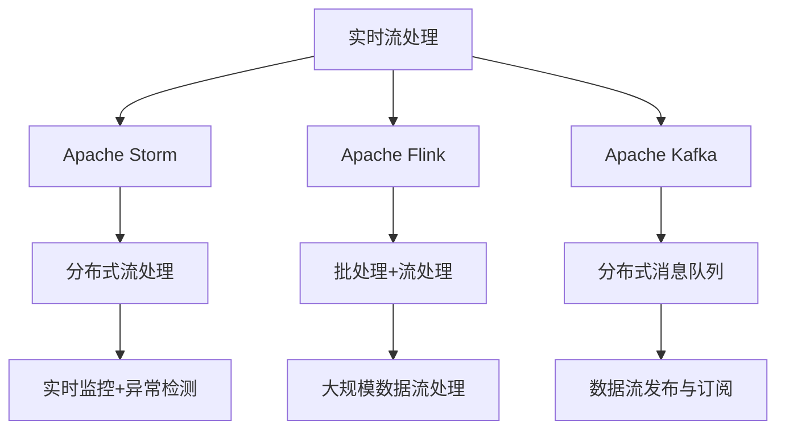
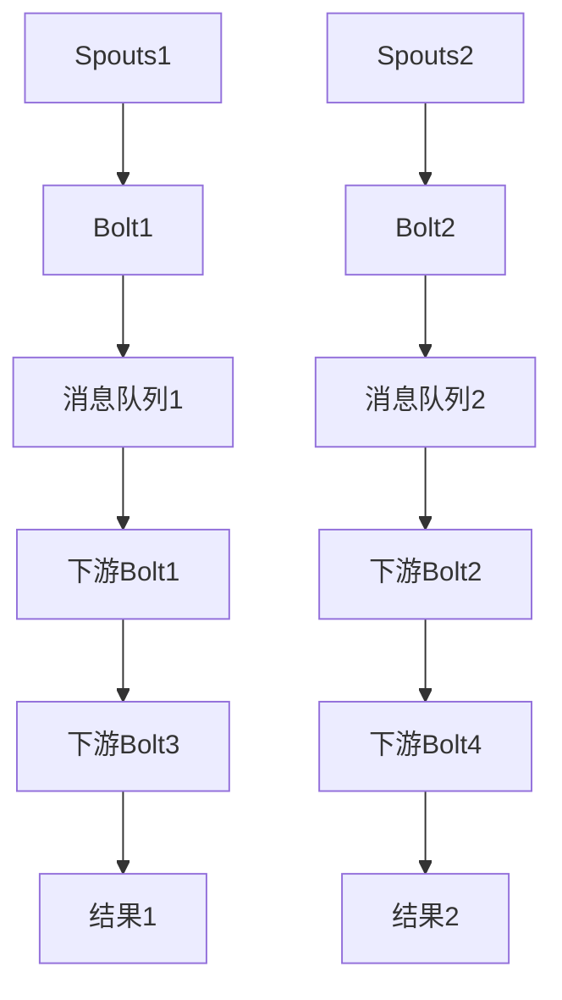
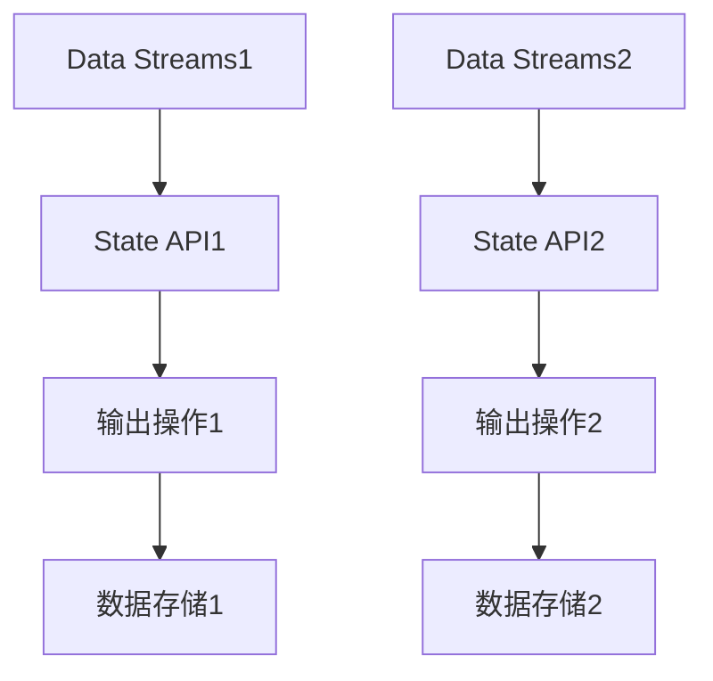

                 

# 实时大数据处理：Storm和Flink的应用

> 关键词：实时流处理, Storm, Flink, Apache Kafka, 分布式系统

## 1. 背景介绍

随着互联网和移动互联网的迅猛发展，全球数据产生量呈爆炸式增长，据预测到2025年全球数据总量将达到175ZB。海量数据带来的不仅是机遇，也带来了前所未有的挑战。如何高效处理和分析这些数据，从中挖掘有价值的信息，成为当下数据科学和工程领域的核心任务。

实时大数据处理技术应运而生。与批处理技术不同，实时大数据处理技术能够在数据产生后即时处理和分析，实时性是其主要优势。它不仅能够响应即时查询，还能对数据流进行实时监控和异常检测，从而更好地适应现代互联网应用场景。

本博文将详细介绍两种主流的实时大数据处理框架——Storm和Flink。首先，我们将在第二、第三部分深入探讨这两款框架的核心概念与联系，并对比它们的优缺点。然后，在第四到第六部分，我们详细介绍两者的核心算法原理与具体操作步骤，以及它们的应用领域。最后，在第七、第八部分，我们推荐一些学习资源，并总结两者的发展趋势与面临的挑战。

## 2. 核心概念与联系

### 2.1 核心概念概述

为更好地理解Storm和Flink的核心概念，本节将介绍几个密切相关的核心概念：

- 实时流处理(Real-time Stream Processing)：指在数据产生后即时进行处理和分析的技术，通常用于实时监控、异常检测、实时计算等领域。

- Apache Storm：一种开源分布式实时流处理框架，支持分布式实时计算和流处理任务，具有高可扩展性、高可靠性、高性能等优势。

- Apache Flink：一种开源流处理框架，支持批处理、流处理和增量计算，能够处理大规模数据流，并具备状态管理和机器学习功能。

- Apache Kafka：一种高性能分布式消息队列系统，支持大规模数据流发布与订阅，是Storm和Flink的重要数据源。

这些核心概念之间的逻辑关系可以通过以下Mermaid流程图来展示：



这个流程图展示了几者之间的关联关系：

1. 实时流处理是Storm和Flink的核心任务。
2. Storm通过Apache Kafka实现数据流发布与订阅，进行分布式流处理。
3. Flink支持批处理、流处理和增量计算，能够处理大规模数据流。
4. Kafka为Storm和Flink提供高效的消息传递机制，支持高并发、低延迟的数据流处理。
5. 通过Storm和Flink，可以实现实时监控、异常检测等实时应用场景。

## 3. 核心算法原理 & 具体操作步骤

### 3.1 算法原理概述

Storm和Flink的核心算法原理都基于分布式流处理模型。其基本思想是：将大型的数据流分解为多个小的数据流，在多个计算节点上并行处理，然后将处理结果合并起来，以实现对大规模数据流的实时处理。

具体而言，Storm和Flink都采用了一种基于数据流的分布式计算模型，它们将数据流分解为多个任务（Spouts、Bolt），任务之间通过消息队列进行通信，从而实现分布式计算。这种计算模型可以高效地处理大规模数据流，并具有良好的容错性和扩展性。

### 3.2 算法步骤详解

#### Storm的算法步骤

Storm的计算模型由Spouts和Bolts组成。Spouts负责生成数据流，Bolts负责数据处理和计算。Storm的计算流程如下：

1. 数据流从Spouts发出，被传输到Bolts进行计算。
2. Bolt对数据进行处理和计算，生成中间结果。
3. 中间结果通过消息队列传递给下游Bolt，继续进行处理和计算。
4. 最终的结果会存储到Kafka或数据库中。

#### Flink的算法步骤

Flink的计算模型也由Data Streams和State API组成。Data Streams负责数据流的处理，State API负责状态管理。Flink的计算流程如下：

1. 数据流从Data Streams中读取，进行数据处理和计算。
2. 数据处理过程中，Flink通过State API进行状态管理，将中间结果保存在内存或磁盘中。
3. 计算结果通过输出操作发送至Kafka或数据库中。

### 3.3 算法优缺点

#### Storm的优缺点

**优点：**

- 高可扩展性：Storm的计算模型具有很好的水平扩展性，可以根据需要添加更多的计算节点。
- 高可靠性：Storm采用了多副本机制和容错机制，保证数据的可靠性和计算的正确性。
- 高实时性：Storm支持毫秒级的实时处理，能够应对高频率、高流量的数据流。

**缺点：**

- 处理逻辑较为复杂：Storm的Spouts和Bolts都需要编写复杂的处理逻辑，增加了开发难度。
- 性能瓶颈明显：当数据流较大时，可能会遇到性能瓶颈，需要优化系统架构和计算模型。
- 不支持大规模批处理：Storm主要面向实时流处理，对大规模批处理的支持不足。

#### Flink的优缺点

**优点：**

- 高可扩展性：Flink的计算模型具有很好的水平扩展性，可以根据需要添加更多的计算节点。
- 高可靠性：Flink采用了多副本机制和容错机制，保证数据的可靠性和计算的正确性。
- 高兼容性：Flink支持多种数据源和数据存储，具有很好的兼容性。
- 支持大规模批处理：Flink不仅支持流处理，还支持大规模批处理，满足不同场景的需求。

**缺点：**

- 开发复杂度较高：Flink的API较为复杂，需要进行一定的学习成本。
- 系统调优难度大：Flink的性能优化需要较高的技术水平，需要深入理解系统架构和计算模型。
- 内存占用较大：Flink需要占用较多的内存和磁盘空间，不适合对内存资源有限的环境。

### 3.4 算法应用领域

Storm和Flink在多个领域得到了广泛应用，以下是一些典型的应用场景：

#### Storm的应用领域

- 实时监控和告警：Storm可以实时监控系统运行状态，生成告警信息，帮助企业及时发现和解决问题。
- 实时数据处理和分析：Storm可以处理大规模数据流，进行实时数据处理和分析，支持实时计算、实时报表等应用。
- 金融交易：Storm可以处理高频交易数据，进行实时计算和风险控制，支持金融机构的实时交易系统。
- 社交媒体分析：Storm可以处理社交媒体数据流，进行实时分析，支持社交媒体的实时监控和分析应用。

#### Flink的应用领域

- 实时数据处理和分析：Flink可以处理大规模数据流，进行实时数据处理和分析，支持实时计算、实时报表等应用。
- 数据仓库和批处理：Flink支持大规模批处理和增量计算，能够与传统的数据仓库和批处理系统无缝集成。
- 实时机器学习：Flink支持流式机器学习，能够对实时数据进行实时建模和预测，支持实时推荐、实时风险控制等应用。
- 大数据分析：Flink可以处理大规模数据集，进行大数据分析，支持Hadoop、Spark等大数据分析平台。

## 4. 数学模型和公式 & 详细讲解 & 举例说明

### 4.1 数学模型构建

Storm和Flink的数学模型都基于分布式流处理模型。其基本思想是：将大型的数据流分解为多个小的数据流，在多个计算节点上并行处理，然后将处理结果合并起来，以实现对大规模数据流的实时处理。

具体而言，Storm和Flink都采用了一种基于数据流的分布式计算模型，它们将数据流分解为多个任务（Spouts、Bolts），任务之间通过消息队列进行通信，从而实现分布式计算。这种计算模型可以高效地处理大规模数据流，并具有良好的容错性和扩展性。

### 4.2 公式推导过程

#### Storm的公式推导

Storm的计算模型由Spouts和Bolts组成。Spouts负责生成数据流，Bolts负责数据处理和计算。Storm的计算流程如下：

1. 数据流从Spouts发出，被传输到Bolts进行计算。
2. Bolt对数据进行处理和计算，生成中间结果。
3. 中间结果通过消息队列传递给下游Bolt，继续进行处理和计算。
4. 最终的结果会存储到Kafka或数据库中。

公式推导：

- 设数据流为 $D=\{d_1, d_2, \cdots, d_n\}$，其中 $d_i$ 表示第 $i$ 个数据流元素。
- 设Spouts为 $S$，Bolts为 $B$，它们之间的消息传递方式为 $S \rightarrow B$。
- 设消息队列为 $Q$，消息传递方式为 $B \rightarrow Q$。

则Storm的计算模型可以表示为：

$$
\begin{aligned}
D &= S \rightarrow B \rightarrow Q \rightarrow B \rightarrow \cdots \rightarrow B \rightarrow Q \rightarrow B \rightarrow D \\
&= S \rightarrow B_1 \rightarrow Q_1 \rightarrow B_2 \rightarrow \cdots \rightarrow B_{n-1} \rightarrow Q_{n-1} \rightarrow B_n \rightarrow Q_n \rightarrow D
\end{aligned}
$$

其中，$B_1, B_2, \cdots, B_{n-1}, B_n$ 表示多个Bolt，$Q_1, Q_2, \cdots, Q_{n-1}, Q_n$ 表示多个消息队列。

#### Flink的公式推导

Flink的计算模型也由Data Streams和State API组成。Data Streams负责数据流的处理，State API负责状态管理。Flink的计算流程如下：

1. 数据流从Data Streams中读取，进行数据处理和计算。
2. 数据处理过程中，Flink通过State API进行状态管理，将中间结果保存在内存或磁盘中。
3. 计算结果通过输出操作发送至Kafka或数据库中。

公式推导：

- 设数据流为 $D=\{d_1, d_2, \cdots, d_n\}$，其中 $d_i$ 表示第 $i$ 个数据流元素。
- 设Data Streams为 $DS$，State API为 $SA$，它们之间的数据处理方式为 $DS \rightarrow SA$。
- 设输出操作为 $O$，数据存储方式为 $O \rightarrow K$。

则Flink的计算模型可以表示为：

$$
\begin{aligned}
D &= DS \rightarrow SA \rightarrow O \rightarrow K \\
&= DS \rightarrow SA_1 \rightarrow O_1 \rightarrow K_1 \rightarrow DS \rightarrow SA_2 \rightarrow O_2 \rightarrow K_2 \rightarrow \cdots \rightarrow DS \rightarrow SA_n \rightarrow O_n \rightarrow K_n
\end{aligned}
$$

其中，$SA_1, SA_2, \cdots, SA_n$ 表示多个State API，$O_1, O_2, \cdots, O_n$ 表示多个输出操作，$K_1, K_2, \cdots, K_n$ 表示多个数据存储方式。

### 4.3 案例分析与讲解

#### Storm的案例分析

假设有两个Spouts和两个Bolts，Spouts 1 和 Spouts 2 分别生成数据流 $D_1$ 和 $D_2$。Bolt 1 和 Bolt 2 分别处理这两个数据流，生成中间结果 $D_1'$ 和 $D_2'$。最后，中间结果通过消息队列传递给下游Bolt，最终得到结果 $D'$。



在实现中，Spouts和Bolts都需要编写处理逻辑。例如，Spouts可以生成一些简单的数据，如时间戳、日志信息等。Bolts可以处理这些数据，进行一些复杂的计算和分析，生成中间结果。消息队列用于传递中间结果，保证数据的可靠性和有序性。

#### Flink的案例分析

假设有两个Data Streams和两个State API，Data Streams 1 和 Data Streams 2 分别读取数据流 $D_1$ 和 $D_2$，通过State API进行状态管理，将中间结果 $D_1'$ 和 $D_2'$ 保存在内存或磁盘中。最后，中间结果通过输出操作发送至Kafka或数据库中。



在实现中，Data Streams可以读取数据流，进行数据处理和计算。State API可以保存中间结果，支持状态管理，保证计算的准确性和可靠性。输出操作可以将中间结果发送至Kafka或数据库中，支持数据存储和访问。

## 5. 项目实践：代码实例和详细解释说明

### 5.1 开发环境搭建

在进行Storm和Flink的实践前，我们需要准备好开发环境。以下是使用Python进行Storm和Flink开发的环境配置流程：

1. 安装Apache Kafka：从官网下载并安装Kafka，确保其能正常运行。

2. 安装Apache Storm：从官网下载并安装Storm，安装过程中需要配置好Kafka和Zookeeper等组件。

3. 安装Apache Flink：从官网下载并安装Flink，安装过程中需要配置好Kafka和Zookeeper等组件。

4. 安装Python和相关依赖：安装Python 3.x版本，并使用pip安装Python的客户端库，如pykafka、pyflink等。

完成上述步骤后，即可在本地搭建好Storm和Flink的开发环境，进行后续的开发和调试。

### 5.2 源代码详细实现

下面我们以Storm和Flink的实时流处理为例，给出使用Python实现的基本代码。

#### Storm的代码实现

```python
from pykafka import KafkaClient
from py4j.java_gateway import JavaGateway
from storm import Topology, Spout, Bolt

class SpoutExample(Spout):
    def next_tuple(self):
        yield "spout_example"

    def declare_success(self, tup):
        pass

    def declare_failure(self, tup, err):
        pass

class BoltExample(Bolt):
    def process(self, tup):
        print("Bolt_example processed a tuple: %s" % tup)

def main():
    kafka_config = {"bootstrap.servers": "localhost:9092"}
    java_gateway = JavaGateway()

    kafka_client = KafkaClient(kafka_config)
    kafka_producer = kafka_client.create_producer()
    kafka_consumer = kafka_client.create_consumer()
    kafka_consumer.subscribe(topics=["spout_example"])

    storm_config = {"zookeeper.connect": "localhost:2181"}
    storm_topology = Topology("storm_example")
    storm_topology.add_spout(SpoutExample(), "spout_example")
    storm_topology.add_bolt(BoltExample(), "bolt_example")
    storm_topology.add_stream("spout_example", "bolt_example")

    storm_topology.submit_topology()

if __name__ == "__main__":
    main()
```

在上述代码中，我们定义了两个类，一个Spout类和一个Bolt类，分别表示数据流和数据处理节点。Spout类实现了`next_tuple`方法，生成一个简单的数据流，Bolt类实现了`process`方法，处理数据流。

通过这些代码，我们可以将数据流从Spout类传递给Bolt类，并在Bolt类中进行处理和输出。整个流程被封装在一个Storm Topology中，并通过JavaGateway提交到Storm集群中执行。

#### Flink的代码实现

```python
from pyflink.datastream import StreamExecutionEnvironment
from pyflink.table import StreamTableEnvironment
from pyflink.table.descriptors import Schema, SchemaUtil

def main():
    env = StreamExecutionEnvironment.get_execution_environment()
    env.set_parallelism(1)
    env.set_global_data_manager("Memory")

    table_env = StreamTableEnvironment.create(env)
    table_env.create_table("kafka_source", SchemaUtil.map_schema(
        {"timestamp": "BIGINT", "value": "VARCHAR"}),
        KafkaSourceBuilder.build()
    )

    result = table_env.sql_query("SELECT * FROM kafka_source").execute()
    print(result)

if __name__ == "__main__":
    main()
```

在上述代码中，我们首先创建了一个StreamExecutionEnvironment，并通过`set_parallelism`方法设置并行度为1，通过`set_global_data_manager`方法设置全局数据管理器为Memory。接着，我们通过`StreamTableEnvironment`创建了一个KafkaSource，并将其与Flink的流处理环境绑定。最后，我们通过SQL查询KafkaSource，并打印输出结果。

### 5.3 代码解读与分析

让我们再详细解读一下关键代码的实现细节：

#### Storm的代码解读

在Storm的代码实现中，我们定义了一个Spout类和一个Bolt类，分别表示数据流和数据处理节点。

Spout类实现了`next_tuple`方法，生成一个简单的数据流。例如，我们可以生成一些时间戳或日志信息，作为Spouts的数据流。

Bolt类实现了`process`方法，处理数据流。例如，我们可以对数据流进行一些简单的处理和计算，如过滤、聚合等。

在实际的Storm应用中，我们需要将数据流从Spout类传递给Bolt类，并在Bolt类中进行处理和输出。这些数据流和处理节点被封装在一个Storm Topology中，并通过JavaGateway提交到Storm集群中执行。

#### Flink的代码解读

在Flink的代码实现中，我们首先创建了一个StreamExecutionEnvironment，并通过`set_parallelism`方法设置并行度为1，通过`set_global_data_manager`方法设置全局数据管理器为Memory。

接着，我们通过`StreamTableEnvironment`创建了一个KafkaSource，并将其与Flink的流处理环境绑定。KafkaSource是一个支持流式数据的输入源，可以通过Kafka获取数据流。

最后，我们通过SQL查询KafkaSource，并打印输出结果。在实际的Flink应用中，我们可以使用不同的API进行数据处理和计算，如Stream API、Table API等。

## 6. 实际应用场景

### 6.1 实时监控和告警

实时监控和告警是Storm和Flink的重要应用场景之一。通过实时监控系统运行状态，生成告警信息，帮助企业及时发现和解决问题。

在实际应用中，我们可以将系统的日志、异常信息等数据流输入Storm或Flink中进行实时处理。通过Spouts和Bolts，进行数据过滤、聚合和分析，生成告警信息和报告，并将其发送至Kafka或数据库中。这样，企业可以快速响应系统异常，提升系统的稳定性和可靠性。

### 6.2 实时数据处理和分析

实时数据处理和分析是Storm和Flink的另一重要应用场景。通过实时处理大规模数据流，进行数据挖掘和分析，支持实时计算、实时报表等应用。

在实际应用中，我们可以将各种数据流（如交易数据、用户行为数据、社交媒体数据等）输入Storm或Flink中进行实时处理。通过Spouts和Bolts，进行数据清洗、转换、聚合和分析，生成实时计算结果和报表，并将其发送至Kafka或数据库中。这样，企业可以实时了解业务动态，快速做出决策。

### 6.3 金融交易

金融交易是Storm和Flink的重要应用场景之一。通过实时处理高频交易数据，进行实时计算和风险控制，支持金融机构的实时交易系统。

在实际应用中，我们可以将各种金融交易数据（如股票交易数据、外汇交易数据、期货交易数据等）输入Storm或Flink中进行实时处理。通过Spouts和Bolts，进行数据清洗、转换、聚合和分析，生成实时计算结果和风险控制指标，并将其发送至Kafka或数据库中。这样，金融机构可以实时监控交易动态，及时控制风险。

### 6.4 社交媒体分析

社交媒体分析是Storm和Flink的重要应用场景之一。通过实时处理社交媒体数据流，进行实时分析，支持社交媒体的实时监控和分析应用。

在实际应用中，我们可以将各种社交媒体数据（如微博、微信、Twitter等）输入Storm或Flink中进行实时处理。通过Spouts和Bolts，进行数据清洗、转换、聚合和分析，生成实时分析结果和报告，并将其发送至Kafka或数据库中。这样，企业可以实时了解社交媒体动态，快速做出决策。

## 7. 工具和资源推荐

### 7.1 学习资源推荐

为了帮助开发者系统掌握Storm和Flink的理论基础和实践技巧，这里推荐一些优质的学习资源：

1. 《Apache Storm: The Definitive Guide》：一本详细介绍Storm的书籍，从基础到高级全面覆盖Storm的各个方面。

2. 《Apache Flink: A definitive guide》：一本详细介绍Flink的书籍，从基础到高级全面覆盖Flink的各个方面。

3. Apache Storm官网文档：Storm的官方文档，提供了完整的API参考和示例代码，是学习Storm的必备资料。

4. Apache Flink官网文档：Flink的官方文档，提供了完整的API参考和示例代码，是学习Flink的必备资料。

5. Coursera上的Apache Flink课程：由Flink的开发者讲解的Flink课程，系统介绍了Flink的各个方面，适合初学者入门。

6. Coursera上的Apache Storm课程：由Storm的开发者讲解的Storm课程，系统介绍了Storm的各个方面，适合初学者入门。

通过对这些资源的学习实践，相信你一定能够快速掌握Storm和Flink的核心概念和实践技巧，并用于解决实际的业务问题。

### 7.2 开发工具推荐

高效的开发离不开优秀的工具支持。以下是几款用于Storm和Flink开发的常用工具：

1. Py4J：用于Python与Java之间的通信和调用，支持远程函数调用、序列化等操作，是Storm和Flink的必备工具。

2. Pykafka：用于Python与Kafka之间的通信，支持生产者和消费者操作，是Storm和Flink的必备工具。

3. Pyflink：用于Python与Flink之间的通信，支持数据流处理、数据状态管理等操作，是Flink的必备工具。

4. Apache Spark：与Storm和Flink兼容的数据处理引擎，支持大规模数据处理和实时计算，是Storm和Flink的重要补充。

5. Apache Kafka Connect：用于Kafka与外部系统之间的数据传输，支持数据的导入、导出和转换，是Storm和Flink的重要数据源。

6. Apache Spark Streaming：基于Spark的数据流处理框架，支持大规模数据流处理和实时计算，是Storm和Flink的重要补充。

合理利用这些工具，可以显著提升Storm和Flink应用的开发效率，加快创新迭代的步伐。

### 7.3 相关论文推荐

Storm和Flink在多个领域得到了广泛应用，以下是几篇奠基性的相关论文，推荐阅读：

1. 《Real-time stream processing with Apache Storm》：介绍Storm的基本原理和应用场景，是Storm的重要参考。

2. 《Streaming data processing with Apache Flink》：介绍Flink的基本原理和应用场景，是Flink的重要参考。

3. 《A unified approach for real-time and batch data processing with Apache Flink》：介绍Flink的统一计算模型，适合深入了解Flink的核心思想。

4. 《Hadoop Streaming》：介绍Hadoop的流处理技术，适合了解批处理与流处理的区别和联系。

5. 《Data Privacy in Streaming with Apache Storm》：介绍Storm在数据隐私保护方面的应用，适合了解Storm的安全性和隐私保护。

这些论文代表了大数据处理技术的最新进展，通过学习这些前沿成果，可以帮助研究者把握学科前进方向，激发更多的创新灵感。

## 8. 总结：未来发展趋势与挑战

### 8.1 总结

本文对Apache Storm和Apache Flink的实时流处理技术进行了全面系统的介绍。首先，我们深入探讨了Storm和Flink的核心概念与联系，并对比了它们的优缺点。其次，我们详细介绍了两者的核心算法原理与具体操作步骤，以及它们的应用领域。最后，我们推荐了一些学习资源，并总结了两者的发展趋势与面临的挑战。

通过本文的系统梳理，可以看到，Storm和Flink作为主流的实时流处理框架，已经在多个领域得到了广泛应用，为实时数据处理和分析提供了强有力的支持。Storm和Flink的强大功能和优秀的性能，使得它们在实时流处理领域具有不可替代的地位。

### 8.2 未来发展趋势

展望未来，Storm和Flink的实时流处理技术将呈现以下几个发展趋势：

1. 高可扩展性：随着数据流量的不断增长，Storm和Flink将进一步提升其高可扩展性，支持更大量的数据流处理。

2. 高可用性：Storm和Flink将进一步提升其高可用性，支持多副本机制和容错机制，保证数据流的可靠性和计算的正确性。

3. 高兼容性：Storm和Flink将进一步提升其高兼容性，支持多种数据源和数据存储，具有更广泛的应用场景。

4. 高安全性：Storm和Flink将进一步提升其高安全性，支持数据加密、访问控制等安全措施，保障数据安全和隐私。

5. 高性能：Storm和Flink将进一步提升其高性能，支持更多的优化策略和算法，提升处理速度和响应时间。

6. 高可维护性：Storm和Flink将进一步提升其高可维护性，支持更灵活的开发和调试工具，降低维护成本。

以上趋势凸显了Storm和Flink的强大实力和广阔前景。这些方向的探索发展，必将进一步提升实时流处理技术的应用水平，为更多领域带来变革性影响。

### 8.3 面临的挑战

尽管Storm和Flink在实时流处理领域已经取得了卓越的成就，但在迈向更加智能化、普适化应用的过程中，它们仍面临着诸多挑战：

1. 开发难度高：Storm和Flink的API较为复杂，需要进行一定的学习成本。开发者需要具备较高的技术水平和经验。

2. 性能优化难度大：Storm和Flink的性能优化需要较高的技术水平，需要深入理解系统架构和计算模型。

3. 资源消耗大：Storm和Flink需要占用较多的内存和磁盘空间，不适合对内存资源有限的环境。

4. 系统调优难度大：Storm和Flink的系统调优需要较高的技术水平，需要深入理解系统架构和计算模型。

5. 安全性和隐私问题：Storm和Flink的数据流处理过程中，需要考虑数据的安全性和隐私保护。

6. 兼容性问题：Storm和Flink需要与其他系统和工具兼容，存在兼容性问题。

正视Storm和Flink面临的这些挑战，积极应对并寻求突破，将是大数据处理技术不断发展的关键。相信随着技术的不断进步，Storm和Flink必将在实时流处理领域继续引领潮流，为实时数据处理和分析带来更多创新。

### 8.4 研究展望

面向未来，Storm和Flink的研究将在以下几个方面寻求新的突破：

1. 高可扩展性：进一步提升Storm和Flink的高可扩展性，支持更大量的数据流处理。

2. 高可用性：进一步提升Storm和Flink的高可用性，支持多副本机制和容错机制，保证数据流的可靠性和计算的正确性。

3. 高兼容性：进一步提升Storm和Flink的高兼容性，支持多种数据源和数据存储，具有更广泛的应用场景。

4. 高安全性：进一步提升Storm和Flink的高安全性，支持数据加密、访问控制等安全措施，保障数据安全和隐私。

5. 高性能：进一步提升Storm和Flink的高性能，支持更多的优化策略和算法，提升处理速度和响应时间。

6. 高可维护性：进一步提升Storm和Flink的高可维护性，支持更灵活的开发和调试工具，降低维护成本。

这些研究方向将引领Storm和Flink技术的不断进步，推动实时流处理技术的广泛应用，为更多领域带来变革性影响。

## 9. 附录：常见问题与解答

**Q1：Storm和Flink有什么区别？**

A: Storm和Flink都是主流的实时流处理框架，但它们在架构、应用场景、API等方面存在一些区别。

- 架构：Storm的架构基于Spouts和Bolts，Flink的架构基于Data Streams和State API。
- 应用场景：Storm适用于高频率、高流量的数据流处理，Flink适用于大规模数据流处理和大规模批处理。
- API：Storm的API较为简单，适合快速开发和调试，Flink的API较为复杂，适合深度开发和优化。

**Q2：Storm和Flink如何保证数据可靠性？**

A: Storm和Flink都采用了多副本机制和容错机制，保证数据可靠性和计算正确性。

- Storm使用多副本机制，每个Spout和Bolt都有多个实例，保证数据不会丢失。
- Flink使用Checkpoint机制，周期性地保存数据状态，在任务失败时可以从Checkpoint中恢复数据。

**Q3：Storm和Flink如何优化性能？**

A: Storm和Flink都采用了多种优化策略，提升性能。

- Storm支持梯度下降、反剪枝等优化策略，减少计算量和内存消耗。
- Flink支持并发度控制、优化器等优化策略，提升计算速度和响应时间。

**Q4：Storm和Flink如何保障数据安全？**

A: Storm和Flink都支持多种数据加密和访问控制机制，保障数据安全。

- Storm支持SSL/TLS加密数据传输，支持访问控制策略。
- Flink支持数据加密、访问控制、审计日志等安全措施，保障数据安全。

**Q5：Storm和Flink如何选择数据源和数据存储？**

A: Storm和Flink支持多种数据源和数据存储，需要根据具体应用场景选择。

- Storm支持Kafka、HDFS、Hive等数据源和数据存储，适用于实时数据流处理。
- Flink支持Kafka、HDFS、Hive等数据源和数据存储，适用于大规模数据流处理和大规模批处理。

总之，Storm和Flink作为主流的实时流处理框架，已经在多个领域得到了广泛应用，为实时数据处理和分析提供了强有力的支持。未来，随着技术的不断进步，Storm和Flink必将在实时流处理领域继续引领潮流，推动实时流处理技术的广泛应用。

---

作者：禅与计算机程序设计艺术 / Zen and the Art of Computer Programming

