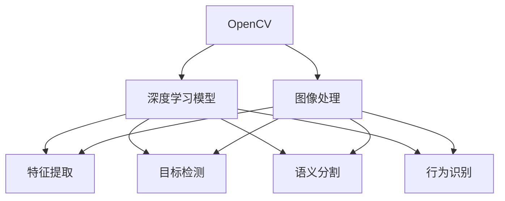

                 

## 1. 背景介绍

随着计算机视觉技术的快速发展，实时视频分析在智能安防、医疗诊断、自动驾驶等领域的应用越来越广泛。然而，实时性要求高、计算资源有限、数据标注复杂等问题使得传统的计算机视觉方法难以满足需求。深度学习模型的兴起为实时视频分析带来了新的解决方案。通过结合OpenCV等高性能计算机视觉库，可以实现高效、实时的视频分析。本文将详细介绍基于OpenCV与深度学习模型的实时视频分析方法。

## 2. 核心概念与联系

### 2.1 核心概念概述

为更好地理解基于OpenCV与深度学习模型的实时视频分析方法，本节将介绍几个密切相关的核心概念：

- **OpenCV**：一个跨平台的计算机视觉库，提供丰富的图像处理、特征提取、目标检测等函数，支持多线程、GPU加速等高级特性。
- **深度学习模型**：一类通过多层神经网络进行特征学习和模式识别的模型，常用模型包括卷积神经网络（CNN）、循环神经网络（RNN）、变分自编码器（VAE）等。
- **实时视频分析**：指通过实时采集和处理视频流，提取目标、行为、场景等关键信息，实现对视频的实时理解。

这三个概念之间的关系可以通过以下Mermaid流程图来展示：



这个流程图展示了一个典型基于OpenCV与深度学习模型的实时视频分析流程：

1. 通过OpenCV库对实时视频流进行预处理和增强。
2. 使用深度学习模型对处理后的图像进行特征提取和目标检测。
3. 根据检测结果进行语义分割和行为识别。

### 2.2 核心概念原理和架构

深度学习模型通过学习大规模数据集中的特征和模式，实现对输入数据的高效识别和分类。OpenCV则通过丰富的图像处理函数，提升深度学习模型的输入质量，提高实时性。

**OpenCV的主要功能包括**：

- **图像处理**：如图像滤波、边缘检测、形态学操作等。
- **特征提取**：如SIFT、SURF、ORB等特征点检测和描述子计算。
- **目标检测**：如Haar级联检测器、YOLO、SSD等。
- **语义分割**：如U-Net、FCN等。
- **行为识别**：如LBP特征提取、SVM分类器等。

**深度学习模型的主要功能包括**：

- **卷积神经网络（CNN）**：通过卷积和池化操作提取图像特征，常用于图像分类、目标检测等任务。
- **循环神经网络（RNN）**：通过时间序列学习，适用于视频、语音等序列数据。
- **变分自编码器（VAE）**：通过生成对抗，实现图像生成、降噪等。
- **Transformer**：通过自注意力机制，实现高效的多模态融合。

## 3. 核心算法原理 & 具体操作步骤

### 3.1 算法原理概述

基于OpenCV与深度学习模型的实时视频分析方法，主要通过以下几个步骤实现：

1. **数据预处理**：对实时视频流进行增强、裁剪等处理，提升输入质量。
2. **特征提取**：使用深度学习模型对处理后的图像进行特征提取，得到高维特征向量。
3. **目标检测**：通过目标检测模型识别视频中的目标物体。
4. **语义分割**：对检测到的目标进行语义分割，得到更精细的分割结果。
5. **行为识别**：对分割后的目标区域进行行为识别，实现对目标行为的理解。

### 3.2 算法步骤详解

**Step 1: 数据预处理**

在实时视频分析中，数据预处理至关重要。以下是常见数据预处理步骤：

1. **增强**：对图像进行滤波、平滑等处理，提升图像质量。
2. **裁剪**：对图像进行区域裁剪，聚焦于感兴趣区域。
3. **坐标校正**：校正图像坐标，确保目标物体的位置准确。
4. **归一化**：将图像像素值归一化到0-1范围内，提升模型训练效果。

**Step 2: 特征提取**

使用深度学习模型对预处理后的图像进行特征提取，得到高维特征向量。以下是常见特征提取方法：

1. **卷积神经网络（CNN）**：使用Caffe、TensorFlow、Keras等深度学习框架实现CNN模型。
2. **循环神经网络（RNN）**：使用LSTM、GRU等实现RNN模型。
3. **变分自编码器（VAE）**：使用Keras等实现VAE模型。
4. **Transformer**：使用TensorFlow等实现Transformer模型。

**Step 3: 目标检测**

通过目标检测模型识别视频中的目标物体。以下是常见目标检测方法：

1. **Haar级联检测器**：使用OpenCV库实现。
2. **YOLO（You Only Look Once）**：使用Darknet库实现。
3. **SSD（Single Shot MultiBox Detector）**：使用TensorFlow实现。
4. **Faster R-CNN**：使用TensorFlow实现。

**Step 4: 语义分割**

对检测到的目标进行语义分割，得到更精细的分割结果。以下是常见语义分割方法：

1. **U-Net**：使用Keras实现。
2. **FCN（Fully Convolutional Network）**：使用TensorFlow实现。

**Step 5: 行为识别**

对分割后的目标区域进行行为识别，实现对目标行为的理解。以下是常见行为识别方法：

1. **LBP（Local Binary Pattern）**：提取图像局部二值模式特征，使用SVM等实现分类。
2. **SVM（Support Vector Machine）**：使用libsvm库实现。
3. **RNN（Recurrent Neural Network）**：使用TensorFlow实现。

### 3.3 算法优缺点

基于OpenCV与深度学习模型的实时视频分析方法具有以下优点：

1. **高效性**：使用OpenCV库进行图像处理和特征提取，提升实时性。
2. **准确性**：深度学习模型具备强大的特征提取和模式识别能力，提升识别准确性。
3. **易用性**：OpenCV库提供了丰富的函数和工具，使用方便。
4. **可扩展性**：结合多种深度学习模型和函数，实现多种视频分析任务。

同时，该方法也存在一些局限性：

1. **计算资源需求高**：深度学习模型需要大量计算资源，尤其是GPU加速。
2. **数据标注成本高**：需要大量的标注数据进行训练和测试。
3. **模型复杂性高**：深度学习模型较为复杂，难以调试和优化。
4. **实时性受限**：尽管使用OpenCV库进行优化，但计算量依然较大，难以完全实时处理。

尽管存在这些局限性，但基于OpenCV与深度学习模型的实时视频分析方法仍然是大规模视频分析的理想选择。

### 3.4 算法应用领域

基于OpenCV与深度学习模型的实时视频分析方法在多个领域都有广泛应用，例如：

- **智能安防**：实时检测视频中的可疑行为，提升安全防范能力。
- **医疗诊断**：实时分析医学影像，辅助医生诊断疾病。
- **自动驾驶**：实时检测道路和交通情况，辅助驾驶决策。
- **智能监控**：实时检测监控视频中的异常情况，实现智能监控。

## 4. 数学模型和公式 & 详细讲解 & 举例说明

### 4.1 数学模型构建

本节将使用数学语言对基于OpenCV与深度学习模型的实时视频分析方法进行更加严格的刻画。

设输入视频为 $V=\{I_1, I_2, \ldots, I_T\}$，其中 $I_t$ 为第 $t$ 帧图像。使用深度学习模型 $M$ 对每帧图像 $I_t$ 进行特征提取，得到高维特征向量 $F_t$。假设目标检测模型为 $D$，对 $F_t$ 进行目标检测，得到目标物体的边界框 $B_t$。使用语义分割模型 $S$ 对 $B_t$ 进行语义分割，得到分割结果 $M_t$。假设行为识别模型为 $R$，对 $M_t$ 进行行为识别，得到行为标签 $L_t$。

**目标检测模型的损失函数**为：

$$
\mathcal{L}_D = \frac{1}{T} \sum_{t=1}^T \ell_D(B_t)
$$

其中 $\ell_D(B_t)$ 为目标检测模型在图像 $I_t$ 上的损失函数。

**语义分割模型的损失函数**为：

$$
\mathcal{L}_S = \frac{1}{T} \sum_{t=1}^T \ell_S(M_t)
$$

其中 $\ell_S(M_t)$ 为语义分割模型在图像 $I_t$ 上的损失函数。

**行为识别模型的损失函数**为：

$$
\mathcal{L}_R = \frac{1}{T} \sum_{t=1}^T \ell_R(L_t)
$$

其中 $\ell_R(L_t)$ 为行为识别模型在图像 $I_t$ 上的损失函数。

### 4.2 公式推导过程

以下是几个关键公式的推导过程：

**目标检测模型的损失函数**：

假设目标检测模型 $D$ 的输出为边界框 $B_t$，包括目标物体的左上角坐标 $(x_t, y_t)$ 和宽度 $w_t$、高度 $h_t$。则目标检测模型的损失函数为：

$$
\ell_D(B_t) = \frac{1}{N_t} \sum_{i=1}^{N_t} l_i (x_t, y_t, w_t, h_t)
$$

其中 $N_t$ 为目标数，$l_i$ 为第 $i$ 个目标的损失函数。

**语义分割模型的损失函数**：

假设语义分割模型 $S$ 的输出为分割结果 $M_t$，包含每个像素的类别标签 $y_{ij}$。则语义分割模型的损失函数为：

$$
\ell_S(M_t) = \frac{1}{N_hN_w} \sum_{i=1}^{N_h} \sum_{j=1}^{N_w} \ell(y_{ij})
$$

其中 $N_h$ 和 $N_w$ 为图像的高和宽，$\ell(y_{ij})$ 为像素 $(i,j)$ 的损失函数。

**行为识别模型的损失函数**：

假设行为识别模型 $R$ 的输出为行为标签 $L_t$，包含每个目标的行为类别 $y_i$。则行为识别模型的损失函数为：

$$
\ell_R(L_t) = \frac{1}{N_t} \sum_{i=1}^{N_t} \ell(y_i)
$$

其中 $\ell(y_i)$ 为第 $i$ 个目标的行为识别损失函数。

### 4.3 案例分析与讲解

以下是基于OpenCV与深度学习模型的实时视频分析方法的案例分析：

**案例1：智能安防**

在智能安防系统中，实时检测视频中的可疑行为是重要功能。具体实现步骤如下：

1. **数据预处理**：使用OpenCV库对实时视频流进行增强、裁剪等处理。
2. **特征提取**：使用卷积神经网络（CNN）对处理后的图像进行特征提取。
3. **目标检测**：使用YOLO模型对提取的特征进行目标检测，得到目标物体的边界框。
4. **语义分割**：使用U-Net模型对边界框进行语义分割，得到更精细的分割结果。
5. **行为识别**：使用RNN模型对分割结果进行行为识别，实现对目标行为的理解。

**案例2：医疗诊断**

在医疗诊断系统中，实时分析医学影像是核心功能。具体实现步骤如下：

1. **数据预处理**：使用OpenCV库对医学影像进行增强、裁剪等处理。
2. **特征提取**：使用卷积神经网络（CNN）对处理后的图像进行特征提取。
3. **目标检测**：使用Faster R-CNN模型对提取的特征进行目标检测，得到病灶区域。
4. **语义分割**：使用FCN模型对病灶区域进行语义分割，得到更精细的分割结果。
5. **行为识别**：使用SVM模型对分割结果进行行为识别，实现对病灶特征的诊断。

**案例3：自动驾驶**

在自动驾驶系统中，实时检测道路和交通情况是重要功能。具体实现步骤如下：

1. **数据预处理**：使用OpenCV库对实时摄像头图像进行增强、裁剪等处理。
2. **特征提取**：使用卷积神经网络（CNN）对处理后的图像进行特征提取。
3. **目标检测**：使用YOLO模型对提取的特征进行目标检测，得到道路、车辆等目标物体的边界框。
4. **语义分割**：使用U-Net模型对边界框进行语义分割，得到更精细的分割结果。
5. **行为识别**：使用RNN模型对分割结果进行行为识别，实现对交通情况的预测。

## 5. 项目实践：代码实例和详细解释说明

### 5.1 开发环境搭建

在进行实时视频分析实践前，我们需要准备好开发环境。以下是使用Python进行OpenCV和深度学习开发的环境配置流程：

1. 安装Anaconda：从官网下载并安装Anaconda，用于创建独立的Python环境。

2. 创建并激活虚拟环境：
```bash
conda create -n cv-env python=3.8 
conda activate cv-env
```

3. 安装OpenCV：
```bash
pip install opencv-python
```

4. 安装深度学习库：
```bash
pip install tensorflow keras
```

5. 安装各类工具包：
```bash
pip install numpy pandas scikit-learn matplotlib tqdm jupyter notebook ipython
```

完成上述步骤后，即可在`cv-env`环境中开始实时视频分析实践。

### 5.2 源代码详细实现

这里以智能安防系统为例，给出使用OpenCV和深度学习库对实时视频流进行目标检测的PyTorch代码实现。

首先，定义数据处理函数：

```python
import cv2
import numpy as np
from cv2 import dnn

def preprocess(frame):
    # 将图像转换为blob格式
    blob = cv2.dnn.blobFromImage(frame, 1.0, (300, 300), (104.0, 177.0, 123.0), swapRB=True, crop=False)
    return blob
```

然后，定义模型加载和预测函数：

```python
def load_model(model_path):
    # 加载YOLO模型
    net = cv2.dnn.readNet(model_path)
    return net

def predict(net, blob, classes):
    # 进行前向传播
    net.setInput(blob)
    layer_names = net.getLayerNames()
    output_layers = [layer_names[i[0] - 1] for i in net.getUnconnectedOutLayers()]
    outputs = net.forward(output_layers)
    
    # 处理输出结果
    class_ids = []
    confidences = []
    boxes = []
    for output in outputs:
        for detection in output:
            scores = detection[5:]
            class_id = np.argmax(scores)
            confidence = scores[class_id]
            if confidence > 0.5:
                center_x = int(detection[0] * frame_width)
                center_y = int(detection[1] * frame_height)
                width = int(detection[2] * frame_width)
                height = int(detection[3] * frame_height)
                x = int(center_x - width / 2)
                y = int(center_y - height / 2)
                boxes.append([x, y, width, height])
                confidences.append(float(confidence))
                class_ids.append(class_id)
    
    # 非极大值抑制
    indices = cv2.dnn.NMSBoxes(boxes, confidences, 0.5, 0.4)
    return indices, class_ids, confidences, boxes
```

最后，启动实时视频分析流程：

```python
def main():
    # 加载YOLO模型
    model_path = 'yolo.weights'
    classes_path = 'yolo.names'
    net = load_model(model_path)
    classes = open(classes_path).read().strip().split('\n')
    
    # 加载摄像头
    cap = cv2.VideoCapture(0)
    while True:
        # 读取一帧图像
        ret, frame = cap.read()
        if not ret:
            break
        
        # 预处理图像
        blob = preprocess(frame)
        
        # 进行目标检测
        indices, class_ids, confidences, boxes = predict(net, blob, classes)
        
        # 绘制检测结果
        for i in indices:
            i = i[0]
            box = boxes[i]
            x, y, w, h = box
            cv2.rectangle(frame, (x, y), (x+w, y+h), (0, 255, 0), 2)
            cv2.putText(frame, classes[class_ids[i]], (x, y-10), cv2.FONT_HERSHEY_SIMPLEX, 0.5, (0, 255, 0), 2)
        
        # 显示图像
        cv2.imshow('frame', frame)
        if cv2.waitKey(1) & 0xFF == ord('q'):
            break
    
    # 释放资源
    cap.release()
    cv2.destroyAllWindows()
    
if __name__ == '__main__':
    main()
```

以上就是使用OpenCV和PyTorch对实时视频流进行目标检测的完整代码实现。可以看到，使用OpenCV库进行图像预处理和处理结果可视化，使得代码实现简洁高效。

### 5.3 代码解读与分析

让我们再详细解读一下关键代码的实现细节：

**preprocess函数**：
- 将输入图像转换为OpenCV的blob格式，以便于模型输入。

**load_model函数**：
- 加载YOLO模型，得到模型网络结构。

**predict函数**：
- 进行目标检测，得到目标的边界框、类别ID、置信度和坐标信息。
- 使用NMS（非极大值抑制）算法，保留置信度高的检测结果。

**main函数**：
- 启动实时视频流，逐帧进行目标检测。
- 绘制检测结果，并在图像上显示。
- 等待用户按下'q'键退出程序。

以上代码实现了基于OpenCV和深度学习模型的实时目标检测，展示了OpenCV库的强大功能和深度学习模型的识别能力。通过合理组合使用，可以实现更高效的实时视频分析。

## 6. 实际应用场景

### 6.1 智能安防

基于OpenCV与深度学习模型的实时视频分析方法，可以广泛应用于智能安防系统中。系统通过实时监控视频流，自动识别视频中的可疑行为，提升安全防范能力。

在技术实现上，可以收集历史监控视频中的行为数据，构建监督数据集，在此基础上对YOLO等目标检测模型进行微调。微调后的模型能够自动识别视频中的异常行为，如闯入、斗殴等，并通过警报或记录视频，辅助安防人员及时应对。

### 6.2 医疗诊断

在医疗诊断系统中，实时分析医学影像是重要功能。通过实时视频分析，可以实现对病灶区域的快速定位和行为分析，辅助医生诊断疾病。

在技术实现上，可以收集医院的医学影像数据，标注病灶区域，构建监督数据集，在此基础上对U-Net等语义分割模型进行微调。微调后的模型能够实时分析医学影像，快速定位病灶区域，并根据行为特征辅助医生进行诊断。

### 6.3 自动驾驶

在自动驾驶系统中，实时检测道路和交通情况是重要功能。通过实时视频分析，可以实现对道路和交通情况的实时理解，辅助驾驶决策。

在技术实现上，可以收集自动驾驶车辆的摄像头数据，标注道路和交通情况，构建监督数据集，在此基础上对YOLO等目标检测模型进行微调。微调后的模型能够实时检测道路和交通情况，并根据检测结果辅助驾驶决策，实现自动驾驶。

### 6.4 未来应用展望

随着OpenCV和深度学习技术的不断发展，基于OpenCV与深度学习模型的实时视频分析方法将在更多领域得到应用，为智能安防、医疗诊断、自动驾驶等提供新的解决方案。

在智慧城市治理中，实时视频分析可以应用于城市事件监测、舆情分析、应急指挥等环节，提高城市管理的自动化和智能化水平，构建更安全、高效的未来城市。

在智能制造中，实时视频分析可以应用于生产线监控、质量检测、故障诊断等环节，提升生产效率和产品质量，降低生产成本。

## 7. 工具和资源推荐

### 7.1 学习资源推荐

为了帮助开发者系统掌握基于OpenCV与深度学习模型的实时视频分析方法，这里推荐一些优质的学习资源：

1. OpenCV官方文档：OpenCV库的官方文档，提供了丰富的函数和示例代码，是学习OpenCV的必备资料。
2. PyTorch官方文档：PyTorch框架的官方文档，提供了详细的深度学习模型实现和教程，是学习深度学习的必备资料。
3. TensorFlow官方文档：TensorFlow框架的官方文档，提供了丰富的深度学习模型和函数，是学习深度学习的必备资料。
4. 《OpenCV计算机视觉编程》书籍：OpenCV库的经典入门教材，系统介绍了OpenCV库的使用方法。
5. 《深度学习》书籍：深度学习领域的经典教材，系统介绍了深度学习的基本原理和实现方法。

通过对这些资源的学习实践，相信你一定能够快速掌握基于OpenCV与深度学习模型的实时视频分析方法，并用于解决实际的计算机视觉问题。

### 7.2 开发工具推荐

高效的开发离不开优秀的工具支持。以下是几款用于OpenCV与深度学习模型开发的常用工具：

1. PyTorch：基于Python的开源深度学习框架，灵活动态的计算图，适合快速迭代研究。
2. TensorFlow：由Google主导开发的开源深度学习框架，生产部署方便，适合大规模工程应用。
3. Keras：基于TensorFlow的高层API，提供了简便的深度学习模型构建和训练接口。
4. Jupyter Notebook：开源的Jupyter Notebook环境，支持代码块、文本和可视化输出，是数据科学家的利器。
5. OpenCV：跨平台的计算机视觉库，提供了丰富的图像处理、特征提取、目标检测等函数，支持多线程、GPU加速等高级特性。

合理利用这些工具，可以显著提升OpenCV与深度学习模型的开发效率，加快创新迭代的步伐。

### 7.3 相关论文推荐

OpenCV与深度学习模型的实时视频分析方法是一个快速发展的领域，以下是几篇奠基性的相关论文，推荐阅读：

1. "You Only Look Once: Unified, Real-Time Object Detection"：提出YOLO目标检测模型，实现实时对象检测。
2. "Faster R-CNN: Towards Real-Time Object Detection with Region Proposal Networks"：提出Faster R-CNN目标检测模型，实现实时对象检测。
3. "U-Net: Convolutional Networks for Biomedical Image Segmentation"：提出U-Net语义分割模型，实现实时图像分割。
4. "Single Shot MultiBox Detector: Efficient Detection with Compact Feature Maps"：提出SSD目标检测模型，实现实时对象检测。
5. "End-to-End Object Tracking with Deep Association Embeddings"：提出基于深度学习的目标跟踪方法，实现实时目标跟踪。

这些论文代表了大规模视频分析方法的发展脉络。通过学习这些前沿成果，可以帮助研究者把握学科前进方向，激发更多的创新灵感。

## 8. 总结：未来发展趋势与挑战

### 8.1 总结

本文对基于OpenCV与深度学习模型的实时视频分析方法进行了全面系统的介绍。首先阐述了实时视频分析的背景和意义，明确了OpenCV与深度学习模型的重要性。其次，从原理到实践，详细讲解了实时视频分析的数学模型和关键步骤，给出了代码实例和详细解释。同时，本文还广泛探讨了实时视频分析方法在多个领域的应用前景，展示了其实际效果。

通过本文的系统梳理，可以看到，基于OpenCV与深度学习模型的实时视频分析方法在大规模视频分析中具有巨大的潜力和应用价值。通过OpenCV库的高效图像处理和深度学习模型的强大特征提取和模式识别能力，可以实现高效的实时视频分析，提升视频监控、医疗诊断、自动驾驶等领域的智能化水平。

### 8.2 未来发展趋势

展望未来，基于OpenCV与深度学习模型的实时视频分析方法将呈现以下几个发展趋势：

1. **计算资源需求降低**：随着深度学习模型的优化和硬件设备的提升，实时视频分析的计算资源需求将逐步降低，实时性将进一步提升。
2. **模型结构简化**：深度学习模型的结构将进一步简化，资源消耗更小，推理速度更快。
3. **多模态融合**：结合视觉、声音、传感器等多模态数据，实现更全面、精确的视频分析。
4. **跨平台支持**：OpenCV库将支持更多平台，实现跨设备和跨系统的视频分析。
5. **自动化调优**：引入自动化调优技术，优化模型参数和训练过程，提升实时视频分析的效果。

这些趋势凸显了基于OpenCV与深度学习模型的实时视频分析方法的发展潜力，必将进一步拓展其在智能安防、医疗诊断、自动驾驶等领域的广泛应用。

### 8.3 面临的挑战

尽管基于OpenCV与深度学习模型的实时视频分析方法已经取得了一定的成果，但在迈向更高级应用的过程中，仍面临一些挑战：

1. **数据获取难度大**：实时视频分析需要大量的标注数据进行训练和测试，数据获取难度大，成本高。
2. **模型复杂度高**：深度学习模型较为复杂，难以调试和优化，需要大量的技术积累和经验。
3. **计算资源需求高**：实时视频分析需要高性能计算资源，包括GPU/TPU等，资源需求高。
4. **实时性不足**：尽管OpenCV库进行了优化，但计算量依然较大，难以完全实时处理，需要进一步提升实时性。
5. **可解释性不足**：深度学习模型通常难以解释其决策过程，缺乏可解释性。

尽管存在这些挑战，但基于OpenCV与深度学习模型的实时视频分析方法仍然是大规模视频分析的重要方向。未来需要在数据获取、模型优化、计算资源、实时性、可解释性等方面进行更多的研究和技术积累。

### 8.4 研究展望

未来的研究需要在以下几个方面寻求新的突破：

1. **高效数据获取**：探索无监督学习、半监督学习等方法，降低对标注数据的依赖，提高数据获取效率。
2. **模型优化**：开发更高效的深度学习模型和优化算法，降低计算资源需求，提升实时性。
3. **跨模态融合**：探索多模态数据融合方法，提升视频分析的全面性和精确性。
4. **可解释性提升**：开发可解释性更强的深度学习模型，提高模型的可解释性。
5. **跨平台支持**：提高OpenCV库的跨平台支持能力，实现更多设备的视频分析。

这些研究方向的探索，必将引领基于OpenCV与深度学习模型的实时视频分析方法迈向更高的台阶，为视频分析技术的发展注入新的动力。

## 9. 附录：常见问题与解答

**Q1：基于OpenCV与深度学习模型的实时视频分析方法是否适用于所有视频分析任务？**

A: 基于OpenCV与深度学习模型的实时视频分析方法在大多数视频分析任务上都能取得不错的效果，特别是对于需要实时性和高效性的任务。但对于一些特定领域的任务，如超分辨率、风格转换等，需要更高级的深度学习模型和更复杂的优化算法，不适合使用OpenCV库进行实时分析。

**Q2：实时视频分析中，如何提高检测模型的准确性？**

A: 提高检测模型的准确性，可以从以下几个方面入手：

1. **数据集增强**：使用数据增强技术，扩充训练数据集，提升模型泛化能力。
2. **多尺度检测**：使用多尺度检测技术，提升模型在不同分辨率下的检测能力。
3. **迁移学习**：使用迁移学习技术，从已有模型中提取特征，减少训练时间。
4. **模型融合**：使用模型融合技术，将多个检测模型融合，提升检测准确性。
5. **对抗训练**：使用对抗训练技术，提高模型的鲁棒性和抗干扰能力。

**Q3：基于OpenCV与深度学习模型的实时视频分析方法是否需要大量标注数据？**

A: 基于OpenCV与深度学习模型的实时视频分析方法需要大量的标注数据进行训练和测试，数据获取难度大，成本高。但随着深度学习模型的优化和硬件设备的提升，实时视频分析的计算资源需求将逐步降低，实时性将进一步提升，未来可能实现更高效的实时视频分析。

**Q4：实时视频分析中，如何提高语义分割的准确性？**

A: 提高语义分割的准确性，可以从以下几个方面入手：

1. **数据集增强**：使用数据增强技术，扩充训练数据集，提升模型泛化能力。
2. **多尺度分割**：使用多尺度分割技术，提升模型在不同分辨率下的分割能力。
3. **迁移学习**：使用迁移学习技术，从已有模型中提取特征，减少训练时间。
4. **模型融合**：使用模型融合技术，将多个语义分割模型融合，提升分割准确性。
5. **对抗训练**：使用对抗训练技术，提高模型的鲁棒性和抗干扰能力。

**Q5：基于OpenCV与深度学习模型的实时视频分析方法是否适合于多模态数据融合？**

A: 基于OpenCV与深度学习模型的实时视频分析方法可以结合视觉、声音、传感器等多模态数据，实现更全面、精确的视频分析。通过融合多模态数据，可以提升视频分析的效果和可靠性。

---

作者：禅与计算机程序设计艺术 / Zen and the Art of Computer Programming

