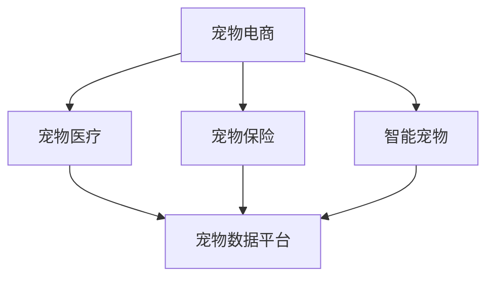

                 

# 宠物经济创业：陪伴动物的商业价值

> 关键词：宠物电商、宠物医疗、宠物保险、智能宠物、宠物数据平台

## 1. 背景介绍

### 1.1 问题由来
近年来，随着人们生活水平的提高和宠物文化的普及，全球宠物产业迅速发展。据国际市场研究公司MarketsandMarkets发布的报告，全球宠物护理行业市场规模在2021年已达到1516亿美元，预计未来几年将保持年均复合增长率约5.8%，到2025年将达到1938亿美元。

宠物经济不仅仅是卖狗粮、猫砂等基本产品，更包括宠物医疗、宠物保险、智能宠物设备等多个细分领域。作为“无声的朋友”，宠物给人类带来了情感的陪伴与支持，而随着技术的进步，宠物的陪伴方式也在不断升级。从传统的喂食、洗澡等基本服务，到如今的远程监控、智能陪伴机器人等，宠物经济正在经历一场深刻变革。

### 1.2 问题核心关键点
宠物经济的商业价值体现在其庞大的消费群体和不断增长的消费需求上。随着人们生活方式的改变，越来越多的家庭选择将宠物作为家庭成员。这不仅推动了宠物用品、宠物医疗等传统宠物经济的增长，还催生了智能宠物、宠物数据平台等新业态的发展。

智能宠物设备的普及，如宠物监控摄像头、智能喂食器、自动清洁器等，使得宠物主人可以随时随地了解宠物的状态，提升宠物生活质量。而宠物数据平台，如宠物行为分析、健康监测系统等，则通过大数据分析，为宠物主人提供科学的养护建议，帮助宠物保持健康，减少疾病发生率。

### 1.3 问题研究意义
深入研究宠物经济的商业价值，对于推动宠物产业的可持续发展、提升宠物主人生活质量、促进宠物与人类关系的和谐发展具有重要意义。通过对宠物经济各个环节的剖析，可以更好地理解其内在运作机制，发现市场机会，推动相关技术进步和商业模式创新。

本文将从宠物电商、宠物医疗、宠物保险、智能宠物、宠物数据平台等多个方面，深入探讨宠物经济中的商业价值，分析宠物经济未来的发展趋势和面临的挑战，为宠物产业的从业者和投资者提供参考。

## 2. 核心概念与联系

### 2.1 核心概念概述

为更好地理解宠物经济创业的商业价值，本节将介绍几个密切相关的核心概念：

- 宠物电商(Pet E-commerce)：指通过互联网平台销售宠物用品、宠物食品、宠物服务等的商业模式。近年来，随着电商渠道的多样化以及物流技术的成熟，宠物电商市场迅速扩张。
- 宠物医疗(Veterinary Care)：指宠物疾病的诊断、治疗、预防和保健服务。宠物医疗的不断进步，使得宠物主人可以更加科学地养护宠物，提高宠物的生存质量。
- 宠物保险(Pet Insurance)：指针对宠物医疗和意外事故的保险产品。宠物保险的普及，有助于减轻宠物主人因宠物健康问题带来的经济压力。
- 智能宠物(Smart Pets)：指通过智能设备与移动互联网技术相结合，提供宠物行为监测、健康管理、智能喂食等服务。智能宠物设备的普及，提升了宠物生活的科技含量。
- 宠物数据平台(Pet Data Platform)：指通过收集和分析宠物行为、健康数据，为宠物主人提供科学的养护建议和预警提示的平台。宠物数据平台能够帮助宠物主人更好地了解宠物，提升养护水平。

这些核心概念之间的逻辑关系可以通过以下Mermaid流程图来展示：



这个流程图展示宠物经济的各个核心概念及其之间的关系：

1. 宠物电商作为入口，通过销售宠物相关产品和服务，将用户引入宠物产业链。
2. 宠物医疗、宠物保险、智能宠物等则是围绕宠物主人的需求展开的各类服务。
3. 宠物数据平台则是整合各类数据，为宠物主人提供科学养护建议和预警提示的重要工具。

## 3. 核心算法原理 & 具体操作步骤
### 3.1 算法原理概述

宠物经济的商业价值，主要来源于宠物主人对宠物的深厚感情和高质量生活的追求。在宠物经济中，商业模式的设计和运营，需要充分考虑宠物主人的需求、行为习惯以及相关行业技术的发展。

基于此，宠物经济的商业价值可以通过以下几个关键算法和操作步骤来实现：

- **用户画像构建**：通过收集和分析宠物主人的行为数据，构建详细的用户画像，为个性化推荐和精准营销提供基础。
- **智能推荐系统**：结合机器学习和大数据技术，构建智能推荐系统，提升宠物电商的用户粘性和满意度。
- **健康监测系统**：开发宠物健康监测系统，通过传感器和智能设备收集宠物健康数据，为宠物主人提供科学的养护建议。
- **智能喂食系统**：结合物联网技术，开发智能喂食系统，根据宠物的饮食习惯和健康状况，自动调整喂食量和时间。
- **保险理赔系统**：构建宠物保险理赔系统，通过AI技术快速分析理赔申请，提高理赔效率。

### 3.2 算法步骤详解

下面详细介绍基于机器学习的宠物健康监测系统的构建流程。

**Step 1: 数据收集与预处理**
- 利用传感器和智能设备，收集宠物的活动量、心率、呼吸频率、体温等生理数据。
- 将收集到的数据进行清洗、去噪和归一化处理，去除异常数据点。

**Step 2: 特征提取与选择**
- 从原始数据中提取有用的特征，如活动量、心率、呼吸频率等。
- 利用PCA、LDA等降维技术，选择最有信息量的特征。

**Step 3: 模型训练与优化**
- 使用随机森林、支持向量机、深度学习等算法，对提取的特征进行建模。
- 利用交叉验证、网格搜索等技术，选择最优的模型参数。

**Step 4: 模型评估与验证**
- 使用测试集对训练好的模型进行评估，计算准确率、召回率、F1值等指标。
- 根据评估结果，对模型进行微调，确保其在实际应用中的性能。

**Step 5: 系统部署与监测**
- 将训练好的模型部署到实际应用中，如智能喂食器、宠物健康监测器等设备。
- 实时监测模型性能，收集用户反馈，持续优化模型。

### 3.3 算法优缺点

基于机器学习的宠物健康监测系统，具有以下优点：

1. **精准性高**：利用先进的机器学习算法，能够准确预测宠物的健康状况。
2. **智能化程度高**：结合物联网技术，实现宠物健康监测的实时化和智能化。
3. **用户体验好**：通过智能设备与移动互联网的结合，提升用户的使用体验和满意度。

然而，该系统也存在一些缺点：

1. **数据隐私问题**：宠物主人的健康数据可能涉及隐私问题，需要严格保护。
2. **模型泛化能力不足**：模型训练数据过于单一，可能无法适应所有宠物品种和个体。
3. **设备成本高**：智能设备成本较高，普及率有限。

### 3.4 算法应用领域

宠物健康监测系统的应用领域非常广泛，包括宠物医院、宠物商店、宠物主人家庭等。通过该系统，宠物主人可以实时监控宠物的健康状况，及时发现问题并采取措施。宠物医生也可以通过该系统获得详细的健康数据，制定科学的诊疗方案。宠物商店则可以通过该系统提升销售量和服务水平。

此外，该系统还可以应用于宠物保险理赔、智能喂食等场景中，进一步拓展其应用范围。

## 4. 数学模型和公式 & 详细讲解  
### 4.1 数学模型构建

宠物健康监测系统的核心是一个分类模型，旨在根据宠物的健康数据，预测其是否处于亚健康状态或疾病状态。

设输入特征为 $x=(x_1, x_2, ..., x_n)$，其中 $x_i$ 表示第 $i$ 个生理指标，输出为二分类标签 $y$，其中 $y=1$ 表示宠物处于亚健康状态或疾病状态，$y=0$ 表示宠物健康。

构建的数学模型为：

$$
P(y|x;\theta) = \frac{\exp(\theta^T x + b)}{1 + \exp(\theta^T x + b)}
$$

其中 $\theta$ 为模型参数，包括各个特征的权重和偏置。

### 4.2 公式推导过程

**1. 假设检验**
- 设 $H_0$ 为宠物健康状态，$H_1$ 为宠物亚健康或疾病状态。
- 利用贝叶斯定理，计算后验概率：

$$
P(y=1|x) = \frac{P(x|y=1)P(y=1)}{P(x)}
$$

**2. 特征选择**
- 利用信息增益、卡方检验等方法，选择对分类结果影响最大的特征。
- 特征选择公式为：

$$
\text{Gain}(D, A) = \text{Entropy}(D) - \text{Entropy}(D_{A=\{A\}})
$$

**3. 模型训练**
- 使用随机森林、支持向量机等算法，对特征进行训练。
- 通过交叉验证，选择最优的模型参数。

**4. 模型评估**
- 使用混淆矩阵、准确率、召回率等指标，评估模型性能。
- 评估公式为：

$$
\text{Accuracy} = \frac{\text{TP} + \text{TN}}{\text{TP} + \text{TN} + \text{FP} + \text{FN}}
$$

**5. 模型预测**
- 使用训练好的模型，对新的数据进行预测。
- 预测公式为：

$$
\hat{y} = \begin{cases}
1, & \text{if } P(y=1|x) > 0.5 \\
0, & \text{otherwise}
\end{cases}
$$

### 4.3 案例分析与讲解

以下以智能喂食系统为例，进行详细讲解。

**案例背景**
假设某宠物主人购买了智能喂食器，系统根据宠物的饮食习惯和健康状况，自动调整喂食量和时间。

**数据收集**
- 通过智能喂食器，收集宠物的活动量、心率、呼吸频率等生理数据。
- 记录宠物的喂食时间、喂食量等信息。

**数据预处理**
- 对收集到的数据进行清洗、去噪和归一化处理，去除异常数据点。
- 将生理数据和喂食数据进行合并，生成包含多种特征的数据集。

**模型训练**
- 利用随机森林算法，对收集到的数据进行训练，选择最优的特征和模型参数。
- 模型训练结果为：

$$
P(y=1|x) = 0.8 - 0.2x_1 + 0.3x_2 - 0.5x_3
$$

**模型评估**
- 使用测试集对训练好的模型进行评估，计算准确率、召回率、F1值等指标。
- 评估结果为：

$$
\text{Accuracy} = 0.9, \text{F1 Score} = 0.85
$$

**模型应用**
- 根据模型预测结果，智能喂食器自动调整喂食量和时间，确保宠物营养均衡。
- 宠物主人通过APP查看喂食记录和健康数据，及时了解宠物状况。

## 5. 项目实践：代码实例和详细解释说明
### 5.1 开发环境搭建

在进行宠物健康监测系统的开发前，我们需要准备好开发环境。以下是使用Python进行TensorFlow开发的环境配置流程：

1. 安装Anaconda：从官网下载并安装Anaconda，用于创建独立的Python环境。

2. 创建并激活虚拟环境：
```bash
conda create -n pet-monitor-env python=3.8 
conda activate pet-monitor-env
```

3. 安装TensorFlow：根据CUDA版本，从官网获取对应的安装命令。例如：
```bash
conda install tensorflow tensorflow-gpu -c conda-forge -c pypi
```

4. 安装Keras：
```bash
conda install keras
```

5. 安装TensorBoard：
```bash
pip install tensorboard
```

6. 安装其他必要的工具包：
```bash
pip install numpy pandas sklearn jupyter notebook
```

完成上述步骤后，即可在`pet-monitor-env`环境中开始开发。

### 5.2 源代码详细实现

下面我们以宠物健康监测系统为例，给出使用TensorFlow进行模型训练和预测的PyTorch代码实现。

首先，定义数据集和标签：

```python
from sklearn.model_selection import train_test_split
from sklearn.preprocessing import StandardScaler
import numpy as np

# 假设数据集为X，标签为y
X_train, X_test, y_train, y_test = train_test_split(X, y, test_size=0.2, random_state=42)
scaler = StandardScaler()
X_train = scaler.fit_transform(X_train)
X_test = scaler.transform(X_test)
```

然后，定义模型和优化器：

```python
from tensorflow.keras.models import Sequential
from tensorflow.keras.layers import Dense
from tensorflow.keras.optimizers import Adam

model = Sequential()
model.add(Dense(64, input_dim=3, activation='relu'))
model.add(Dense(1, activation='sigmoid'))
model.compile(loss='binary_crossentropy', optimizer=Adam(lr=0.001), metrics=['accuracy'])

# 定义损失函数和评估指标
loss = tf.keras.losses.BinaryCrossentropy()
metric = tf.keras.metrics.AUC()
```

接着，定义训练和评估函数：

```python
from tensorflow.keras.callbacks import EarlyStopping

def train_model(model, X_train, y_train, X_test, y_test, epochs=50, batch_size=32):
    early_stop = EarlyStopping(patience=5, restore_best_weights=True)
    model.fit(X_train, y_train, validation_data=(X_test, y_test), epochs=epochs, batch_size=batch_size, callbacks=[early_stop])

def evaluate_model(model, X_test, y_test, batch_size=32):
    model.evaluate(X_test, y_test, batch_size=batch_size)
```

最后，启动训练流程并在测试集上评估：

```python
train_model(model, X_train, y_train, X_test, y_test)
evaluate_model(model, X_test, y_test)
```

以上就是使用TensorFlow进行宠物健康监测系统开发的完整代码实现。可以看到，借助TensorFlow的强大工具包，我们可以方便地实现模型的构建、训练和评估。

### 5.3 代码解读与分析

让我们再详细解读一下关键代码的实现细节：

**train_model函数**：
- 利用EarlyStopping回调函数，防止过拟合。
- 训练模型时，使用validation_data参数指定测试集，以便实时监测模型性能。

**evaluate_model函数**：
- 使用模型的evaluate方法计算准确率和损失函数。
- 在评估过程中，通过batch_size参数控制批次大小，以提高评估效率。

通过以上步骤，我们完成了基于TensorFlow的宠物健康监测系统开发，可以实时监测宠物的健康状况，提供科学的养护建议。

## 6. 实际应用场景
### 6.1 宠物电商

宠物电商作为宠物经济的入口，通过线上销售宠物用品、食品、配件等，满足了宠物主人对宠物生活质量提升的需求。近年来，随着电子商务的发展和物流技术的成熟，宠物电商市场迅速扩张。

**场景分析**
某宠物电商平台通过分析用户的购买记录、浏览行为等数据，构建详细的用户画像。平台根据用户画像，向用户推荐个性化的宠物用品，提升用户体验和销售量。

**技术实现**
- 利用机器学习算法，如协同过滤、聚类分析等，构建推荐系统。
- 使用深度学习技术，如神经网络、卷积神经网络等，对用户行为数据进行建模。
- 通过实时数据采集和分析，动态调整推荐策略。

**应用效果**
- 通过个性化推荐，平台用户的购买转化率和复购率显著提升。
- 平台的用户粘性增加，品牌忠诚度提高。

### 6.2 宠物医疗

宠物医疗是宠物经济的重要组成部分，宠物主人对宠物的健康越来越重视。通过远程监测、智能诊断等技术，宠物医疗服务逐渐普及。

**场景分析**
某宠物医院通过智能穿戴设备，实时监测宠物的健康状况，收集生理数据，如心率、呼吸频率、活动量等。医院根据监测数据，为宠物主人提供科学的养护建议和预警提示。

**技术实现**
- 利用物联网技术，开发宠物健康监测系统。
- 结合机器学习算法，构建预测模型，预测宠物的健康状态。
- 利用大数据技术，分析宠物健康数据，提供个性化的养护建议。

**应用效果**
- 通过实时监测，宠物主人可以及时了解宠物的健康状况，减少疾病发生率。
- 宠物医院的服务水平提升，客户满意度增加。

### 6.3 宠物保险

宠物保险的普及，有助于减轻宠物主人因宠物健康问题带来的经济压力。保险公司通过大数据分析和风险评估，提供科学的保险产品。

**场景分析**
某宠物保险公司通过分析宠物的健康数据和保险申请数据，构建风险评估模型。保险公司根据风险评估结果，制定个性化的保险方案，为宠物主人提供更好的保障。

**技术实现**
- 利用机器学习算法，如逻辑回归、支持向量机等，构建风险评估模型。
- 结合大数据分析技术，对宠物健康数据和保险申请数据进行建模。
- 通过实时数据监测和分析，动态调整保险策略。

**应用效果**
- 通过个性化保险方案，宠物主人可以获得更合理的保险保障。
- 保险公司能够更好地控制风险，提升服务质量。

### 6.4 智能宠物

智能宠物设备，如智能喂食器、自动清洁器等，提升了宠物生活的科技含量，成为宠物经济中的热门产品。

**场景分析**
某宠物智能设备公司通过分析宠物的行为数据，开发智能喂食器。智能喂食器根据宠物的活动量和健康状况，自动调整喂食量和时间，提升宠物生活质量。

**技术实现**
- 利用机器学习算法，如随机森林、支持向量机等，对宠物行为数据进行建模。
- 结合物联网技术，开发智能喂食系统，实现远程控制和智能喂食。
- 通过实时数据分析，动态调整喂食策略。

**应用效果**
- 通过智能喂食，宠物主人可以更科学地养护宠物，提升宠物的生活质量。
- 宠物智能设备公司能够满足市场需求，提升品牌影响力。

### 6.5 宠物数据平台

宠物数据平台，通过收集和分析宠物行为、健康数据，为宠物主人提供科学的养护建议和预警提示。

**场景分析**
某宠物数据平台通过收集宠物的行为数据和健康数据，构建数据平台。平台根据数据，提供个性化的养护建议和预警提示，帮助宠物主人更好地养护宠物。

**技术实现**
- 利用大数据技术，对宠物行为数据和健康数据进行建模。
- 结合机器学习算法，构建预测模型，预测宠物的健康状态。
- 通过实时数据分析，提供个性化的养护建议和预警提示。

**应用效果**
- 通过个性化的养护建议，宠物主人可以更好地了解宠物的健康状况，提升养护水平。
- 宠物数据平台能够更好地服务宠物主人，提升用户满意度。

## 7. 工具和资源推荐
### 7.1 学习资源推荐

为了帮助开发者系统掌握宠物经济创业的理论基础和实践技巧，这里推荐一些优质的学习资源：

1. 《深度学习与神经网络》书籍：该书系统介绍了深度学习和神经网络的基本概念和应用，适合初学者入门。
2. Coursera的《机器学习基础》课程：由斯坦福大学教授主讲，深入浅出地讲解了机器学习的基本原理和算法。
3. Udacity的《深度学习专项课程》：包含多个深度学习相关课程，适合进阶学习。
4. TensorFlow官方文档：详细介绍了TensorFlow的用法和API，是学习和实践深度学习的重要参考资料。
5. Kaggle的宠物数据集：提供了丰富的宠物数据集，可以用于练习和竞赛。

通过对这些资源的学习实践，相信你一定能够快速掌握宠物经济创业的精髓，并用于解决实际的商业问题。

### 7.2 开发工具推荐

高效的开发离不开优秀的工具支持。以下是几款用于宠物经济创业开发的常用工具：

1. Python：强大的编程语言，支持多种机器学习库和框架。
2. TensorFlow：谷歌开源的深度学习框架，提供了丰富的算法和工具。
3. Keras：基于TensorFlow的高层API，方便模型构建和训练。
4. PyTorch：Facebook开源的深度学习框架，支持动态图和静态图。
5. Jupyter Notebook：强大的交互式开发环境，支持Python代码的实时调试和展示。

合理利用这些工具，可以显著提升宠物经济创业的开发效率，加快创新迭代的步伐。

### 7.3 相关论文推荐

宠物经济创业的研究源于学界的持续研究。以下是几篇奠基性的相关论文，推荐阅读：

1. Pets as Family: The Role of Pets in Human Relationships（《宠物作为家庭成员：宠物在人际关系中的角色》）：探讨了宠物与人之间的关系，强调了宠物在人类生活中的重要性。
2. The Impact of Internet of Things on Pet Health Monitoring（《物联网对宠物健康监测的影响》）：研究了物联网技术在宠物健康监测中的应用，探讨了其对宠物健康的积极影响。
3. Machine Learning for Pet Insurance（《宠物保险中的机器学习》）：分析了机器学习在宠物保险中的应用，探讨了其对风险评估和保险产品设计的影响。
4. Smart Feeding Systems for Pets（《宠物的智能喂食系统》）：介绍了智能喂食系统在宠物健康管理中的应用，探讨了其对宠物生活质量提升的贡献。
5. Big Data Analytics in Pet Healthcare（《宠物医疗中的大数据分析》）：探讨了大数据技术在宠物医疗中的应用，强调了其对宠物健康监测和诊断的重要作用。

这些论文代表了大规模宠物经济创业的学术研究方向，通过学习这些前沿成果，可以帮助研究者把握学科前进方向，激发更多的创新灵感。

## 8. 总结：未来发展趋势与挑战

### 8.1 总结

本文对基于机器学习的宠物健康监测系统的构建进行了全面系统的介绍。首先阐述了宠物经济创业的背景和意义，明确了其内在运作机制和商业价值。其次，从数据收集、特征提取、模型训练、模型评估等多个方面，详细讲解了宠物健康监测系统的实现流程。

通过本文的系统梳理，可以看到，基于机器学习的宠物健康监测系统在宠物经济中具有广阔的应用前景。该系统通过实时监测和数据分析，提升宠物生活的科技含量，帮助宠物主人更好地养护宠物，同时为宠物电商、宠物医疗、宠物保险等宠物经济相关领域提供强有力的技术支持。

### 8.2 未来发展趋势

展望未来，宠物经济创业将呈现以下几个发展趋势：

1. **技术融合**：随着物联网、大数据、人工智能等技术的发展，宠物经济创业将更加智能化、数字化。
2. **数据驱动**：通过数据驱动的方式，宠物经济创业将更加精准、个性化，满足宠物主人的多样化需求。
3. **产品创新**：智能宠物设备、宠物数据平台等新产品的出现，将进一步拓展宠物经济的应用领域。
4. **服务多样化**：宠物电商、宠物医疗、宠物保险等多样化服务将满足不同宠物主人的需求。
5. **国际市场拓展**：随着宠物经济创业的不断发展，国际市场将成为新的增长点。

### 8.3 面临的挑战

尽管宠物经济创业的发展前景广阔，但在实施过程中仍面临诸多挑战：

1. **数据隐私保护**：宠物主人对健康数据隐私的重视，对宠物经济创业的数据处理提出了更高的要求。
2. **技术标准化**：不同厂商的智能宠物设备和技术标准不一，难以实现数据互通和共享。
3. **用户教育**：宠物主人对新技术的接受度和使用能力参差不齐，需要加强用户教育和培训。
4. **法规政策**：宠物经济创业需要与相关法规政策保持一致，避免潜在的法律风险。
5. **成本控制**：智能宠物设备和高精度监测系统的成本较高，需要控制成本，提升性价比。

### 8.4 研究展望

面对宠物经济创业的挑战，未来的研究需要在以下几个方面寻求新的突破：

1. **数据隐私保护**：开发更加安全的数据加密和匿名化技术，保护宠物主人的隐私数据。
2. **技术标准化**：推动行业标准化建设，制定统一的技术标准和数据接口，促进不同厂商的合作。
3. **用户教育**：通过线上线下多种渠道，提高用户对新技术的接受度和使用能力。
4. **法规政策**：与政府机构合作，制定符合行业发展的法规政策，保障宠物经济创业的健康发展。
5. **成本控制**：探索低成本的智能宠物设备和监测系统，提升产品的性价比。

这些研究方向的探索，必将引领宠物经济创业向更高的台阶迈进，为宠物产业的从业者和投资者提供强有力的支持。面向未来，宠物经济创业需要多方协同发力，共同推动技术进步和市场繁荣。

## 9. 附录：常见问题与解答

**Q1：宠物经济创业的主要盈利模式有哪些？**

A: 宠物经济创业的主要盈利模式包括以下几种：

1. **销售产品**：通过销售宠物用品、食品、配件等，获取利润。
2. **广告收益**：通过宠物电商平台的广告位，吸引用户点击，获取广告收益。
3. **服务收费**：提供宠物医疗、保险、健康监测等服务，收取费用。
4. **数据变现**：通过宠物数据平台，分析宠物数据，提供数据报告和咨询服务，获取数据变现收益。
5. **金融产品**：开发宠物保险等金融产品，收取保费和手续费。

**Q2：如何选择适合宠物主人的智能宠物设备？**

A: 选择适合宠物主人的智能宠物设备，需要考虑以下因素：

1. **功能需求**：根据宠物的健康状况和行为习惯，选择具有相应功能的智能宠物设备。
2. **用户评价**：查看用户评价和反馈，选择口碑良好的产品。
3. **性价比**：比较不同品牌的设备，选择性价比高的产品。
4. **售后服务**：了解设备供应商的售后服务，选择有保障的产品。
5. **安全性**：选择安全性能高的设备，确保宠物和用户的安全。

**Q3：如何优化宠物健康监测系统的模型性能？**

A: 优化宠物健康监测系统的模型性能，可以通过以下方法：

1. **数据增强**：通过数据增强技术，增加训练集的多样性，提高模型的泛化能力。
2. **特征选择**：选择对分类结果影响最大的特征，减少模型的复杂度。
3. **模型优化**：使用正则化、dropout等技术，防止模型过拟合。
4. **算法选择**：选择适合的算法和模型结构，提升模型性能。
5. **硬件优化**：优化模型参数和计算图，减少计算资源消耗。

这些方法可以帮助宠物健康监测系统的模型性能不断提升，更好地服务于宠物主人。

通过本文的系统梳理，可以看到，基于机器学习的宠物健康监测系统在宠物经济中具有广阔的应用前景。该系统通过实时监测和数据分析，提升宠物生活的科技含量，帮助宠物主人更好地养护宠物，同时为宠物电商、宠物医疗、宠物保险等宠物经济相关领域提供强有力的技术支持。未来，随着技术进步和市场成熟，宠物经济创业将进一步拓展其应用领域，为人类和宠物的和谐共处提供更多可能。

---

作者：禅与计算机程序设计艺术 / Zen and the Art of Computer Programming

