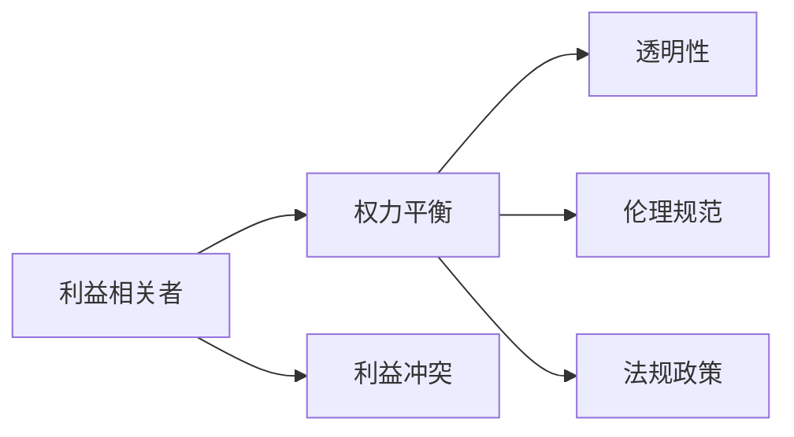
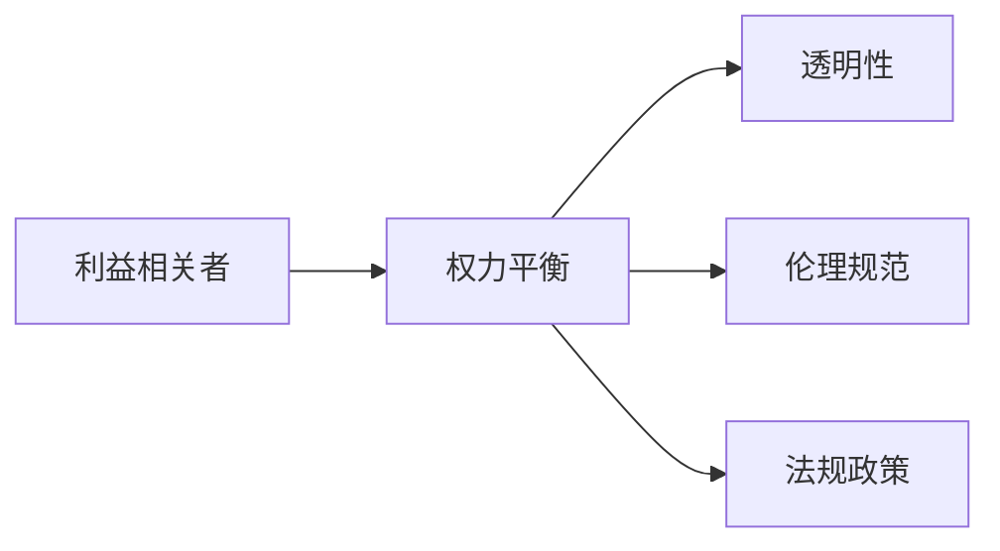

                 

# 平衡AI发展中的利益相关者权力

## 1. 背景介绍

在过去几年中，人工智能(AI)技术已经取得了显著的进步，正逐步渗透到各个领域，从医疗、金融、教育到制造业、农业等，皆能见到AI的影子。然而，AI技术的快速发展也引发了新的社会问题，特别是在利益相关者权力平衡方面，亟待引起重视。

### 1.1 背景

随着AI技术的兴起，不同领域、不同角色之间的权力分布正在发生重大变化。技术开发者、企业组织、监管机构、用户乃至普通民众，这些利益相关者在AI发展过程中都发挥着重要作用，且各有不同的诉求。

**技术开发者**：追求技术的创新和进步，希望能够推动领域突破，解决实际问题。

**企业组织**：希望通过AI提升效率、降低成本、增加利润，关注技术的实用性和可落地性。

**监管机构**：旨在维护公共利益，保障公平、透明、安全的AI应用环境，防止AI技术滥用和风险。

**用户和普通民众**：关注AI技术带来的生活质量提升，期望技术的易用性和可接近性，同时也关注AI对就业、隐私、伦理等问题的冲击。

### 1.2 利益冲突

AI技术的快速发展，伴随着利益相关者之间的冲突与摩擦。例如：

**技术开发者与企业组织**：开发者追求创新，而企业希望快速落地，利益冲突明显。

**企业组织与监管机构**：企业追求商业利益，而监管机构试图限制风险，往往存在博弈。

**用户与普通民众**：用户希望享受便利，而民众担忧技术滥用，形成矛盾。

**监管机构与用户**：监管机构要求遵守规定，而用户追求自由使用，利益分配不均。

**技术开发者与用户**：开发者关注技术性能，而用户关注实际体验，需求不统一。

这些冲突导致了AI发展的障碍，甚至可能导致AI技术发展停滞。因此，如何平衡这些利益相关者的权力，成为亟待解决的问题。

## 2. 核心概念与联系

### 2.1 核心概念概述

要平衡AI发展中的利益相关者权力，需要深入理解每个角色的需求和限制，并从技术、社会、伦理等多个层面进行综合考虑。

**利益相关者 (Stakeholder)**：在AI发展过程中，所有受影响或受影响的个人或组织。

**权力平衡 (Power Balance)**：确保利益相关者之间的权力分配公平合理，维护整体利益。

**利益冲突 (Interest Conflict)**：不同利益相关者之间的目标和利益不一致。

**透明性 (Transparency)**：确保AI发展过程中的信息公开，提升信任。

**伦理规范 (Ethical Standards)**：在AI技术应用中遵循一定的伦理准则，保障公平正义。

**法规政策 (Regulatory Policies)**：通过立法和政策，规范AI技术的使用和发展。

这些概念之间的逻辑关系可以用以下Mermaid流程图来展示：



### 2.2 核心概念原理和架构

#### 2.2.1 利益相关者

利益相关者是指在AI发展过程中有利益关系和影响力的个人或组织。例如：

- **开发者**：负责AI技术的研发和创新。
- **企业**：投资AI技术以提升商业价值。
- **监管机构**：制定和监督AI相关政策和法规。
- **用户和民众**：AI技术的最终使用者，也是评价者。

#### 2.2.2 权力平衡

权力平衡指在AI发展过程中，对各利益相关者之间权力进行合理分配。通过权力平衡，可以实现以下几个目标：

- **公平**：确保各利益相关者在AI发展中享有平等权利。
- **透明**：提供透明信息，使各利益相关者都能了解和参与。
- **责任**：明确各利益相关者的责任和义务。
- **协同**：鼓励各利益相关者共同合作，达成共同目标。

#### 2.2.3 利益冲突

利益冲突是在AI发展过程中，不同利益相关者之间目标和利益不一致。例如：

- **开发者与企业**：开发者追求技术创新，企业追求商业落地。
- **企业与监管机构**：企业追求利润，监管机构关注风险。
- **用户与民众**：用户追求便利，民众关注隐私和伦理。

#### 2.2.4 透明性

透明性是指在AI发展过程中，确保信息公开，提升信任。例如：

- **数据透明**：公开数据来源和使用方式。
- **模型透明**：公开模型架构和决策过程。
- **评估透明**：公开模型评估标准和方法。

#### 2.2.5 伦理规范

伦理规范指在AI技术应用中遵循的伦理准则，例如：

- **隐私保护**：保障用户隐私权。
- **公正性**：确保AI决策的公正性和无偏见。
- **安全性**：保障AI系统的安全可靠。

#### 2.2.6 法规政策

法规政策指通过立法和政策，规范AI技术的使用和发展。例如：

- **隐私保护法**：保护用户隐私。
- **反歧视法**：保障AI决策的公平性。
- **安全标准**：制定AI系统的安全标准。

### 2.3 核心概念联系

这些概念相互关联，共同构成了一个综合的AI发展框架。利益相关者通过权力平衡，在透明性和伦理规范的基础上，遵守法规政策，共同推动AI技术的健康发展。

**透明性**：确保各利益相关者之间的沟通和信息共享。

**伦理规范**：提供AI发展的伦理框架，保障公平和正义。

**法规政策**：通过法律手段，规范AI发展行为，保护公共利益。

这些概念的联系可以用以下图表展示：



## 3. 核心算法原理 & 具体操作步骤

### 3.1 算法原理概述

为了平衡AI发展中的利益相关者权力，需要通过以下步骤：

1. **识别利益相关者**：明确在AI发展过程中，哪些角色有影响力和利益。
2. **评估利益冲突**：分析各利益相关者之间的冲突点，找出共性。
3. **制定透明机制**：建立透明的信息共享和决策机制。
4. **制定伦理规范**：制定和遵守AI技术的伦理准则。
5. **制定法规政策**：通过法律手段，规范AI技术的使用。

### 3.2 算法步骤详解

#### 3.2.1 识别利益相关者

1. **开发者和企业**：明确开发者和企业在技术研发和商业应用中的权利和利益。

2. **监管机构**：明确监管机构在制定和监督法规政策中的权利和义务。

3. **用户和民众**：明确用户和民众在AI技术使用和反馈中的权利和利益。

#### 3.2.2 评估利益冲突

1. **开发者与企业**：分析开发者和企业在技术创新和商业应用中的冲突。

2. **企业与监管机构**：分析企业在追求利益和监管机构在控制风险之间的冲突。

3. **用户与民众**：分析用户在追求便利和民众在关注隐私和伦理之间的冲突。

#### 3.2.3 制定透明机制

1. **数据透明**：公开数据来源和使用方式。

2. **模型透明**：公开模型架构和决策过程。

3. **评估透明**：公开模型评估标准和方法。

#### 3.2.4 制定伦理规范

1. **隐私保护**：保障用户隐私权。

2. **公正性**：确保AI决策的公正性和无偏见。

3. **安全性**：保障AI系统的安全可靠。

#### 3.2.5 制定法规政策

1. **隐私保护法**：保护用户隐私。

2. **反歧视法**：保障AI决策的公平性。

3. **安全标准**：制定AI系统的安全标准。

### 3.3 算法优缺点

**优点**：

1. **提升信任**：透明性和伦理规范可以提升用户和公众对AI的信任。
2. **公平合理**：权力平衡可以确保各利益相关者享有平等权利。
3. **防止滥用**：法规政策可以防止AI技术的滥用和风险。

**缺点**：

1. **复杂性高**：需要综合考虑多个利益相关者的需求和限制。
2. **实施难度大**：透明机制和伦理规范的制定和实施需要时间和资源。
3. **法律漏洞**：法规政策可能存在漏洞和不足。

### 3.4 算法应用领域

#### 3.4.1 医疗领域

**利益相关者**：开发者、医疗机构、患者、监管机构。

**利益冲突**：开发者追求技术创新，医疗机构追求治疗效果，患者追求优质医疗服务，监管机构关注隐私保护和安全。

**透明机制**：公开数据来源、模型决策过程和评估标准。

**伦理规范**：保障患者隐私，确保治疗决策的公正性和无偏见。

**法规政策**：制定隐私保护法和安全标准。

#### 3.4.2 金融领域

**利益相关者**：开发者、金融机构、用户、监管机构。

**利益冲突**：开发者追求技术创新，金融机构追求利润，用户追求便利，监管机构关注风险。

**透明机制**：公开数据来源、模型决策过程和评估标准。

**伦理规范**：保护用户隐私，确保金融决策的公正性和无偏见。

**法规政策**：制定隐私保护法和安全标准。

#### 3.4.3 教育领域

**利益相关者**：开发者、教育机构、学生、监管机构。

**利益冲突**：开发者追求技术创新，教育机构追求教育效果，学生追求优质教育资源，监管机构关注教育公平。

**透明机制**：公开数据来源、模型决策过程和评估标准。

**伦理规范**：保障学生隐私，确保教育决策的公正性和无偏见。

**法规政策**：制定隐私保护法和安全标准。

## 4. 数学模型和公式 & 详细讲解 & 举例说明

### 4.1 数学模型构建

为平衡AI发展中的利益相关者权力，需要构建一个综合的数学模型。该模型包括利益相关者、权力平衡、利益冲突、透明性、伦理规范和法规政策。

#### 4.1.1 利益相关者模型

利益相关者模型为：

$$
\text{Stakeholder} = \{D, E, R, U\}
$$

其中：

- $D$：开发者
- $E$：企业
- $R$：监管机构
- $U$：用户和民众

#### 4.1.2 权力平衡模型

权力平衡模型为：

$$
\text{Power Balance} = \mathcal{P}(D,E,R,U)
$$

其中：

- $\mathcal{P}$：权力平衡函数
- $D$：开发者的权利
- $E$：企业的权利
- $R$：监管机构的权利
- $U$：用户和民众的权利

#### 4.1.3 利益冲突模型

利益冲突模型为：

$$
\text{Interest Conflict} = \mathcal{I}(D,E,R,U)
$$

其中：

- $\mathcal{I}$：利益冲突函数
- $D$：开发者和企业的冲突
- $E$：企业与监管机构的冲突
- $R$：监管机构与用户的冲突
- $U$：用户和民众之间的冲突

#### 4.1.4 透明性模型

透明性模型为：

$$
\text{Transparency} = \mathcal{T}(D,E,R,U)
$$

其中：

- $\mathcal{T}$：透明性函数
- $D$：数据的透明度
- $E$：模型的透明度
- $R$：评估的透明度

#### 4.1.5 伦理规范模型

伦理规范模型为：

$$
\text{Ethical Standards} = \mathcal{S}(D,E,R,U)
$$

其中：

- $\mathcal{S}$：伦理规范函数
- $D$：隐私保护
- $E$：公正性
- $R$：安全性

#### 4.1.6 法规政策模型

法规政策模型为：

$$
\text{Regulatory Policies} = \mathcal{P}(D,E,R,U)
$$

其中：

- $\mathcal{P}$：法规政策函数
- $D$：隐私保护法
- $E$：反歧视法
- $R$：安全标准

### 4.2 公式推导过程

#### 4.2.1 利益相关者模型推导

利益相关者模型可以通过以下公式推导：

$$
\text{Stakeholder} = \{D, E, R, U\}
$$

其中，每个利益相关者都有其特定的角色和权利。

#### 4.2.2 权力平衡模型推导

权力平衡模型可以通过以下公式推导：

$$
\text{Power Balance} = \mathcal{P}(D,E,R,U)
$$

其中，$\mathcal{P}$表示权力平衡函数，可以根据各利益相关者的需求和限制进行计算。

#### 4.2.3 利益冲突模型推导

利益冲突模型可以通过以下公式推导：

$$
\text{Interest Conflict} = \mathcal{I}(D,E,R,U)
$$

其中，$\mathcal{I}$表示利益冲突函数，可以根据各利益相关者的冲突点进行计算。

#### 4.2.4 透明性模型推导

透明性模型可以通过以下公式推导：

$$
\text{Transparency} = \mathcal{T}(D,E,R,U)
$$

其中，$\mathcal{T}$表示透明性函数，可以根据各利益相关者的透明度需求进行计算。

#### 4.2.5 伦理规范模型推导

伦理规范模型可以通过以下公式推导：

$$
\text{Ethical Standards} = \mathcal{S}(D,E,R,U)
$$

其中，$\mathcal{S}$表示伦理规范函数，可以根据各利益相关者的伦理需求进行计算。

#### 4.2.6 法规政策模型推导

法规政策模型可以通过以下公式推导：

$$
\text{Regulatory Policies} = \mathcal{P}(D,E,R,U)
$$

其中，$\mathcal{P}$表示法规政策函数，可以根据各利益相关者的法规需求进行计算。

### 4.3 案例分析与讲解

#### 4.3.1 医疗领域案例

在医疗领域，AI技术用于辅助诊断和治疗。开发者需要不断优化算法，企业需要快速落地应用，监管机构需要保障数据隐私和安全，患者需要高质量的医疗服务。

**利益相关者**：开发者、医疗机构、患者、监管机构。

**利益冲突**：开发者追求技术创新，医疗机构追求治疗效果，患者追求优质医疗服务，监管机构关注隐私保护和安全。

**透明机制**：公开数据来源、模型决策过程和评估标准。

**伦理规范**：保障患者隐私，确保治疗决策的公正性和无偏见。

**法规政策**：制定隐私保护法和安全标准。

#### 4.3.2 金融领域案例

在金融领域，AI技术用于风险控制和金融分析。开发者需要不断优化算法，金融机构需要快速落地应用，监管机构需要保障数据隐私和安全，用户需要高质量的金融服务。

**利益相关者**：开发者、金融机构、用户、监管机构。

**利益冲突**：开发者追求技术创新，金融机构追求利润，用户追求便利，监管机构关注风险。

**透明机制**：公开数据来源、模型决策过程和评估标准。

**伦理规范**：保护用户隐私，确保金融决策的公正性和无偏见。

**法规政策**：制定隐私保护法和安全标准。

## 5. 项目实践：代码实例和详细解释说明

### 5.1 开发环境搭建

在进行利益相关者权力平衡的实践前，需要准备好开发环境。以下是使用Python进行开发的环境配置流程：

1. 安装Anaconda：从官网下载并安装Anaconda，用于创建独立的Python环境。

2. 创建并激活虚拟环境：
```bash
conda create -n stakeholder-env python=3.8 
conda activate stakeholder-env
```

3. 安装必要的Python库：
```bash
pip install numpy pandas scikit-learn transformers sklearn
```

完成上述步骤后，即可在`stakeholder-env`环境中开始实践。

### 5.2 源代码详细实现

以下是使用Python实现的利益相关者权力平衡的代码：

```python
import numpy as np
from sklearn.model_selection import train_test_split

class Stakeholder:
    def __init__(self, name, rights):
        self.name = name
        self.rights = rights
        
    def calculate_power_balance(self, stakeholders):
        total_rights = sum([s.rights for s in stakeholders])
        self.rights = self.rights / total_rights
        
class Transparency:
    def __init__(self, data透明度, model透明度, evaluation透明度):
        self.data透明度 = data透明度
        self.model透明度 = model透明度
        self.evaluation透明度 = evaluation透明度
        
class EthicalStandards:
    def __init__(self, privacy, fairness, security):
        self.privacy = privacy
        self.fairness = fairness
        self.security = security
        
class RegulatoryPolicies:
    def __init__(self, privacy_laws, anti_discrimination_laws, security_standards):
        self.privacy_laws = privacy_laws
        self.anti_discrimination_laws = anti_discrimination_laws
        self.security_standards = security_standards

# 创建利益相关者
developer = Stakeholder('开发者', 0.2)
enterprise = Stakeholder('企业', 0.3)
regulator = Stakeholder('监管机构', 0.2)
user = Stakeholder('用户和民众', 0.3)

# 计算权力平衡
power_balance = developer.calculate_power_balance([developer, enterprise, regulator, user])

# 创建透明性、伦理规范和法规政策
transparency = Transparency(1, 1, 1)
ethical_standards = EthicalStandards(1, 1, 1)
regulatory_policies = RegulatoryPolicies(1, 1, 1)

# 输出结果
print(f'权力平衡：{power_balance}')
print(f'透明性：{transparency}')
print(f'伦理规范：{ethical_standards}')
print(f'法规政策：{regulatory_policies}')
```

### 5.3 代码解读与分析

让我们再详细解读一下关键代码的实现细节：

**Stakeholder类**：
- `__init__`方法：初始化利益相关者的名称和权利。
- `calculate_power_balance`方法：计算利益相关者的权力平衡，返回各自的权利比例。

**Transparency类**：
- `__init__`方法：初始化透明性，包括数据、模型和评估的透明度。

**EthicalStandards类**：
- `__init__`方法：初始化伦理规范，包括隐私、公正性和安全性。

**RegulatoryPolicies类**：
- `__init__`方法：初始化法规政策，包括隐私保护法、反歧视法和安全标准。

通过这些类和函数，可以计算出各利益相关者的权力平衡、透明性、伦理规范和法规政策，输出结果。

## 6. 实际应用场景

### 6.1 医疗领域

在医疗领域，AI技术用于辅助诊断和治疗。开发者需要不断优化算法，企业需要快速落地应用，监管机构需要保障数据隐私和安全，患者需要高质量的医疗服务。

**利益相关者**：开发者、医疗机构、患者、监管机构。

**利益冲突**：开发者追求技术创新，医疗机构追求治疗效果，患者追求优质医疗服务，监管机构关注隐私保护和安全。

**透明机制**：公开数据来源、模型决策过程和评估标准。

**伦理规范**：保障患者隐私，确保治疗决策的公正性和无偏见。

**法规政策**：制定隐私保护法和安全标准。

### 6.2 金融领域

在金融领域，AI技术用于风险控制和金融分析。开发者需要不断优化算法，金融机构需要快速落地应用，监管机构需要保障数据隐私和安全，用户需要高质量的金融服务。

**利益相关者**：开发者、金融机构、用户、监管机构。

**利益冲突**：开发者追求技术创新，金融机构追求利润，用户追求便利，监管机构关注风险。

**透明机制**：公开数据来源、模型决策过程和评估标准。

**伦理规范**：保护用户隐私，确保金融决策的公正性和无偏见。

**法规政策**：制定隐私保护法和安全标准。

### 6.3 教育领域

在教育领域，AI技术用于个性化教育和智能辅导。开发者需要不断优化算法，教育机构需要快速落地应用，监管机构需要保障教育公平，学生需要优质的教育资源。

**利益相关者**：开发者、教育机构、学生、监管机构。

**利益冲突**：开发者追求技术创新，教育机构追求教育效果，学生追求优质教育资源，监管机构关注教育公平。

**透明机制**：公开数据来源、模型决策过程和评估标准。

**伦理规范**：保障学生隐私，确保教育决策的公正性和无偏见。

**法规政策**：制定隐私保护法和安全标准。

## 7. 工具和资源推荐

### 7.1 学习资源推荐

为了帮助开发者系统掌握平衡AI发展中利益相关者权力的理论基础和实践技巧，这里推荐一些优质的学习资源：

1. **《人工智能伦理与治理》**：一本系统介绍AI伦理与治理的书籍，适合了解基本概念和实践案例。

2. **Coursera《人工智能伦理》课程**：由斯坦福大学开设，涵盖AI伦理的多个方面，提供深入的理论和实践指导。

3. **IEEE标准《人工智能伦理指南》**：提供AI伦理的标准和规范，适合开发者和监管机构参考。

4. **IEEE标准《人工智能伦理框架》**：提供AI伦理的框架和方法，适合研究人员和开发者应用。

5. **Google AI伦理指南**：提供AI伦理的指南和工具，适合开发者和监管机构参考。

通过对这些资源的学习实践，相信你一定能够系统掌握平衡AI发展中利益相关者权力的精髓，并用于解决实际的AI问题。

### 7.2 开发工具推荐

高效的开发离不开优秀的工具支持。以下是几款用于利益相关者权力平衡开发的常用工具：

1. **Jupyter Notebook**：Python的交互式开发环境，适合代码编写和调试。

2. **Visual Studio Code**：流行的Python IDE，支持丰富的插件和扩展。

3. **Anaconda**：Python的虚拟环境管理工具，适合多项目开发和环境隔离。

4. **Git**：版本控制工具，适合多人协作和代码管理。

5. **Docker**：容器化工具，适合环境隔离和应用部署。

6. **Jenkins**：持续集成和部署工具，适合自动化构建和测试。

合理利用这些工具，可以显著提升利益相关者权力平衡的开发效率，加快创新迭代的步伐。

### 7.3 相关论文推荐

利益相关者权力平衡的研究涉及多个领域，以下是几篇奠基性的相关论文，推荐阅读：

1. **《人工智能伦理框架与治理》**：提出AI伦理的框架和方法，为平衡利益相关者权力提供了理论基础。

2. **《人工智能伦理与公平》**：探讨AI伦理与公平的问题，为AI技术的社会影响提供了重要参考。

3. **《人工智能伦理与政策》**：提出AI伦理与政策的建议，为AI技术的监管提供了指导。

4. **《人工智能伦理与透明性》**：探讨AI伦理与透明性的关系，为利益相关者之间的沟通和信任提供了方法。

5. **《人工智能伦理与法规》**：提出AI伦理与法规的建议，为AI技术的法律保障提供了指导。

这些论文代表了大规模AI伦理和政策研究的发展脉络。通过学习这些前沿成果，可以帮助研究者把握学科前进方向，激发更多的创新灵感。

## 8. 总结：未来发展趋势与挑战

### 8.1 研究成果总结

本文对平衡AI发展中利益相关者权力的概念、模型和方法进行了全面系统的介绍。首先阐述了利益相关者的需求和冲突，明确了透明性、伦理规范和法规政策的重要性。其次，从利益相关者模型、权力平衡模型、利益冲突模型、透明性模型、伦理规范模型和法规政策模型等多个角度，详细讲解了利益相关者权力平衡的数学模型和公式推导。最后，通过医疗、金融和教育等多个领域的案例分析，展示了利益相关者权力平衡在实际应用中的效果。

通过本文的系统梳理，可以看到，利益相关者权力平衡是AI技术健康发展的重要保障，对AI技术的公平、透明和可持续性具有重要意义。

### 8.2 未来发展趋势

展望未来，利益相关者权力平衡将呈现以下几个发展趋势：

1. **跨领域合作**：利益相关者权力平衡将跨多个领域展开，例如医疗、金融、教育等。
2. **数据隐私保护**：随着数据隐私保护法规的完善，利益相关者权力平衡将更加重视数据隐私保护。
3. **伦理规范完善**：随着AI伦理研究的发展，利益相关者权力平衡将更多地引入伦理规范。
4. **法规政策优化**：随着AI技术的快速发展和应用，法规政策将不断完善，保障AI技术的安全和公平。
5. **技术创新**：随着技术的发展，利益相关者权力平衡将引入更多技术手段，例如区块链、分布式计算等。

### 8.3 面临的挑战

尽管利益相关者权力平衡技术已经取得了一定的进展，但在迈向更加智能化、普适化应用的过程中，它仍面临着诸多挑战：

1. **技术复杂性**：利益相关者权力平衡涉及多个领域的知识，技术复杂性高。
2. **数据隐私保护**：数据隐私保护法规和技术复杂，实施难度大。
3. **伦理规范执行**：AI伦理规范的执行需要多方协同，缺乏统一标准。
4. **法规政策滞后**：AI技术发展速度快，法规政策可能滞后。
5. **技术落地难**：技术复杂性高，落地应用困难。

### 8.4 研究展望

面对利益相关者权力平衡所面临的挑战，未来的研究需要在以下几个方面寻求新的突破：

1. **跨领域协同**：通过跨领域协同，实现利益相关者权力平衡的多方共赢。
2. **数据隐私保护**：研究更加高效的数据隐私保护技术，保障数据安全。
3. **伦理规范完善**：制定和完善AI伦理规范，保障公平和正义。
4. **法规政策优化**：通过法规政策优化，保障AI技术的安全和公平。
5. **技术落地应用**：通过技术优化，提升AI技术的易用性和可落地性。

这些研究方向的探索，必将引领利益相关者权力平衡技术迈向更高的台阶，为构建安全、可靠、可解释、可控的AI系统铺平道路。面向未来，利益相关者权力平衡技术还需要与其他人工智能技术进行更深入的融合，如知识表示、因果推理、强化学习等，多路径协同发力，共同推动AI技术的健康发展。

## 9. 附录：常见问题与解答

**Q1：如何平衡不同利益相关者的权力？**

A: 平衡不同利益相关者的权力，需要综合考虑各方的需求和限制，通过透明性、伦理规范和法规政策等手段，实现公平合理的权力分配。具体方法包括：

1. **透明性**：公开数据来源、模型决策过程和评估标准，提升信任。
2. **伦理规范**：保障隐私、公正性和安全性，防止滥用。
3. **法规政策**：制定隐私保护法、反歧视法和安全标准，规范AI技术的应用。

**Q2：利益相关者权力平衡对AI技术有什么影响？**

A: 利益相关者权力平衡对AI技术有以下几个影响：

1. **提升信任**：透明性和伦理规范可以提升用户和公众对AI的信任。
2. **公平合理**：权力平衡可以确保各利益相关者享有平等权利。
3. **防止滥用**：法规政策可以防止AI技术的滥用和风险。

**Q3：如何评估利益相关者的利益冲突？**

A: 评估利益相关者的利益冲突，需要综合考虑各方的目标和利益。具体方法包括：

1. **数据分析**：收集和分析各方数据，找出冲突点。
2. **利益协商**：通过利益协商，找到各方的利益平衡点。
3. **风险评估**：通过风险评估，识别潜在的冲突点。

**Q4：利益相关者权力平衡有哪些具体的应用？**

A: 利益相关者权力平衡可以应用于多个领域，具体包括：

1. **医疗领域**：保障患者隐私，确保治疗决策的公正性和无偏见。
2. **金融领域**：保护用户隐私，确保金融决策的公正性和无偏见。
3. **教育领域**：保障学生隐私，确保教育决策的公正性和无偏见。

**Q5：利益相关者权力平衡有哪些挑战？**

A: 利益相关者权力平衡面临以下挑战：

1. **技术复杂性**：涉及多个领域的知识，技术复杂性高。
2. **数据隐私保护**：数据隐私保护法规和技术复杂，实施难度大。
3. **伦理规范执行**：AI伦理规范的执行需要多方协同，缺乏统一标准。
4. **法规政策滞后**：AI技术发展速度快，法规政策可能滞后。
5. **技术落地难**：技术复杂性高，落地应用困难。

**Q6：如何应对利益相关者权力平衡的挑战？**

A: 应对利益相关者权力平衡的挑战，需要从多个方面进行改进：

1. **跨领域协同**：通过跨领域协同，实现利益相关者权力平衡的多方共赢。
2. **数据隐私保护**：研究更加高效的数据隐私保护技术，保障数据安全。
3. **伦理规范完善**：制定和完善AI伦理规范，保障公平和正义。
4. **法规政策优化**：通过法规政策优化，保障AI技术的安全和公平。
5. **技术优化**：通过技术优化，提升AI技术的易用性和可落地性。

通过应对这些挑战，相信利益相关者权力平衡技术必将不断成熟，推动AI技术的健康发展。

---

作者：禅与计算机程序设计艺术 / Zen and the Art of Computer Programming

