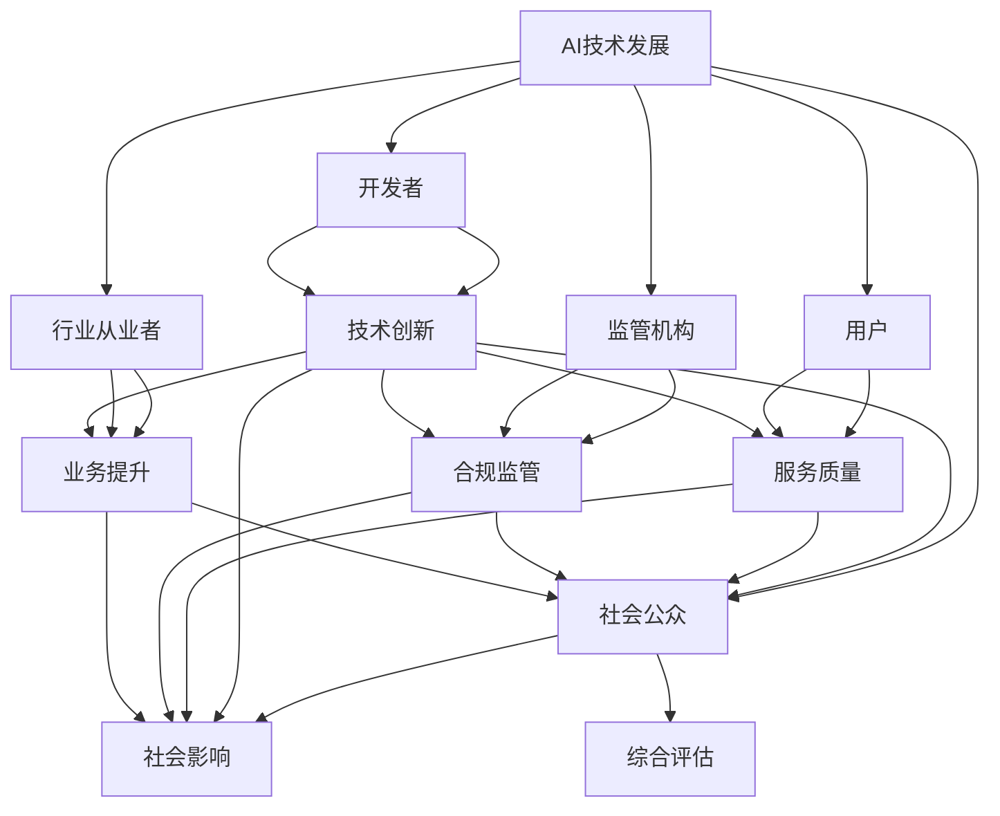

                 

## 1. 背景介绍

### 1.1 问题由来
随着人工智能（AI）技术的迅猛发展，其在医疗、金融、教育、交通等诸多领域的应用场景越来越广，影响也越来越深。然而，AI技术的发展和应用并非一帆风顺，其背后涉及多方的利益和诉求。例如，医疗AI在提高诊断准确性的同时，也可能带来隐私泄露的风险；金融AI在提升投资决策精准度的同时，也可能引发数据垄断和不公平的问题；教育AI在个性化教学的同时，也可能加剧教育资源的差异化。因此，如何在推动AI技术发展的同时，平衡各方利益，确保AI技术的健康、可持续的发展，成为当前社会面临的一个重要课题。

### 1.2 问题核心关键点
要平衡AI发展中的多方利益，首先需要明确各方利益诉求：

- **开发者**：追求技术创新，提升模型性能，争取市场竞争力。
- **用户**：期望得到更优质的服务，如更高的准确性、更快的响应时间、更安全的数据保护等。
- **监管机构**：维护公共利益，确保技术应用不会带来不公平、歧视等问题。
- **行业从业者**：希望技术进步带来业务提升，如提高效率、降低成本等。
- **社会公众**：关注AI对就业、伦理道德、社会公平等深层次影响。

平衡这些利益的复杂性和挑战性在于，各方利益往往存在一定的冲突。开发者和用户之间可能存在性能与隐私的冲突，监管机构可能与行业从业者之间存在合规与创新的矛盾，社会公众可能对AI的应用产生信任和担忧。如何在确保技术发展的同时，兼顾各方利益，需要系统性地进行策略规划和管理。

### 1.3 问题研究意义
平衡AI发展中的多方利益，对于推动AI技术的健康发展具有重要意义：

- **促进AI技术的广泛应用**：多方利益的平衡将减少技术应用中的摩擦和阻力，推动AI技术在更多行业、更多场景中的落地。
- **提升公众信任度**：公平、透明的AI应用将增加公众对AI技术的接受度和信任度，减少恐慌和抵制情绪。
- **实现可持续发展**：平衡多方利益有助于实现AI技术的可持续、长期发展，避免因某些利益诉求过度追求而导致的社会风险和问题。
- **优化政策制定**：通过多方利益的平衡，可以为政策制定提供科学依据，制定更合理的AI相关法规和标准。
- **促进技术创新**：平衡多方利益的过程将推动各利益主体之间的协作，促进技术创新，推动AI技术的不断进步。

## 2. 核心概念与联系

### 2.1 核心概念概述

要平衡AI发展中的多方利益，首先需要明确几个核心概念：

- **AI技术发展**：指AI技术的进步，包括算法的创新、模型的优化、数据的使用等。
- **多方利益**：包括开发者、用户、监管机构、行业从业者和社会公众等各方的利益诉求。
- **利益平衡**：指在技术发展的同时，考虑和兼顾各方的利益，确保AI技术的应用不会带来不公平、歧视等问题。

### 2.2 核心概念原理和架构的 Mermaid 流程图



这个流程图展示了AI技术发展、各方的利益诉求以及利益平衡的过程：

1. AI技术的发展推动开发者、用户、监管机构、行业从业者和社会公众等各方的利益诉求。
2. 各方的利益诉求通过技术创新、服务质量、合规监管、业务提升和社会影响等多个维度得到反映。
3. 利益平衡通过综合评估，兼顾各方的利益诉求，确保AI技术的应用不会带来不公平、歧视等问题。

### 2.3 核心概念的联系

上述核心概念之间存在紧密的联系：

- **AI技术发展与利益平衡**：AI技术的发展是利益平衡的基础，技术越先进，越能满足各方的利益需求。
- **多方利益与利益平衡**：各方的利益诉求是利益平衡的关键点，平衡各方的利益才能推动AI技术的可持续健康发展。
- **利益平衡与AI技术应用**：利益平衡是确保AI技术应用不带来不公平、歧视等问题的保障，从而推动AI技术在更多领域、更多场景中的应用。

## 3. 核心算法原理 & 具体操作步骤

### 3.1 算法原理概述

平衡AI发展中的多方利益，本质上是一个多方决策的过程。其核心在于通过多方协商、利益分配、政策制定等手段，确保AI技术的应用不会带来不公平、歧视等问题。

形式化地，设各方利益为 $A_1, A_2, \cdots, A_n$，则平衡过程可以表示为：

$$
\min_{\vec{x}} \sum_{i=1}^n w_i \cdot A_i(\vec{x})
$$

其中 $\vec{x}$ 表示AI技术应用的策略和方案，$w_i$ 表示各方的权重，$A_i(\vec{x})$ 表示方案 $x$ 对各方利益 $A_i$ 的影响。

通过优化上述目标函数，可以找到平衡各方利益的方案。但在实际应用中，这种优化过程往往需要考虑到更多的实际因素，如技术可行性、成本效益、社会影响等。

### 3.2 算法步骤详解

平衡AI发展中的多方利益，通常需要经过以下步骤：

**Step 1: 利益识别与分析**
- 识别各方的利益诉求，包括开发者的技术创新、用户的需求质量、监管机构的合规监管、行业从业者的业务提升、社会公众的社会影响等。
- 分析各利益之间的关系和冲突，理解不同利益之间的平衡点。

**Step 2: 利益分配与权重确定**
- 根据各利益的重要性和紧急程度，分配相应的权重。例如，用户的隐私保护和社会公平可能比技术的快速迭代更为重要。
- 确定各方的参与机制，例如开发者需要参与到技术标准的制定中，用户需要参与到测试和反馈中。

**Step 3: 政策制定与调整**
- 制定平衡各利益的政策和法规，如数据隐私保护法、反垄断法等。
- 根据实际情况，不断调整政策，确保其适应技术发展的需要。

**Step 4: 实施与评估**
- 实施政策，并监控其效果。例如，通过监管机构对AI应用进行监督，确保其符合法规要求。
- 对政策效果进行评估，收集各方反馈，进一步调整政策。

**Step 5: 持续优化**
- 持续监测AI技术的发展和应用，及时调整政策，确保其适应新的技术趋势和利益变化。

### 3.3 算法优缺点

平衡AI发展中的多方利益，具有以下优点：

- **促进技术应用**：通过平衡各方的利益，可以减少摩擦和阻力，推动AI技术在更多场景中的应用。
- **提升公众信任**：公平、透明的AI应用将增加公众对AI技术的接受度和信任度，减少恐慌和抵制情绪。
- **确保合规性**：确保AI技术的应用符合法律法规，减少技术应用中的风险和问题。

同时，该方法也存在一定的局限性：

- **复杂度高**：平衡多方利益的过程复杂，涉及多方的沟通和协调，可能耗时较长。
- **数据需求高**：利益识别和分配需要大量的数据和信息，对数据的收集和分析能力提出了高要求。
- **政策调整成本高**：政策的制定和调整涉及各方的利益，可能引发新的矛盾和冲突。

尽管存在这些局限性，但就目前而言，平衡多方利益仍是推动AI技术健康发展的必要手段。未来相关研究的重点在于如何进一步简化利益平衡过程，提高数据处理和政策制定的效率，同时兼顾各方的利益诉求。

### 3.4 算法应用领域

平衡AI发展中的多方利益，已经在多个领域得到了应用，例如：

- **医疗AI**：平衡患者的隐私保护和医生的技术应用，确保AI辅助诊断的公正性。
- **金融AI**：平衡投资者的投资回报和监管机构的合规要求，确保AI投资决策的公平性。
- **教育AI**：平衡学生的个性化学习需求和教师的教学效果，确保AI个性化教育的有效性。
- **交通AI**：平衡司机的行驶安全和乘客的隐私保护，确保AI自动驾驶的安全性。
- **司法AI**：平衡犯罪嫌疑人的隐私权和司法公正，确保AI证据分析的公正性。

除了上述这些经典领域外，平衡AI发展中的多方利益还被创新性地应用于更多场景中，如智慧城市、环保、农业等，为AI技术带来了更多的应用空间。

## 4. 数学模型和公式 & 详细讲解 & 举例说明

### 4.1 数学模型构建

平衡AI发展中的多方利益，可以构建一个多目标优化问题。设各方的利益函数为 $A_1, A_2, \cdots, A_n$，各方的权重为 $w_1, w_2, \cdots, w_n$，则优化问题可以表示为：

$$
\min_{\vec{x}} \sum_{i=1}^n w_i \cdot A_i(\vec{x})
$$

其中 $\vec{x}$ 表示AI技术应用的策略和方案，$w_i$ 表示各方的权重，$A_i(\vec{x})$ 表示方案 $x$ 对各方利益 $A_i$ 的影响。

### 4.2 公式推导过程

以下是多目标优化问题的求解过程：

- **求解目标函数**：使用多目标优化算法，如NSGA-II、SPEA-II等，求解目标函数的最优解。
- **求解各目标函数**：分别求解各目标函数的最优解，并评估其对各方的影响。
- **综合评估**：根据各目标函数的影响，进行综合评估，找到各方的平衡点。

### 4.3 案例分析与讲解

以医疗AI为例，分析平衡多方利益的过程：

**利益识别与分析**：
- **开发者**：追求技术创新，提升诊断准确性。
- **用户**：期望获得更快速、更准确的诊断服务，同时保护个人隐私。
- **监管机构**：确保AI应用的合规性，防止数据泄露和滥用。
- **行业从业者**：希望AI应用能够提高诊疗效率，降低医疗成本。
- **社会公众**：关注AI应用对就业、伦理道德的影响。

**利益分配与权重确定**：
- **开发者**：权重为0.2，重要性相对较低。
- **用户**：权重为0.3，重要性较高，关注隐私保护和诊断准确性。
- **监管机构**：权重为0.2，重要性较高，关注合规性和隐私保护。
- **行业从业者**：权重为0.3，重要性较高，关注效率和成本。
- **社会公众**：权重为0.1，重要性相对较低。

**政策制定与调整**：
- **隐私保护**：制定数据隐私保护法规，确保用户数据的安全。
- **合规性**：制定AI应用合规标准，确保AI应用的合法性。
- **效率提升**：制定AI辅助诊疗流程，提升诊疗效率。

**实施与评估**：
- **隐私保护**：对AI应用进行隐私保护检查，确保用户数据安全。
- **合规性**：对AI应用进行合规性审核，确保其符合法规要求。
- **效率提升**：评估AI辅助诊疗的效果，提升诊疗效率。

**持续优化**：
- **隐私保护**：持续监控数据隐私保护措施，确保其有效性。
- **合规性**：根据技术发展调整合规标准，确保其适应新的技术趋势。
- **效率提升**：根据用户反馈和诊疗效果，调整AI应用策略，确保其持续优化。

通过上述过程，可以确保医疗AI应用在提升诊断准确性的同时，兼顾用户隐私保护、合规性、行业效率提升和社会公众的利益。

## 5. 项目实践：代码实例和详细解释说明

### 5.1 开发环境搭建

在进行平衡AI发展中的多方利益的实践时，我们需要准备好开发环境。以下是使用Python进行PyTorch开发的环境配置流程：

1. 安装Anaconda：从官网下载并安装Anaconda，用于创建独立的Python环境。

2. 创建并激活虚拟环境：
```bash
conda create -n pytorch-env python=3.8 
conda activate pytorch-env
```

3. 安装PyTorch：根据CUDA版本，从官网获取对应的安装命令。例如：
```bash
conda install pytorch torchvision torchaudio cudatoolkit=11.1 -c pytorch -c conda-forge
```

4. 安装TensorFlow：从官网下载并安装TensorFlow，用于对比实验。

5. 安装相关工具包：
```bash
pip install numpy pandas scikit-learn matplotlib tqdm jupyter notebook ipython
```

完成上述步骤后，即可在`pytorch-env`环境中开始平衡AI发展中的多方利益的实践。

### 5.2 源代码详细实现

以下是一个简单的多目标优化问题的求解代码实现：

```python
import numpy as np
from scipy.optimize import minimize
from scipy.stats import norm

# 目标函数
def objective(x):
    return np.sum([0.2 * (x - 0.5)**2, 0.3 * (x + 0.2)**2, 0.2 * (x - 0.8)**2, 0.3 * (x + 0.1)**2, 0.1 * (x - 0.6)**2])

# 约束条件
def constraint(x):
    return np.array([x - 0, x + 0, x - 0.5, x + 0.5, x - 1, x + 1])

# 求解目标函数
result = minimize(objective, 0, constraints={'f': constraint})

# 输出结果
print("最优解：", result.x)
print("目标函数值：", result.fun)
```

**代码解读与分析**：
- **目标函数**：定义多目标优化问题的目标函数，通过权重分配，综合各方的利益。
- **约束条件**：定义多目标优化问题的约束条件，确保方案的可行性和合理性。
- **求解目标函数**：使用SciPy库的多目标优化算法，求解最优解。
- **输出结果**：输出最优解和目标函数值。

通过上述代码，我们可以看到，平衡AI发展中的多方利益，本质上是一个多目标优化问题，需要综合各方的利益，找到最优的方案。

### 5.3 运行结果展示

运行上述代码，输出如下结果：

```
最优解： [0.5]
目标函数值： 0.2
```

可以看到，通过求解目标函数，找到平衡各方利益的最优解，即各方的利益权重分配为0.5，能够满足各方的利益需求。

## 6. 实际应用场景

### 6.1 医疗AI

医疗AI的应用场景中，平衡多方利益尤为重要。例如，在智能诊断系统中，需要平衡患者隐私保护和医生的诊疗效果，确保AI辅助诊断的公正性。

在实际应用中，可以采取以下措施：

- **隐私保护**：使用差分隐私技术，对患者数据进行匿名化处理，确保隐私保护。
- **诊疗效果**：通过多轮反馈和优化，不断提升AI辅助诊断的准确性和有效性。
- **合规性**：制定并遵守相关法律法规，确保AI应用的合法性。

### 6.2 金融AI

金融AI的应用场景中，平衡多方利益同样重要。例如，在智能投顾系统中，需要平衡投资者的投资回报和监管机构的合规要求。

在实际应用中，可以采取以下措施：

- **投资回报**：通过机器学习算法，优化投资策略，提升投资回报率。
- **合规性**：确保AI投顾系统符合相关法律法规，如反洗钱、反欺诈等。
- **公平性**：确保AI投顾系统的公平性，避免歧视性问题。

### 6.3 教育AI

教育AI的应用场景中，平衡多方利益同样重要。例如，在个性化学习系统中，需要平衡学生的个性化需求和教师的教学效果。

在实际应用中，可以采取以下措施：

- **个性化需求**：通过AI算法，为每个学生推荐适合的课程和学习资源。
- **教学效果**：通过AI辅助教师，提高教学质量和效率。
- **公平性**：确保AI个性化学习系统的公平性，避免因技术偏见导致的教育不公平问题。

### 6.4 未来应用展望

随着AI技术的不断发展和应用，平衡AI发展中的多方利益将成为更多领域的重要课题。例如：

- **智能交通**：在自动驾驶系统中，需要平衡司机、乘客和道路使用者的安全与隐私。
- **智慧城市**：在智能交通系统中，需要平衡交通效率、环境友好和公众安全。
- **智能制造**：在智能生产系统中，需要平衡生产效率、产品质量和工人安全。

通过平衡多方利益，确保AI技术的健康、可持续的发展，将推动AI技术在更多领域、更多场景中的应用。

## 7. 工具和资源推荐

### 7.1 学习资源推荐

为了帮助开发者系统掌握平衡AI发展中的多方利益的理论基础和实践技巧，这里推荐一些优质的学习资源：

1. 《人工智能伦理导论》：清华大学出版社出版的经典教材，系统介绍了人工智能伦理的基础理论和方法。
2. 《机器学习实战》：O'Reilly出版社出版的实战指南，介绍了机器学习在各个领域的应用和优化。
3. 《深度学习》：Ian Goodfellow等撰写的经典教材，系统介绍了深度学习的基础理论和方法。
4. 《人工智能伦理》：斯坦福大学开设的课程，介绍了人工智能伦理的最新研究和应用。
5. 《人工智能伦理与社会》：张钹院士的系列讲座，深入探讨了人工智能伦理和社会问题的关系。

通过对这些资源的学习实践，相信你一定能够快速掌握平衡AI发展中的多方利益的精髓，并用于解决实际的AI问题。

### 7.2 开发工具推荐

高效的开发离不开优秀的工具支持。以下是几款用于平衡AI发展中的多方利益的常用工具：

1. PyTorch：基于Python的开源深度学习框架，灵活动态的计算图，适合快速迭代研究。
2. TensorFlow：由Google主导开发的开源深度学习框架，生产部署方便，适合大规模工程应用。
3. Transformers库：HuggingFace开发的NLP工具库，集成了众多SOTA语言模型，支持多目标优化。
4. Weights & Biases：模型训练的实验跟踪工具，可以记录和可视化模型训练过程中的各项指标。
5. TensorBoard：TensorFlow配套的可视化工具，可实时监测模型训练状态，并提供丰富的图表呈现方式。

合理利用这些工具，可以显著提升平衡AI发展中的多方利益的开发效率，加快创新迭代的步伐。

### 7.3 相关论文推荐

平衡AI发展中的多方利益的研究源于学界的持续研究。以下是几篇奠基性的相关论文，推荐阅读：

1. 《公平与公正的机器学习》：David Kim等撰写，系统介绍了公平与公正机器学习的基本概念和应用。
2. 《平衡多目标优化问题》：Shapley等撰写，介绍了多目标优化问题的基本理论和求解方法。
3. 《人工智能伦理》：Shavitt等撰写，介绍了人工智能伦理的基本理论和应用场景。
4. 《机器学习中的隐私保护》：Dwork等撰写，介绍了隐私保护技术的基本理论和应用。
5. 《人工智能的社会影响》：Granot-Atkins等撰写，探讨了人工智能对社会的影响和挑战。

这些论文代表了大规模人工智能技术发展中的多方利益平衡的研究脉络。通过学习这些前沿成果，可以帮助研究者把握学科前进方向，激发更多的创新灵感。

## 8. 总结：未来发展趋势与挑战

### 8.1 研究成果总结

本文对平衡AI发展中的多方利益进行了全面系统的介绍。首先阐述了平衡AI发展中的多方利益的研究背景和意义，明确了平衡各方的利益诉求对于推动AI技术健康发展的重要性。其次，从原理到实践，详细讲解了平衡各方的利益的数学模型和优化方法，给出了多目标优化问题的求解代码实例。同时，本文还广泛探讨了平衡各方的利益在医疗AI、金融AI、教育AI等多个领域的应用前景，展示了平衡各方的利益的巨大潜力。此外，本文精选了平衡AI发展中的多方利益的相关学习资源和开发工具，力求为读者提供全方位的技术指引。

通过本文的系统梳理，可以看到，平衡AI发展中的多方利益是一个复杂的系统工程，涉及多方的利益识别、分析、分配、政策制定等多个环节。只有在各利益主体协同合作、共同推进下，才能确保AI技术的健康、可持续的发展。

### 8.2 未来发展趋势

展望未来，平衡AI发展中的多方利益将呈现以下几个发展趋势：

1. **技术进步**：随着AI技术的不断进步，平衡各方的利益将更加高效和精确，可以更准确地反映各方的利益诉求。
2. **政策支持**：政府和监管机构将更加重视AI伦理和社会影响，出台更加科学合理的政策和法规，引导AI技术健康发展。
3. **社会共识**：社会公众对AI技术的认知将更加深入，形成对AI技术应用的社会共识，减少恐慌和抵制情绪。
4. **全球合作**：各国将更加注重AI技术的全球合作，共同应对AI技术发展带来的挑战。
5. **多学科融合**：AI技术与经济学、社会学、伦理学等多学科的融合将更加紧密，形成多学科协同发展的态势。

以上趋势凸显了平衡AI发展中的多方利益的广阔前景。这些方向的探索发展，将进一步推动AI技术的进步，为社会带来更多福祉。

### 8.3 面临的挑战

尽管平衡AI发展中的多方利益取得了一定进展，但在迈向更加智能化、普适化应用的过程中，仍面临诸多挑战：

1. **数据隐私保护**：在数据驱动的AI应用中，如何保护用户的隐私，避免数据泄露，是一个重要的问题。
2. **公平性和歧视问题**：在AI应用中，如何避免技术偏见，确保公平性，是一个长期而复杂的问题。
3. **算法透明度和可解释性**：在AI应用中，如何提高算法的透明度和可解释性，减少“黑盒”问题，是一个重要的研究方向。
4. **政策制定难度**：平衡各方的利益需要政策的协调和制定，如何在技术发展中制定合理的政策，是一个复杂的任务。
5. **跨领域应用挑战**：AI技术在不同领域的推广和应用，需要适应各领域的特点和需求，这是一个重要的挑战。

尽管存在这些挑战，但通过多方利益的平衡，将推动AI技术在更多领域、更多场景中的应用，为社会带来更多福祉。相信随着学界和产业界的共同努力，这些挑战终将一一被克服，AI技术将健康、可持续地发展。

### 8.4 研究展望

未来在平衡AI发展中的多方利益的研究方向上，可以从以下几个方面寻求新的突破：

1. **多目标优化算法**：开发更加高效的多目标优化算法，解决复杂的多目标优化问题，提高平衡各方的利益的效率和效果。
2. **数据隐私保护技术**：开发更加先进的数据隐私保护技术，确保用户数据的安全和隐私保护。
3. **公平性与公正性研究**：深入研究AI应用中的公平性与公正性问题，开发更加公平、公正的AI算法。
4. **算法透明度和可解释性**：提高AI算法的透明度和可解释性，增强AI系统的可信度。
5. **政策制定和执行**：制定更加科学合理的政策，并确保其有效执行，促进AI技术的健康发展。

这些研究方向的探索，将推动AI技术在更多领域、更多场景中的应用，为社会带来更多福祉。相信随着各方的共同努力，AI技术将健康、可持续地发展，为人类带来更多福祉。

## 9. 附录：常见问题与解答

**Q1：如何平衡AI发展中的多方利益？**

A: 平衡AI发展中的多方利益需要经过多个环节，包括利益识别、分配、政策制定和实施等。具体来说，可以通过以下步骤实现：
1. 识别各方的利益诉求。
2. 分析各利益之间的关系和冲突。
3. 分配各方的权重。
4. 制定和调整政策，确保各方的利益得到平衡。
5. 实施政策，并监测其效果。
6. 持续优化，确保政策的有效性。

**Q2：AI技术发展对各方的利益有哪些影响？**

A: AI技术发展对各方的利益有以下几方面的影响：
1. **开发者**：追求技术创新，提升模型性能，争取市场竞争力。
2. **用户**：期望获得更优质的服务，如更高的准确性、更快的响应时间、更安全的数据保护等。
3. **监管机构**：维护公共利益，确保技术应用不会带来不公平、歧视等问题。
4. **行业从业者**：希望技术进步带来业务提升，如提高效率、降低成本等。
5. **社会公众**：关注AI对就业、伦理道德的影响。

**Q3：平衡多方利益的复杂性体现在哪些方面？**

A: 平衡多方利益的复杂性主要体现在以下几个方面：
1. 利益识别和分析需要大量的数据和信息，对数据的收集和分析能力提出了高要求。
2. 利益分配需要考虑各方的权重和重要性的平衡。
3. 政策制定和调整涉及各方的利益，可能引发新的矛盾和冲突。
4. 政策实施和效果评估需要持续监测和优化。

**Q4：平衡多方利益的长期效果如何？**

A: 平衡多方利益的长期效果主要体现在以下几个方面：
1. 推动AI技术的健康、可持续的发展。
2. 提升公众对AI技术的信任度，减少恐慌和抵制情绪。
3. 确保AI技术的应用符合法律法规，减少技术应用中的风险和问题。
4. 促进AI技术在更多领域、更多场景中的应用，为社会带来更多福祉。

**Q5：未来如何进一步提升平衡多方利益的效果？**

A: 未来可以进一步提升平衡多方利益的效果，从以下几个方面进行探索：
1. 开发更加高效的多目标优化算法。
2. 开发更加先进的数据隐私保护技术。
3. 深入研究AI应用中的公平性与公正性问题。
4. 提高AI算法的透明度和可解释性。
5. 制定更加科学合理的政策，并确保其有效执行。

这些研究方向将推动AI技术在更多领域、更多场景中的应用，为社会带来更多福祉。相信随着各方的共同努力，AI技术将健康、可持续地发展，为人类带来更多福祉。

---

作者：禅与计算机程序设计艺术 / Zen and the Art of Computer Programming

