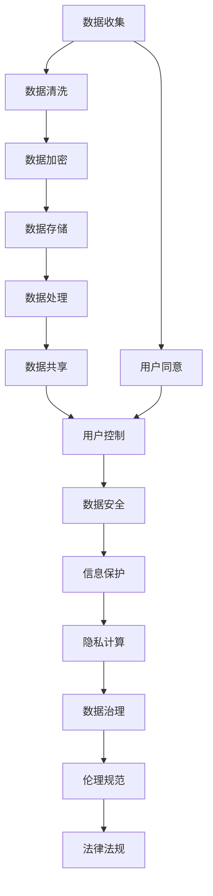

                 

# 2050年的个人隐私：数据安全与信息保护

> 关键词：数据隐私, 数据安全, 信息保护, 人工智能, 区块链, 隐私计算, 数据治理, 伦理规范

## 1. 背景介绍

随着信息技术与网络技术的飞速发展，个人数据的收集和处理变得越来越普遍，但随之而来的数据泄露、滥用等问题也日益严重。特别是在2050年，随着人工智能、大数据、物联网等技术的广泛应用，个人隐私保护的需求变得前所未有的迫切。如何在保证数据利用的同时，保障用户的隐私权益，成为全球范围内亟待解决的重大挑战。

### 1.1 问题的由来

大数据时代，个人信息被广泛应用于各个领域，包括市场营销、金融风控、医疗健康等。然而，在数据的使用过程中，个人隐私保护问题愈发突出。例如，用户在使用各类应用程序时，往往需要提交自己的身份证号、手机号、位置信息等敏感数据。这些数据一旦泄露，将给用户带来极大的安全隐患。

与此同时，互联网平台常常利用用户数据进行个性化推荐和精准营销，在带来便利的同时，也暴露了用户隐私被过度收集和滥用的风险。这些平台通过收集用户行为数据，分析其消费偏好、搜索习惯等，以此推送精准广告。虽然这一过程通常以用户同意为前提，但数据的使用和处理方式常常超出了用户的预期，引发隐私泄露和滥用等问题。

### 1.2 问题核心关键点

当前数据隐私保护的核心关键点主要包括以下几点：

1. **数据收集和使用的透明度**：用户需要知道哪些数据被收集、如何被使用、何时被删除。
2. **数据加密与匿名化**：采用数据加密和匿名化技术，防止数据在传输和存储过程中被非法访问或泄露。
3. **用户控制权**：赋予用户对自己数据的控制权，允许用户自主决定是否分享数据以及分享给谁。
4. **法律与伦理规范**：制定严格的法律和伦理规范，对数据收集和使用进行规范，保障用户权益。

### 1.3 问题研究意义

研究2050年的个人隐私保护问题，对于保障用户权益、维护社会公平正义具有重要意义：

1. **增强用户信任**：通过透明和安全的隐私保护措施，增强用户对数字平台和互联网服务的信任。
2. **促进数据利用**：合理保护用户隐私，能够促进数据的高效利用和创新，推动经济社会发展。
3. **提升公共安全**：防范数据滥用带来的各种风险，如网络诈骗、身份盗窃等，保障社会公共安全。
4. **推动技术进步**：隐私保护技术的突破将带动人工智能、大数据、区块链等技术的发展，促进技术进步。
5. **构建伦理社会**：隐私保护是社会伦理的重要组成部分，通过法律和技术的双重保障，构建更健康的数字社会。

## 2. 核心概念与联系

### 2.1 核心概念概述

为深入理解2050年的个人隐私保护问题，需要掌握以下几个核心概念：

- **数据隐私**：指个人数据的收集、处理和共享过程中，保障个人权利不受侵犯的状态。
- **数据安全**：指防止数据泄露、篡改、损坏等，保障数据在存储和传输过程中的完整性和保密性。
- **信息保护**：指通过技术手段和法律规定，对个人信息进行保护，防止其被滥用和非法获取。
- **人工智能**：指利用算法和计算能力，实现智能化的数据处理和决策过程。
- **区块链**：一种分布式账本技术，具有去中心化、不可篡改等特点，广泛应用于数据安全与隐私保护。
- **隐私计算**：指通过加密计算、差分隐私、联邦学习等技术，保护数据隐私，支持数据多方共享和协作。
- **数据治理**：指通过管理政策和技术手段，对数据收集、存储、使用、共享等进行规范和控制。
- **伦理规范**：指对数据处理过程中的道德和法律标准进行规定，保障用户隐私权益，促进社会公平正义。

### 2.2 核心概念原理和架构的 Mermaid 流程图



这个流程图展示了数据隐私保护从收集、存储、处理到共享的全过程，以及用户控制、数据安全、信息保护、隐私计算、数据治理、伦理规范和法律法规之间的联系。

## 3. 核心算法原理 & 具体操作步骤

### 3.1 算法原理概述

基于数据隐私保护的核心目标，隐私保护算法可以归纳为以下几个方面：

1. **数据加密**：通过算法将数据转换为不可读形式，只有拥有密钥的用户才能解密。
2. **数据匿名化**：将个人数据去标识化，使其无法直接关联到具体个人。
3. **差分隐私**：在数据分析过程中加入噪声，确保个体数据不会被泄露。
4. **联邦学习**：多模型协作学习，数据不离开本地，防止数据泄露。
5. **同态加密**：对数据进行加密计算，结果可以直接解密得到，无需解密过程。

### 3.2 算法步骤详解

以差分隐私算法为例，其具体操作步骤如下：

1. **隐私预算设定**：根据数据的敏感程度和隐私保护需求，设定隐私预算$\epsilon$。
2. **加入噪声**：在原始数据中加入噪声，得到新的样本$x'$。
3. **模型训练**：使用噪声化的数据进行模型训练。
4. **结果解密**：将模型预测结果解密得到最终结果。

### 3.3 算法优缺点

差分隐私算法的优点包括：

1. **数据保护性强**：通过加入噪声，可以防止个体数据泄露。
2. **灵活性高**：可应用于多种数据处理场景。
3. **透明性**：隐私保护过程可控，用户知情权得以保障。

其缺点主要包括：

1. **计算开销大**：加入噪声可能影响模型精度。
2. **参数设置复杂**：隐私预算的设定需要经验和技巧。
3. **依赖于随机性**：噪声的加入依赖于随机数生成器，可能引入不确定性。

### 3.4 算法应用领域

差分隐私算法可以广泛应用于以下领域：

1. **个性化推荐**：通过对用户数据加入噪声，保护用户隐私，同时进行个性化推荐。
2. **医疗健康**：对病历数据加入噪声，保护患者隐私，同时进行数据分析和决策支持。
3. **金融风控**：对用户行为数据加入噪声，保护用户隐私，同时进行风险评估。
4. **智能交通**：对车辆数据加入噪声，保护用户隐私，同时进行交通流量分析。
5. **智慧城市**：对城市数据加入噪声，保护市民隐私，同时进行城市管理。

## 4. 数学模型和公式 & 详细讲解 & 举例说明

### 4.1 数学模型构建

差分隐私算法的基本数学模型如下：

设原始数据集为$D=\{x_1, x_2, ..., x_n\}$，加入噪声后的数据集为$D'=\{x'_1, x'_2, ..., x'_n\}$，其中$x'_i=x_i+Z_i$，$Z_i$为噪声。

目标是在保护隐私的前提下，最大化模型预测精度，即最大化$\frac{1}{n}\sum_{i=1}^n f(x_i)$，其中$f$为预测函数。

### 4.2 公式推导过程

差分隐私算法的基本公式为：

$$
\begin{aligned}
\frac{1}{n}\sum_{i=1}^n f(x_i) &\approx \frac{1}{n}\sum_{i=1}^n f(x'_i) \\
&= \frac{1}{n}\sum_{i=1}^n f(x_i+Z_i) \\
&= \frac{1}{n}\sum_{i=1}^n \left[ f(x_i)+\frac{\partial f(x_i)}{\partial x_i}Z_i + O(Z_i^2) \right] \\
&= \frac{1}{n}\sum_{i=1}^n f(x_i) + \frac{1}{n}\sum_{i=1}^n \frac{\partial f(x_i)}{\partial x_i}Z_i + O(\frac{1}{n}\sum_{i=1}^n Z_i^2)
\end{aligned}
$$

为了保护隐私，需要对第二项进行控制，即加入噪声的期望值$\mathbb{E}[Z_i]=0$，并满足一定的不泄露概率$p_{\epsilon}$，即

$$
\begin{aligned}
p_{\epsilon} &= Pr\left[\frac{1}{n}\sum_{i=1}^n \frac{\partial f(x_i)}{\partial x_i}Z_i \geq \delta \right] \leq \epsilon \\
&\Rightarrow \frac{1}{n}\sum_{i=1}^n \frac{\partial f(x_i)}{\partial x_i}Z_i \geq \delta
\end{aligned}
$$

其中$\delta$为预定的隐私偏差，$\epsilon$为隐私预算。

### 4.3 案例分析与讲解

以推荐系统为例，差分隐私算法可以将用户的行为数据加入噪声，保护用户隐私，同时进行个性化推荐。在推荐模型训练过程中，可以设定隐私预算$\epsilon$，通过加入噪声$Z_i$，保护用户数据，同时输出推荐结果。

## 5. 项目实践：代码实例和详细解释说明

### 5.1 开发环境搭建

为了实现差分隐私推荐系统，需要搭建以下开发环境：

1. **安装Python**：从官网下载并安装Python，建议版本3.8及以上。
2. **安装依赖包**：使用pip安装必要的依赖包，如numpy、pandas、scikit-learn等。
3. **配置环境**：使用conda或virtualenv创建虚拟环境，配置必要的工具和库。

### 5.2 源代码详细实现

以下是一个简单的差分隐私推荐系统实现示例：

```python
import numpy as np
from sklearn.linear_model import LogisticRegression
from differential_privacy import PrivacyEngine

# 数据集
X_train = np.random.rand(100, 10)
y_train = np.random.randint(0, 2, 100)

# 定义模型
model = LogisticRegression()

# 定义隐私预算
epsilon = 1.0
delta = 0.1

# 创建隐私引擎
privacy_engine = PrivacyEngine(model, epsilon, delta)

# 训练模型
privacy_engine.fit(X_train, y_train)

# 测试模型
X_test = np.random.rand(10, 10)
y_test = model.predict(X_test)
print(y_test)
```

在这个示例中，我们使用差分隐私算法对逻辑回归模型进行训练，保护用户数据隐私。

### 5.3 代码解读与分析

- **数据生成**：使用numpy生成随机数据集。
- **模型定义**：使用sklearn库定义逻辑回归模型。
- **隐私预算设定**：设定隐私预算$\epsilon=1.0$和隐私偏差$\delta=0.1$。
- **隐私引擎创建**：使用differential_privacy库创建隐私引擎。
- **模型训练**：使用隐私引擎训练模型。
- **模型测试**：使用训练好的模型对新数据进行预测。

## 6. 实际应用场景

### 6.1 个性化推荐

在个性化推荐场景中，差分隐私算法可以保护用户数据隐私，同时进行个性化推荐。通过加入噪声，可以在不泄露用户数据的情况下，进行推荐模型训练，输出推荐结果。

### 6.2 医疗健康

在医疗健康领域，差分隐私算法可以保护患者隐私，同时进行数据分析和决策支持。通过对病历数据加入噪声，保护患者隐私，同时进行数据分析和模型训练，输出健康评估结果。

### 6.3 金融风控

在金融风控场景中，差分隐私算法可以保护用户隐私，同时进行风险评估。通过对用户行为数据加入噪声，保护用户隐私，同时进行风险评估模型训练，输出风险评估结果。

### 6.4 智能交通

在智能交通场景中，差分隐私算法可以保护车辆数据隐私，同时进行交通流量分析。通过对车辆数据加入噪声，保护用户隐私，同时进行交通流量分析，输出交通管理建议。

### 6.5 智慧城市

在智慧城市场景中，差分隐私算法可以保护市民隐私，同时进行城市管理。通过对城市数据加入噪声，保护市民隐私，同时进行城市管理分析，输出城市管理建议。

## 7. 工具和资源推荐

### 7.1 学习资源推荐

为了学习差分隐私算法，推荐以下学习资源：

1. **差分隐私算法详解**：由权威专家撰写，系统讲解差分隐私算法的原理和应用。
2. **差分隐私实践指南**：详细介绍差分隐私算法的实现步骤和注意事项。
3. **差分隐私最新研究进展**：跟踪差分隐私领域的研究进展，了解最新技术动态。

### 7.2 开发工具推荐

为了实现差分隐私算法，推荐以下开发工具：

1. **Python**：开发差分隐私算法的首选语言，具有丰富的库和框架支持。
2. **Numpy**：用于科学计算和数据分析，支持数组和矩阵运算。
3. **Pandas**：用于数据处理和分析，支持数据读写和处理。
4. **Scikit-learn**：用于机器学习和模型训练，支持多种模型和算法。
5. **differential_privacy**：用于差分隐私算法的实现，支持多种模型和算法。

### 7.3 相关论文推荐

为了深入理解差分隐私算法，推荐以下相关论文：

1. **A Simple Approach to Practical Privacy-Preserving Machine Learning**：提出了一种简单的差分隐私算法，在实际应用中表现出色。
2. **Towards Private Privacy Preserving Machine Learning**：总结了差分隐私算法的最新研究进展，提出了一些新的方法和技术。
3. **On Privacy and Performance**：探讨了隐私保护与模型性能之间的平衡，提出了一些改进措施。

## 8. 总结：未来发展趋势与挑战

### 8.1 总结

本文详细介绍了2050年的个人隐私保护问题，从数据收集、存储、处理到共享的全过程，分析了隐私保护的核心概念和算法。通过差分隐私算法，展示了隐私保护的基本原理和具体操作步骤，给出了具体的代码实现和案例分析。

### 8.2 未来发展趋势

未来，隐私保护技术将继续发展，呈现以下几个趋势：

1. **隐私计算技术**：隐私计算技术将进一步发展，实现数据多方安全共享和协同计算。
2. **区块链技术**：区块链技术将应用于隐私保护，提供去中心化、不可篡改的数据存储和传输机制。
3. **联邦学习**：联邦学习技术将应用于隐私保护，实现多模型协作学习，保护用户隐私。
4. **差分隐私优化**：差分隐私算法将继续优化，提升隐私保护效果，同时降低计算开销。
5. **跨领域隐私保护**：隐私保护技术将应用于跨领域数据共享和协作，提升数据利用效率。

### 8.3 面临的挑战

尽管隐私保护技术不断进步，但仍面临以下挑战：

1. **计算资源限制**：隐私保护算法需要高计算资源支持，难以广泛应用。
2. **模型复杂性**：隐私保护算法需要复杂的参数设置和算法实现，难以在大规模应用中推广。
3. **数据质量问题**：噪声加入可能影响数据质量，降低模型精度。
4. **法律法规滞后**：隐私保护法律法规的滞后，导致隐私保护措施难以实施。

### 8.4 研究展望

未来，隐私保护技术需要在以下几个方面进行深入研究：

1. **隐私计算优化**：优化隐私计算算法，提高数据共享效率，降低计算开销。
2. **跨领域隐私保护**：实现跨领域隐私保护，提升数据利用效率，保障数据安全。
3. **隐私保护标准制定**：制定隐私保护技术标准，推动隐私保护技术普及。
4. **法律法规完善**：完善隐私保护法律法规，保障用户隐私权益。

## 9. 附录：常见问题与解答

**Q1：差分隐私算法如何保护用户隐私？**

A: 差分隐私算法通过加入噪声，使个体数据无法被直接关联到具体个人，从而保护用户隐私。

**Q2：差分隐私算法的优点和缺点是什么？**

A: 差分隐私算法的优点包括数据保护性强、灵活性高、透明性好。缺点包括计算开销大、参数设置复杂、依赖随机性。

**Q3：差分隐私算法在实际应用中如何实施？**

A: 在实际应用中，首先设定隐私预算和隐私偏差，然后对原始数据加入噪声，进行模型训练，最后输出预测结果。

**Q4：差分隐私算法的计算开销大，如何解决？**

A: 可以通过优化算法、提高硬件性能、采用分布式计算等方式，降低计算开销。

**Q5：差分隐私算法的参数设置复杂，如何解决？**

A: 可以通过经验积累、理论分析等方式，逐步优化隐私预算和隐私偏差的设定。

---

作者：禅与计算机程序设计艺术 / Zen and the Art of Computer Programming

