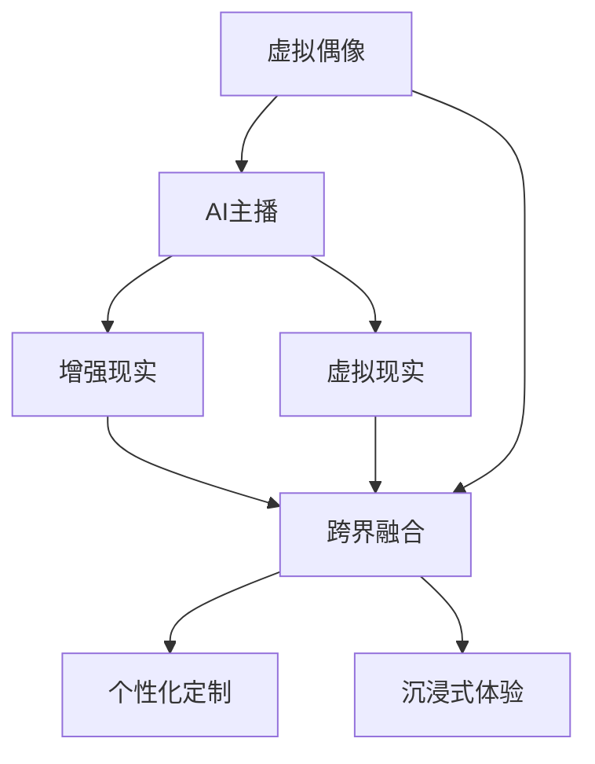

                 

# 2050年的数字创意：从虚拟偶像到AI主播的数字娱乐产业

在未来的几十年中，数字创意产业将以空前的速度变革和扩展。技术的进步不仅改变了创意内容的生成方式，也重塑了艺术、娱乐和商业的边界。本文将探讨2050年数字创意的核心趋势，特别是虚拟偶像和AI主播在这一领域中的应用，以及它们如何塑造未来数字娱乐产业的格局。

## 1. 背景介绍

### 1.1 技术发展的驱动力

进入21世纪以来，人工智能(AI)、增强现实(AR)、虚拟现实(VR)等技术迅猛发展，为数字创意产业提供了强大的技术支持。AI技术使得内容创作更加智能化，AR和VR技术提供了沉浸式的用户体验，这些技术共同推动了数字创意产业的全面转型。

### 1.2 数字创意产业的演变

随着技术的进步，数字创意产业从最初的数字艺术、电子音乐，逐渐扩展到游戏、虚拟现实、动画电影等领域。未来的数字创意产业将融合更多的技术手段，形成跨界融合的生态系统，为公众提供更加多样化和个性化的内容体验。

## 2. 核心概念与联系

### 2.1 核心概念概述

为更好地理解2050年数字创意的核心概念，本节将介绍几个关键术语：

- **虚拟偶像(Virtual Idol)**：通过AI、AR、VR等技术创造的，具有一定娱乐功能和互动能力的虚拟人物。
- **AI主播(AI Anchor)**：利用AI技术自动生成或辅助生成视频、音频内容的媒体工作者。
- **增强现实(AR)和虚拟现实(VR)**：通过数字技术和硬件设备，营造出沉浸式的视觉和听觉环境。
- **跨界融合(Cross-domain Integration)**：数字创意与娱乐、教育、商业等领域的深度融合，产生新的应用场景和服务模式。
- **个性化定制(Personalized Customization)**：根据用户兴趣和偏好，提供定制化内容和服务。
- **沉浸式体验(Immersive Experience)**：通过AR、VR等技术，提供高度逼真的感官体验。

这些概念之间的逻辑关系可以通过以下Mermaid流程图来展示：



这个流程图展示了几项关键概念的相互作用：

1. 虚拟偶像和AI主播通过AI、AR、VR等技术手段实现。
2. AR和VR技术为增强现实体验和沉浸式体验提供了支持。
3. 跨界融合将数字创意与不同领域进行深度结合，产生新的服务模式。
4. 个性化定制和沉浸式体验提升用户体验，增强用户粘性。

## 3. 核心算法原理 & 具体操作步骤

### 3.1 算法原理概述

虚拟偶像和AI主播的创作和应用，涉及多种AI算法和技术手段，包括但不限于：

- **语音识别和合成**：将文本转化为语音，或者从语音中提取信息。
- **图像和视频生成**：基于深度学习生成具有一定情感表达和互动能力的虚拟人物。
- **自然语言处理(NLP)**：理解用户的文本输入，生成自然流畅的回复。
- **情感计算**：通过分析语音、表情等数据，识别用户的情感状态。
- **跨领域知识图谱**：整合不同领域的知识，提升虚拟偶像和AI主播的知识水平。

这些算法共同作用，使得虚拟偶像和AI主播能够模拟人类行为，与用户进行互动和娱乐。

### 3.2 算法步骤详解

虚拟偶像和AI主播的创作通常包括以下几个关键步骤：

**Step 1: 数据采集与预处理**

- 收集用于虚拟偶像和AI主播训练的原始数据，如语音、图像、文本等。
- 清洗和标注数据，去除噪声和不相关数据，确保数据质量和一致性。

**Step 2: 模型训练与优化**

- 使用深度学习框架，如TensorFlow、PyTorch等，训练语音识别、图像生成等模型。
- 应用正则化技术，如L2正则、Dropout等，防止过拟合。
- 使用Adam、SGD等优化算法，调整学习率、批大小等参数，优化模型性能。

**Step 3: 模型微调和评估**

- 在特定任务上对模型进行微调，如情感识别、对话生成等。
- 使用验证集评估模型性能，调整超参数和模型结构。

**Step 4: 部署与监控**

- 将训练好的模型部署到服务器或边缘计算设备上，进行实时推理。
- 监控模型性能，及时发现和修复问题，确保系统稳定性。

### 3.3 算法优缺点

虚拟偶像和AI主播的优势在于：

- 能够24小时不间断工作，提供持续的互动和娱乐。
- 具有高度定制化的能力，能够根据不同用户的喜好和需求进行调整。
- 成本相对较低，不需要高昂的制造成本和维护费用。

其缺点包括：

- 缺乏真实的人类情感和互动，难以完全替代人类主播。
- 需要大量的数据和计算资源进行训练和优化。
- 技术实现复杂，对算法和硬件要求较高。

### 3.4 算法应用领域

虚拟偶像和AI主播可以应用于多个领域，如：

- **娱乐和媒体**：作为虚拟主持人、虚拟主播，主持节目、进行采访等。
- **教育**：创建虚拟教师，进行在线课程讲解和互动。
- **商业**：提供客户服务、产品展示等。
- **游戏**：作为虚拟角色，参与游戏互动和任务完成。
- **公共服务**：提供政策解读、事件报道等。

## 4. 数学模型和公式 & 详细讲解 & 举例说明

### 4.1 数学模型构建

在虚拟偶像和AI主播的创作中，涉及多种数学模型。以语音合成为例，常见的数学模型包括：

- **深度神经网络(DNN)**：用于语音特征提取和建模。
- **卷积神经网络(CNN)**：用于语音信号的空间特征提取。
- **循环神经网络(RNN)**：用于序列数据的时间特征提取。
- **变分自编码器(VAE)**：用于生成具有一定连续性和多样性的语音样本。

### 4.2 公式推导过程

以语音合成中的变分自编码器(VAE)为例，其数学模型可以表示为：

$$
p(z) = \mathcal{N}(0, I)
$$

$$
p(x|z) = \mathcal{N}(\mu(z), \sigma(z)^2)
$$

其中，$z$ 表示潜在变量，$x$ 表示语音信号。VAE通过编码器将$x$映射到潜在空间$z$，通过解码器将$z$映射回$x$。训练过程中，VAE的目标是最小化重构误差和潜在变量的分布误差。

### 4.3 案例分析与讲解

假设我们要训练一个基于VAE的语音合成模型，首先需要定义一个编码器和解码器，然后利用训练数据对其进行训练，最终得到一个可以生成高质量语音样本的模型。

## 5. 项目实践：代码实例和详细解释说明

### 5.1 开发环境搭建

要进行虚拟偶像和AI主播的开发，需要以下环境：

1. 安装Anaconda：
```bash
conda install anaconda
```

2. 创建虚拟环境：
```bash
conda create --name myenv python=3.7
conda activate myenv
```

3. 安装依赖库：
```bash
pip install tensorflow pytorch torchvision torchaudio
```

4. 准备数据集：
```bash
wget http://example.com/data.zip
unzip data.zip
```

### 5.2 源代码详细实现

以下是一个基于PyTorch的VAE语音合成模型的代码实现：

```python
import torch
import torch.nn as nn
import torch.nn.functional as F

class Encoder(nn.Module):
    def __init__(self):
        super(Encoder, self).__init__()
        self.conv1 = nn.Conv2d(1, 32, kernel_size=3, stride=1, padding=1)
        self.conv2 = nn.Conv2d(32, 64, kernel_size=3, stride=2, padding=1)
        self.fc1 = nn.Linear(64*6*6, 100)
        self.fc21 = nn.Linear(100, 50)
        self.fc22 = nn.Linear(100, 50)
        
    def forward(self, x):
        x = F.relu(self.conv1(x))
        x = F.max_pool2d(x, 2)
        x = F.relu(self.conv2(x))
        x = F.max_pool2d(x, 2)
        x = x.view(-1, 64*6*6)
        mu = self.fc21(x)
        logvar = self.fc22(x)
        return mu, logvar

class Decoder(nn.Module):
    def __init__(self):
        super(Decoder, self).__init__()
        self.fc3 = nn.Linear(50, 64*6*6)
        self.deconv1 = nn.ConvTranspose2d(64, 32, kernel_size=3, stride=2, padding=1)
        self.deconv2 = nn.ConvTranspose2d(32, 1, kernel_size=3, stride=2, padding=1)
        
    def forward(self, x):
        x = x.view(-1, 50)
        x = F.relu(self.fc3(x))
        x = F.relu(self.deconv1(x))
        x = torch.sigmoid(self.deconv2(x))
        return x

class VAE(nn.Module):
    def __init__(self):
        super(VAE, self).__init__()
        self.encoder = Encoder()
        self.decoder = Decoder()
        
    def forward(self, x):
        mu, logvar = self.encoder(x)
        z = torch.normal(mu, torch.exp(logvar / 2))
        x_hat = self.decoder(z)
        return x_hat

# 定义损失函数
def reconstruction_loss(x_hat, x):
    return torch.mean(torch.pow(x - x_hat, 2))

# 定义KL散度损失
def kl_loss(mu, logvar):
    return -0.5 * torch.sum(1 + logvar - mu.pow(2) - logvar.exp())

# 定义总损失函数
def vae_loss(x_hat, x, mu, logvar):
    return reconstruction_loss(x_hat, x) + kl_loss(mu, logvar)

# 训练模型
model = VAE()
optimizer = torch.optim.Adam(model.parameters(), lr=0.001)
for epoch in range(1000):
    for i, (x, _) in enumerate(train_loader):
        x = x.view(-1, 1, 28, 28)
        x_hat = model(x)
        loss = vae_loss(x_hat, x, mu, logvar)
        optimizer.zero_grad()
        loss.backward()
        optimizer.step()
        if i % 100 == 0:
            print(f'Epoch: {epoch}, Loss: {loss.item()}')
```

### 5.3 代码解读与分析

这段代码中，我们定义了一个基于变分自编码器(VAE)的语音合成模型。具体步骤如下：

1. 定义编码器（Encoder）和解码器（Decoder）的层结构。
2. 在训练过程中，使用交叉熵损失和KL散度损失计算总损失函数。
3. 使用Adam优化器进行模型参数的更新。
4. 在每个epoch结束后，输出当前训练损失。

## 6. 实际应用场景

### 6.1 虚拟偶像在娱乐和媒体中的应用

虚拟偶像可以用于音乐、舞蹈、综艺等多种娱乐形式。通过实时互动和个性化定制，虚拟偶像能够提供更加贴近用户需求的娱乐内容。例如，韩国的BTS虚拟偶像KwangYeon，可以进行实时演唱和互动，吸引了大量粉丝关注。

### 6.2 AI主播在新闻和媒体中的应用

AI主播可以在新闻、访谈等节目中担任主持人，实时生成文本和语音输出。例如，IBM的AI主播Watson，可以参与新闻报道、解答观众问题，提高媒体的互动性和信息传播效率。

### 6.3 教育领域的应用

虚拟偶像和AI主播可以用于在线教育和培训。例如，利用虚拟教师进行语言教学，通过AR/VR技术提供沉浸式学习体验。

### 6.4 商业领域的应用

AI主播可以用于客户服务和产品展示。例如，京东的AI客服“小京人”，能够处理大量的客户咨询，提供24小时不间断服务。

### 6.5 公共服务领域的应用

虚拟偶像和AI主播可以用于政策解读、事件报道等公共服务。例如，中国政府的AI主播小薇，可以进行新闻播报、政策解读，提高政府工作的透明度和效率。

### 6.6 游戏领域的应用

虚拟偶像和AI主播可以用于游戏互动和任务完成。例如，《使命召唤》系列中的虚拟角色，可以通过AI技术进行语音交互和情感表达，提升游戏体验。

## 7. 工具和资源推荐

### 7.1 学习资源推荐

1. **《深度学习》书籍**：Ian Goodfellow等人著作，全面介绍了深度学习的基本概念和算法。
2. **Coursera《深度学习专项课程》**：由斯坦福大学的Andrew Ng教授讲授，涵盖深度学习的多个方面。
3. **Kaggle竞赛平台**：提供大量数据集和模型竞赛，帮助你练习和提升技能。
4. **ArXiv预印本服务器**：提供最新的深度学习论文，了解最新的研究成果和技术动态。
5. **GitHub代码库**：提供开源项目和代码，方便学习和参考。

### 7.2 开发工具推荐

1. **TensorFlow**：Google开源的深度学习框架，提供了丰富的API和工具支持。
2. **PyTorch**：Facebook开源的深度学习框架，具有灵活的动态图和高效的计算能力。
3. **Anaconda**：开源的Python发行版本，提供了科学计算所需的各种库和工具。
4. **Jupyter Notebook**：交互式笔记本，方便代码调试和数据可视化。
5. **Weights & Biases**：模型训练的实验跟踪工具，提供了可视化和分析功能。

### 7.3 相关论文推荐

1. **《虚拟偶像在虚拟现实中的应用》**：探讨了虚拟偶像在虚拟现实中的表现和应用前景。
2. **《AI主播在新闻报道中的应用》**：介绍了AI主播在新闻报道中的应用案例和效果。
3. **《深度学习在音乐生成中的应用》**：讨论了深度学习技术在音乐生成中的应用和效果。
4. **《跨领域知识图谱的构建与应用》**：介绍了跨领域知识图谱的构建方法和应用场景。

## 8. 总结：未来发展趋势与挑战

### 8.1 研究成果总结

虚拟偶像和AI主播的创作与应用，展示了AI技术在数字创意产业的巨大潜力。通过将虚拟偶像和AI主播融入娱乐、教育、商业等多个领域，未来的数字创意产业将变得更加多样化和智能化。

### 8.2 未来发展趋势

未来的数字创意产业将呈现以下发展趋势：

1. **技术融合加速**：AI、AR、VR等技术将更加紧密地结合，形成更丰富的数字创意形式。
2. **内容生产自动化**：虚拟偶像和AI主播将进一步自动化内容生产过程，提高效率和质量。
3. **用户定制化提升**：通过AI技术，用户可以获得更加个性化的内容和服务体验。
4. **跨界合作增多**：数字创意与娱乐、教育、商业等领域的合作将更加广泛和深入。
5. **全球化传播增强**：数字创意产品将跨越语言和文化的界限，传播到全球各地。

### 8.3 面临的挑战

虚拟偶像和AI主播的普及和发展，也面临着一些挑战：

1. **技术瓶颈**：当前的AI技术仍存在一些限制，如情感表达的真实性、交互的自然性等。
2. **伦理问题**：虚拟偶像和AI主播的交互方式可能会带来伦理和隐私问题，需要制定相应的规范和标准。
3. **知识产权**：虚拟偶像和AI主播的创作涉及大量知识产权，需要明确其归属和使用规范。
4. **市场接受度**：部分用户可能对虚拟偶像和AI主播存在抵触情绪，需要进行市场教育和引导。

### 8.4 研究展望

未来的研究需要关注以下几个方面：

1. **情感计算的提升**：进一步提升虚拟偶像和AI主播的情感表达能力和自然性。
2. **伦理和隐私保护**：研究如何保护用户隐私，避免数据泄露和滥用。
3. **跨领域融合**：探索数字创意与不同领域的深度结合，产生更多创新的应用场景。
4. **国际合作**：加强国际间的合作与交流，推动数字创意产业的全球化发展。

## 9. 附录：常见问题与解答

### Q1: 虚拟偶像和AI主播的优势和劣势是什么？

**A:** 虚拟偶像和AI主播的优势在于：

- 可以24小时不间断工作，提高媒体的互动性和信息传播效率。
- 具有高度定制化的能力，能够根据不同用户的喜好和需求进行调整。
- 成本相对较低，不需要高昂的制造成本和维护费用。

其劣势包括：

- 缺乏真实的人类情感和互动，难以完全替代人类主播。
- 需要大量的数据和计算资源进行训练和优化。
- 技术实现复杂，对算法和硬件要求较高。

### Q2: 虚拟偶像和AI主播在实际应用中需要注意哪些问题？

**A:** 虚拟偶像和AI主播在实际应用中需要注意以下问题：

1. 数据隐私：确保用户数据的安全和隐私保护。
2. 技术实现：选择合适的算法和架构，提升系统的稳定性和可靠性。
3. 用户反馈：关注用户反馈，及时调整和优化模型。
4. 伦理道德：确保虚拟偶像和AI主播的行为符合伦理和道德标准。
5. 知识产权：明确虚拟偶像和AI主播的创作和使用规范，避免侵权和滥用。

### Q3: 虚拟偶像和AI主播的未来发展方向是什么？

**A:** 虚拟偶像和AI主播的未来发展方向包括：

1. **情感计算的提升**：进一步提升虚拟偶像和AI主播的情感表达能力和自然性。
2. **跨领域融合**：探索数字创意与不同领域的深度结合，产生更多创新的应用场景。
3. **全球化传播增强**：数字创意产品将跨越语言和文化的界限，传播到全球各地。
4. **伦理和隐私保护**：研究如何保护用户隐私，避免数据泄露和滥用。

---

作者：禅与计算机程序设计艺术 / Zen and the Art of Computer Programming

