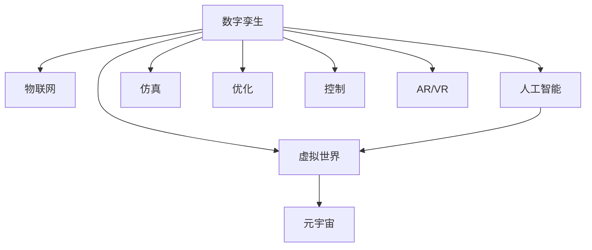

                 

# 2050年的数字孪生：从数字分身到元宇宙生活的虚实融合

> 关键词：数字孪生,元宇宙,虚实融合,数字分身,物联网,人工智能,未来科技

## 1. 背景介绍

随着数字技术的不断发展，我们正逐步迈向一个高度数字化、智能化的未来。在这个数字化转型的大潮中，数字孪生(Digital Twin)和元宇宙(Metaverse)的概念正逐渐成为行业热词，并将在2050年的数字化世界扮演关键角色。

### 1.1 问题由来

数字孪生是指通过物理实体的数字化重现，构建出一个与现实世界完全一致的数字镜像，并在数字空间中进行模拟、优化和控制。这一技术广泛应用于工业、医疗、城市管理等多个领域，帮助人们在虚拟与现实之间建立更紧密的连接。

元宇宙则是一个全时全境的全息虚拟空间，用户可以沉浸式地体验虚拟生活、工作、社交等活动。元宇宙作为一个虚拟世界，将与现实世界进行更紧密的融合，提供一种全新的交互体验。

这两个概念的结合，即虚实融合(Virtual Reality, VR)/增强现实(Augmented Reality, AR)与物联网(IoT)、人工智能(AI)等技术的深度融合，将推动社会进入一个全新的数字时代。

### 1.2 问题核心关键点

数字孪生和元宇宙的核心关键点包括：

- 数字孪生：通过仿真、优化和控制，实现对现实世界实体的虚拟重现和虚拟操作。
- 元宇宙：创建一个沉浸式的虚拟空间，让用户可以实时交互、协作，体验虚拟生活。
- 虚实融合：利用AR/VR技术将虚拟世界与现实世界进行无缝衔接，实现全时全境的沉浸式体验。
- 数字分身：通过AI技术对现实世界实体进行数字化映射，并在虚拟世界中形成可控的数字模型。
- 物联网：实现物理世界的数字化，通过传感器、设备等将数据传输到数字孪生和元宇宙中。
- 人工智能：在数字孪生和元宇宙中，通过AI进行数据处理、预测和优化，提升虚拟与现实交互的智能化水平。

这些关键点共同构成了数字孪生和元宇宙的基本框架，推动了虚拟世界与现实世界的深度融合。

## 2. 核心概念与联系

### 2.1 核心概念概述

数字孪生和元宇宙是两个紧密相关但又有所区别的概念。其核心概念和联系可以通过以下Mermaid流程图来展示：



这个流程图展示了数字孪生和元宇宙之间的核心联系：

1. 数字孪生通过物联网对物理世界的数字化重现，并将数据传输到虚拟世界中。
2. 人工智能在数字孪生中用于数据处理、预测和优化，提升仿真、优化和控制的准确性。
3. 元宇宙作为一个虚拟空间，通过AR/VR技术将虚拟世界与现实世界进行无缝衔接。
4. 仿真、优化和控制是数字孪生的核心功能，而虚拟世界的构建和沉浸式体验是元宇宙的主要应用。

## 3. 核心算法原理 & 具体操作步骤

### 3.1 算法原理概述

数字孪生和元宇宙的算法原理主要基于物联网、人工智能和AR/VR技术。物联网技术实现了物理世界的数字化，并提供了数据采集和传输的能力；人工智能技术通过机器学习、深度学习等算法，对数据进行处理和分析；AR/VR技术则通过虚拟现实和增强现实，将数字信息在物理世界中进行可视化呈现。

数字孪生的核心算法包括：

- 传感器融合：将多种传感器采集的数据进行融合，构建出全面、准确的物理实体数字模型。
- 实时仿真：通过数值模拟和仿真技术，对物理实体进行实时仿真和预测。
- 优化与控制：利用机器学习算法对仿真结果进行优化和控制，提升决策效果。

元宇宙的核心算法包括：

- 虚拟场景构建：通过3D建模、纹理映射等技术，构建出沉浸式的虚拟环境。
- 用户交互：通过虚拟现实和增强现实技术，让用户能够沉浸式地体验虚拟世界，实现全时全境的交互。
- 仿真与优化：利用AI技术对虚拟世界进行仿真和优化，提升虚拟世界的逼真度和用户体验。

### 3.2 算法步骤详解

#### 数字孪生的算法步骤：

1. **数据采集与传输**
   - 通过传感器、设备等将物理实体的状态信息采集并传输到云端。
   - 使用物联网协议（如MQTT、CoAP等）实现数据的可靠传输。

2. **数据处理与融合**
   - 利用机器学习算法对采集的数据进行处理，提取特征。
   - 对多源数据进行融合，构建出全面、准确的数字模型。

3. **实时仿真与优化**
   - 使用数值模拟和仿真技术，对数字模型进行实时仿真。
   - 利用优化算法（如遗传算法、粒子群算法等）对仿真结果进行优化。

4. **决策与控制**
   - 通过AI算法对优化结果进行分析，输出决策。
   - 将决策转化为控制指令，对物理实体进行控制。

#### 元宇宙的算法步骤：

1. **虚拟场景构建**
   - 使用3D建模和纹理映射技术，构建虚拟环境。
   - 引入物理引擎，模拟虚拟世界中的物理现象（如重力、碰撞等）。

2. **用户交互**
   - 利用AR/VR设备，将虚拟世界映射到用户视场中。
   - 通过输入设备（如手柄、触觉反馈设备等）实现用户与虚拟环境的交互。

3. **仿真与优化**
   - 利用AI技术对虚拟世界进行实时仿真和优化。
   - 使用增强学习算法，提升虚拟世界的互动性和真实感。

### 3.3 算法优缺点

数字孪生和元宇宙的算法优点包括：

- **全面感知**：通过物联网和传感器技术，实现对物理世界的全面感知。
- **实时仿真与优化**：利用AI和仿真技术，对物理世界进行实时仿真和优化，提升决策效率。
- **沉浸式体验**：通过AR/VR技术，为用户提供沉浸式的虚拟体验。

但这些技术也存在一些局限性：

- **数据隐私**：物联网和传感器的广泛应用可能涉及用户隐私，需加强数据保护。
- **计算资源消耗**：高保真度的仿真和虚拟现实场景需要巨大的计算资源。
- **用户适应性**：AR/VR设备的普及度尚低，需进一步提升用户体验和适应性。
- **安全性**：元宇宙中可能存在虚拟暴力、诈骗等风险，需加强虚拟环境的安全管理。

### 3.4 算法应用领域

数字孪生和元宇宙的应用领域非常广泛，涵盖工业、医疗、教育、城市管理等多个方面：

- **工业领域**：利用数字孪生对生产设备和制造过程进行仿真和优化，提升生产效率和质量。
- **医疗领域**：构建数字化手术室和虚拟病人体系，辅助手术和治疗决策。
- **城市管理**：建立数字孪生城市，实时监控和管理城市交通、环境、公共设施等。
- **教育领域**：创建虚拟课堂和实验室，提供沉浸式的学习体验。
- **娱乐与社交**：开发虚拟现实游戏和社交平台，提供更丰富的娱乐和社交体验。

## 4. 数学模型和公式 & 详细讲解 & 举例说明

### 4.1 数学模型构建

数字孪生和元宇宙的数学模型主要包括以下几个部分：

- **物理模型**：描述物理实体和环境的数学模型，包括运动方程、传热方程、电磁方程等。
- **传感器模型**：描述传感器采集数据和传输过程的数学模型。
- **人工智能模型**：描述AI算法处理数据、进行优化和控制的数学模型，包括神经网络、机器学习、强化学习等。
- **虚拟现实模型**：描述虚拟世界和用户交互的数学模型，包括3D建模、渲染、物理引擎等。

### 4.2 公式推导过程

以数字孪生的仿真算法为例，其核心公式如下：

$$
\mathcal{S} = \mathcal{T}(\mathcal{M}, \mathcal{C})
$$

其中，$\mathcal{S}$ 表示仿真结果，$\mathcal{M}$ 表示物理模型，$\mathcal{C}$ 表示控制策略。

假设物理模型为一个线性微分方程组：

$$
\frac{d\mathbf{x}}{dt} = \mathbf{f}(\mathbf{x}, \mathbf{u}, t)
$$

其中，$\mathbf{x}$ 表示物理状态向量，$\mathbf{u}$ 表示控制输入向量，$t$ 表示时间。

通过数值方法（如Euler方法、Runge-Kutta方法等）对微分方程进行求解，即可得到仿真结果。例如，Euler方法的公式如下：

$$
\mathbf{x}_{n+1} = \mathbf{x}_n + \Delta t \mathbf{f}(\mathbf{x}_n, \mathbf{u}_n, t_n)
$$

### 4.3 案例分析与讲解

以工业数字化为例，一个数字孪生系统可能包括以下几个关键组件：

- **传感器网络**：用于采集物理设备的运行状态，如温度、压力、振动等。
- **物理模型**：描述设备运行状态变化的数学模型。
- **仿真引擎**：对设备运行状态进行数值模拟和仿真。
- **优化算法**：对仿真结果进行优化，如预测设备故障、优化运行参数等。
- **控制策略**：根据优化结果，对设备进行实时控制，如调整运行参数、执行维护操作等。

通过数字孪生，工业企业可以实现对设备的全面监控和实时优化，提升生产效率和质量，降低维护成本。

## 5. 项目实践：代码实例和详细解释说明

### 5.1 开发环境搭建

为实现数字孪生和元宇宙的开发，我们需要构建一个支持物联网、人工智能和AR/VR技术的开发环境。以下是具体的开发环境搭建步骤：

1. **硬件设备**：选择适合的传感器、AR/VR设备，构建数字孪生和元宇宙的物理环境。
2. **软件平台**：选择合适的软件平台（如ROS、Unity、Unreal Engine等），实现数据采集、处理和渲染。
3. **云平台**：选择云服务提供商（如AWS、Google Cloud、阿里云等），提供计算和存储资源。
4. **中间件**：选择支持物联网和传感器数据传输的中间件（如MQTT、CoAP、OpenXDM等），确保数据传输的可靠性。
5. **开发工具**：选择合适的编程语言和开发工具（如Python、C++、Unity等），实现算法开发和系统集成。

### 5.2 源代码详细实现

以下是使用Python和Unity3D实现数字孪生系统的代码示例：

```python
import sensor
import physics
import optimization
import control

def collect_data():
    sensor_data = sensor.collect_data()
    return sensor_data

def build_physics_model():
    physics_model = physics.build_physics_model()
    return physics_model

def simulate_physics():
    physics_model = build_physics_model()
    data = collect_data()
    simulation_result = physics.simulate_physics(physics_model, data)
    return simulation_result

def optimize_simulation():
    result = simulate_physics()
    optimized_result = optimization.optimize(result)
    return optimized_result

def execute_control():
    result = optimize_simulation()
    control_result = control.execute_control(result)
    return control_result

def main():
    result = execute_control()
    print(result)

if __name__ == "__main__":
    main()
```

在Unity3D中，我们可以使用C#编写以下代码实现AR/VR应用：

```csharp
using UnityEngine;
using UnityEngine.XR.ARSubsystems;
using UnityEngine.XR.Interaction.Toolkit;

public class ARApplication : MonoBehaviour
{
    public ARRaycastSystem arRaycastSystem;
    publicXRController xrController;

    void Update()
    {
        ARRaycastInput request = arRaycastSystem.CastRay(xrController.inputSource, 5f);
        if (request.hitCount > 0)
        {
            Debug.Log("Hit detected at " + request.hitInfo.GetPoint().x + ", " + request.hitInfo.GetPoint().y + ", " + request.hitInfo.GetPoint().z);
        }
    }
}
```

### 5.3 代码解读与分析

数字孪生系统的代码实现主要分为数据采集、物理模型构建、仿真、优化和控制等几个关键环节。

1. **数据采集**：通过传感器收集物理设备的运行状态，使用传感器网络协议进行数据传输。
2. **物理模型构建**：使用数学模型描述物理实体的运动和变化规律，如微分方程组、传递函数等。
3. **仿真**：使用数值方法对物理模型进行求解，得到仿真结果。
4. **优化**：利用机器学习算法对仿真结果进行优化，提升决策效果。
5. **控制**：根据优化结果，生成控制策略，对物理实体进行实时控制。

AR/VR应用的代码实现主要通过Unity3D平台，使用C#语言编写。

1. **AR Raycasting**：通过AR Raycasting技术，实现用户与虚拟环境的交互，捕捉用户的手势和位置信息。
2. **控制器**：使用XRController控制器，将用户的手势信息转化为虚拟环境中的交互动作。
3. **渲染**：通过渲染引擎，实现虚拟环境的实时渲染和展示。

## 6. 实际应用场景

### 6.1 智能制造

数字孪生和元宇宙在智能制造领域有广泛的应用。通过数字孪生，企业可以实现对设备的全面监控和实时优化，提升生产效率和质量，降低维护成本。例如，西门子公司利用数字孪生技术，实现了对制造设备的全面监控和实时优化，提升了生产效率。

### 6.2 虚拟医院

元宇宙在虚拟医院中的应用，可以帮助医生进行远程会诊、手术模拟和虚拟培训。例如，美国纽约大学朗格尼健康中心的VR手术训练平台，通过虚拟手术室，医生可以进行手术模拟，提高手术技能。

### 6.3 智慧城市

数字孪生技术可以应用于智慧城市管理，实现对城市交通、环境、公共设施等的实时监控和管理。例如，北京市利用数字孪生技术，实现了对城市交通的实时监控和管理，提高了交通管理效率。

### 6.4 虚拟旅游

元宇宙在虚拟旅游中的应用，可以提供沉浸式的旅游体验，让用户在家中也能欣赏到世界各地的风景名胜。例如，百度地图利用AR技术，实现了虚拟旅游功能，让用户可以实时查看地图上的景点信息。

## 7. 工具和资源推荐

### 7.1 学习资源推荐

为了深入理解数字孪生和元宇宙的核心技术，推荐以下学习资源：

1. **《数字孪生技术与应用》**：该书全面介绍了数字孪生技术的原理和应用，适合初学者入门。
2. **《元宇宙：未来商业与人类》**：该书探讨了元宇宙对经济、社会、文化等各方面的影响，适合读者深入了解元宇宙的核心思想。
3. **《Unity3D实战教程》**：该书介绍了Unity3D平台的使用方法和开发技巧，适合开发者进行AR/VR应用的开发实践。
4. **《物联网核心技术教程》**：该书介绍了物联网的核心技术和应用场景，适合理解数字孪生的数据采集和传输过程。

### 7.2 开发工具推荐

数字孪生和元宇宙的开发工具推荐如下：

1. **Unity3D**：一款强大的游戏引擎，支持AR/VR应用的开发，适合实现沉浸式虚拟环境。
2. **Unreal Engine**：一款高性能的游戏引擎，支持高质量3D渲染和物理模拟，适合构建高保真度的虚拟环境。
3. **ROS**：机器人操作系统，支持物联网和传感器数据的采集和处理，适合数字孪生的系统集成。
4. **AWS IoT**：亚马逊提供的物联网云服务平台，支持设备和数据的连接和管理，适合数字孪生的数据传输。
5. **TensorFlow**：谷歌开源的深度学习框架，支持人工智能算法的开发和部署，适合数字孪生中的优化和控制。

### 7.3 相关论文推荐

以下几篇论文为数字孪生和元宇宙的最新研究进展，推荐阅读：

1. **《数字孪生技术综述》**：介绍了数字孪生的定义、技术架构和应用场景，适合读者理解数字孪生的核心思想。
2. **《元宇宙：从虚拟到现实》**：探讨了元宇宙的发展历程和未来趋势，适合读者了解元宇宙的核心概念和应用方向。
3. **《基于数字孪生的智能制造》**：介绍了数字孪生在智能制造中的应用案例，适合理解数字孪生技术的实际应用。
4. **《基于元宇宙的虚拟医院》**：介绍了元宇宙在虚拟医院中的应用案例，适合了解元宇宙在医疗领域的应用。

## 8. 总结：未来发展趋势与挑战

### 8.1 研究成果总结

数字孪生和元宇宙的技术已经取得了显著的进展，并在多个领域得到广泛应用。其主要研究成果包括：

1. **数字孪生的全面感知和实时仿真**：通过物联网和传感器技术，实现了对物理世界的全面感知，并通过数值模拟和仿真技术，实现了物理实体的实时仿真。
2. **元宇宙的沉浸式体验和虚拟交互**：通过AR/VR技术，实现了用户与虚拟环境的沉浸式交互，提升了虚拟生活的体验感。
3. **虚实融合的多模态交互**：通过物联网和人工智能技术，实现了虚拟世界与现实世界的无缝衔接，提升了系统的智能水平。

### 8.2 未来发展趋势

数字孪生和元宇宙的未来发展趋势包括：

1. **全时全境的沉浸式体验**：通过5G、6G等高速网络，实现全时全境的沉浸式体验，提升用户的使用感受。
2. **多模态融合的智能交互**：通过物联网、人工智能和多模态技术，实现虚拟世界与现实世界的深度融合，提升系统的智能水平。
3. **跨平台协同的数字生态**：通过虚拟世界与现实世界的深度融合，实现跨平台、跨设备的协同操作，提升系统的灵活性和适用性。

### 8.3 面临的挑战

数字孪生和元宇宙在发展过程中面临的挑战包括：

1. **数据隐私和安全**：物联网和传感器数据的广泛应用可能涉及用户隐私，需加强数据保护和隐私管理。
2. **计算资源消耗**：高保真度的仿真和虚拟现实场景需要巨大的计算资源，需进一步优化算法和提高计算效率。
3. **用户体验和适应性**：AR/VR设备的普及度尚低，需进一步提升用户体验和适应性。
4. **安全性**：元宇宙中可能存在虚拟暴力、诈骗等风险，需加强虚拟环境的安全管理。

### 8.4 研究展望

未来的研究展望包括：

1. **隐私保护和安全**：通过加密技术、匿名化处理等手段，加强数据隐私和安全管理，保障用户隐私。
2. **计算效率优化**：通过分布式计算、混合精度计算等技术，优化算法和计算资源消耗，提升系统效率。
3. **用户适应性和体验**：通过人机交互技术、沉浸式设计等手段，提升用户体验和适应性，扩大用户基础。
4. **虚拟世界的伦理和道德**：通过伦理导向的评估指标和监管机制，确保虚拟世界的安全和伦理规范，保障社会稳定。

总之，数字孪生和元宇宙作为未来科技的重要方向，将为社会带来深刻的变革。通过持续的创新和优化，这一技术必将在更多领域得到应用，为人类生活带来更加便捷、智能、高效的方式。

## 9. 附录：常见问题与解答

**Q1：数字孪生和元宇宙的区别是什么？**

A: 数字孪生是通过数字技术实现对物理实体的数字化重现和仿真，强调的是物理世界与虚拟世界的映射和控制；元宇宙则是一个沉浸式的虚拟世界，强调的是用户与虚拟环境的交互和体验。数字孪生更多地应用于工业、医疗、城市管理等领域，元宇宙则更多地应用于娱乐、社交、教育等领域。

**Q2：数字孪生和元宇宙的主要优势是什么？**

A: 数字孪生和元宇宙的主要优势包括：
1. 全面感知：通过物联网和传感器技术，实现对物理世界的全面感知。
2. 实时仿真与优化：利用AI和仿真技术，对物理世界进行实时仿真和优化，提升决策效果。
3. 沉浸式体验：通过AR/VR技术，为用户提供沉浸式的虚拟体验。
4. 跨平台协同：实现虚拟世界与现实世界的深度融合，提升系统的灵活性和适用性。

**Q3：数字孪生和元宇宙的挑战是什么？**

A: 数字孪生和元宇宙的挑战包括：
1. 数据隐私和安全：物联网和传感器数据的广泛应用可能涉及用户隐私，需加强数据保护和隐私管理。
2. 计算资源消耗：高保真度的仿真和虚拟现实场景需要巨大的计算资源，需进一步优化算法和提高计算效率。
3. 用户体验和适应性：AR/VR设备的普及度尚低，需进一步提升用户体验和适应性。
4. 安全性：元宇宙中可能存在虚拟暴力、诈骗等风险，需加强虚拟环境的安全管理。

**Q4：数字孪生和元宇宙在实际应用中的主要表现是什么？**

A: 数字孪生和元宇宙在实际应用中的主要表现包括：
1. 智能制造：通过数字孪生技术，实现对设备的全面监控和实时优化，提升生产效率和质量，降低维护成本。
2. 虚拟医院：利用元宇宙技术，进行远程会诊、手术模拟和虚拟培训，提升医疗水平。
3. 智慧城市：通过数字孪生技术，实现对城市交通、环境、公共设施等的实时监控和管理，提高城市管理效率。
4. 虚拟旅游：通过元宇宙技术，提供沉浸式的旅游体验，让用户在家中也能欣赏到世界各地的风景名胜。

总之，数字孪生和元宇宙作为未来科技的重要方向，将为社会带来深刻的变革。通过持续的创新和优化，这一技术必将在更多领域得到应用，为人类生活带来更加便捷、智能、高效的方式。

---

作者：禅与计算机程序设计艺术 / Zen and the Art of Computer Programming

