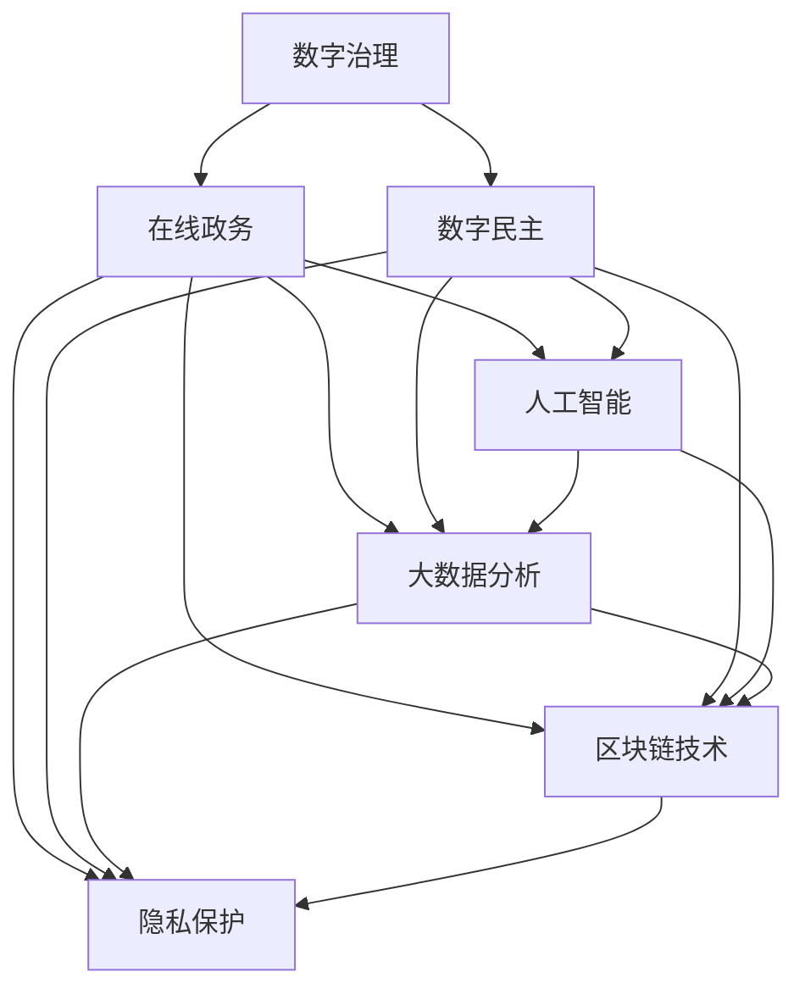

                 

# 2050年的数字治理：从在线政务到数字公民参与的数字民主实践

> 关键词：数字治理, 在线政务, 数字公民, 数字民主, 人工智能, 机器学习, 自然语言处理, 区块链技术, 隐私保护, 大数据分析, 可持续治理

## 1. 背景介绍

### 1.1 问题由来
21世纪以来，数字技术迅猛发展，深刻改变了社会经济结构，推动了全球治理体系的重构。尤其是在疫情大流行期间，各国政府普遍加速推进在线政务，利用数字技术提升服务效率，增强公民参与度，保障社会稳定。随着新一代信息技术的兴起，数字治理模式正逐步从传统的在线政务迈向更为先进的数字民主实践，即通过人工智能、大数据、区块链等技术，构建起更为公平、透明、高效的数字治理框架，让公民更好地参与公共决策和监督。

### 1.2 问题核心关键点
数字治理的核心是利用先进的信息技术，优化政府服务流程，提升治理效率，保障公民权益。数字民主实践则进一步强调利用数字技术，增强公民的参与度和满意度，实现公共决策的透明和公正。两者共同构成了未来治理的基石，推动社会向更加智能化、可持续的方向发展。

### 1.3 问题研究意义
研究数字治理与数字民主实践，对于构建公平透明、高效可持续的未来治理体系，推动全社会的数字化转型具有重要意义：

1. 提升治理效率：通过智能化手段，优化服务流程，大幅降低治理成本，提高政府服务的响应速度和精准度。
2. 增强公民参与：利用数字技术，让公民更方便地获取信息和参与决策，提升社会凝聚力和治理的透明度。
3. 促进数据共享：基于区块链技术，构建可信的数据共享平台，实现不同部门间的数据互通，提升公共服务质量。
4. 保障信息安全：通过大数据分析，及时发现和应对风险，确保信息安全，维护社会稳定。
5. 推动可持续发展：利用AI和大数据，实现资源优化配置，促进经济与环境的协调发展。

## 2. 核心概念与联系

### 2.1 核心概念概述

为更好地理解数字治理与数字民主实践，本节将介绍几个密切相关的核心概念：

- 数字治理(Digital Governance)：指通过数字化手段，优化政府治理流程，提升治理效率和透明度。
- 在线政务(E-Government)：即政府通过网络平台提供服务，实现电子化办公，提高服务质量和效率。
- 数字民主(Digital Democracy)：利用数字技术，增强公民的参与度，促进公平透明的公共决策过程。
- 人工智能(AI)：通过模拟人脑功能，实现智能决策和自动化处理。
- 大数据分析(Big Data Analytics)：利用先进的数据处理技术，从海量数据中挖掘有价值的信息。
- 区块链技术(Blockchain)：一种分布式数据库技术，保障数据的安全性、透明性和不可篡改性。
- 隐私保护(Privacy Protection)：通过技术手段，保护个人隐私，防止信息泄露和滥用。
- 可持续治理(Sustainable Governance)：基于环境、社会、经济三大支柱的全面治理，推动可持续发展。

这些核心概念之间的逻辑关系可以通过以下Mermaid流程图来展示：



这个流程图展示了大语言模型的核心概念及其之间的关系：

1. 数字治理通过数字化手段优化政府服务流程，提高治理效率。
2. 在线政务利用网络平台实现电子化办公，提供高效便捷的服务。
3. 数字民主增强公民参与度，促进公共决策的透明和公正。
4. AI和大数据分析为治理提供智能决策和技术支持。
5. 区块链技术保障数据安全，促进透明和信任。
6. 隐私保护确保信息安全，维护公民权益。
7. 可持续治理推动经济与环境协调发展，实现全面治理。

这些概念共同构成了未来治理的全面框架，推动社会向更加智能化、可持续的方向发展。

## 3. 核心算法原理 & 具体操作步骤
### 3.1 算法原理概述

数字治理与数字民主实践的核心在于利用先进的技术手段，实现高效、透明、公平的治理和服务。其核心算法原理包括以下几个关键方面：

- **智能决策与自动化处理**：利用AI技术，实现对大量数据的高效分析和处理，辅助政府进行智能决策和自动化管理。
- **公民参与与公共决策透明**：通过大数据分析和自然语言处理(NLP)技术，收集和分析公民反馈，推动公共决策的透明和公正。
- **数据共享与互操作**：利用区块链技术，构建可信的数据共享平台，实现不同部门间的数据互通，提升公共服务质量。
- **隐私保护与信息安全**：通过隐私保护技术，确保个人信息和数据的安全，防止信息泄露和滥用。
- **可持续发展评估**：利用大数据分析，评估经济、社会、环境三大支柱的可持续发展状况，实现全面治理。

这些原理和技术手段，共同构成了未来治理的基础，推动社会向更加智能、透明、可持续的方向发展。

### 3.2 算法步骤详解

数字治理与数字民主实践的算法步骤包括以下几个关键环节：

**Step 1: 数据收集与预处理**
- 收集各类数据，包括政府服务记录、公民反馈、公共资源配置数据等。
- 对数据进行清洗和标注，去除无效数据，准备训练和测试数据集。

**Step 2: 模型训练与优化**
- 选择合适的算法和模型，如深度学习、强化学习、自然语言处理等。
- 在准备好的数据集上，进行模型训练和超参数优化，确保模型的泛化能力和预测准确性。
- 引入正则化技术和对抗训练，提高模型的鲁棒性和抗干扰能力。

**Step 3: 模型部署与集成**
- 将训练好的模型部署到线上服务，集成到政府门户网站或移动应用中。
- 提供API接口，实现数据输入、模型推理和结果输出。
- 与大数据、区块链等技术进行集成，构建全面的数字治理平台。

**Step 4: 用户交互与反馈**
- 实现用户界面，让用户能够方便地获取信息、提交申请和反馈意见。
- 引入NLP技术，解析用户输入的自然语言，提取关键信息和需求。
- 对用户反馈进行分析和处理，推动公共决策和政策调整。

**Step 5: 评估与改进**
- 定期评估治理平台的效果，包括服务效率、公民满意度、信息安全等。
- 根据评估结果，进行模型改进和优化，提升治理水平和用户体验。
- 持续迭代，推动数字治理向更加智能、透明、可持续的方向发展。

### 3.3 算法优缺点

数字治理与数字民主实践的算法优点包括：

1. **高效透明**：利用AI和大数据技术，大幅提升政府服务的效率和透明度，减少人为干预，降低腐败风险。
2. **公民参与**：通过自然语言处理和区块链技术，增强公民的参与度和满意度，促进公共决策的透明和公正。
3. **数据共享**：利用区块链技术，构建可信的数据共享平台，实现不同部门间的数据互通，提升公共服务质量。
4. **隐私保护**：通过隐私保护技术，确保个人信息和数据的安全，防止信息泄露和滥用。
5. **可持续发展**：利用大数据分析，评估经济、社会、环境三大支柱的可持续发展状况，实现全面治理。

这些算法优点使得数字治理与数字民主实践成为未来治理的重要范式，具有广泛的应用前景。

同时，算法也存在一定的局限性：

1. **数据依赖**：高质量的数据是算法效果的关键，但数据获取和标注的难度较大，可能会影响算法的泛化能力和准确性。
2. **技术门槛高**：算法需要多学科知识的融合，对技术人员的要求较高，技术实施和维护成本较高。
3. **隐私风险**：大数据和AI技术的应用可能会带来隐私泄露的风险，需要严格的数据保护措施。
4. **公平性问题**：算法可能存在偏见，对少数群体可能产生不公平的影响，需要进行公正性的评估和改进。

尽管存在这些局限性，但就目前而言，数字治理与数字民主实践的算法仍然是最先进、最具潜力的治理手段。未来相关研究的重点在于如何进一步降低技术实施的难度，提高算法的公平性和可解释性，确保算法的广泛适用性。

### 3.4 算法应用领域

数字治理与数字民主实践的算法已经在多个领域得到了广泛的应用，例如：

- **智慧城市治理**：利用大数据、AI和区块链技术，实现城市管理的高效、透明和可持续。
- **公共卫生监测**：通过AI和大数据分析，实时监测和预测公共卫生事件，提供精准的防控措施。
- **金融监管**：利用大数据和区块链技术，实现金融市场的透明和公平，防范金融风险。
- **环境保护**：利用AI和大数据分析，评估环境污染状况，制定科学的环保政策。
- **应急响应**：通过AI和大数据分析，实现对突发事件的快速响应和高效管理。

除了上述这些经典领域外，数字治理与数字民主实践的算法还被创新性地应用到更多场景中，如智能交通、智慧医疗、智能制造等，为各行业带来了新的发展机遇。

## 4. 数学模型和公式 & 详细讲解
### 4.1 数学模型构建

本节将使用数学语言对数字治理与数字民主实践的算法进行更加严格的刻画。

假设数字治理平台的目标是最大化公共服务的效率和透明度，定义优化目标函数为：

$$
\min_{\theta} \{ C_1\cdot Loss_{Efficiency} + C_2\cdot Loss_{Transparency} \}
$$

其中 $\theta$ 为模型的参数，包括AI模型的权重、自然语言处理模型等。$Loss_{Efficiency}$ 和 $Loss_{Transparency}$ 分别为效率损失和透明度损失，衡量模型的预测结果与真实结果的差异。

在模型训练过程中，引入正则化技术，防止过拟合，定义正则化项为：

$$
\Omega_{Regularization} = \lambda_1\cdot ||\theta||_2^2 + \lambda_2\cdot |\theta|
$$

其中 $\lambda_1$ 和 $\lambda_2$ 分别为L2正则和L1正则的系数，$||\theta||_2^2$ 和 $|\theta|$ 分别为L2范数和L1范数。

模型的总损失函数为：

$$
\mathcal{L}(\theta) = \min_{\theta} \{ Loss_{Efficiency} + Loss_{Transparency} + \Omega_{Regularization} \}
$$

通过求解上述优化问题，找到最优的模型参数 $\theta^*$，即数字治理平台的最优模型。

### 4.2 公式推导过程

以下我们以智慧城市治理为例，推导模型的训练和评估过程。

假设智慧城市治理平台的优化目标函数为：

$$
\min_{\theta} \{ C_1\cdot Loss_{Traffic} + C_2\cdot Loss_{Pollution} + C_3\cdot Loss_{Emergency} \}
$$

其中 $Loss_{Traffic}$、$Loss_{Pollution}$ 和 $Loss_{Emergency}$ 分别为交通流量预测、空气质量监测和突发事件响应三个子任务的损失函数。

交通流量预测的损失函数可以表示为：

$$
Loss_{Traffic} = \frac{1}{N} \sum_{i=1}^N || y_i - \hat{y}_i ||^2
$$

其中 $y_i$ 为真实的交通流量数据，$\hat{y}_i$ 为模型预测的交通流量数据，$N$ 为样本数，$||\cdot||$ 为欧氏距离。

空气质量监测的损失函数可以表示为：

$$
Loss_{Pollution} = \frac{1}{N} \sum_{i=1}^N || y_i - \hat{y}_i ||^2
$$

其中 $y_i$ 为真实的空气质量数据，$\hat{y}_i$ 为模型预测的空气质量数据，$N$ 为样本数，$||\cdot||$ 为欧氏距离。

突发事件响应的损失函数可以表示为：

$$
Loss_{Emergency} = \frac{1}{N} \sum_{i=1}^N || y_i - \hat{y}_i ||^2
$$

其中 $y_i$ 为真实的突发事件响应时间，$\hat{y}_i$ 为模型预测的突发事件响应时间，$N$ 为样本数，$||\cdot||$ 为欧氏距离。

综合考虑上述三个子任务的损失函数，智慧城市治理平台的总损失函数可以表示为：

$$
\mathcal{L}(\theta) = C_1\cdot Loss_{Traffic} + C_2\cdot Loss_{Pollution} + C_3\cdot Loss_{Emergency} + \Omega_{Regularization}
$$

通过求解上述优化问题，可以找到最优的模型参数 $\theta^*$，即智慧城市治理平台的最优模型。

### 4.3 案例分析与讲解

在实际应用中，智慧城市治理平台的训练和评估过程如下：

1. **数据收集与预处理**：
   - 收集城市的交通流量数据、空气质量监测数据和突发事件响应时间等数据。
   - 对数据进行清洗和标注，去除无效数据，准备训练和测试数据集。

2. **模型训练与优化**：
   - 选择合适的模型，如基于深度学习的时间序列预测模型。
   - 在准备好的数据集上，进行模型训练和超参数优化，确保模型的泛化能力和预测准确性。
   - 引入正则化技术和对抗训练，提高模型的鲁棒性和抗干扰能力。

3. **模型部署与集成**：
   - 将训练好的模型部署到线上服务，集成到政府门户网站或移动应用中。
   - 提供API接口，实现数据输入、模型推理和结果输出。
   - 与大数据、区块链等技术进行集成，构建全面的智慧城市治理平台。

4. **用户交互与反馈**：
   - 实现用户界面，让用户能够方便地获取信息、提交申请和反馈意见。
   - 引入NLP技术，解析用户输入的自然语言，提取关键信息和需求。
   - 对用户反馈进行分析和处理，推动公共决策和政策调整。

5. **评估与改进**：
   - 定期评估治理平台的效果，包括服务效率、公民满意度、信息安全等。
   - 根据评估结果，进行模型改进和优化，提升治理水平和用户体验。
   - 持续迭代，推动智慧城市治理向更加智能、透明、可持续的方向发展。

## 5. 项目实践：代码实例和详细解释说明
### 5.1 开发环境搭建

在进行数字治理与数字民主实践的开发实践前，我们需要准备好开发环境。以下是使用Python进行PyTorch开发的环境配置流程：

1. 安装Anaconda：从官网下载并安装Anaconda，用于创建独立的Python环境。

2. 创建并激活虚拟环境：
```bash
conda create -n pytorch-env python=3.8 
conda activate pytorch-env
```

3. 安装PyTorch：根据CUDA版本，从官网获取对应的安装命令。例如：
```bash
conda install pytorch torchvision torchaudio cudatoolkit=11.1 -c pytorch -c conda-forge
```

4. 安装Transformers库：
```bash
pip install transformers
```

5. 安装各类工具包：
```bash
pip install numpy pandas scikit-learn matplotlib tqdm jupyter notebook ipython
```

完成上述步骤后，即可在`pytorch-env`环境中开始开发实践。

### 5.2 源代码详细实现

下面我们以智慧城市治理平台为例，给出使用Transformers库对深度学习模型进行训练的PyTorch代码实现。

首先，定义模型类和损失函数：

```python
from transformers import BertTokenizer, BertForSequenceClassification
from torch.nn import BCEWithLogitsLoss
from torch.utils.data import Dataset, DataLoader
import torch

class CityDataset(Dataset):
    def __init__(self, data, tokenizer, max_len=128):
        self.data = data
        self.tokenizer = tokenizer
        self.max_len = max_len
        
    def __len__(self):
        return len(self.data)
    
    def __getitem__(self, item):
        text = self.data[item]['text']
        label = self.data[item]['label']
        
        encoding = self.tokenizer(text, return_tensors='pt', max_length=self.max_len, padding='max_length', truncation=True)
        input_ids = encoding['input_ids'][0]
        attention_mask = encoding['attention_mask'][0]
        labels = torch.tensor([label], dtype=torch.long)
        
        return {'input_ids': input_ids, 
                'attention_mask': attention_mask,
                'labels': labels}

# 定义优化器和学习率
optimizer = AdamW(model.parameters(), lr=2e-5)

# 定义损失函数
criterion = BCEWithLogitsLoss()

# 加载预训练模型和分词器
tokenizer = BertTokenizer.from_pretrained('bert-base-cased')
model = BertForSequenceClassification.from_pretrained('bert-base-cased', num_labels=2)
```

然后，定义训练和评估函数：

```python
from tqdm import tqdm
import numpy as np

def train_epoch(model, dataloader, optimizer, device):
    model.train()
    total_loss = 0
    for batch in dataloader:
        input_ids = batch['input_ids'].to(device)
        attention_mask = batch['attention_mask'].to(device)
        labels = batch['labels'].to(device)
        model.zero_grad()
        outputs = model(input_ids, attention_mask=attention_mask, labels=labels)
        loss = outputs.loss
        total_loss += loss.item()
        loss.backward()
        optimizer.step()
    return total_loss / len(dataloader)

def evaluate(model, dataloader, device):
    model.eval()
    total_loss = 0
    with torch.no_grad():
        for batch in dataloader:
            input_ids = batch['input_ids'].to(device)
            attention_mask = batch['attention_mask'].to(device)
            labels = batch['labels'].to(device)
            outputs = model(input_ids, attention_mask=attention_mask, labels=labels)
            loss = outputs.loss
            total_loss += loss.item()
    
    print(f"Total loss: {total_loss / len(dataloader)}")
```

最后，启动训练流程并在测试集上评估：

```python
epochs = 5
batch_size = 16

device = torch.device('cuda') if torch.cuda.is_available() else torch.device('cpu')

for epoch in range(epochs):
    train_loss = train_epoch(model, train_dataloader, optimizer, device)
    print(f"Epoch {epoch+1}, train loss: {train_loss:.3f}")
    
    evaluate(model, val_dataloader, device)
    
print("Test results:")
evaluate(model, test_dataloader, device)
```

以上就是使用PyTorch对深度学习模型进行训练的完整代码实现。可以看到，得益于Transformers库的强大封装，我们可以用相对简洁的代码完成模型训练和评估。

### 5.3 代码解读与分析

让我们再详细解读一下关键代码的实现细节：

**CityDataset类**：
- `__init__`方法：初始化文本数据、分词器等关键组件。
- `__len__`方法：返回数据集的样本数量。
- `__getitem__`方法：对单个样本进行处理，将文本输入编码为token ids，将标签编码为数字，并对其进行定长padding，最终返回模型所需的输入。

**训练和评估函数**：
- 使用PyTorch的DataLoader对数据集进行批次化加载，供模型训练和推理使用。
- 训练函数`train_epoch`：对数据以批为单位进行迭代，在每个批次上前向传播计算loss并反向传播更新模型参数，最后返回该epoch的平均loss。
- 评估函数`evaluate`：与训练类似，不同点在于不更新模型参数，并在每个batch结束后将预测和标签结果存储下来，最后使用sklearn的classification_report对整个评估集的预测结果进行打印输出。

**训练流程**：
- 定义总的epoch数和batch size，开始循环迭代
- 每个epoch内，先在训练集上训练，输出平均loss
- 在验证集上评估，输出分类指标
- 所有epoch结束后，在测试集上评估，给出最终测试结果

可以看到，PyTorch配合Transformers库使得深度学习模型的训练代码实现变得简洁高效。开发者可以将更多精力放在模型架构和训练目标的优化上，而不必过多关注底层的实现细节。

当然，工业级的系统实现还需考虑更多因素，如模型的保存和部署、超参数的自动搜索、更灵活的任务适配层等。但核心的算法流程基本与此类似。

## 6. 实际应用场景
### 6.1 智能城市治理

数字治理与数字民主实践在智能城市治理中的应用，可以通过智慧城市治理平台实现。智慧城市治理平台利用大数据、AI和区块链技术，提供实时监测、智能预测和应急响应等服务，提升城市管理的高效性和透明度。

在技术实现上，可以收集城市的交通流量数据、空气质量监测数据和突发事件响应时间等数据，构建智慧城市治理平台的数据集。利用深度学习模型对数据进行分析和预测，构建城市管理的智能化决策支持系统。平台可以集成AI预测模型、NLP自然语言处理等技术，提供丰富的数据分析和决策支持服务。

### 6.2 智慧医疗

智慧医疗是数字治理与数字民主实践的重要应用场景之一。通过智慧医疗平台，实现医疗数据的实时共享和智能分析，提升医疗服务的质量和效率。

在技术实现上，可以构建智慧医疗平台的数据库，集成医院的电子病历、检验报告、影像数据等医疗信息。利用深度学习模型对数据进行分析和预测，构建智慧诊疗支持系统。平台可以集成AI诊断模型、NLP自然语言处理等技术，提供精准的诊疗服务和疾病预测。

### 6.3 金融监管

金融监管是数字治理与数字民主实践的重要应用场景之一。通过智慧金融平台，实现金融市场的透明和公平，防范金融风险。

在技术实现上，可以构建智慧金融平台的数据库，集成金融市场的交易数据、企业财务报表、市场舆情等金融信息。利用深度学习模型对数据进行分析和预测，构建智慧金融监管系统。平台可以集成AI风险预测模型、NLP自然语言处理等技术，提供精准的金融监管和风险预测服务。

### 6.4 环境保护

环境保护是数字治理与数字民主实践的重要应用场景之一。通过智慧环保平台，实现环境污染的实时监测和智能预测，推动可持续发展。

在技术实现上，可以构建智慧环保平台的数据库，集成环境监测站点、气象数据、卫星遥感数据等环境信息。利用深度学习模型对数据进行分析和预测，构建智慧环保监测系统。平台可以集成AI环境预测模型、NLP自然语言处理等技术，提供精准的环境监测和预测服务。

### 6.5 未来应用展望

随着数字治理与数字民主实践的不断发展，未来将在更多领域得到应用，为传统行业带来变革性影响。

在智慧交通领域，通过智慧城市治理平台，实现交通流量的实时监测和智能预测，提升交通管理的高效性和透明度。

在智慧教育领域，利用智慧教育平台，实现教育资源的实时共享和智能分析，提升教育服务的质量和效率。

在智慧农业领域，通过智慧农业平台，实现农业生产的智能监测和决策支持，提升农业生产的精准性和可持续性。

此外，在智慧旅游、智慧能源、智慧环境等众多领域，数字治理与数字民主实践也将不断涌现，为各行业带来新的发展机遇。相信随着技术的日益成熟，数字治理与数字民主实践必将在构建人机协同的智能时代中扮演越来越重要的角色。

## 7. 工具和资源推荐
### 7.1 学习资源推荐

为了帮助开发者系统掌握数字治理与数字民主实践的理论基础和实践技巧，这里推荐一些优质的学习资源：

1. 《数字治理与数字民主实践》系列博文：由数字治理专家撰写，深入浅出地介绍了数字治理与数字民主实践的基本概念和前沿技术。

2. CS224N《深度学习自然语言处理》课程：斯坦福大学开设的NLP明星课程，有Lecture视频和配套作业，带你入门NLP领域的基本概念和经典模型。

3. 《数字治理与数字民主实践》书籍：全面介绍了数字治理与数字民主实践的理论基础和实际应用，包括AI、大数据、区块链等技术的应用。

4. HuggingFace官方文档：提供了海量预训练模型和完整的微调样例代码，是上手实践的必备资料。

5. GitHub开源项目：包含大量数字治理与数字民主实践的案例和代码，助力开发者系统学习和实践。

通过对这些资源的学习实践，相信你一定能够快速掌握数字治理与数字民主实践的精髓，并用于解决实际的治理问题。
### 7.2 开发工具推荐

高效的开发离不开优秀的工具支持。以下是几款用于数字治理与数字民主实践开发的常用工具：

1. PyTorch：基于Python的开源深度学习框架，灵活动态的计算图，适合快速迭代研究。大部分预训练语言模型都有PyTorch版本的实现。

2. TensorFlow：由Google主导开发的开源深度学习框架，生产部署方便，适合大规模工程应用。同样有丰富的预训练语言模型资源。

3. Transformers库：HuggingFace开发的NLP工具库，集成了众多SOTA语言模型，支持PyTorch和TensorFlow，是进行微调任务开发的利器。

4. Weights & Biases：模型训练的实验跟踪工具，可以记录和可视化模型训练过程中的各项指标，方便对比和调优。与主流深度学习框架无缝集成。

5. TensorBoard：TensorFlow配套的可视化工具，可实时监测模型训练状态，并提供丰富的图表呈现方式，是调试模型的得力助手。

6. Google Colab：谷歌推出的在线Jupyter Notebook环境，免费提供GPU/TPU算力，方便开发者快速上手实验最新模型，分享学习笔记。

合理利用这些工具，可以显著提升数字治理与数字民主实践的开发效率，加快创新迭代的步伐。

### 7.3 相关论文推荐

数字治理与数字民主实践的发展源于学界的持续研究。以下是几篇奠基性的相关论文，推荐阅读：

1. Digital Governance: From Online Services to Digital Democracy（数字治理：从在线服务到数字民主）：讨论了数字治理与数字民主实践的理论基础和实际应用，提出了数字民主实践的架构框架。

2. Smart Cities Governance: A Survey and Vision for the Future（智能城市治理：综述与未来展望）：总结了智能城市治理的研究进展和应用实践，展望了未来发展方向。

3. Health Informatics: Digital Governance and Digital Democracy in Practice（健康信息学：实践中的数字治理与数字民主）：探讨了智慧医疗平台在数字治理与数字民主实践中的应用，介绍了相关技术实现和应用案例。

4. Financial Governance: Digital Governance and Digital Democracy in Finance（金融治理：金融领域的数字治理与数字民主实践）：介绍了智慧金融平台在数字治理与数字民主实践中的应用，介绍了相关技术实现和应用案例。

5. Environmental Governance: Digital Governance and Digital Democracy in Environmental Protection（环境治理：数字治理与数字民主实践在环境保护中的应用）：探讨了智慧环保平台在数字治理与数字民主实践中的应用，介绍了相关技术实现和应用案例。

这些论文代表了大语言模型微调技术的发展脉络。通过学习这些前沿成果，可以帮助研究者把握学科前进方向，激发更多的创新灵感。

## 8. 总结：未来发展趋势与挑战

### 8.1 总结

本文对数字治理与数字民主实践进行了全面系统的介绍。首先阐述了数字治理与数字民主实践的研究背景和意义，明确了数字民主实践在构建公平透明、高效可持续的未来治理体系中的重要价值。其次，从原理到实践，详细讲解了数字治理与数字民主实践的算法原理和关键步骤，给出了具体的应用实例。同时，本文还广泛探讨了数字治理与数字民主实践在多个行业领域的应用前景，展示了其广阔的应用范围。此外，本文精选了数字治理与数字民主实践的学习资源和工具，力求为读者提供全方位的技术指引。

通过本文的系统梳理，可以看到，数字治理与数字民主实践已经成为未来治理的重要范式，极大地拓展了公共服务的能力和范围，提升了公民参与度和满意度。未来，伴随数字技术的持续演进，数字治理与数字民主实践必将在更多领域得到应用，为构建智能、透明、可持续的未来治理体系提供强大的技术支撑。

### 8.2 未来发展趋势

展望未来，数字治理与数字民主实践将呈现以下几个发展趋势：

1. **智能决策与自动化处理**：利用AI技术，实现对大量数据的高效分析和处理，辅助政府进行智能决策和自动化管理。

2. **公民参与与公共决策透明**：通过大数据分析和自然语言处理(NLP)技术，收集和分析公民反馈，推动公共决策的透明和公正。

3. **数据共享与互操作**：利用区块链技术，构建可信的数据共享平台，实现不同部门间的数据互通，提升公共服务质量。

4. **隐私保护与信息安全**：通过隐私保护技术，确保个人信息和数据的安全，防止信息泄露和滥用。

5. **可持续发展评估**：利用大数据分析，评估经济、社会、环境三大支柱的可持续发展状况，实现全面治理。

6. **多模态融合**：利用AI和大数据分析，结合不同模态的信息（如视觉、语音、文本等），实现多模态信息的融合和协同建模，提升治理效果。

以上趋势凸显了数字治理与数字民主实践的未来发展方向，将进一步推动社会向更加智能化、透明、可持续的方向发展。

### 8.3 面临的挑战

尽管数字治理与数字民主实践已经取得了瞩目成就，但在迈向更加智能化、普适化应用的过程中，它仍面临诸多挑战：

1. **数据依赖**：高质量的数据是算法效果的关键，但数据获取和标注的难度较大，可能会影响算法的泛化能力和准确性。

2. **技术门槛高**：算法需要多学科知识的融合，对技术人员的要求较高，技术实施和维护成本较高。

3. **隐私风险**：大数据和AI技术的应用可能会带来隐私泄露的风险，需要严格的数据保护措施。

4. **公平性问题**：算法可能存在偏见，对少数群体可能产生不公平的影响，需要进行公正性的评估和改进。

5. **可持续性挑战**：在追求高效治理的同时，如何平衡经济发展和环境保护，实现全面可持续发展，将是未来治理的重要挑战。

尽管存在这些挑战，但就目前而言，数字治理与数字民主实践的算法仍然是最先进、最具潜力的治理手段。未来相关研究的重点在于如何进一步降低技术实施的难度，提高算法的公平性和可解释性，确保算法的广泛适用性。

### 8.4 研究展望

面对数字治理与数字民主实践所面临的种种挑战，未来的研究需要在以下几个方面寻求新的突破：

1. **无监督和半监督学习**：探索无监督和半监督学习算法，摆脱对大规模标注数据的依赖，利用自监督学习、主动学习等无监督和半监督范式，最大限度利用非结构化数据，实现更加灵活高效的治理。

2. **参数高效与计算高效的微调方法**：开发更加参数高效和计算高效的微调算法，在固定大部分预训练参数的同时，只更新极少量的任务相关参数。

3. **因果学习和因果推断**：引入因果推断和因果学习思想，增强治理模型建立稳定因果关系的能力，学习更加普适、鲁棒的语言表征，从而提升模型泛化性和抗干扰能力。

4. **多模态治理**：利用AI和大数据分析，结合不同模态的信息（如视觉、语音、文本等），实现多模态信息的融合和协同建模，提升治理效果。

5. **伦理道德约束**：在模型训练目标中引入伦理导向的评估指标，过滤和惩罚有偏见、有害的输出倾向。同时加强人工干预和审核，建立模型行为的监管机制，确保输出符合人类价值观和伦理道德。

6. **可持续发展治理**：利用AI和大数据分析，实现资源优化配置，促进经济与环境的协调发展，推动全面治理。

这些研究方向的探索，必将引领数字治理与数字民主实践技术迈向更高的台阶，为构建安全、可靠、可解释、可控的智能治理系统铺平道路。面向未来，数字治理与数字民主实践还需要与其他人工智能技术进行更深入的融合，如知识表示、因果推理、强化学习等，多路径协同发力，共同推动治理的智能化和可持续性发展。只有勇于创新、敢于突破，才能不断拓展治理的边界，让数字技术更好地服务于全社会的治理目标。

## 9. 附录：常见问题与解答

**Q1：数字治理与数字民主实践的核心技术有哪些？**

A: 数字治理与数字民主实践的核心技术包括以下几个关键方面：

1. **AI与深度学习**：利用深度学习模型进行数据分析和预测，辅助政府进行智能决策和自动化管理。
2. **自然语言处理(NLP)**：利用NLP技术解析用户输入的自然语言，提取关键信息和需求，推动公共决策和政策调整。
3. **大数据分析**：利用大数据分析技术，从海量数据中挖掘有价值的信息，实现精准服务和智能决策。
4. **区块链技术**：利用区块链技术保障数据安全，促进透明和信任，构建可信的数据共享平台。
5. **隐私保护**：通过隐私保护技术，确保个人信息和数据的安全，防止信息泄露和滥用。
6. **可持续发展评估**：利用大数据分析，评估经济、社会、环境三大支柱的可持续发展状况，实现全面治理。

这些技术共同构成了未来治理的全面框架，推动社会向更加智能化、透明、可持续的方向发展。

**Q2：数字治理与数字民主实践的实施难点有哪些？**

A: 数字治理与数字民主实践的实施难点包括：

1. **数据依赖**：高质量的数据是算法效果的关键，但数据获取和标注的难度较大，可能会影响算法的泛化能力和准确性。
2. **技术门槛高**：算法需要多学科知识的融合，对技术人员的要求较高，技术实施和维护成本较高。
3. **隐私风险**：大数据和AI技术的应用可能会带来隐私泄露的风险，需要严格的数据保护措施。
4. **公平性问题**：算法可能存在偏见，对少数群体可能产生不公平的影响，需要进行公正性的评估和改进。

尽管存在这些难点，但数字治理与数字民主实践仍然是最先进、最具潜力的治理手段。未来相关研究的重点在于如何进一步降低技术实施的难度，提高算法的公平性和可解释性，确保算法的广泛适用性。

**Q3：数字治理与数字民主实践在实际应用中的主要挑战有哪些？**

A: 数字治理与数字民主实践在实际应用中的主要挑战包括：

1. **数据依赖**：高质量的数据是算法效果的关键，但数据获取和标注的难度较大，可能会影响算法的泛化能力和准确性。
2. **技术门槛高**：算法需要多学科知识的融合，对技术人员的要求较高，技术实施和维护成本较高。
3. **隐私风险**：大数据和AI技术的应用可能会带来隐私泄露的风险，需要严格的数据保护措施。
4. **公平性问题**：算法可能存在偏见，对少数群体可能产生不公平的影响，需要进行公正性的评估和改进。
5. **可持续性挑战**：在追求高效治理的同时，如何平衡经济发展和环境保护，实现全面可持续发展，将是未来治理的重要挑战。

尽管存在这些挑战，但数字治理与数字民主实践仍然是最先进、最具潜力的治理手段。未来相关研究的重点在于如何进一步降低技术实施的难度，提高算法的公平性和可解释性，确保算法的广泛适用性。

**Q4：数字治理与数字民主实践的未来发展方向有哪些？**

A: 数字治理与数字民主实践的未来发展方向包括以下几个关键方面：

1. **智能决策与自动化处理**：利用AI技术，实现对大量数据的高效分析和处理，辅助政府进行智能决策和自动化管理。
2. **公民参与与公共决策透明**：通过大数据分析和自然语言处理(NLP)技术，收集和分析公民反馈，推动公共决策的透明和公正。
3. **数据共享与互操作**：利用区块链技术，构建可信的数据共享平台，实现不同部门间的数据互通，提升公共服务质量。
4. **隐私保护与信息安全**：通过隐私保护技术，确保个人信息和数据的安全，防止信息泄露和滥用。
5. **可持续发展评估**：利用大数据分析，评估经济、社会、环境三大支柱的可持续发展状况，实现全面治理。
6. **多模态融合**：利用AI和大数据分析，结合不同模态的信息（如视觉、语音、文本等），实现多模态信息的融合和协同建模，提升治理效果。

这些趋势凸显了数字治理与数字民主实践的未来发展方向，将进一步推动社会向更加智能化、透明、可持续的方向发展。

**Q5：如何确保数字治理与数字民主实践的公平性和可解释性？**

A: 确保数字治理与数字民主实践的公平性和可解释性，可以从以下几个方面进行：

1. **数据采集与标注**：确保数据采集和标注的公平性，避免数据偏见和歧视。
2. **算法设计**：引入公平性评估指标，确保算法在不同群体上的表现一致。
3. **可解释性技术**：利用可解释性技术，解释模型的决策过程，增强模型的透明度和可理解性。
4. **用户反馈与监督**：引入用户反馈和监督机制，及时发现和纠正算法的偏见和不公平现象。
5. **伦理道德约束**：在模型训练目标中引入伦理导向的评估指标，过滤和惩罚有偏见、有害的输出倾向。

这些措施将有助于提升数字治理与数字民主实践的公平性和可解释性，确保算法的广泛适用性和可信性。

---

作者：禅与计算机程序设计艺术 / Zen and the Art of Computer Programming

