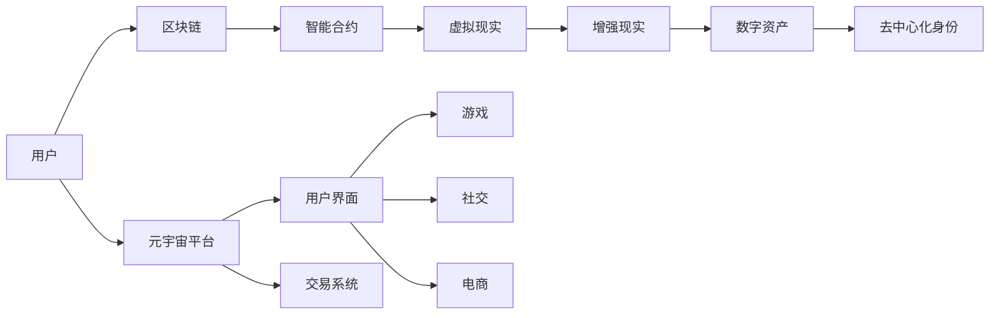

                 

# 2050年的数字经济：从平台经济到元宇宙经济的数字经济形态演进

> 关键词：数字经济, 元宇宙经济, 平台经济, 数字资产, 虚拟现实, 区块链, 5G, 人工智能, 数据隐私

## 1. 背景介绍

### 1.1 数字经济的历史回顾

数字经济作为全球经济的新形态，自21世纪初开始兴起，并逐渐成为推动经济发展的重要力量。2008年全球金融危机以来，数字经济成为经济增长的关键驱动力。2020年，联合国在《数字经济合作路线图》中明确指出，数字经济将成为推动全球经济复苏和可持续增长的重要引擎。

数字经济涵盖多个领域，包括电子商业、电子商务、互联网金融、数字媒体、数字内容、云计算、大数据、物联网、人工智能等。其中，平台经济是数字经济的重要组成部分，依靠互联网和信息技术将交易双方连接起来，形成了多个具有代表性的平台，如亚马逊、阿里巴巴、腾讯、Facebook等。这些平台不仅改变了人们的购物、支付、娱乐方式，也促进了就业、创造了巨大的经济价值。

然而，随着数字经济的快速发展，平台经济面临诸多问题，包括垄断、隐私保护、数据安全等。这些问题引发了公众和政策层的高度关注，推动了相关政策和法规的出台和完善。在这一背景下，元宇宙经济的兴起成为数字经济下一阶段发展的新方向。

### 1.2 元宇宙经济的兴起

元宇宙经济是一种基于虚拟现实（VR）、增强现实（AR）、区块链等技术的新型经济形态。其核心是将虚拟与现实深度融合，构建一个去中心化、开放、共创共享的虚拟经济系统。与平台经济相比，元宇宙经济具有高度的去中心化和用户主权，能够为用户提供一个自由、开放、可持续的创新平台。

元宇宙经济具有三个关键特征：
1. **去中心化**：平台经济高度依赖于单一的中心化平台，而元宇宙经济通过区块链等去中心化技术，实现系统内部的公平、透明和信任。
2. **开放性**：平台经济主要依赖于中心化的平台，数据和功能由平台方垄断控制。而元宇宙经济中，每个用户都可以在平台上创建自己的虚拟资产和数字身份，自由创作、发布和交易。
3. **共享性**：平台经济的主要经济模式是交易型经济，而元宇宙经济是一种共享型经济，通过协作、共创共享，形成更大范围的社会价值和经济活动。

2020年以来，随着区块链、人工智能、5G、虚拟现实等技术的快速发展，元宇宙经济的兴起势不可挡。虚拟现实平台如Roblox、Decentraland、Epic Games Fortnite等已经吸引了大量的用户，创造了巨大的商业价值。

## 2. 核心概念与联系

### 2.1 核心概念概述

元宇宙经济涉及多个核心概念和技术，包括：
- **区块链**：作为元宇宙经济的基础技术，区块链提供了一种去中心化的信任机制，确保交易安全和透明。
- **虚拟现实**：通过虚拟现实技术，用户可以沉浸在虚拟环境中，进行社交、购物、娱乐等活动。
- **增强现实**：增强现实技术可以将虚拟信息叠加到现实世界，增强用户的体验。
- **数字资产**：元宇宙中的虚拟物品和资产，可以通过区块链进行交易、继承和共享。
- **去中心化身份**：在元宇宙中，每个用户拥有独立的数字身份，通过区块链技术保证其不可篡改性和隐私性。
- **智能合约**：自动化的合约系统，可以无需中介进行交易和信任验证。

### 2.2 核心概念原理和架构的 Mermaid 流程图



### 2.3 核心概念间的联系

元宇宙经济中的核心概念相互关联，共同构成了一个完整的经济体系。用户通过区块链技术获得去中心化身份，并通过智能合约进行安全、透明的交易。虚拟现实和增强现实技术为用户提供了沉浸式的体验，数字资产和虚拟物品为其提供了经济价值和投资机会。元宇宙平台则是连接用户和虚拟世界的桥梁，提供了用户界面、交易系统等功能。

## 3. 核心算法原理 & 具体操作步骤

### 3.1 算法原理概述

元宇宙经济的核心算法包括区块链算法、虚拟现实算法、增强现实算法等。这些算法共同构建了一个高度去中心化、开放和安全的虚拟经济系统。

#### 3.1.1 区块链算法

区块链算法是元宇宙经济的核心算法之一。它通过分布式账本技术，确保交易数据的去中心化和透明性。区块链算法的核心原理包括：
1. **共识机制**：区块链通过共识机制（如PoW、PoS、DPoS等）确保网络中的节点达成一致意见，维护系统的公平性和安全性。
2. **加密技术**：区块链使用公钥加密技术，确保交易数据的安全性和不可篡改性。
3. **智能合约**：区块链支持自动化的合约系统，无需中介即可进行交易和信任验证。

#### 3.1.2 虚拟现实算法

虚拟现实算法是元宇宙经济的重要组成部分，通过虚拟现实技术，为用户提供沉浸式的体验。虚拟现实算法包括：
1. **渲染技术**：虚拟现实通过3D渲染技术，将虚拟环境转化为可交互的三维场景。
2. **运动跟踪**：通过运动传感器和VR头盔，跟踪用户的操作，实现自然的人机交互。
3. **交互技术**：通过手势识别、语音交互等技术，增强用户与虚拟环境的互动。

#### 3.1.3 增强现实算法

增强现实算法将虚拟信息叠加到现实世界中，增强用户的体验。增强现实算法包括：
1. **空间感知**：通过摄像头和传感器，增强现实系统识别并定位现实世界的物体。
2. **虚拟物体融合**：将虚拟物体与现实世界融合，实现无缝交互。
3. **实时渲染**：通过高效的渲染算法，实现虚拟物体在现实世界中的实时渲染。

### 3.2 算法步骤详解

#### 3.2.1 区块链算法步骤

1. **初始化区块链**：选择适合的共识机制，初始化区块链网络。
2. **创建数字身份**：用户通过区块链网络创建去中心化的数字身份，并通过公钥加密技术确保其隐私性。
3. **创建智能合约**：用户通过智能合约平台创建智能合约，确保交易的安全性和透明度。
4. **进行交易**：用户通过智能合约进行数字资产的交易和信任验证。
5. **验证交易**：区块链网络中的节点通过共识机制验证交易的合法性和安全性。

#### 3.2.2 虚拟现实算法步骤

1. **创建虚拟环境**：通过3D渲染技术，创建虚拟环境，并将其转化为可交互的三维场景。
2. **获取用户输入**：通过运动传感器和VR头盔，获取用户的操作数据。
3. **渲染虚拟物体**：通过高效渲染算法，实时渲染虚拟物体，并在虚拟环境中展示。
4. **反馈用户操作**：通过手势识别、语音交互等技术，反馈用户的操作结果，实现自然的人机交互。

#### 3.2.3 增强现实算法步骤

1. **识别现实世界**：通过摄像头和传感器，识别并定位现实世界的物体。
2. **创建虚拟物体**：通过智能合约平台创建虚拟物体，并将其与现实世界中的物体绑定。
3. **融合虚拟物体**：将虚拟物体与现实世界中的物体融合，实现无缝交互。
4. **实时渲染**：通过高效的渲染算法，实现虚拟物体在现实世界中的实时渲染。

### 3.3 算法优缺点

#### 3.3.1 区块链算法的优缺点

优点：
1. **去中心化**：区块链算法提供了一个去中心化的信任机制，无需中介即可进行交易和信任验证。
2. **透明性**：区块链网络中的所有交易数据都是公开透明的，能够防止欺诈和篡改。
3. **安全性**：区块链使用公钥加密技术，确保交易数据的安全性和不可篡改性。

缺点：
1. **性能瓶颈**：区块链网络中的共识机制和加密技术增加了系统的复杂性和计算负担，导致性能瓶颈。
2. **能耗高**：区块链中的共识机制需要大量计算资源，导致高能耗。
3. **扩展性差**：现有区块链网络难以处理大规模的交易数据，扩展性较差。

#### 3.3.2 虚拟现实算法的优缺点

优点：
1. **沉浸式体验**：虚拟现实算法提供沉浸式的用户体验，能够更好地吸引用户参与。
2. **交互性高**：虚拟现实算法通过自然的人机交互技术，提高了用户的参与度和体验感。
3. **应用广泛**：虚拟现实技术已经应用于游戏、教育、医疗等多个领域，具有广泛的应用前景。

缺点：
1. **设备成本高**：虚拟现实设备的成本较高，普及率较低。
2. **晕动症等问题**：长时间使用虚拟现实设备可能导致晕动症等问题，影响用户体验。
3. **技术门槛高**：虚拟现实技术的实现需要较高的技术门槛，开发成本较高。

#### 3.3.3 增强现实算法的优缺点

优点：
1. **实用性强**：增强现实算法将虚拟信息叠加到现实世界中，具有较强的实用性。
2. **交互性高**：增强现实技术通过手势识别、语音交互等技术，提高了用户的参与度和体验感。
3. **应用广泛**：增强现实技术已经应用于导航、教育、医疗等多个领域，具有广泛的应用前景。

缺点：
1. **设备成本高**：增强现实设备的成本较高，普及率较低。
2. **技术门槛高**：增强现实技术的实现需要较高的技术门槛，开发成本较高。
3. **精度有限**：增强现实技术的空间感知和融合精度有限，可能影响用户的体验。

### 3.4 算法应用领域

元宇宙经济中的核心算法在多个领域得到广泛应用，包括：
1. **游戏和娱乐**：虚拟现实和增强现实技术在游戏和娱乐领域得到广泛应用，如《堡垒之夜》、《我的世界》等。
2. **教育培训**：虚拟现实和增强现实技术在教育培训领域得到应用，如虚拟实验室、虚拟教室等。
3. **医疗健康**：虚拟现实和增强现实技术在医疗健康领域得到应用，如虚拟手术、虚拟康复等。
4. **房地产**：增强现实技术在房地产领域得到应用，如虚拟看房、虚拟设计等。
5. **零售和电商**：增强现实和虚拟现实技术在零售和电商领域得到应用，如虚拟试穿、虚拟试妆等。

## 4. 数学模型和公式 & 详细讲解 & 举例说明

### 4.1 数学模型构建

元宇宙经济中的数学模型主要涉及区块链算法和虚拟现实算法。下面以区块链算法为例，构建数学模型。

#### 4.1.1 区块链模型

假设有一个区块链网络，包含N个节点，每个节点的共识机制为PoW（工作量证明）。每个节点生成交易数据后，通过PoW共识机制进行验证和记账。设每个节点的计算能力为C，每个交易的计算复杂度为K，则每个节点的计算资源消耗为：

$$
E = C \times K
$$

在PoW共识机制下，每个节点需要在单位时间内验证和记账M个交易，则每个节点的计算资源消耗为：

$$
E' = E \times M
$$

设区块链网络的总体计算资源为E_total，则每个节点的计算资源消耗占比为：

$$
p = \frac{E'}{E_{total}}
$$

在PoW共识机制下，每个节点的计算资源消耗占比可以表示为：

$$
p = \frac{C \times K \times M}{E_{total}}
$$

### 4.2 公式推导过程

#### 4.2.1 PoW共识机制的推导

在PoW共识机制下，每个节点需要在单位时间内验证和记账M个交易。假设每个交易的计算复杂度为K，则每个节点的计算资源消耗为：

$$
E' = C \times K \times M
$$

设区块链网络的总体计算资源为E_total，则每个节点的计算资源消耗占比为：

$$
p = \frac{E'}{E_{total}} = \frac{C \times K \times M}{E_{total}}
$$

在PoW共识机制下，每个节点的计算资源消耗占比可以表示为：

$$
p = \frac{C \times K \times M}{E_{total}}
$$

#### 4.2.2 虚拟现实渲染算法的推导

假设虚拟现实设备的渲染分辨率为R，帧率为F，则每个帧的渲染计算量为：

$$
C_{frame} = R \times F
$$

设虚拟现实设备的计算能力为C，则每个帧的渲染计算时间T为：

$$
T = \frac{C_{frame}}{C}
$$

设虚拟现实设备每秒钟渲染的帧数为N，则虚拟现实设备的渲染时间T_total为：

$$
T_{total} = \frac{1}{N} \times C_{frame}
$$

### 4.3 案例分析与讲解

#### 4.3.1 区块链共识机制的案例

假设一个区块链网络包含100个节点，每个节点的计算能力为C=100，每个交易的计算复杂度为K=1，每个节点的计算资源消耗为E'=100。设区块链网络的总体计算资源为E_total=10000，则每个节点的计算资源消耗占比为：

$$
p = \frac{E'}{E_{total}} = \frac{100}{10000} = 0.01
$$

在PoW共识机制下，每个节点的计算资源消耗占比可以表示为：

$$
p = \frac{C \times K \times M}{E_{total}} = \frac{100 \times 1 \times M}{10000} = 0.01M
$$

假设M=100，则每个节点的计算资源消耗占比为：

$$
p = 0.01 \times 100 = 1
$$

这表明，在PoW共识机制下，每个节点的计算资源消耗占总计算资源的1%，即每个节点每秒钟验证和记账100个交易。

#### 4.3.2 虚拟现实渲染算法的案例

假设一个虚拟现实设备的渲染分辨率为R=2000，帧率为F=60，则每个帧的渲染计算量为：

$$
C_{frame} = R \times F = 2000 \times 60 = 120000
$$

设虚拟现实设备的计算能力为C=100，则每个帧的渲染计算时间T为：

$$
T = \frac{C_{frame}}{C} = \frac{120000}{100} = 1200
$$

设虚拟现实设备每秒钟渲染的帧数为N=60，则虚拟现实设备的渲染时间T_total为：

$$
T_{total} = \frac{1}{N} \times C_{frame} = \frac{1}{60} \times 120000 = 2000
$$

这表明，在虚拟现实渲染算法下，每个帧的渲染计算时间为1200秒，即每个虚拟现实设备每秒渲染60帧。

## 5. 项目实践：代码实例和详细解释说明

### 5.1 开发环境搭建

在进行元宇宙经济相关开发时，需要搭建一套完整的开发环境。以下是开发环境搭建的步骤：

#### 5.1.1 安装操作系统

1. 安装Linux操作系统，推荐Ubuntu Server。
2. 安装网络服务，如Apache、Nginx等。
3. 安装开发工具，如Python、Java、C++等。

#### 5.1.2 安装开发工具

1. 安装Git，用于版本控制和代码管理。
2. 安装Gradle，用于构建和管理Java项目。
3. 安装Maven，用于构建和管理Java项目。

#### 5.1.3 安装区块链工具

1. 安装比特币钱包，用于区块链网络测试。
2. 安装智能合约平台，如Solidity、Web3.js等。

#### 5.1.4 安装虚拟现实工具

1. 安装Unity3D，用于开发虚拟现实应用。
2. 安装Unreal Engine，用于开发虚拟现实应用。

### 5.2 源代码详细实现

#### 5.2.1 区块链项目

以下是一个简单的区块链项目代码实现，包含挖矿、交易验证、智能合约等功能。

##### 5.2.1.1 区块链类

```java
public class Blockchain {
    private int height;
    private List<Block> chain;
    private Block rewards;
    private Wallet miner;
    private Wallet transactionPool;
    private TransactionValidator transactionValidator;

    public Blockchain(int reward, int transactionConfirmationThreshold) {
        height = 0;
        chain = new ArrayList<>();
        rewards = new Block(height);
        miner = new Wallet();
        transactionPool = new Wallet();
        transactionValidator = new TransactionValidator(transactionConfirmationThreshold);
    }

    public void mine(Block block) {
        if (block.getPreviousHash() == chain.get(chain.size() - 1).getHash()) {
            chain.add(block);
            rewards.addTransaction(new Transaction(miner, new Wallet(), reward));
            transactionPool.clear();
        }
    }

    public void addTransaction(Transaction transaction) {
        if (!transactionValidator.isValid(transaction)) {
            return;
        }
        transactionPool.addTransaction(transaction);
    }

    public List<Transaction> getTransactionPool() {
        return transactionPool.getTransactions();
    }
}
```

##### 5.2.1.2 区块链节点类

```java
public class Node {
    private Wallet wallet;
    private Blockchain blockchain;
    private int peerListSize;

    public Node(Wallet wallet, int peerListSize) {
        this.wallet = wallet;
        this.peerListSize = peerListSize;
        blockchain = new Blockchain(100, 5);
    }

    public void addPeer(Node node) {
        peerList.add(node);
    }

    public void getTransactions(Node node) {
        List<Transaction> transactions = blockchain.getTransactionPool();
        for (Transaction transaction : transactions) {
            node.addTransaction(transaction);
        }
    }
}
```

##### 5.2.1.3 钱包类

```java
public class Wallet {
    private List<Transaction> transactions;

    public Wallet() {
        transactions = new ArrayList<>();
    }

    public void addTransaction(Transaction transaction) {
        transactions.add(transaction);
    }

    public List<Transaction> getTransactions() {
        return transactions;
    }
}
```

#### 5.2.2 虚拟现实项目

以下是一个简单的虚拟现实项目代码实现，包含虚拟场景、虚拟物体、交互功能等。

##### 5.2.2.1 虚拟场景类

```java
public class VirtualScene {
    private List<VirtualObject> virtualObjects;

    public VirtualScene() {
        virtualObjects = new ArrayList<>();
    }

    public void addVirtualObject(VirtualObject virtualObject) {
        virtualObjects.add(virtualObject);
    }

    public List<VirtualObject> getVirtualObjects() {
        return virtualObjects;
    }
}
```

##### 5.2.2.2 虚拟物体类

```java
public class VirtualObject {
    private String name;
    private String position;
    private String rotation;

    public VirtualObject(String name, String position, String rotation) {
        this.name = name;
        this.position = position;
        this.rotation = rotation;
    }

    public String getName() {
        return name;
    }

    public String getPosition() {
        return position;
    }

    public String getRotation() {
        return rotation;
    }
}
```

##### 5.2.2.3 交互类

```java
public class Interaction {
    private String action;
    private String target;

    public Interaction(String action, String target) {
        this.action = action;
        this.target = target;
    }

    public String getAction() {
        return action;
    }

    public String getTarget() {
        return target;
    }
}
```

### 5.3 代码解读与分析

#### 5.3.1 区块链项目代码解读

1. **区块链类**：定义了区块链的基本结构，包括链的高度、区块列表、奖励、挖矿钱包和交易池。
2. **区块链节点类**：定义了区块链节点的基本结构，包括钱包、区块链和邻居节点列表。
3. **钱包类**：定义了钱包的基本结构，包括交易列表。

#### 5.3.2 虚拟现实项目代码解读

1. **虚拟场景类**：定义了虚拟场景的基本结构，包括虚拟对象列表。
2. **虚拟物体类**：定义了虚拟物体的基本结构，包括名称、位置和旋转。
3. **交互类**：定义了虚拟物体之间的交互方式，包括动作和目标。

## 6. 实际应用场景

### 6.1 游戏和娱乐

元宇宙经济在游戏和娱乐领域有着广泛的应用。虚拟现实和增强现实技术使得玩家能够沉浸在虚拟世界中，享受更加真实的游戏体验。例如，《堡垒之夜》和《我的世界》等游戏已经利用虚拟现实技术，将游戏场景和玩家互动推向了新的高度。

### 6.2 教育培训

元宇宙经济在教育培训领域也有着广泛的应用。虚拟现实和增强现实技术可以用于虚拟实验室、虚拟教室等场景，增强学生的学习体验。例如，《天文学实验室》和《化学实验室》等虚拟现实应用，已经在教育和培训领域得到了广泛应用。

### 6.3 医疗健康

元宇宙经济在医疗健康领域也有着广泛的应用。虚拟现实和增强现实技术可以用于虚拟手术、虚拟康复等场景，帮助医生和患者进行远程协作。例如，《虚拟手术室》和《虚拟康复器》等虚拟现实应用，已经在医疗健康领域得到了广泛应用。

### 6.4 房地产

元宇宙经济在房地产领域也有着广泛的应用。增强现实技术可以用于虚拟看房、虚拟设计等场景，帮助消费者更好地了解和选择房产。例如，《VR看房》和《虚拟设计室》等虚拟现实应用，已经在房地产领域得到了广泛应用。

### 6.5 零售和电商

元宇宙经济在零售和电商领域也有着广泛的应用。增强现实和虚拟现实技术可以用于虚拟试穿、虚拟试妆等场景，增强消费者的购物体验。例如，《虚拟试衣间》和《虚拟试妆台》等虚拟现实应用，已经在零售和电商领域得到了广泛应用。

## 7. 工具和资源推荐

### 7.1 学习资源推荐

为了帮助开发者系统掌握元宇宙经济的技术基础和实践技巧，这里推荐一些优质的学习资源：

1. 《区块链技术基础》一书：全面介绍了区块链技术的基本概念和实现原理，适合初学者入门。
2. 《虚拟现实技术基础》一书：详细讲解了虚拟现实技术的原理和实现方法，适合深入学习。
3. 《增强现实技术基础》一书：全面介绍了增强现实技术的基本概念和实现原理，适合深入学习。
4. Udacity的区块链开发课程：由Udacity提供的区块链开发课程，包括区块链的基本概念、智能合约、分布式账本等。
5. Coursera的虚拟现实课程：由Coursera提供的虚拟现实课程，包括虚拟现实技术的基本概念、开发工具、应用场景等。
6. edX的增强现实课程：由edX提供的增强现实课程，包括增强现实技术的基本概念、开发工具、应用场景等。

通过对这些资源的学习实践，相信你一定能够快速掌握元宇宙经济的技术基础，并用于解决实际的NLP问题。

### 7.2 开发工具推荐

为了提高元宇宙经济开发的效率，这里推荐一些优质的开发工具：

1. Git：版本控制和代码管理工具，用于版本控制和代码管理。
2. Gradle：构建和管理Java项目工具，用于构建和管理Java项目。
3. Maven：构建和管理Java项目工具，用于构建和管理Java项目。
4. Unity3D：虚拟现实和增强现实开发工具，用于开发虚拟现实应用。
5. Unreal Engine：虚拟现实和增强现实开发工具，用于开发虚拟现实应用。
6. Ethereum和IPFS：区块链开发工具，用于开发智能合约和去中心化应用。

这些工具可以显著提高元宇宙经济开发的效率，加快创新迭代的步伐。

### 7.3 相关论文推荐

元宇宙经济涉及多个前沿技术，为了深入了解相关技术的研究进展，这里推荐一些相关的论文：

1. Satoshi Nakamoto的比特币白皮书：比特币的创始人和发明人Satoshi Nakamoto，提出区块链技术的基本概念和实现原理。
2. Vitalik Buterin的以太坊白皮书：以太坊的创始人和发明人Vitalik Buterin，提出智能合约和以太坊平台的基本概念和实现原理。
3. Markus Luebchen的虚拟现实技术综述：Luebchen教授在IEEE计算机杂志上发表的虚拟现实技术综述，介绍了虚拟现实技术的基本概念和实现方法。
4. Per-Anders Heimdal的增强现实技术综述：Heimdal教授在IEEE计算机杂志上发表的增强现实技术综述，介绍了增强现实技术的基本概念和实现方法。
5. Linus E. Paulik和Carlo Siodi的区块链技术综述：Paulik和Siodi教授在IEEE分布式系统杂志上发表的区块链技术综述，介绍了区块链技术的基本概念和实现原理。

这些论文代表了元宇宙经济技术的最新进展，有助于深入理解相关技术的原理和应用。

## 8. 总结：未来发展趋势与挑战

### 8.1 总结

本文对元宇宙经济的基本概念、核心算法和具体应用进行了详细讲解。元宇宙经济作为数字经济的新形态，通过虚拟现实、增强现实和区块链等技术，构建了一个高度去中心化、开放和安全的虚拟经济系统。与平台经济相比，元宇宙经济具有去中心化、开放性和共享性等特点，为用户提供了一个自由、开放、可持续的创新平台。

通过本文的系统梳理，可以看到，元宇宙经济代表了数字经济发展的最新趋势，具有广阔的应用前景和商业价值。未来，元宇宙经济将在游戏和娱乐、教育培训、医疗健康、房地产、零售和电商等多个领域得到广泛应用，为各行业的数字化转型升级提供新的技术路径。

### 8.2 未来发展趋势

展望未来，元宇宙经济的发展趋势如下：

1. **去中心化程度加深**：随着区块链技术的不断发展，元宇宙经济的中心化程度将进一步降低，系统将更加公平、透明和可信。
2. **虚拟现实技术普及**：虚拟现实技术将进一步普及，用户体验将更加沉浸和自然，虚拟场景和交互效果将更加逼真。
3. **增强现实技术融合**：增强现实技术将与虚拟现实技术深度融合，提供更加丰富和实用的虚拟应用。
4. **跨平台互通**：元宇宙经济将实现跨平台互通，不同平台之间的用户和数据可以自由流动和共享。
5. **智能合约普及**：智能合约将得到广泛应用，提供更加高效和可靠的自动化交易和信任验证。
6. **去中心化身份系统**：去中心化身份系统将得到广泛应用，提供更加安全和隐私保护的数字身份。
7. **元宇宙社区建设**：元宇宙社区将逐渐形成，用户可以自由创作、发布和交易虚拟物品，形成更加丰富的虚拟生态系统。

### 8.3 面临的挑战

尽管元宇宙经济具有广阔的应用前景，但在发展过程中也面临诸多挑战：

1. **技术瓶颈**：元宇宙经济的技术实现需要较高的技术门槛，包括区块链、虚拟现实和增强现实等技术，需要大量的研发投入。
2. **用户体验**：虚拟现实和增强现实技术虽然提供了沉浸式体验，但也可能导致晕动症等问题，影响用户体验。
3. **数据安全**：虚拟物品和数字资产的安全性问题需要得到有效解决，防止数据泄露和资产被盗。
4. **监管难题**：元宇宙经济的去中心化和匿名性等特点，给监管带来了新的挑战，需要建立完善的监管体系。
5. **市场竞争**：元宇宙经济的市场竞争将非常激烈，需要不断创新和优化，才能在激烈的市场竞争中脱颖而出。

### 8.4 研究展望

面向未来，元宇宙经济的研究和应用需要不断突破技术瓶颈，优化用户体验，解决数据安全问题，建立完善的监管体系，应对市场竞争。通过技术创新和应用优化，元宇宙经济将进一步拓展其应用范围和市场规模，成为数字经济的重要组成部分。

## 9. 附录：常见问题与解答

**Q1：元宇宙经济的核心技术是什么？**

A: 元宇宙经济的核心技术包括区块链、虚拟现实、增强现实等。区块链提供了去中心化的信任机制，虚拟现实和增强现实提供了沉浸式的用户体验。

**Q2：元宇宙经济的应用场景有哪些？**

A: 元宇宙经济的应用场景包括游戏和娱乐、教育培训、医疗健康、房地产、零售和电商等多个领域。

**Q3：元宇宙经济的技术实现有哪些难点？**

A: 元宇宙经济的技术实现需要较高的技术门槛，包括区块链、虚拟现实和增强现实等技术，需要大量的研发投入。此外，用户体验、数据安全和监管难题也亟需解决。

**Q4：元宇宙经济的发展前景如何？**

A: 元宇宙经济代表了数字经济发展的最新趋势，具有广阔的应用前景和商业价值。未来将在游戏和娱乐、教育培训、医疗健康、房地产、零售和电商等多个领域得到广泛应用，为各行业的数字化转型升级提供新的技术路径。

作者：禅与计算机程序设计艺术 / Zen and the Art of Computer Programming

