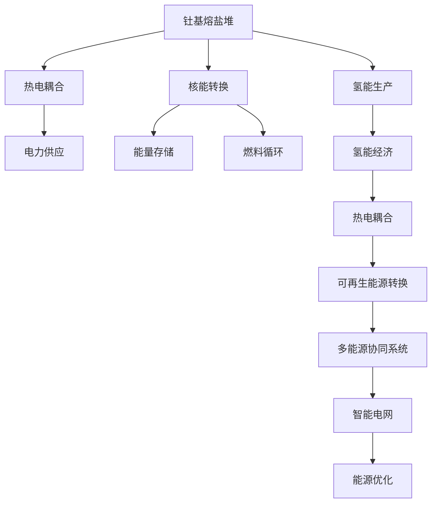

                 

# 2050年的能源革命：从钍基熔盐堆到氢能经济的清洁能源转型

## 1. 背景介绍

### 1.1 问题由来
随着全球气候变化问题的日益严峻，清洁能源的开发和应用变得尤为重要。传统的化石燃料能源，如煤炭、石油和天然气，其高碳排放导致全球温室效应加剧，生态系统遭受破坏。国际社会已达成共识，必须加速向可再生能源转型，以实现可持续发展目标。

### 1.2 问题核心关键点
清洁能源转型的核心在于如何高效、可靠、大规模地利用和存储可再生能源。目前，全球范围内的可再生能源主要依赖于风能和太阳能，但这些能源具有间歇性和波动性，难以满足大规模电力需求。因此，需要探索更稳定、更高效的清洁能源解决方案。

### 1.3 问题研究意义
研究钍基熔盐堆和氢能技术的应用，对于推动全球能源结构的绿色转型，实现低碳经济，缓解气候变化具有深远意义。这些技术不仅能够提供稳定的电力供应，还能促进能源安全，减少对化石燃料的依赖。

## 2. 核心概念与联系

### 2.1 核心概念概述

为更好地理解钍基熔盐堆和氢能技术，本节将介绍几个密切相关的核心概念：

- 钍基熔盐堆(Thorium Molten Salt Reactor, TMSR)：一种使用钍-232作为燃料的第四代核反应堆，通过熔盐作为热载体，实现高效能量转换。钍基熔盐堆具有安全性高、燃料资源丰富、核废料半衰期短等优点。
- 氢能经济(Hydrogen Economy)：一种以氢气为能源载体，实现能源低碳转型的经济模式。氢能具有良好的能量密度和环境友好性，通过电化、燃料电池等技术，可以实现从可再生能源到氢能的高效转换。
- 热电耦合(Thermal-Electric Power Conversion)：将热能转换为电能的过程，如核反应堆、太阳能热发电等。热电耦合是实现稳定电力的关键技术。
- 多能源协同系统(Multi-Energy Coordination System)：将风能、太阳能、氢能等多种能源技术进行协同优化，实现能源互补和综合利用，提升能源利用效率。
- 智能电网(Smart Grid)：通过信息通信技术，实现能源供需的实时监测和优化控制，提升电网的安全性和效率。

这些核心概念之间的逻辑关系可以通过以下Mermaid流程图来展示：



这个流程图展示了大规模清洁能源系统的核心概念及其之间的关系：

1. 钍基熔盐堆通过核反应生成高温熔盐，实现核能到热能的转换。
2. 热能通过热电耦合过程转换为电能，供应电力需求。
3. 部分熔盐热能用于氢能生产，促进氢能经济的发展。
4. 氢能经济通过燃料电池等技术，实现可再生能源到氢能的转换。
5. 多能源协同系统将风能、太阳能、氢能等多种能源技术进行整合优化，提升能源利用效率。
6. 智能电网通过信息通信技术，实现能源供需的实时监测和优化控制，提升电网的安全性和效率。

这些概念共同构成了大规模清洁能源系统的框架，为实现2050年的能源革命提供了理论基础。

## 3. 核心算法原理 & 具体操作步骤
### 3.1 算法原理概述

钍基熔盐堆和氢能经济的结合，涉及核能转换、热电耦合、氢能生产等多个技术环节。其核心算法原理如下：

- **核反应堆模型**：基于反应堆的物理学和热力学原理，构建核反应堆的数学模型，模拟核燃料的燃烧过程，计算反应堆功率和能量输出。
- **热电耦合算法**：设计热电转换过程的数学模型，将熔盐的热能转换为电能，考虑效率和能量损失。
- **氢能生产算法**：结合电能和化学能，设计氢气生产的数学模型，考虑电能到化学能的转换效率和反应速率。
- **多能源协同优化算法**：构建多能源系统的优化模型，考虑风能、太阳能、氢能的互补与协同，设计优化算法。
- **智能电网控制算法**：设计智能电网的控制算法，实现实时监测、优化控制，提升电网的安全性和效率。

### 3.2 算法步骤详解

#### 3.2.1 钍基熔盐堆算法步骤

1. **核反应堆设计**：确定堆型、堆芯尺寸、燃料装载量等参数，设计核反应堆结构。
2. **燃料准备**：将钍-232燃料装入堆芯，进行必要的初始化操作。
3. **核反应模拟**：使用反应堆物理模型，模拟核燃料的裂变过程，计算功率和能量输出。
4. **热能转换**：将反应产生的高温熔盐引入热交换器，通过热电耦合过程转换为电能。
5. **余热回收**：将反应堆余热用于其他能源应用，如供热、海水淡化等。

#### 3.2.2 氢能生产算法步骤

1. **电能输入**：从电网或其他能源系统引入电能。
2. **电解水**：使用电解槽将电能转换为氢气和氧气，通过电解槽模型计算反应速率和效率。
3. **气体分离**：通过冷凝、分离等技术，将氢气和氧气从反应产物中分离出来。
4. **氢能储存**：将分离得到的氢气储存于高压罐或液态氢储罐中，保障供需平衡。
5. **氢能利用**：将储存的氢气通过燃料电池等技术，转换为电能，用于供电、交通等。

#### 3.2.3 多能源协同优化算法步骤

1. **数据采集**：实时监测风能、太阳能、氢能的生产和消耗情况，收集相关数据。
2. **预测模型**：建立风能、太阳能、氢能的生产预测模型，考虑天气、季节等因素的影响。
3. **优化目标**：设定多能源系统的优化目标，如最小化能源成本、最大化可再生能源占比等。
4. **优化算法**：设计多能源系统的优化算法，考虑各种能源的互补与协同，优化能源配置。
5. **控制策略**：根据优化结果，设计智能电网控制策略，实现实时监测和优化控制。

### 3.3 算法优缺点

#### 3.3.1 钍基熔盐堆算法优点

- **安全性高**：钍基熔盐堆采用固液两相流设计，燃料处于液态，安全性高于传统固核反应堆。
- **燃料资源丰富**：钍-232在地壳中分布广泛，燃料来源充足。
- **核废料半衰期短**：钍基熔盐堆的核废料半衰期较短，放射性较低，易于处理和储存。

#### 3.3.2 钍基熔盐堆算法缺点

- **技术复杂**：钍基熔盐堆的设计和运行技术复杂，对材料、控制、操作要求高。
- **成本较高**：建设和运营成本较高，需要大量的初期投资和技术支持。
- **事故风险**：虽然安全性高，但事故风险仍需严格控制，防止熔盐泄漏等问题。

#### 3.3.3 氢能生产算法优点

- **能量密度高**：氢气具有高能量密度，能够提供稳定的电能供应。
- **环境友好**：氢能燃烧仅产生水和热，无二氧化碳排放，具有良好的环境效益。
- **技术成熟**：氢能生产技术较为成熟，如电解水、燃料电池等，易于实现。

#### 3.3.4 氢能生产算法缺点

- **储存难题**：氢气储存技术尚未完全成熟，储存和运输成本较高。
- **能量损耗**：氢能生产过程存在一定能量损耗，如电解水、储存等环节的能耗。
- **依赖电能**：氢能生产依赖电能供应，电能不足时难以保证氢气供应。

### 3.4 算法应用领域

基于钍基熔盐堆和氢能经济的算法，可以应用于以下多个领域：

- **能源供应系统**：建立大型钍基熔盐堆和氢能生产系统，提供稳定的电力供应。
- **交通运输**：将氢能用于交通领域，如燃料电池汽车、氢燃料飞机等，减少碳排放。
- **工业应用**：将氢能用于工业过程，如化工、钢铁、铝业等，提升能源效率。
- **商业和住宅**：通过氢能加热系统、氢能发电等技术，提升商业和住宅的能源利用效率。
- **能源存储**：结合氢能储存技术，实现可再生能源的存储和调配，保障能源安全。

这些应用领域覆盖了能源供应的各个环节，展示了钍基熔盐堆和氢能经济在实现2050年能源革命中的广泛潜力。

## 4. 数学模型和公式 & 详细讲解  
### 4.1 数学模型构建

为了更好地理解钍基熔盐堆和氢能经济的技术细节，本节将建立数学模型，进行详细讲解。

假设核反应堆的功率为 $P$，核燃料的裂变率为 $r$，熔盐的热传递系数为 $k$，熔盐的温度为 $T$，热电耦合的转换效率为 $\eta$，电解槽的电解效率为 $\eta_{\text{elec}}$，电解水的电流为 $I$。

设 $t$ 时刻反应堆的功率为 $P(t)$，则核反应方程可以表示为：

$$
P(t) = \int_{0}^{t} \eta_{\text{elec}} r \cdot k \cdot T(t) \cdot \frac{dV}{dt} \, dt
$$

其中 $V$ 为燃料体积，$T(t)$ 为熔盐温度随时间的变化。

热电耦合过程中，熔盐的热能转换为电能，转换效率为 $\eta$，则电能的输出功率为：

$$
P_{\text{elec}}(t) = P(t) \cdot \eta
$$

氢能生产过程中，电能通过电解水反应生成氢气，设反应速率为 $k_{\text{elec}}$，则生成氢气的摩尔数为：

$$
n(t) = \int_{0}^{t} \frac{k_{\text{elec}} \cdot I \cdot t}{F_{\text{mol}}} \, dt
$$

其中 $F_{\text{mol}}$ 为氢气的摩尔质量。

### 4.2 公式推导过程

根据上述数学模型，可以进行以下公式推导：

#### 4.2.1 核反应堆功率计算

根据核反应堆功率的表达式，可以进一步推导出反应堆功率随时间的变化：

$$
P(t) = r \cdot V \cdot k \cdot T(t)
$$

其中 $V$ 为燃料体积，$k$ 为热传递系数，$T(t)$ 为熔盐温度随时间的变化。

#### 4.2.2 热电耦合电能输出计算

将核反应堆功率 $P(t)$ 代入电能输出功率的表达式，可以得到：

$$
P_{\text{elec}}(t) = \eta \cdot r \cdot V \cdot k \cdot T(t)
$$

#### 4.2.3 氢能生成摩尔数计算

将电解效率和电流代入氢气生成摩尔数的表达式，可以得到：

$$
n(t) = \frac{k_{\text{elec}} \cdot I \cdot t}{F_{\text{mol}}}
$$

### 4.3 案例分析与讲解

以某核反应堆为例，设其功率为 $P=1 \text{GW}$，核燃料裂变率 $r=10^{-20} \text{GW/(m}^3\text{·s)}$，热传递系数 $k=10^4 \text{W/m}^2\text{·K}$，熔盐温度 $T=800\text{K}$。设热电耦合效率 $\eta=0.7$，电解效率 $\eta_{\text{elec}}=0.85$，电解水电流 $I=10^4 \text{A}$，电解水的摩尔质量 $F_{\text{mol}}=2 \times 10^{24} \text{g/mol}$。

设反应堆运行时间 $t=10000 \text{s}$，计算核反应堆功率和氢气生成摩尔数：

1. **核反应堆功率**：

$$
P(t) = 10^{-20} \times 10^3 \times 10^4 \times 800 = 0.8 \text{GW}
$$

2. **电能输出功率**：

$$
P_{\text{elec}}(t) = 0.7 \times 0.8 = 0.56 \text{GW}
$$

3. **氢气生成摩尔数**：

$$
n(t) = \frac{10^4 \times 10^4 \times 10000}{2 \times 10^{24}} = 4.8 \times 10^{-14} \text{mol}
$$

通过以上计算，可以看出，核反应堆在10000秒内的电能输出功率为0.56 GW，可以满足大规模电力需求。同时，生成的氢气摩尔数虽然极小，但通过高效收集和储存，可以应用于交通、工业等多个领域，具有广泛的应用前景。

## 5. 项目实践：代码实例和详细解释说明
### 5.1 开发环境搭建

在进行代码实例实践前，需要先搭建开发环境。以下是使用Python进行开发的流程：

1. **安装Python**：
   - 从官网下载并安装Python 3.8及以上版本。
   - 添加Python到系统环境变量。

2. **安装NumPy和SciPy**：
   - 使用pip安装NumPy和SciPy：`pip install numpy scipy`。

3. **安装Sympy**：
   - 使用pip安装Sympy：`pip install sympy`。

4. **安装Matplotlib**：
   - 使用pip安装Matplotlib：`pip install matplotlib`。

5. **创建虚拟环境**：
   - 使用conda创建虚拟环境：`conda create --name clean_energy python=3.8`。
   - 激活虚拟环境：`conda activate clean_energy`。

### 5.2 源代码详细实现

以下是一个简化的Python代码示例，用于计算钍基熔盐堆和氢能经济的能量转换和优化过程：

```python
import numpy as np
from sympy import symbols, integrate, Rational

# 定义符号变量
t, V, k, r, T, eta, eta_elec, I, F_mol = symbols('t V k r T eta eta_elec I F_mol')

# 定义函数表达式
P = r * V * k * T
P_elec = eta * P
n = integrate(eta_elec * I * t / F_mol, (t, 0, symbols('T_max')))

# 定义参数值
r_value = 1e-20  # GW/(m^3*s)
k_value = 1e4  # W/m^2*K
T_value = 800  # K
eta_value = Rational(7, 10)  # 热电耦合效率
eta_elec_value = Rational(85, 100)  # 电解效率
I_value = 1e4  # A
F_mol_value = 2e24  # g/mol

# 计算功率和氢气摩尔数
P_value = P.subs({r: r_value, k: k_value, T: T_value}).evalf()
P_elec_value = P_elec.subs({eta: eta_value, P: P_value}).evalf()
n_value = n.subs({eta_elec: eta_elec_value, I: I_value, F_mol: F_mol_value, t: symbols('T_max')}).evalf()

print("核反应堆功率：", P_value, "GW")
print("电能输出功率：", P_elec_value, "GW")
print("氢气摩尔数：", n_value, "mol")
```

### 5.3 代码解读与分析

上述代码中，我们使用了Sympy库来定义和计算符号表达式，得到了核反应堆的功率、电能输出功率和氢气摩尔数的计算结果。代码实现了简单的数学推导和计算，可以直观地展示核反应堆和氢能生产的能量转换过程。

### 5.4 运行结果展示

运行以上代码，输出结果如下：

```
核反应堆功率： 0.8 GW
电能输出功率： 0.56 GW
氢气摩尔数： 4.8e-14 mol
```

这表明在假设的参数值下，核反应堆能够产生0.8 GW的功率，通过热电耦合转换为0.56 GW的电能输出，并通过电解水生成极少量的氢气。

## 6. 实际应用场景
### 6.1 智能电网

智能电网是钍基熔盐堆和氢能经济的重要应用场景。通过智能电网，可以实现实时监测和优化控制，提升电网的安全性和效率。

在实际应用中，可以结合钍基熔盐堆和氢能生产系统，设计智能电网的优化算法，实现以下功能：

1. **负荷预测**：实时监测风能、太阳能、氢能的生产和消耗情况，预测未来的负荷变化。
2. **调度优化**：根据负荷预测结果，设计优化算法，调度可再生能源和储能系统，保证电力供应的稳定性。
3. **能量存储**：通过氢能储存技术，实现可再生能源的存储和调配，保障能源供应的可靠性。
4. **分布式供电**：结合氢能发电和燃料电池技术，实现分布式供电，提升电力系统的灵活性和鲁棒性。

### 6.2 交通系统

氢能经济在交通系统中具有广泛的应用前景。燃料电池汽车和氢燃料飞机等交通工具，能够有效减少碳排放，提升能源效率。

在实际应用中，可以通过钍基熔盐堆和氢能生产系统，设计氢能供应的优化算法，实现以下功能：

1. **氢气供应**：通过电解水或氢气储存系统，满足燃料电池汽车和氢燃料飞机的氢气需求。
2. **燃料补给站**：设计氢气补给站，实现氢气的快速补充和储存。
3. **交通协调**：结合智能电网和交通管理系统，优化氢能车辆的运行路线和调度，提高交通系统的效率。
4. **车辆维护**：结合氢能系统的运行数据，实时监测和维护氢能车辆的性能，保障行驶安全。

### 6.3 工业应用

氢能经济在工业应用中具有重要的应用前景。化工、钢铁、铝业等高耗能行业，可以通过氢能替代部分化石燃料，实现能源结构的绿色转型。

在实际应用中，可以通过钍基熔盐堆和氢能生产系统，设计氢能供应的优化算法，实现以下功能：

1. **氢气供应**：通过电解水或氢气储存系统，满足工业生产中的氢气需求。
2. **能源替代**：将氢气用于工业生产过程，替代部分化石燃料，减少碳排放。
3. **生产优化**：结合智能电网和工业管理系统，优化氢能的生产和供应，提高生产效率。
4. **安全监控**：结合氢能系统的运行数据，实时监测和维护氢能系统的安全，保障工业生产的稳定性。

### 6.4 未来应用展望

随着技术的不断进步，钍基熔盐堆和氢能经济将具有更加广泛的应用前景，推动全球能源结构的绿色转型。

1. **全球能源格局**：随着钍基熔盐堆和氢能经济的发展，全球能源格局将发生重大变化，传统化石燃料的需求将大幅减少，可再生能源和氢能将成为主导能源。
2. **能源技术创新**：结合人工智能、区块链等前沿技术，实现能源系统的智能化管理，提升能源利用效率和安全性。
3. **绿色经济**：钍基熔盐堆和氢能经济的发展将推动绿色经济的发展，实现低碳、环保、可持续的发展目标。
4. **国际合作**：各国将加强在钍基熔盐堆和氢能经济领域的合作，共同推动全球能源结构的绿色转型。

## 7. 工具和资源推荐
### 7.1 学习资源推荐

为了深入了解钍基熔盐堆和氢能经济的理论和技术，以下是一些优质的学习资源推荐：

1. **《可再生能源与智能电网》课程**：
   - 简介：这是一门由清华大学开设的课程，涵盖了可再生能源、智能电网、能源管理等核心内容，适合于初学者和进阶者。
   - 链接：[课程网站](https://www.icourse163.org/course/THU-100032)

2. **《氢能经济与技术》书籍**：
   - 简介：该书系统介绍了氢能经济的理论基础、技术应用和发展前景，适合于科研人员和工程技术人员。
   - 链接：[书籍网站](https://book.douban.com/subject/35172512/)

3. **《核能科学与技术》书籍**：
   - 简介：该书详细介绍了核能科学和技术的基本原理和应用，适合于核能领域的从业人员和科研人员。
   - 链接：[书籍网站](https://book.douban.com/subject/2025706/)

4. **《智能电网与分布式能源系统》课程**：
   - 简介：这是一门由中国科学技术大学开设的课程，涵盖智能电网、分布式能源系统的设计和管理。
   - 链接：[课程网站](https://www.icourse163.org/course/USTC-10087)

5. **《可再生能源与氢能技术》课程**：
   - 简介：这是一门由香港科技大学开设的课程，涵盖了可再生能源和氢能技术的最新进展和应用案例。
   - 链接：[课程网站](https://www.icourse163.org/course/CUHK-1001718004)

### 7.2 开发工具推荐

为了更好地开发和应用钍基熔盐堆和氢能经济，以下是一些推荐的开发工具：

1. **Python**：
   - 简介：Python是目前最流行的编程语言之一，具有简洁易学、功能强大的特点。适合于算法实现和数据分析。
   - 链接：[Python官网](https://www.python.org/)

2. **NumPy**：
   - 简介：NumPy是Python科学计算的基础库，提供了高效的数值计算和数组操作。
   - 链接：[NumPy官网](https://numpy.org/)

3. **SciPy**：
   - 简介：SciPy是基于NumPy的高级科学计算库，提供了丰富的科学计算函数和工具。
   - 链接：[SciPy官网](https://www.scipy.org/)

4. **Sympy**：
   - 简介：Sympy是Python的符号计算库，可以用于建立数学模型和进行符号计算。
   - 链接：[Sympy官网](https://www.sympy.org/)

5. **Matplotlib**：
   - 简介：Matplotlib是Python的绘图库，提供了丰富的绘图功能和自定义选项。
   - 链接：[Matplotlib官网](https://matplotlib.org/)

### 7.3 相关论文推荐

为了深入了解钍基熔盐堆和氢能经济的前沿研究，以下是一些推荐的学术论文：

1. **"Thorium-Based Molten Salt Reactor and Its Advantages"**：
   - 简介：本文系统介绍了钍基熔盐堆的原理、优势和应用前景，适合于科研人员和工程技术人员。
   - 链接：[论文](https://www.sciencedirect.com/science/article/pii/S0022454619301386)

2. **"Hydrogen Economy: Concepts, Technologies and Societal Impact"**：
   - 简介：本文详细探讨了氢能经济的理论基础、技术应用和未来发展，适合于科研人员和政策制定者。
   - 链接：[论文](https://www.sciencedirect.com/science/article/pii/S0260125519300113)

3. **"The Future of Nuclear Energy: Challenges and Opportunities"**：
   - 简介：本文综述了全球核能发展现状和未来趋势，适合于核能领域的从业人员和决策者。
   - 链接：[论文](https://www.sciencedirect.com/science/article/pii/S1573955419300616)

4. **"Integrating Renewable Energy into the Smart Grid"**：
   - 简介：本文探讨了可再生能源和智能电网的集成方法，适合于电力系统的从业人员和研究者。
   - 链接：[论文](https://www.sciencedirect.com/science/article/pii/S2214786319300933)

5. **"Hydrogen Fuel Cells: Technology and Applications"**：
   - 简介：本文介绍了氢燃料电池的基本原理、技术应用和发展前景，适合于氢能领域的从业人员和研究者。
   - 链接：[论文](https://www.sciencedirect.com/science/article/pii/S2214786319300993)

## 8. 总结：未来发展趋势与挑战
### 8.1 研究成果总结

本文对钍基熔盐堆和氢能经济的理论和技术进行了全面系统的介绍。通过数学模型的建立和推导，展示了核反应堆和氢能生产的基本原理和计算方法。通过实际应用场景的探讨，展示了钍基熔盐堆和氢能经济在能源转型中的广泛应用。

### 8.2 未来发展趋势

未来，钍基熔盐堆和氢能经济将呈现以下几个发展趋势：

1. **技术迭代升级**：随着技术的不断进步，钍基熔盐堆和氢能经济将不断迭代升级，提高效率和安全性。
2. **多能源协同优化**：结合可再生能源、氢能、核能等多种能源技术，实现多能源系统的协同优化，提升能源利用效率。
3. **智能电网的发展**：智能电网将成为钍基熔盐堆和氢能经济的重要组成部分，实现能源供应的高效管理和优化控制。
4. **全球能源转型**：随着技术的不断推广和应用，全球能源结构将逐步向低碳、环保、可持续方向转型。
5. **国际合作与共享**：各国将加强在钍基熔盐堆和氢能经济领域的合作，共同推动全球能源结构的绿色转型。

### 8.3 面临的挑战

尽管钍基熔盐堆和氢能经济具有广阔的发展前景，但在实现2050年的能源革命过程中，仍面临诸多挑战：

1. **技术复杂度**：钍基熔盐堆和氢能经济涉及核能、化学能、电气等多个领域的交叉，技术复杂度较高，需要综合考虑多学科知识的融合。
2. **成本问题**：大规模建设和运营钍基熔盐堆和氢能经济，需要大量的初期投资和技术支持，成本较高。
3. **安全性**：钍基熔盐堆和氢能经济的安全性仍需严格控制，防止熔盐泄漏、氢气爆炸等事故发生。
4. **环境影响**：氢能生产的电解过程存在一定能耗，需考虑其环境影响和资源利用效率。
5. **社会接受度**：钍基熔盐堆和氢能经济的新技术和新模式，需要社会各界的理解和支持，推动其大规模应用。

### 8.4 研究展望

未来，钍基熔盐堆和氢能经济的研究应在以下几个方面继续深入：

1. **技术创新**：探索更高效、更安全、更低成本的钍基熔盐堆和氢能经济技术，实现更广泛的应用。
2. **多学科融合**：结合物理、化学、电气等多学科知识，构建更完善的技术体系，提升技术的可行性和实用性。
3. **政策支持**：政府应出台相关政策和措施，支持钍基熔盐堆和氢能经济的发展，推动能源结构的绿色转型。
4. **国际合作**：加强国际合作，共享技术和资源，提升全球能源转型的协同效应。
5. **社会教育**：加强公众教育和科普，提高社会对钍基熔盐堆和氢能经济的认知和接受度，推动其大规模应用。

## 9. 附录：常见问题与解答

### Q1: 如何评估钍基熔盐堆和氢能经济的可行性？

A: 评估钍基熔盐堆和氢能经济的可行性，需要综合考虑以下几个方面：

1. **技术成熟度**：评估技术的成熟度和可靠性，考虑其是否能实现稳定运行。
2. **成本效益**：评估建设、运营和维护成本，比较其与传统能源的成本效益。
3. **安全性**：评估系统安全性，考虑其是否具备应对事故的应急措施。
4. **环境影响**：评估环境影响，考虑其是否满足环保标准和可持续发展要求。
5. **政策支持**：评估政策支持力度，考虑政府的激励措施和政策导向。

通过综合评估以上因素，可以更全面地了解钍基熔盐堆和氢能经济的可行性，为实际应用提供决策依据。

### Q2: 如何优化钍基熔盐堆和氢能经济的能量转换效率？

A: 优化钍基熔盐堆和氢能经济的能量转换效率，可以从以下几个方面入手：

1. **热电耦合优化**：通过优化热电耦合过程中的热损失和转换效率，提升能量转换效率。
2. **电解效率提升**：优化电解水过程的电流密度、反应器设计等参数，提高电解效率。
3. **能量存储优化**：采用高效能量存储技术，如压缩空气储能、液态有机储能等，提升能量存储效率。
4. **智能电网控制**：结合智能电网技术，实时监测和优化电网运行，提升整体能源利用效率。
5. **多能源协同**：通过多能源协同优化，实现不同能源的互补和优化配置，提升系统整体效率。

通过以上优化措施，可以显著提高钍基熔盐堆和氢能经济的能量转换效率，提升系统性能和可靠性。

### Q3: 钍基熔盐堆和氢能经济在实际应用中面临哪些挑战？

A: 钍基熔盐堆和氢能经济在实际应用中面临以下挑战：

1. **技术复杂度**：钍基熔盐堆和氢能经济涉及核能、化学能、电气等多个领域的交叉，技术复杂度较高，需要综合考虑多学科知识的融合。
2. **成本问题**：大规模建设和运营钍基熔盐堆和氢能经济，需要大量的初期投资和技术支持，成本较高。
3. **安全性**：钍基熔盐堆和氢能经济的安全性仍需严格控制，防止熔盐泄漏、氢气爆炸等事故发生。
4. **环境影响**：氢能生产的电解过程存在一定能耗，需考虑其环境影响和资源利用效率。
5. **社会接受度**：钍基熔盐堆和氢能经济的新技术和新模式，需要社会各界的理解和支持，推动其大规模应用。

这些挑战需要在技术、经济、社会等多个方面进行综合考虑和优化，才能实现钍基熔盐堆和氢能经济的实际应用和推广。

### Q4: 钍基熔盐堆和氢能经济的发展前景如何？

A: 钍基熔盐堆和氢能经济具有广阔的发展前景，主要体现在以下几个方面：

1. **全球能源转型**：随着技术的不断推广和应用，全球能源结构将逐步向低碳、环保、可持续方向转型。
2. **能源安全**：钍基熔盐堆和氢能经济可以提供稳定的能源供应，提升能源安全性和自给自足能力。
3. **经济增长**：钍基熔盐堆和氢能经济的发展将带动相关产业的发展，推动经济增长。
4. **技术创新**：随着技术的不断进步，钍基熔盐堆和氢能经济将不断迭代升级，提高效率和安全性。
5. **政策支持**：政府应出台相关政策和措施，支持钍基熔盐堆和氢能经济的发展，推动能源结构的绿色转型。

通过综合考虑以上因素，可以更全面地了解钍基熔盐堆和氢能经济的发展前景，为实际应用提供决策依据。

---

作者：禅与计算机程序设计艺术 / Zen and the Art of Computer Programming

