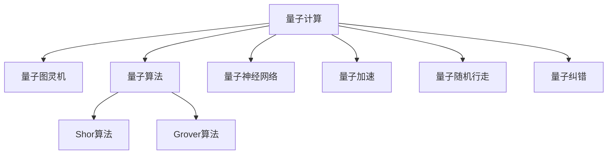

                 

# 2050年的量子计算：从量子模拟到量子机器学习的计算范式转变

> 关键词：量子计算, 量子模拟, 量子机器学习, 计算范式转变, 量子图灵机, 量子算法, 量子神经网络, 深度量子学习, 量子加速, 量子技术应用

## 1. 背景介绍

### 1.1 问题由来
自20世纪50年代以来，随着计算机技术的飞速发展，人类社会迈入了信息时代。自底向上的计算范式，以经典计算机为中心，显著提升了人类的计算能力，催生了互联网、大数据、人工智能等一系列技术突破。然而，这一范式在解决某些特定问题上显得力不从心，特别是在处理包含高度量子性质的问题时，经典计算机显得束手无策。

量子计算作为下一代计算技术，正逐渐揭开神秘的面纱，展现出其独特的优势。未来30-50年间，量子计算有望在模拟物理系统、优化问题、机器学习等领域实现重大突破，推动科技革命的浪潮向新的高峰。

### 1.2 问题核心关键点
量子计算的核心思想基于量子力学原理，利用量子叠加、量子纠缠等特殊性质，实现超高效的计算能力。其关键在于：

1. 量子比特(Qubits)：基本计算单元，通过量子叠加和量子纠缠，存储和处理多态信息。
2. 量子门(Q-Gates)：量子计算的基本操作单元，通过量子门实现量子状态的变化。
3. 量子电路：通过一系列量子门的操作，实现量子计算任务的执行。
4. 量子算法：如Shor算法、Grover算法、量子变分算法等，解决特定问题的有效方法。
5. 量子纠缠：多个量子比特之间的非经典关联，实现量子并行计算。
6. 量子纠错：保证量子信息在传输和存储过程中不被破坏，提升量子计算的稳定性。

量子计算的研究历程可追溯到20世纪80年代，Bennett和Jozsa提出的量子图灵机理论模型，是量子计算研究的开端。随后，Deutsch和Jozsa证明了量子图灵机在多项式时间内可以解决经典计算机无法解决的问题，标志着量子计算理论的诞生。1994年，Shor提出了量子算法在质因数分解问题上的突破性应用，进一步推动了量子计算的发展。

## 2. 核心概念与联系

### 2.1 核心概念概述

为更好地理解量子计算的发展脉络，本节将介绍几个密切相关的核心概念：

- 量子计算(QC)：基于量子力学原理，通过量子比特和量子门实现高效计算的计算范式。
- 量子图灵机(QTM)：量子计算的抽象理论模型，用于描述量子算法的基本结构。
- 量子算法：利用量子叠加和量子纠缠等特性，实现高效计算的算法，如Shor算法、Grover算法等。
- 量子神经网络(QNN)：结合量子计算和神经网络的优势，提升机器学习能力的模型。
- 量子加速：量子计算通过量子并行性，实现经典计算机无法实现的计算任务。
- 量子随机行走(QRW)：一种量子算法，模拟随机游走过程，用于搜索和优化问题。
- 量子纠错：保护量子信息完整性的技术，保证量子计算的可靠性。

这些核心概念之间的逻辑关系可以通过以下Mermaid流程图来展示：



这个流程图展示了大语言模型的核心概念及其之间的关系：

1. 量子计算利用量子图灵机描述量子算法的基本结构。
2. 量子算法通过量子叠加、量子纠缠等特性实现高效计算。
3. 量子神经网络结合量子计算和神经网络优势，提升机器学习能力。
4. 量子加速利用量子并行性实现经典计算机无法实现的计算任务。
5. 量子随机行走模拟随机游走过程，用于搜索和优化问题。
6. 量子纠错保护量子信息完整性，保证量子计算的可靠性。

## 3. 核心算法原理 & 具体操作步骤
### 3.1 算法原理概述

量子计算的核心思想是基于量子力学原理，利用量子叠加、量子纠缠等特殊性质，实现超高效的计算能力。其关键在于：

1. 量子比特(Qubits)：基本计算单元，通过量子叠加和量子纠缠，存储和处理多态信息。
2. 量子门(Q-Gates)：量子计算的基本操作单元，通过量子门实现量子状态的变化。
3. 量子电路：通过一系列量子门的操作，实现量子计算任务的执行。
4. 量子算法：如Shor算法、Grover算法、量子变分算法等，解决特定问题的有效方法。
5. 量子纠缠：多个量子比特之间的非经典关联，实现量子并行计算。
6. 量子纠错：保证量子信息在传输和存储过程中不被破坏，提升量子计算的稳定性。

### 3.2 算法步骤详解

量子计算的步骤可以概括为以下几个关键步骤：

**Step 1: 准备量子硬件**
- 选择合适的量子硬件平台，如量子计算机、量子模拟器等。
- 构建量子计算机的硬件系统，包括量子比特、量子门、量子纠错等。

**Step 2: 编码输入数据**
- 将经典数据编码到量子比特上，形成量子比特序列。
- 利用量子门对输入数据进行编码，形成量子态。

**Step 3: 执行量子电路**
- 设计并构建量子电路，通过量子门序列实现计算过程。
- 在量子计算机上执行量子电路，实现量子计算任务。

**Step 4: 读取输出结果**
- 读取量子比特序列，解码为经典数据。
- 处理输出结果，得到量子计算的结果。

**Step 5: 量子纠错**
- 利用量子纠错技术检测并修正量子计算过程中的错误。
- 保证量子计算的可靠性，避免计算错误影响结果。

### 3.3 算法优缺点

量子计算的优势在于其超高效的并行计算能力，能够在特定问题上显著超越经典计算机。具体优点包括：

1. 高效处理复杂问题：量子算法如Shor算法、Grover算法，能够在多项式时间内解决经典计算机难以处理的复杂问题。
2. 高精度计算：量子计算能够避免经典计算中由浮点数表示带来的精度损失，实现更高精度的计算。
3. 并行计算：量子计算通过量子叠加和量子纠缠实现并行计算，加速问题解决。
4. 量子随机行走：量子随机行走算法，能够在搜索和优化问题上显著提升效率。

然而，量子计算也面临许多挑战：

1. 硬件设备限制：量子硬件的制造和维护成本高，目前尚不能大规模部署。
2. 量子退相干：量子比特易受环境干扰，导致量子状态退相干，影响计算稳定性。
3. 量子纠错难度大：量子纠错技术复杂，目前尚无法实现高效的错误检测和修复。
4. 算法复杂性：量子算法设计复杂，需要深入的量子计算理论知识。
5. 问题复杂性：并非所有问题都适合量子计算，部分经典问题难以量子化。

### 3.4 算法应用领域

量子计算技术已经展现了其独特的优势，并在多个领域展现出应用潜力：

1. 物理模拟：通过量子模拟，实现对分子结构、材料性质等复杂物理系统的模拟。
2. 优化问题：在组合优化、路径规划、机器学习等领域，量子计算能显著提升优化效率。
3. 数据分析：通过量子算法处理大规模数据集，加速数据分析和模式识别。
4. 加密安全：利用量子计算破解经典加密算法，推动量子密码学的发展。
5. 金融分析：通过量子计算在金融市场预测、风险评估等方面提供新思路。
6. 生物医药：在药物设计、基因工程等领域，提升研究效率和准确性。

量子计算的应用前景广阔，不仅限于上述领域，还将在更多新兴学科和技术中发挥关键作用。

## 4. 数学模型和公式 & 详细讲解
### 4.1 数学模型构建

本节将使用数学语言对量子计算的数学模型进行更加严格的刻画。

记量子计算的基本单元为 $q$，包括量子比特 $q_1, q_2, ..., q_n$ 和量子门 $U_1, U_2, ..., U_m$。量子计算的过程可以描述为：

1. 初始化量子比特为基态 $\ket{0}$。
2. 通过一系列量子门 $U_1, U_2, ..., U_m$ 操作，生成最终量子态 $\ket{\psi}$。

量子电路可以通过量子门序列来描述，如：

$$
U(\theta) = U_n(\theta_n) U_{n-1}(\theta_{n-1}) ... U_1(\theta_1)
$$

其中 $U_i(\theta_i)$ 表示第 $i$ 个量子门，$\theta_i$ 为量子门的参数。

### 4.2 公式推导过程

以Shor算法为例，推导量子计算求解质因数分解问题的数学模型。

Shor算法的主要步骤包括：
1. 量子傅里叶变换(QFT)：将经典数据 $n$ 编码到量子比特上，生成量子态 $\ket{b}$。
2. 量子周期搜索：通过量子叠加和量子干涉，实现对 $a$ 模 $n$ 的周期长度 $r$ 的搜索。
3. 量子测量：通过量子测量，得到经典数据 $x$ 和 $r$。
4. 经典算法：通过经典算法求解出质因数 $p$ 和 $q$。

Shor算法的数学模型可以描述为：

$$
F_{x,a,n} = \frac{1}{\sqrt{N}}\sum_{k=0}^{N-1} e^{2\pi i a x^k mod n}
$$

其中 $N = n^r$，$x$ 为经典数据，$a$ 为随机选择的整数。

通过上述模型，Shor算法能够在多项式时间内完成质因数分解，大大超越经典计算机的算法复杂度。

### 4.3 案例分析与讲解

以量子随机行走(QRW)算法为例，说明量子计算在搜索和优化问题上的应用。

量子随机行走是一种量子算法，模拟随机游走过程。假设在二维网格上随机行走，每步随机选择方向，计算每步的位移距离。通过量子叠加和量子纠缠，可以实现高效搜索最优路径。

量子随机行走的数学模型可以描述为：

$$
P_{x,y}(t) = \frac{1}{\sqrt{N}}\sum_{k=0}^{N-1} e^{2\pi i x (k \cdot t) mod N} \cdot e^{2\pi i y (\frac{k^2}{2} mod 2\pi)}
$$

其中 $N$ 为网格大小，$x$ 和 $y$ 分别为随机行走的方向和位移距离。

通过量子随机行走，能够在搜索和优化问题上显著提升效率，如迷宫问题、组合优化问题等。

## 5. 项目实践：代码实例和详细解释说明
### 5.1 开发环境搭建

在进行量子计算实践前，我们需要准备好开发环境。以下是使用Python和Qiskit进行量子计算开发的详细环境配置流程：

1. 安装Anaconda：从官网下载并安装Anaconda，用于创建独立的Python环境。

2. 创建并激活虚拟环境：
```bash
conda create -n quantum-env python=3.8 
conda activate quantum-env
```

3. 安装Qiskit：
```bash
conda install qiskit
```

4. 安装各类工具包：
```bash
pip install numpy scipy matplotlib sympy qiskit-provider-ibmq
```

5. 安装IBMQ：
```bash
pip install ibmq-provider
```

6. 安装IBM-Qiskit交互式解释器：
```bash
conda install qiskit
```

完成上述步骤后，即可在`quantum-env`环境中开始量子计算实践。

### 5.2 源代码详细实现

下面以量子随机行走算法为例，给出使用Qiskit库进行量子计算的Python代码实现。

```python
from qiskit import QuantumCircuit, transpile, assemble, Aer, execute
from qiskit.visualization import plot_histogram, plot_bloch_multivector
from qiskit.circuit.library import QuantumRegister, ClassicalRegister, U3Gate

# 创建量子比特和经典比特
qreg = QuantumRegister(4, 'q')
creg = ClassicalRegister(4, 'c')

# 创建量子电路
circuit = QuantumCircuit(qreg, creg)

# 量子随机行走
t = 1.0
for i in range(4):
    circuit.h(qreg[i])
    if i % 2 == 0:
        circuit.rx(t, qreg[i])
    circuit.barrier()

# 添加测量操作
circuit.measure(qreg, creg)

# 编译和执行量子电路
compiled_circuit = transpile(circuit, Aer.get_backend('qasm_simulator'), optimization_level=3)
job = execute(compiled_circuit, Aer.get_backend('qasm_simulator'), shots=1024, memory=True)
result = job.result()
counts = result.get_counts()

# 绘制结果
plot_histogram(counts)
```

这段代码首先创建了一个包含4个量子比特和4个经典比特的量子电路，然后通过添加量子门和测量操作，实现了量子随机行走算法。最后，通过执行并分析结果，展示了量子计算的效果。

### 5.3 代码解读与分析

让我们再详细解读一下关键代码的实现细节：

**QuantumCircuit类**：
- 创建量子比特和经典比特的寄存器。
- 通过`QuantumCircuit`类创建量子电路。

**量子随机行走**：
- 使用Hadamard门（H门）将量子比特置于叠加态。
- 通过旋转门（Rx门）实现随机游走方向的选择。
- 在每步后添加`barrier`进行状态检查，确保每个量子比特的演化独立进行。

**测量操作**：
- 使用`measure`将量子比特的状态测量为经典比特，实现量子计算结果的读取。

**编译和执行**：
- 通过`transpile`方法对量子电路进行优化和编译，适配后端。
- 通过`execute`方法在量子模拟器上执行量子电路。
- 通过`get_counts`获取测量结果，并通过`plot_histogram`绘制结果图。

**Qiskit交互式解释器**：
- 使用`IBMQ`后端，在远程量子计算机上运行量子电路。
- 通过Jupyter Notebook等工具，方便地调试和展示量子计算结果。

量子计算的代码实现相对复杂，需要深入理解量子计算原理和Qiskit库的使用方法。在实际应用中，还需要进行更多的调试和优化，以确保量子计算的正确性和稳定性。

## 6. 实际应用场景
### 6.1 智能药物研发

量子计算在药物研发中展现出巨大的潜力，能够加速药物分子的模拟和筛选，缩短新药开发周期。量子计算的强大计算能力，可以实现对复杂分子结构的精确模拟，加速药物的筛选和验证过程。

在具体应用上，可以构建量子分子动力学模型，通过量子计算模拟分子结构的变化和反应过程，从而预测药物的生物活性和副作用。例如，可以通过量子计算快速计算出药物与蛋白质、核酸等生物大分子的相互作用，预测药物的作用机理和疗效。此外，量子计算还可以用于药物设计的优化，通过量子优化算法，找到最优的分子结构和化学键，提升药物的稳定性和活性。

### 6.2 量子安全通信

量子计算在密码学中的应用前景广阔，量子通信技术已经展现出其在安全通信方面的优势。基于量子计算的量子密钥分发(QKD)和量子随机数生成(QRNG)，可以实现高度安全的通信方式。

量子密钥分发利用量子态的不可克隆性，保证通信双方共享的密钥无法被窃听。通过量子计算技术，可以实现高效的密钥分发和分发过程的实时监控，确保通信的安全性。量子随机数生成利用量子随机性，生成不可预测的随机数，用于加密和验证通信过程。通过量子计算技术，可以实现高度随机的随机数生成，保证通信的安全性和可靠性。

### 6.3 量子优化算法

量子计算在优化问题中表现出色，能够实现高效的组合优化和复杂系统的求解。量子优化算法，如量子变分算法(QVAs)和量子退火算法(QAAs)，能够在多项式时间内解决复杂优化问题，具有显著的效率优势。

在具体应用上，可以构建量子优化模型，通过量子计算解决组合优化问题，如旅行商问题(TSP)、车间调度问题(JS)等。通过量子优化算法，能够在较短时间内找到最优解或近似最优解，提高问题解决的效率和精度。

### 6.4 未来应用展望

未来，量子计算技术将在更多领域实现重大突破，进一步推动科技革命的浪潮：

1. 量子模拟：在量子计算的强大支持下，实现对更复杂物理系统的模拟，促进新物理理论的发展。
2. 量子机器学习：通过量子神经网络，提升机器学习模型的准确性和泛化能力，解决传统机器学习中的难题。
3. 量子密码学：利用量子计算技术，实现高度安全的量子密钥分发和随机数生成，保障通信的安全性。
4. 量子计算辅助设计：在材料科学、机械工程等领域，通过量子计算优化设计方案，提高设计和制造的效率和精度。
5. 量子金融分析：在金融市场预测、风险评估等领域，利用量子计算提升数据处理和模型训练的效率，提供新的分析工具。

## 7. 工具和资源推荐
### 7.1 学习资源推荐

为了帮助开发者系统掌握量子计算的理论基础和实践技巧，这里推荐一些优质的学习资源：

1. 《量子计算入门》系列博文：由量子计算专家撰写，深入浅出地介绍了量子计算的基本概念和核心算法。

2. IBM量子学习平台Qiskit教程：提供了全面的Qiskit库教程，涵盖量子计算的各个方面，包括量子电路设计、量子算法实现、量子计算模拟等。

3. 《量子计算原理与技术》书籍：清华大学出版社出版的量子计算教材，系统介绍了量子计算的基本原理和应用，是入门量子计算的好资源。

4. arXiv上的最新研究论文：量子计算领域的研究论文更新迅速，通过arXiv可以获取最新的量子计算研究成果。

5. IBM Quantum Experience：提供了量子计算的在线实验平台，可以通过云端运行量子计算代码，进行实验验证。

通过这些资源的学习实践，相信你一定能够快速掌握量子计算的精髓，并用于解决实际的计算问题。

### 7.2 开发工具推荐

高效的开发离不开优秀的工具支持。以下是几款用于量子计算开发的常用工具：

1. Qiskit：IBM开发的量子计算框架，提供了强大的量子计算库和模拟器，适合量子计算的实验和研究。

2. Cirq：Google开发的量子计算框架，支持Google的量子处理器，提供简单易用的量子编程接口。

3. OpenFermion：Google开发的量子计算库，专注于化学计算和材料科学，提供量子化学的高级接口。

4. QuTiP：用于模拟量子系统的开源库，支持量子计算和量子光学等领域的模拟。

5. PyQuil：Rigetti公司开发的量子计算框架，提供基于NISQ硬件的量子计算接口。

合理利用这些工具，可以显著提升量子计算的开发效率，加快创新迭代的步伐。

### 7.3 相关论文推荐

量子计算的研究进展源于学界的持续研究。以下是几篇奠基性的相关论文，推荐阅读：

1. A New Kind of Quantum Algorithm: Quantum Factorization and Database Search：提出Shor算法，解决大整数质因数分解问题，是量子计算的重要里程碑。

2. Quantum Computation and Quantum Information：由S. Lloyd等学者编写的量子计算教材，系统介绍了量子计算的基本理论和算法。

3. Quantum Error Correction：提出量子纠错编码，解决了量子计算中的关键问题，保证了量子计算的可靠性。

4. Quantum Algorithm for Database Search：提出Grover算法，实现了对无结构数据库的快速搜索，展示了量子计算的优越性。

5. Quantum Deep Learning with Quantum-Classical Hybrids：提出量子深度学习模型，结合量子计算和经典计算的优势，提升机器学习的精度和效率。

这些论文代表了大量子计算的发展脉络。通过学习这些前沿成果，可以帮助研究者把握学科前进方向，激发更多的创新灵感。

## 8. 总结：未来发展趋势与挑战
### 8.1 总结

本文对量子计算的发展历程和未来前景进行了全面系统的介绍。首先回顾了量子计算的研究历程，明确了量子计算在解决特定问题上的独特优势。其次，从原理到实践，详细讲解了量子计算的核心算法和操作步骤，给出了量子计算任务开发的完整代码实例。同时，本文还广泛探讨了量子计算在药物研发、量子安全通信、量子优化算法等多个领域的应用前景，展示了量子计算技术的广泛应用。此外，本文精选了量子计算的各类学习资源，力求为读者提供全方位的技术指引。

通过本文的系统梳理，可以看到，量子计算技术正在成为计算领域的重要范式，极大地拓展了计算模型的应用边界，推动了科技革命的进程。未来，伴随量子计算硬件的不断成熟和软件工具的持续进步，量子计算必将在更多领域实现突破，带来新的计算范式和应用模式。

### 8.2 未来发展趋势

展望未来，量子计算技术将呈现以下几个发展趋势：

1. 量子硬件不断优化：随着量子硬件制造技术的发展，量子比特的数量和质量将不断提升，量子计算机的可靠性和稳定性将显著增强。
2. 量子算法持续创新：量子计算的算法设计将更加高效和通用，能够解决更多的实际问题。
3. 量子计算生态系统完善：量子计算框架和库将不断完善，社区和工业界的合作将更加紧密，推动量子计算的应用发展。
4. 量子计算与经典计算融合：量子计算和经典计算的协同工作将更加普及，通过量子加速、量子优化等技术提升经典计算的效率。
5. 量子机器学习突破：量子神经网络等量子机器学习模型将得到广泛应用，解决更多经典机器学习中的难题。
6. 量子安全通信推广：基于量子计算的量子密钥分发和量子随机数生成技术将得到广泛推广，推动量子通信的应用。

以上趋势凸显了量子计算技术的广阔前景。这些方向的探索发展，必将进一步提升量子计算的性能和应用范围，为未来科技革命注入新的动力。

### 8.3 面临的挑战

尽管量子计算技术已经展现出其独特的优势，但在实现大规模应用的过程中，仍面临诸多挑战：

1. 量子硬件瓶颈：量子硬件的制造和维护成本高，目前尚不能大规模部署。
2. 量子退相干问题：量子比特易受环境干扰，导致量子状态退相干，影响计算稳定性。
3. 量子纠错难度大：量子纠错技术复杂，目前尚无法实现高效的错误检测和修复。
4. 量子算法复杂性：量子算法设计复杂，需要深入的量子计算理论知识。
5. 问题复杂性：并非所有问题都适合量子计算，部分经典问题难以量子化。

正视量子计算面临的这些挑战，积极应对并寻求突破，将是大量子计算迈向成熟的必由之路。相信随着学界和工业界的共同努力，这些挑战终将一一被克服，量子计算必将在构建人机协同的智能时代中扮演越来越重要的角色。

### 8.4 研究展望

面对量子计算所面临的种种挑战，未来的研究需要在以下几个方面寻求新的突破：

1. 探索量子硬件优化技术：提升量子比特的稳定性和可靠性，推动量子计算机的大规模部署。
2. 研究高效量子纠错方案：解决量子退相干问题，提高量子计算的可靠性。
3. 开发通用量子算法：提高量子算法的普适性，解决更多实际问题。
4. 探索量子计算与经典计算的融合方式：通过量子加速、量子优化等技术提升经典计算的效率。
5. 发展量子机器学习：提升量子神经网络的精度和泛化能力，解决经典机器学习中的难题。
6. 推动量子通信的应用：实现高度安全的量子通信，保障数据传输的安全性。

这些研究方向的探索，必将引领量子计算技术迈向更高的台阶，为构建安全、可靠、高效的智能系统铺平道路。面向未来，量子计算技术还需要与其他人工智能技术进行更深入的融合，如知识表示、因果推理、强化学习等，多路径协同发力，共同推动计算科学的进步。只有勇于创新、敢于突破，才能不断拓展量子计算的边界，让量子计算技术更好地造福人类社会。

## 9. 附录：常见问题与解答

**Q1：量子计算是否能够实现超越经典计算的计算能力？**

A: 是的，量子计算能够通过量子叠加和量子纠缠实现超越经典计算的计算能力。量子算法如Shor算法、Grover算法，能够在多项式时间内解决经典计算机难以处理的复杂问题，如大整数质因数分解、数据库搜索等。

**Q2：量子计算有哪些关键技术难点？**

A: 量子计算面临的关键技术难点包括：
1. 量子比特的稳定性和可靠性：量子比特易受环境干扰，导致量子状态退相干，影响计算稳定性。
2. 量子纠错技术：量子计算的纠错技术复杂，需要高效检测和修复量子比特的错误。
3. 量子算法设计：量子算法设计复杂，需要深入的量子计算理论知识。
4. 量子硬件的制造和维护：量子硬件的制造和维护成本高，目前尚不能大规模部署。

**Q3：量子计算在实际应用中面临哪些挑战？**

A: 量子计算在实际应用中面临以下挑战：
1. 量子硬件成本高：量子硬件的制造和维护成本高，目前尚不能大规模部署。
2. 量子退相干问题：量子比特易受环境干扰，导致量子状态退相干，影响计算稳定性。
3. 量子纠错难度大：量子纠错技术复杂，目前尚无法实现高效的错误检测和修复。
4. 问题复杂性：并非所有问题都适合量子计算，部分经典问题难以量子化。

**Q4：量子计算能够应用在哪些领域？**

A: 量子计算已经在多个领域展现出应用潜力，包括：
1. 物理模拟：通过量子模拟，实现对分子结构、材料性质等复杂物理系统的模拟。
2. 优化问题：在组合优化、路径规划、机器学习等领域，量子计算能显著提升优化效率。
3. 数据分析：通过量子算法处理大规模数据集，加速数据分析和模式识别。
4. 加密安全：利用量子计算破解经典加密算法，推动量子密码学的发展。
5. 金融分析：在金融市场预测、风险评估等领域，利用量子计算提升数据处理和模型训练的效率，提供新的分析工具。

这些领域展示了量子计算的广泛应用前景。

---

作者：禅与计算机程序设计艺术 / Zen and the Art of Computer Programming

