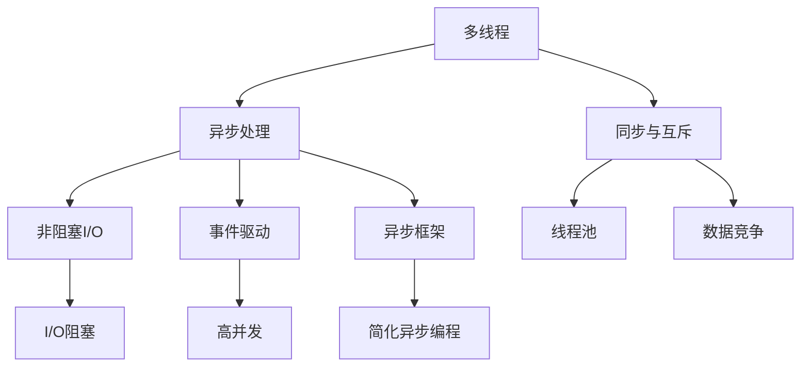

                 

# 并发编程：多线程与异步处理

> 关键词：并发编程,多线程,异步处理,同步与互斥,线程池,非阻塞I/O,事件驱动,异步框架

## 1. 背景介绍

### 1.1 问题由来
在软件开发中，面对庞大的数据量和复杂的业务逻辑，单线程的串行处理方式往往难以满足需求。特别是对于I/O密集型应用，由于I/O操作的阻塞，导致线程在等待I/O操作时处于空闲状态，浪费了大量的CPU资源。为了解决这个问题，并行计算和异步处理成为不可或缺的技术手段。

### 1.2 问题核心关键点
并行计算和异步处理技术的应用，极大地提升了程序的运行效率，但也带来了新的问题。如何有效地管理和调度线程，避免资源争用和数据竞争，成为并发编程的核心挑战。

## 2. 核心概念与联系

### 2.1 核心概念概述

为更好地理解并发编程中的多线程与异步处理，本节将介绍几个密切相关的核心概念：

- 多线程(Multithreading)：通过在单个进程中创建多个线程，使得每个线程能够独立执行任务，从而提高程序并发度和效率。

- 异步处理(Asynchronous Processing)：在等待I/O操作完成时，线程可以继续执行其他任务，避免了I/O阻塞，提高了系统的吞吐量。

- 同步与互斥(Synchronization and Mutual Exclusion)：在多线程并发执行时，为避免数据竞争和资源争用，需要通过同步机制协调线程间的执行顺序，实现互斥访问共享资源。

- 线程池(Thread Pool)：为减少线程创建和销毁的开销，将线程预先创建并维护在一个池中，需要时从池中取出使用，使用完毕后再放回池中。

- 非阻塞I/O(Non-blocking I/O)：通过使用非阻塞I/O技术，在等待I/O操作完成时，线程可以继续执行其他任务，避免I/O阻塞。

- 事件驱动(Event-Driven)：利用事件驱动模型，将任务和处理逻辑封装为事件，系统根据事件触发来执行相应处理，实现高并发处理。

- 异步框架(Asynchronous Framework)：通过框架化的方式封装异步处理的底层细节，简化异步编程的复杂度。

这些核心概念之间的逻辑关系可以通过以下Mermaid流程图来展示：



这个流程图展示了一个典型的并发编程系统，展示了多线程与异步处理的核心要素：

1. 多线程通过并发执行任务，提高了程序的运行效率。
2. 异步处理避免了I/O阻塞，进一步提升了系统的吞吐量。
3. 同步与互斥机制保障了线程间的安全，避免数据竞争。
4. 线程池管理了线程的生命周期，减少了资源消耗。
5. 非阻塞I/O技术进一步提升了系统的响应速度。
6. 事件驱动模型封装了复杂的异步处理逻辑，简化了编程。
7. 异步框架提供了高度抽象的异步处理接口，降低了异步编程的复杂度。

## 3. 核心算法原理 & 具体操作步骤

### 3.1 算法原理概述

并发编程中的多线程与异步处理，本质上是一种并行执行机制。通过将任务分解为多个子任务，并行执行，可以提高程序的执行效率，提升系统的吞吐量和响应速度。同时，利用异步处理，在等待I/O操作完成时，线程可以继续执行其他任务，进一步优化了资源利用率。

形式化地，假设一个任务可以分解为 $n$ 个子任务，每个子任务由一个线程独立执行。设每个子任务的执行时间为 $t$，线程之间的切换时间为 $s$，则总执行时间为 $n(t+s)$。而如果每个子任务独立并行执行，则总执行时间可优化为 $t$。同时，利用异步处理，可以将I/O操作与计算操作并行执行，进一步提升系统效率。

### 3.2 算法步骤详解

并发编程中的多线程与异步处理一般包括以下几个关键步骤：

**Step 1: 任务分解与划分**
- 将任务分解为多个子任务，并根据任务的特点，合理分配到多个线程或异步处理单元中。

**Step 2: 线程与异步单元创建**
- 创建线程或异步处理单元，进行必要的初始化，如设置任务队列、分配资源等。

**Step 3: 任务提交与执行**
- 将子任务提交给线程或异步处理单元执行，并等待执行结果。

**Step 4: 结果收集与处理**
- 将执行结果收集起来，进行必要的后处理工作，如合并结果、更新数据等。

**Step 5: 线程与异步单元销毁**
- 在线程或异步处理单元执行完毕后，释放其占用的资源，销毁线程或异步处理单元。

### 3.3 算法优缺点

并发编程中的多线程与异步处理具有以下优点：
1. 提高程序并发度，提升系统吞吐量和响应速度。
2. 利用异步处理避免I/O阻塞，进一步提升系统效率。
3. 线程池管理线程生命周期，减少资源消耗。
4. 同步与互斥机制保障线程安全，避免数据竞争。

同时，该方法也存在一定的局限性：
1. 并发编程复杂度高，需要设计合理的同步机制。
2. 资源争用和死锁问题难以避免，需谨慎处理。
3. 系统调试和故障排查困难，难以定位问题根源。
4. 异步处理逻辑复杂，容易出错。
5. 线程数量过多，可能导致系统资源耗尽。

尽管存在这些局限性，但就目前而言，多线程与异步处理仍是并发编程的主要范式。未来相关研究的重点在于如何进一步降低并发编程的复杂度，提高系统的可靠性和可维护性。

### 3.4 算法应用领域

基于多线程与异步处理的并发编程方法，在软件开发中得到了广泛的应用，覆盖了几乎所有常见场景，例如：

- 网络编程：通过多线程与异步处理，处理网络请求、连接、数据传输等操作。
- 数据库操作：通过多线程与异步处理，提高数据库查询、事务处理、连接管理等操作的并发度。
- 图形界面：通过多线程与异步处理，实现图形界面的响应、渲染、事件处理等功能。
- 游戏开发：通过多线程与异步处理，处理游戏逻辑、网络通信、图像渲染等操作。
- 大数据处理：通过多线程与异步处理，并行处理大数据集，提升数据处理速度和效率。
- 嵌入式系统：通过多线程与异步处理，实现实时任务调度、中断处理等功能。

除了上述这些经典场景外，并发编程的多线程与异步处理还广泛应用于工业控制、移动应用、物联网、人工智能等领域，为各种系统带来了更高效、更稳定的性能。

## 4. 数学模型和公式 & 详细讲解 & 举例说明

### 4.1 数学模型构建

本节将使用数学语言对并发编程中的多线程与异步处理过程进行更加严格的刻画。

假设系统中有 $N$ 个线程同时执行任务，每个线程执行任务的时间为 $t$，线程切换的时间为 $s$。设任务总数为 $M$，则总执行时间为 $T$。

定义任务队列为 $Q$，任务队列的长度为 $L$。每个线程从队列中取出任务，执行完毕后再将任务回传到队列中。定义任务的传递时间为 $p$，任务的执行时间为 $t$。

定义线程池的大小为 $P$，每个线程从池中获取资源，执行完毕后将资源归还到池中。定义线程的创建时间为 $c$，线程的销毁时间为 $d$。

系统总执行时间 $T$ 可表示为：

$$
T = M \times (t + s) + L \times p + P \times (c + d)
$$

### 4.2 公式推导过程

通过上述模型，可以推导出并行执行与异步处理的效果：

- 当 $t \ll s$ 时，任务执行时间远小于线程切换时间，多线程并发执行可以显著提升系统效率。
- 当 $p \ll t$ 时，任务传递时间远小于任务执行时间，异步处理可以进一步提升系统响应速度。
- 当 $P \geq M$ 时，线程池大小不小于任务数，线程池可以有效管理线程生命周期，减少资源消耗。

通过优化上述模型中的各项参数，可以进一步提升系统的效率和响应速度。

### 4.3 案例分析与讲解

以一个Web服务器为例，展示多线程与异步处理在处理请求时的具体效果：

- 假设有 $N=4$ 个线程同时处理请求，每个请求的响应时间为 $t=1$ 秒，线程切换时间为 $s=0.01$ 秒。
- 任务队列的长度 $L=10$，任务传递时间 $p=0.1$ 秒。
- 线程池的大小 $P=6$，线程的创建时间为 $c=0.1$ 秒，线程的销毁时间为 $d=0.01$ 秒。

根据上述模型，系统总执行时间为：

$$
T = M \times (1 + 0.01) + 10 \times 0.1 + 6 \times (0.1 + 0.01)
$$

其中 $M$ 为请求数。在 $M$ 一定的情况下，多线程并发执行和异步处理可以显著提升系统的响应速度和吞吐量。

## 5. 项目实践：代码实例和详细解释说明

### 5.1 开发环境搭建

在进行多线程与异步处理实践前，我们需要准备好开发环境。以下是使用Java进行多线程编程的环境配置流程：

1. 安装Java SDK：从官网下载并安装Java开发环境。

2. 创建Maven项目：使用Maven项目构建工具，初始化项目结构。

3. 安装依赖包：在pom.xml文件中添加多线程和异步处理相关的依赖包，如java.util.concurrent包等。

4. 编写测试代码：在src目录下创建测试类，编写多线程和异步处理相关的测试用例。

5. 编译和运行：使用Maven编译和运行测试代码，验证多线程和异步处理的效果。

完成上述步骤后，即可在Maven项目中开始多线程与异步处理实践。

### 5.2 源代码详细实现

这里我们以Java编写多线程与异步处理代码为例，展示如何使用多线程与异步处理实现并发任务处理。

首先，定义一个简单的任务类：

```java
class Task implements Runnable {
    private int id;
    private String name;
    
    public Task(int id, String name) {
        this.id = id;
        this.name = name;
    }
    
    @Override
    public void run() {
        System.out.println("Task " + id + " is running: " + name);
    }
}
```

然后，定义一个线程池类，使用Java的Executors框架创建固定大小的线程池：

```java
import java.util.concurrent.ExecutorService;
import java.util.concurrent.Executors;
import java.util.concurrent.TimeUnit;

public class ThreadPool {
    private static final int THREAD_COUNT = 4;
    private static final int TASK_COUNT = 10;
    private static final int WAIT_TIME = 1000;
    
    public static void main(String[] args) {
        ExecutorService executor = Executors.newFixedThreadPool(THREAD_COUNT);
        
        for (int i = 0; i < TASK_COUNT; i++) {
            Task task = new Task(i, "Task " + i);
            executor.submit(task);
        }
        
        try {
            TimeUnit.SECONDS.sleep(WAIT_TIME);
        } catch (InterruptedException e) {
            e.printStackTrace();
        }
        
        executor.shutdown();
        while (!executor.isTerminated()) {
            // 等待线程全部执行完毕
        }
    }
}
```

在上述代码中，我们使用Executors.newFixedThreadPool方法创建了一个大小为4的线程池，并将多个任务提交到线程池执行。在等待一定时间后，我们关闭线程池，并等待所有任务执行完毕。

可以看到，使用Java的Executor框架，可以非常方便地实现多线程并发执行任务，并且可以自动管理线程的生命周期。

### 5.3 代码解读与分析

让我们再详细解读一下关键代码的实现细节：

**Task类**：
- 定义了一个简单的任务类，实现了Runnable接口，重写了run方法，用于执行任务。

**ThreadPool类**：
- 使用Executors框架创建了一个大小为4的线程池，并将多个任务提交到线程池执行。
- 使用TimeUnit类等待一定时间，模拟任务执行时间。
- 使用shutdown方法关闭线程池，等待所有任务执行完毕。

**多线程并发执行**：
- 通过创建固定大小的线程池，将任务提交到线程池执行，从而实现了多线程并发执行任务。
- 线程池可以自动管理线程的生命周期，避免了线程创建和销毁的开销。
- 线程池的大小可以根据任务量和系统资源进行灵活调整，以优化资源利用率。

**异步处理**：
- 通过使用线程池和异步任务提交，可以进一步提升系统的并发处理能力。
- 异步任务可以等待I/O操作完成再执行，避免了I/O阻塞，提高了系统的响应速度。
- 异步任务提交可以使用Future对象进行跟踪，确保任务执行完毕后，可以进行进一步处理。

## 6. 实际应用场景

### 6.1 Web服务器

在Web服务器中，多线程与异步处理可以显著提升系统的响应速度和吞吐量。

一个典型的Web服务器可以使用多线程处理HTTP请求，利用异步处理处理连接和数据传输等操作。在每个连接上，可以使用一个线程处理请求，在等待I/O操作完成时，线程可以继续处理其他请求。

通过多线程与异步处理，Web服务器可以同时处理大量的并发连接请求，提升系统的响应速度和并发处理能力。

### 6.2 数据库连接池

在数据库连接池中，多线程与异步处理可以有效地管理数据库连接资源，避免连接争用和资源泄漏。

一个典型的数据库连接池使用多线程与异步处理管理数据库连接。线程池负责维护数据库连接，每个线程负责创建和管理数据库连接，异步处理操作在等待数据库操作完成时，可以继续执行其他任务。

通过多线程与异步处理，数据库连接池可以高效地管理数据库连接资源，避免连接争用和资源泄漏，提升系统的响应速度和并发处理能力。

### 6.3 图形界面应用

在图形界面应用中，多线程与异步处理可以实现图形界面的响应、渲染、事件处理等功能。

一个典型的图形界面应用使用多线程与异步处理管理UI线程和渲染线程。UI线程负责处理用户界面事件，渲染线程负责绘制图形界面。异步处理用于处理UI线程和渲染线程之间的通信。

通过多线程与异步处理，图形界面应用可以实现流畅的响应和渲染，提升用户体验。

### 6.4 未来应用展望

随着多线程与异步处理技术的不断发展，其在更多领域得到了应用，为系统带来了变革性影响。

在智慧医疗领域，基于多线程与异步处理的网络应用，可以实时监控患者数据，快速响应医疗请求，提升医疗服务的智能化水平。

在智能交通领域，基于多线程与异步处理的车联网应用，可以实现车辆之间的实时通信，提升交通管理的安全性和效率。

在智能制造领域，基于多线程与异步处理的生产线系统，可以实现实时监控和控制，提升生产效率和产品质量。

此外，在金融、教育、电子商务、物联网等众多领域，基于多线程与异步处理的人工智能应用也将不断涌现，为各行业带来新的突破。

## 7. 工具和资源推荐
### 7.1 学习资源推荐

为了帮助开发者系统掌握多线程与异步处理的技术基础和实践技巧，这里推荐一些优质的学习资源：

1. Java并发编程实战：刘新宇、施小平合著，详细介绍了Java多线程编程的实践技巧和常见问题。

2. 并发编程的艺术：Brett McLaughlin著，深入浅出地介绍了多线程与异步处理的原理和最佳实践。

3. Python并发编程指南：张俊、陈晓著，介绍了Python多线程、异步编程和网络编程的实践技巧。

4. Java并发编程：Zhonggao Wo著，详细介绍了Java多线程编程的基础知识和实践技巧。

5. C++并发编程：刘云峰著，介绍了C++11标准库中多线程编程的实践技巧和常见问题。

6. 并发编程之道：Cormen、Leiserson等合著，介绍了多线程与异步处理的理论基础和实践技巧。

通过对这些资源的学习实践，相信你一定能够快速掌握多线程与异步处理的精髓，并用于解决实际的并发编程问题。

### 7.2 开发工具推荐

高效的开发离不开优秀的工具支持。以下是几款用于多线程与异步处理开发的常用工具：

1. Eclipse：Java开发环境，支持多线程与异步处理编程，并提供了可视化调试工具。

2. Visual Studio：Microsoft推出的IDE工具，支持多线程与异步处理编程，并提供了丰富的开发工具。

3. NetBeans：Java开发环境，支持多线程与异步处理编程，并提供了可视化调试工具。

4. IntelliJ IDEA：JetBrains推出的IDE工具，支持多线程与异步处理编程，并提供了丰富的开发工具。

5. ThreadPoolExecutor：Java提供的线程池实现，支持固定大小的线程池管理，简化多线程编程。

6. CompletableFuture：Java提供的异步处理框架，支持链式调用和异常处理，简化异步编程。

7. Thread类和ThreadPool类：Java提供的线程类，支持线程的创建和管理，简化多线程编程。

合理利用这些工具，可以显著提升多线程与异步处理任务的开发效率，加快创新迭代的步伐。

### 7.3 相关论文推荐

多线程与异步处理技术的发展源于学界的持续研究。以下是几篇奠基性的相关论文，推荐阅读：

1. The Free Lunch and Concurrency in Object-Oriented Programming（Ghemawat、Sharp、Shenker论文）：介绍了多线程编程的原理和最佳实践，奠定了多线程编程的理论基础。

2. Prefetching Mechanisms for Parallelism（Hollerich、Weiss论文）：介绍了多线程编程中的缓存机制，提升了多线程编程的效率和可维护性。

3. High-Performance Multithreaded Server Programs（Dietrich、Fischer论文）：介绍了多线程编程在服务器中的应用，提升了服务器并发处理能力。

4. The Java Virtual Machine Specification（Java规范）：详细介绍了Java多线程编程的规范和实现，是Java多线程编程的重要参考资料。

5. A Survey of Asynchronous and Concurrent Programming Models（Thachuk论文）：介绍了异步编程和并发编程的原理和实现，为异步编程提供了理论指导。

6. Concurrent and Parallel Programming with Java 8（Smith、Eike论文）：介绍了Java 8中多线程和并发编程的实践技巧和最佳实践，提升了Java多线程编程的效率和可维护性。

这些论文代表了大线程与异步处理技术的发展脉络。通过学习这些前沿成果，可以帮助研究者把握学科前进方向，激发更多的创新灵感。

## 8. 总结：未来发展趋势与挑战

### 8.1 总结

本文对并发编程中的多线程与异步处理技术进行了全面系统的介绍。首先阐述了多线程与异步处理技术的研究背景和意义，明确了多线程与异步处理在提升系统性能和响应速度方面的独特价值。其次，从原理到实践，详细讲解了多线程与异步处理的数学原理和关键步骤，给出了多线程与异步处理任务开发的完整代码实例。同时，本文还广泛探讨了多线程与异步处理在Web服务器、数据库连接池、图形界面应用等多个领域的应用前景，展示了多线程与异步处理范式的巨大潜力。

通过本文的系统梳理，可以看到，多线程与异步处理技术已经成为并发编程的重要范式，极大地提升了系统的并发处理能力和响应速度。面向未来，多线程与异步处理技术还需要与其他并发编程技术进行更深入的融合，如死锁检测、资源争用检测、锁优化等，多路径协同发力，共同推动并发编程技术的进步。只有勇于创新、敢于突破，才能不断拓展并发编程的边界，让并发编程技术更好地服务于实际应用。

### 8.2 未来发展趋势

展望未来，多线程与异步处理技术将呈现以下几个发展趋势：

1. 并发编程范式多样性：除了传统的多线程和异步处理范式外，未来的并发编程将更多地采用事件驱动、响应式编程等新范式，提升编程效率和系统响应速度。

2. 分布式并发处理：随着分布式计算技术的不断发展，未来的并发处理将越来越多地采用分布式架构，提高系统的并发处理能力和资源利用率。

3. 内存计算与分布式存储：未来并发处理将越来越多地利用内存计算和分布式存储技术，提高系统的处理能力和数据访问效率。

4. 实时流处理：未来的并发处理将越来越多地处理实时数据流，如Kafka、Flink等实时流处理框架将广泛应用于各行业。

5. 微服务架构：未来的并发处理将越来越多地采用微服务架构，通过服务化封装，提高系统的可维护性和扩展性。

以上趋势凸显了并发编程技术的广阔前景。这些方向的探索发展，必将进一步提升系统的性能和响应速度，为各行各业带来新的变革。

### 8.3 面临的挑战

尽管多线程与异步处理技术已经取得了瞩目成就，但在迈向更加智能化、普适化应用的过程中，它仍面临诸多挑战：

1. 并发编程复杂度高，需要设计合理的同步机制，避免死锁和数据竞争。
2. 资源争用和死锁问题难以避免，需谨慎处理，避免系统崩溃。
3. 系统调试和故障排查困难，难以定位问题根源，需投入大量人力和时间。
4. 异步处理逻辑复杂，容易出错，需进行全面的测试和验证。
5. 线程数量过多，可能导致系统资源耗尽，需进行有效的资源管理。

尽管存在这些挑战，但就目前而言，多线程与异步处理仍是并发编程的主要范式。未来相关研究的重点在于如何进一步降低并发编程的复杂度，提高系统的可靠性和可维护性。

### 8.4 研究展望

面对多线程与异步处理面临的种种挑战，未来的研究需要在以下几个方面寻求新的突破：

1. 探索并发编程的新范式。引入事件驱动、响应式编程等新范式，提升并发编程的效率和可维护性。

2. 研究分布式并发处理技术。采用分布式架构，提高系统的并发处理能力和资源利用率。

3. 引入内存计算和分布式存储技术。利用内存计算和分布式存储技术，提升系统的处理能力和数据访问效率。

4. 研究实时流处理技术。采用实时流处理框架，处理实时数据流，提升系统的实时处理能力。

5. 引入微服务架构。采用微服务架构，提高系统的可维护性和扩展性。

这些研究方向的探索，必将引领并发编程技术迈向更高的台阶，为构建安全、可靠、可扩展的并发系统铺平道路。面向未来，多线程与异步处理技术还需要与其他并发编程技术进行更深入的融合，如死锁检测、资源争用检测、锁优化等，多路径协同发力，共同推动并发编程技术的进步。只有勇于创新、敢于突破，才能不断拓展并发编程的边界，让并发编程技术更好地服务于实际应用。

## 9. 附录：常见问题与解答

**Q1：多线程与异步处理技术是否适用于所有场景？**

A: 多线程与异步处理技术适用于大多数I/O密集型应用场景，如网络编程、数据库操作、图形界面应用等。但对于CPU密集型应用场景，如图像处理、数学计算等，使用多线程与异步处理反而会降低系统性能。因此需要根据具体场景选择合适的技术手段。

**Q2：多线程与异步处理技术是否会带来线程安全问题？**

A: 多线程与异步处理技术本身并不带来线程安全问题，但在使用多线程与异步处理时，需要注意同步机制的设计，避免数据竞争和资源争用。常见的方法包括使用锁、使用原子类、使用并发集合等。

**Q3：多线程与异步处理技术是否会导致性能问题？**

A: 多线程与异步处理技术可以显著提升系统性能，但同时也带来了新的性能问题。如线程创建和销毁的开销、线程切换的时间等，都会影响系统的性能。因此需要根据具体场景进行优化，如使用线程池、使用非阻塞I/O等。

**Q4：多线程与异步处理技术是否会导致调试困难？**

A: 多线程与异步处理技术的复杂性确实带来了调试困难的问题，但可以使用调试工具进行跟踪和调试，如jstack、jconsole等。同时，合理的设计和测试策略，也可以减少调试的难度和复杂度。

**Q5：多线程与异步处理技术是否会导致系统崩溃？**

A: 多线程与异步处理技术本身不会导致系统崩溃，但需要注意死锁、资源争用等问题，避免系统崩溃。常见的死锁检测工具包括ThreadDump、ThreadWatchdog等，可以帮助发现和解决死锁问题。

综上所述，多线程与异步处理技术是提升系统性能和响应速度的重要手段，但也需要开发者仔细设计和测试，才能发挥其最大价值。

