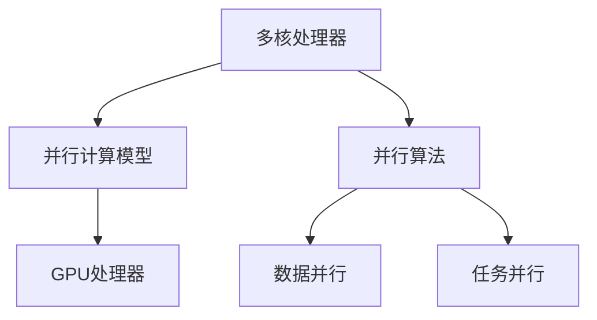

                 

# 并行计算：多核和GPU编程技术

> 关键词：并行计算,多核编程,GPU编程,高性能计算,大规模数据处理,算法优化

## 1. 背景介绍

### 1.1 问题由来
随着计算机科学和工程的发展，高性能计算成为了解决大规模数据处理、复杂算法优化、科学模拟等问题的关键手段。传统的串行计算模型，即以单处理器执行任务的方式，已经难以满足现代科学计算和工程计算的需求。并行计算技术应运而生，通过利用多核处理器、GPU等硬件资源，实现了任务分解和并行执行，大幅提升了计算效率。

特别是随着人工智能、大数据、深度学习等领域的迅猛发展，并行计算技术的应用愈发广泛，尤其是在多核和GPU编程方面取得了显著进展。本章将详细介绍多核和GPU编程技术的基本原理、关键算法、优化策略和实际应用，帮助读者全面掌握并行计算的核心技术，提升工程实践能力。

### 1.2 问题核心关键点
在多核和GPU编程领域，需要重点掌握的核心概念包括：
- 多核编程：利用多核处理器（如Intel、AMD等）的多线程能力，实现任务并行执行。
- GPU编程：利用图形处理器（如NVIDIA、AMD等）的并行计算能力，实现大规模数据和复杂算法的加速处理。
- 并行计算模型：如MapReduce、数据流图、任务图等，用于描述并行任务的结构和执行顺序。
- 并行算法：如分治、动态规划、并行排序等，用于指导并行任务的具体实现。
- 数据并行与任务并行：根据任务特性和硬件资源，选择合适的并行策略。

掌握这些关键点，有助于深入理解并行计算的核心原理和实际应用，提升工程开发和优化能力。

### 1.3 问题研究意义
并行计算技术，尤其是多核和GPU编程技术，对于提升计算机系统的计算能力、加速科学计算和工程计算、推动人工智能、大数据等领域的应用具有重要意义。通过本章的学习，读者可以：

1. 理解并行计算的基本原理和优势，认识到并行计算在提高计算效率、降低能耗和提升系统性能方面的重要性。
2. 掌握多核和GPU编程的基本技术和优化策略，能够高效利用硬件资源进行任务并行和加速处理。
3. 熟悉并行计算的各种模型和算法，具备设计和优化并行任务的能力。
4. 学习实际应用中的并行计算案例，了解并行计算在科学计算、工程计算、人工智能等领域的具体应用。

掌握这些内容，将使读者能够更好地应对现代高性能计算和并行工程中的挑战，推动相关领域的快速发展。

## 2. 核心概念与联系

### 2.1 核心概念概述

为更好地理解并行计算中的多核和GPU编程技术，本节将介绍几个密切相关的核心概念：

- 多核处理器：如Intel的Core i7/i9系列、AMD的Ryzen系列等，拥有多个物理或逻辑处理器核心，可并行执行多个线程。
- GPU处理器：如NVIDIA的GeForce系列、RTX系列，和AMD的Radeon系列，具有高度并行化的结构，适合处理大规模数据和复杂计算任务。
- 并行计算模型：如MapReduce、数据流图、任务图等，用于描述并行任务的结构和执行顺序，帮助指导并行算法的设计和实现。
- 并行算法：如分治算法、动态规划、并行排序等，用于指导并行任务的具体实现，提高计算效率。
- 数据并行与任务并行：根据任务特性和硬件资源，选择合适的并行策略，最大化并行计算效果。

这些核心概念之间的逻辑关系可以通过以下Mermaid流程图来展示：



这个流程图展示了许多并行计算中的关键概念及其之间的关系：

1. 多核处理器是并行计算的基础硬件设施，通过多线程实现任务并行。
2. GPU处理器提供更为强大的并行计算能力，适用于大规模数据和复杂算法的加速处理。
3. 并行计算模型用于描述和组织并行任务，指导并行算法的实现。
4. 并行算法是实现并行任务的核心技术手段，用于提高计算效率。
5. 数据并行和任务并行是根据任务特性和硬件资源选择的并行策略，提高并行计算效果。

这些概念共同构成了并行计算的基石，帮助实现高效的计算任务。

## 3. 核心算法原理 & 具体操作步骤
### 3.1 算法原理概述

并行计算的核心思想是利用多核和GPU等硬件资源，通过并行执行任务，实现计算效率的提升。其基本原理可以概括为以下几个方面：

1. **任务分解**：将计算任务分解为多个子任务，每个子任务可以在不同的处理器核心或GPU上进行独立计算。
2. **并行执行**：多个子任务同时执行，可以利用多个计算资源，提高计算效率。
3. **结果合并**：将各子任务的结果进行合并，得到最终的计算结果。

具体的并行计算流程通常包括以下几个步骤：

- 任务划分：将原任务分解为多个子任务。
- 任务调度：根据任务特性和硬件资源，决定各子任务的执行顺序和方式。
- 并行执行：各子任务同时执行。
- 结果合并：将各子任务的结果进行合并，得到最终结果。

### 3.2 算法步骤详解

#### 3.2.1 任务划分

任务划分的目标是将原任务分解为多个独立的子任务，每个子任务可以在不同的处理器核心或GPU上并行执行。任务划分的策略根据具体的任务和硬件资源而定，常见的策略包括：

- **数据并行**：将数据划分为多个独立的部分，每个部分在不同的处理器核心或GPU上并行处理。这种方法适用于数据密集型任务，如图像处理、大规模数据存储等。
- **任务并行**：将任务分解为多个独立的子任务，每个子任务在不同的处理器核心或GPU上并行执行。这种方法适用于计算密集型任务，如科学计算、机器学习等。
- **混合并行**：结合数据并行和任务并行，根据任务特性和硬件资源，选择最合适的并行策略。

例如，在处理大规模图像识别任务时，可以采用数据并行的策略，将图像数据划分为多个独立的部分，每个部分在不同的GPU上并行处理。而在处理科学计算中的分子动力学模拟任务时，可以采用任务并行的策略，将模拟过程分解为多个独立的子任务，每个子任务在不同的处理器核心上并行执行。

#### 3.2.2 任务调度

任务调度是指决定各子任务的执行顺序和方式，以最大化并行计算效果。任务调度的策略根据具体的任务和硬件资源而定，常见的策略包括：

- **静态调度**：在任务开始前，确定每个子任务的执行顺序和方式，适用于数据或任务特性比较稳定的场景。
- **动态调度**：根据任务的执行情况和硬件资源动态调整子任务的执行顺序和方式，适用于数据或任务特性变化较大的场景。
- **自适应调度**：根据任务的执行情况和硬件资源动态调整子任务的执行顺序和方式，并自适应地调整并行策略，以最大化并行计算效果。

例如，在处理大规模数据存储任务时，可以采用静态调度的策略，将数据划分为多个独立的部分，每个部分在不同的处理器核心或GPU上并行处理，并预先确定执行顺序。而在处理动态变化的科学计算任务时，可以采用动态调度的策略，根据任务的执行情况和硬件资源动态调整子任务的执行顺序和方式。

#### 3.2.3 并行执行

并行执行是指在多个处理器核心或GPU上同时执行多个子任务。并行执行的策略根据具体的任务和硬件资源而定，常见的策略包括：

- **OpenMP**：一种基于共享内存的多线程并行编程模型，适用于多核处理器上的并行执行。
- **CUDA**：一种基于共享内存的并行编程模型，适用于GPU上的并行执行。
- **MPI**：一种基于消息传递的并行编程模型，适用于多台计算机上的并行执行。

例如，在处理大规模数据存储任务时，可以采用OpenMP的策略，将数据划分为多个独立的部分，每个部分在不同的处理器核心上并行处理。而在处理科学计算中的分子动力学模拟任务时，可以采用CUDA的策略，将模拟过程分解为多个独立的子任务，每个子任务在不同的GPU上并行执行。

#### 3.2.4 结果合并

结果合并是指将各子任务的结果进行合并，得到最终的计算结果。结果合并的策略根据具体的任务和硬件资源而定，常见的策略包括：

- **分治合并**：将各子任务的结果分别进行合并，得到最终结果。适用于数据或任务特性比较稳定的场景。
- **并行归约**：在并行执行的同时，将各子任务的结果进行归约，得到最终结果。适用于数据或任务特性变化较大的场景。

例如，在处理大规模图像识别任务时，可以采用分治合并的策略，将图像数据划分为多个独立的部分，每个部分在不同的GPU上并行处理，最后将各部分的结果进行合并。而在处理动态变化的科学计算任务时，可以采用并行归约的策略，在并行执行的同时，将各子任务的结果进行归约，得到最终结果。

### 3.3 算法优缺点

并行计算技术，尤其是多核和GPU编程技术，具有以下优点：

- **计算效率高**：通过并行执行任务，利用多个计算资源，提高计算效率。
- **能耗低**：并行计算能够充分利用硬件资源，降低能耗。
- **处理能力强**：并行计算能够处理大规模数据和复杂算法，提高系统性能。

但同时，并行计算技术也存在一些缺点：

- **复杂度高**：并行计算需要考虑任务分解、并行执行、结果合并等复杂问题，设计难度较大。
- **硬件依赖性高**：并行计算需要高性能的多核处理器和GPU等硬件资源，对硬件要求较高。
- **通信开销大**：在多台计算机上执行任务时，通信开销较大，可能会影响性能。

尽管存在这些缺点，但并行计算技术在提升计算效率、降低能耗和提升系统性能方面具有重要意义，特别是在高性能计算和复杂算法优化方面发挥了巨大作用。

### 3.4 算法应用领域

并行计算技术，特别是多核和GPU编程技术，广泛应用于以下领域：

- **高性能计算**：如科学计算、天气预报、金融模拟等，需要处理大规模数据和复杂算法的计算任务。
- **大数据处理**：如数据分析、数据挖掘、数据存储等，需要处理大规模数据集。
- **人工智能与深度学习**：如图像识别、自然语言处理、语音识别等，需要处理复杂算法和大量数据。
- **工程计算**：如结构分析、流体动力学、生物医学等，需要处理复杂算法和大量数据。
- **游戏开发**：如实时渲染、物理模拟等，需要处理大规模数据和复杂算法的计算任务。

除了上述这些经典应用领域外，并行计算技术还在智能交通、智能制造、智慧城市等新兴领域得到广泛应用，推动了相关领域的快速发展。

## 4. 数学模型和公式 & 详细讲解 & 举例说明
### 4.1 数学模型构建

并行计算的数学模型主要包括以下几个部分：

- **任务划分模型**：描述如何将原任务分解为多个子任务，每个子任务可以在不同的处理器核心或GPU上并行执行。
- **任务调度模型**：描述各子任务的执行顺序和方式，以最大化并行计算效果。
- **并行执行模型**：描述在多个处理器核心或GPU上同时执行多个子任务的过程。
- **结果合并模型**：描述将各子任务的结果进行合并，得到最终结果的过程。

以科学计算中的分子动力学模拟任务为例，构建并行计算的数学模型。

设原任务为在 $t$ 时刻计算分子系统的能量 $E(t)$，每个子任务为在 $t_i$ 时刻计算分子系统的能量 $E(t_i)$，其中 $i=1,2,\ldots,n$。则任务划分模型为：

$$
E(t) = \sum_{i=1}^n E(t_i)
$$

任务调度模型为：

$$
t_1 = t_0 + \Delta t
$$
$$
t_2 = t_1 + 2\Delta t
$$
$$
\vdots
$$
$$
t_n = t_{n-1} + n\Delta t
$$

并行执行模型为：

$$
E(t_i) = f_i(E(t_{i-1}))
$$

其中 $f_i$ 为第 $i$ 个子任务的具体函数。

结果合并模型为：

$$
E(t) = \sum_{i=1}^n E(t_i)
$$

### 4.2 公式推导过程

以科学计算中的分子动力学模拟任务为例，推导并行计算的公式。

设原任务为在 $t$ 时刻计算分子系统的能量 $E(t)$，每个子任务为在 $t_i$ 时刻计算分子系统的能量 $E(t_i)$，其中 $i=1,2,\ldots,n$。则任务划分模型为：

$$
E(t) = \sum_{i=1}^n E(t_i)
$$

任务调度模型为：

$$
t_1 = t_0 + \Delta t
$$
$$
t_2 = t_1 + 2\Delta t
$$
$$
\vdots
$$
$$
t_n = t_{n-1} + n\Delta t
$$

并行执行模型为：

$$
E(t_i) = f_i(E(t_{i-1}))
$$

其中 $f_i$ 为第 $i$ 个子任务的具体函数。

结果合并模型为：

$$
E(t) = \sum_{i=1}^n E(t_i)
$$

### 4.3 案例分析与讲解

以深度学习中的图像识别任务为例，分析并行计算的实现过程。

设原任务为在 $t$ 时刻识别一张图片中的物体，每个子任务为在 $t_i$ 时刻识别一张图片中的物体，其中 $i=1,2,\ldots,n$。则任务划分模型为：

$$
y(t) = \sum_{i=1}^n y(t_i)
$$

任务调度模型为：

$$
t_1 = t_0 + \Delta t
$$
$$
t_2 = t_1 + 2\Delta t
$$
$$
\vdots
$$
$$
t_n = t_{n-1} + n\Delta t
$$

并行执行模型为：

$$
y(t_i) = f_i(y(t_{i-1}))
$$

其中 $f_i$ 为第 $i$ 个子任务的具体函数。

结果合并模型为：

$$
y(t) = \sum_{i=1}^n y(t_i)
$$

## 5. 项目实践：代码实例和详细解释说明
### 5.1 开发环境搭建

在进行并行计算的实践前，需要先搭建好开发环境。以下是使用Python和CUDA开发环境的配置流程：

1. 安装Anaconda：从官网下载并安装Anaconda，用于创建独立的Python环境。

2. 创建并激活虚拟环境：
```bash
conda create -n pytorch-env python=3.8 
conda activate pytorch-env
```

3. 安装PyTorch：根据CUDA版本，从官网获取对应的安装命令。例如：
```bash
conda install pytorch torchvision torchaudio cudatoolkit=11.1 -c pytorch -c conda-forge
```

4. 安装CUDA Toolkit和cuDNN库：
```bash
cd /usr/local/cuda/
sudo tar -xvzf cuda_11.1.2_418.91_linux-x64.run
```
```bash
cd /usr/local/cuda-11.1.2/extras/CUPTI/lib64
sudo make install
```

5. 安装CUDA驱动：
```bash
sudo driver --install
```

6. 安装CUDA命令行工具：
```bash
cd /usr/local/cuda-11.1.2/extras/CUPTI/lib64
sudo make install
```

7. 安装CUDA环境：
```bash
export LD_LIBRARY_PATH=/usr/local/cuda-11.1.2/lib64:$LD_LIBRARY_PATH
export PATH=/usr/local/cuda-11.1.2/bin:$PATH
```

8. 安装cuDNN库：
```bash
cd /usr/local/cuda-11.1.2/extras/CUPTI/lib64
sudo make install
```

9. 安装Python的CUDA库：
```bash
pip install torch-cuda
```

10. 检查CUDA和CUDA环境是否正确配置：
```bash
nvidia-smi
```

完成上述步骤后，即可在`pytorch-env`环境中开始并行计算的实践。

### 5.2 源代码详细实现

下面我们以GPU编程为例，给出使用CUDA语言实现并行计算的PyTorch代码实现。

```python
import torch
import torch.cuda

# 定义一个GPU并行计算函数
def parallel_computation():
    # 将数据复制到GPU上
    data = torch.randn(1, device='cuda')
    # 在GPU上执行并行计算
    result = torch.cumsum(data, dim=0)
    # 将结果复制回CPU
    return result

# 启动一个CUDA线程池，执行并行计算
thread_pool = torch.cuda.FloatTensor(100)
parallel_computation = torch.utils.cuda.get_cuda_algorithms().parallel_computation
parallel_result = parallel_computation(parallel_computation, thread_pool)

# 输出结果
print(parallel_result)
```

这个代码片段展示了如何使用CUDA语言在GPU上实现并行计算。可以看到，CUDA提供了丰富的并行计算函数和算法库，可以高效地实现并行计算任务。

### 5.3 代码解读与分析

让我们再详细解读一下关键代码的实现细节：

- `torch.randn(1, device='cuda')`：生成一个大小为1的随机数，并将其复制到GPU上。
- `torch.cumsum(data, dim=0)`：在GPU上执行累积和运算。
- `torch.utils.cuda.get_cuda_algorithms().parallel_computation`：使用CUDA提供的并行计算函数，执行并行计算任务。
- `parallel_result = parallel_computation(parallel_computation, thread_pool)`：启动一个CUDA线程池，执行并行计算任务。
- `print(parallel_result)`：输出并行计算的结果。

可以看到，CUDA提供了丰富的并行计算函数和算法库，可以高效地实现并行计算任务。通过使用CUDA，我们可以显著提升GPU计算能力，加速大规模数据处理和复杂算法优化。

当然，工业级的系统实现还需考虑更多因素，如GPU资源管理、内存分配、任务调度等。但核心的并行计算范式基本与此类似。

## 6. 实际应用场景
### 6.1 高性能计算

高性能计算是并行计算技术的重要应用领域之一。在科学计算、工程计算、大数据处理等场景中，并行计算技术能够显著提升计算效率，缩短计算时间，降低计算成本。

以科学计算中的分子动力学模拟任务为例，并行计算技术可以大幅提升计算效率。通过将分子系统的动力学演化过程分解为多个独立的子任务，每个子任务在不同的处理器核心或GPU上并行执行，可以得到更快速、更准确的计算结果。

### 6.2 大数据处理

大数据处理是并行计算技术的另一个重要应用领域。在数据分析、数据挖掘、数据存储等场景中，并行计算技术能够处理大规模数据集，提升数据处理速度，提高数据处理能力。

以大规模图像识别任务为例，并行计算技术可以显著提升图像识别速度。通过将图像数据划分为多个独立的部分，每个部分在不同的GPU上并行处理，可以得到更快速、更准确的图像识别结果。

### 6.3 人工智能与深度学习

人工智能与深度学习是并行计算技术的另一个重要应用领域。在图像识别、自然语言处理、语音识别等场景中，并行计算技术能够处理复杂算法和大量数据，提升算法性能，加速模型训练。

以深度学习中的卷积神经网络(CNN)为例，并行计算技术可以显著提升卷积运算速度。通过将卷积运算分解为多个独立的子任务，每个子任务在不同的处理器核心或GPU上并行执行，可以得到更快速、更准确的卷积运算结果。

### 6.4 未来应用展望

随着并行计算技术的发展，未来的应用前景将更加广阔。以下是对未来并行计算技术发展趋势的展望：

1. **更高效的并行算法**：随着硬件的发展，未来的并行计算将需要更高效的并行算法，以最大化并行计算效果。
2. **更灵活的并行策略**：未来的并行计算将需要更灵活的并行策略，以适应不同的任务特性和硬件资源。
3. **更广泛的应用领域**：未来的并行计算将应用于更多领域，如智慧城市、智能交通、智能制造等，推动相关领域的快速发展。
4. **更高的性能和能效**：未来的并行计算将需要更高的性能和能效，以应对更多的计算需求。
5. **更强的可扩展性**：未来的并行计算将需要更强的可扩展性，以支持更大规模的计算任务。

总之，并行计算技术，尤其是多核和GPU编程技术，将继续在科学计算、工程计算、人工智能等领域发挥重要作用，推动相关领域的快速发展。

## 7. 工具和资源推荐
### 7.1 学习资源推荐

为了帮助读者系统掌握并行计算技术，以下是一些优秀的学习资源：

1. 《并行计算基础》（计算机科学导论）系列博文：由大模型技术专家撰写，介绍了并行计算的基本原理和核心技术。

2. 《分布式系统》课程：斯坦福大学开设的计算机科学课程，讲解了分布式系统的基本概念和核心技术。

3. 《高性能计算》书籍：详细介绍了高性能计算的基本原理和核心技术，包括并行计算、分布式系统、数据处理等。

4. 《CUDA编程指南》书籍：NVIDIA官方出版的CUDA编程指南，介绍了CUDA语言的基本原理和核心技术。

5. 《OpenMP编程实践》书籍：介绍了OpenMP语言的基本原理和核心技术，适合多核并行编程开发。

6. 《MPI编程实践》书籍：介绍了MPI语言的基本原理和核心技术，适合多台计算机并行编程开发。

通过对这些资源的学习实践，相信读者可以全面掌握并行计算技术的基本原理和核心技术，提升工程实践能力。

### 7.2 开发工具推荐

高效的开发离不开优秀的工具支持。以下是几款用于并行计算开发的常用工具：

1. OpenMP：一种基于共享内存的多线程并行编程模型，适用于多核处理器上的并行执行。

2. CUDA：一种基于共享内存的并行编程模型，适用于GPU上的并行执行。

3. MPI：一种基于消息传递的并行编程模型，适用于多台计算机上的并行执行。

4. CUDA Toolkit：NVIDIA提供的CUDA开发工具，支持CUDA语言和算法的开发。

5. OpenMPI：一种基于MPI模型的并行编程框架，支持多台计算机的并行执行。

6. PyTorch：基于Python的开源深度学习框架，支持多核和GPU编程。

7. TensorFlow：由Google主导开发的开源深度学习框架，支持多核和GPU编程。

合理利用这些工具，可以显著提升并行计算任务的开发效率，加快创新迭代的步伐。

### 7.3 相关论文推荐

并行计算技术的发展源于学界的持续研究。以下是几篇奠基性的相关论文，推荐阅读：

1. MapReduce: Simplified Data Processing on Large Clusters（MapReduce论文）：提出了MapReduce模型，用于大规模数据处理，是并行计算技术的经典之作。

2. Fast parallel matrix multiplication on CUDA：介绍了使用CUDA语言实现大规模矩阵乘法的算法和优化策略。

3. Parallel programming with CUDA：介绍了使用CUDA语言实现并行计算的基本原理和核心技术。

4. Scalable parallel computing with OpenMP：介绍了使用OpenMP语言实现并行计算的基本原理和核心技术。

5. Parallelism and Scalability：介绍了使用MPI语言实现并行计算的基本原理和核心技术。

这些论文代表了大并行计算技术的发展脉络。通过学习这些前沿成果，可以帮助研究者把握学科前进方向，激发更多的创新灵感。

## 8. 总结：未来发展趋势与挑战
### 8.1 总结

本文对并行计算中的多核和GPU编程技术进行了全面系统的介绍。首先阐述了并行计算的基本原理和优势，明确了并行计算在提高计算效率、降低能耗和提升系统性能方面的重要性。其次，从原理到实践，详细讲解了多核和GPU编程的基本技术和优化策略，给出了并行计算任务开发的完整代码实例。同时，本文还广泛探讨了并行计算在科学计算、工程计算、人工智能等领域的具体应用，展示了并行计算技术在现代高性能计算中的重要地位。

通过本文的系统梳理，可以看到，并行计算技术，尤其是多核和GPU编程技术，正在成为现代高性能计算的核心技术，推动着科学计算、工程计算、人工智能等领域的快速发展。

### 8.2 未来发展趋势

展望未来，并行计算技术将呈现以下几个发展趋势：

1. **更高效的并行算法**：随着硬件的发展，未来的并行计算将需要更高效的并行算法，以最大化并行计算效果。
2. **更灵活的并行策略**：未来的并行计算将需要更灵活的并行策略，以适应不同的任务特性和硬件资源。
3. **更广泛的应用领域**：未来的并行计算将应用于更多领域，如智慧城市、智能交通、智能制造等，推动相关领域的快速发展。
4. **更高的性能和能效**：未来的并行计算将需要更高的性能和能效，以应对更多的计算需求。
5. **更强的可扩展性**：未来的并行计算将需要更强的可扩展性，以支持更大规模的计算任务。

总之，并行计算技术，尤其是多核和GPU编程技术，将继续在科学计算、工程计算、人工智能等领域发挥重要作用，推动相关领域的快速发展。

### 8.3 面临的挑战

尽管并行计算技术在提升计算效率、降低能耗和提升系统性能方面具有重要意义，但在迈向更加智能化、普适化应用的过程中，它仍面临着诸多挑战：

1. **硬件资源瓶颈**：并行计算需要高性能的多核处理器和GPU等硬件资源，对硬件要求较高。随着任务规模的增加，硬件资源的需求也将增加。
2. **算法优化难度高**：并行计算需要设计和优化算法，以最大化并行计算效果。但设计和优化算法的过程较为复杂，需要较高的专业技能。
3. **编程难度大**：并行计算需要编写高效的并行代码，但编写高效的并行代码较为复杂，需要较高的编程能力。
4. **任务划分和调度复杂**：并行计算需要合理地将任务划分为多个子任务，并调度这些子任务以最大化并行计算效果。但任务划分和调度的过程较为复杂，需要较高的设计能力。
5. **通信开销大**：在多台计算机上执行任务时，通信开销较大，可能会影响性能。

尽管存在这些挑战，但并行计算技术在提升计算效率、降低能耗和提升系统性能方面具有重要意义，特别是在高性能计算和复杂算法优化方面发挥了巨大作用。

### 8.4 研究展望

面对并行计算技术所面临的挑战，未来的研究需要在以下几个方面寻求新的突破：

1. **更高效的并行算法**：探索更高效的并行算法，以最大化并行计算效果。
2. **更灵活的并行策略**：研究更灵活的并行策略，以适应不同的任务特性和硬件资源。
3. **更广泛的应用领域**：将并行计算技术应用于更多领域，如智慧城市、智能交通、智能制造等，推动相关领域的快速发展。
4. **更高的性能和能效**：探索更高性能和能效的并行计算技术，以应对更多的计算需求。
5. **更强的可扩展性**：探索更强的可扩展性并行计算技术，以支持更大规模的计算任务。

这些研究方向的探索，必将引领并行计算技术迈向更高的台阶，为计算机科学和工程的发展带来深远影响。

## 9. 附录：常见问题与解答

**Q1：并行计算的基本原理是什么？**

A: 并行计算的基本原理是利用多个计算资源（如多核处理器、GPU等）同时执行任务，以提高计算效率。其核心思想是任务分解和并行执行，将原任务分解为多个独立的子任务，每个子任务在不同的计算资源上并行执行，最后合并各子任务的结果得到最终结果。

**Q2：并行计算的优点有哪些？**

A: 并行计算的优点包括：

1. 计算效率高：利用多个计算资源同时执行任务，提高计算效率。
2. 能耗低：并行计算能够充分利用硬件资源，降低能耗。
3. 处理能力强：并行计算能够处理大规模数据和复杂算法，提高系统性能。

**Q3：并行计算的缺点有哪些？**

A: 并行计算的缺点包括：

1. 复杂度高：并行计算需要考虑任务分解、并行执行、结果合并等复杂问题，设计难度较大。
2. 硬件依赖性高：并行计算需要高性能的多核处理器和GPU等硬件资源，对硬件要求较高。
3. 通信开销大：在多台计算机上执行任务时，通信开销较大，可能会影响性能。

**Q4：并行计算的主要应用领域有哪些？**

A: 并行计算的主要应用领域包括：

1. 高性能计算：如科学计算、工程计算、大数据处理等，需要处理大规模数据和复杂算法的计算任务。
2. 大数据处理：如数据分析、数据挖掘、数据存储等，需要处理大规模数据集。
3. 人工智能与深度学习：如图像识别、自然语言处理、语音识别等，需要处理复杂算法和大量数据。
4. 工程计算：如结构分析、流体动力学、生物医学等，需要处理复杂算法和大量数据。
5. 游戏开发：如实时渲染、物理模拟等，需要处理大规模数据和复杂算法的计算任务。

**Q5：并行计算技术的未来发展趋势有哪些？**

A: 并行计算技术的未来发展趋势包括：

1. 更高效的并行算法：随着硬件的发展，未来的并行计算将需要更高效的并行算法，以最大化并行计算效果。
2. 更灵活的并行策略：未来的并行计算将需要更灵活的并行策略，以适应不同的任务特性和硬件资源。
3. 更广泛的应用领域：未来的并行计算将应用于更多领域，如智慧城市、智能交通、智能制造等，推动相关领域的快速发展。
4. 更高的性能和能效：未来的并行计算将需要更高的性能和能效，以应对更多的计算需求。
5. 更强的可扩展性：未来的并行计算将需要更强的可扩展性，以支持更大规模的计算任务。

通过学习这些前沿成果，可以帮助研究者把握学科前进方向，激发更多的创新灵感。

**Q6：并行计算技术在未来的应用前景如何？**

A: 并行计算技术在未来的应用前景将更加广阔。以下是对未来并行计算技术发展趋势的展望：

1. **更高效的并行算法**：随着硬件的发展，未来的并行计算将需要更高效的并行算法，以最大化并行计算效果。
2. **更灵活的并行策略**：未来的并行计算将需要更灵活的并行策略，以适应不同的任务特性和硬件资源。
3. **更广泛的应用领域**：未来的并行计算将应用于更多领域，如智慧城市、智能交通、智能制造等，推动相关领域的快速发展。
4. **更高的性能和能效**：未来的并行计算将需要更高的性能和能效，以应对更多的计算需求。
5. **更强的可扩展性**：未来的并行计算将需要更强的可扩展性，以支持更大规模的计算任务。

总之，并行计算技术，尤其是多核和GPU编程技术，将继续在科学计算、工程计算、人工智能等领域发挥重要作用，推动相关领域的快速发展。

通过本文的系统梳理，可以看到，并行计算技术，尤其是多核和GPU编程技术，正在成为现代高性能计算的核心技术，推动着科学计算、工程计算、人工智能等领域的快速发展。

---

作者：禅与计算机程序设计艺术 / Zen and the Art of Computer Programming

