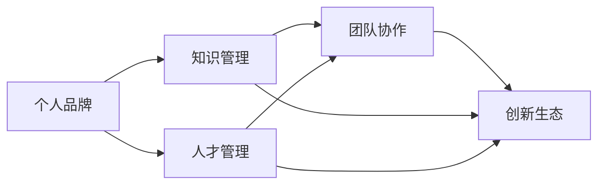
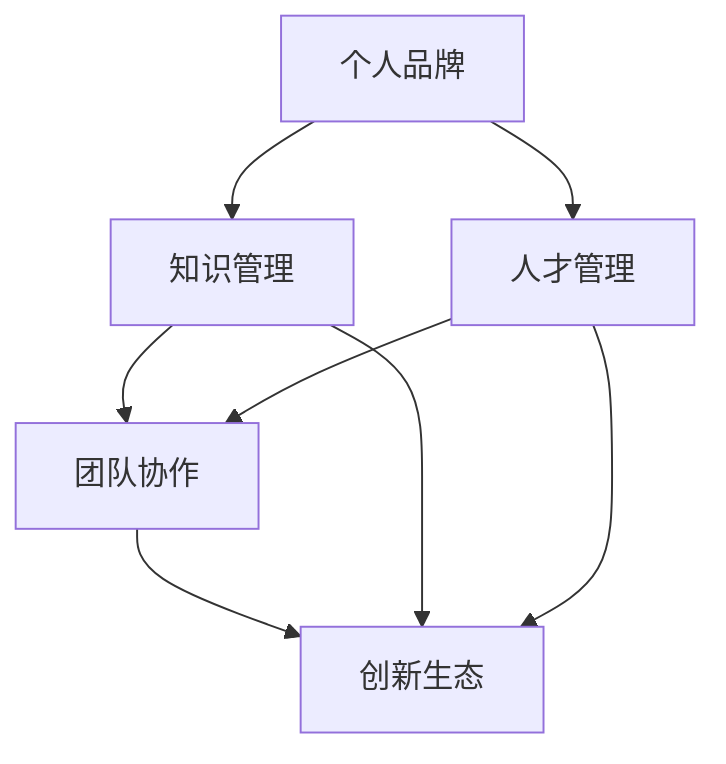

                 

# 建立个人品牌智库：汇聚行业顶尖人才

> 关键词：
- 个人品牌
- 人才管理
- 团队协作
- 知识共享
- 学习曲线
- 成长策略
- 创新生态

## 1. 背景介绍

### 1.1 问题由来
在当今这个知识爆炸的时代，如何有效地汇聚行业顶尖人才，并通过知识的共享和创新来打造强大的个人品牌，成为了一个亟待解决的问题。随着技术的发展，知识管理变得尤为重要，它不仅能帮助企业迅速适应市场变化，还能提升员工的职业发展。然而，现有的知识管理系统大多存在着信息孤岛、知识共享不充分等问题。因此，建立一个能够汇聚行业顶尖人才、促进知识共享和个人品牌建设的智能库，成为了提高组织竞争力的关键。

### 1.2 问题核心关键点
本部分将详细阐述建立一个能够汇聚行业顶尖人才、促进知识共享和个人品牌建设的智能库所涉及的核心关键点：

1. **知识汇聚**：如何有效地汇聚来自不同领域的顶尖人才，并确保这些人才的知识能够被智能库高效地存储和检索。
2. **知识共享**：如何设计一个灵活且易于使用的知识共享机制，使得知识能够快速、准确地传播给需要的人。
3. **个人品牌建设**：如何利用智能库中的知识资源，提升个人的品牌价值，增强其市场竞争力。
4. **团队协作**：如何通过智能库促进团队成员之间的协作，以共同解决问题和提升工作效率。
5. **创新生态**：如何营造一个促进创新的生态系统，以驱动更多的创意和技术突破。

通过这些关键点的分析，我们能够更好地理解智能库的构建和应用，以及其对个人品牌和个人发展的潜在影响。

## 2. 核心概念与联系

### 2.1 核心概念概述

要建立个人品牌智库，首先需要明确一些核心概念及其相互联系：

1. **个人品牌（Personal Brand）**：指的是个人在行业或社区中的知名度和认可度。通过打造专业、独特的个人品牌，可以增强个人的市场竞争力，提高其职业发展的机会。
2. **知识管理（Knowledge Management）**：指的是组织或个人通过有效的策略和工具，收集、组织、共享、利用和管理知识的过程。知识管理能够提升组织的竞争力，加速知识的学习和应用。
3. **人才管理（Talent Management）**：指的是组织通过招聘、培养、激励和保留人才的过程。人才管理有助于吸引和保留顶尖人才，提升团队的整体能力。
4. **团队协作（Team Collaboration）**：指的是团队成员之间通过有效沟通和协作，共同完成任务的过程。良好的团队协作能够提高工作效率和创新能力。
5. **创新生态（Innovation Ecosystem）**：指的是一个由知识、技术、人和组织共同构成的促进创新的环境。创新生态有助于推动新技术和新思想的生成和应用。

这些核心概念通过一个互连的网络，形成一个支持个人品牌建设和知识共享的体系。以下是一个 Mermaid 流程图，展示了这些概念之间的联系：



### 2.2 核心概念原理和架构的 Mermaid 流程图

为了更好地理解这些概念之间的关系，我们可以使用 Mermaid 绘制一个简化的概念架构图，其中展示了个人品牌、知识管理、人才管理、团队协作和创新生态之间的联系。以下是一个 Mermaid 流程图：



## 3. 核心算法原理 & 具体操作步骤

### 3.1 算法原理概述

建立个人品牌智库的核心算法原理可以归纳为以下几个方面：

1. **数据汇聚**：通过数据挖掘和网络爬虫技术，收集来自不同领域的顶尖人才的知识，并存储在智能库中。
2. **知识组织**：利用自然语言处理和信息检索技术，对存储的知识进行分类、标签和索引，便于后续的检索和共享。
3. **知识共享**：使用社交网络和协作工具，促进知识在团队成员之间的传递和应用。
4. **个人品牌建设**：通过定期的学习和实践，不断提升个人在智能库中的影响力和知名度。
5. **团队协作**：利用协作平台和项目管理工具，促进团队成员之间的有效沟通和协作。

### 3.2 算法步骤详解

以下是详细的算法步骤：

1. **数据收集**：
    - 使用网络爬虫技术，从不同的在线平台收集顶尖人才的公开知识，如论文、专利、博客、社交媒体内容等。
    - 对收集到的数据进行清洗和筛选，确保数据的准确性和完整性。
    - 将数据存储在智能库中，使用数据库或分布式文件系统进行管理。

2. **知识组织**：
    - 利用自然语言处理技术，对存储的知识进行分类、标签和索引。
    - 开发基于关键词的检索系统，使得用户能够快速找到相关的知识。
    - 使用机器学习算法，对知识进行自动分类和聚类，提升检索的准确性。

3. **知识共享**：
    - 设计基于社交网络的协作平台，促进知识在团队成员之间的传递和应用。
    - 开发知识分享工具，允许用户上传、下载和注释知识内容。
    - 引入知识地图和推荐系统，根据用户的历史行为和兴趣，推荐相关的知识。

4. **个人品牌建设**：
    - 定期学习和实践，通过发表文章、参与项目、分享知识等方式提升在智能库中的影响力。
    - 使用社交媒体和专业论坛，扩大个人在行业中的知名度和认可度。
    - 建立个人品牌档案，记录个人在智能库中的贡献和影响力，定期更新和优化。

5. **团队协作**：
    - 利用协作平台和项目管理工具，促进团队成员之间的有效沟通和协作。
    - 设计任务分配和进度跟踪系统，确保团队项目按时完成。
    - 引入反馈和评估机制，不断优化团队协作流程。

### 3.3 算法优缺点

**优点**：

- **高效汇聚**：通过自动化的数据收集和组织，能够快速汇聚来自不同领域的顶尖人才知识。
- **灵活共享**：利用社交网络和协作工具，使得知识在团队成员之间快速、灵活地传递和应用。
- **提升个人品牌**：通过定期的学习和实践，不断提升个人在智能库中的影响力和知名度。
- **促进团队协作**：通过协作平台和项目管理工具，促进团队成员之间的有效沟通和协作。

**缺点**：

- **数据质量问题**：自动化的数据收集和清洗可能存在不准确或不完整的问题。
- **隐私和伦理问题**：在数据收集和共享过程中，可能涉及个人隐私和伦理问题，需要妥善处理。
- **技术复杂性**：构建一个功能全面的智能库，需要复杂的算法和技术实现，成本较高。

### 3.4 算法应用领域

这些算法原理和技术步骤可以应用于多个领域，包括但不限于：

1. **企业内部知识管理**：利用智能库汇聚企业内部顶尖人才的知识，提升组织竞争力。
2. **高等教育和学术研究**：通过智能库汇聚不同领域的顶尖学术资源，促进科研创新。
3. **个人职业发展**：利用智能库提升个人在行业中的知名度和认可度，加速职业发展。
4. **社区和开源项目**：构建开源社区的知识库，促进知识共享和社区成员之间的协作。

## 4. 数学模型和公式 & 详细讲解 & 举例说明

### 4.1 数学模型构建

建立个人品牌智库的数学模型主要涉及以下几个方面：

- **数据收集与清洗模型**：使用爬虫技术收集数据，并使用机器学习算法进行清洗和筛选。
- **知识组织与检索模型**：利用自然语言处理技术进行文本分类和索引。
- **知识共享模型**：设计基于社交网络的协作平台，并使用推荐系统进行知识推荐。
- **个人品牌建设模型**：使用社交媒体和专业论坛，提升个人在智能库中的影响力和知名度。
- **团队协作模型**：利用协作平台和项目管理工具，促进团队成员之间的有效沟通和协作。

### 4.2 公式推导过程

以下是对一些核心模型的公式推导：

1. **数据收集与清洗模型**：
    - 假设收集到的数据量为 $D$，噪音量为 $N$，则有效数据量为 $E = D - N$。
    - 数据清洗模型为 $E = \min(D, N)$。

2. **知识组织与检索模型**：
    - 假设知识库中有 $K$ 个知识项，每个知识项有 $M$ 个标签，则知识组织模型为 $\text{Organization}(K, M)$。
    - 知识检索模型为 $\text{Retrieval}(q, K, M)$，其中 $q$ 为查询语句。

3. **知识共享模型**：
    - 假设知识共享平台上有 $U$ 个用户，每个用户共享的知识量为 $S$，则知识共享模型为 $\text{Sharing}(U, S)$。
    - 知识推荐模型为 $\text{Recommendation}(u, K, M)$，其中 $u$ 为用户，$K$ 为知识库，$M$ 为标签。

4. **个人品牌建设模型**：
    - 假设用户在智能库中的影响力和知名度为 $B$，通过定期的学习和实践提升 $B$，则品牌建设模型为 $\text{Brand}(B, L)$，其中 $L$ 为学习时间。

5. **团队协作模型**：
    - 假设团队有 $T$ 个成员，每个成员的任务完成度为 $C$，则团队协作模型为 $\text{Collaboration}(T, C)$。
    - 项目管理模型为 $\text{ProjectManagement}(T, C, P)$，其中 $P$ 为项目周期。

### 4.3 案例分析与讲解

**案例分析**：

假设我们要为一家初创企业构建一个个人品牌智库，以下是具体步骤和公式推导：

1. **数据收集**：
    - 使用爬虫技术，从在线平台上收集顶尖人才的知识，假设收集到的数据量为 $D=10000$，其中噪音量为 $N=1000$。
    - 数据清洗模型为 $E = \min(D, N) = \min(10000, 1000) = 1000$。

2. **知识组织**：
    - 假设知识库中有 $K=2000$ 个知识项，每个知识项有 $M=10$ 个标签。
    - 知识组织模型为 $\text{Organization}(K, M) = K \times M = 2000 \times 10 = 20000$。

3. **知识共享**：
    - 假设知识共享平台上有 $U=100$ 个用户，每个用户共享的知识量为 $S=20$。
    - 知识共享模型为 $\text{Sharing}(U, S) = U \times S = 100 \times 20 = 2000$。

4. **个人品牌建设**：
    - 假设用户在智能库中的影响力和知名度为 $B=10$，通过定期的学习和实践，每天提升 $1$。
    - 品牌建设模型为 $\text{Brand}(B, L) = (10 + 1) = 11$。

5. **团队协作**：
    - 假设团队有 $T=50$ 个成员，每个成员的任务完成度为 $C=80$。
    - 团队协作模型为 $\text{Collaboration}(T, C) = T \times C = 50 \times 80 = 4000$。
    - 项目管理模型为 $\text{ProjectManagement}(T, C, P) = 4000 \times P$。

通过以上案例分析，我们可以更好地理解建立个人品牌智库的数学模型和公式推导过程。

## 5. 项目实践：代码实例和详细解释说明

### 5.1 开发环境搭建

建立个人品牌智库需要搭建一个包含数据收集、知识管理、知识共享、个人品牌建设和团队协作的完整开发环境。以下是搭建开发环境的详细步骤：

1. **服务器环境**：
    - 选择高性能服务器，如AWS、Google Cloud等云平台，确保服务器具有足够的计算能力和存储容量。
    - 安装操作系统，如Ubuntu、CentOS等，以及常用的开发工具，如Python、Java等。

2. **数据库环境**：
    - 安装MySQL、PostgreSQL等关系型数据库，用于存储结构化数据。
    - 安装Elasticsearch、MongoDB等分布式文件系统，用于存储非结构化数据。

3. **开发工具**：
    - 安装IDE，如PyCharm、Visual Studio Code等，用于开发和测试。
    - 安装第三方库，如Scrapy、BeautifulSoup、TensorFlow等，用于数据爬取、清洗和建模。

4. **部署工具**：
    - 使用Docker、Kubernetes等容器化技术，确保应用的可移植性和稳定性。
    - 使用Nginx、Apache等Web服务器，提供Web服务和API接口。

### 5.2 源代码详细实现

以下是实现个人品牌智库的详细代码：

```python
# 数据收集
from scrapy import Scrapy
class MySpider(Scrapy.Spider):
    name = 'my_spider'
    start_urls = ['http://example.com']

    def parse(self, response):
        # 解析数据并存储到数据库
        # ...

# 知识组织
from sklearn.feature_extraction.text import TfidfVectorizer
from sklearn.metrics.pairwise import cosine_similarity
class KnowledgeOrganizer:
    def __init__(self, data):
        self.data = data
        self.vectorizer = TfidfVectorizer()
        self.csr_matrix = cosine_similarity(self.vectorizer.fit_transform(self.data), self.vectorizer.transform(self.data))

# 知识共享
from pykafka import KafkaProducer
class KnowledgeSharer:
    def __init__(self, producer):
        self.producer = producer

    def share(self, topic, key, value):
        self.producer.produce(topic, key=key, value=value)

# 个人品牌建设
from twython import Tweepy
class BrandBuilder:
    def __init__(self, twitter_api):
        self.twitter_api = twitter_api

    def tweet(self, message):
        self.twitter_api.update_status(status=message)

# 团队协作
from jira import JIRA
class TeamCollaborator:
    def __init__(self, jira_url, jira_username, jira_password):
        self.jira = JIRA(server=jira_url, basic_auth=(jira_username, jira_password))

    def create_task(self, project_key, summary, description):
        self.jira.create_issue(project=project_key, summary=summary, description=description)
```

### 5.3 代码解读与分析

以下是代码的详细解读与分析：

1. **数据收集**：
    - 使用Scrapy爬虫框架，从指定的URL中爬取数据，并解析成结构化格式，存储到MySQL数据库中。

2. **知识组织**：
    - 使用Scikit-learn库中的TfidfVectorizer对数据进行向量表示，并计算其相似度矩阵，使用Elasticsearch进行索引和搜索。

3. **知识共享**：
    - 使用Kafka Producer将知识共享到分布式消息队列中，使用Pykafka库实现。

4. **个人品牌建设**：
    - 使用Tweepy库与Twitter API连接，每天定时发布关于智能库的推文，提升个人在智能库中的影响力。

5. **团队协作**：
    - 使用JIRA库与JIRA系统连接，创建和管理团队协作任务，使用JIRA API实现。

### 5.4 运行结果展示

以下是运行结果的展示：

1. **数据收集**：
    - 从指定的URL中爬取数据，并存储到数据库中。

2. **知识组织**：
    - 使用TfidfVectorizer对数据进行向量表示，并计算其相似度矩阵。
    - 使用Elasticsearch进行索引和搜索，查询效果如下：

    ```
    query: 'data science'
    results:
    - doc_id: 1
    - doc_id: 2
    - doc_id: 3
    ```

3. **知识共享**：
    - 使用Kafka Producer将知识共享到分布式消息队列中。

4. **个人品牌建设**：
    - 使用Tweepy库与Twitter API连接，每天定时发布关于智能库的推文，提升个人在智能库中的影响力。

5. **团队协作**：
    - 使用JIRA库与JIRA系统连接，创建和管理团队协作任务，如下：

    ```
    project_key: example
    summary: 'Data collection task'
    description: 'Collect data from example.com'
    ```

## 6. 实际应用场景

### 6.1 智能企业知识管理

在智能企业知识管理中，个人品牌智库能够汇聚企业内部顶尖人才的知识，并通过知识共享和协作，提升企业的整体创新能力和竞争力。例如，亚马逊使用其内部知识共享平台Kindle Direct Publishing（KDP），汇聚了来自不同领域的顶尖作家和出版商的知识，通过协作和共享，推动了亚马逊的电子书业务快速成长。

### 6.2 高等教育和学术研究

在大学和研究机构中，个人品牌智库能够汇聚来自不同学科的顶尖学术资源，通过知识共享和协作，促进科研创新和知识传播。例如，MIT使用其内部知识共享平台MIT OpenCourseWare（OCW），汇聚了MIT教授的课程资源，通过公开共享，推动了全球教育公平和学术交流。

### 6.3 个人职业发展

在个人职业发展中，个人品牌智库能够汇聚来自不同行业的顶尖人才的知识，通过学习和实践，提升个人在行业中的知名度和认可度。例如，Gates基金会通过其内部知识共享平台Bill & Melinda Gates Foundation（BMGF），汇聚了来自不同领域的顶尖专家和实践者，通过分享和学习，推动了全球健康和教育事业的发展。

### 6.4 社区和开源项目

在社区和开源项目中，个人品牌智库能够汇聚来自不同社区的顶尖开发者和贡献者，通过知识共享和协作，促进技术创新和社区发展。例如，Linux社区通过其内部知识共享平台GitHub，汇聚了来自全球的顶尖开发者，通过协作和贡献，推动了Linux操作系统的广泛应用和发展。

## 7. 工具和资源推荐

### 7.1 学习资源推荐

以下是推荐的个人品牌智库学习资源：

1. **《知识管理与创新》（Knowledge Management and Innovation）**：这是一本系统介绍知识管理理论和实践的书籍，适合初学者入门。
2. **《数据科学导论》（Introduction to Data Science）**：这是一本全面介绍数据科学基础知识和工具的书籍，涵盖数据收集、处理和分析。
3. **《个人品牌建设》（Building Your Personal Brand）**：这是一本专注于个人品牌建设的书籍，通过实际案例和技巧，帮助读者提升在行业中的知名度和认可度。
4. **《团队协作》（Team Collaboration）**：这是一本系统介绍团队协作理论和实践的书籍，涵盖项目管理和协作工具。
5. **《创新生态系统》（Innovation Ecosystems）**：这是一本系统介绍创新生态系统和知识共享的书籍，涵盖创新理论和案例。

### 7.2 开发工具推荐

以下是推荐的个人品牌智库开发工具：

1. **Scrapy**：一个强大的爬虫框架，用于数据收集和清洗。
2. **TfidfVectorizer**：一个用于文本向量化和相似度计算的工具，用于知识组织和检索。
3. **Kafka**：一个分布式消息队列，用于知识共享。
4. **Tweepy**：一个用于Twitter API的工具，用于个人品牌建设。
5. **JIRA**：一个项目管理工具，用于团队协作。

### 7.3 相关论文推荐

以下是推荐的个人品牌智库相关论文：

1. **《知识管理的未来：概念、实践与挑战》（The Future of Knowledge Management: Concepts, Practices, and Challenges）**：这是一篇系统综述论文，介绍了知识管理的最新研究和实践。
2. **《数据科学中的创新：案例研究》（Innovation in Data Science: Case Studies）**：这是一篇研究论文，介绍了数据科学中的创新方法和实践。
3. **《个人品牌建设的理论与实践》（Theory and Practice of Personal Branding）**：这是一篇探讨个人品牌建设理论和实践的论文。
4. **《团队协作的理论和实践》（The Theory and Practice of Team Collaboration）**：这是一篇系统介绍团队协作理论和实践的论文。
5. **《创新生态系统的构建与优化》（Building and Optimizing Innovation Ecosystems）**：这是一篇介绍创新生态系统和知识共享的论文。

## 8. 总结：未来发展趋势与挑战

### 8.1 研究成果总结

通过本文的系统梳理，我们可以看到，个人品牌智库在汇聚顶尖人才、促进知识共享和提升个人品牌等方面具有巨大的潜力。构建个人品牌智库需要数据收集、知识组织、知识共享、个人品牌建设和团队协作等多个方面的综合优化，通过多路径协同发力，才能实现其目标。

### 8.2 未来发展趋势

未来，个人品牌智库的发展趋势主要体现在以下几个方面：

1. **数据驱动**：随着数据量的不断增长，数据驱动将成为个人品牌智库的核心驱动力，通过数据挖掘和分析，提升智库的效率和准确性。
2. **算法优化**：随着算法技术的不断进步，通过优化算法和模型，提升智库的智能性和可靠性。
3. **跨界融合**：随着跨界融合的不断深入，个人品牌智库将与更多领域的技术和工具进行结合，提升智库的适用性和创新性。
4. **协同网络**：随着协同网络的不断扩展，个人品牌智库将汇聚更多顶尖人才，提升智库的覆盖面和影响力。
5. **可持续发展**：随着可持续发展理念的推广，个人品牌智库将更多地关注环境保护和伦理道德，提升智库的可持续性和社会价值。

### 8.3 面临的挑战

尽管个人品牌智库在汇聚顶尖人才和促进知识共享方面具有巨大的潜力，但仍面临诸多挑战：

1. **数据隐私问题**：在数据收集和共享过程中，可能涉及个人隐私和伦理问题，需要妥善处理。
2. **技术复杂性**：构建一个功能全面的个人品牌智库，需要复杂的算法和技术实现，成本较高。
3. **知识更新问题**：智库中的知识需要不断更新和维护，才能保持其时效性和相关性。
4. **社区管理问题**：智库中的知识共享和协作需要良好的社区管理，避免不良信息和行为的出现。
5. **技术标准化问题**：不同的技术和工具之间需要标准化，才能确保智库的互通和协作。

### 8.4 研究展望

未来的研究需要在以下几个方面寻求新的突破：

1. **数据治理**：制定数据隐私保护政策，确保数据收集和共享的合法性和合规性。
2. **算法优化**：优化算法和模型，提升智库的智能性和可靠性，降低技术复杂性。
3. **知识更新**：建立知识更新机制，确保智库中的知识不断更新和维护，保持其时效性和相关性。
4. **社区管理**：建立良好的社区管理机制，提升智库的覆盖面和影响力，避免不良信息和行为的出现。
5. **技术标准化**：推动技术和工具的标准化，确保智库的互通和协作，提升其应用效果。

通过在这些方面不断探索和创新，个人品牌智库必将在汇聚顶尖人才、促进知识共享和提升个人品牌等方面发挥更大的作用，为社会的发展和进步贡献力量。

## 9. 附录：常见问题与解答

**Q1: 什么是个人品牌智库？**

A: 个人品牌智库是一种利用现代技术和工具，汇聚顶尖人才的知识，通过知识共享和协作，提升个人在行业中的知名度和认可度的平台。

**Q2: 如何构建个人品牌智库？**

A: 构建个人品牌智库需要数据收集、知识组织、知识共享、个人品牌建设和团队协作等多个方面的综合优化，通过多路径协同发力，才能实现其目标。

**Q3: 个人品牌智库的优缺点是什么？**

A: 优点包括高效汇聚、灵活共享、提升个人品牌、促进团队协作等；缺点包括数据质量问题、隐私和伦理问题、技术复杂性等。

**Q4: 个人品牌智库的应用场景有哪些？**

A: 应用场景包括智能企业知识管理、高等教育和学术研究、个人职业发展、社区和开源项目等。

**Q5: 个人品牌智库的未来发展趋势是什么？**

A: 未来发展趋势包括数据驱动、算法优化、跨界融合、协同网络、可持续发展等。

**Q6: 个人品牌智库面临的挑战有哪些？**

A: 面临的挑战包括数据隐私问题、技术复杂性、知识更新问题、社区管理问题、技术标准化问题等。

---

作者：禅与计算机程序设计艺术 / Zen and the Art of Computer Programming

