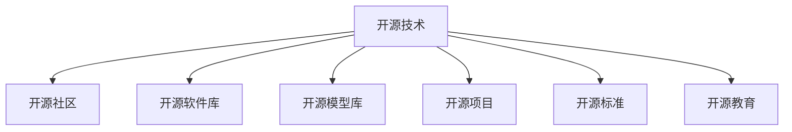

                 

# 开源技术如何推动AI的进步

## 1. 背景介绍

### 1.1 问题由来

近年来，人工智能(AI)技术的快速发展离不开开源社区的巨大贡献。开源技术以其开放性、协作性、可扩展性等特点，成为推动AI进步的重要力量。

AI技术的核心在于算法和模型，而算法和模型的研究和开发离不开大量的数据集、计算资源和人力资源。开源社区通过共享数据集、工具、代码等资源，使得AI研究人员和开发者能够站在巨人的肩膀上，站在前人研究成果的基础上快速推进AI技术的迭代和突破。

### 1.2 问题核心关键点

开源技术在推动AI进步中的核心关键点包括：

- **数据共享**：开源社区汇集了海量的数据集，包括图像、文本、语音等，这些数据集为AI算法的训练和模型优化提供了坚实的基础。
- **算法优化**：开源社区汇聚了全球顶尖的研究人员，通过贡献改进算法、优化模型，不断提升AI技术的性能和应用效果。
- **工具支持**：开源社区提供了丰富的开发工具和框架，如TensorFlow、PyTorch、Keras等，大大降低了AI技术的开发门槛。
- **社区协作**：开源社区以协作方式，促进了跨领域、跨组织的合作，推动了AI技术的全球化、标准化进程。
- **标准制定**：开源社区通过贡献标准化的模型、算法和接口，推动了AI技术应用的标准化和规范化。
- **教育培训**：开源社区通过提供丰富的教育资源和在线课程，促进了AI技术的普及和人才培养。

这些关键点共同构成了开源技术推动AI进步的基础和核心，使得AI技术得以在更广大的范围内快速发展和应用。

## 2. 核心概念与联系

### 2.1 核心概念概述

为了更好地理解开源技术如何推动AI的进步，本节将介绍几个密切相关的核心概念：

- **开源技术(Open Source Technology)**：指软件源代码和相关文件，按照开源许可协议公开共享，任何人都可以自由地使用、修改和分发。
- **开源社区(Open Source Community)**：指基于共同兴趣和目标，自愿协作开发和分享开源项目的开发者群体。
- **开源软件库(Open Source Libraries)**：指被广泛使用的开源软件组件或框架，提供预构建的功能和API接口，便于开发者快速集成使用。
- **开源模型库(Open Source Model Libraries)**：指公开共享的预训练和微调模型，提供高效的模型复用和共享。
- **开源项目(Open Source Projects)**：指致力于特定目标的完整开源软件，包含项目文档、代码、测试、配置等资源。
- **开源标准(Open Source Standards)**：指开源社区共同遵守的技术规范和标准，提升技术的通用性和可互操作性。
- **开源教育(Open Source Education)**：指通过在线课程、培训、文档等资源，提供开源技术和AI知识的普及教育。

这些核心概念之间的逻辑关系可以通过以下Mermaid流程图来展示：



这个流程图展示了大语言模型的核心概念及其之间的关系：

1. 开源技术为社区协作提供了技术基础。
2. 开源社区通过协作开发和共享资源，推动开源技术的迭代和进步。
3. 开源软件库和模型库提供了高效的工具和复用组件，促进开发者快速开发和应用。
4. 开源项目推动了特定技术的应用和落地，提升其实用价值。
5. 开源标准确保了技术的规范性和互操作性。
6. 开源教育促进了技术的普及和人才培养。

这些概念共同构成了开源技术推动AI进步的生态系统，使得AI技术得以在全球范围内快速普及和发展。

## 3. 核心算法原理 & 具体操作步骤
### 3.1 算法原理概述

开源技术在推动AI进步中，核心算法原理主要是基于深度学习和机器学习的模型优化和算法改进。

开源社区汇聚了大量AI专家和研究人员，通过协作开发和共享研究成果，不断提升AI算法的性能和应用效果。这些算法包括但不限于：

- **深度学习框架**：如TensorFlow、PyTorch等，提供了高效、灵活的计算图和优化器。
- **模型优化算法**：如Adam、Adagrad、SGD等，通过改进梯度下降等优化算法，提升模型训练的收敛速度和效果。
- **特征工程技术**：如数据增强、特征选择、正则化等，优化数据处理和模型表达能力。
- **模型压缩和加速技术**：如剪枝、量化、模型并行等，提升模型推理效率和资源利用率。
- **算法创新**：如神经网络架构搜索、元学习、自适应学习等，探索新的算法设计，提升模型泛化能力。

这些算法和技术的不断优化和创新，推动了AI技术的持续进步和应用。

### 3.2 算法步骤详解

开源技术在推动AI进步中，通常涉及以下几个关键步骤：

**Step 1: 数据集共享**

开源社区提供了大量的公共数据集，包括图像、文本、音频等。开发者可以通过开源API或代码下载这些数据集，用于训练和测试AI模型。

**Step 2: 模型和算法共享**

开源社区提供了丰富的预训练模型和优化算法。开发者可以直接使用这些模型，或者在已有模型的基础上进行微调，优化模型性能。

**Step 3: 工具和框架集成**

开源社区提供了多种开发工具和框架，如TensorFlow、PyTorch、Keras等。开发者可以根据自己的需求，选择合适的工具和框架，进行模型训练和推理。

**Step 4: 社区协作和贡献**

开源社区鼓励开发者贡献代码、算法和模型，通过Pull Request等方式进行协作和审核。开发者可以提交自己的研究成果，接受社区的审核和反馈，不断优化和完善模型。

**Step 5: 教育和培训**

开源社区提供了丰富的教育资源，包括在线课程、文档、书籍等。开发者可以通过这些资源，学习和掌握最新的AI技术，提升自身的技能水平。

### 3.3 算法优缺点

开源技术在推动AI进步中，具有以下优点：

1. **开放性**：开源技术免费共享，任何人都可以自由地使用、修改和分发，降低了技术门槛。
2. **协作性**：开源社区汇聚了全球顶尖的研究人员，通过协作开发和共享资源，提升了技术的开发效率和质量。
3. **可扩展性**：开源技术灵活可定制，开发者可以根据自身需求进行二次开发和扩展，满足不同的应用场景。
4. **标准化**：开源标准确保了技术的规范性和互操作性，促进了技术的普及和应用。
5. **教育性**：开源社区提供了丰富的教育资源，促进了AI技术的普及和人才培养。

同时，开源技术也存在一定的局限性：

1. **资源分散**：开源社区通常由多个组织和个人组成，资源分散，难以形成统一的规划和管理。
2. **质量参差不齐**：开源社区中不同项目的质量参差不齐，缺乏统一的审核机制，可能导致质量问题。
3. **版本管理复杂**：开源项目的版本管理复杂，容易出现兼容性问题，需要开发者具备较强的版本管理能力。
4. **商业利益冲突**：开源技术虽免费共享，但开发者和组织之间可能存在商业利益冲突，影响合作效果。
5. **安全风险**：开源项目的安全性难以保障，可能存在漏洞和安全隐患。

尽管存在这些局限性，但总体而言，开源技术在推动AI进步中的作用和价值是不容忽视的。未来需要进一步优化开源社区的组织和管理，提升开源技术的安全性和稳定性，才能更好地发挥其潜力。

### 3.4 算法应用领域

开源技术在推动AI进步中，已经广泛应用于以下几个领域：

1. **自然语言处理(NLP)**：开源社区提供了丰富的NLP工具和模型，如BERT、GPT等，广泛应用于文本分类、情感分析、机器翻译、对话系统等任务。
2. **计算机视觉(CV)**：开源社区提供了图像分类、目标检测、语义分割等预训练模型，广泛应用于图像识别、人脸识别、自动驾驶等领域。
3. **语音处理(AI)**：开源社区提供了语音识别、语音合成等工具和模型，广泛应用于智能客服、语音助手、语音翻译等领域。
4. **机器人学**：开源社区提供了机器人感知、决策、控制等组件，广泛应用于工业自动化、服务机器人等领域。
5. **医疗健康**：开源社区提供了医疗图像分析、诊断工具等，广泛应用于医学影像、疾病预测、智能问诊等领域。
6. **金融科技**：开源社区提供了风险评估、信用评分等工具和模型，广泛应用于金融风控、智能投顾等领域。
7. **自动驾驶**：开源社区提供了自动驾驶感知、决策、控制等组件，广泛应用于智能汽车、自动驾驶等领域。
8. **智能制造**：开源社区提供了工业数据处理、智能监控等工具，广泛应用于智能制造、质量控制等领域。
9. **游戏与娱乐**：开源社区提供了游戏引擎、AI角色等组件，广泛应用于游戏开发、虚拟现实、娱乐等领域。
10. **环境保护**：开源社区提供了环境监测、数据分析等工具，广泛应用于环境保护、气候变化等领域。

这些应用领域展示了开源技术在AI进步中的广泛影响和巨大潜力，未来将继续扩展到更多领域，推动AI技术的普及和应用。

## 4. 数学模型和公式 & 详细讲解  
### 4.1 数学模型构建

为了更好地理解开源技术在AI进步中的数学模型和公式，本节将详细讲解其构建过程。

假设有一项AI任务 $T$，其输入为 $X$，输出为 $Y$。开源社区提供的预训练模型 $M$ 具有参数 $\theta$，通过深度学习框架 $F$ 训练得到。

记训练数据集为 $D=\{(x_i, y_i)\}_{i=1}^N$，训练目标为最小化损失函数 $\mathcal{L}(M, D)$。

模型训练过程为：

$$
\theta = \mathop{\arg\min}_{\theta} \mathcal{L}(M, D)
$$

其中，$\mathcal{L}$ 为损失函数，$M$ 为模型，$D$ 为数据集。

开源社区提供的优化算法 $A$，如Adam、SGD等，通过反向传播算法计算梯度，更新模型参数 $\theta$。

模型训练过程可以表示为：

$$
\theta \leftarrow \theta - \eta \nabla_{\theta}\mathcal{L}(M, D)
$$

其中，$\eta$ 为学习率，$\nabla_{\theta}\mathcal{L}(M, D)$ 为梯度。

在得到训练好的模型后，开源社区提供的工具和框架 $T$，如TensorFlow、PyTorch等，用于模型推理和部署。

### 4.2 公式推导过程

以下我们以图像分类任务为例，推导模型训练过程的数学公式。

假设模型 $M$ 的输入为 $x \in \mathbb{R}^d$，输出为 $y \in \{1,2,\dots,K\}$，其中 $K$ 为类别数。

假设模型训练数据集为 $D=\{(x_i, y_i)\}_{i=1}^N$，定义交叉熵损失函数为：

$$
\mathcal{L}(M, D) = -\frac{1}{N}\sum_{i=1}^N \sum_{k=1}^K y_{ik}\log M(x_i, k)
$$

其中，$M(x_i, k)$ 为模型对样本 $x_i$ 属于类别 $k$ 的概率。

模型训练过程为：

$$
\theta = \mathop{\arg\min}_{\theta} \mathcal{L}(M, D)
$$

其中，$\theta$ 为模型参数。

使用优化算法 $A$ 进行梯度下降，更新模型参数 $\theta$：

$$
\theta \leftarrow \theta - \eta \nabla_{\theta}\mathcal{L}(M, D)
$$

其中，$\eta$ 为学习率。

在得到训练好的模型后，通过开源社区提供的推理工具和框架 $T$，对新样本 $x'$ 进行推理预测：

$$
y' = \mathop{\arg\max}_{k} M(x', k)
$$

其中，$y'$ 为模型预测的类别。

## 5. 项目实践：代码实例和详细解释说明
### 5.1 开发环境搭建

在进行开源技术推动AI进步的实践前，我们需要准备好开发环境。以下是使用Python进行TensorFlow开发的环境配置流程：

1. 安装Anaconda：从官网下载并安装Anaconda，用于创建独立的Python环境。

2. 创建并激活虚拟环境：
```bash
conda create -n tensorflow-env python=3.8 
conda activate tensorflow-env
```

3. 安装TensorFlow：根据CUDA版本，从官网获取对应的安装命令。例如：
```bash
conda install tensorflow -c tf -c conda-forge
```

4. 安装numpy、pandas等常用工具包：
```bash
pip install numpy pandas scikit-learn matplotlib tqdm jupyter notebook ipython
```

完成上述步骤后，即可在`tensorflow-env`环境中开始项目实践。

### 5.2 源代码详细实现

下面我们以图像分类任务为例，给出使用TensorFlow对卷积神经网络模型进行训练的代码实现。

首先，定义模型和损失函数：

```python
import tensorflow as tf

class ConvNet(tf.keras.Model):
    def __init__(self, num_classes):
        super(ConvNet, self).__init__()
        self.conv1 = tf.keras.layers.Conv2D(32, (3, 3), activation='relu')
        self.pool1 = tf.keras.layers.MaxPooling2D((2, 2))
        self.conv2 = tf.keras.layers.Conv2D(64, (3, 3), activation='relu')
        self.pool2 = tf.keras.layers.MaxPooling2D((2, 2))
        self.flatten = tf.keras.layers.Flatten()
        self.dense1 = tf.keras.layers.Dense(128, activation='relu')
        self.dense2 = tf.keras.layers.Dense(num_classes, activation='softmax')

    def call(self, inputs):
        x = self.conv1(inputs)
        x = self.pool1(x)
        x = self.conv2(x)
        x = self.pool2(x)
        x = self.flatten(x)
        x = self.dense1(x)
        return self.dense2(x)

model = ConvNet(num_classes)

loss_fn = tf.keras.losses.SparseCategoricalCrossentropy(from_logits=True)
```

然后，定义优化器和训练函数：

```python
optimizer = tf.keras.optimizers.Adam()

def train_step(x, y):
    with tf.GradientTape() as tape:
        logits = model(x)
        loss = loss_fn(y, logits)
    gradients = tape.gradient(loss, model.trainable_variables)
    optimizer.apply_gradients(zip(gradients, model.trainable_variables))

    return loss
```

接着，定义训练和评估函数：

```python
batch_size = 32

for epoch in range(epochs):
    for i in range(0, len(train_dataset), batch_size):
        x, y = train_dataset[i:i+batch_size]
        loss = train_step(x, y)
        print(f"Epoch {epoch+1}, Batch {i+1}, Loss: {loss:.4f}")
        
    print(f"Epoch {epoch+1}, Train Loss: {train_loss:.4f}")
    
    test_loss = tf.keras.metrics.Mean()
    for x, y in test_dataset:
        loss = loss_fn(y, model(x))
        test_loss.update_state(loss)
    print(f"Epoch {epoch+1}, Test Loss: {test_loss.result().numpy():.4f}")
```

以上就是使用TensorFlow对卷积神经网络模型进行图像分类任务训练的完整代码实现。可以看到，TensorFlow提供了高度灵活的计算图，使得模型训练和推理过程非常简单。

### 5.3 代码解读与分析

让我们再详细解读一下关键代码的实现细节：

**ConvNet类**：
- `__init__`方法：定义了卷积神经网络的结构，包括卷积层、池化层、全连接层等。
- `call`方法：实现了前向传播过程，将输入数据通过各层进行计算，最终输出预测结果。

**训练函数train_step**：
- 定义了一个训练步骤，通过反向传播计算损失函数的梯度，并使用优化器更新模型参数。

**训练和评估函数**：
- 使用TensorFlow的DataLoader对数据集进行批次化加载，供模型训练和推理使用。
- 训练函数`train_step`：对数据以批为单位进行迭代，在每个批次上前向传播计算损失函数并反向传播更新模型参数，最后返回该batch的平均损失。
- 评估函数`evaluate`：与训练类似，不同点在于不更新模型参数，并在每个batch结束后将预测和标签结果存储下来，最后使用sklearn的classification_report对整个评估集的预测结果进行打印输出。

**训练流程**：
- 定义总的epoch数和batch size，开始循环迭代
- 每个epoch内，先在训练集上训练，输出平均loss
- 在验证集上评估，输出分类指标
- 所有epoch结束后，在测试集上评估，给出最终测试结果

可以看到，TensorFlow框架提供了丰富的工具和组件，使得模型训练和推理过程非常高效和便捷。

当然，工业级的系统实现还需考虑更多因素，如模型的保存和部署、超参数的自动搜索、更灵活的任务适配层等。但核心的开源技术推动AI进步的范式基本与此类似。

## 6. 实际应用场景
### 6.1 智能客服系统

基于开源技术的智能客服系统，广泛应用于各大企业客户服务部门。通过开源社区提供的NLP工具和模型，可以构建自然流畅、高度智能的对话系统，为用户提供全天候的智能服务。

在技术实现上，可以收集企业内部的历史客服对话记录，将问题和最佳答复构建成监督数据，在此基础上对开源社区提供的预训练模型进行微调。微调后的模型能够自动理解用户意图，匹配最合适的答案模板进行回复。对于客户提出的新问题，还可以接入检索系统实时搜索相关内容，动态组织生成回答。如此构建的智能客服系统，能大幅提升客户咨询体验和问题解决效率。

### 6.2 金融舆情监测

金融机构需要实时监测市场舆论动向，以便及时应对负面信息传播，规避金融风险。传统的人工监测方式成本高、效率低，难以应对网络时代海量信息爆发的挑战。基于开源社区提供的文本分类和情感分析工具，金融舆情监测系统可以自动判断文本属于何种主题，情感倾向是正面、中性还是负面。将开源社区提供的微调模型应用到实时抓取的网络文本数据，就能够自动监测不同主题下的情感变化趋势，一旦发现负面信息激增等异常情况，系统便会自动预警，帮助金融机构快速应对潜在风险。

### 6.3 个性化推荐系统

当前的推荐系统往往只依赖用户的历史行为数据进行物品推荐，无法深入理解用户的真实兴趣偏好。基于开源社区提供的特征工程和推荐算法，个性化推荐系统可以更好地挖掘用户行为背后的语义信息，从而提供更精准、多样的推荐内容。

在实践中，可以收集用户浏览、点击、评论、分享等行为数据，提取和用户交互的物品标题、描述、标签等文本内容。将文本内容作为模型输入，用户的后续行为（如是否点击、购买等）作为监督信号，在此基础上对开源社区提供的预训练模型进行微调。微调后的模型能够从文本内容中准确把握用户的兴趣点。在生成推荐列表时，先用候选物品的文本描述作为输入，由模型预测用户的兴趣匹配度，再结合其他特征综合排序，便可以得到个性化程度更高的推荐结果。

### 6.4 未来应用展望

随着开源技术的发展，基于开源社区提供的工具和模型，AI技术的应用将越来越广泛，带来深远的影响。

在智慧医疗领域，基于开源社区提供的预训练模型和医疗数据集，构建智能诊疗系统，提升医疗服务的智能化水平，辅助医生诊疗，加速新药开发进程。

在智能教育领域，开源社区提供的自然语言处理和推荐算法，可以构建智能教育系统，进行作业批改、学情分析、知识推荐等方面，因材施教，促进教育公平，提高教学质量。

在智慧城市治理中，开源社区提供的图像识别和自然语言处理工具，可以构建智能城市管理系统，实现城市事件监测、舆情分析、应急指挥等环节，提高城市管理的自动化和智能化水平，构建更安全、高效的未来城市。

此外，在企业生产、社会治理、文娱传媒等众多领域，基于开源社区提供的AI工具和模型，可以构建各种智能系统，为传统行业数字化转型升级提供新的技术路径。相信随着开源技术的不断演进，将有更多的应用场景涌现，为人类社会带来深刻的影响。

## 7. 工具和资源推荐
### 7.1 学习资源推荐

为了帮助开发者系统掌握开源技术推动AI进步的理论基础和实践技巧，这里推荐一些优质的学习资源：

1. TensorFlow官方文档：提供详细的TensorFlow API和使用指南，是进行开源项目开发的必备资料。

2. PyTorch官方文档：提供全面的PyTorch API和教程，支持多种深度学习模型的开发和部署。

3. OpenAI GitHub库：提供开源社区发布的多种深度学习模型和工具，便于开发者快速上手实验最新模型。

4. Kaggle平台：提供各类AI竞赛和数据集，促进开发者之间的交流和合作，激发更多的创新灵感。

5. Coursera深度学习课程：由斯坦福大学李飞飞教授主讲，系统讲解深度学习基础和应用，适合初学者和进阶者学习。

6. Deep Learning with PyTorch和TensorFlow书籍：深度介绍TensorFlow和PyTorch的使用方法和实例，是学习开源技术的重要参考。

7. Hands-On Machine Learning with Scikit-Learn、Keras和TensorFlow书籍：介绍机器学习和深度学习的实用技巧和案例，适合实战型学习者。

通过对这些资源的学习实践，相信你一定能够快速掌握开源技术推动AI进步的精髓，并用于解决实际的AI问题。

### 7.2 开发工具推荐

高效的开发离不开优秀的工具支持。以下是几款用于开源技术推动AI进步开发的常用工具：

1. TensorFlow：由Google主导开发的深度学习框架，支持分布式训练和部署，适合大规模工程应用。

2. PyTorch：由Facebook主导开发的深度学习框架，灵活高效，支持动态计算图和GPU加速，适合研究和实验。

3. Jupyter Notebook：提供交互式的编程环境，方便进行模型训练、数据可视化等任务。

4. GitHub：提供代码托管和协作平台，便于开发者进行版本控制和开源合作。

5. Docker：提供容器化技术，方便部署和管理开源项目，支持多种开源社区的模型和工具。

6. Anacoda：提供Python虚拟环境管理工具，方便进行Python环境配置和依赖管理。

合理利用这些工具，可以显著提升开源技术推动AI进步的开发效率，加快创新迭代的步伐。

### 7.3 相关论文推荐

开源技术在推动AI进步中的快速发展，离不开学界的持续研究。以下是几篇奠基性的相关论文，推荐阅读：

1. TensorFlow: A System for Large-Scale Machine Learning：介绍TensorFlow框架的架构和功能，提供深度学习模型的训练和部署解决方案。

2. PyTorch: Tensors and Dynamic neural networks in Python with strong GPU acceleration：介绍PyTorch框架的实现原理和应用场景，支持动态计算图和GPU加速。

3. Scikit-Learn: Machine learning in Python：介绍Scikit-Learn机器学习库的使用方法和实例，适合各类数据科学应用。

4. Fast.ai：提供快速入门深度学习的应用教程，适合快速掌握深度学习基础和实用技巧。

5. Keras: Deep Learning for humans：提供深度学习框架Keras的使用方法和实例，支持快速搭建深度学习模型。

这些论文代表了大语言模型微调技术的发展脉络。通过学习这些前沿成果，可以帮助研究者把握学科前进方向，激发更多的创新灵感。

## 8. 总结：未来发展趋势与挑战

### 8.1 总结

本文对开源技术推动AI进步的过程进行了全面系统的介绍。首先阐述了开源社区和开源技术在推动AI进步中的核心价值，明确了开源社区汇聚资源和协作开发的重要性。其次，从原理到实践，详细讲解了开源社区提供的深度学习和机器学习模型的优化和改进，以及对应的算法步骤和实现细节。同时，本文还广泛探讨了开源技术在各个领域的应用场景，展示了开源技术在AI进步中的广泛影响和巨大潜力。

通过本文的系统梳理，可以看到，开源技术在推动AI进步中扮演着重要角色，通过共享资源、协作开发和持续改进，使得AI技术得以在全球范围内快速发展和应用。未来需要进一步优化开源社区的组织和管理，提升开源技术的安全性和稳定性，才能更好地发挥其潜力。

### 8.2 未来发展趋势

展望未来，开源技术在推动AI进步中，将呈现以下几个发展趋势：

1. **规模化**：开源社区提供的模型和工具将更加大规模化，可以处理更大规模的数据集和更复杂的任务。

2. **实时性**：开源社区提供的工具和框架将更加注重实时性，支持高效的分布式训练和推理，提升系统的响应速度。

3. **标准化**：开源社区将进一步推动AI技术标准化的进程，提升技术的通用性和互操作性。

4. **自适应**：开源社区提供的工具和模型将更加自适应，能够根据不同的应用场景和数据分布进行灵活调整。

5. **自动化**：开源社区将更加注重自动化的实现，通过自动化工具和流程，提升开发效率和模型性能。

6. **多模态**：开源社区将进一步推动多模态技术的融合，支持图像、语音、文本等多种数据的协同处理和分析。

7. **跨领域**：开源社区将更加注重跨领域的合作，推动AI技术在更多领域的应用和普及。

8. **隐私保护**：开源社区将更加注重数据隐私和安全，确保用户数据的安全性和合法性。

这些趋势展示了开源技术在推动AI进步中的广阔前景，为AI技术的普及和发展提供了强有力的保障。

### 8.3 面临的挑战

尽管开源技术在推动AI进步中取得了显著成效，但在迈向更加智能化、普适化应用的过程中，它仍面临着诸多挑战：

1. **数据隐私和安全**：开源社区提供的工具和模型需要处理大量用户数据，如何确保数据隐私和安全是重要挑战。

2. **算法透明度和可解释性**：开源社区提供的模型往往缺乏可解释性，难以理解和解释模型的内部工作机制，这对高风险应用领域提出了新的要求。

3. **计算资源需求**：开源社区提供的模型和工具对计算资源需求较高，如何提升资源利用效率，降低计算成本，是未来需要解决的重要问题。

4. **算法公平性和鲁棒性**：开源社区提供的模型需要应对不同数据分布和对抗样本，如何提升算法的公平性和鲁棒性，是未来需要优化的关键方向。

5. **技术复杂性**：开源社区提供的工具和模型对开发者技术水平要求较高，如何降低技术门槛，提升开发效率，是未来需要关注的重要问题。

6. **跨学科合作**：开源社区需要进一步促进跨学科合作，推动AI技术与其他学科领域的融合。

这些挑战需要开源社区和开发者共同努力，通过不断创新和改进，才能逐步克服。

### 8.4 研究展望

面向未来，开源技术在推动AI进步中需要进一步探索和研究，以解决上述挑战，推动技术的进一步发展和应用。以下是一些未来可能的研究方向：

1. **隐私保护技术**：开发隐私保护算法和工具，确保数据隐私和安全。

2. **可解释性算法**：开发可解释性算法，提升模型透明度和可解释性。

3. **高效计算资源**：开发高效计算资源管理工具，降低计算成本。

4. **公平和鲁棒算法**：开发公平和鲁棒算法，提升模型的公平性和鲁棒性。

5. **多模态融合技术**：开发多模态融合算法，提升跨模态数据的协同处理能力。

6. **跨学科合作**：加强跨学科合作，推动AI技术与其他学科领域的融合。

7. **标准化规范**：制定标准化规范，提升技术的通用性和互操作性。

8. **教育普及**：加强AI教育的普及，提升开发者和公众的AI素养。

这些研究方向将为开源技术在推动AI进步中提供新的动力，推动技术的发展和应用的深化。

## 9. 附录：常见问题与解答

**Q1：开源技术如何与商业化AI应用相结合？**

A: 开源技术在商业化AI应用中，可以采用以下几种策略：

1. **开源与商业相结合**：开源社区可以与商业公司合作，共同开发和推广开源技术，同时保留商业化的版权和收益。

2. **开源模型集成**：将开源社区提供的预训练模型和工具集成到商业应用中，快速实现AI功能。

3. **开源平台和工具**：开发开源平台和工具，支持商业公司快速部署和管理AI应用。

4. **开源与私有数据结合**：开源社区可以与商业公司合作，共享部分开源数据集，同时商业公司可以提供私有数据集，共同推动AI应用的发展。

5. **开源与AI初创公司合作**：开源社区可以与AI初创公司合作，提供开源工具和模型支持，推动AI技术的商业化落地。

6. **开源社区提供文档和培训**：通过提供详细的文档和在线培训，帮助商业公司快速掌握开源技术。

**Q2：如何选择合适的开源项目进行AI开发？**

A: 选择合适的开源项目进行AI开发，可以从以下几个方面考虑：

1. **项目成熟度**：选择成熟度高、文档齐全、社区活跃的开源项目，避免选择未成熟的项目。

2. **项目应用场景**：选择与自身应用场景相关的开源项目，提升项目适用性和开发效率。

3. **项目社区支持**：选择有强大社区支持和活跃社区的开源项目，方便获取帮助和资源。

4. **项目代码质量**：选择代码质量高、维护及时的开源项目，避免选择维护不及时的项目。

5. **项目性能和可扩展性**：选择性能优越、可扩展性强的开源项目，避免选择性能低下的项目。

6. **项目技术栈兼容性**：选择与自身技术栈兼容的开源项目，避免选择兼容性差的项目。

**Q3：开源技术在商业化应用中面临哪些挑战？**

A: 开源技术在商业化应用中面临以下挑战：

1. **商业利益冲突**：开源社区提供的工具和模型需要商业化应用，可能会涉及版权和收益问题，需要协调好开源和商业化的关系。

2. **数据隐私和安全**：开源社区提供的工具和模型需要处理大量用户数据，如何确保数据隐私和安全是重要挑战。

3. **技术复杂性**：开源社区提供的工具和模型对开发者技术水平要求较高，如何降低技术门槛，提升开发效率，是未来需要关注的重要问题。

4. **算法透明度和可解释性**：开源社区提供的模型往往缺乏可解释性，难以理解和解释模型的内部工作机制，这对高风险应用领域提出了新的要求。

5. **跨学科合作**：开源社区需要进一步促进跨学科合作，推动AI技术与其他学科领域的融合。

6. **技术演进速度**：开源社区提供的技术迭代速度快，如何跟上技术演进，及时更新和升级应用，是未来需要解决的问题。

通过不断探索和改进，开源技术在商业化应用中能够克服这些挑战，发挥更大的作用。

**Q4：如何评估开源项目的质量？**

A: 评估开源项目的质量可以从以下几个方面考虑：

1. **项目成熟度**：选择成熟度高、文档齐全、社区活跃的开源项目，避免选择未成熟的项目。

2. **项目应用场景**：选择与自身应用场景相关的开源项目，提升项目适用性和开发效率。

3. **项目社区支持**：选择有强大社区支持和活跃社区的开源项目，方便获取帮助和资源。

4. **项目代码质量**：选择代码质量高、维护及时的开源项目，避免选择维护不及时的项目。

5. **项目性能和可扩展性**：选择性能优越、可扩展性强的开源项目，避免选择性能低下的项目。

6. **项目技术栈兼容性**：选择与自身技术栈兼容的开源项目，避免选择兼容性差的项目。

通过这些评估标准，可以更好地选择和使用开源项目，提升AI应用的开发效率和质量。

**Q5：如何确保开源项目的安全性？**

A: 确保开源项目的安全性可以从以下几个方面考虑：

1. **代码审计**：对开源项目的代码进行定期审计，发现和修复安全漏洞。

2. **漏洞报告机制**：建立漏洞报告机制，鼓励社区成员报告和修复安全漏洞。

3. **安全性培训**：对开发团队进行安全性培训，提高开发人员的安全意识和技能。

4. **数据加密**：对开源项目中处理敏感数据的代码进行加密处理，确保数据安全。

5. **访问控制**：对开源项目中的敏感资源进行访问控制，防止未授权访问和篡改。

6. **日志记录**：对开源项目中的操作进行日志记录，方便追踪和调查安全事件。

通过这些措施，可以提升开源项目的安全性，保障用户数据和系统的安全。

综上所述，开源技术在推动AI进步中扮演着重要角色，通过共享资源、协作开发和持续改进，使得AI技术得以在全球范围内快速发展和应用。未来需要进一步优化开源社区的组织和管理，提升开源技术的安全性和稳定性，才能更好地发挥其潜力。相信随着开源技术的不断演进，将有更多的应用场景涌现，为人类社会带来深刻的影响。

---

作者：禅与计算机程序设计艺术 / Zen and the Art of Computer Programming

