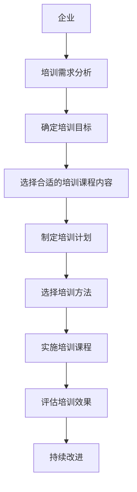

                 

# 开源项目的企业培训课程：开发和营销策略

> 关键词：开源项目、企业培训、软件开发、市场营销、课程设计

## 1. 背景介绍

在当今快速变化的技术和市场环境中，企业越来越依赖于开源项目来驱动创新和竞争优势。然而，成功利用开源项目并非易事，不仅需要强大的技术基础，还需要有效的开发和营销策略。为了帮助企业高效利用开源项目，本文将探讨如何通过培训课程的形式，将开发和营销策略系统地传递给企业内部人员，以提升他们的开源项目管理能力。

## 2. 核心概念与联系

### 2.1 核心概念概述

- **开源项目**：指通过共享代码、文档、设计和其它技术成果，允许任何人使用、修改和分发这些技术的项目。开源项目通常遵循特定的许可协议，如Apache、MIT、GPL等。

- **企业培训**：指通过有组织的教育活动，向员工传授新技能、知识和最佳实践，以提升他们的专业能力和工作表现。

- **软件开发**：涉及使用编程语言和工具，设计和实现软件应用程序的过程。

- **市场营销**：指策划、实施、评估和优化各种营销策略，以提高品牌知名度、吸引客户、增强用户参与度。

- **课程设计**：指基于目标受众的需求和特点，规划、组织和实施培训课程的过程。

这些概念之间的联系体现在企业培训课程如何帮助企业员工提升开源项目开发和市场营销技能，从而更有效地利用开源项目。

### 2.2 核心概念原理和架构的 Mermaid 流程图

## 3. 核心算法原理 & 具体操作步骤

### 3.1 算法原理概述

基于开源项目的企业培训课程开发和营销策略，通常遵循以下算法原理：

- **需求分析**：通过调研企业内部的实际需求，确定培训的优先级和重点。
- **目标设定**：明确培训的预期成果和员工能力的提升目标。
- **内容设计**：根据目标，设计课程内容，包括理论知识、实践技能和案例分析。
- **方法选择**：选择合适的培训方法，如在线课程、工作坊、研讨会等。
- **课程实施**：按照计划，实施培训课程，并确保知识传递的有效性。
- **效果评估**：通过测试、反馈和行为观察，评估培训的成效。
- **持续改进**：根据评估结果，持续优化培训课程和教学方法。

### 3.2 算法步骤详解

**Step 1: 培训需求分析**
- 通过问卷调查、访谈、观察等方式，了解企业对开源项目的依赖程度、员工的现有技能水平以及企业面临的具体挑战。
- 识别需要提升的关键技能，如软件开发、项目管理、版本控制、文档编写、市场营销等。

**Step 2: 确定培训目标**
- 基于需求分析的结果，设定清晰的培训目标。例如，提升员工对某个开源项目的使用效率，增强对开源项目的贡献能力，提高市场营销能力等。

**Step 3: 选择合适的培训课程内容**
- 根据培训目标，选择或定制相关的课程内容。例如，编程语言基础、项目管理和营销策略等。
- 确保课程内容与企业实际情况紧密结合，避免理论脱离实际。

**Step 4: 制定培训计划**
- 制定详细的培训计划，包括课程时间安排、教学资源、培训师资、评估方法等。
- 考虑员工的接受能力和时间安排，设计灵活的培训日程。

**Step 5: 选择培训方法**
- 根据培训目标和课程内容，选择最适合的培训方法。例如，在线学习、面对面培训、模拟实战等。
- 考虑员工的学习习惯和偏好，选择合适的教学形式。

**Step 6: 实施培训课程**
- 按照计划，组织和实施培训课程。确保培训师资的专业性和教学方法的有效性。
- 提供充足的实践机会，通过案例分析、模拟实战等方式加深理解。

**Step 7: 评估培训效果**
- 通过测试、反馈、行为观察等方式，评估培训的实际效果。例如，培训后员工的技术水平、项目贡献度、市场营销能力等。
- 收集数据和反馈，进行定量定性的评估。

**Step 8: 持续改进**
- 根据评估结果，识别培训中的问题和不足，调整课程内容和教学方法。
- 建立反馈循环，持续优化培训效果，提高员工的实际应用能力。

### 3.3 算法优缺点

**优点**：
- **成本效益**：相比于传统的培训方式，开源项目培训课程具有成本较低、灵活性高、覆盖面广等优点。
- **知识共享**：开源项目通常遵循共享和协作的精神，培训课程能够促进知识共享，提升团队整体能力。
- **持续改进**：通过不断评估和优化，培训课程能够持续提升员工的实际应用能力，适应技术变化。

**缺点**：
- **自驱力要求高**：员工需要具备一定的自我学习能力，才能充分利用培训课程。
- **课程内容设计复杂**：设计既满足理论要求又实用的课程内容具有挑战性。
- **培训师资需求高**：需要具备专业知识和实践经验的师资团队，以确保培训效果。

### 3.4 算法应用领域

基于开源项目的企业培训课程开发和营销策略，可以广泛应用于以下几个领域：

- **软件开发团队**：提升员工对开源项目的使用效率、代码质量、版本控制等技能。
- **项目管理团队**：增强开源项目的管理能力，包括需求分析、任务分配、进度跟踪等。
- **市场营销团队**：提高企业对开源项目的市场营销能力，包括品牌建设、用户社区管理等。
- **管理层**：理解开源项目对企业战略和运营的影响，制定相应的支持策略。

## 4. 数学模型和公式 & 详细讲解 & 举例说明

### 4.1 数学模型构建

基于开源项目的企业培训课程开发和营销策略，可以构建以下数学模型：

- **培训效果模型**：描述培训前后员工技能水平的变化。
- **成本效益模型**：评估培训成本与培训效果之间的关系。
- **员工参与度模型**：衡量员工对培训课程的参与度和满意度。

### 4.2 公式推导过程

**培训效果模型**：

设员工初始技能水平为 $S_0$，培训后技能水平为 $S_1$，培训效果为 $E$。则有：

$$
S_1 = S_0 + E
$$

**成本效益模型**：

设培训总成本为 $C$，员工通过培训获得的收益为 $B$。则有：

$$
B = C \times \frac{S_1}{S_0}
$$

**员工参与度模型**：

设员工对培训课程的参与度为 $P$，满意度为 $S$。则有：

$$
P = \frac{1}{2} (S + 1)
$$

### 4.3 案例分析与讲解

以一个开源项目的企业培训课程为例：

- **需求分析**：企业希望提升员工对某个开源框架的使用效率。
- **培训目标**：提升员工对开源框架的熟练度，增强项目贡献能力。
- **内容设计**：包括框架的使用指南、常见问题解答、实战演练等。
- **方法选择**：选择在线学习平台，结合实战演练。
- **课程实施**：通过视频课程、在线论坛、实时问答等方式实施培训。
- **效果评估**：通过考试、项目贡献度、用户反馈等方式评估培训效果。
- **持续改进**：根据评估结果，调整课程内容和教学方法。

## 5. 项目实践：代码实例和详细解释说明

### 5.1 开发环境搭建

**Step 1: 准备开发工具**
- 安装Python和必要的库，如TensorFlow、PyTorch、Jupyter Notebook等。
- 确保开发环境与企业现有的开源项目和技术栈兼容。

**Step 2: 构建课程管理系统**
- 使用Django或Flask等框架，构建课程管理系统，实现课程的创建、管理、发布和评估。
- 引入认证和权限管理机制，确保课程内容的安全性和可控性。

### 5.2 源代码详细实现

**Step 1: 设计课程结构**
- 确定课程的模块和课时，包括理论课程、实践课程、案例分析等。
- 设计课程的进度计划和评估标准。

**Step 2: 开发课程内容**
- 制作视频课程、编写课程讲义、设计实践项目等。
- 确保课程内容的完整性和实用性。

**Step 3: 实施课程**
- 将课程内容上传到课程管理系统，提供给员工学习。
- 设置学习进度和评估标准，引导员工完成学习。

### 5.3 代码解读与分析

**视频课程制作**：
- 使用Adobe Premiere Pro、After Effects等工具制作视频课程。
- 录制专家讲解，穿插示例和演示，增加学习的吸引力。

**课程讲义编写**：
- 编写详细的课程讲义，涵盖理论知识、实践技能、案例分析等。
- 使用Markdown格式，方便课程管理系统管理。

**实践项目设计**：
- 设计实际项目或模拟实战，供员工在课程结束后进行练习。
- 提供代码库、文档和指南，帮助员工完成项目。

### 5.4 运行结果展示

- **课程管理系统界面**：展示课程列表、课程详情、学习进度、学习评估等功能。
- **学习报告**：记录员工的学习情况、测试成绩、项目贡献度等。
- **培训效果评估报告**：分析培训前后技能水平的变化，评估培训的效果。

## 6. 实际应用场景

### 6.1 软件开发团队

- **需求**：提升员工对某个开源框架的使用效率和代码质量。
- **解决方案**：设计针对该框架的培训课程，包括框架的使用指南、常见问题解答、实战演练等。
- **预期效果**：员工能够高效使用框架，提升项目贡献度，减少开发成本。

### 6.2 项目管理团队

- **需求**：增强开源项目的管理能力，包括需求分析、任务分配、进度跟踪等。
- **解决方案**：设计项目管理相关的培训课程，涵盖敏捷开发、Scrum、Git等知识。
- **预期效果**：项目管理团队能够高效地管理开源项目，提升项目交付质量。

### 6.3 市场营销团队

- **需求**：提高企业对开源项目的市场营销能力，包括品牌建设、用户社区管理等。
- **解决方案**：设计市场营销相关的培训课程，涵盖社交媒体营销、用户社区管理、内容创作等。
- **预期效果**：市场营销团队能够更好地推广和维护开源项目，提升用户参与度。

### 6.4 未来应用展望

基于开源项目的企业培训课程开发和营销策略，未来将朝着以下几个方向发展：

- **个性化培训**：根据员工的职业发展和技能需求，提供定制化的培训课程。
- **实时反馈和调整**：通过实时反馈和评估，及时调整培训课程内容和方法，确保培训效果。
- **跨部门协作**：促进跨部门协作，提升员工综合能力，推动企业整体创新。
- **全球化培训**：适应国际化需求，提供多语言、多地区的培训课程，提升全球竞争力。

## 7. 工具和资源推荐

### 7.1 学习资源推荐

- **Coursera、edX**：提供高质量的在线课程，涵盖软件开发、项目管理、市场营销等领域的培训。
- **Udemy、Pluralsight**：提供实用的技能培训，包括开源项目的使用、开发和管理等。
- **GitHub、Stack Overflow**：提供丰富的开源项目和社区支持，供员工学习和交流。

### 7.2 开发工具推荐

- **GitHub**：代码托管和版本控制平台，支持开源项目的管理和协作。
- **JIRA**：项目管理工具，支持敏捷开发和Scrum管理。
- **Slack**：团队沟通工具，支持实时交流和协作。

### 7.3 相关论文推荐

- **《Open Source Software Adoption and Utilization: A Survey》**：提供了关于开源项目采用和利用情况的全面综述。
- **《The Impact of Open Source Software on Business and Software Development》**：探讨了开源软件对商业和软件开发的影响。
- **《Training and Knowledge Sharing in Open Source Communities》**：讨论了开源社区的培训和知识共享机制。

## 8. 总结：未来发展趋势与挑战

### 8.1 研究成果总结

基于开源项目的企业培训课程开发和营销策略，已经在多个企业成功实施，显著提升了员工的开发和市场营销能力，推动了企业的技术创新和市场拓展。

### 8.2 未来发展趋势

- **自动化和智能化**：利用人工智能和机器学习技术，实现培训课程的自动推荐和个性化定制。
- **混合学习模式**：结合在线学习和线下培训，提供灵活、高效的学习体验。
- **多渠道传播**：通过多种媒体和平台，扩大培训课程的影响力和覆盖面。

### 8.3 面临的挑战

- **技术多样性**：开源项目和技术栈的多样性给培训课程的设计和实施带来挑战。
- **内容更新**：开源项目和技术不断变化，培训课程需要持续更新和优化。
- **参与度管理**：如何提高员工的参与度和学习效果，是一个重要的挑战。

### 8.4 研究展望

- **混合学习模式的探索**：结合在线和线下培训的优势，探索混合学习模式，提高培训效果。
- **多语言培训的开发**：开发多语言版本的培训课程，支持全球化的人才培养。
- **跨部门协作机制的建立**：建立跨部门协作机制，促进团队协作，提升企业整体能力。

## 9. 附录：常见问题与解答

**Q1: 如何设计一个高效的培训课程？**

**A:** 设计一个高效的培训课程，需要考虑以下几个关键点：
- **目标明确**：确定培训的具体目标和预期成果。
- **内容实用**：课程内容要实用，涵盖理论知识、实践技能和案例分析。
- **师资专业**：选择具备专业知识和实践经验的师资团队。
- **学习互动**：设计互动环节，提高员工的参与度和学习效果。
- **持续改进**：根据反馈和评估结果，持续优化课程内容和教学方法。

**Q2: 如何提高员工的参与度和学习效果？**

**A:** 提高员工的参与度和学习效果，可以从以下几个方面入手：
- **设计互动环节**：通过讨论、案例分析、实战演练等方式，增加互动性。
- **及时反馈**：及时反馈学习进度和测试成绩，激励员工继续学习。
- **鼓励实践**：提供实际项目或模拟实战，增强实践能力。
- **灵活学习方式**：提供多种学习方式，如在线课程、视频教程、实践项目等，适应员工的学习习惯。

**Q3: 如何选择适合企业的培训方式？**

**A:** 选择适合企业的培训方式，需要考虑以下几个因素：
- **员工需求**：了解员工的学习需求和偏好，选择适合的培训方式。
- **培训目标**：根据培训目标，选择合适的培训方法。
- **资源投入**：评估培训资源的投入和产出，选择成本效益最高的方式。
- **学习效果**：通过试点和评估，选择效果最好的培训方式。

**Q4: 如何评估培训课程的效果？**

**A:** 评估培训课程的效果，可以从以下几个方面进行：
- **测试成绩**：通过考试和测验，评估员工的知识掌握情况。
- **项目贡献度**：评估员工在实际项目中的贡献度，判断培训效果。
- **学习反馈**：通过调查问卷和反馈表，收集员工的学习反馈，了解培训效果。
- **行为变化**：观察员工在实际工作中的行为变化，判断培训效果。

**Q5: 如何应对开源项目的技术多样性？**

**A:** 应对开源项目的技术多样性，可以采取以下措施：
- **灵活设计课程**：根据不同的技术和工具，设计灵活的培训课程。
- **跨部门协作**：鼓励跨部门协作，促进技术和知识共享。
- **定期更新课程**：根据技术的变化，定期更新和优化培训课程内容。
- **专家指导**：邀请技术专家进行指导和讲座，提升员工的实际应用能力。

**Q6: 如何建立跨部门协作机制？**

**A:** 建立跨部门协作机制，可以从以下几个方面进行：
- **沟通平台**：使用协作工具，如Slack、Microsoft Teams等，促进跨部门沟通。
- **项目共享**：建立项目共享机制，促进跨部门协作和知识共享。
- **定期会议**：定期召开跨部门会议，协调和解决跨部门协作中的问题。
- **激励机制**：建立激励机制，鼓励跨部门协作和知识共享。

---

作者：禅与计算机程序设计艺术 / Zen and the Art of Computer Programming

