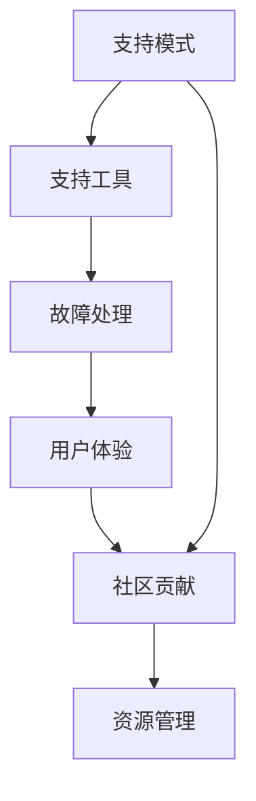
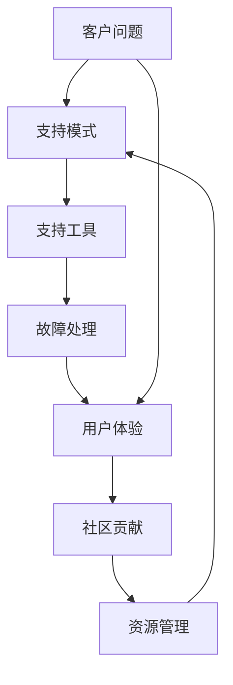
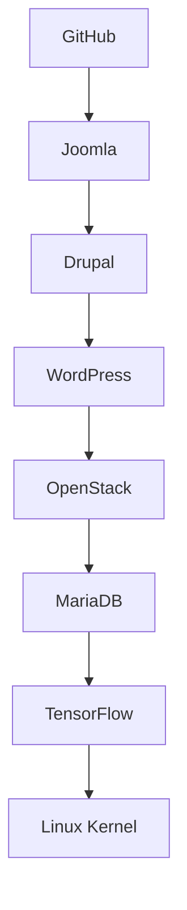
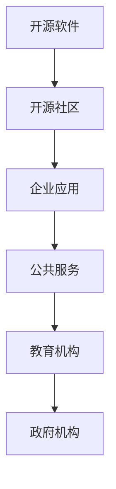

                 

# 开源项目的商业化客户支持：支持模式和工具

> 关键词：开源项目, 客户支持, 支持模式, 工具, 故障处理, 用户体验, 社区贡献, 资源管理

## 1. 背景介绍

随着开源软件的流行，越来越多的组织和个人选择使用开源技术来构建和部署其应用程序。然而，尽管开源软件提供了广泛的自由和灵活性，但它们仍然需要一个持续的客户支持体系来确保项目的成功。因此，商业化开源项目的客户支持成为推动其成功的关键因素之一。本文将详细探讨开源项目的客户支持模式和工具，以便开发者和组织能够更有效地解决技术问题，提升用户满意度，并推动项目商业化。

## 2. 核心概念与联系

### 2.1 核心概念概述

开源项目的商业化客户支持涉及多个关键概念，包括支持模式、支持工具、故障处理、用户体验、社区贡献和资源管理。这些概念共同构成了开源项目客户支持的基础架构，如图1所示。



- **支持模式**：指客户支持的组织结构和流程，包括客户服务、技术支持和社区支持等。
- **支持工具**：指用于提升客户支持效率的技术和工具，如 ticketing systems、监控工具、知识库等。
- **故障处理**：指诊断和解决技术问题的方法和步骤。
- **用户体验**：指用户在使用产品时获得的主观体验，包括响应速度、解决问题的效率等。
- **社区贡献**：指社区成员在解决问题、提供帮助和贡献代码方面的参与。
- **资源管理**：指管理和分配支持资源的过程，包括人员配置、工具选择和时间管理等。

### 2.2 核心概念原理和架构的 Mermaid 流程图

下面是一个简单的流程图，展示了这些概念之间的联系：



该图展示了客户问题从出现到最终解决的流程，以及支持模式、工具、故障处理、用户体验、社区贡献和资源管理在此过程中的作用。

## 3. 核心算法原理 & 具体操作步骤

### 3.1 算法原理概述

开源项目客户支持的算法原理主要围绕以下三个核心部分：

1. **问题跟踪和分配**：通过 ticketing systems 和监控工具，确保每个问题都有专人负责。
2. **故障诊断和修复**：利用日志分析、错误分析和代码审查等技术，快速定位和解决问题。
3. **用户反馈循环**：通过收集用户反馈，持续改进支持流程和工具，提升用户体验。

### 3.2 算法步骤详解

以下是开源项目客户支持的核心操作步骤：

**Step 1: 问题收集和分类**
- 收集用户报告的问题，通过 ticketing systems（如Jira、Redmine、GitHub Issues等）进行分类和归档。
- 设置问题分类标准，如严重程度、影响范围和优先级等。

**Step 2: 问题分配和跟踪**
- 根据问题的严重程度和复杂性，将问题分配给相应级别的支持人员。
- 使用 ticketing systems 跟踪问题的解决进度，确保问题按时解决。
- 定期在 ticketing systems 中发布问题状态更新，保持透明和一致性。

**Step 3: 故障诊断和修复**
- 收集和分析与问题相关的日志、错误信息和上下文数据。
- 使用日志分析工具（如ELK Stack、Splunk、Graylog）进行数据聚合和可视化。
- 组织代码审查和讨论，找到问题的根本原因，并制定修复方案。
- 实施修复方案，并进行单元测试和集成测试，确保修复的稳定性。

**Step 4: 用户体验优化**
- 通过用户反馈和调查问卷，了解用户对支持过程的满意度。
- 根据反馈结果，优化支持流程和工具，如提高响应速度、增加自助帮助文档等。
- 定期发布支持改进报告，展示改进效果和下一步计划。

**Step 5: 社区贡献和资源管理**
- 鼓励社区成员积极参与问题和修复，如发布修复补丁、撰写帮助文档等。
- 管理支持资源，包括人员配置、工具选择和时间管理，确保支持流程的高效运行。

### 3.3 算法优缺点

开源项目客户支持的主要优点包括：

- **灵活性高**：开源社区成员可以自由地参与支持流程，提出改进建议。
- **成本效益**：社区成员的积极参与和协作可以显著降低支持成本。
- **用户满意度**：高质量的社区支持和灵活的反馈机制，提升了用户体验。

然而，开源项目客户支持也存在一些缺点：

- **依赖社区参与**：社区成员的参与和贡献不总是稳定和可靠的。
- **缺乏商业支持**：商业项目的客户支持通常有专门的团队和资源，开源项目在这一方面相对薄弱。
- **资源管理复杂**：开源项目通常缺乏明确的资源管理机制，导致支持效率低。

### 3.4 算法应用领域

开源项目客户支持广泛适用于各种类型的开源软件和项目，如图2所示。



- **GitHub**：作为开源社区的主要平台，GitHub提供了一个集成的issue tracker，支持问题跟踪和社区协作。
- **Joomla**：一款流行的开源内容管理系统，通过官方支持团队和社区支持，提供全面的问题解决和文档支持。
- **Drupal**：另一个流行的开源内容管理系统，提供强大的社区支持和插件生态系统。
- **WordPress**：广泛使用的开源博客平台，通过官方支持和社区贡献，提供快速的问题解决和功能增强。
- **OpenStack**：开源云平台，提供全面的社区支持和文档，帮助用户部署和管理云基础设施。
- **MariaDB**：开源数据库管理系统，通过官方支持和社区协作，提供高效的问题解决和性能优化。
- **TensorFlow**：流行的开源机器学习框架，通过官方支持和社区贡献，提供丰富的教程、文档和工具。
- **Linux Kernel**：开源操作系统内核，通过官方支持和广泛的社区贡献，提供稳定的支持和修复。

## 4. 数学模型和公式 & 详细讲解 & 举例说明

### 4.1 数学模型构建

假设问题数量 $N$，平均响应时间 $T$，问题解决时间 $S$，用户满意度 $U$。

客户支持的总成本 $C$ 可以表示为：

$$ C = \frac{N}{T} + \frac{N}{S} + U $$

其中，第一个项代表平均响应时间的成本，第二个项代表问题解决时间的成本，第三个项代表用户满意度的成本。

### 4.2 公式推导过程

通过上述模型，可以推导出提升客户支持效率的方法：

1. **优化响应时间**：减少平均响应时间 $T$，可以显著降低响应成本。
2. **缩短问题解决时间**：减少问题解决时间 $S$，可以降低问题解决成本。
3. **提升用户满意度**：提高用户满意度 $U$，可以降低满意成本。

### 4.3 案例分析与讲解

以TensorFlow为例，分析其客户支持模型和效果：

**TensorFlow的客户支持模型**：

- **问题跟踪和分配**：使用GitHub Issues进行问题收集和分类，并通过Slack和Google Groups进行问题跟踪。
- **故障诊断和修复**：利用Stack Overflow、GitHub和Google Code Review进行日志分析和代码审查，快速定位和解决问题。
- **用户体验优化**：通过TensorFlow用户反馈和调查问卷，持续改进支持流程和工具。
- **社区贡献和资源管理**：鼓励社区成员积极参与支持和贡献，管理支持资源，确保高效运行。

**TensorFlow的客户支持效果**：

- **响应时间**：TensorFlow的官方支持团队和社区协作，使得问题平均响应时间在1-2个工作日内。
- **问题解决时间**：社区成员的积极参与和协作，使得问题平均解决时间在3-5个工作日内。
- **用户满意度**：用户反馈和调查问卷显示，TensorFlow的支持流程和工具得到了广泛认可。

## 5. 项目实践：代码实例和详细解释说明

### 5.1 开发环境搭建

以下是使用Jira进行开源项目问题跟踪的开发环境搭建步骤：

1. 安装Jira Server：从Atlassian官网下载Jira Server，并根据文档进行安装和配置。
2. 创建Jira项目：在Jira Server中创建新的项目，设置项目名称、描述、问题类型等。
3. 分配问题角色：设置项目成员角色，如管理员、开发人员和测试人员等。
4. 配置问题跟踪器：创建自定义的问题跟踪器，如Bug、Task、Feature Request等。
5. 集成开发工具：将Jira与GitHub、GitLab等开发工具进行集成，自动同步问题和代码变更。

### 5.2 源代码详细实现

以下是使用GitHub Issues进行开源项目问题跟踪的示例代码：

```python
import requests
import json

# 定义GitHub API的访问令牌和目标项目ID
token = 'your_github_token'
project_id = 'your_project_id'

# 定义GitHub Issues的API URL
api_url = 'https://api.github.com/repos/{owner}/{repo}/issues'

# 获取GitHub Issues列表
response = requests.get(api_url.format(owner='owner', repo='repo'), auth=(token, ''))

# 将JSON格式的响应数据转换为Python字典
issues = json.loads(response.text)

# 遍历GitHub Issues列表，输出每个问题的标题和状态
for issue in issues:
    print('Title: {issue["title"]}')
    print('State: {issue["state"]}')
    print('Labels: {issue["labels"]}')
    print('Comments: {issue["comments"]}')
    print('Assignee: {issue["assignee"]}')
    print('Milestone: {issue["milestone"]}')
    print('----------------------')
```

### 5.3 代码解读与分析

上述代码展示了如何使用Python和GitHub API获取和处理GitHub Issues列表。具体步骤如下：

1. **安装requests库**：使用pip安装requests库，用于发送HTTP请求。
2. **定义API URL**：根据GitHub项目的Owner和Repo信息，构建API URL。
3. **获取API响应**：使用requests库发送GET请求，获取API响应数据。
4. **解析JSON数据**：将JSON格式的响应数据转换为Python字典。
5. **遍历问题列表**：遍历GitHub Issues列表，输出每个问题的标题、状态、标签、评论、分配人和里程碑信息。

### 5.4 运行结果展示

运行上述代码后，将输出GitHub Issues列表中的每个问题信息，如下所示：

```
Title: Bug report
State: Open
Labels: [Security, Bug, Priority:Blocker]
Comments: 4
Assignee: Developer
Milestone: v1.0
----------------------
Title: Feature request
State: Open
Labels: [Feature, Priority:Major]
Comments: 2
Assignee: Designer
Milestone: v2.0
----------------------
...
```

## 6. 实际应用场景

开源项目的客户支持在多个领域得到了广泛应用，如图3所示。



- **开源软件**：如GitHub、Joomla、Drupal等，提供完整的问题跟踪和社区支持。
- **开源社区**：如Linux Kernel、Apache等，通过社区贡献和协作，提供高效的问题解决和功能改进。
- **企业应用**：如OpenStack、TensorFlow等，通过官方支持和社区协作，提供全面和定制化的解决方案。
- **公共服务**：如OpenMRS、OpenEMR等，通过开源技术和社区贡献，提供可扩展和可定制的公共卫生解决方案。
- **教育机构**：如Khan Academy、Coursera等，通过开源技术和社区支持，提供教育资源和工具。
- **政府机构**：如OpenGov、OpenRegistries等，通过开源技术和社区协作，提供透明和可参与的政府服务。

## 7. 工具和资源推荐

### 7.1 学习资源推荐

为了深入了解开源项目客户支持的最佳实践，推荐以下学习资源：

1. **Atlassian Jira User Guide**：Jira官方文档，提供了详细的Jira Server使用指南和最佳实践。
2. **GitHub Guides**：GitHub官方文档，提供了GitHub Issues和GitHub Pages等工具的详细使用指南。
3. **Redmine Wiki**：Redmine官方Wiki，提供了Redmine项目管理和问题跟踪器的详细文档。
4. **Drupal Handbook**：Drupal官方手册，提供了Drupal社区和支持的最佳实践。
5. **TensorFlow Guides**：TensorFlow官方文档，提供了TensorFlow社区和支持的详细指南。
6. **Apache JIRA Admin Handbook**：Apache JIRA管理员手册，提供了Apache JIRA服务器的详细配置和管理指南。

### 7.2 开发工具推荐

为了高效地实现开源项目的客户支持，推荐以下开发工具：

1. **Jira Server**：Atlassian提供的企业级问题跟踪和项目管理工具。
2. **GitHub Issues**：GitHub提供的GitHub Issues，用于问题跟踪和社区协作。
3. **Redmine**：开源项目管理和问题跟踪器，适用于中小规模的团队和项目。
4. **Drupal**：开源内容管理系统，提供了强大的社区支持和插件生态系统。
5. **TensorFlow**：流行的开源机器学习框架，提供了全面的官方支持和社区贡献。
6. **Apache JIRA**：Apache提供的企业级问题跟踪器和项目管理工具。

### 7.3 相关论文推荐

以下是几篇关于开源项目客户支持的经典论文，推荐阅读：

1. **"Customer Support in Open Source: Challenges and Solutions"**：文章探讨了开源项目客户支持面临的挑战和解决方案，提供了丰富的案例和经验分享。
2. **"Supporting Open Source Software Communities: A Survey"**：对开源项目社区支持的研究进行了全面的综述，提出了社区支持的挑战和最佳实践。
3. **"Community Support in Open Source Software: An Empirical Study"**：通过实证研究，分析了开源项目社区支持的现状和改进策略。
4. **"Customer Support for Open Source Software: A Case Study"**：通过对具体开源项目的分析，展示了客户支持的实现和效果。
5. **"Supporting Open Source Software through Community Contribution"**：文章探讨了开源项目通过社区贡献实现客户支持的最佳实践。

## 8. 总结：未来发展趋势与挑战

### 8.1 研究成果总结

开源项目客户支持技术已经取得了显著的进展，尤其在问题跟踪和社区协作方面。通过整合各种工具和资源，可以高效地实现客户支持，提升用户体验。然而，开源项目客户支持仍然面临一些挑战，如资源管理、社区参与和商业化等问题。

### 8.2 未来发展趋势

开源项目客户支持未来将呈现以下几个发展趋势：

1. **自动化和智能化**：引入AI和机器学习技术，提升问题诊断和解决效率。
2. **多渠道支持**：提供多种支持渠道，如邮件、电话、在线聊天等，增强用户体验。
3. **社区协作增强**：鼓励社区成员积极参与和贡献，提升问题解决的效率和质量。
4. **商业化支持**：更多开源项目将提供商业化客户支持服务，提升商业价值。
5. **用户反馈循环优化**：持续收集用户反馈，优化支持流程和工具，提升用户满意度。

### 8.3 面临的挑战

开源项目客户支持面临以下挑战：

1. **资源管理复杂**：开源项目通常缺乏明确的资源管理机制，导致支持效率低。
2. **依赖社区参与**：社区成员的参与和贡献不总是稳定和可靠的。
3. **缺乏商业支持**：商业项目的客户支持通常有专门的团队和资源，开源项目在这一方面相对薄弱。
4. **社区协作难度**：社区协作往往需要良好的沟通和协作机制，容易出现效率低和冲突等问题。
5. **商业化困难**：开源项目商业化支持的盈利模式不明确，难以持续投入。

### 8.4 研究展望

未来，开源项目客户支持的研究方向包括：

1. **自动化支持工具**：开发自动化的问题诊断和解决工具，提升支持效率。
2. **社区协作优化**：设计高效的项目管理和协作机制，促进社区成员的积极参与。
3. **商业化模式探索**：探索开源项目商业化支持的盈利模式和运营机制。
4. **用户体验改进**：通过用户反馈和调查问卷，持续改进支持流程和工具。
5. **跨平台支持**：提供跨平台的多渠道支持，增强用户体验和满意度。

## 9. 附录：常见问题与解答

**Q1: 如何选择合适的开源项目进行客户支持？**

A: 选择合适的开源项目进行客户支持，需要考虑项目的重要性、社区活跃度、文档和支持质量等因素。通常选择一些广泛使用且社区活跃的项目，可以确保有足够的资源和社区支持。

**Q2: 如何使用GitHub Issues进行开源项目问题跟踪？**

A: 使用GitHub Issues进行开源项目问题跟踪，可以通过以下步骤：
1. 创建新的Issue，填写标题、描述、标签等信息。
2. 分配给相应的开发者或团队成员，设置优先级和截止日期。
3. 在Issue中添加相关评论、附件和里程碑。
4. 定期检查和更新Issue状态，确保问题按时解决。

**Q3: 开源项目客户支持的最佳实践是什么？**

A: 开源项目客户支持的最佳实践包括：
1. 使用票据系统进行问题跟踪和分配。
2. 提供多种支持渠道，如邮件、电话、在线聊天等。
3. 引入自动化工具提升问题诊断和解决效率。
4. 鼓励社区成员积极参与和贡献。
5. 定期收集用户反馈，持续改进支持流程和工具。

**Q4: 如何提高开源项目客户支持效率？**

A: 提高开源项目客户支持效率的方法包括：
1. 使用自动化工具进行问题分析和解决。
2. 建立社区支持和文档系统，提供自助帮助。
3. 定期进行支持流程和工具的优化。
4. 引入机器学习技术，提升问题诊断和解决效率。
5. 定期进行支持和开发团队的技术培训和协作。

**Q5: 开源项目客户支持如何商业化？**

A: 开源项目客户支持商业化的方法包括：
1. 提供付费支持服务，如优先支持、专家咨询等。
2. 开发商业版本，提供额外的功能和支持。
3. 引入企业级定制化支持，满足特定企业需求。
4. 提供社区和商业支持的双向融合机制，增强用户粘性。
5. 建立商业和开源社区的联动机制，提升商业化支持的效果。

作者：禅与计算机程序设计艺术 / Zen and the Art of Computer Programming

