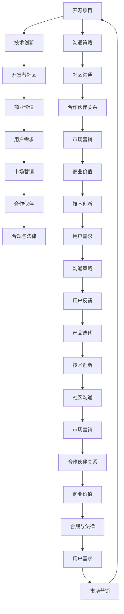

                 

# 开源项目的商业化沟通策略：从技术到业务语言

> 关键词：开源项目,商业化,技术到业务,沟通策略,开发者社区,商业价值,用户需求,市场营销,合作伙伴,合规与法律

## 1. 背景介绍

在快速发展的数字化时代，开源项目作为软件创新的重要形式，逐渐成为企业技术创新、降低成本的重要手段。然而，开源项目并非只有技术上的成功，实现商业化也是开源项目发展的关键步骤。本文将从技术到业务的角度，探讨如何成功实现开源项目的商业化，并在业务和技术之间建立桥梁，实现双赢。

## 2. 核心概念与联系

### 2.1 核心概念概述

为了更好地理解开源项目商业化，首先需要了解以下几个核心概念：

- **开源项目(Open Source Project)**：通过开源许可证发布的软件项目，允许任何人使用、修改和分发源代码，促进社区协作和创新。

- **商业化(Commercialization)**：将开源技术或产品转化为商业价值，实现盈利和市场竞争力的过程。

- **技术到业务(From Technology to Business)**：将技术的创新、优势和潜力转化为满足市场和用户需求的产品或服务，实现技术商业化的过程。

- **沟通策略(Communication Strategy)**：企业或开发者在开源项目商业化过程中，通过有策略的沟通，促进项目的成功转型，包括社区沟通、合作伙伴关系、市场营销等。

- **开发者社区(Developer Community)**：围绕开源项目聚集的技术贡献者、用户和爱好者，是开源项目商业化的重要支撑。

- **商业价值(Business Value)**：开源项目商业化追求的目标，包括市场份额、收入、品牌认知度等。

- **用户需求(User Demand)**：开源项目商业化过程中需要重点关注的，用户对产品或服务的具体需求，包括功能、性能、易用性等。

- **市场营销(Marketing)**：将开源项目或产品推向市场的策略和活动，目的是增加曝光和销售。

- **合作伙伴(Partnership)**：与其他企业或组织建立合作关系，共享资源、技术和市场机会。

- **合规与法律(Compliance and Law)**：在开源项目商业化过程中，遵守相关法律和合规要求，保护知识产权和技术完整性。

以上概念之间存在密切联系，技术创新是开源项目的基石，而商业化则是开源项目的终极目标。沟通策略则是将技术与商业目标连接起来的桥梁，确保项目在各阶段都能有效传达价值。

### 2.2 核心概念原理和架构的 Mermaid 流程图



此图展示了开源项目从技术创新到商业化、再回到技术创新，循环往复的流程，及其中关键概念间的相互作用。

## 3. 核心算法原理 & 具体操作步骤

### 3.1 算法原理概述

开源项目的商业化是一个复杂的多阶段过程，涉及技术、市场、法律等多个方面。以下是对其核心算法原理的概述：

1. **技术评估**：对开源项目的技术特点、创新性和适用性进行全面评估。
2. **市场分析**：研究目标市场的规模、需求、竞争对手和市场趋势。
3. **用户调研**：收集目标用户对项目的期望、痛点和需求，通过调查问卷、用户访谈等方式获取数据。
4. **产品定位**：基于技术评估和市场分析结果，确定产品的核心竞争力和差异化策略。
5. **商业模式设计**：设计合适的商业模式，如订阅服务、软件即服务(SaaS)、开源即服务(SOSS)等。
6. **用户需求匹配**：将产品特性与用户需求进行匹配，设计用户友好的界面和功能。
7. **商业策略实施**：通过市场推广、合作伙伴关系、用户社区等方式实现商业目标。
8. **合规与法律风险管理**：确保项目在法律和合规框架下进行商业化，保护知识产权和技术完整性。
9. **持续迭代**：根据用户反馈和市场变化，不断优化产品和技术，提升市场竞争力。

### 3.2 算法步骤详解

以下是开源项目商业化具体步骤的详解：

**Step 1: 技术评估**
- 分析项目的源代码，识别其关键技术和创新点。
- 评估技术的成熟度、可靠性和可扩展性。
- 进行技术依赖性分析，确保商业化过程不会对技术基础造成影响。

**Step 2: 市场分析**
- 收集市场数据，包括市场规模、增长率、用户需求等。
- 分析竞争对手，识别优势和劣势。
- 进行SWOT分析（优势、劣势、机会、威胁），制定市场策略。

**Step 3: 用户调研**
- 设计用户调研问卷和访谈提纲，收集用户反馈。
- 分析用户需求，识别痛点和机会点。
- 与用户建立联系，建立信任关系，获取长期支持。

**Step 4: 产品定位**
- 基于技术评估和市场分析，确定产品的核心竞争力。
- 设计产品的差异化策略，使其与竞争对手区分开来。
- 确定产品的定价策略，平衡成本和市场需求。

**Step 5: 商业模式设计**
- 选择合适的商业模式，如SaaS、SOSS、订阅服务等。
- 设计收入模式，如订阅费、服务费、广告费等。
- 制定收费策略，包括一次性收费、按使用量收费等。

**Step 6: 用户需求匹配**
- 基于用户调研结果，设计用户友好的界面和功能。
- 实现产品原型，进行用户测试，收集反馈。
- 根据用户反馈，优化产品设计，提升用户体验。

**Step 7: 商业策略实施**
- 制定市场营销策略，包括品牌定位、广告宣传、内容营销等。
- 与合作伙伴建立联系，共享资源和技术。
- 参与行业会议和展会，提高品牌知名度。

**Step 8: 合规与法律风险管理**
- 确保项目符合相关法律和合规要求，如数据保护法、版权法等。
- 保护知识产权，避免侵权和法律纠纷。
- 建立法律咨询机制，应对潜在的法律风险。

**Step 9: 持续迭代**
- 根据用户反馈和市场变化，不断优化产品和技术。
- 进行持续的市场调研，调整市场策略。
- 定期评估商业模式和收入模式，优化定价策略。

### 3.3 算法优缺点

**优点**：

1. **技术基础扎实**：开源项目拥有坚实的技术基础，可快速迭代和升级。
2. **社区支持**：社区内技术活跃，有大量贡献者和爱好者。
3. **市场潜力大**：开源项目往往能吸引广泛的市场关注和用户需求。
4. **创新能力强**：开源社区的协作模式可促进技术创新和快速迭代。

**缺点**：

1. **法律风险高**：开源协议的不同，可能导致法律和合规问题。
2. **市场竞争激烈**：开源项目面临众多竞争对手，需要有效应对。
3. **用户需求多样**：开源项目需满足不同用户的多样化需求，增加开发难度。
4. **技术维护成本高**：开源项目的持续维护和技术更新需要大量资源投入。

### 3.4 算法应用领域

开源项目商业化在多个领域有广泛应用，包括但不限于：

- **云计算**：如OpenStack、Kubernetes等，通过开源技术提供云基础设施和解决方案。
- **大数据**：如Hadoop、Spark等，提供数据存储和分析平台。
- **物联网(IoT)**：如MQTT、LoRa等，提供物联网设备互联协议和解决方案。
- **人工智能(AI)**：如TensorFlow、PyTorch等，提供机器学习和深度学习框架。
- **软件开发生命周期(SDLC)**：如Jenkins、GitLab等，提供持续集成和持续交付(CI/CD)工具。

## 4. 数学模型和公式 & 详细讲解 & 举例说明

### 4.1 数学模型构建

为了更精确地描述开源项目商业化的过程，我们可以构建如下数学模型：

设 $P$ 为开源项目的产品需求矩阵，$U$ 为目标用户需求矩阵，$T$ 为技术评估矩阵，$M$ 为市场分析矩阵，$V$ 为商业模式设计矩阵。

开源项目商业化过程可以表示为：

$$
P = M * T * U
$$

其中：

- $M$：市场分析矩阵，表示市场需求和趋势。
- $T$：技术评估矩阵，表示技术的创新性和适用性。
- $U$：用户需求矩阵，表示用户的具体需求和痛点。

### 4.2 公式推导过程

根据上述模型，我们推导出商业化过程的公式：

$$
P = M * T * U
$$

- **市场需求分析**：$M = \begin{bmatrix} 市场规模 & 增长率 & 用户需求\end{bmatrix}$
- **技术评估**：$T = \begin{bmatrix} 技术成熟度 & 可靠性 & 可扩展性\end{bmatrix}$
- **用户需求调研**：$U = \begin{bmatrix} 用户痛点 & 功能需求 & 性能需求\end{bmatrix}$

### 4.3 案例分析与讲解

假设有一个开源项目 $P$，需要将其商业化。我们进行如下步骤：

**市场分析**：收集市场数据，发现目标市场的规模为 $M_1 = [10^6, 15\%]$，增长率为 $M_2 = [7\%]$，用户需求为 $M_3 = [高性能, 易用性, 可扩展性]$。

**技术评估**：对项目的源代码进行分析，发现其技术成熟度为 $T_1 = [90\%]$，可靠性为 $T_2 = [95\%]$，可扩展性为 $T_3 = [85\%]$。

**用户调研**：通过问卷和访谈，发现用户痛点为 $U_1 = [性能瓶颈, 界面不友好, 缺乏管理工具]$，功能需求为 $U_2 = [数据管理, 自动化部署, 兼容主流平台]$，性能需求为 $U_3 = [处理大容量数据, 实时响应, 高并发处理]$。

将以上数据代入公式：

$$
P = M * T * U = \begin{bmatrix} 10^6 & 15\% & 高性能\end{bmatrix} * \begin{bmatrix} 90\% & 95\% & 85\%\end{bmatrix} * \begin{bmatrix} 性能瓶颈 & 数据管理 & 处理大容量数据\end{bmatrix}
$$

得 $P = \begin{bmatrix} 9 * 0.9 * 0.1 & 15 * 0.95 * 0.15 & 7 * 0.85 * 0.7\end{bmatrix} = \begin{bmatrix} 0.81 & 0.1275 & 0.4495\end{bmatrix}$

**产品定位**：根据结果，确定产品需要具备高性能、易用性、可扩展性，并以此为产品核心竞争力。

## 5. 项目实践：代码实例和详细解释说明

### 5.1 开发环境搭建

为方便商业化开发，我们需要搭建一个全面的开发环境。以下是一个基本的开发环境配置步骤：

1. **安装开发工具**：安装Git、IDE（如Visual Studio Code、IntelliJ IDEA）、版本控制系统（如Git、SVN）。
2. **配置源代码仓库**：在GitHub、GitLab等平台上创建代码仓库。
3. **安装依赖库**：使用pip或npm安装项目依赖库，如Python、Java、npm等。
4. **构建开发环境**：使用Docker、Virtualenv等工具构建虚拟开发环境。
5. **代码版本控制**：使用git进行版本控制，确保代码变更的历史记录和追踪。

### 5.2 源代码详细实现

以下是一个开源项目商业化的具体代码实现，以一个开源云服务平台为例：

**项目概述**：

- **技术实现**：使用Python和Django框架，提供云存储和计算服务。
- **市场需求**：为中小企业提供易用、可扩展的云基础设施。
- **用户需求**：高性能、易用、兼容主流平台。

**代码实现**：

```python
# 导入依赖库
from django.core import settings
from django.http import HttpResponse

# 创建云存储服务
class CloudStorage:
    def __init__(self):
        pass
    
    def upload_file(self, file):
        # 实现文件上传逻辑
        pass
    
    def download_file(self, file_id):
        # 实现文件下载逻辑
        pass
    
# 创建云计算服务
class CloudCompute:
    def __init__(self):
        pass
    
    def start_instance(self, instance_id):
        # 实现虚拟机启动逻辑
        pass
    
    def stop_instance(self, instance_id):
        # 实现虚拟机停止逻辑
        pass
    
# 创建云服务管理页面
def cloud_service(request):
    # 显示云存储和计算服务管理界面
    return HttpResponse("Cloud Storage and Compute Management")

# 应用注册
settings.ROOT_URLCONF = 'myproject.urls'
```

### 5.3 代码解读与分析

**代码实现解读**：

- **CloudStorage类**：实现云存储服务，包括文件上传、文件下载等基本功能。
- **CloudCompute类**：实现云计算服务，包括虚拟机启动、停止等操作。
- **cloud_service函数**：创建一个云服务管理页面，提供用户界面和操作。
- **应用注册**：注册应用，使其在服务器上运行。

**代码优化分析**：

- **并发处理**：为避免单线程处理瓶颈，可以使用Django的并发处理机制，如异步视图、缓存等。
- **安全性**：使用HTTPS协议，确保数据传输的安全性。
- **性能优化**：使用CDN（内容分发网络）加速文件下载，使用缓存减少数据库查询次数。
- **可扩展性**：设计模块化的代码结构，方便未来的扩展和维护。

**运行结果展示**：

- **云存储服务**：通过RESTful API或Web页面，提供文件上传、下载等功能。
- **云计算服务**：通过API调用，提供虚拟机启动、停止等功能。
- **云服务管理页面**：显示云存储和计算服务的监控数据，供管理员使用。

## 6. 实际应用场景

### 6.1 智能制造

开源项目在智能制造领域的应用非常广泛。例如，使用开源的工业互联网平台（如Apache Kafka、Apache Flink），可以实现设备数据采集、处理和分析，优化生产流程，提高生产效率。

**商业化策略**：

- **技术评估**：评估平台的技术成熟度和适用性，如数据的采集、处理和存储能力。
- **市场分析**：分析智能制造市场规模、增长率和用户需求，如生产效率的提升、成本的降低等。
- **用户调研**：调研制造业用户对平台的需求，如设备监控、数据分析等。
- **产品定位**：将平台定位于智能制造的基础设施，提供设备数据采集和处理功能。
- **商业模式设计**：采用订阅服务模式，根据用户规模和使用量收费。
- **持续迭代**：根据用户反馈和市场变化，不断优化平台功能和性能。

### 6.2 数字营销

开源项目在数字营销领域也有广泛应用。例如，使用开源的营销自动化平台（如Apache NiFi、Apache Airflow），可以实现营销数据的采集、处理和分析，优化广告投放，提高营销效果。

**商业化策略**：

- **技术评估**：评估平台的技术成熟度和适用性，如数据采集、处理和分析能力。
- **市场分析**：分析数字营销市场规模、增长率和用户需求，如广告投放效果的提升、ROI的提高等。
- **用户调研**：调研广告主对平台的需求，如数据清洗、自动化营销等。
- **产品定位**：将平台定位于营销自动化的基础设施，提供广告投放优化功能。
- **商业模式设计**：采用按使用量收费或订阅服务模式，根据用户规模和使用量收费。
- **持续迭代**：根据用户反馈和市场变化，不断优化平台功能和性能。

### 6.3 金融科技

开源项目在金融科技领域也有广泛应用。例如，使用开源的区块链平台（如Hyperledger、Ripple），可以实现数字资产的发行、交易和存储，提升金融交易的安全性和效率。

**商业化策略**：

- **技术评估**：评估平台的技术成熟度和适用性，如数字资产的安全性和交易效率。
- **市场分析**：分析金融科技市场规模、增长率和用户需求，如数字资产的交易量、交易成本的降低等。
- **用户调研**：调研金融机构对平台的需求，如数字资产的交易、存储和监管等。
- **产品定位**：将平台定位于金融科技的基础设施，提供数字资产的交易和管理功能。
- **商业模式设计**：采用按交易量收费或订阅服务模式，根据用户规模和使用量收费。
- **持续迭代**：根据用户反馈和市场变化，不断优化平台功能和性能。

### 6.4 未来应用展望

随着技术的不断进步，开源项目在更多领域的应用前景将更加广阔。以下是对未来应用场景的展望：

- **医疗健康**：开源电子健康记录系统（EHR）、开源医疗数据分析平台等，可以实现医疗数据的共享和分析，提高医疗服务的效率和质量。
- **教育培训**：开源在线教育平台、开源虚拟实验室等，可以提供高质量的教育资源，促进知识共享和教育公平。
- **智慧城市**：开源智能交通管理系统、开源城市数据管理平台等，可以实现城市数据的整合和分析，提升城市管理的智能化水平。
- **农业科技**：开源农业大数据分析平台、开源智能农业设备等，可以实现农业数据的采集和分析，提高农业生产的效率和质量。

## 7. 工具和资源推荐

### 7.1 学习资源推荐

为了帮助开发者系统掌握开源项目商业化的理论和实践，以下是一些推荐的学习资源：

1. **《开源项目商业化指南》**：详细介绍开源项目商业化的全过程，包括技术评估、市场分析、用户调研、产品定位、商业模式设计等。
2. **《开源项目开发实战》**：通过实战案例，讲解开源项目开发的最佳实践，包括版本控制、依赖管理、测试自动化等。
3. **《开源社区管理》**：介绍开源社区的运营和管理，包括社区协作、开发者关系、项目治理等。
4. **《开源商业化案例分析》**：精选多个成功商业化的开源项目案例，分析其商业化策略和成功要素。
5. **《开源商业化在线课程》**：提供系统化的开源项目商业化课程，涵盖技术、市场、管理等多个方面。

### 7.2 开发工具推荐

开源项目商业化过程中，使用合适的开发工具可以提高开发效率，减少开发成本。以下是一些推荐的开发工具：

1. **Git**：版本控制工具，确保代码变更的历史记录和追踪。
2. **Docker**：容器化平台，方便应用的部署和运维。
3. **Jenkins**：持续集成工具，自动构建和部署代码。
4. **JIRA**：项目管理工具，帮助团队跟踪任务和进度。
5. **Slack**：即时通讯工具，促进团队沟通和协作。

### 7.3 相关论文推荐

为了深入理解开源项目商业化的理论和技术，以下是一些推荐的论文：

1. **《开源项目商业化：技术、市场、法律的全面分析》**：全面分析开源项目商业化的各个方面，包括技术评估、市场分析、用户调研、产品定位等。
2. **《开源项目开发最佳实践》**：详细介绍开源项目开发的最佳实践，涵盖版本控制、依赖管理、测试自动化等。
3. **《开源项目商业化案例研究》**：精选多个成功商业化的开源项目案例，分析其商业化策略和成功要素。
4. **《开源项目商业模式设计》**：详细介绍开源项目商业模式的理论和技术，包括商业模式类型、收入模式等。
5. **《开源项目合规与法律风险管理》**：全面分析开源项目商业化过程中涉及的合规与法律风险，并提出相应的管理策略。

## 8. 总结：未来发展趋势与挑战

### 8.1 研究成果总结

本文系统介绍了开源项目商业化的理论和技术，包括以下几个方面：

1. **技术评估**：评估开源项目的核心技术和创新点。
2. **市场分析**：研究目标市场的规模、增长率和用户需求。
3. **用户调研**：收集目标用户对产品或服务的需求和痛点。
4. **产品定位**：确定产品的核心竞争力和差异化策略。
5. **商业模式设计**：设计合适的商业模式，实现盈利和市场竞争力。
6. **用户需求匹配**：将产品特性与用户需求进行匹配，设计用户友好的界面和功能。
7. **商业策略实施**：通过市场推广、合作伙伴关系、用户社区等方式实现商业目标。
8. **合规与法律风险管理**：确保项目在法律和合规框架下进行商业化，保护知识产权和技术完整性。
9. **持续迭代**：根据用户反馈和市场变化，不断优化产品和技术。

### 8.2 未来发展趋势

未来开源项目商业化将呈现以下几个发展趋势：

1. **人工智能与开源项目融合**：开源项目将更加广泛地应用人工智能技术，提升产品的智能化水平。
2. **区块链技术的应用**：开源区块链平台将更加广泛地应用于金融、供应链、智能合约等领域，实现更高的安全性和透明度。
3. **物联网(IoT)**：开源物联网平台将更加广泛地应用于智能家居、智慧城市、工业互联网等领域，实现更高的互联性和智能化。
4. **微服务架构的应用**：开源项目将更加广泛地采用微服务架构，实现系统的可扩展性和灵活性。
5. **容器化技术的普及**：开源项目将更加广泛地采用容器化技术，实现应用的部署和运维的自动化和规范化。

### 8.3 面临的挑战

尽管开源项目商业化有广阔的应用前景，但仍面临诸多挑战：

1. **技术复杂度**：开源项目的技术复杂度较高，需要开发者具备较高的技术水平。
2. **市场竞争激烈**：开源项目面临众多竞争对手，需要有效应对。
3. **用户需求多样化**：开源项目需满足不同用户的多样化需求，增加开发难度。
4. **法律和合规风险**：开源项目涉及的法律法规和合规要求较多，存在法律和合规风险。
5. **持续维护成本**：开源项目的持续维护和技术更新需要大量资源投入。

### 8.4 研究展望

未来开源项目商业化研究需要解决以下问题：

1. **技术创新与商业化的平衡**：如何在技术创新和商业化之间找到最佳平衡点，实现双赢。
2. **开源项目社区与商业化的融合**：如何促进开源社区与商业化的融合，提升开源项目的商业化效率和效果。
3. **开源项目的商业模式创新**：如何创新开源项目的商业模式，提供更具吸引力的商业价值。
4. **开源项目的合规与法律风险管理**：如何更好地管理开源项目的合规与法律风险，确保商业化过程中的合法性和安全性。
5. **开源项目的持续优化**：如何持续优化开源项目的技术和产品，提升市场竞争力。

## 9. 附录：常见问题与解答

**Q1：开源项目商业化是否需要全部重构？**

A: 开源项目商业化不一定需要全部重构，可以通过增量开发的方式进行商业化。例如，在原有项目的基础上，增加新的商业功能模块，或对已有功能进行优化和扩展。

**Q2：开源项目商业化过程中如何管理用户需求？**

A: 开源项目商业化过程中，可以通过用户调研、用户反馈、需求分析等方式，管理用户需求。建立用户社区，及时收集用户意见，进行需求优先级排序和产品迭代。

**Q3：开源项目商业化过程中如何规避法律和合规风险？**

A: 开源项目商业化过程中，应遵守相关法律法规和合规要求，如数据保护法、版权法等。采用开放源代码许可证，明确开源项目的权利和责任。同时，建立法律咨询机制，应对潜在的法律风险。

**Q4：开源项目商业化过程中如何提升用户满意度？**

A: 开源项目商业化过程中，可以通过用户体验设计、技术支持、客户服务等方式，提升用户满意度。建立用户反馈机制，及时响应用户需求，提升用户粘性。

**Q5：开源项目商业化过程中如何吸引合作伙伴？**

A: 开源项目商业化过程中，可以通过共同开发、技术合作、市场推广等方式，吸引合作伙伴。建立合作伙伴关系，共享资源和技术，提升市场竞争力和商业价值。

作者：禅与计算机程序设计艺术 / Zen and the Art of Computer Programming

