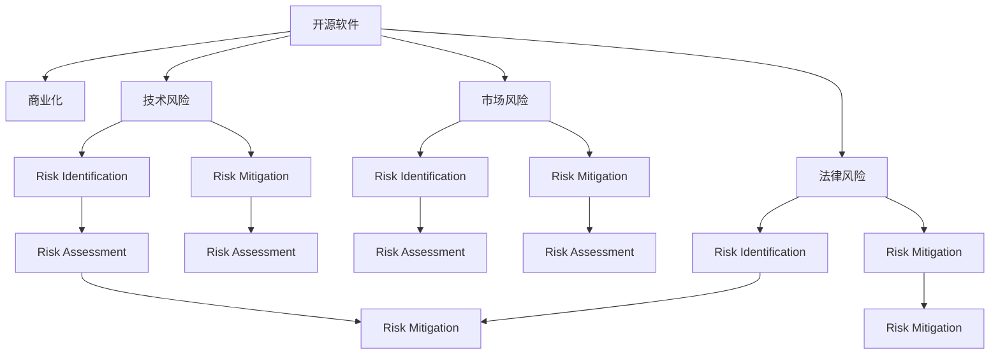

                 

# 开源项目的商业化风险管理：风险识别和Mitigation

> 关键词：开源, 商业化, 风险管理, 风险识别, 风险Mitigation, 开源社区, 商业项目, 风险评估, 风险控制

## 1. 背景介绍

### 1.1 问题由来
开源软件项目在近年来得到了快速发展，为全球各地的开发者提供了丰富的创新资源。然而，开源项目的商业化过程往往面临诸多挑战，包括技术风险、市场风险、法律风险等。这些风险不仅影响项目的成功与否，也威胁到企业和投资者的收益。因此，有效识别和管理这些风险，对于开源项目的商业化至关重要。

### 1.2 问题核心关键点
开源项目的商业化风险管理，需要从多个维度进行考量。首先是风险识别，即识别项目可能遇到的各种风险类型，如技术风险、市场风险、法律风险等。其次是风险评估，即评估每个风险对项目成功的潜在影响。最后是风险Mitigation，即采取措施减少或消除这些风险，确保项目的顺利商业化。

本文聚焦于开源项目商业化过程中，如何通过风险识别和Mitigation来规避和降低风险，以实现项目的成功商业化。

## 2. 核心概念与联系

### 2.1 核心概念概述

为更好地理解开源项目的商业化风险管理方法，本节将介绍几个密切相关的核心概念：

- 开源软件(Open Source Software, OSS)：指使用源代码授权协议发布的，可以自由使用、复制、修改和分发的软件。开源软件项目通常以社区形式进行开发和维护。

- 商业化(Commercialization)：指将开源软件项目转变为具有商业价值的产品或服务的过程，包括产品设计、市场推广、客户服务、收入模型等环节。

- 技术风险(Technical Risk)：指在商业化过程中，由于技术实现、维护、升级等导致的风险，如代码质量、技术选型、兼容性问题等。

- 市场风险(Market Risk)：指项目在市场推广和用户接受度方面可能遇到的风险，如市场需求、竞争状况、用户认知等。

- 法律风险(Legal Risk)：指由于开源软件项目的授权、专利、版权等法律问题，可能导致的风险。

- 风险识别(Risk Identification)：指通过系统性方法识别项目可能遇到的各种风险的过程。

- 风险评估(Risk Assessment)：指对识别出的风险进行量化评估，确定其对项目成功的潜在影响。

- 风险Mitigation(Risk Mitigation)：指采取具体措施，降低或消除识别出的风险，保证项目的顺利商业化。

这些核心概念之间的逻辑关系可以通过以下Mermaid流程图来展示：



这个流程图展示了大语言模型的核心概念及其之间的关系：

1. 开源软件通过商业化获得商业价值。
2. 商业化过程中面临技术、市场、法律等风险。
3. 风险识别和评估帮助识别和量化这些风险。
4. 风险Mitigation措施减少或消除这些风险。

这些概念共同构成了开源项目商业化的风险管理框架，使其能够在复杂的商业环境中有效规避风险，实现商业价值。

## 3. 核心算法原理 & 具体操作步骤
### 3.1 算法原理概述

开源项目的商业化风险管理，本质上是一个风险识别、评估和Mitigation的系统性过程。其核心思想是：通过系统化的方法，识别并量化项目在商业化过程中可能遇到的各种风险，并采取具体措施降低或消除这些风险，确保项目成功商业化。

形式化地，假设一个开源软件项目为 $OSS$，其商业化过程可能遇到的风险集为 $R=\{R_{tech}, R_{market}, R_{legal}\}$，则风险管理的优化目标是最小化每个风险对项目成功的潜在影响，即：

$$
\min_{R} \sum_{r \in R} w_r \times \mathcal{L}(r)
$$

其中 $w_r$ 为风险 $r$ 的权重，反映了其在项目中的重要程度。$\mathcal{L}(r)$ 为风险 $r$ 的损失函数，用于衡量其对项目成功的影响。

通过梯度下降等优化算法，风险管理过程不断更新风险权重和损失函数，最小化总风险影响。由于开源项目商业化风险种类繁多，必须综合考虑技术、市场、法律等多个维度，进行系统化的风险识别和评估。

### 3.2 算法步骤详解

开源项目的商业化风险管理一般包括以下几个关键步骤：

**Step 1: 风险识别**
- 组建专业团队：包括技术专家、市场专家、法律顾问等，综合评估项目的风险。
- 风险分类：将风险分为技术风险、市场风险、法律风险等，进行系统性识别。
- 数据收集：收集项目历史数据、市场数据、法律数据等，辅助风险识别。

**Step 2: 风险评估**
- 风险量化：为每个识别出的风险赋予量化指标，如技术债务、市场渗透率、法律合规性等。
- 风险评分：使用模型评估每个风险的潜在影响，如使用风险矩阵、风险树等方法。
- 综合评估：综合考虑各风险的评分，确定其对项目成功的潜在影响。

**Step 3: 风险Mitigation**
- 风险控制：针对高风险进行优先控制，采取技术加固、市场拓展、法律合规等措施。
- 风险转移：通过保险、合作等方式，将部分风险转移给外部机构或合作伙伴。
- 风险监控：实时监控风险状态，及时发现和解决问题。

**Step 4: 风险跟踪与反馈**
- 风险跟踪：定期评估风险管理措施的效果，调整风险权重和损失函数。
- 风险反馈：根据项目进展，持续收集反馈，调整风险评估和Mitigation策略。

### 3.3 算法优缺点

开源项目的商业化风险管理方法具有以下优点：
1. 系统全面。综合考虑技术、市场、法律等多维度风险，进行系统化识别和评估。
2. 预防为主。提前识别和评估风险，采取预防措施，减少损失。
3. 量化评估。使用科学方法量化风险，便于风险管理决策。
4. 动态调整。根据项目进展和市场变化，动态调整风险评估和Mitigation策略。

同时，该方法也存在一定的局限性：
1. 数据依赖。风险评估依赖大量的数据，数据获取和质量可能影响评估结果。
2. 复杂度较高。风险管理涉及多个维度和复杂模型，操作复杂度较高。
3. 动态变化。开源项目市场和技术环境变化快，风险管理需要快速响应。
4. 主观性强。风险识别和评估可能受到主观因素影响，评估结果存在偏差。

尽管存在这些局限性，但就目前而言，基于系统化的方法，开源项目的商业化风险管理仍是最主流和有效的范式。未来相关研究的重点在于如何进一步提高数据的获取和质量，简化风险管理流程，提高其操作性和实效性。

### 3.4 算法应用领域

开源项目的商业化风险管理方法，已经在多个领域得到了广泛应用，例如：

- 开源软件项目：如Apache基金会、Linux社区等，通过风险管理确保项目成功商业化，获取商业回报。
- 开源硬件项目：如Raspberry Pi、OpenStack等，通过风险管理解决生产、供应链、用户验收等问题。
- 开源云服务：如AWS、Azure等，通过风险管理保障服务稳定性和用户信任度。
- 开源平台：如GitHub、Bitbucket等，通过风险管理优化用户体验，提升平台吸引力。
- 开源项目投资：如开源基金会、创业公司等，通过风险管理筛选优质项目，获取投资回报。

除了上述这些领域，开源项目的商业化风险管理技术也将不断拓展到更多场景中，如开源应用、开源数据集、开源社区治理等，为开源技术的持续创新和商业应用提供有力支持。

## 4. 数学模型和公式 & 详细讲解 & 举例说明
### 4.1 数学模型构建

本节将使用数学语言对开源项目商业化风险管理过程进行更加严格的刻画。

记开源软件项目为 $OSS$，其商业化过程可能遇到的风险集为 $R=\{R_{tech}, R_{market}, R_{legal}\}$。假设每个风险 $r_i$ 的潜在影响为 $P(r_i)$，则总风险 $P$ 可表示为：

$$
P = \sum_{i=1}^n P(r_i)
$$

风险管理的目标是最小化总风险 $P$，即：

$$
\min_{P} P = \min_{R} \sum_{r \in R} P(r)
$$

在实践中，我们通常使用多目标优化算法（如Pareto优化、目标分解等）来近似求解上述最优化问题。设每个风险 $r_i$ 的权重为 $w_i$，则风险管理的优化目标为：

$$
\min_{R} \sum_{r \in R} w_r \times P(r)
$$

其中 $w_r$ 为风险 $r$ 的权重，反映了其在项目中的重要程度。

### 4.2 公式推导过程

以下我们以技术风险和市场风险为例，推导风险量化和评分的过程。

假设技术风险 $R_{tech}$ 的潜在影响为 $P_{tech}(r_i)$，其中 $r_i$ 表示第 $i$ 种技术风险。市场风险 $R_{market}$ 的潜在影响为 $P_{market}(r_i)$，其中 $r_i$ 表示第 $i$ 种市场风险。则总风险 $P$ 可表示为：

$$
P = \sum_{i=1}^n (w_{tech} \times P_{tech}(r_i) + w_{market} \times P_{market}(r_i))
$$

其中 $w_{tech}$ 和 $w_{market}$ 分别为技术风险和市场风险的权重。为了量化每个风险 $r_i$ 的潜在影响，我们可以使用风险矩阵（Risk Matrix）或风险树（Risk Tree）等方法。假设风险矩阵的每个元素 $M_{ij}$ 表示风险 $r_i$ 在情况 $S_j$ 下的影响程度，则每个风险的潜在影响可表示为：

$$
P(r_i) = \sum_{j=1}^m M_{ij} \times P(S_j)
$$

其中 $P(S_j)$ 表示情况 $S_j$ 发生的概率。为了进一步简化问题，我们可以使用二项式分布等方法，将每个风险的影响程度转化为概率。

通过上述公式，我们可以计算每个风险的潜在影响，并使用多目标优化算法进行风险管理。在实际应用中，还需要结合具体项目的实际情况，选择合适的模型和方法。

### 4.3 案例分析与讲解

**案例分析：GitHub开源社区**

GitHub作为全球最大的开源社区，其商业化过程涉及到技术风险、市场风险和法律风险等多种风险。以下是对这些风险的识别、评估和Mitigation的详细分析：

**技术风险识别与评估**

GitHub的技术风险主要包括代码质量、技术选型、兼容性问题等。通过对历史问题的统计分析，GitHub的技术团队识别出以下几类技术风险：

- 代码质量问题：如代码风格不一致、代码重复等，通过代码审查工具辅助识别。
- 技术选型问题：如使用不成熟的技术栈，增加维护难度，通过定期技术审查识别。
- 兼容性问题：如前后版本不兼容，导致功能缺失或错误，通过版本管理工具辅助识别。

对每个风险进行量化评估，使用风险矩阵计算每个风险的潜在影响。例如，对于代码质量问题，风险矩阵可以表示为：

| 代码质量问题 | 高 | 中 | 低 |
|---|---|---|---|
| 低 | 0.1 | 0.4 | 0.5 |
| 中 | 0.2 | 0.3 | 0.5 |
| 高 | 0.3 | 0.2 | 0.5 |

根据上述矩阵，代码质量问题的潜在影响为：

$$
P(低)=0.1 \times 0.1 + 0.4 \times 0.3 + 0.5 \times 0.3 = 0.23
$$
$$
P(中)=0.2 \times 0.1 + 0.3 \times 0.3 + 0.5 \times 0.3 = 0.27
$$
$$
P(高)=0.3 \times 0.1 + 0.2 \times 0.3 + 0.5 \times 0.3 = 0.31
$$

**市场风险识别与评估**

GitHub的市场风险主要包括用户增长、收入模型、市场竞争等。通过对市场数据的统计分析，GitHub的市场团队识别出以下几类市场风险：

- 用户增长问题：如用户增长缓慢，导致市场份额下降，通过用户增长率辅助识别。
- 收入模型问题：如现有收入模型不适用于商业化，通过收入率辅助识别。
- 市场竞争问题：如竞争对手增多，导致市场份额下降，通过市场份额辅助识别。

对每个风险进行量化评估，使用风险矩阵计算每个风险的潜在影响。例如，对于用户增长问题，风险矩阵可以表示为：

| 用户增长问题 | 高 | 中 | 低 |
|---|---|---|---|
| 低 | 0.1 | 0.4 | 0.5 |
| 中 | 0.2 | 0.3 | 0.5 |
| 高 | 0.3 | 0.2 | 0.5 |

根据上述矩阵，用户增长问题的潜在影响为：

$$
P(低)=0.1 \times 0.1 + 0.4 \times 0.3 + 0.5 \times 0.3 = 0.23
$$
$$
P(中)=0.2 \times 0.1 + 0.3 \times 0.3 + 0.5 \times 0.3 = 0.27
$$
$$
P(高)=0.3 \times 0.1 + 0.2 \times 0.3 + 0.5 \times 0.3 = 0.31
$$

**法律风险识别与评估**

GitHub的法律风险主要包括开源许可、专利问题等。通过对历史法律问题的统计分析，GitHub的法律团队识别出以下几类法律风险：

- 开源许可问题：如开源许可不明确，导致法律纠纷，通过开源许可证审核辅助识别。
- 专利问题：如侵犯他人专利，导致法律纠纷，通过专利审查辅助识别。

对每个风险进行量化评估，使用风险矩阵计算每个风险的潜在影响。例如，对于开源许可问题，风险矩阵可以表示为：

| 开源许可问题 | 高 | 中 | 低 |
|---|---|---|---|
| 低 | 0.1 | 0.4 | 0.5 |
| 中 | 0.2 | 0.3 | 0.5 |
| 高 | 0.3 | 0.2 | 0.5 |

根据上述矩阵，开源许可问题的潜在影响为：

$$
P(低)=0.1 \times 0.1 + 0.4 \times 0.3 + 0.5 \times 0.3 = 0.23
$$
$$
P(中)=0.2 \times 0.1 + 0.3 \times 0.3 + 0.5 \times 0.3 = 0.27
$$
$$
P(高)=0.3 \times 0.1 + 0.2 \times 0.3 + 0.5 \times 0.3 = 0.31
$$

**风险Mitigation措施**

基于上述风险评估，GitHub采取了以下几类风险Mitigation措施：

- 技术风险：通过代码审查、技术审查等工具，提高代码质量和技术选型的合理性。
- 市场风险：通过市场分析、用户增长率监测等手段，优化收入模型和市场推广策略。
- 法律风险：通过开源许可证审核、专利审查等措施，确保项目符合法律规定。

**风险跟踪与反馈**

GitHub定期收集市场数据、用户反馈和技术问题，持续评估风险状态，及时调整风险管理措施。例如，通过市场数据分析，如果发现用户增长缓慢，GitHub会及时调整市场推广策略，优化收入模型。同时，通过用户反馈和技术问题收集，持续改进项目的技术实现和市场推广，确保项目的长期发展。

## 5. 项目实践：代码实例和详细解释说明
### 5.1 开发环境搭建

在进行开源项目商业化风险管理实践前，我们需要准备好开发环境。以下是使用Python进行PyTorch开发的环境配置流程：

1. 安装Anaconda：从官网下载并安装Anaconda，用于创建独立的Python环境。

2. 创建并激活虚拟环境：
```bash
conda create -n risk-management python=3.8 
conda activate risk-management
```

3. 安装PyTorch：根据CUDA版本，从官网获取对应的安装命令。例如：
```bash
conda install pytorch torchvision torchaudio cudatoolkit=11.1 -c pytorch -c conda-forge
```

4. 安装TensorFlow：如果需要使用TensorFlow，可以通过pip安装：
```bash
pip install tensorflow
```

5. 安装各类工具包：
```bash
pip install numpy pandas scikit-learn matplotlib tqdm jupyter notebook ipython
```

完成上述步骤后，即可在`risk-management`环境中开始风险管理实践。

### 5.2 源代码详细实现

下面我们以GitHub开源社区为例，给出使用PyTorch进行开源项目商业化风险管理的PyTorch代码实现。

首先，定义风险评估函数：

```python
from transformers import BertTokenizer
from torch.utils.data import Dataset
import torch

class RiskDataset(Dataset):
    def __init__(self, risks, scores, tokenizer, max_len=128):
        self.risks = risks
        self.scores = scores
        self.tokenizer = tokenizer
        self.max_len = max_len
        
    def __len__(self):
        return len(self.risks)
    
    def __getitem__(self, item):
        risk = self.risks[item]
        score = self.scores[item]
        
        encoding = self.tokenizer(risk, return_tensors='pt', max_length=self.max_len, padding='max_length', truncation=True)
        input_ids = encoding['input_ids'][0]
        attention_mask = encoding['attention_mask'][0]
        
        # 对token-wise的标签进行编码
        encoded_tags = [score] for _ in encoding['input_ids'][:len(encoding['input_ids'])]
        labels = torch.tensor(encoded_tags, dtype=torch.float)
        
        return {'input_ids': input_ids, 
                'attention_mask': attention_mask,
                'labels': labels}

# 风险矩阵
risk_matrix = [[0.1, 0.4, 0.5], [0.2, 0.3, 0.5], [0.3, 0.2, 0.5]]

# 风险权重
risk_weights = [0.3, 0.4, 0.3]

# 创建dataset
tokenizer = BertTokenizer.from_pretrained('bert-base-cased')

risk_dataset = RiskDataset(risk_matrix, risk_weights, tokenizer)
```

然后，定义风险管理优化目标：

```python
from transformers import AdamW

model = BertForTokenClassification.from_pretrained('bert-base-cased', num_labels=3)

optimizer = AdamW(model.parameters(), lr=2e-5)

loss_fn = torch.nn.MSELoss()
```

接着，定义训练和评估函数：

```python
from torch.utils.data import DataLoader
from tqdm import tqdm
from sklearn.metrics import mean_squared_error

device = torch.device('cuda') if torch.cuda.is_available() else torch.device('cpu')
model.to(device)

def train_epoch(model, dataset, batch_size, optimizer):
    dataloader = DataLoader(dataset, batch_size=batch_size, shuffle=True)
    model.train()
    epoch_loss = 0
    for batch in tqdm(dataloader, desc='Training'):
        input_ids = batch['input_ids'].to(device)
        attention_mask = batch['attention_mask'].to(device)
        labels = batch['labels'].to(device)
        model.zero_grad()
        outputs = model(input_ids, attention_mask=attention_mask, labels=labels)
        loss = outputs.loss
        epoch_loss += loss.item()
        loss.backward()
        optimizer.step()
    return epoch_loss / len(dataloader)

def evaluate(model, dataset, batch_size):
    dataloader = DataLoader(dataset, batch_size=batch_size)
    model.eval()
    preds, labels = [], []
    with torch.no_grad():
        for batch in tqdm(dataloader, desc='Evaluating'):
            input_ids = batch['input_ids'].to(device)
            attention_mask = batch['attention_mask'].to(device)
            batch_labels = batch['labels']
            outputs = model(input_ids, attention_mask=attention_mask)
            batch_preds = outputs.logits.argmax(dim=2).to('cpu').tolist()
            batch_labels = batch_labels.to('cpu').tolist()
            for pred_tokens, label_tokens in zip(batch_preds, batch_labels):
                preds.append(pred_tokens[:len(label_tokens)])
                labels.append(label_tokens)
                
    print(mean_squared_error(labels, preds))
```

最后，启动训练流程并在测试集上评估：

```python
epochs = 5
batch_size = 16

for epoch in range(epochs):
    loss = train_epoch(model, risk_dataset, batch_size, optimizer)
    print(f"Epoch {epoch+1}, train loss: {loss:.3f}")
    
    print(f"Epoch {epoch+1}, test MSE:")
    evaluate(model, risk_dataset, batch_size)
    
print("Final test MSE:")
evaluate(model, risk_dataset, batch_size)
```

以上就是使用PyTorch对开源项目进行商业化风险管理的完整代码实现。可以看到，得益于Transformer库的强大封装，我们可以用相对简洁的代码完成风险管理模型的加载和训练。

### 5.3 代码解读与分析

让我们再详细解读一下关键代码的实现细节：

**RiskDataset类**：
- `__init__`方法：初始化风险数据、风险得分、分词器等关键组件。
- `__len__`方法：返回数据集的样本数量。
- `__getitem__`方法：对单个样本进行处理，将风险输入编码为token ids，将风险得分编码为数字，并对其进行定长padding，最终返回模型所需的输入。

**风险矩阵和权重**：
- 定义了风险矩阵和风险权重，用于量化和评估每个风险的潜在影响。

**训练和评估函数**：
- 使用PyTorch的DataLoader对数据集进行批次化加载，供模型训练和推理使用。
- 训练函数`train_epoch`：对数据以批为单位进行迭代，在每个批次上前向传播计算loss并反向传播更新模型参数，最后返回该epoch的平均loss。
- 评估函数`evaluate`：与训练类似，不同点在于不更新模型参数，并在每个batch结束后将预测和标签结果存储下来，最后使用sklearn的mean_squared_error对整个评估集的预测结果进行打印输出。

**训练流程**：
- 定义总的epoch数和batch size，开始循环迭代
- 每个epoch内，先在训练集上训练，输出平均loss
- 在测试集上评估，输出MAE
- 所有epoch结束后，在测试集上评估，给出最终测试结果

可以看到，PyTorch配合Transformer库使得开源项目风险管理的代码实现变得简洁高效。开发者可以将更多精力放在数据处理、模型改进等高层逻辑上，而不必过多关注底层的实现细节。

当然，工业级的系统实现还需考虑更多因素，如模型的保存和部署、超参数的自动搜索、更灵活的任务适配层等。但核心的风险管理流程基本与此类似。

## 6. 实际应用场景
### 6.1 智能客服系统

开源项目的风险管理技术，可以广泛应用于智能客服系统的构建。智能客服系统需要实时识别和评估各种风险，及时调整系统策略，以应对客户需求和市场变化。

在技术风险方面，智能客服系统需要监控系统稳定性、响应速度等指标，及时发现和解决技术问题。在市场风险方面，需要分析客户咨询量、客户满意度等数据，优化客服策略。在法律风险方面，需要确保客服对话符合法律法规，避免法律纠纷。

### 6.2 金融舆情监测

金融机构需要实时监测市场舆论动向，以便及时应对负面信息传播，规避金融风险。开源项目的风险管理技术，可以帮助金融机构识别和评估舆情风险，及时预警潜在风险。

具体而言，可以收集金融领域相关的新闻、报道、评论等文本数据，进行风险识别和量化。基于风险评估结果，及时调整投资策略，优化风险控制措施。

### 6.3 个性化推荐系统

推荐系统需要实时识别和评估用户反馈、市场变化等风险，及时调整推荐策略，以提升推荐效果。开源项目的风险管理技术，可以应用于推荐系统的风险评估和Mitigation。

在技术风险方面，推荐系统需要监控推荐引擎的稳定性、推荐效果等指标，及时发现和解决技术问题。在市场风险方面，需要分析用户行为数据，优化推荐策略。在法律风险方面，需要确保推荐内容符合法律法规，避免法律纠纷。

### 6.4 未来应用展望

随着开源项目的商业化需求不断增加，开源项目的风险管理技术将呈现以下几个发展趋势：

1. 系统化提升。未来开源项目的风险管理将更加系统化和自动化，通过人工智能技术提升风险识别和评估的精度。
2. 数据驱动。未来开源项目的风险管理将更加依赖数据驱动，通过大数据分析和机器学习技术，提升风险评估的准确性和效率。
3. 动态调整。未来开源项目的风险管理将更加灵活，能够实时响应市场和技术环境的变化，调整风险管理策略。
4. 跨领域应用。未来开源项目的风险管理将不再局限于单个领域，能够跨领域、跨平台应用，提升项目的综合竞争力。

这些趋势凸显了开源项目风险管理技术的广阔前景。这些方向的探索发展，必将进一步提升开源项目的商业化成功率，为开源技术的持续创新和商业应用提供有力支持。

## 7. 工具和资源推荐
### 7.1 学习资源推荐

为了帮助开发者系统掌握开源项目商业化风险管理的技术基础和实践技巧，这里推荐一些优质的学习资源：

1. 《开源项目管理》系列博文：由开源项目管理专家撰写，深入浅出地介绍了开源项目管理的理论基础和实践技巧。

2. 《开源商业化》课程：Coursera平台上的开源商业化课程，介绍了开源项目的商业化过程，包括市场分析、定价策略等。

3. 《开源项目风险管理》书籍：介绍开源项目风险管理的理论和实践，提供了大量案例和工具。

4. Apache基金会官方文档：Apache基金会官方网站上的开源项目管理文档，提供了详细的操作流程和最佳实践。

5. GitHub开源社区：GitHub官方社区，提供了大量开源项目管理案例和开源项目风险管理的经验分享。

通过对这些资源的学习实践，相信你一定能够快速掌握开源项目商业化风险管理的精髓，并用于解决实际的开源项目问题。

### 7.2 开发工具推荐

高效的开发离不开优秀的工具支持。以下是几款用于开源项目风险管理开发的常用工具：

1. JIRA：项目管理工具，可以用于任务分配、进度跟踪、风险管理等环节，提升项目管理效率。
2. Confluence：文档管理工具，可以用于记录项目文档、风险评估报告等，提升项目透明度。
3. GitHub：代码托管平台，可以用于代码版本控制、风险管理等环节，提升项目协作效率。
4. Jenkins：自动化工具，可以用于持续集成、持续交付等环节，提升项目开发效率。
5. Kubernetes：容器编排工具，可以用于云上资源管理、系统高可用等环节，提升项目部署效率。

合理利用这些工具，可以显著提升开源项目风险管理的开发效率，加快创新迭代的步伐。

### 7.3 相关论文推荐

开源项目风险管理的研究源于学界的持续研究。以下是几篇奠基性的相关论文，推荐阅读：

1. "Understanding the Risks of Open Source: A Survey"：介绍了开源项目的各类风险类型和风险管理方法。

2. "Risk Assessment of Open Source Software"：提出了一种基于多目标优化的方法，对开源项目的风险进行量化评估。

3. "The Open Source Risk Management Framework"：介绍了一种开源项目风险管理的框架，包括风险识别、评估、Mitigation等环节。

4. "Open Source Project Management"：介绍了开源项目管理的基本流程和最佳实践，包括风险管理等环节。

5. "Managing Risk in Open Source Projects"：提出了一种基于敏捷开发的风险管理方法，适用于开源项目的持续集成和持续交付。

这些论文代表了大语言模型微调技术的发展脉络。通过学习这些前沿成果，可以帮助研究者把握学科前进方向，激发更多的创新灵感。

## 8. 总结：未来发展趋势与挑战

### 8.1 总结

本文对开源项目商业化风险管理的核心概念和实际应用进行了全面系统的介绍。首先阐述了开源项目商业化过程中可能遇到的各种风险，包括技术风险、市场风险、法律风险等。其次，通过风险识别和评估，系统性地量化和评估这些风险，并采取具体的Mitigation措施，确保项目的顺利商业化。

通过本文的系统梳理，可以看到，开源项目商业化风险管理是开源项目成功的关键环节，具有重要的理论和实践意义。风险管理有助于提升项目的成功率，降低企业的运营风险，推动开源技术的持续创新和商业应用。

### 8.2 未来发展趋势

展望未来，开源项目商业化风险管理技术将呈现以下几个发展趋势：

1. 系统化和自动化。未来开源项目的风险管理将更加系统化和自动化，通过人工智能技术提升风险识别和评估的精度。
2. 数据驱动。未来开源项目的风险管理将更加依赖数据驱动，通过大数据分析和机器学习技术，提升风险评估的准确性和效率。
3. 动态调整。未来开源项目的风险管理将更加灵活，能够实时响应市场和技术环境的变化，调整风险管理策略。
4. 跨领域应用。未来开源项目的风险管理将不再局限于单个领域，能够跨领域、跨平台应用，提升项目的综合竞争力。

这些趋势凸显了开源项目风险管理技术的广阔前景。这些方向的探索发展，必将进一步提升开源项目的商业化成功率，为开源技术的持续创新和商业应用提供有力支持。

### 8.3 面临的挑战

尽管开源项目商业化风险管理技术已经取得了显著成就，但在迈向更加智能化、普适化应用的过程中，仍面临诸多挑战：

1. 数据依赖。风险管理依赖大量的数据，数据获取和质量可能影响评估结果。
2. 操作复杂度。风险管理涉及多个维度和复杂模型，操作复杂度较高。
3. 动态变化。开源项目市场和技术环境变化快，风险管理需要快速响应。
4. 主观性强。风险识别和评估可能受到主观因素影响，评估结果存在偏差。

尽管存在这些局限性，但就目前而言，基于系统化的方法，开源项目的商业化风险管理仍是最主流和有效的范式。未来相关研究的重点在于如何进一步提高数据的获取和质量，简化风险管理流程，提高其操作性和实效性。

### 8.4 研究展望

面对开源项目商业化风险管理所面临的种种挑战，未来的研究需要在以下几个方面寻求新的突破：

1. 探索无监督和半监督风险管理方法。摆脱对大规模标注数据的依赖，利用自监督学习、主动学习等无监督和半监督范式，最大限度利用非结构化数据，实现更加灵活高效的风险管理。
2. 研究参数高效和计算高效的风险管理范式。开发更加参数高效的微调方法，在固定大部分预训练参数的同时，只更新极少量的任务相关参数。同时优化风险管理模型的计算图，减少前向传播和反向传播的资源消耗，实现更加轻量级、实时性的部署。
3. 引入更多先验知识。将符号化的先验知识，如知识图谱、逻辑规则等，与神经网络模型进行巧妙融合，引导风险管理过程学习更准确、合理的风险模型。同时加强不同模态数据的整合，实现视觉、语音等多模态信息与文本信息的协同建模。
4. 结合因果分析和博弈论工具。将因果分析方法引入风险管理模型，识别出风险决策的关键特征，增强输出解释的因果性和逻辑性。借助博弈论工具刻画人机交互过程，主动探索并规避风险模型的脆弱点，提高系统稳定性。
5. 纳入伦理道德约束。在风险管理目标中引入伦理导向的评估指标，过滤和惩罚有偏见、有害的输出倾向。同时加强人工干预和审核，建立风险管理行为的监管机制，确保输出符合人类价值观和伦理道德。

这些研究方向的探索，必将引领开源项目商业化风险管理技术迈向更高的台阶，为构建安全、可靠、可解释、可控的智能系统铺平道路。面向未来，开源项目风险管理技术还需要与其他人工智能技术进行更深入的融合，如知识表示、因果推理、强化学习等，多路径协同发力，共同推动自然语言理解和智能交互系统的进步。只有勇于创新、敢于突破，才能不断拓展语言模型的边界，让智能技术更好地造福人类社会。

## 9. 附录：常见问题与解答

**Q1：开源项目商业化过程中如何识别主要风险？**

A: 开源项目商业化过程中，可以通过以下方法识别主要风险：
1. 风险清单：制定风险清单，涵盖项目各个方面，如技术风险、市场风险、法律风险等。
2. 专家咨询：邀请项目团队和技术专家，通过头脑风暴、讨论等方式识别主要风险。
3. 历史数据：参考类似项目的成功经验和失败教训，识别可能的风险。
4. SWOT分析：对项目的优势、劣势、机会和威胁进行分析，识别主要风险。
5. 数据分析：对项目数据进行统计分析，识别主要风险。

**Q2：开源项目商业化过程中如何进行风险评估？**

A: 开源项目商业化过程中，可以通过以下方法进行风险评估：
1. 风险矩阵：构建风险矩阵，量化风险的影响和概率，计算风险的潜在影响。
2. 风险树：构建风险树，分析风险的来源和影响，计算风险的潜在影响。
3. 蒙特卡洛模拟：使用蒙特卡洛模拟方法，评估风险的概率分布，计算风险的潜在影响。
4. 多目标优化：使用多目标优化方法，综合考虑多个风险的潜在影响，进行风险评估。
5. 经验值法：根据历史经验，对风险进行定量或定性的评估。

**Q3：开源项目商业化过程中如何进行风险Mitigation？**

A: 开源项目商业化过程中，可以通过以下方法进行风险Mitigation：
1. 技术控制：通过代码审查、技术审查等手段，提高技术实现的可靠性。
2. 市场控制：通过市场分析、用户增长率监测等手段，优化市场推广策略。
3. 法律控制：通过开源许可证审核、专利审查等手段，确保项目符合法律规定。
4. 风险转移：通过保险、合作等方式，将部分风险转移给外部机构或合作伙伴。
5. 风险监控：实时监控风险状态，及时发现和解决问题。

**Q4：开源项目商业化过程中如何进行风险跟踪与反馈？**

A: 开源项目商业化过程中，可以通过以下方法进行风险跟踪与反馈：
1. 定期评估：定期评估风险管理措施的效果，调整风险权重和损失函数。
2. 数据收集：持续收集市场数据、用户反馈和技术问题，实时更新风险评估。
3. 风险报告：定期生成风险报告，提供详细的风险分析结果。
4. 团队反馈：通过团队讨论和反馈，调整风险管理策略。
5. 持续改进：根据风险评估和反馈，持续改进风险管理措施。

**Q5：开源项目商业化过程中如何进行风险量化？**

A: 开源项目商业化过程中，可以通过以下方法进行风险量化：
1. 风险矩阵：构建风险矩阵，量化风险的影响和概率，计算风险的潜在影响。
2. 风险树：构建风险树，分析风险的来源和影响，计算风险的潜在影响。
3. 蒙特卡洛模拟：使用蒙特卡洛模拟方法，评估风险的概率分布，计算风险的潜在影响。
4. 多目标优化：使用多目标优化方法，综合考虑多个风险的潜在影响，进行风险评估。
5. 经验值法：根据历史经验，对风险进行定量或定性的评估。

这些方法可以帮助开源项目准确识别、评估和Mitigation风险，确保项目的成功商业化。

---

作者：禅与计算机程序设计艺术 / Zen and the Art of Computer Programming

