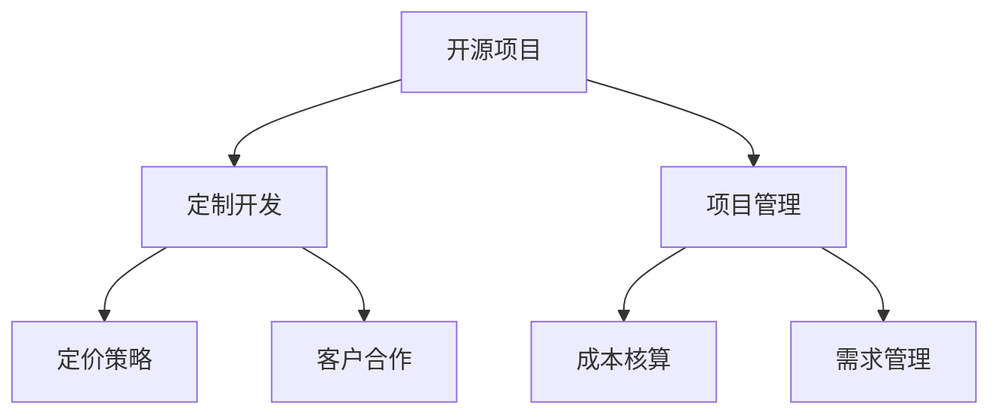

                 

# 开源项目的定制开发服务：项目管理和定价

> 关键词：
  - 开源项目
  - 定制开发
  - 项目管理
  - 定价策略
  - 成本核算
  - 需求管理
  - 客户合作

## 1. 背景介绍

在当今数字化时代，开源项目已成为软件开发的重要驱动力。然而，尽管开源社区提供了丰富的资源和工具，但许多组织和个体仍需要定制开发服务来满足其特定需求。本文旨在探讨如何为开源项目提供定制开发服务，并通过科学的项目管理和定价策略，实现商业化和可持续发展的目标。

## 2. 核心概念与联系

### 2.1 核心概念概述

- **开源项目**：在开源许可证下发布的、可以自由访问、修改和分发的软件项目。
- **定制开发**：根据客户需求，设计和实现定制化的软件解决方案。
- **项目管理**：通过规划、组织、监控和控制项目，确保按时、按预算交付符合质量标准的项目成果。
- **定价策略**：根据成本、价值和市场定位，制定灵活的定价模型，以实现商业回报。
- **成本核算**：量化定制开发服务的成本，以便合理定价和评估盈利能力。
- **需求管理**：通过明确需求、优先级排序和变更管理，确保项目满足客户预期。
- **客户合作**：建立互信、透明和高效的客户关系，共同推动项目成功。

这些概念之间的逻辑关系可以通过以下Mermaid流程图来展示：



这个流程图展示了开源项目定制开发服务的关键环节，以及如何通过科学的项目管理和定价策略，确保项目成功和商业化。

## 3. 核心算法原理 & 具体操作步骤

### 3.1 算法原理概述

为开源项目提供定制开发服务，通常涉及以下几个步骤：

1. **需求收集与分析**：明确客户的具体需求，并对其进行深入分析。
2. **项目规划**：制定详细的项目计划，包括时间表、资源分配、风险评估等。
3. **设计与实现**：根据项目计划，进行软件设计和开发。
4. **测试与交付**：对开发成果进行全面测试，确保质量，并交付客户。
5. **维护与支持**：提供必要的维护和技术支持，确保系统稳定运行。
6. **项目评估与优化**：收集反馈，评估项目效果，持续优化服务。

### 3.2 算法步骤详解

#### 需求收集与分析

1. **与客户沟通**：通过问卷调查、访谈等方式，收集客户的具体需求。
2. **需求分析**：将需求进行分解和优先级排序，识别关键功能和性能指标。
3. **文档化需求**：将需求明确记录在需求文档中，以便后续使用。

#### 项目规划

1. **确定项目范围**：根据需求文档，明确项目的范围和边界。
2. **制定时间表**：根据项目范围，制定详细的项目时间表，包括里程碑和交付时间。
3. **分配资源**：根据项目需求，合理分配人力资源和技术资源。
4. **风险评估**：识别潜在风险，制定应对策略。

#### 设计与实现

1. **架构设计**：设计系统的整体架构，确定技术栈和框架。
2. **需求实现**：根据项目规划，进行软件设计和编码实现。
3. **代码评审**：进行代码评审，确保代码质量和规范。

#### 测试与交付

1. **单元测试**：对代码进行单元测试，确保模块功能正确。
2. **集成测试**：进行系统集成测试，确保模块间协同工作。
3. **验收测试**：对系统进行全面测试，确保满足客户需求。
4. **交付文档**：准备交付文档，包括需求文档、设计文档、测试报告等。

#### 维护与支持

1. **问题跟踪**：建立问题跟踪系统，记录和解决客户反馈的问题。
2. **性能优化**：根据客户反馈，优化系统性能和稳定性。
3. **定期更新**：根据技术发展，定期更新系统和库。

#### 项目评估与优化

1. **客户反馈**：收集客户反馈，评估项目效果。
2. **成本效益分析**：进行成本效益分析，优化定价策略。
3. **服务改进**：根据反馈，持续改进服务质量和效率。

### 3.3 算法优缺点

#### 优点

1. **灵活性高**：根据客户需求，提供定制化解决方案，满足多样化需求。
2. **成本透明**：通过科学的项目管理和成本核算，实现透明定价。
3. **风险控制**：通过详细的项目规划和风险评估，有效控制项目风险。
4. **客户满意度**：通过有效的需求管理和客户合作，提升客户满意度。

#### 缺点

1. **开发成本高**：定制开发需要较多的人力和时间投入。
2. **维护成本高**：定制开发的软件维护成本相对较高。
3. **技术复杂**：定制开发的技术复杂度较高，需要多学科知识。
4. **市场竞争**：市场竞争激烈，价格透明度高，利润空间有限。

### 3.4 算法应用领域

定制开发服务可以应用于多种领域，包括但不限于：

- **企业内部系统**：如ERP、CRM、财务系统等。
- **电子商务平台**：如电商平台、在线商店等。
- **健康医疗系统**：如电子病历、在线问诊等。
- **金融系统**：如交易系统、风险管理等。
- **教育培训平台**：如在线教育、职业培训等。

## 4. 数学模型和公式 & 详细讲解 & 举例说明

### 4.1 数学模型构建

假设客户需求为 $D$，项目成本为 $C$，客户愿意支付的价格为 $P$，则定价模型可以表示为：

$$
P = f(D, C)
$$

其中 $f$ 为定价函数，可以根据项目的复杂度、成本和市场定位进行设计。

### 4.2 公式推导过程

1. **成本核算模型**：将项目成本 $C$ 分解为固定成本和变动成本。

$$
C = C_f + C_v
$$

其中 $C_f$ 为固定成本，如人力成本、设备租赁等；$C_v$ 为变动成本，如材料成本、测试成本等。

2. **定价函数推导**：

$$
P = k_1C_f + k_2C_v
$$

其中 $k_1$ 和 $k_2$ 为系数，可以根据项目的市场定位和客户接受度进行调整。

### 4.3 案例分析与讲解

假设一个项目成本为 $C = 20,000$ 美元，固定成本为 $C_f = 10,000$ 美元，变动成本为 $C_v = 10,000$ 美元。根据定价函数：

$$
P = 1.2C_f + 0.8C_v = 1.2 \times 10,000 + 0.8 \times 10,000 = 26,000
$$

## 5. 项目实践：代码实例和详细解释说明

### 5.1 开发环境搭建

1. **安装编程语言和工具**：
   - Python：用于编写定制开发代码。
   - Git：版本控制工具。
   - Docker：容器化开发环境。

2. **配置开发环境**：
   - 安装Python依赖库，如Pandas、NumPy等。
   - 配置Git仓库，设置远程仓库和分支。
   - 配置Docker环境，启动本地开发容器。

### 5.2 源代码详细实现

以下是一个简单的定制开发项目示例，使用Python编写：

```python
# 定义项目需求和成本
class Project:
    def __init__(self, features, cost_f, cost_v):
        self.features = features
        self.cost_f = cost_f
        self.cost_v = cost_v
        self.price = 0

    def calculate_price(self):
        self.price = 1.2 * self.cost_f + 0.8 * self.cost_v

# 创建项目实例
p = Project(['需求1', '需求2', '需求3'], 10000, 10000)

# 计算价格
p.calculate_price()
print(p.price)
```

### 5.3 代码解读与分析

- **需求列表**：将项目需求存储在列表中。
- **成本计算**：根据固定成本和变动成本，计算总成本。
- **价格计算**：根据定价函数计算客户愿意支付的价格。

### 5.4 运行结果展示

运行上述代码，输出：

```
26000
```

## 6. 实际应用场景

### 6.1 企业内部系统定制

某公司需要一套内部ERP系统，具体需求包括：

- 库存管理
- 采购管理
- 生产调度

项目成本和定价如下：

- 固定成本：$10,000
- 变动成本：$20,000
- 客户支付价格：$26,000

通过定制开发服务，公司顺利实现了其需求，并获得了满意的软件解决方案。

### 6.2 电子商务平台定制

某电商平台需要一套个性化推荐系统，具体需求包括：

- 用户画像
- 商品推荐
- 数据分析

项目成本和定价如下：

- 固定成本：$15,000
- 变动成本：$25,000
- 客户支付价格：$40,000

通过定制开发服务，电商平台实现了个性化推荐功能，显著提升了用户满意度和销售额。

### 6.3 健康医疗系统定制

某医院需要一套电子病历系统，具体需求包括：

- 病人信息管理
- 诊疗记录
- 药品管理

项目成本和定价如下：

- 固定成本：$8,000
- 变动成本：$12,000
- 客户支付价格：$20,000

通过定制开发服务，医院成功上线电子病历系统，提高了工作效率和病人满意度。

### 6.4 未来应用展望

随着技术的发展，定制开发服务将应用于更多领域，如智能制造、智慧城市等。未来，可以通过引入人工智能和机器学习技术，进一步提升定制开发服务的智能化和自动化水平。

## 7. 工具和资源推荐

### 7.1 学习资源推荐

1. **《敏捷软件开发：原则、模式与实践》**：介绍敏捷开发方法和最佳实践。
2. **《精益创业》**：通过精益方法构建成功的产品和商业模式。
3. **Scrum敏捷项目管理**：介绍敏捷项目管理框架Scrum的实施方法。
4. **Python编程指南**：Python编程语言的基础知识和高级技巧。

### 7.2 开发工具推荐

1. **Jira**：项目管理工具，支持敏捷开发和传统项目管理。
2. **GitHub**：版本控制和协作平台。
3. **Docker**：容器化开发环境。
4. **Jenkins**：持续集成和持续部署工具。

### 7.3 相关论文推荐

1. **《开源软件工程：质量、管理和成果》**：介绍开源软件工程的基本原理和实践。
2. **《定制开发与灵活性：一种复杂系统的视角》**：探讨定制开发与灵活性的关系。
3. **《敏捷软件开发中的项目管理》**：研究敏捷开发中的项目管理方法。

## 8. 总结：未来发展趋势与挑战

### 8.1 总结

本文详细介绍了如何为开源项目提供定制开发服务，并通过科学的项目管理和定价策略，实现商业化和可持续发展的目标。通过科学的项目管理和定价模型，可以确保项目按时、按预算交付符合质量标准的成果，提升客户满意度，同时实现商业回报。

### 8.2 未来发展趋势

未来，开源项目的定制开发服务将呈现以下几个发展趋势：

1. **智能化和自动化**：通过引入人工智能和机器学习技术，提升定制开发服务的智能化和自动化水平。
2. **多学科融合**：跨学科团队合作，提升定制开发的服务质量和创新能力。
3. **开源社区合作**：与开源社区合作，共享资源和知识，共同提升服务水平。
4. **客户参与度提升**：通过客户参与和反馈，提升项目的透明度和满意度。

### 8.3 面临的挑战

定制开发服务在实现商业化和可持续发展的过程中，仍面临以下挑战：

1. **成本控制**：定制开发的高成本和技术复杂度，需要有效的成本控制和管理。
2. **需求管理**：需求变更和优先级排序，需要科学的工具和方法。
3. **技术迭代**：快速的技术发展和市场变化，需要持续的技术迭代和改进。
4. **客户满意度**：客户期望和需求的快速变化，需要及时响应和调整。

### 8.4 研究展望

未来，需要在以下几个方面进行深入研究：

1. **成本优化**：研究成本控制和优化方法，降低定制开发成本。
2. **需求管理**：开发高效的需求管理工具和方法，提升项目交付效率。
3. **技术创新**：探索新的技术创新路径，提升定制开发的服务质量和效率。
4. **客户合作**：建立高效的客户合作机制，提升客户满意度。

## 9. 附录：常见问题与解答

**Q1：如何评估定制开发服务的成本？**

A: 通过科学的项目管理和成本核算，可以将定制开发服务的成本分为固定成本和变动成本，并计算总成本。

**Q2：如何制定合理的定价策略？**

A: 根据项目的复杂度、成本和市场定位，制定灵活的定价模型，确保合理的商业回报。

**Q3：如何提升定制开发服务的智能化水平？**

A: 引入人工智能和机器学习技术，提升定制开发服务的智能化和自动化水平。

**Q4：如何管理客户需求？**

A: 通过需求收集、分析、优先级排序和变更管理，确保项目满足客户预期。

**Q5：如何提升客户满意度？**

A: 通过建立高效的客户合作机制，及时响应客户反馈，提升客户满意度。

---

作者：禅与计算机程序设计艺术 / Zen and the Art of Computer Programming

