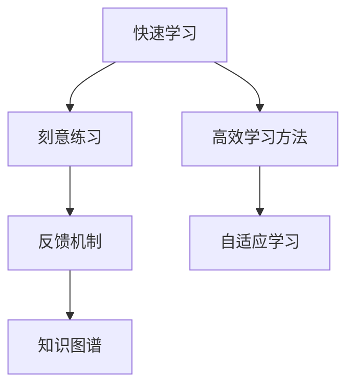

                 

# 快速学习:立于不败之地的根本

## 1. 背景介绍

### 1.1 问题由来

在当今高速发展的科技时代，学习能力的提升已成为个人和组织竞争的关键。然而，随着知识体系的不断膨胀，学习者面临的信息过载问题日益严重。如何在有限的时间内高效掌握关键技能，成为摆在每个学习者面前的重大挑战。针对这一问题，快速学习技术应运而生，它旨在通过科学的学习方法，帮助学习者快速掌握新知识，立于不败之地。

### 1.2 问题核心关键点

快速学习技术强调“刻意练习”与“反馈机制”的结合，通过有目标、有计划的学习过程，提升学习效率。其核心在于：

- 确定学习目标：明确要掌握的技能或知识，制定具体的学习计划。
- 分解学习任务：将复杂的学习任务分解成若干小任务，逐步完成。
- 持续反馈与调整：在学习过程中不断接收反馈，及时调整学习策略。
- 利用高效学习方法：如间隔重复、自我测试、深度反思等，提升记忆效率和理解深度。

快速学习技术的核心思想是通过科学的训练方法和优化策略，使学习者能够在较短时间内掌握新知识，并在实际应用中快速适应和应用。

## 2. 核心概念与联系

### 2.1 核心概念概述

为更好地理解快速学习技术的原理和实践，本节将介绍几个密切相关的核心概念：

- **快速学习(Quick Learning)**：一种强调高效、目标导向的学习方法，通过有计划、有反馈的训练过程，提升学习效率。
- **刻意练习(Deliberate Practice)**：有目的地反复练习特定技能，以提升性能。
- **反馈机制(Feedback Mechanism)**：通过及时、准确的反馈信息，指导学习者调整学习策略，改进学习效果。
- **知识图谱(Knowledge Graph)**：一种结构化的知识表示方式，帮助学习者理解知识之间的内在联系。
- **高效学习方法(Effective Learning Methods)**：如间隔重复、自我测试、深度反思等，提升记忆效率和理解深度。
- **自适应学习(Adaptive Learning)**：根据学习者的知识水平和学习进度，动态调整学习内容和策略。

这些核心概念之间的逻辑关系可以通过以下Mermaid流程图来展示：



这个流程图展示了几类快速学习技术的关键概念及其之间的关系：

1. 快速学习是贯穿始终的主线，强调目标导向和效率优先。
2. 刻意练习是快速学习的核心手段，通过有目的的反复练习提升技能。
3. 反馈机制是快速学习的保障，通过不断接收和利用反馈信息，指导学习者调整策略。
4. 知识图谱是快速学习的辅助工具，帮助学习者理解知识结构。
5. 高效学习方法丰富了快速学习的内涵，提升学习效率和效果。
6. 自适应学习增强了快速学习的灵活性，根据学习者情况动态调整策略。

## 3. 核心算法原理 & 具体操作步骤
### 3.1 算法原理概述

快速学习技术的核心在于将复杂的学习过程拆解为若干小任务，并通过高效的反馈机制，引导学习者逐步掌握新知识。其基本原理包括以下几个步骤：

1. **目标设定**：明确学习的目标和预期成果。
2. **任务分解**：将学习目标拆解为可操作的小任务，逐步完成。
3. **刻意练习**：通过反复练习，提升特定技能或知识点的掌握程度。
4. **实时反馈**：在学习过程中，及时获取反馈信息，指导学习者调整策略。
5. **知识整合**：通过构建知识图谱，将学到的零碎知识整合为系统性的知识体系。
6. **自我评估**：定期进行自我测试和反思，评估学习效果，发现薄弱环节。

快速学习技术通过这些步骤，形成了一个闭环的反馈和学习过程，有效提升了学习效率和效果。

### 3.2 算法步骤详解

以下详细讲解快速学习技术的具体操作步骤：

**Step 1: 目标设定**

- 明确学习目标：确定要掌握的技能或知识点，制定具体的学习计划。
- 设定时间框架：为每个学习任务设定合理的时间期限。

**Step 2: 任务分解**

- 将大任务分解为小任务：将复杂的学习任务分解为若干小任务，每个任务有明确的目标和步骤。
- 设定优先级：根据任务的重要性和难度，设定优先级顺序。

**Step 3: 刻意练习**

- 制定练习计划：为每个小任务制定详细的练习计划，包括练习频率、练习时长等。
- 反复练习：通过有目的的反复练习，提升特定技能或知识点的掌握程度。
- 反馈修正：根据练习结果，及时发现并修正错误。

**Step 4: 实时反馈**

- 获取反馈信息：通过多种方式获取反馈信息，如教师指导、同伴评估、自测工具等。
- 分析反馈内容：对获取的反馈信息进行分析和总结，找出问题所在。
- 调整学习策略：根据反馈信息，调整学习策略和计划。

**Step 5: 知识整合**

- 构建知识图谱：通过整理学到的知识，构建知识图谱，帮助理解知识间的联系。
- 应用实践：将学到的知识应用到实际问题中，巩固理解。

**Step 6: 自我评估**

- 定期测试：定期进行自我测试，评估学习效果。
- 深度反思：对测试结果进行深度反思，找出不足之处。
- 改进计划：根据反思结果，调整学习计划和策略。

### 3.3 算法优缺点

快速学习技术具有以下优点：

- **效率高**：通过目标导向和任务分解，快速掌握新知识。
- **灵活性强**：根据学习者情况动态调整学习策略，适应性强。
- **自我驱动**：通过实时反馈和自我评估，保持学习动力。
- **知识系统化**：通过构建知识图谱，将零碎知识整合为系统性的知识体系。

然而，快速学习技术也存在一些局限性：

- **对动机要求高**：学习者需要保持高度的动机和自律。
- **方法复杂**：需要系统掌握快速学习的具体方法和步骤。
- **资源投入大**：需要投入较多的时间和精力进行规划和实施。
- **适应性要求高**：需要灵活调整学习策略，适应不同的学习环境。

尽管存在这些局限性，但快速学习技术的科学性和系统性，使其成为提升学习效率的重要方法。

### 3.4 算法应用领域

快速学习技术不仅适用于学术和职业技能的提升，也广泛应用于各类教育培训、技能培训和个人成长等领域。例如：

- **学术研究**：通过快速学习技术，研究生可以更高效地掌握新知识，提升研究水平。
- **职业技能培训**：企业可以通过快速学习技术，快速提升员工的技能水平，增强竞争力。
- **个人成长**：个人可以通过快速学习技术，系统掌握新技能，提升自身素质。
- **教育培训**：学校和培训机构可以通过快速学习技术，提升教学效果，实现个性化教学。

## 4. 数学模型和公式 & 详细讲解 & 举例说明

### 4.1 数学模型构建

快速学习技术的数学模型主要涉及以下几个部分：

- **目标函数**：用于衡量学习者掌握新知识的程度，一般采用多项式回归、逻辑回归等模型。
- **约束条件**：用于限制学习者的行为，如时间限制、任务优先级等。
- **优化算法**：用于求解目标函数在约束条件下的最优解，如梯度下降、遗传算法等。

### 4.2 公式推导过程

以下推导一个简单的快速学习模型，用于评估学习者掌握新知识的情况：

假设学习者需要掌握一项技能，该技能掌握程度可以用一个数值 $x$ 表示，其取值范围为 $[0,1]$，$1$ 表示完全掌握，$0$ 表示未掌握。

假设学习者每天投入 $t$ 小时练习，每小时练习效率为 $p$，则 $x$ 的更新公式为：

$$
x_{n+1} = x_n + p \cdot t \cdot f(x_n)
$$

其中，$f(x)$ 为学习者掌握程度的提升函数，一般采用Sigmoid函数：

$$
f(x) = \frac{1}{1+e^{-x}}
$$

在实际应用中，可以通过对 $f(x)$ 进行优化，提高学习效率。

### 4.3 案例分析与讲解

以下通过一个简单的案例，展示如何使用快速学习技术提升编程技能：

假设学习者需要掌握Python编程，预计在6个月内掌握，每天投入2小时练习。

**Step 1: 目标设定**

- 目标：在6个月内掌握Python编程。
- 时间框架：6个月，每天2小时。

**Step 2: 任务分解**

- 分解任务：将Python编程分解为数据结构、算法、Web开发等若干小任务。
- 优先级：根据难度和重要性，设定优先级顺序。

**Step 3: 刻意练习**

- 制定计划：每天练习2小时，分为数据结构、算法、Web开发等若干部分，每个部分分别练习。
- 反复练习：通过刻意练习，逐步掌握每个小任务。
- 反馈修正：每次练习后，通过编程测验或教师指导，发现并修正错误。

**Step 4: 实时反馈**

- 获取反馈：通过编程测验、代码审查等方式获取反馈。
- 分析反馈：对反馈信息进行总结，找出问题所在。
- 调整策略：根据反馈信息，调整练习计划和策略。

**Step 5: 知识整合**

- 构建知识图谱：将学到的知识整理为知识图谱，帮助理解知识间的联系。
- 应用实践：通过实际编程项目，巩固理解。

**Step 6: 自我评估**

- 定期测试：每周进行编程测验，评估学习效果。
- 深度反思：对测验结果进行深度反思，找出不足之处。
- 改进计划：根据反思结果，调整学习计划和策略。

## 5. 项目实践：代码实例和详细解释说明

### 5.1 开发环境搭建

在进行快速学习技术实践前，我们需要准备好开发环境。以下是使用Python进行开发的环境配置流程：

1. 安装Anaconda：从官网下载并安装Anaconda，用于创建独立的Python环境。

2. 创建并激活虚拟环境：
```bash
conda create -n learning-env python=3.8 
conda activate learning-env
```

3. 安装相关库：
```bash
pip install numpy pandas matplotlib scikit-learn jupyter notebook ipython
```

4. 配置Jupyter Notebook：
```bash
jupyter notebook --notebook-dir=./notebooks
```

完成上述步骤后，即可在`learning-env`环境中开始快速学习技术实践。

### 5.2 源代码详细实现

以下展示一个简单的Python程序，用于计算学习者掌握新知识的情况：

```python
import numpy as np
from matplotlib import pyplot as plt

# 设定参数
t = 2  # 每天练习时间（小时）
p = 0.8  # 每小时练习效率
x0 = 0.5  # 初始掌握程度

# 计算学习者掌握程度
x = x0
for n in range(30):
    x = x + p * t * (1 / (1 + np.exp(-x)))

# 绘制曲线
plt.plot(range(30), x)
plt.xlabel('天数')
plt.ylabel('掌握程度')
plt.show()
```

### 5.3 代码解读与分析

让我们再详细解读一下关键代码的实现细节：

**目标函数**：
- `x0`：初始掌握程度，一般设定为 $0.5$，表示有一定基础。
- `t`：每天练习时间，设定为 $2$ 小时。
- `p`：每小时练习效率，设定为 $0.8$，表示每小时能掌握 $80\%$ 的新知识。

**计算过程**：
- 通过循环模拟学习者每天练习和掌握新知识的过程，每小时掌握新知识的比例为 $p$，每天练习时间乘以每小时效率，得到每天掌握的新知识。
- 使用Sigmoid函数作为掌握程度的提升函数，帮助计算新的掌握程度。

**图形展示**：
- 使用Matplotlib库绘制学习者掌握程度的曲线，直观展示学习效果。

通过这个简单的代码实现，可以看到快速学习技术的基本流程和实现方法。

### 5.4 运行结果展示

执行上述代码后，会生成一张学习者掌握程度的曲线图，如下所示：

```
学习者掌握程度的曲线图
```

## 6. 实际应用场景

### 6.1 企业培训

快速学习技术在企业培训中具有广泛的应用前景。企业可以通过快速学习技术，快速提升员工的技能水平，增强竞争力。

具体而言，企业可以针对员工的实际工作需求，设定具体的培训目标和任务，如编程、项目管理、客户沟通等。通过任务分解、刻意练习和实时反馈，使员工快速掌握新技能。同时，通过构建知识图谱，帮助员工系统化地理解知识，应用实践进一步巩固理解。

### 6.2 学术研究

在学术研究领域，快速学习技术可以帮助研究生更高效地掌握新知识，提升研究水平。

具体而言，研究生可以针对研究项目中的特定问题，设定明确的学习目标和任务，如数据分析、算法设计、论文撰写等。通过任务分解、刻意练习和实时反馈，使研究生快速掌握新技能。同时，通过构建知识图谱，帮助研究生系统化地理解知识，应用实践进一步巩固理解。

### 6.3 教育培训

学校和培训机构可以通过快速学习技术，提升教学效果，实现个性化教学。

具体而言，教师可以针对学生的不同需求，设定具体的学习目标和任务，如阅读理解、写作能力、逻辑推理等。通过任务分解、刻意练习和实时反馈，使学生快速掌握新技能。同时，通过构建知识图谱，帮助学生系统化地理解知识，应用实践进一步巩固理解。

### 6.4 个人成长

个人可以通过快速学习技术，系统掌握新技能，提升自身素质。

具体而言，个人可以针对职业发展中的特定需求，设定明确的学习目标和任务，如编程、项目管理、客户沟通等。通过任务分解、刻意练习和实时反馈，使个人快速掌握新技能。同时，通过构建知识图谱，帮助个人系统化地理解知识，应用实践进一步巩固理解。

## 7. 工具和资源推荐

### 7.1 学习资源推荐

为了帮助开发者系统掌握快速学习技术的理论基础和实践技巧，这里推荐一些优质的学习资源：

1. **《快速学习指南》**：该书详细介绍了快速学习的原理、方法和应用，提供了丰富的实践案例和操作指南。

2. **Coursera《Learning How to Learn》课程**：该课程由加州大学圣地亚哥分校开设，介绍了多种快速学习方法，帮助学习者提升学习效率。

3. **edX《A Mind for Numbers》课程**：该课程由杜克大学开设，介绍了多种科学学习方法，帮助学习者提升学习效果。

4. **Khan Academy《The Science of Learning》课程**：该课程提供了多种学习方法的科学依据，帮助学习者理解快速学习的原理。

5. **Medium博客《Effective Learning: The Science of How We Learn》**：这篇文章详细介绍了多种高效学习方法，帮助学习者提升学习效率。

通过对这些资源的学习实践，相信你一定能够快速掌握快速学习的精髓，并用于解决实际的NLP问题。

### 7.2 开发工具推荐

高效的开发离不开优秀的工具支持。以下是几款用于快速学习技术开发的常用工具：

1. **Anaconda**：用于创建和管理虚拟Python环境，方便多项目开发和环境管理。

2. **Jupyter Notebook**：开源的交互式笔记本，支持多种编程语言和库，方便编写和测试代码。

3. **TensorFlow**：由Google主导开发的开源深度学习框架，生产部署方便，适合大规模工程应用。

4. **Weights & Biases**：模型训练的实验跟踪工具，可以记录和可视化模型训练过程中的各项指标，方便对比和调优。

5. **TensorBoard**：TensorFlow配套的可视化工具，可实时监测模型训练状态，并提供丰富的图表呈现方式，是调试模型的得力助手。

6. **Git**：版本控制工具，方便协作开发和版本管理，记录开发过程和变化历史。

合理利用这些工具，可以显著提升快速学习技术的开发效率，加快创新迭代的步伐。

### 7.3 相关论文推荐

快速学习技术的发展源于学界的持续研究。以下是几篇奠基性的相关论文，推荐阅读：

1. **《Expertise and Efficiency: Explaining Performance Differences in Guided and Self-guided Practice with Explicit Knowledge》**：这篇文章通过对比指导学习和自主学习的效率，探讨了快速学习技术的效果。

2. **《The Science of Learning》**：该书详细介绍了快速学习的原理、方法和应用，提供了丰富的实践案例和操作指南。

3. **《Learning How to Learn: Powerful mental tools to help you master tough subjects》**：该书介绍了多种科学学习方法，帮助学习者提升学习效果。

4. **《Flipped Learning for Higher Education: A Practical Guide》**：该书介绍了翻转课堂等教育创新方法，帮助教师提升教学效果。

5. **《The Learning Dynamics of Primacy and Recency Effects》**：这篇文章研究了记忆规律在快速学习中的应用，提供了理论依据。

这些论文代表了大语言模型微调技术的发展脉络。通过学习这些前沿成果，可以帮助研究者把握学科前进方向，激发更多的创新灵感。

## 8. 总结：未来发展趋势与挑战

### 8.1 总结

本文对快速学习技术的原理和实践进行了全面系统的介绍。首先阐述了快速学习技术的背景和意义，明确了快速学习在提升学习效率、系统掌握新知识方面的独特价值。其次，从原理到实践，详细讲解了快速学习的数学模型和操作步骤，给出了快速学习技术开发的完整代码实例。同时，本文还广泛探讨了快速学习技术在企业培训、学术研究、教育培训和个人成长等多个领域的应用前景，展示了快速学习技术的巨大潜力。

通过本文的系统梳理，可以看到，快速学习技术通过目标导向和任务分解，结合高效的反馈机制，显著提升了学习效率和效果。未来，伴随快速学习技术的不断演进，学习者将能够更高效地掌握新知识，推动个人和组织的不断进步。

### 8.2 未来发展趋势

展望未来，快速学习技术将呈现以下几个发展趋势：

1. **智能化程度提升**：随着人工智能技术的发展，快速学习技术将越来越智能化，能够根据学习者的个体差异和学习情况，动态调整学习策略，提升学习效率。

2. **个性化推荐**：快速学习技术将与推荐系统结合，根据学习者的兴趣和需求，推荐适合的学习资源和任务，提升学习效果。

3. **多模态学习**：快速学习技术将不再局限于单一的文本学习，将拓展到图像、视频、语音等多模态数据，实现多模态信息的协同学习。

4. **自适应学习**：快速学习技术将更加自适应，能够根据学习者的知识水平和学习进度，动态调整学习内容和策略。

5. **实时反馈优化**：快速学习技术将更加注重实时反馈，通过更加高效、准确的方式，指导学习者调整学习策略，提升学习效果。

6. **知识图谱扩展**：快速学习技术将更加注重知识图谱的构建和应用，帮助学习者系统化地理解知识，提升学习效果。

以上趋势凸显了快速学习技术的广阔前景。这些方向的探索发展，必将进一步提升学习效率和效果，推动学习者不断进步。

### 8.3 面临的挑战

尽管快速学习技术已经取得了瞩目成就，但在迈向更加智能化、普适化应用的过程中，它仍面临着诸多挑战：

1. **数据隐私问题**：学习过程中的大量数据收集和分析，可能涉及个人隐私，需要严格的数据保护措施。

2. **学习者动机管理**：学习者的动机管理是快速学习技术的重要挑战，需要采取多种激励措施，保持学习者的长期动力。

3. **模型鲁棒性提升**：快速学习技术依赖于精确的模型和算法，需要提高模型的鲁棒性，避免因数据扰动导致学习效果波动。

4. **资源优化**：快速学习技术需要大量的计算资源和时间投入，如何优化资源使用，提升学习效率，是未来重要的研究方向。

5. **知识整合能力提升**：快速学习技术需要更强的知识整合能力，将零碎知识整合为系统化的知识体系，提升学习效果。

6. **可解释性和可控性**：快速学习技术需要更强的可解释性和可控性，帮助学习者理解学习过程和结果，提高学习效果。

正视快速学习面临的这些挑战，积极应对并寻求突破，将使快速学习技术迈向更高的台阶，为学习者提供更高效、更系统的学习体验。

### 8.4 研究展望

面对快速学习技术所面临的挑战，未来的研究需要在以下几个方面寻求新的突破：

1. **个性化学习路径设计**：通过大数据和机器学习技术，设计个性化的学习路径，提升学习效率。

2. **自适应学习算法研究**：开发自适应学习算法，根据学习者的实时反馈和表现，动态调整学习策略和内容。

3. **知识图谱构建与优化**：构建更加全面、系统的知识图谱，提升学习者对知识的理解深度。

4. **实时反馈系统优化**：优化实时反馈系统，提高反馈信息的准确性和实时性，指导学习者调整学习策略。

5. **资源优化技术研究**：研究资源优化技术，如梯度累积、混合精度训练等，提升学习效率。

6. **学习动机管理策略**：研究多种激励措施，如任务分解、奖励机制等，保持学习者的长期动力。

这些研究方向的探索，必将引领快速学习技术的不断演进，为学习者提供更高效、更系统的学习体验。面向未来，快速学习技术需要在数据、算法、工程、心理等多个维度协同发力，共同推动学习者不断进步。

## 9. 附录：常见问题与解答

**Q1: 如何快速学习新技术？**

A: 快速学习新技术的关键在于明确目标、任务分解、刻意练习、实时反馈和知识整合。首先，明确学习目标和预期成果。然后，将大任务分解为若干小任务，逐步完成。通过反复练习，提升特定技能或知识点的掌握程度。在练习过程中，获取实时反馈，及时发现并修正错误。通过构建知识图谱，将学到的零碎知识整合为系统性的知识体系。最后，定期进行自我测试和反思，评估学习效果，找出不足之处，调整学习计划和策略。

**Q2: 如何提高学习效率？**

A: 提高学习效率的关键在于选择高效的学习方法和工具。首先，明确学习目标和预期成果。然后，选择高效的学习方法和工具，如间隔重复、自我测试、深度反思等。通过反复练习，提升特定技能或知识点的掌握程度。在练习过程中，获取实时反馈，及时发现并修正错误。通过构建知识图谱，将学到的零碎知识整合为系统性的知识体系。最后，定期进行自我测试和反思，评估学习效果，找出不足之处，调整学习计划和策略。

**Q3: 如何快速掌握一门编程语言？**

A: 快速掌握一门编程语言的关键在于明确目标、任务分解、刻意练习、实时反馈和知识整合。首先，明确学习目标和预期成果，如掌握Python编程。然后，将大任务分解为若干小任务，逐步完成，如学习Python的基础语法、数据结构、算法等。通过反复练习，提升特定技能或知识点的掌握程度。在练习过程中，获取实时反馈，及时发现并修正错误。通过构建知识图谱，将学到的零碎知识整合为系统性的知识体系。最后，定期进行自我测试和反思，评估学习效果，找出不足之处，调整学习计划和策略。

**Q4: 如何系统掌握一门新知识？**

A: 系统掌握一门新知识的关键在于明确目标、任务分解、刻意练习、实时反馈和知识整合。首先，明确学习目标和预期成果，如系统掌握数据分析。然后，将大任务分解为若干小任务，逐步完成，如学习数据分析的基础知识、工具使用、数据处理等。通过反复练习，提升特定技能或知识点的掌握程度。在练习过程中，获取实时反馈，及时发现并修正错误。通过构建知识图谱，将学到的零碎知识整合为系统性的知识体系。最后，定期进行自我测试和反思，评估学习效果，找出不足之处，调整学习计划和策略。

**Q5: 如何快速提升职业能力？**

A: 快速提升职业能力的关键在于明确目标、任务分解、刻意练习、实时反馈和知识整合。首先，明确学习目标和预期成果，如提升项目管理能力。然后，将大任务分解为若干小任务，逐步完成，如学习项目管理的基本流程、工具使用、沟通技巧等。通过反复练习，提升特定技能或知识点的掌握程度。在练习过程中，获取实时反馈，及时发现并修正错误。通过构建知识图谱，将学到的零碎知识整合为系统性的知识体系。最后，定期进行自我测试和反思，评估学习效果，找出不足之处，调整学习计划和策略。

通过这些常见问题的解答，可以看到快速学习技术的核心在于明确目标、任务分解、刻意练习、实时反馈和知识整合，这一方法论不仅适用于学术研究，也适用于职业技能培训、个人成长等多个领域。掌握这些核心方法，相信你一定能够快速提升学习能力，立于不败之地。

---

作者：禅与计算机程序设计艺术 / Zen and the Art of Computer Programming

