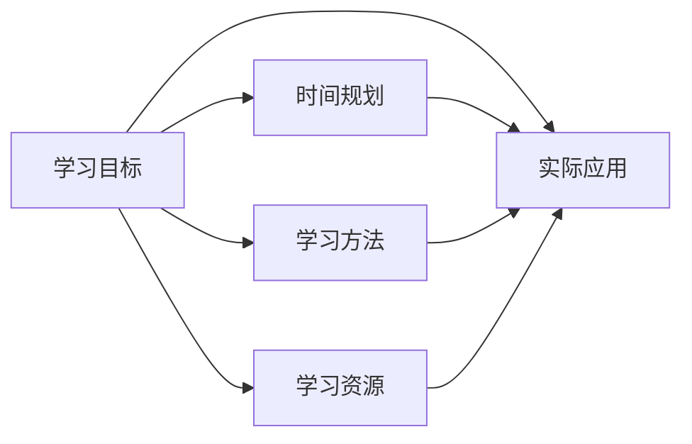

                 

# 快速学习：9个月掌握一门新专业

在当今快速发展的科技世界里，掌握一门新专业变得越来越重要。无论你是初入职场的年轻人，还是寻求职业转型的中年人士，快速学习并掌握新技能都是实现职业目标的关键。本文将带你探索如何在短短9个月内高效掌握一门新专业，从基础理论到实战应用，助你成为该领域的专家。

## 1. 背景介绍

### 1.1 问题由来
科技的快速迭代和职业市场的竞争加剧，使得掌握新技能变得越来越紧迫。许多新兴领域，如人工智能、数据科学、区块链等，对技能需求的更新速度快，一旦落伍就可能被淘汰。如何在有限的时间内高效学习，是许多人面临的共同挑战。

### 1.2 问题核心关键点
快速学习需要考虑多个关键点，包括时间管理、学习方法、学习资源和实际应用。文章将从这些角度出发，为读者提供实用的建议和策略。

## 2. 核心概念与联系

### 2.1 核心概念概述
要快速学习一门新专业，首先需要理解相关的核心概念，并将其联系起来。以下是几个关键概念及其相互关系：

- **学习目标**：明确学习目标，如掌握Python编程、精通数据分析等。
- **时间规划**：制定详细的学习时间表，按月划分阶段目标。
- **学习方法**：选择合适的学习方法，如理论学习、实践练习、项目实战等。
- **学习资源**：搜集丰富的学习资源，如在线课程、专业书籍、技术博客等。
- **实际应用**：通过实践项目将所学知识应用于实际问题中，加深理解和记忆。

### 2.2 核心概念原理和架构的 Mermaid 流程图


### 2.3 核心概念之间的联系
这些核心概念之间相互关联，形成一个完整的学习循环。明确的**学习目标**是方向指引，**时间规划**保证了学习的系统性，**学习方法**决定了学习效率，**学习资源**提供了知识来源，而**实际应用**则巩固了学习成果。只有全面考虑这些因素，才能实现高效学习。

## 3. 核心算法原理 & 具体操作步骤

### 3.1 算法原理概述
快速学习的核心算法原理基于认知心理学和行为科学，旨在通过有效的学习方法，最大限度地利用学习者的时间和注意力。以下是几个关键原理：

- **间隔重复**：定期复习学过的内容，有助于长期记忆。
- **主动学习**：通过做练习、解问题等主动活动，提高学习效果。
- **深度加工**：通过理解概念和应用知识，而非死记硬背，加深学习效果。

### 3.2 算法步骤详解
快速学习可以分为以下几个步骤：

1. **设定学习目标**：明确学习目标，如掌握Python编程、精通数据分析等。
2. **制定学习计划**：根据学习目标，制定详细的学习计划，并按月划分阶段目标。
3. **选择合适的学习方法**：包括理论学习、实践练习、项目实战等。
4. **搜集学习资源**：搜集丰富的学习资源，如在线课程、专业书籍、技术博客等。
5. **实施学习计划**：按计划进行学习，注重时间管理和自我激励。
6. **进行实际应用**：通过实践项目将所学知识应用于实际问题中，加深理解和记忆。
7. **评估学习效果**：定期评估学习效果，及时调整学习策略。

### 3.3 算法优缺点
快速学习算法的主要优点包括：

- 高效利用时间，能在较短时间内掌握新知识。
- 注重实际应用，学以致用，提高学习效果。
- 灵活适应不同学习者，可以根据自身情况调整学习计划。

缺点则包括：

- 对自律性要求较高，需要有较强的自我管理和时间管理能力。
- 对学习方法的选择和调整要求较高，需要不断尝试和优化。
- 对学习资源的质量和适用性有较高要求，需要花时间筛选。

### 3.4 算法应用领域
快速学习算法不仅适用于技术领域，也适用于其他专业，如设计、管理、教育等。其核心思想和方法可以广泛应用，帮助学习者在不同领域内高效掌握新技能。

## 4. 数学模型和公式 & 详细讲解 & 举例说明

### 4.1 数学模型构建
快速学习的数学模型可以简化为以下几个关键变量：

- $T$：学习总时间（单位：月）
- $L$：学习目标（如掌握Python编程、精通数据分析等）
- $M$：学习方法（如理论学习、实践练习、项目实战等）
- $R$：学习资源（如在线课程、专业书籍、技术博客等）
- $A$：实际应用（如通过项目练习、参与开源项目等）

### 4.2 公式推导过程
假设每个月的学习量为 $X$，则总学习量为 $T \times X$。设 $X$ 的计算公式为：

$$
X = W + P + A
$$

其中 $W$ 为理论学习量，$P$ 为实践练习量，$A$ 为实际应用量。根据Pomodoro技术，设定每25分钟为一个工作周期，5个周期后休息5分钟，即每小时约4个工作周期，可得：

$$
X = 4W + 4P + 4A
$$

### 4.3 案例分析与讲解
以掌握Python编程为例，设总学习时间为6个月，目标为掌握Python编程。根据经验，可以将学习目标分解为以下阶段：

1. **第1个月**：理论学习，完成Python基础和语法课程。
2. **第2-3个月**：实践练习，完成多个小型项目，如简单的Web应用开发。
3. **第4-5个月**：实际应用，参与开源项目或企业项目，积累实战经验。
4. **第6个月**：综合应用，进行综合项目，如开发一个小型数据分析工具。

## 5. 项目实践：代码实例和详细解释说明

### 5.1 开发环境搭建
要快速学习Python编程，首先需要搭建一个开发环境。以下是安装Python和主要开发工具的步骤：

1. 安装Python：从官网下载并安装Python 3.x版本。
2. 安装IDE：选择PyCharm或VS Code等IDE，进行环境配置。
3. 安装主要库：使用pip安装Python主要库，如numpy、pandas、matplotlib等。

### 5.2 源代码详细实现
以下是一个简单的Python程序，用于计算斐波那契数列：

```python
def fibonacci(n):
    if n <= 1:
        return n
    else:
        return fibonacci(n-1) + fibonacci(n-2)

print(fibonacci(10))
```

### 5.3 代码解读与分析
- **注释**：在代码中添加注释，解释变量和函数的作用。
- **调试**：使用print语句输出调试信息，帮助发现和修正错误。
- **重构**：对代码进行重构，提高代码的可读性和可维护性。

### 5.4 运行结果展示
运行上述代码，输出斐波那契数列的第10项，结果为55。

## 6. 实际应用场景

### 6.1 项目开发
实际应用场景包括项目开发、问题解决、技术研究等。例如，通过学习Python，可以开发一个小型Web应用，解决实际问题，如自动化数据处理、爬虫应用等。

### 6.2 学术研究
对于学术研究人员，可以通过Python进行数据分析、机器学习模型的实现等。例如，使用Python进行数据清洗、特征工程、模型训练等。

### 6.3 教育培训
在教育培训领域，可以快速掌握教学内容，设计课程和教学材料。例如，使用Python进行可视化教学、编程练习等。

## 7. 工具和资源推荐

### 7.1 学习资源推荐
- **在线课程**：如Coursera、edX、Udacity等平台提供的Python课程。
- **专业书籍**：如《Python编程：从入门到实践》、《流畅的Python》等。
- **技术博客**：如Real Python、Towards Data Science等。

### 7.2 开发工具推荐
- **IDE**：如PyCharm、VS Code等。
- **版本控制**：如Git、GitHub等。
- **代码分享**：如GitHub Gist、Stack Overflow等。

### 7.3 相关论文推荐
- **Python论文**：如《The Python Programming Language》等。
- **编程语言比较**：如《Programming Languages: A Comparative Survey》等。

## 8. 总结：未来发展趋势与挑战

### 8.1 研究成果总结
快速学习算法在理论和实践上都取得了显著进展，帮助许多学习者高效掌握了新技能。未来，该算法将进一步优化，结合更多的学习理论和实践经验，提升学习效果。

### 8.2 未来发展趋势
未来快速学习的趋势包括：

- **个性化学习**：根据学习者特点进行个性化定制，提高学习效率。
- **智能辅助**：使用AI技术，如智能推荐系统，帮助学习者筛选和推荐学习资源。
- **多模态学习**：结合文字、视频、音频等多种学习形式，提升学习效果。

### 8.3 面临的挑战
快速学习仍面临以下挑战：

- **学习动力不足**：如何保持学习者的动力和兴趣，是关键问题。
- **时间管理困难**：如何在繁忙的工作和生活中，合理安排学习时间。
- **学习资源筛选**：如何高效筛选和获取高质量的学习资源。

### 8.4 研究展望
未来，研究重点将集中在以下几个方向：

- **心理学的应用**：结合心理学研究成果，提升学习效果。
- **跨学科融合**：结合其他学科知识，拓展学习范围。
- **技术创新**：开发新的学习工具和技术，提升学习效率。

## 9. 附录：常见问题与解答

**Q1：快速学习是否适合所有人？**

A: 快速学习适用于自驱力强、时间管理良好的学习者。但不同的人有不同的方法和节奏，需要根据自身情况进行调整。

**Q2：如何快速学习一门新技能？**

A: 快速学习需要明确目标、制定计划、选择合适的学习资源和方法。注重实践和实际应用，及时评估和调整。

**Q3：快速学习是否需要不断复习？**

A: 是的，定期复习和间隔重复是快速学习的关键，有助于长期记忆。

**Q4：如何快速掌握编程语言？**

A: 掌握编程语言需要理论学习、实践练习和实际应用。通过编写小型项目，逐步深入理解语言特性和应用场景。

**Q5：如何快速提升数据分析能力？**

A: 提升数据分析能力需要学习相关工具和技术，如Python、R、SQL等。通过实践项目，如数据清洗、模型训练等，积累经验。

---

作者：禅与计算机程序设计艺术 / Zen and the Art of Computer Programming

