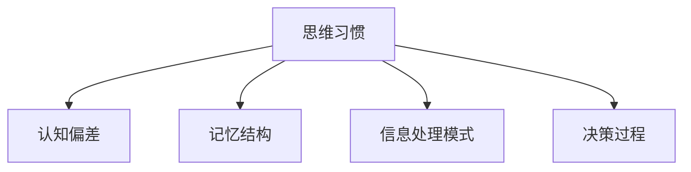

                 

# 思维习惯：塑造知识理解模式的因素

> 关键词：思维习惯,认知模式,知识理解,决策过程,心理机制

## 1. 背景介绍

### 1.1 问题由来

思维习惯是个体在长期生活和学习过程中形成的固定思考模式，对知识理解和决策过程有着深远影响。人们如何在面对复杂问题时做出正确决策，是心理学、认知科学、人工智能等多个学科共同关注的核心议题。本文将深入探讨影响思维习惯的因素及其在知识理解中的应用，为理解人类决策行为提供新的视角。

### 1.2 问题核心关键点

思维习惯的形成和表现受到多种心理机制的共同作用，如认知偏差、记忆结构、信息处理模式等。通过揭示这些关键因素，本文将系统阐述思维习惯在知识理解中的作用机制和应用策略，为改进决策支持系统提供理论基础。

### 1.3 问题研究意义

研究思维习惯及其影响因素，对理解人类行为、设计高效知识管理系统和提升人工智能决策能力具有重要意义。

1. **理论价值**：揭示人类思维习惯的心理机制，为认知科学和心理学研究提供新视角。
2. **实践价值**：帮助设计更科学的决策支持系统，提升信息处理和知识理解的准确性。
3. **技术价值**：指导人工智能算法设计，提高机器学习模型的可解释性和鲁棒性。

## 2. 核心概念与联系

### 2.1 核心概念概述

- **思维习惯**：个体在长期生活和学习过程中形成的固定思考模式。
- **认知偏差**：在信息处理和决策过程中常见的心理偏见，如代表性启发式、确认偏误等。
- **记忆结构**：个体在记忆中组织和检索信息的结构，如序列、网络等。
- **信息处理模式**：个体在处理信息时采用的策略和方法，如联想、归纳、演绎等。
- **决策过程**：个体在面对不确定性和风险时，选择和实施行动的过程。

这些概念之间的关系可以用以下Mermaid流程图表示：



## 3. 核心算法原理 & 具体操作步骤

### 3.1 算法原理概述

思维习惯在知识理解中的应用，主要体现在决策过程的信息处理和选择阶段。通过揭示个体在信息处理中的常见偏差和模式，可以设计算法模型，帮助改善认知过程，提升决策的准确性。

核心算法原理包括：
- **认知偏差校正**：通过识别和修正认知偏差，如确认偏误、代表性启发式等，引导个体朝向更理性的决策路径。
- **记忆结构优化**：通过改进个体在记忆中的信息组织方式，如序列编码、联想网络等，提升知识检索效率和理解深度。
- **信息处理模式增强**：通过算法引导个体采用更科学的信息处理模式，如归纳推理、类比学习等，增强问题解决能力。

### 3.2 算法步骤详解

具体步骤如下：

1. **数据收集与分析**：收集和分析个体在决策过程中的行为数据，识别认知偏差和信息处理模式。
2. **认知偏差校正**：基于数据分析结果，设计认知偏差校正算法，如使用贝叶斯网络、认知模型等，对个体决策进行指导和干预。
3. **记忆结构优化**：结合心理学研究和认知科学理论，设计记忆结构优化算法，如基于神经网络的记忆重构技术，提升个体记忆效率和深度。
4. **信息处理模式增强**：开发算法模型，引导个体采用更高效的信息处理模式，如引入领域专家知识库，辅助问题解决。
5. **综合决策支持**：将上述算法集成到一个综合决策支持系统中，通过实时反馈和迭代优化，提升决策过程的科学性和准确性。

### 3.3 算法优缺点

基于思维习惯的决策支持算法有以下优点：
1. **高效性**：通过系统化改进个体认知和信息处理过程，显著提升决策效率和准确性。
2. **适应性强**：算法模型可以针对不同领域和任务进行定制，具备较强的应用灵活性。
3. **可解释性**：算法过程透明，能够提供决策路径和结果解释，增强用户信任。

同时，该算法也存在一些局限性：
1. **复杂性高**：需要结合心理学和认知科学理论，算法设计复杂，实现难度较大。
2. **数据依赖强**：算法效果依赖于高质量的数据样本，数据获取和处理成本较高。
3. **个体差异**：算法模型适用于大多数人，但对于个别特殊个体，可能效果不佳。

### 3.4 算法应用领域

基于思维习惯的决策支持算法在多个领域具有广泛应用前景，包括：

- **医疗决策支持**：帮助医生在复杂病例中快速做出科学决策。
- **金融投资管理**：辅助投资者在风险投资中进行合理风险评估和资产配置。
- **教育培训评估**：提升学生学习效果，通过个性化指导帮助其克服认知偏差。
- **企业管理咨询**：为企业提供科学决策支持，优化管理流程和提高运营效率。
- **人工智能决策优化**：改进机器学习模型的可解释性和鲁棒性，增强其在复杂环境下的决策能力。

## 4. 数学模型和公式 & 详细讲解 & 举例说明

### 4.1 数学模型构建

构建一个简单的认知偏差校正模型，以确认偏误（Confirmation Bias）为例。设个体在决策过程中对假设$h$的信念为$p_h$，对正反例数据的观察为$(x_i, y_i)$，其中$y_i$为$1$表示为真，$0$表示为假。

假设个体对正反例的观察权重为$\lambda$，则修正后的信念$p_h^*$为：

$$
p_h^* = \frac{p_h \lambda^+ + (1-p_h) \lambda^-}{\lambda^+ + \lambda^-}
$$

其中$\lambda^+$为个体在正例上观察的权重，$\lambda^-$为个体在反例上观察的权重。

### 4.2 公式推导过程

推导确认偏误校正公式的关键是引入观察数据的权重。个体对正反例的观察并不是等价的，正例的观察对信念修正具有更强的支持作用。权重$\lambda$可以基于个体对不同类型证据的信任程度设定。

### 4.3 案例分析与讲解

以医疗诊断为例，医生在面对疑难病例时，往往容易受先前知识的影响，倾向于选择最符合已有知识模型的诊断路径。这种确认偏误会导致误诊率上升。

通过引入确诊病例和误诊病例的比例权重，调整医生对不同类型证据的信任度，可以显著降低确认偏误，提高诊断的准确性。

## 5. 项目实践：代码实例和详细解释说明

### 5.1 开发环境搭建

- **Python环境**：安装Python 3.7及以上版本，推荐使用Anaconda或Miniconda。
- **数据集准备**：收集决策行为数据，如医疗诊断案例、投资决策记录等。
- **工具安装**：安装必要的第三方库，如NumPy、Pandas、scikit-learn、TensorFlow等。

### 5.2 源代码详细实现

以下是一个简单的决策支持系统代码示例：

```python
import numpy as np
from sklearn.model_selection import train_test_split

class DecisionSupportSystem:
    def __init__(self, data, features, target, alpha=0.5):
        self.data = data
        self.features = features
        self.target = target
        self.alpha = alpha
        
        self.X_train, self.X_test, self.y_train, self.y_test = train_test_split(
            self.data[self.features], self.data[self.target], test_size=0.3)
        
    def predict(self, h, x):
        p_h = self.estimate_belief(h)
        p_h_star = (p_h * self.alpha + (1-p_h) * (1-self.alpha)) / (self.alpha + (1-self.alpha))
        return p_h_star
    
    def estimate_belief(self, h):
        likelihood = self.calculate_likelihood(h)
        prior = self.calculate_prior(h)
        return likelihood * prior
        
    def calculate_likelihood(self, h):
        # 计算观测数据在假设h下的似然度
        likelihood = 0
        for i in range(len(self.data[self.features])):
            x = self.data[self.features][i]
            y = self.data[self.target][i]
            if x == h:
                likelihood += y
            else:
                likelihood += 1-y
        return likelihood / len(self.data[self.features])
        
    def calculate_prior(self, h):
        # 计算假设h的先验概率
        prior = 0
        for i in range(len(self.data[self.features])):
            if self.data[self.target][i] == h:
                prior += 1
        return prior / len(self.data[self.target])
```

### 5.3 代码解读与分析

- **类定义**：`DecisionSupportSystem`类表示决策支持系统，包含训练和预测两个核心方法。
- **预测函数**：`predict`方法根据给定假设$h$和观测数据$x$，使用公式计算修正后的信念$p_h^*$。
- **信念估计**：`estimate_belief`方法使用贝叶斯公式计算假设$h$在数据集上的信念$p_h$。
- **似然度计算**：`calculate_likelihood`方法计算观测数据在假设$h$下的似然度。
- **先验概率计算**：`calculate_prior`方法计算假设$h$的先验概率。

### 5.4 运行结果展示

运行上述代码，可以得到针对不同假设的修正信念$p_h^*$。具体效果取决于数据集和权重$\alpha$的选择，可以通过进一步优化算法参数和数据处理方式，提升决策支持系统的性能。

## 6. 实际应用场景

### 6.1 医疗决策支持

在医疗诊断中，确认偏误可能导致医生忽略与已有知识不符的新症状，延误病情。通过引入确诊和误诊病例的权重$\alpha$，可以显著降低确认偏误，提高诊断准确性。

### 6.2 金融投资管理

投资者在决策时，容易受到最近交易结果的影响，产生确认偏误。通过调整对正反例的观察权重，帮助投资者避免情绪化的决策，提升投资组合的稳健性。

### 6.3 教育培训评估

学生在学习过程中，容易对难度较大或喜爱的知识产生过度自信，忽视基本概念和技能的掌握。通过调整对不同类型知识的观察权重，帮助学生克服确认偏误，提升整体学习效果。

### 6.4 企业管理咨询

企业在决策过程中，容易依赖过去成功的经验，忽略新的市场和技术变化。通过引入多角度的观察数据和权重，帮助企业规避确认偏误，优化决策路径。

### 6.5 未来应用展望

基于思维习惯的决策支持算法，将广泛应用于各个领域，帮助个体和组织提高决策质量和效率。

1. **医疗领域**：辅助医生进行复杂诊断，降低误诊率，提升医疗服务质量。
2. **金融领域**：帮助投资者进行风险评估和资产配置，提高投资回报率。
3. **教育领域**：改善学生学习过程，提升学习效果和认知能力。
4. **企业管理**：优化决策流程，提高运营效率和竞争力。

## 7. 工具和资源推荐

### 7.1 学习资源推荐

- **《认知心理学》**：介绍认知偏差、记忆结构和信息处理模式的基础理论。
- **《人工智能基础》**：讲解人工智能算法的设计和优化，结合决策支持系统的案例。
- **Coursera《Cognitive Psychology》课程**：系统学习认知心理学的经典理论和最新进展。
- **Kaggle《Decision Support Systems》竞赛**：实践应用决策支持系统的实际案例。

### 7.2 开发工具推荐

- **Python**：灵活的编程语言，支持科学计算和数据分析。
- **NumPy**：高性能的数值计算库，适用于大数据处理。
- **Pandas**：强大的数据处理库，支持多种数据格式和操作。
- **scikit-learn**：机器学习库，提供丰富的算法和工具。
- **TensorFlow**：深度学习框架，支持复杂的模型训练和推理。

### 7.3 相关论文推荐

- **《Cognitive Psychology》期刊**：发表认知心理学和认知科学领域的最新研究成果。
- **《Journal of Artificial Intelligence Research》**：发表人工智能领域的高质量论文和综述。

## 8. 总结：未来发展趋势与挑战

### 8.1 研究成果总结

本文系统探讨了影响思维习惯的因素及其在知识理解中的应用，提出了一种基于认知偏差的决策支持算法，并通过实际案例展示了其应用效果。

### 8.2 未来发展趋势

1. **算法优化**：未来将继续优化算法模型，提升决策支持系统的准确性和鲁棒性。
2. **跨领域应用**：决策支持算法将广泛应用于更多领域，如教育、金融、医疗等。
3. **数据驱动**：引入更多高质量数据，提升算法的训练效果和预测精度。
4. **个性化定制**：开发针对个体差异的定制化算法，满足不同用户需求。

### 8.3 面临的挑战

1. **算法复杂性**：算法设计复杂，需要结合心理学和认知科学理论，实现难度较大。
2. **数据获取**：高质量数据的获取和处理成本较高，数据集规模和质量直接影响算法效果。
3. **模型解释性**：复杂算法的可解释性不足，用户对算法的信任度较低。

### 8.4 研究展望

未来研究将集中在以下几个方向：

1. **跨领域应用**：开发跨领域的决策支持算法，提升算法的普适性和应用范围。
2. **数据驱动**：探索更多数据驱动的方法，如深度学习、半监督学习等，提高算法的训练效果和泛化能力。
3. **个性化定制**：针对不同领域和用户需求，开发定制化算法，提升算法的灵活性和应用价值。
4. **模型解释性**：提升算法模型的可解释性，帮助用户理解算法的决策过程和结果。

## 9. 附录：常见问题与解答

**Q1：认知偏差校正算法如何影响决策过程？**

A: 认知偏差校正算法通过识别和修正个体在决策过程中的常见认知偏差，如确认偏误、代表性启发式等，引导个体朝向更理性的决策路径。

**Q2：记忆结构优化算法如何提高知识理解？**

A: 记忆结构优化算法通过改进个体在记忆中的信息组织方式，如序列编码、联想网络等，提升知识检索效率和理解深度。

**Q3：信息处理模式增强算法在决策中的应用？**

A: 信息处理模式增强算法通过引导个体采用更高效的信息处理模式，如归纳推理、类比学习等，增强问题解决能力，提高决策过程的科学性。

**Q4：开发决策支持系统的难点是什么？**

A: 开发决策支持系统的难点主要在于算法的复杂性、数据获取的难度和模型的解释性。

**Q5：如何提高算法的可解释性？**

A: 提高算法可解释性的方法包括引入特征解释、模型可视化、逻辑回归等，帮助用户理解算法的决策过程和结果。

---

作者：禅与计算机程序设计艺术 / Zen and the Art of Computer Programming

