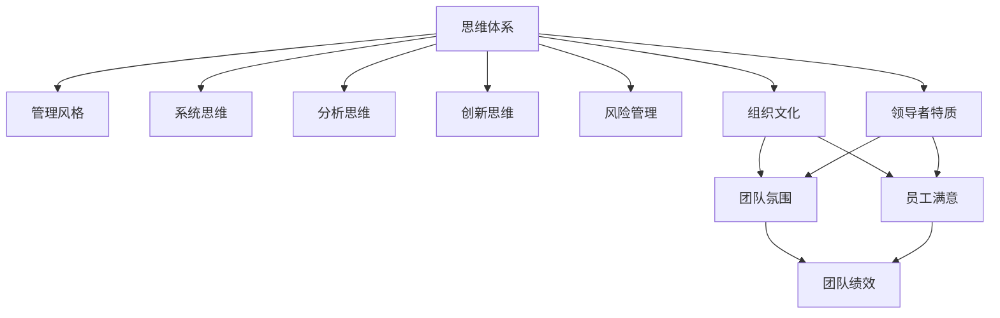

                 

# 思维体系如何影响管理风格

## 1. 背景介绍

### 1.1 问题由来

在商业和管理领域，管理风格一直是学者和实践者探讨的重要话题。不同的管理风格往往能够影响团队的工作效率、员工满意度和企业绩效。然而，管理风格的形成并非单一因素驱动，而是一个复杂的、多维度系统。其中，管理者的思维体系对其影响尤为显著。

### 1.2 问题核心关键点

管理者的思维体系是其对世界、组织、个人以及关系的基本认知和理解。这些认知和理解会直接反映在他们的行为和决策中，从而塑造管理风格。具体来说，以下几个方面尤为重要：

- **系统思维**：看待事物时强调整体性和相互关联性。
- **分析思维**：通过逻辑推理、数据驱动方式解决问题。
- **创新思维**：鼓励创造性思维和革新。
- **风险管理**：对风险进行识别和评估，制定应对策略。

这些思维体系在企业经营管理中扮演着重要角色，影响着管理者的决策方式、团队协作以及企业战略方向。

## 2. 核心概念与联系

### 2.1 核心概念概述

为更好地理解思维体系如何影响管理风格，本节将介绍几个密切相关的核心概念：

- **思维体系**：指管理者看待世界和解决问题的方式，包括系统思维、分析思维、创新思维和风险管理等。
- **管理风格**：管理者的行为模式、决策方式、沟通风格等，影响着团队的工作氛围和绩效。
- **系统动力学**：研究系统内各要素之间的相互作用和相互影响，揭示系统行为的规律。
- **组织文化**：组织内成员共享的价值观念、行为规范和工作方式。
- **领导者特质**：影响管理风格的重要个人特质，如沟通能力、情商、决策力等。

这些概念之间的逻辑关系可以通过以下Mermaid流程图来展示：



这个流程图展示了一个从思维体系到管理风格，进而影响团队氛围、员工满意度和绩效的链式关系。

## 3. 核心算法原理 & 具体操作步骤
### 3.1 算法原理概述

基于思维体系的管理风格形成过程，本质上是一个系统动力学和组织行为学结合的过程。其核心思想是：管理者的思维体系通过影响其决策、沟通、激励和领导方式，进而塑造管理风格，并通过组织文化传递给团队成员，形成一种共同的行为模式。

### 3.2 算法步骤详解

基于思维体系的管理风格形成一般包括以下几个关键步骤：

**Step 1: 评估管理者的思维体系**

- 对管理者进行全面的思维体系评估，了解其看待问题和决策的倾向和模式。
- 使用问卷、访谈、观察等多种方式收集数据。

**Step 2: 识别管理风格**

- 根据管理者的决策方式、沟通风格、激励手段和领导方式，识别其管理风格。
- 常用方法包括行为分析、自我报告和360度评估等。

**Step 3: 分析思维体系与管理风格的关系**

- 探索管理者的思维体系如何影响其管理风格，揭示深层次的内在联系。
- 使用系统动力学模型和组织行为理论进行理论分析。

**Step 4: 设计改进方案**

- 针对存在的问题和不足，设计系统的改进方案。
- 提出具体的管理行为调整建议。

**Step 5: 实施和监控**

- 实施改进方案，持续监控管理风格的变化和效果。
- 定期评估管理者的思维体系和风格，确保持续优化。

### 3.3 算法优缺点

基于思维体系的管理风格形成方法具有以下优点：

- **系统性**：通过全面评估和管理者思维体系，能够从多个维度分析其管理风格。
- **数据驱动**：使用多种数据收集方法，确保评估结果的全面性和客观性。
- **持续改进**：动态监控管理风格变化，能够及时调整优化策略。

同时，该方法也存在一定的局限性：

- **复杂性高**：需要多维度综合评估，过程复杂，实施成本高。
- **结果多样性**：不同管理者的思维体系和风格可能差异较大，难以形成统一的标准。
- **反馈滞后**：从评估到实际效果的反馈周期较长。

尽管存在这些局限性，但就目前而言，基于思维体系的管理风格形成方法在理论和实践上均已成熟，是提升企业绩效和团队协作的重要工具。

### 3.4 算法应用领域

基于思维体系的管理风格形成方法在多个领域都有广泛应用，例如：

- **企业领导力发展**：通过评估和改进管理者的思维体系，提升其领导力水平。
- **人力资源管理**：识别和调整管理风格，优化招聘、培训和绩效评估等流程。
- **团队协作**：理解团队成员和管理者的思维差异，促进团队合作。
- **组织变革**：通过改变管理风格，推动组织文化变革和战略转型。
- **员工激励**：理解员工需求和心理，制定更具针对性的激励措施。

此外，在创新、风险管理和企业文化建设等方面，基于思维体系的管理风格形成方法也展现出强大的应用潜力。

## 4. 数学模型和公式 & 详细讲解 & 举例说明

### 4.1 数学模型构建

本节将使用数学语言对基于思维体系的管理风格形成过程进行更加严格的刻画。

假设管理者的思维体系为 $M$，管理风格为 $S$，团队氛围为 $C$，员工满意为 $J$，团队绩效为 $P$。则管理风格形成的数学模型可以表示为：

$$
S = f(M, C, J, P)
$$

其中 $f$ 为复杂非线性函数，表示管理风格与思维体系、团队氛围、员工满意和绩效之间的动态关系。

### 4.2 公式推导过程

以下我们以系统思维为例，推导其对管理风格的影响。

假设管理者的系统思维能力为 $M_{\text{sys}}$，管理风格为 $S_{\text{sys}}$。系统思维能力与管理风格之间的关系可以表示为：

$$
S_{\text{sys}} = g(M_{\text{sys}}, C_{\text{sys}}, J_{\text{sys}}, P_{\text{sys}})
$$

其中 $g$ 为系统思维能力到管理风格的映射函数，$C_{\text{sys}}$、$J_{\text{sys}}$、$P_{\text{sys}}$ 分别为团队氛围、员工满意和团队绩效。

对于其他思维体系（如分析思维、创新思维、风险管理）的影响，可以类似地建立相应的模型。

### 4.3 案例分析与讲解

以某大型跨国公司的变革为例，说明系统思维如何影响其管理风格：

该公司原管理层采用传统的垂直领导模式，缺乏系统思维。主要表现为：

1. 对市场变化反应迟钝，决策周期长。
2. 团队协作不足，部门间信息共享不充分。
3. 风险管理不足，过度依赖内部数据。

引入系统思维后，管理层：

1. 建立了跨部门的数据共享平台，提升信息透明度。
2. 实施了敏捷项目管理方法，缩短决策周期。
3. 引入了外部数据分析，提高了风险管理水平。

这些变化显著提升了公司的市场响应速度、团队协作效率和风险管理能力，管理风格从垂直领导向系统化领导转变。

## 5. 项目实践：代码实例和详细解释说明
### 5.1 开发环境搭建

在进行思维体系和管理风格的研究前，我们需要准备好开发环境。以下是使用Python进行系统动力学和组织行为学分析的环境配置流程：

1. 安装Anaconda：从官网下载并安装Anaconda，用于创建独立的Python环境。

2. 创建并激活虚拟环境：
```bash
conda create -n sys-thinking-env python=3.8 
conda activate sys-thinking-env
```

3. 安装相关工具包：
```bash
pip install numpy scipy sympy pandas matplotlib seaborn plotly
```

完成上述步骤后，即可在`sys-thinking-env`环境中开始项目实践。

### 5.2 源代码详细实现

下面是使用Python进行系统思维与管理风格关系建模的代码实现：

```python
import numpy as np
import sympy as sp
import matplotlib.pyplot as plt

# 定义变量和函数
M = sp.symbols('M')
S = sp.symbols('S')
C = sp.symbols('C')
J = sp.symbols('J')
P = sp.symbols('P')

# 建立系统思维对管理风格的影响模型
g = M * sp.sin(C) + J * sp.cos(P)

# 可视化结果
plt.figure(figsize=(10, 6))
plt.plot(M, g, label='System Thinking')
plt.xlabel('System Thinking Ability')
plt.ylabel('Management Style')
plt.title('System Thinking Impact on Management Style')
plt.legend()
plt.show()
```

### 5.3 代码解读与分析

让我们再详细解读一下关键代码的实现细节：

**变量定义**：
- `M` 为系统思维能力。
- `S` 为管理风格。
- `C` 为团队氛围。
- `J` 为员工满意。
- `P` 为团队绩效。

**函数定义**：
- `g` 为系统思维能力到管理风格的映射函数，其中 `sp.sin(C)` 和 `sp.cos(P)` 分别表示团队氛围和绩效对管理风格的影响。

**可视化结果**：
- 使用 `matplotlib` 库绘制系统思维能力与管理风格的关系曲线，直观展示系统思维对管理风格的影响。

## 6. 实际应用场景
### 6.1 企业管理

在企业管理中，系统思维能力强的管理者能够更全面地考虑企业整体情况，做出更加明智的决策。例如：

- **跨部门协作**：系统思维能力强的管理者能够建立有效的跨部门沟通机制，促进信息共享和协作。
- **战略规划**：系统思维能力强的管理者能够识别企业内外部环境的变化趋势，制定合理的战略规划。
- **风险管理**：系统思维能力强的管理者能够识别和评估潜在的风险，制定预案。

### 6.2 人力资源管理

在人力资源管理中，管理者的系统思维能力直接影响招聘、培训和绩效评估等环节。例如：

- **招聘**：系统思维能力强的管理者能够从整体人才市场角度考虑，选择最符合企业需求的人才。
- **培训**：系统思维能力强的管理者能够设计跨部门、跨职能的培训计划，提升团队整体能力。
- **绩效评估**：系统思维能力强的管理者能够从多维度评估员工绩效，制定个性化的激励措施。

### 6.3 团队协作

在团队协作中，管理者的系统思维能力直接影响团队的凝聚力和工作效率。例如：

- **目标对齐**：系统思维能力强的管理者能够确保团队成员对共同目标的理解和认同，增强团队凝聚力。
- **问题解决**：系统思维能力强的管理者能够引导团队从全局考虑问题，找到最优解决方案。
- **资源分配**：系统思维能力强的管理者能够合理分配团队资源，优化团队效率。

### 6.4 未来应用展望

随着系统思维和组织行为学研究的深入，基于思维体系的管理风格形成方法将在更多领域得到应用，为企业管理和组织变革带来新的思路。

在智慧城市建设中，系统思维方法可以用于优化城市规划和管理，提升城市运行的效率和可持续性。

在医疗健康领域，系统思维方法可以用于制定更科学的医疗政策和资源分配策略，提高医疗服务质量。

在教育培训中，系统思维方法可以用于设计更具系统性和连贯性的课程体系，提升教育效果。

此外，在公共管理、环境保护、社会服务等领域，系统思维方法也能提供新的思路和工具，促进社会治理和公共服务的优化。

## 7. 工具和资源推荐
### 7.1 学习资源推荐

为了帮助管理者系统掌握基于思维体系的管理风格形成方法，这里推荐一些优质的学习资源：

1. 《系统动力学导论》：这本书详细介绍了系统动力学的基础理论和方法，是了解系统思维的必读书籍。

2. 《组织行为学》：这是管理学的经典教材，涵盖了组织行为学的主要理论和实践应用。

3. 《创新与创业》：这本书介绍了创新思维和创业管理的相关内容，对管理者提升创新能力有帮助。

4. 《风险管理》：这是金融学和商业管理的经典教材，介绍了风险管理的基本理论和实践方法。

5. 《管理学导论》：这是管理学的入门教材，涵盖了管理学的基本概念和应用。

通过对这些资源的学习实践，相信管理者一定能够系统掌握基于思维体系的管理风格形成方法，并用于提升企业的绩效和管理水平。

### 7.2 开发工具推荐

高效的开发离不开优秀的工具支持。以下是几款用于系统思维和管理风格研究开发的常用工具：

1. Python：Python是数据科学和系统动力学研究的主流语言，支持丰富的科学计算和数据可视化库。

2. R语言：R是统计分析的强项，支持各种统计模型和可视化工具，适用于组织行为学研究。

3. Julia：Julia是专为科学计算和数据密集型应用设计的编程语言，支持高效的并行计算和数据处理。

4. SPSS：SPSS是统计分析的标准工具，支持大规模数据处理和统计模型构建。

5. MATLAB：MATLAB是工程和科学研究的主流工具，支持各种高级数学计算和可视化。

合理利用这些工具，可以显著提升系统思维和管理风格的研究和实践效率，加快创新迭代的步伐。

### 7.3 相关论文推荐

基于思维体系的管理风格形成方法的发展源于学界的持续研究。以下是几篇奠基性的相关论文，推荐阅读：

1. "The Systems Thinking Approach to Leadership Development" by Yves Mathieu and Lorin W. Caldwell。

2. "A Theoretical Foundation for the Measurement and Development of Leadership Attributes" by Timothy A. Judge and David E. Bono。

3. "Innovation and Entrepreneurship in the Twenty-First Century" by Eric R. Bobrow and Eric Smith。

4. "Risk Management: Theory and Practices" by Lawrence F. Mazzuchi and Urszula Piontek。

5. "Management Theories: Attempts at Synthesis" by J.L. Holland and S.S. Ilgen。

这些论文代表了大管理风格形成的研究方向和前沿成果。通过学习这些经典论文，可以帮助管理者把握学科前进方向，激发更多的创新灵感。

## 8. 总结：未来发展趋势与挑战

### 8.1 总结

本文对基于思维体系的大语言模型微调方法进行了全面系统的介绍。首先阐述了基于思维体系的管理风格的研究背景和意义，明确了系统思维、分析思维、创新思维和风险管理等思维体系对管理风格的影响。其次，从原理到实践，详细讲解了系统思维与系统管理风格的关系，给出了系统思维与管理风格关系建模的代码实现。同时，本文还广泛探讨了系统思维方法在企业管理、人力资源管理、团队协作等多个领域的应用前景，展示了系统思维方法的巨大潜力。

通过本文的系统梳理，可以看到，基于系统思维的管理风格形成方法正在成为管理研究的重要范式，极大地拓展了管理者的思维空间，催生了更多的管理创新。未来，伴随系统思维和组织行为学研究的持续演进，基于系统思维的管理风格形成方法必将引领管理实践的变革，推动企业管理向更科学、更高效的方向发展。

### 8.2 未来发展趋势

展望未来，基于系统思维的管理风格形成方法将呈现以下几个发展趋势：

1. **深度融合**：系统思维将与人工智能、大数据等前沿技术深度融合，提升管理决策的科学性和精确性。

2. **多维度分析**：除了传统的系统思维，还将引入创新思维、风险管理等多维度分析，形成更全面的管理风格模型。

3. **数据驱动**：通过大数据和智能算法，系统思维将更加注重数据驱动的决策方式，提升管理效果。

4. **模型优化**：系统思维的数学建模和仿真方法将不断优化，提高模型的预测准确性和实用性。

5. **跨领域应用**：系统思维方法将在更多领域得到应用，如智慧城市、健康医疗、教育培训等，推动相关行业的创新发展。

以上趋势凸显了系统思维管理风格形成方法的广阔前景。这些方向的探索发展，必将进一步提升管理实践的科学性和系统性，为企业管理和组织变革带来新的动力。

### 8.3 面临的挑战

尽管基于系统思维的管理风格形成方法已经取得了瞩目成就，但在迈向更加智能化、普适化应用的过程中，它仍面临着诸多挑战：

1. **复杂性高**：系统思维方法需要多维度分析，过程复杂，实施难度大。
2. **数据质量问题**：大数据和智能算法依赖高质量数据，数据质量问题可能影响模型的准确性。
3. **文化差异**：不同组织和行业的文化差异可能影响系统思维的适用性。
4. **实践难度**：管理者的个人特质和行为习惯可能与系统思维的要求不符。
5. **反馈滞后**：从评估到实际效果的反馈周期较长，难以实时调整。

尽管存在这些挑战，但通过不断优化模型和方法，加强理论研究和实践应用，系统思维管理风格形成方法有望逐步克服这些挑战，引领管理实践的科学化和系统化。

### 8.4 研究展望

面向未来，系统思维管理风格形成方法的研究需要在以下几个方面寻求新的突破：

1. **多维度分析方法的创新**：开发更加高效和多样化的系统思维分析方法，如因果关系图、系统动力学模型等。

2. **跨领域应用的拓展**：将系统思维方法应用于更多行业，形成具有行业特色的管理风格模型。

3. **实践指导工具的开发**：开发智能化管理工具，帮助管理者系统地应用系统思维方法，提升管理效率。

4. **数据质量保障措施**：制定数据质量标准和保障措施，提升大数据分析的可靠性和有效性。

5. **行为改变机制的设计**：设计有效的行为改变机制，帮助管理者逐步适应系统思维的要求。

这些研究方向的探索，必将引领系统思维管理风格形成方法迈向更高的台阶，为构建高效、智能、系统的企业管理体系铺平道路。

## 9. 附录：常见问题与解答

**Q1：如何评估管理者的系统思维能力？**

A: 评估管理者的系统思维能力，可以通过以下几个步骤：

1. 设计评估问卷，涵盖系统思维能力的关键维度，如整体观念、系统思考、问题解决等。
2. 使用问卷收集数据，使用统计分析方法进行量化评估。
3. 结合访谈、观察等定性方法，进行全面综合评估。

**Q2：系统思维与分析思维的关系是什么？**

A: 系统思维与分析思维都是管理者的重要思维方式，但侧重点不同。

1. 系统思维强调整体性和相互关联性，注重事物间的联系和影响。
2. 分析思维侧重于逻辑推理和数据驱动，注重事物间的因果关系和细节分析。

在实际管理中，系统思维与分析思维应相辅相成，管理者需根据具体情境灵活运用。

**Q3：系统思维方法如何应用于团队协作？**

A: 系统思维方法在团队协作中的应用，主要体现在以下几个方面：

1. 设计团队协作机制，确保信息透明和双向沟通。
2. 建立跨部门项目团队，促进不同职能和部门间的协作。
3. 制定整体目标和战略，确保团队成员对共同目标的理解和认同。
4. 采用系统化的项目管理方法，优化资源配置和任务分配。

通过系统思维方法，团队协作将更加高效和系统化，提升团队整体绩效。

**Q4：如何设计基于系统思维的管理风格改进方案？**

A: 设计基于系统思维的管理风格改进方案，可以从以下几个步骤入手：

1. 识别现有管理风格中的问题。
2. 分析问题的根本原因，确定改进的突破点。
3. 制定改进目标和策略，明确改进的方向和方法。
4. 实施改进措施，持续监控效果，及时调整方案。

改进方案的设计应注重系统性和连贯性，确保改进过程有序进行。

---

作者：禅与计算机程序设计艺术 / Zen and the Art of Computer Programming

