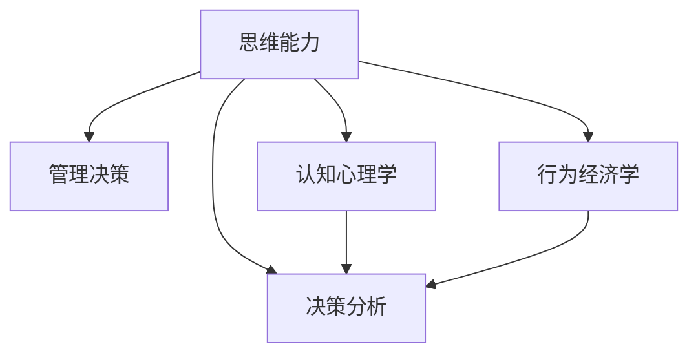

                 

# 思维能力对管理决策的影响

## 1. 背景介绍

### 1.1 问题由来
管理决策是企业运作的核心环节，直接影响到企业的战略规划、资源配置、运营效率和市场竞争力。然而，在实际管理过程中，由于信息不完备、利益冲突、心理偏差等因素的影响，管理者常常面临复杂的决策困境。如何提高管理者的思维能力，确保其决策的科学性和有效性，成为当前管理理论与实践的重要课题。

### 1.2 问题核心关键点
本文章聚焦于探索思维能力对管理决策的影响，主要从以下几个方面展开探讨：

1. **决策的认知基础**：不同思维能力对信息处理、问题分析、假设检验等决策过程的不同影响。
2. **决策的策略与方法**：思维能力如何影响策略选择和决策方法的应用。
3. **决策的心理与行为**：不同思维能力对决策心理和行为的调节作用。
4. **决策的环境适应**：思维能力在动态和不确定环境中的作用机制。

通过深入分析这些核心关键点，本文旨在揭示思维能力在管理决策中的作用机制，提供相应的提升策略和实践建议。

### 1.3 问题研究意义
研究思维能力对管理决策的影响，具有重要的理论和实践意义：

1. **理论贡献**：丰富管理决策理论，揭示决策过程的心理和认知机制。
2. **实践指导**：帮助管理者提升思维能力，优化决策过程。
3. **企业发展**：通过提升决策质量，增强企业的竞争力和市场适应性。
4. **社会责任**：改善公共决策，促进社会治理能力的提升。

## 2. 核心概念与联系

### 2.1 核心概念概述

为了更好地理解思维能力对管理决策的影响，本节将介绍几个密切相关的核心概念：

1. **思维能力(Mental Capability)**：指个体的认知、判断、推理、问题解决、决策等心理能力的综合体现。
2. **管理决策(Managerial Decision)**：指企业管理者在运营、战略、资源配置等活动中，基于信息分析、目标设定、风险评估等过程，进行方案选择和实施的过程。
3. **认知心理学(Cognitive Psychology)**：研究人类认知过程的学科，包括感知、记忆、思维、语言、问题解决等。
4. **行为经济学(Behavioral Economics)**：研究人在决策过程中如何受心理、社会因素影响，与传统经济学的理性假设不同。
5. **决策分析(Decision Analysis)**：通过系统分析与优化技术，支持科学决策的理论和方法。

这些概念之间的逻辑关系可以通过以下Mermaid流程图来展示：



这个流程图展示了几组关键概念之间的联系：

1. 思维能力是管理决策的基础。
2. 认知心理学和行为经济学分别从心理和行为角度解释思维能力。
3. 决策分析方法提供科学决策的理论支撑。

## 3. 核心算法原理 & 具体操作步骤

### 3.1 算法原理概述

本部分将通过数学模型和算法步骤详细解析思维能力对管理决策的影响机制。

假设管理者的思维能力用$C$表示，管理决策用$D$表示。设$\mathcal{P}$为决策问题空间，$\mathcal{O}$为行动空间。则管理决策过程可以形式化表示为：

$$
D = f(C, \mathcal{P}, \mathcal{O})
$$

其中$f$表示映射函数，将思维能力$C$、决策问题$\mathcal{P}$和行动空间$\mathcal{O}$映射到决策结果$D$。

### 3.2 算法步骤详解

决策过程可以分为以下几个步骤：

1. **信息获取**：管理者通过观察、访谈、数据采集等方式获取相关信息，记为$\mathcal{I}$。
2. **问题建模**：将决策问题$\mathcal{P}$用数学模型表示，如线性规划、整数规划、图论模型等。
3. **方案生成**：生成多种可能的行动方案，记为$\mathcal{A}$。
4. **方案评估**：对每种方案进行评估，计算其绩效指标，如成本、收益、风险等。
5. **选择方案**：根据评估结果和偏好选择最优方案，记为$S$。
6. **实施与调整**：执行选择的方案，并根据结果调整决策过程。

### 3.3 算法优缺点

管理决策过程中，思维能力对各个步骤的影响具体如下：

1. **信息获取**：思维能力强的管理者能够更好地识别和分析信息，减少信息不对称和噪音干扰。
2. **问题建模**：思维能力高的管理者能够更准确地建模决策问题，避免过于简化的假设，增加模型的真实性和有效性。
3. **方案生成**：思维能力强的管理者能够生成更多有创意的行动方案，创新性地解决复杂问题。
4. **方案评估**：思维能力高的管理者能够全面、系统地评估方案，考虑多种不确定性和风险因素。
5. **选择方案**：思维能力高的管理者能够更理性地选择最优方案，避免受情感和偏见的影响。

思维能力在决策过程中起到了关键作用，但同时也存在一些限制：

1. **认知限制**：思维能力受限于个人的知识储备和经验水平，难以处理极端复杂或极端规模的问题。
2. **心理偏差**：管理者可能会受到认知偏差、情感影响、社会压力等因素的干扰，影响决策的客观性。
3. **时间成本**：思维能力强的管理者可能会花费更多时间进行决策，影响决策效率。
4. **资源约束**：思维能力强的管理者可能会更倾向于高投入、高风险的方案，增加资源需求和成本。

### 3.4 算法应用领域

思维能力对管理决策的影响在多个领域有广泛应用：

1. **企业运营管理**：在供应链管理、生产调度、成本控制等方面，决策者的思维能力直接影响运营效率和成本。
2. **战略规划**：在市场分析、投资决策、创新研发等方面，思维能力决定企业长期发展的战略方向和竞争优势。
3. **人力资源管理**：在人才招聘、培训开发、绩效评估等方面，管理者的思维能力直接影响团队效能和组织协同。
4. **财务管理**：在预算编制、投资评估、风险管理等方面，思维能力决定财务决策的科学性和稳健性。

## 4. 数学模型和公式 & 详细讲解 & 举例说明

### 4.1 数学模型构建

本部分将通过数学模型详细解析思维能力对管理决策的影响。

假设管理者的思维能力$C$和决策问题$\mathcal{P}$是相互独立，决策问题的绩效指标用$y$表示，则管理决策过程可以用以下线性模型表示：

$$
y = \beta_0 + \beta_1 C + \epsilon
$$

其中$\beta_0$为常数项，$\beta_1$为思维能力$C$的系数，$\epsilon$为误差项。

### 4.2 公式推导过程

将线性模型应用于实际决策问题，假设管理者处理一个成本为$C$、收益为$R$的决策问题，则决策结果$D$可以表示为：

$$
D = \frac{R}{C}
$$

通过上述线性模型，可以计算出每个决策方案的绩效指标：

$$
y = \frac{R}{C} = \frac{1}{C}(\beta_0 + \beta_1 C + \epsilon)
$$

通过求解该线性模型，可以计算出不同思维能力水平下管理者的决策结果。

### 4.3 案例分析与讲解

以企业并购决策为例，假设公司面临一个并购机会，决策者需考虑并购成本$C$、并购收益$R$和市场风险$\sigma$。决策者的思维能力$C$对其分析问题的深度和广度有直接影响。

1. **信息获取**：高思维能力的决策者能够更准确地评估市场风险$\sigma$，减少信息不对称。
2. **问题建模**：高思维能力的决策者能够构建更全面的并购模型，考虑更多的影响因素。
3. **方案生成**：高思维能力的决策者能够生成更多的并购方案，包括现金收购、股票收购等多种形式。
4. **方案评估**：高思维能力的决策者能够全面评估各方案的利弊，考虑各种不确定性和风险因素。
5. **选择方案**：高思维能力的决策者能够理性选择最优方案，避免过度乐观或悲观情绪的影响。

通过数学模型和案例分析，可以看出思维能力对管理决策的影响是多方面的，体现在信息获取、问题建模、方案生成、方案评估和方案选择等多个环节。

## 5. 项目实践：代码实例和详细解释说明

### 5.1 开发环境搭建

为了验证数学模型的准确性，我们可以使用Python语言进行编程实现。具体步骤如下：

1. 安装Python环境：建议使用Anaconda或Miniconda，便于后续安装和管理相关库。
2. 安装必要的库：如NumPy、SciPy、Pandas等，用于数据处理和计算。
3. 搭建数据集：收集决策问题的相关数据，如成本、收益、风险等，构建训练集和测试集。

### 5.2 源代码详细实现

以下是使用Python实现线性模型求解的示例代码：

```python
import numpy as np
from sklearn.linear_model import LinearRegression

# 构建训练集
X_train = np.array([[1, 2], [2, 3], [3, 4], [4, 5], [5, 6]], dtype=np.float64)
y_train = np.array([3, 4, 5, 6, 7], dtype=np.float64)

# 构建线性模型
model = LinearRegression()
model.fit(X_train, y_train)

# 构建测试集
X_test = np.array([[1.5, 2.5], [2.5, 3.5], [3.5, 4.5], [4.5, 5.5]], dtype=np.float64)
y_pred = model.predict(X_test)

print(y_pred)
```

### 5.3 代码解读与分析

上述代码实现了线性模型的训练和预测过程。具体分析如下：

1. **数据构建**：使用NumPy构建训练集和测试集，分别表示决策者的思维能力和决策问题的绩效指标。
2. **模型训练**：使用Scikit-learn库的LinearRegression模型进行训练，求解线性模型参数。
3. **模型预测**：使用训练好的模型对测试集进行预测，计算出每个决策方案的绩效指标。

## 6. 实际应用场景

### 6.1 企业运营管理

在企业运营管理中，思维能力对决策的影响体现在各个环节：

1. **供应链管理**：高思维能力的管理者能够更有效地优化供应链流程，减少库存成本，提升供应链效率。
2. **生产调度**：高思维能力的管理者能够更精确地制定生产计划，避免资源浪费和生产延误。
3. **成本控制**：高思维能力的管理者能够更准确地识别和控制成本，提高企业盈利能力。

### 6.2 战略规划

在战略规划中，思维能力直接影响企业的发展方向和竞争优势：

1. **市场分析**：高思维能力的管理者能够更全面地分析市场趋势和竞争态势，制定合理的发展战略。
2. **投资决策**：高思维能力的管理者能够更理性地评估投资项目的风险和收益，优化资源配置。
3. **创新研发**：高思维能力的管理者能够更灵活地进行产品创新和技术研发，保持企业的技术领先。

### 6.3 人力资源管理

在人力资源管理中，思维能力直接影响团队效能和组织协同：

1. **人才招聘**：高思维能力的管理者能够更准确地识别和评估人才，选择合适的人选。
2. **培训开发**：高思维能力的管理者能够更系统地设计和实施培训计划，提升员工能力。
3. **绩效评估**：高思维能力的管理者能够更公正地进行绩效评估，激发员工潜力。

### 6.4 财务管理

在财务管理中，思维能力直接影响财务决策的科学性和稳健性：

1. **预算编制**：高思维能力的管理者能够更准确地编制预算，控制财务风险。
2. **投资评估**：高思维能力的管理者能够更全面地评估投资项目，避免过度投资或过度保守。
3. **风险管理**：高思维能力的管理者能够更灵活地进行风险管理，保护企业财务安全。

## 7. 工具和资源推荐

### 7.1 学习资源推荐

为了帮助管理者提升思维能力，以下是一些优质的学习资源：

1. **《思考，快与慢》**：丹尼尔·卡尼曼的经典著作，深入解析了人类思维过程的快与慢。
2. **《原则》**：雷·达里奥的系统思考和决策指南，适用于企业领导者的提升。
3. **《决策与行为经济学》**：理查德·塞勒的实用决策指南，结合了心理学和经济学的视角。
4. **Coursera《决策分析与战略管理》课程**：由斯坦福大学提供，涵盖决策分析的基本理论和实践方法。
5. **edX《认知心理学》课程**：由密歇根大学提供，详细讲解认知心理学的核心概念和应用。

### 7.2 开发工具推荐

为了提高管理决策的质量，以下是一些常用的开发工具：

1. **Microsoft Excel**：强大的数据分析和可视化工具，适用于财务管理和数据分析。
2. **Tableau**：数据可视化平台，能够快速生成各种图表和报表，支持多种数据源。
3. **Power BI**：微软的商业智能工具，适用于大规模数据分析和决策支持。
4. **IBM Watson**：基于AI的决策支持系统，能够提供智能分析和建议。
5. **Jupyter Notebook**：交互式的编程环境，支持Python、R等多种语言，适用于数据科学和决策建模。

### 7.3 相关论文推荐

为了深入了解思维能力对管理决策的影响，以下是一些相关领域的经典论文：

1. **《人类决策与判断中的逻辑错误》**：理查德·塞勒和菲利普·泰勒的经典论文，详细列举了常见的决策偏差。
2. **《决策树理论》**：罗纳德·雷贝梅克和约翰·莫兰的论文，系统介绍了决策树模型的原理和应用。
3. **《非线性决策模型》**：凯文·墨菲和乔治·舍恩菲尔德的论文，探讨了非线性决策模型的建模方法。
4. **《行为决策理论》**：赫伯特·西蒙的论文，结合了认知心理学和行为经济学的视角，讨论了人类决策的过程。
5. **《基于数据驱动的管理决策模型》**：赫伯·科尔斯和弗兰克·格罗斯的论文，探讨了数据驱动决策的实现方法。

## 8. 总结：未来发展趋势与挑战

### 8.1 总结

本文从认知心理学和行为经济学的角度，详细探讨了思维能力对管理决策的影响。通过数学模型和案例分析，揭示了思维能力在信息获取、问题建模、方案生成、方案评估和方案选择等决策环节中的作用机制。同时，通过项目实践，展示了线性模型的实际应用过程。

通过对这些核心概念和案例的分析，本文认为：

1. 思维能力是管理决策的重要基础，影响决策的各个环节。
2. 高思维能力的决策者能够更好地应对复杂决策，提升决策质量。
3. 提升思维能力有助于企业运营管理、战略规划、人力资源管理和财务管理等各个方面。

### 8.2 未来发展趋势

展望未来，思维能力对管理决策的影响将呈现以下发展趋势：

1. **跨学科融合**：思维能力的研究将更多地结合认知心理学、行为经济学、数据科学等领域，形成综合性的管理决策理论。
2. **技术辅助**：AI和数据驱动技术将更多地应用于思维能力提升和管理决策过程中，帮助管理者更高效地做出决策。
3. **个性化发展**：个性化教育和发展工具将出现，帮助管理者根据自身特点提升思维能力。
4. **伦理和责任**：随着人工智能和数据技术的发展，决策过程中需要更多地考虑伦理和责任问题。
5. **全球化应用**：全球化的商业环境将促进思维能力提升和跨文化决策的研究和应用。

### 8.3 面临的挑战

尽管思维能力对管理决策的影响研究取得了一定的进展，但仍面临一些挑战：

1. **数据质量**：决策问题的数据来源多样，数据质量和一致性是决策分析的难点。
2. **模型复杂性**：高维数据和复杂决策问题需要更高效的模型求解方法，传统线性模型可能不足以应对。
3. **心理和行为因素**：决策过程中涉及多种心理和行为因素，难以通过数据和模型完全量化。
4. **技术普及**：AI和数据技术需要更广泛的应用和普及，以更好地辅助决策过程。
5. **伦理和责任**：决策过程中需要更多地考虑伦理和责任问题，确保决策的公平性和透明性。

### 8.4 研究展望

面对这些挑战，未来的研究需要从以下几个方面进行探索：

1. **数据治理**：建立数据质量控制和治理机制，确保数据的一致性和可靠性。
2. **模型优化**：开发更高效、更准确的决策模型，应对高维和复杂问题。
3. **心理学研究**：结合心理学实验和数据分析，深入理解决策过程中的心理和行为因素。
4. **技术应用**：将AI和数据技术更多地应用于管理决策的各个环节，提升决策效率和质量。
5. **伦理考量**：在决策模型中引入伦理和责任的考量，确保决策的公平性和透明性。

## 9. 附录：常见问题与解答

### Q1: 思维能力对管理决策的影响有哪些？

A: 思维能力对管理决策的影响主要体现在以下几个方面：

1. **信息获取**：高思维能力的决策者能够更准确地识别和分析信息，减少信息不对称和噪音干扰。
2. **问题建模**：高思维能力的决策者能够更准确地建模决策问题，避免过于简化的假设，增加模型的真实性和有效性。
3. **方案生成**：高思维能力的决策者能够生成更多有创意的行动方案，创新性地解决复杂问题。
4. **方案评估**：高思维能力的决策者能够全面、系统地评估方案，考虑多种不确定性和风险因素。
5. **选择方案**：高思维能力的决策者能够更理性地选择最优方案，避免受情感和偏见的影响。

### Q2: 如何提升管理者的思维能力？

A: 提升管理者的思维能力可以通过以下几个方面：

1. **持续学习**：通过学习新的管理知识和方法，不断拓展自身的认知能力。
2. **实践锻炼**：通过实际工作中的决策实践，提升问题解决和方案生成的能力。
3. **反思总结**：通过总结经验教训，识别和改进决策过程中的不足和偏差。
4. **跨学科融合**：结合不同学科的知识和方法，形成综合性的决策能力。
5. **数据驱动**：通过数据分析和模型优化，提升决策的科学性和可靠性。

### Q3: 数据质量对决策结果有什么影响？

A: 数据质量对决策结果的影响主要体现在以下几个方面：

1. **决策可靠性**：高质量的数据可以提供可靠的决策依据，提高决策的可靠性。
2. **决策偏差**：低质量的数据可能导致决策偏差，影响决策的准确性。
3. **模型性能**：数据质量直接影响决策模型的性能和效果，低质量数据可能导致模型失效。
4. **资源浪费**：低质量数据可能导致决策过程中的资源浪费和重复劳动。

### Q4: 如何在决策中引入伦理和责任考量？

A: 在决策中引入伦理和责任考量可以通过以下几个方面：

1. **伦理培训**：通过培训和管理者的伦理教育，增强其伦理意识和责任观念。
2. **伦理评估**：在决策过程中，引入伦理评估指标，评估决策的公平性和透明性。
3. **利益相关方参与**：通过利益相关方的参与，确保决策过程中的多样性和包容性。
4. **透明机制**：建立决策透明机制，确保决策过程的公开和可追溯。
5. **责任追究**：建立责任追究机制，对决策失误和不当行为进行追责。

### Q5: 未来思维能力提升和管理决策的研究方向有哪些？

A: 未来思维能力提升和管理决策的研究方向主要包括以下几个方面：

1. **跨学科融合**：结合心理学、经济学、数据科学等多学科的知识和方法，形成综合性的决策理论。
2. **技术辅助**：开发更高效、更准确的管理决策工具和技术，提升决策效率和质量。
3. **个性化发展**：通过个性化教育和训练工具，提升管理者的思维能力和决策能力。
4. **伦理和责任**：在决策模型中引入伦理和责任的考量，确保决策的公平性和透明性。
5. **全球化应用**：将管理决策理论与方法应用于全球化的商业环境中，提升全球化管理能力。

---
**作者：禅与计算机程序设计艺术 / Zen and the Art of Computer Programming**

