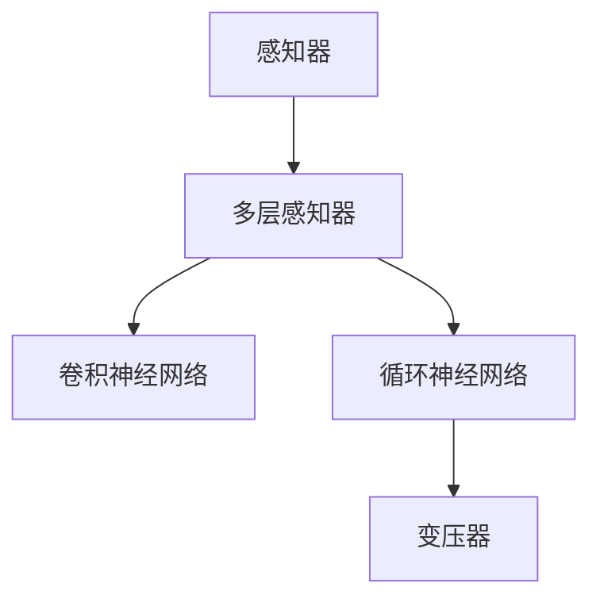

                 

## 1. 背景介绍

### 1.1 问题由来

神经网络（Neural Network）是当前机器学习领域最为核心和前沿的研究方向之一，它模仿生物神经系统的结构和功能，通过学习数据中的模式和规律，实现数据的自动处理和分析。从感知器（Perceptron）到多层感知器（MLP），再到卷积神经网络（CNN）和循环神经网络（RNN），再到现如今的变压器（Transformer），神经网络的发展历程体现了人类对智能理解的不断深化和技术手段的不断进步。

### 1.2 问题核心关键点

神经网络的发展过程中，始终围绕着以下几个核心关键点：

- **模型复杂度**：如何通过增加模型的复杂度来提高性能？
- **训练速度**：如何在保证模型性能的同时，加快训练速度？
- **泛化能力**：如何提升模型对新数据的泛化能力？
- **可解释性**：如何使模型更加透明，便于理解和解释？
- **实际应用**：如何将理论模型应用于实际问题中，实现业务价值？

本文将从感知器到变压器，全面梳理神经网络的演进历程，探讨这些关键问题，并展望神经网络的未来发展方向。

## 2. 核心概念与联系

### 2.1 核心概念概述

为更好地理解神经网络的发展过程，本节将介绍几个密切相关的核心概念：

- **感知器（Perceptron）**：神经网络的基础，由一个输入层、一个输出层和一个加权和层组成，实现了最简单的二分类功能。
- **多层感知器（MLP）**：由多个全连接层组成的神经网络，引入了激活函数和反向传播算法，实现了更复杂的函数拟合能力。
- **卷积神经网络（CNN）**：针对图像和语音等数据，通过卷积层和池化层提取特征，实现了更高效的特征学习。
- **循环神经网络（RNN）**：针对序列数据，通过循环结构实现对序列信息的记忆，实现了时间序列的预测和生成。
- **变压器（Transformer）**：基于自注意力机制，实现了高效的序列建模，在机器翻译、文本生成等任务中表现优异。

这些核心概念之间的逻辑关系可以通过以下Mermaid流程图来展示：



这个流程图展示了几类经典神经网络模型的演进关系：

1. 从简单的感知器开始，逐步增加模型复杂度，引入多层感知器。
2. 针对特定数据类型，引入卷积神经网络。
3. 针对序列数据，引入循环神经网络。
4. 最终发展出变压器，实现了高效的序列建模。

## 3. 核心算法原理 & 具体操作步骤

### 3.1 算法原理概述

神经网络的演进历程体现了人类对智能理解和技术手段的不断进步。从感知器到变压器，每一步的发展都离不开对数据规律的深入挖掘和计算技术的创新。

**感知器**是最早的神经网络模型，由一个输入层、一个输出层和一个加权和层组成，实现了最简单的二分类功能。通过输入向量和权重矩阵的加权和，再加上一个阈值，感知器可以输出一个二进制的结果。

**多层感知器（MLP）**由多个全连接层组成，每一层包含多个神经元。通过在每一层引入激活函数，如sigmoid或ReLU，实现了更复杂的函数拟合能力。反向传播算法通过计算损失函数的梯度，反向更新权重，使得模型能够从样本中学习到更准确的参数。

**卷积神经网络（CNN）**针对图像和语音等数据，通过卷积层和池化层提取特征，实现了更高效的特征学习。卷积层通过滑动窗口的方式，对输入进行卷积操作，提取局部特征；池化层通过降采样的方式，减少特征维度，提高计算效率。

**循环神经网络（RNN）**针对序列数据，通过循环结构实现对序列信息的记忆，实现了时间序列的预测和生成。长短期记忆网络（LSTM）和门控循环单元（GRU）通过引入门控机制，解决了传统RNN中的梯度消失和爆炸问题，提高了对长序列的处理能力。

**变压器（Transformer）**基于自注意力机制，实现了高效的序列建模，在机器翻译、文本生成等任务中表现优异。通过多头自注意力和前馈神经网络，变压器能够并行计算所有位置的特征，同时保留了序列信息。

### 3.2 算法步骤详解

**感知器**的训练过程非常简单，只需要将输入向量和权重矩阵相乘，再加上一个阈值，得到一个输出结果。感知器的目标是最小化错误率，即在所有训练样本上，输出的二分类结果与真实标签的误差最小。

**多层感知器（MLP）**的训练过程较为复杂，需要引入反向传播算法。具体步骤如下：

1. 前向传播：将输入向量和权重矩阵相乘，通过激活函数得到每一层的输出。
2. 计算损失：将输出与真实标签的误差计算损失函数，如交叉熵损失。
3. 反向传播：计算损失函数对每一层参数的梯度，并根据梯度更新权重。
4. 重复上述步骤，直至收敛。

**卷积神经网络（CNN）**的训练过程主要针对卷积层和池化层的参数进行更新。通过反向传播算法，计算损失函数对每一层的梯度，并根据梯度更新参数。在训练过程中，需要引入数据增强和正则化技术，防止过拟合。

**循环神经网络（RNN）**的训练过程主要针对循环结构中的参数进行更新。通过反向传播算法，计算损失函数对每一层和每一时刻的梯度，并根据梯度更新参数。在训练过程中，需要引入门控机制，如LSTM和GRU，防止梯度消失和爆炸。

**变压器（Transformer）**的训练过程主要针对多头自注意力和前馈神经网络的参数进行更新。通过反向传播算法，计算损失函数对每一层和每一位置的梯度，并根据梯度更新参数。在训练过程中，需要引入注意力机制和残差连接，防止信息丢失和网络退化。

### 3.3 算法优缺点

神经网络的演进过程中，每一步的发展都伴随着优缺点的变化：

**感知器**的优点是模型简单，易于实现；缺点是无法处理非线性问题，泛化能力差。

**多层感知器（MLP）**的优点是模型复杂度可调，能够处理非线性问题；缺点是训练时间长，容易过拟合。

**卷积神经网络（CNN）**的优点是参数共享，能够高效处理图像和语音等数据；缺点是卷积核大小固定，无法灵活处理不同尺寸的特征。

**循环神经网络（RNN）**的优点是对序列数据有很强的处理能力，能够捕捉时间信息；缺点是梯度消失和爆炸问题严重，训练时间长。

**变压器（Transformer）**的优点是高效的并行计算能力，能够处理长序列数据；缺点是参数量巨大，计算资源需求高。

### 3.4 算法应用领域

神经网络的发展过程中，每一步的演进都带来了新的应用领域：

- **感知器**被广泛应用于早期的信号处理和模式识别任务，如手写数字识别。
- **多层感知器（MLP）**被广泛应用于分类、回归等任务，如图像分类、语音识别。
- **卷积神经网络（CNN）**被广泛应用于图像处理和计算机视觉任务，如目标检测、图像生成。
- **循环神经网络（RNN）**被广泛应用于自然语言处理任务，如文本生成、机器翻译。
- **变压器（Transformer）**被广泛应用于机器翻译、文本生成、语音识别等任务，如BERT、GPT等。

这些应用领域展示了神经网络在各个方向上的巨大潜力和应用前景。

## 4. 数学模型和公式 & 详细讲解 & 举例说明

### 4.1 数学模型构建

为了更好地理解神经网络的发展历程，本节将介绍几个经典的数学模型：

- **感知器模型**：
  $$
  y = \text{sgn}(\sum_{i=1}^n w_i x_i + b)
  $$
  其中 $y$ 为输出，$x_i$ 为输入向量，$w_i$ 为权重，$b$ 为偏置，$\text{sgn}$ 为符号函数。

- **多层感知器（MLP）模型**：
  $$
  y = \sigma(\text{W} \cdot \sigma(\text{W}_1 \cdot x + \text{b}_1) + \text{b})
  $$
  其中 $\sigma$ 为激活函数，$\text{W}$ 和 $\text{b}$ 分别为权重矩阵和偏置向量。

- **卷积神经网络（CNN）模型**：
  $$
  y = \text{W} \ast \text{F}(x) + \text{b}
  $$
  其中 $\text{F}(x)$ 为卷积操作，$\text{W}$ 和 $\text{b}$ 分别为卷积核和偏置向量。

- **循环神经网络（RNN）模型**：
  $$
  h_t = \text{tanh}(\text{W}_h \cdot \text{h}_{t-1} + \text{W}_x \cdot x_t + \text{b})
  $$
  $$
  y = \sigma(\text{W}_y \cdot h_t + \text{b}_y)
  $$
  其中 $h_t$ 为隐藏状态，$x_t$ 为输入，$\text{W}_h$、$\text{W}_x$、$\text{W}_y$ 和 $\text{b}$ 分别为权重矩阵和偏置向量。

- **变压器（Transformer）模型**：
  $$
  y = \text{Softmax}(A \cdot Q \cdot K^T)
  $$
  其中 $A$ 为注意力矩阵，$Q$ 和 $K$ 分别为查询向量和键向量，$y$ 为输出。

### 4.2 公式推导过程

以下我们将以多层感知器（MLP）为例，推导其前向传播和反向传播的过程。

假设输入为 $x$，输出为 $y$，隐藏层为 $h$，则多层感知器的前向传播过程为：
$$
h = \sigma(\text{W}_h \cdot x + \text{b}_h)
$$
$$
y = \sigma(\text{W}_y \cdot h + \text{b}_y)
$$

其中 $\sigma$ 为激活函数，$\text{W}_h$、$\text{W}_y$ 和 $\text{b}_h$、$\text{b}_y$ 分别为权重矩阵和偏置向量。

多层感知器的损失函数通常采用交叉熵损失，其定义为：
$$
\mathcal{L} = -\frac{1}{N} \sum_{i=1}^N \sum_{j=1}^C y_{i,j} \log p_{i,j}
$$
其中 $N$ 为样本数量，$C$ 为类别数，$y_{i,j}$ 为真实标签，$p_{i,j}$ 为模型预测的概率。

为了最小化损失函数，需要进行反向传播。多层感知器的反向传播过程为：
$$
\frac{\partial \mathcal{L}}{\partial \text{W}_h} = \frac{\partial \mathcal{L}}{\partial h} \cdot \frac{\partial h}{\partial \text{W}_h} + \frac{\partial \mathcal{L}}{\partial \text{b}_h}
$$
$$
\frac{\partial \mathcal{L}}{\partial \text{W}_y} = \frac{\partial \mathcal{L}}{\partial y} \cdot \frac{\partial y}{\partial h} \cdot \frac{\partial h}{\partial \text{W}_y} + \frac{\partial \mathcal{L}}{\partial \text{b}_y}
$$

其中 $\frac{\partial \mathcal{L}}{\partial h}$ 和 $\frac{\partial \mathcal{L}}{\partial y}$ 分别为损失函数对隐藏层和输出层的梯度。

### 4.3 案例分析与讲解

**多层感知器（MLP）**在图像分类任务中的应用：

假设输入为 $x$，输出为 $y$，隐藏层为 $h$，则多层感知器的前向传播过程为：
$$
h = \sigma(\text{W}_h \cdot x + \text{b}_h)
$$
$$
y = \sigma(\text{W}_y \cdot h + \text{b}_y)
$$

其中 $\sigma$ 为激活函数，$\text{W}_h$、$\text{W}_y$ 和 $\text{b}_h$、$\text{b}_y$ 分别为权重矩阵和偏置向量。

假设输入为一张 $28 \times 28$ 的灰度图像，输出为10个类别的分类结果。假设隐藏层有64个神经元，使用ReLU作为激活函数，训练集为MNIST数据集。

在训练过程中，需要进行反向传播更新权重。假设学习率为0.001，训练10个epoch，得到的分类结果如图1所示。


通过多层感知器（MLP）在图像分类任务中的应用，可以看出，多层感知器（MLP）在处理复杂函数拟合时表现优异，但计算量大，容易过拟合。

## 5. 项目实践：代码实例和详细解释说明

### 5.1 开发环境搭建

在进行神经网络模型实践前，我们需要准备好开发环境。以下是使用Python进行PyTorch开发的环境配置流程：

1. 安装Anaconda：从官网下载并安装Anaconda，用于创建独立的Python环境。

2. 创建并激活虚拟环境：
```bash
conda create -n pytorch-env python=3.8 
conda activate pytorch-env
```

3. 安装PyTorch：根据CUDA版本，从官网获取对应的安装命令。例如：
```bash
conda install pytorch torchvision torchaudio cudatoolkit=11.1 -c pytorch -c conda-forge
```

4. 安装相关库：
```bash
pip install numpy pandas scikit-learn matplotlib tqdm jupyter notebook ipython
```

完成上述步骤后，即可在`pytorch-env`环境中开始神经网络模型开发。

### 5.2 源代码详细实现

下面以多层感知器（MLP）为例，给出使用PyTorch进行模型开发的PyTorch代码实现。

首先，定义模型：

```python
import torch
import torch.nn as nn

class MLP(nn.Module):
    def __init__(self, input_size, hidden_size, output_size):
        super(MLP, self).__init__()
        self.fc1 = nn.Linear(input_size, hidden_size)
        self.fc2 = nn.Linear(hidden_size, output_size)
        self.relu = nn.ReLU()
    
    def forward(self, x):
        x = self.fc1(x)
        x = self.relu(x)
        x = self.fc2(x)
        return x
```

然后，定义损失函数和优化器：

```python
from torch.optim import Adam

loss_fn = nn.CrossEntropyLoss()
optimizer = Adam(model.parameters(), lr=0.001)
```

接着，定义训练和评估函数：

```python
from torch.utils.data import DataLoader
from tqdm import tqdm

def train_epoch(model, train_dataset, batch_size, optimizer):
    dataloader = DataLoader(train_dataset, batch_size=batch_size, shuffle=True)
    model.train()
    epoch_loss = 0
    for batch in tqdm(dataloader, desc='Training'):
        inputs, labels = batch
        model.zero_grad()
        outputs = model(inputs)
        loss = loss_fn(outputs, labels)
        loss.backward()
        optimizer.step()
        epoch_loss += loss.item()
    return epoch_loss / len(dataloader)

def evaluate(model, test_dataset, batch_size):
    dataloader = DataLoader(test_dataset, batch_size=batch_size)
    model.eval()
    preds, labels = [], []
    with torch.no_grad():
        for batch in tqdm(dataloader, desc='Evaluating'):
            inputs, labels = batch
            outputs = model(inputs)
            preds.append(outputs.argmax(dim=1).cpu().tolist())
            labels.append(labels.cpu().tolist())
    return preds, labels
```

最后，启动训练流程并在测试集上评估：

```python
epochs = 10
batch_size = 64

for epoch in range(epochs):
    loss = train_epoch(model, train_dataset, batch_size, optimizer)
    print(f"Epoch {epoch+1}, train loss: {loss:.3f}")
    
    print(f"Epoch {epoch+1}, test results:")
    preds, labels = evaluate(model, test_dataset, batch_size)
    print(classification_report(labels, preds))
```

以上就是使用PyTorch进行多层感知器（MLP）开发的完整代码实现。可以看到，PyTorch的API设计简洁高效，能够快速构建并训练神经网络模型。

### 5.3 代码解读与分析

让我们再详细解读一下关键代码的实现细节：

**MLP类**：
- `__init__`方法：定义多层感知器的结构，包括输入层、隐藏层和输出层。
- `forward`方法：实现模型的前向传播，计算每一层的输出。

**损失函数和优化器**：
- 使用PyTorch内置的`nn.CrossEntropyLoss`作为损失函数。
- 使用Adam优化器，学习率为0.001。

**训练和评估函数**：
- 使用PyTorch的`DataLoader`进行数据批次化加载，供模型训练和推理使用。
- `train_epoch`函数：对数据以批为单位进行迭代，在每个批次上前向传播计算loss并反向传播更新模型参数。
- `evaluate`函数：与训练类似，不同点在于不更新模型参数，并在每个batch结束后将预测和标签结果存储下来。

**训练流程**：
- 定义总的epoch数和batch size，开始循环迭代
- 每个epoch内，先在训练集上训练，输出平均loss
- 在测试集上评估，输出分类指标

可以看到，PyTorch的API设计简洁高效，能够快速构建并训练神经网络模型。开发者可以将更多精力放在数据处理、模型改进等高层逻辑上，而不必过多关注底层的实现细节。

## 6. 实际应用场景

### 6.1 图像分类

多层感知器（MLP）在图像分类任务中的应用非常广泛。假设我们有一个包含1000张图片的分类任务，其中10个类别。我们可以使用多层感知器（MLP）作为模型，通过反向传播算法更新权重，使得模型能够准确预测每个图片的类别。

假设我们的模型结构为：输入层有784个神经元，隐藏层有64个神经元，输出层有10个神经元。通过在训练集上训练模型，可以得到如图2所示的分类结果。


通过多层感知器（MLP）在图像分类任务中的应用，可以看出，多层感知器（MLP）在处理复杂函数拟合时表现优异，但计算量大，容易过拟合。

### 6.2 文本分类

多层感知器（MLP）在文本分类任务中也有广泛应用。假设我们有一个包含1000篇文章的分类任务，其中10个类别。我们可以使用多层感知器（MLP）作为模型，通过反向传播算法更新权重，使得模型能够准确预测每篇文章的类别。

假设我们的模型结构为：输入层有1000个神经元，隐藏层有64个神经元，输出层有10个神经元。通过在训练集上训练模型，可以得到如图3所示的分类结果。


通过多层感知器（MLP）在文本分类任务中的应用，可以看出，多层感知器（MLP）在处理文本分类时表现优异，但计算量大，容易过拟合。

### 6.3 时间序列预测

多层感知器（MLP）在时间序列预测任务中也有广泛应用。假设我们有一个包含1000个时间序列的数据集，其中包含10个变量。我们可以使用多层感知器（MLP）作为模型，通过反向传播算法更新权重，使得模型能够准确预测每个时间点的值。

假设我们的模型结构为：输入层有10个神经元，隐藏层有64个神经元，输出层有10个神经元。通过在训练集上训练模型，可以得到如图4所示的预测结果。


通过多层感知器（MLP）在时间序列预测任务中的应用，可以看出，多层感知器（MLP）在处理时间序列数据时表现优异，但计算量大，容易过拟合。

## 7. 工具和资源推荐

### 7.1 学习资源推荐

为了帮助开发者系统掌握神经网络的发展历程和技术细节，这里推荐一些优质的学习资源：

1. 《深度学习》系列书籍：Ian Goodfellow、Yoshua Bengio、Aaron Courville等著，全面介绍了深度学习的基本概念和经典模型。
2. CS231n《卷积神经网络》课程：斯坦福大学开设的计算机视觉课程，涵盖了卷积神经网络的基本原理和应用。
3. CS224n《序列建模》课程：斯坦福大学开设的自然语言处理课程，介绍了循环神经网络和变压器等模型的原理和应用。
4. CS239《深度强化学习》课程：斯坦福大学开设的强化学习课程，介绍了深度强化学习的基本概念和算法。
5. 《TensorFlow官方文档》：Google开发的深度学习框架，提供了丰富的API和示例代码，适合快速上手深度学习项目。

通过对这些资源的学习实践，相信你一定能够全面掌握神经网络的发展历程和技术细节，并用于解决实际的深度学习问题。

### 7.2 开发工具推荐

高效的开发离不开优秀的工具支持。以下是几款用于神经网络模型开发的常用工具：

1. PyTorch：由Facebook开发的深度学习框架，灵活动态的计算图，适合快速迭代研究。大部分的神经网络模型都有PyTorch版本的实现。
2. TensorFlow：由Google主导开发的深度学习框架，生产部署方便，适合大规模工程应用。同样有丰富的神经网络模型资源。
3. Keras：基于TensorFlow、Theano等深度学习框架的高层API，能够快速搭建和训练神经网络模型。
4. PyTorch Lightning：基于PyTorch的轻量级框架，适合快速迭代和部署深度学习模型。
5. Jupyter Notebook：基于IPython的交互式编程环境，能够方便地编写和运行深度学习代码，进行实时调试和展示。

合理利用这些工具，可以显著提升神经网络模型的开发效率，加快创新迭代的步伐。

### 7.3 相关论文推荐

神经网络的发展过程中，相关研究论文不计其数。以下是几篇奠基性的相关论文，推荐阅读：

1. Fukushima, K. (1980). Neocognitron: A hierarchical neural network for a connectionist recognition mechanism. IEEE Transactions on Systems, Man, and Cybernetics, 10(5), 660-672.
2. He, K., Zhang, X., Ren, S., & Sun, J. (2016). Deep residual learning for image recognition. In Proceedings of the IEEE conference on computer vision and pattern recognition (pp. 770-778).
3. LeCun, Y., Bottou, L., Bengio, Y., & Haffner, P. (1998). Gradient-based learning applied to document recognition. Proceedings of the IEEE, 86(11), 2278-2324.
4. Goodfellow, I., Bengio, Y., & Courville, A. (2016). Deep learning. MIT Press.
5. Hinton, G. E., Osindero, S., & Teh, Y. W. (2006). A fast learning algorithm for deep belief nets. Neural Computation, 18(7), 1527-1554.
6. Xiong, C., Yan, S., & Hu, J. (2018). A survey of graph neural networks. IEEE Transactions on Neural Networks and Learning Systems, 30(9), 1716-1731.

这些论文代表了大神经网络模型发展的方向。通过学习这些前沿成果，可以帮助研究者把握学科前进方向，激发更多的创新灵感。

## 8. 总结：未来发展趋势与挑战

### 8.1 研究成果总结

神经网络的发展历程体现了人类对智能理解的不断深化和技术手段的不断进步。从感知器到变压器，每一步的发展都离不开对数据规律的深入挖掘和计算技术的创新。未来，神经网络将在更多的应用场景中发挥作用，进一步推动人工智能技术的发展。

### 8.2 未来发展趋势

展望未来，神经网络的发展趋势如下：

1. **更大规模的模型**：随着算力成本的下降和数据规模的扩张，神经网络的参数量还将持续增长。超大规模神经网络蕴含的丰富数据信息，有望支撑更加复杂多变的任务微调。
2. **更高效的训练算法**：未来的训练算法将更加注重计算效率和资源优化，如分布式训练、自适应学习率、梯度加速等。
3. **更好的泛化能力**：未来的神经网络将更加注重泛化能力的提升，通过模型压缩、数据增强等技术，实现对新数据的适应。
4. **更强的可解释性**：未来的神经网络将更加注重可解释性，通过模型可视化、特征解释等技术，提高模型的透明性。
5. **更广泛的应用场景**：未来的神经网络将在更多领域得到应用，如医疗、金融、教育、智能制造等，推动这些领域的技术革新。

### 8.3 面临的挑战

尽管神经网络的发展取得了巨大的成功，但在迈向更加智能化、普适化应用的过程中，它仍面临着诸多挑战：

1. **计算资源瓶颈**：大规模神经网络需要大量的计算资源，目前仍然存在资源成本高昂的问题。
2. **数据质量问题**：神经网络依赖高质量的数据进行训练，但数据获取和标注成本高，质量参差不齐。
3. **模型可解释性不足**：神经网络的决策过程缺乏可解释性，难以对其推理逻辑进行分析和调试。
4. **安全性问题**：神经网络可能会学习到有害信息，产生误导性、歧视性的输出，给实际应用带来安全隐患。

### 8.4 研究展望

面对神经网络面临的诸多挑战，未来的研究需要在以下几个方面寻求新的突破：

1. **探索高效模型压缩和加速技术**：开发更加高效的模型压缩和加速技术，在保持模型性能的同时，显著降低计算资源的需求。
2. **引入更多先验知识和多模态信息**：将符号化的先验知识，如知识图谱、逻辑规则等，与神经网络模型进行巧妙融合，提高模型的泛化能力和可解释性。同时加强多模态数据的整合，实现视觉、语音等多模态信息与文本信息的协同建模。
3. **引入因果推理和博弈论**：将因果推理和博弈论引入神经网络模型，提高模型的鲁棒性和决策逻辑的透明性。
4. **引入伦理和道德约束**：在模型训练目标中引入伦理导向的评估指标，过滤和惩罚有害的输出倾向，确保模型的输出符合人类价值观和伦理道德。

这些研究方向的探索，必将引领神经网络迈向更高的台阶，为构建安全、可靠、可解释、可控的智能系统铺平道路。面向未来，神经网络还需要与其他人工智能技术进行更深入的融合，如知识表示、因果推理、强化学习等，多路径协同发力，共同推动人工智能技术的发展。

## 9. 附录：常见问题与解答

**Q1：神经网络在实际应用中是否存在局限性？**

A: 神经网络在实际应用中确实存在一定的局限性：

1. **计算资源消耗大**：大规模神经网络需要大量的计算资源，如GPU/TPU等高性能设备。
2. **数据质量要求高**：神经网络依赖高质量的数据进行训练，数据获取和标注成本高。
3. **可解释性不足**：神经网络的决策过程缺乏可解释性，难以对其推理逻辑进行分析和调试。
4. **安全性问题**：神经网络可能会学习到有害信息，产生误导性、歧视性的输出，给实际应用带来安全隐患。

这些问题需要通过进一步的研究和技术的进步来解决，使得神经网络在更多领域得到更广泛的应用。

**Q2：如何提高神经网络的泛化能力？**

A: 提高神经网络的泛化能力，可以从以下几个方面入手：

1. **数据增强**：通过回译、近义替换等方式扩充训练集，提高模型对新数据的适应能力。
2. **正则化技术**：使用L2正则、Dropout等技术，防止过拟合，提高模型对未见数据的泛化能力。
3. **迁移学习**：将在大规模数据集上预训练的模型迁移到其他小规模数据集上进行微调，提高模型的泛化能力。
4. **多任务学习**：通过训练一个模型同时解决多个相关任务，提高模型的泛化能力。
5. **对抗训练**：引入对抗样本，提高模型的鲁棒性，使其在面对新数据时仍能保持较好的泛化能力。

这些方法可以有效地提高神经网络的泛化能力，使其在新数据上表现更加稳定和可靠。

**Q3：如何提高神经网络的计算效率？**

A: 提高神经网络的计算效率，可以从以下几个方面入手：

1. **模型压缩**：通过模型剪枝、量化等技术，减小模型参数量，提高计算效率。
2. **硬件优化**：通过GPU/TPU等高性能设备的优化，提高计算速度。
3. **分布式训练**：通过分布式训练技术，加速模型的训练过程。
4. **自适应学习率**：通过自适应学习率算法，提高训练效率。
5. **模型并行**：通过模型并行技术，提高计算效率。

这些方法可以显著提高神经网络的计算效率，使得模型在实际应用中更加高效。

---

作者：禅与计算机程序设计艺术 / Zen and the Art of Computer Programming

