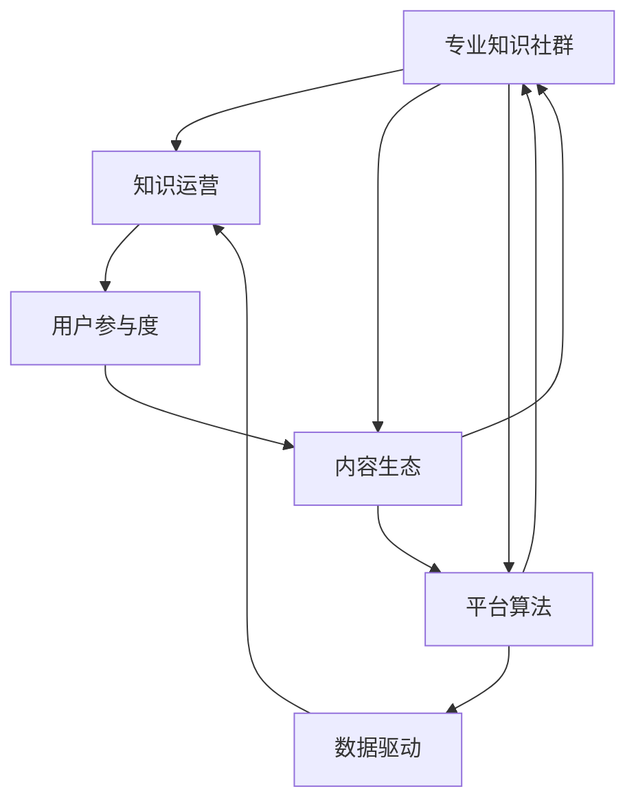

                 

# 打造专业知识社群的运营策略

> 关键词：专业知识社群, 知识运营, 用户参与度, 内容生态, 平台算法, 数据驱动

## 1. 背景介绍

在知识爆炸的互联网时代，专业知识的获取和分享变得越来越重要。为了更好地促进知识的传播和应用，人们纷纷创建了各种类型的专业知识社群，例如技术论坛、专业博客、在线课程平台等。但如何有效运营这些社群，使其真正发挥作用，却是众多社群管理者面临的挑战。本文将从知识运营的角度出发，探讨如何打造高效、活跃、可持续发展的专业知识社群。

## 2. 核心概念与联系

### 2.1 核心概念概述

- **专业知识社群**：由一群具有共同兴趣或专业领域的人组成的在线社区，旨在分享知识、交流思想、解决问题。
- **知识运营**：通过各种策略和技术手段，优化知识内容生产、传播和消费的过程，提高社群的用户参与度和知识质量。
- **用户参与度**：社群成员积极参与社群活动的程度，包括提问、回答、讨论、分享等。
- **内容生态**：社群内知识内容的生产、传播和消费的良性循环系统，确保内容的质量和多样性。
- **平台算法**：用于推荐、排序、搜索等功能的算法，优化用户在使用社群时的体验。
- **数据驱动**：使用数据进行决策和优化，不断改进运营策略，提高社群效果。

这些概念之间相互联系，共同构成了一个知识社群的运营生态。运营者需要综合运用这些概念，构建起一个高效、活跃的知识社群。

### 2.2 核心概念原理和架构的 Mermaid 流程图



## 3. 核心算法原理 & 具体操作步骤

### 3.1 算法原理概述

知识运营的核心目标是提高用户参与度，优化内容生态，从而提升社群的整体价值。为此，运营者需要设计合适的算法和策略，对内容进行有效的管理和传播。

### 3.2 算法步骤详解

1. **用户行为分析**：通过数据分析工具，收集和分析社群成员的行为数据，包括提问、回答、点赞、评论、分享等，识别出活跃用户和兴趣点。

2. **内容质量评估**：使用自然语言处理技术，对内容进行情感分析、主题分析、语义分析等，评估内容的价值和质量。

3. **内容推荐算法**：基于用户行为和内容质量，设计推荐算法，对新内容进行排序和展示，提高用户发现优质内容的机会。

4. **社区互动激励**：设计激励机制，如积分、徽章、排名等，鼓励用户积极参与社群活动，提升用户粘性和参与度。

5. **数据反馈循环**：定期收集用户反馈，调整算法和策略，优化社群运营效果。

### 3.3 算法优缺点

- **优点**：
  - 通过数据分析，可以准确识别用户兴趣和行为，提高内容推荐的精准度。
  - 激励机制能有效提升用户参与度，增强社群活力。
  - 数据驱动的决策方式，能够快速响应变化，优化运营策略。

- **缺点**：
  - 算法的设计和调整需要专业知识，普通运营者可能难以掌握。
  - 数据隐私和安全问题需要重视，确保用户数据的使用合规。
  - 过度依赖算法可能导致内容多样性的下降，需要平衡推荐和自由浏览。

### 3.4 算法应用领域

知识运营的算法和策略在各类知识社群中都有广泛应用，包括但不限于：
- 技术论坛：如Stack Overflow、GitHub Issues、Reddit等。
- 专业博客：如Medium、CSDN、博客园等。
- 在线课程平台：如Coursera、edX、Udacity等。
- 知识问答平台：如知乎、Quora等。
- 专业社交平台：如LinkedIn、Meetup等。

## 4. 数学模型和公式 & 详细讲解 & 举例说明

### 4.1 数学模型构建

我们假设社群内有 $N$ 个用户和 $M$ 篇内容，分别用 $u_1, u_2, ..., u_N$ 和 $c_1, c_2, ..., c_M$ 表示。内容 $c_i$ 的特征向量为 $f(c_i)$，用户 $u_j$ 的行为特征向量为 $g(u_j)$，社群内用户间的相似度矩阵为 $S_{ij}$。

### 4.2 公式推导过程

内容推荐的目标是最大化用户对推荐的满意度，可以使用下面的公式进行建模：

$$
\max_{\theta} \sum_{i=1}^M \sum_{j=1}^N w_{ij} \left( \theta^T g(u_j) \right) f(c_i)
$$

其中 $w_{ij}$ 表示用户 $u_j$ 对内容 $c_i$ 的兴趣权重，$\theta$ 为用户的兴趣向量。

通过对上述公式进行求解，可以得到用户对内容的兴趣权重，从而进行推荐。

### 4.3 案例分析与讲解

假设我们有一个技术论坛，包含编程、数据科学、机器学习等多个主题。用户 $u_1$ 在最近一个月内，频繁提问和回答关于机器学习的内容，并且对这些内容进行了点赞和分享。系统可以使用内容质量和用户行为数据，计算出 $u_1$ 对机器学习主题的兴趣权重，并将其推荐给同样对机器学习感兴趣的其他用户。

## 5. 项目实践：代码实例和详细解释说明

### 5.1 开发环境搭建

为了实现上述推荐算法，需要使用Python和相关库，如Pandas、Numpy、Scikit-learn等。首先需要安装Python和相关库：

```bash
pip install pandas numpy scikit-learn
```

然后，搭建Python开发环境，可以使用Anaconda或者Miniconda，它们都支持虚拟环境管理，可以方便地安装和切换依赖库。

### 5.2 源代码详细实现

以下是内容推荐的Python代码实现，具体步骤如下：

1. 数据准备：收集用户行为数据和内容特征数据，进行预处理。
2. 模型训练：使用上述公式进行模型训练，求解用户对内容的兴趣权重。
3. 内容推荐：根据训练好的模型，对用户进行内容推荐。

```python
import pandas as pd
import numpy as np
from sklearn.metrics.pairwise import cosine_similarity

# 数据准备
# 用户行为数据
user_behaviors = pd.read_csv('user_behaviors.csv')
# 内容特征数据
content_features = pd.read_csv('content_features.csv')

# 合并数据
user_content_data = pd.merge(user_behaviors, content_features, on='id')

# 特征工程
user_vector = user_content_data.groupby('user_id').mean()
content_vector = user_content_data.groupby('content_id').mean()

# 模型训练
# 计算用户对内容的兴趣权重
similarity_matrix = cosine_similarity(user_vector, content_vector)
user_interest_weights = similarity_matrix.dot(content_vector)

# 内容推荐
def recommend_content(user_id):
    user_weights = user_interest_weights[user_id]
    top_n = 10  # 推荐内容数量
    top_contents = np.argsort(user_weights)[-top_n:]
    return top_contents.tolist()

# 测试推荐
recommended_contents = recommend_content('user1')
print(recommended_contents)
```

### 5.3 代码解读与分析

上述代码实现了简单的内容推荐功能，其中：
- `user_behaviors.csv` 和 `content_features.csv` 是用户行为数据和内容特征数据的文件。
- `user_vector` 和 `content_vector` 是通过特征工程得到的用户和内容向量化表示。
- `cosine_similarity` 计算用户和内容之间的余弦相似度。
- `user_interest_weights` 是通过余弦相似度计算出的用户对内容的兴趣权重。
- `recommend_content` 函数根据用户的兴趣权重，推荐最受欢迎的内容。

## 6. 实际应用场景

### 6.1 在线编程学习平台

在线编程学习平台如LeetCode、CodeSignal等，需要高效的内容推荐来吸引和保留用户。这些平台可以利用上述推荐算法，根据用户的学习行为和兴趣，推荐适合的编程题目和解题思路，提高学习效率和参与度。

### 6.2 技术博客平台

技术博客平台如Medium、CSDN等，可以通过内容推荐，帮助用户发现感兴趣的博客和作者，增强内容的传播效果。运营者可以通过分析用户的阅读行为和评论反馈，优化推荐算法，提升用户体验。

### 6.3 专业社交平台

专业社交平台如LinkedIn、Xing等，可以通过内容推荐，帮助用户发现专业领域内的最新动态和机会。运营者可以利用用户的职业背景和兴趣，推荐相关的行业新闻、职位招聘、培训课程等内容，提升平台的价值。

## 7. 工具和资源推荐

### 7.1 学习资源推荐

1. **Coursera《机器学习》课程**：由斯坦福大学教授Andrew Ng主讲，涵盖机器学习基础、算法设计、数据处理等内容，是学习内容推荐算法的绝佳资源。
2. **《推荐系统实战》书籍**：详细介绍了推荐系统的理论基础和实战经验，结合Python代码实现，适合深入学习推荐算法。
3. **Kaggle数据集**：Kaggle上有大量公开的数据集，可以用于实验和训练推荐算法，提升实战能力。
4. **Amazon AWS推荐服务**：AWS的推荐服务提供了简单易用的API接口，可以用于快速构建推荐系统，支持大规模部署和优化。

### 7.2 开发工具推荐

1. **Anaconda**：支持Python和R语言的开发环境管理，提供丰富的科学计算库和数据分析工具。
2. **Jupyter Notebook**：支持代码编写、数据处理和可视化，适合数据驱动的实验和研究。
3. **PyTorch**：深度学习框架，支持高效的神经网络模型训练和推理。
4. **TensorFlow**：由Google开发，支持多种深度学习模型和算法，适用于大规模生产部署。

### 7.3 相关论文推荐

1. **《The Bellman-Ford Algorithm for Ranking Files on the Web》**：提出PageRank算法，用于互联网网页排序，是推荐系统中的经典算法。
2. **《Trustworthy Recommendation Algorithms》**：介绍了基于信任度的推荐算法，适用于多源信息融合和社交网络推荐。
3. **《Deep Neural Networks for Content Recommendation》**：利用深度学习模型进行内容推荐，取得了比传统方法更好的效果。

## 8. 总结：未来发展趋势与挑战

### 8.1 未来发展趋势

- **个性化推荐**：未来的推荐系统将更加个性化，根据用户的具体需求和行为，提供定制化的内容和体验。
- **多模态推荐**：结合文本、图像、视频等多模态数据，提升推荐效果和用户体验。
- **实时推荐**：利用流数据处理技术，实现实时内容推荐，提高响应速度和准确性。
- **跨领域推荐**：通过多领域数据融合，提升推荐系统的泛化能力和应用范围。
- **可信推荐**：引入用户反馈和信任机制，提升推荐的可信度和透明度。

### 8.2 面临的挑战

- **数据隐私和安全**：如何保护用户数据隐私，防止数据泄露和滥用，是推荐系统面临的重要挑战。
- **算法公平性**：如何避免算法偏见，保证推荐内容的公平性和多样性，是推荐系统需要解决的问题。
- **推荐算法优化**：如何设计高效的推荐算法，平衡推荐准确度和多样性，提高用户体验。
- **计算资源限制**：如何在资源有限的情况下，实现高性能的推荐系统，是推荐系统的技术瓶颈。
- **用户行为理解**：如何深入理解用户行为和需求，设计合适的推荐策略，是推荐系统的核心挑战。

### 8.3 研究展望

未来的推荐系统研究将聚焦于以下几个方向：
- **强化学习**：利用强化学习技术，实时调整推荐策略，提升推荐效果。
- **跨领域知识融合**：通过跨领域知识图谱和迁移学习，提升推荐的泛化能力和应用范围。
- **用户行为建模**：利用深度学习技术，建立用户行为和兴趣的复杂模型，提升推荐的精准度。
- **推荐系统公平性**：研究推荐系统的公平性问题，设计公平性评估指标和算法。
- **实时推荐系统**：利用流数据处理和分布式计算技术，实现实时推荐系统的构建。

## 9. 附录：常见问题与解答

**Q1: 如何设计一个高效的知识推荐算法？**

A: 设计高效的知识推荐算法需要考虑以下几个关键点：
1. **用户行为分析**：收集和分析用户的行为数据，如提问、回答、点赞、评论、分享等。
2. **内容质量评估**：使用自然语言处理技术，对内容进行情感分析、主题分析、语义分析等，评估内容的价值和质量。
3. **内容推荐算法**：设计推荐算法，对新内容进行排序和展示，提高用户发现优质内容的机会。
4. **社区互动激励**：设计激励机制，如积分、徽章、排名等，鼓励用户积极参与社群活动，提升用户粘性和参与度。

**Q2: 知识推荐算法中的数据隐私问题如何解决？**

A: 数据隐私问题是知识推荐系统面临的重要挑战。为了解决数据隐私问题，可以采取以下措施：
1. **数据匿名化**：对用户数据进行匿名化处理，去除个人隐私信息。
2. **差分隐私**：在数据分析和模型训练过程中，使用差分隐私技术，保护用户数据隐私。
3. **用户控制权**：允许用户对个人数据的访问和使用进行控制，增强用户信任。
4. **数据加密**：对数据进行加密处理，防止数据泄露和滥用。

**Q3: 如何评估知识推荐算法的性能？**

A: 评估知识推荐算法的性能需要考虑以下几个指标：
1. **准确率**：推荐内容的准确度，即推荐的正确比例。
2. **覆盖率**：推荐内容的多样性，即推荐内容覆盖不同领域和主题的程度。
3. **用户满意度**：用户对推荐内容的满意度，可以通过用户反馈和行为数据来评估。
4. **延迟**：推荐系统的响应速度，即从用户查询到推荐结果的时间。
5. **用户粘性**：用户对推荐系统的依赖程度，可以通过用户活跃度和留存率来评估。

**Q4: 如何优化知识推荐算法的计算效率？**

A: 优化知识推荐算法的计算效率需要考虑以下几个方面：
1. **特征工程**：优化特征提取和特征工程，减少计算量。
2. **模型压缩**：利用模型压缩技术，减少模型参数和计算资源消耗。
3. **并行计算**：利用并行计算技术，提高计算效率。
4. **流数据处理**：利用流数据处理技术，实现实时推荐，减少计算延迟。

---

作者：禅与计算机程序设计艺术 / Zen and the Art of Computer Programming

