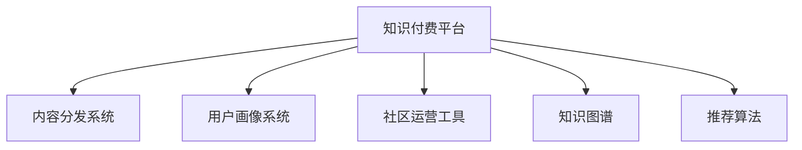

                 

# 打造专业社群:知识付费的增长引擎

## 1. 背景介绍

### 1.1 问题由来
在数字化时代，信息爆炸和知识碎片化成为了显著的趋势。人们对专业知识和深度内容的需求日益增长，而传统的知识获取方式已经无法满足日益丰富的信息需求。在线教育、知识付费等新兴模式应运而生，并迅速占据了市场。

知识付费领域最早起源于内容付费的尝试，但随着知识付费概念的流行，其市场前景更加广阔。目前，知识付费平台涵盖众多领域，从编程、设计、财经、医疗到心理、教育等，各种专业内容应有尽有，满足了用户对专业化、系统化、结构化知识的需求。

然而，如何提升知识付费平台的价值，实现其可持续增长，是当前面临的主要问题。一方面，平台需要不断丰富内容库，以吸引用户；另一方面，也需要保证内容的品质，为用户提供有价值的知识。此外，平台的商业模式、用户粘性、运营策略等方面也需要不断优化。

### 1.2 问题核心关键点
构建专业社群，打造知识付费的增长引擎，需要从内容、用户、运营、商业模式等多个维度进行综合考虑。核心关键点包括：

1. **内容丰富性**：平台需要持续不断地引入高质量、专业化的内容，以吸引用户并提升平台价值。
2. **用户粘性**：如何让用户长期活跃于平台，并不断复购，是知识付费平台发展的核心。
3. **运营策略**：通过有效的用户运营策略，提升用户参与度和内容传播效果。
4. **商业模式**：探索多样化的知识付费商业模式，如订阅、单次付费、众筹等，满足不同用户需求。

## 2. 核心概念与联系

### 2.1 核心概念概述

为更好地理解知识付费平台的运营和发展，本节将介绍几个密切相关的核心概念：

- **知识付费平台**：通过提供高质量的在线课程、电子书、讲座、专栏等专业内容，满足用户对深度知识的渴望，并以此获取商业价值的平台。
- **内容分发系统**：实现内容的分发、推荐、搜索、排序等功能，提升内容的可发现性和用户体验。
- **用户画像系统**：构建用户画像，通过用户行为数据分析，提升用户粘性和平台价值。
- **社区运营工具**：包括社群管理、话题讨论、问答互动等功能，促进用户参与和内容交流。
- **知识图谱**：利用知识图谱技术，实现知识的关联和扩展，提升内容深度和广度。
- **推荐算法**：通过推荐算法，提高内容的匹配度和用户满意度。

这些核心概念之间的逻辑关系可以通过以下Mermaid流程图来展示：



这个流程图展示了你各个核心概念之间的逻辑关系：

1. **内容分发系统**：通过分发系统，用户可以方便地找到和消费内容。
2. **用户画像系统**：通过画像系统，平台可以更好地了解用户需求和行为，提升服务精准度。
3. **社区运营工具**：通过运营工具，平台可以营造活跃的用户氛围，促进用户互动。
4. **知识图谱**：通过知识图谱，平台可以实现知识的关联和扩展，提升内容的深度和广度。
5. **推荐算法**：通过推荐算法，平台可以提高内容的匹配度和用户满意度。

这些核心概念共同构成了知识付费平台的运营框架，使其能够高效地运营并不断提升用户体验和平台价值。

## 3. 核心算法原理 & 具体操作步骤

### 3.1 算法原理概述

知识付费平台的构建，本质上是基于大数据分析、机器学习、自然语言处理等多种技术手段，对内容、用户、运营等多个维度进行优化和提升。其核心算法包括但不限于：

- **内容推荐算法**：通过分析用户行为和内容特征，推荐符合用户兴趣和需求的内容。
- **用户画像算法**：通过数据分析，构建用户画像，了解用户需求和行为，提升服务精准度。
- **自然语言处理(NLP)**：利用NLP技术，提升内容的理解和分析能力，增强内容的价值。
- **知识图谱构建**：通过知识图谱技术，实现知识的关联和扩展，提升内容的深度和广度。
- **社区互动分析**：通过分析社区互动数据，了解用户需求和行为，提升用户参与度和平台粘性。

### 3.2 算法步骤详解

以下是知识付费平台构建的核心算法步骤：

**Step 1: 数据收集与预处理**
- 收集平台用户的行为数据、内容数据、社区互动数据等，存储到数据仓库中。
- 对数据进行清洗、去重、标注等预处理操作，确保数据的准确性和可用性。

**Step 2: 用户画像构建**
- 通过机器学习算法，对用户的行为数据、消费数据等进行分析，构建用户画像。
- 用户画像包括用户的基本信息、兴趣偏好、学习习惯、消费行为等，用于指导内容推荐和个性化服务。

**Step 3: 内容推荐系统构建**
- 利用协同过滤、基于内容的推荐算法、深度学习推荐模型等技术，构建内容推荐系统。
- 通过分析用户的历史行为和偏好，推荐符合用户需求的内容，提升用户满意度。

**Step 4: 知识图谱构建**
- 利用知识图谱技术，将知识内容进行结构化表示和关联。
- 通过构建知识图谱，提升内容的深度和广度，增强内容的价值。

**Step 5: 社区互动分析**
- 分析社区互动数据，了解用户需求和行为，提升用户参与度和平台粘性。
- 通过社区运营工具，促进用户互动，构建活跃的社区氛围。

**Step 6: 运营策略制定**
- 制定有效的用户运营策略，如优惠券、打卡奖励、会员特权等，提升用户粘性和复购率。
- 根据用户行为数据和平台运营数据，不断优化运营策略，提升平台价值。

### 3.3 算法优缺点

知识付费平台的构建涉及多种算法，各具优缺点：

- **优点**：
  - **提升用户满意度**：通过精准的内容推荐和个性化服务，提升用户满意度和平台粘性。
  - **增加用户粘性**：通过社区运营工具和用户互动分析，增加用户参与度和平台粘性。
  - **提升内容价值**：通过知识图谱构建和内容推荐，提升内容的深度和广度，增强内容的价值。

- **缺点**：
  - **数据隐私问题**：用户行为数据和内容数据的收集和使用，需要遵循隐私保护政策。
  - **算法复杂度高**：知识付费平台的构建涉及多种算法，算法复杂度高，实现难度大。
  - **成本投入高**：平台运营和发展需要持续的技术投入和运营成本。

尽管存在这些局限性，但就目前而言，基于大数据分析和机器学习的知识付费平台构建方法，仍是实现平台增长和提升用户体验的重要手段。未来相关研究的重点在于如何进一步降低算法复杂度，优化用户画像和内容推荐算法，同时兼顾数据隐私和运营成本等因素。

### 3.4 算法应用领域

基于知识付费平台的构建算法，已经在诸多领域得到了广泛的应用，如在线教育、职业培训、职业技能认证、专业书籍、市场分析等，为各行业提供了深入的知识服务和决策支持。

此外，知识付费平台的构建方法也被创新性地应用到更多场景中，如电商推荐系统、社交媒体内容推荐、广告推荐系统等，为数字化转型提供了新的解决方案。随着技术的发展和应用的深入，相信知识付费平台的构建方法将继续扩展其应用范围，为更多行业带来新的突破。

## 4. 数学模型和公式 & 详细讲解  
### 4.1 数学模型构建

本节将使用数学语言对知识付费平台构建的核心算法进行更加严格的刻画。

记知识付费平台为 $P$，用户集合为 $U$，内容集合为 $C$，社区集合为 $S$。平台的目标是最大化用户满意度，即最大化用户的期望效用函数 $E(U)$。

定义用户对内容 $c_i$ 的兴趣度为 $i(c_i)$，对社区内容 $s_j$ 的参与度为 $j(s_j)$。通过机器学习算法，构建用户画像 $u$，用户画像 $u$ 对内容 $c_i$ 的兴趣度为 $i_u(c_i)$，对社区内容 $s_j$ 的参与度为 $j_u(s_j)$。

定义内容推荐算法为 $R$，对内容 $c_i$ 的推荐概率为 $R_i$。通过知识图谱技术，内容 $c_i$ 与 $c_j$ 的关联度为 $r_{ij}$。

知识付费平台的运营目标可以表示为：

$$
\maximize_{u, R} \sum_{i \in U} \sum_{j \in S} w_i j_u(s_j)R_i
$$

其中 $w_i$ 为用户 $i$ 的权重，$R_i$ 为用户 $i$ 对内容 $c_i$ 的推荐概率。

### 4.2 公式推导过程

以下我们以内容推荐算法为例，推导协同过滤推荐模型的数学公式。

设用户 $i$ 的历史评分数据为 $I_i=(i_{1}, i_{2}, ..., i_{n})$，内容 $j$ 的评分数据为 $J_j=(j_{1}, j_{2}, ..., j_{m})$，其中 $i_k$ 和 $j_k$ 表示用户对内容的评分。则协同过滤推荐模型的目标是最大化预测评分和真实评分的相关性：

$$
\maximize_{\hat{r}} \sum_{i \in U} \sum_{j \in C} i_{k} \log \hat{r}_{k}
$$

其中 $\hat{r}_{k}$ 为用户 $i$ 对内容 $j$ 的预测评分。

通过矩阵分解的方法，将协同过滤推荐模型的目标转化为矩阵分解问题：

$$
\hat{r}_{k} = a_i \cdot b_j^T
$$

其中 $a_i$ 和 $b_j$ 分别为用户和内容的隐向量。

将 $\hat{r}_{k}$ 代入目标函数，得到：

$$
\maximize_{a_i, b_j} \sum_{i \in U} \sum_{j \in C} i_{k} \log a_i \cdot b_j^T
$$

通过优化算法求解上述优化问题，即可得到协同过滤推荐模型。

### 4.3 案例分析与讲解

以在线教育平台为例，分析内容推荐算法的应用。

在线教育平台通过收集用户的学习行为数据，如学习时长、学习进度、考试分数等，构建用户画像 $u$。通过分析用户对不同课程的评分，构建内容画像 $c$。

内容推荐算法 $R$ 通过协同过滤方法，对用户 $i$ 推荐兴趣度较高的课程 $j$。具体实现如下：

1. 对用户 $i$ 和内容 $j$ 的历史评分数据进行预处理和归一化。
2. 使用矩阵分解的方法，对用户和内容进行隐向量表示。
3. 计算用户 $i$ 对内容 $j$ 的预测评分 $\hat{r}_{ij}$。
4. 根据预测评分 $\hat{r}_{ij}$ 排序，推荐评分较高的课程。

通过内容推荐算法，用户可以更快地找到感兴趣和合适的课程，提升学习效率和平台满意度。

## 5. 项目实践：代码实例和详细解释说明
### 5.1 开发环境搭建

在进行知识付费平台构建的项目实践前，我们需要准备好开发环境。以下是使用Python进行Flask开发的环境配置流程：

1. 安装Anaconda：从官网下载并安装Anaconda，用于创建独立的Python环境。

2. 创建并激活虚拟环境：
```bash
conda create -n pythong-env python=3.8 
conda activate pythong-env
```

3. 安装Flask：从官网下载并安装Flask，适用于Web开发。
```bash
pip install Flask
```

4. 安装Flask扩展库：
```bash
pip install Flask-SQLAlchemy Flask-Login Flask-WTF
```

5. 安装各类工具包：
```bash
pip install numpy pandas scikit-learn matplotlib tqdm jupyter notebook ipython
```

完成上述步骤后，即可在`pythong-env`环境中开始项目实践。

### 5.2 源代码详细实现

这里我们以在线教育平台的内容推荐系统为例，给出使用Flask构建的Python代码实现。

首先，定义SQLAlchemy模型：

```python
from flask_sqlalchemy import SQLAlchemy

db = SQLAlchemy()

class User(db.Model):
    id = db.Column(db.Integer, primary_key=True)
    name = db.Column(db.String(64), unique=True)
    email = db.Column(db.String(64), unique=True)
    courses = db.relationship('Course', backref='users')

class Course(db.Model):
    id = db.Column(db.Integer, primary_key=True)
    name = db.Column(db.String(64))
    description = db.Column(db.Text)
    score = db.Column(db.Float)

    def __repr__(self):
        return f'<Course {self.name}>'
```

然后，定义Flask应用程序和路由：

```python
from flask import Flask, render_template, request

app = Flask(__name__)

@app.route('/')
def index():
    return render_template('index.html')

@app.route('/recommend')
def recommend():
    user_id = request.args.get('user_id')
    user = User.query.get(user_id)
    if user:
        courses = [(c.id, c.name) for c in user.courses]
        return render_template('recommend.html', courses=courses)
    else:
        return 'User not found', 404

if __name__ == '__main__':
    app.run(debug=True)
```

最后，启动Flask应用，展示推荐结果：

```python
# 在终端运行以下命令启动Flask应用
# python app.py
# 在浏览器中访问 http://localhost:5000/recommend?user_id=1
```

以上就是一个简单的在线教育平台内容推荐系统的Python代码实现。可以看到，通过Flask框架，我们可以轻松实现Web应用，并通过SQLAlchemy进行数据管理。

### 5.3 代码解读与分析

让我们再详细解读一下关键代码的实现细节：

**SQLAlchemy模型定义**：
- `User` 模型代表平台的用户，包含用户ID、用户名、邮箱等信息。`courses` 属性表示用户参与的课程。
- `Course` 模型代表课程，包含课程ID、课程名称、描述、评分等信息。

**Flask应用程序和路由定义**：
- `index` 路由展示平台主页。
- `recommend` 路由接收用户ID，查询用户参与的课程，并展示推荐结果。

**Flask应用启动**：
- 通过 `app.run(debug=True)` 启动Flask应用，并在浏览器中访问推荐页面。

在实际应用中，上述代码只是最基础的部分。真正的推荐系统还需要通过算法实现预测评分、计算相似度、排序推荐等功能。知识付费平台的构建还需要更加复杂的设计和优化，如用户画像、社区互动分析、推荐算法优化等。但核心的算法流程与上述示例类似。

## 6. 实际应用场景
### 6.1 在线教育平台

在线教育平台是知识付费平台最具代表性的应用之一。通过构建内容推荐系统，平台可以更好地满足用户的学习需求，提升平台的用户粘性和满意度。

以在线教育平台为例，平台可以通过收集用户的学习行为数据，构建用户画像 $u$，并分析用户对不同课程的评分数据，构建内容画像 $c$。通过协同过滤推荐算法，对用户 $i$ 推荐评分较高的课程 $j$。

推荐系统可以显著提升用户的学习效率和满意度，同时增加平台的收入。具体应用场景包括：

- **个性化课程推荐**：根据用户的学习行为和兴趣，推荐适合用户的学习课程，提升学习效率。
- **学习路径规划**：根据用户的学习进度和成绩，推荐合适的学习路径，帮助用户制定学习计划。
- **知识图谱构建**：通过知识图谱技术，实现课程内容的关联和扩展，提升内容的深度和广度。

### 6.2 职业培训平台

职业培训平台是知识付费平台的另一个重要应用场景。通过构建内容推荐系统，平台可以更好地满足用户的职业培训需求，提升平台的用户粘性和平台价值。

以职业培训平台为例，平台可以通过收集用户的学习行为数据，构建用户画像 $u$，并分析用户对不同课程的评分数据，构建内容画像 $c$。通过推荐算法，对用户 $i$ 推荐评分较高的课程 $j$。

推荐系统可以显著提升用户的培训效果和满意度，同时增加平台的收入。具体应用场景包括：

- **个性化培训推荐**：根据用户的职业需求和技能水平，推荐适合的培训课程，提升培训效果。
- **学习路径规划**：根据用户的学习进度和成绩，推荐合适的学习路径，帮助用户制定职业规划。
- **知识图谱构建**：通过知识图谱技术，实现培训内容的关联和扩展，提升内容的深度和广度。

### 6.3 职业技能认证平台

职业技能认证平台是知识付费平台的又一重要应用场景。通过构建内容推荐系统，平台可以更好地满足用户的职业技能认证需求，提升平台的用户粘性和平台价值。

以职业技能认证平台为例，平台可以通过收集用户的学习行为数据，构建用户画像 $u$，并分析用户对不同课程的评分数据，构建内容画像 $c$。通过推荐算法，对用户 $i$ 推荐评分较高的课程 $j$。

推荐系统可以显著提升用户的职业技能认证效果和满意度，同时增加平台的收入。具体应用场景包括：

- **个性化认证推荐**：根据用户的职业需求和技能水平，推荐适合的认证课程，提升认证效果。
- **学习路径规划**：根据用户的学习进度和成绩，推荐合适的学习路径，帮助用户制定职业发展计划。
- **知识图谱构建**：通过知识图谱技术，实现职业技能认证内容的关联和扩展，提升内容的深度和广度。

### 6.4 未来应用展望

随着知识付费平台的发展，未来的应用场景将更加广泛，将涵盖更多领域和行业。

在智慧医疗领域，知识付费平台可以通过构建内容推荐系统，为用户提供专业的医疗健康知识，提升用户健康素养。

在智能制造领域，知识付费平台可以通过构建内容推荐系统，为用户提供制造业的最新技术、行业动态和职业技能培训，提升制造企业的技术水平和创新能力。

在智慧城市领域，知识付费平台可以通过构建内容推荐系统，为用户提供城市规划、智能交通、智慧环保等方面的知识，提升城市的智能化水平。

## 7. 工具和资源推荐
### 7.1 学习资源推荐

为了帮助开发者系统掌握知识付费平台的运营和发展，这里推荐一些优质的学习资源：

1. **《机器学习实战》（第二版）**：通过实战案例，介绍了机器学习算法的实现方法，适用于编程基础较好的开发者。
2. **《深度学习与Python》**：介绍了深度学习的基础知识和应用场景，适用于对深度学习感兴趣的新手开发者。
3. **《算法设计与分析》**：介绍了经典算法的实现和优化方法，适用于需要深入理解算法原理的开发者。
4. **Kaggle竞赛平台**：提供大量数据集和竞赛题目，锻炼数据处理和机器学习技能，适用于追求高水平挑战的开发者。
5. **Coursera在线课程**：提供机器学习、深度学习、自然语言处理等领域的在线课程，适用于需要系统学习的开发者。

通过对这些资源的学习实践，相信你一定能够快速掌握知识付费平台的运营方法和技术细节，并用于解决实际问题。

### 7.2 开发工具推荐

高效的开发离不开优秀的工具支持。以下是几款用于知识付费平台开发的常用工具：

1. **Python**：语言简洁、易于理解，是知识付费平台开发的主要语言。
2. **Flask**：轻量级的Web框架，适合快速原型开发和前后端分离。
3. **SQLAlchemy**：ORM框架，方便进行数据库操作，支持多种数据库。
4. **Jupyter Notebook**：数据科学和机器学习的利器，支持代码编写、数据可视化和交互式计算。
5. **TensorFlow**：深度学习框架，支持分布式计算和模型部署，适用于大规模应用场景。
6. **Scikit-learn**：机器学习库，提供了丰富的机器学习算法和工具，适用于数据预处理和模型训练。

合理利用这些工具，可以显著提升知识付费平台开发效率，加快创新迭代的步伐。

### 7.3 相关论文推荐

知识付费平台的构建源于学界的持续研究。以下是几篇奠基性的相关论文，推荐阅读：

1. **《推荐系统》（RecSys 2008）**：介绍了协同过滤推荐算法和基于内容的推荐算法，是推荐系统领域的经典之作。
2. **《深度学习在推荐系统中的应用》（NIPS 2013）**：介绍了深度学习在推荐系统中的应用方法，展示了深度学习算法的优越性。
3. **《知识图谱的构建与应用》（SIGIR 2017）**：介绍了知识图谱的构建方法和应用场景，展示了知识图谱技术在推荐系统中的应用。
4. **《协同过滤推荐算法的研究与实现》（知网 2004）**：详细介绍了协同过滤推荐算法的原理和实现方法，是推荐系统领域的入门读物。
5. **《基于用户画像的推荐系统》（ECCV 2020）**：介绍了基于用户画像的推荐算法和实现方法，展示了用户画像技术在推荐系统中的应用。

这些论文代表了大数据和机器学习在知识付费平台构建中的最新进展。通过学习这些前沿成果，可以帮助研究者把握学科前进方向，激发更多的创新灵感。

## 8. 总结：未来发展趋势与挑战

### 8.1 总结

本文对知识付费平台的构建方法进行了全面系统的介绍。首先阐述了知识付费平台的发展背景和运营挑战，明确了平台构建的核心目标和方法。其次，从算法原理到实际操作，详细讲解了知识付费平台构建的核心算法和操作步骤，提供了完整的项目实践代码示例。最后，本文还广泛探讨了知识付费平台在多个行业领域的应用前景，展示了平台构建的广泛价值。

通过本文的系统梳理，可以看到，知识付费平台构建涉及多种技术和算法，需要从数据、算法、运营等多个维度进行综合优化。只有通过全面系统的构建，才能实现平台的可持续发展和用户价值的最大化。

### 8.2 未来发展趋势

展望未来，知识付费平台的构建将呈现以下几个发展趋势：

1. **数据驱动**：随着大数据技术的不断发展，知识付费平台将更加依赖数据驱动的决策和优化。平台需要不断收集和分析用户行为数据，提升服务精准度和用户体验。
2. **算法多样化**：未来的推荐算法将更加多样化和高效化，如基于深度学习的推荐模型、基于知识图谱的推荐算法等，提升推荐效果和用户体验。
3. **用户体验优化**：平台将更加注重用户体验的优化，如界面设计、交互体验、个性化推荐等，提升用户粘性和满意度。
4. **内容生态构建**：知识付费平台将更加注重内容的生态化构建，如内容共创、内容奖励等机制，增强内容的丰富性和多样性。
5. **智能化运营**：通过人工智能技术，平台可以实现智能化的运营和管理，如智能客服、智能内容管理等，提升运营效率和平台价值。

### 8.3 面临的挑战

尽管知识付费平台的发展前景广阔，但在迈向更加智能化、普适化应用的过程中，它仍面临着诸多挑战：

1. **数据隐私问题**：用户行为数据和内容数据的收集和使用，需要遵循隐私保护政策。如何在数据安全和用户隐私之间找到平衡，是知识付费平台构建的关键。
2. **算法复杂度高**：知识付费平台的构建涉及多种算法，算法复杂度高，实现难度大。如何在算法优化和系统可维护性之间找到平衡，是平台构建的重要课题。
3. **成本投入高**：平台运营和发展需要持续的技术投入和运营成本。如何在降低成本和提升用户体验之间找到平衡，是知识付费平台构建的关键。
4. **内容质量参差不齐**：虽然平台可以引入高质量内容，但内容质量和数量仍然存在较大差距。如何提升内容质量和多样性，是平台构建的重要课题。
5. **用户粘性不足**：如何提升用户粘性和平台忠诚度，是知识付费平台发展的关键。需要通过个性化的服务、丰富的内容和良好的用户体验来实现。

### 8.4 研究展望

面对知识付费平台构建所面临的挑战，未来的研究需要在以下几个方面寻求新的突破：

1. **数据隐私保护**：通过隐私保护技术，如差分隐私、联邦学习等，保护用户隐私数据，同时实现推荐系统的优化。
2. **算法优化**：开发更加高效和可解释的推荐算法，如基于深度学习的推荐模型、基于知识图谱的推荐算法等，提升推荐效果和用户体验。
3. **内容质量提升**：通过平台激励机制、内容共创机制等，提升内容质量和多样性，丰富平台内容生态。
4. **用户粘性提升**：通过个性化的服务、丰富的内容和良好的用户体验，提升用户粘性和平台忠诚度。
5. **智能化运营**：通过人工智能技术，实现智能化的运营和管理，如智能客服、智能内容管理等，提升运营效率和平台价值。

这些研究方向的探索，必将引领知识付费平台构建技术迈向更高的台阶，为构建安全、可靠、可解释、可控的智能系统铺平道路。面向未来，知识付费平台的构建需要与其他人工智能技术进行更深入的融合，如知识表示、因果推理、强化学习等，多路径协同发力，共同推动知识付费平台的进步。只有勇于创新、敢于突破，才能不断拓展知识付费平台的边界，让智能技术更好地造福人类社会。

## 9. 附录：常见问题与解答

**Q1：如何提升知识付费平台的推荐效果？**

A: 提升知识付费平台的推荐效果，需要从多个方面进行优化：
1. **数据收集和预处理**：收集高质量、多样化的用户行为数据和内容数据，进行清洗和标注。
2. **用户画像构建**：通过机器学习算法，构建准确的用户画像，了解用户需求和行为。
3. **内容画像构建**：分析内容特征和用户评分，构建准确的内容画像，用于推荐系统的构建。
4. **推荐算法优化**：选择适合的内容推荐算法，如协同过滤、深度学习推荐模型等，优化算法参数和模型结构。
5. **实时数据更新**：持续收集和分析用户行为数据，实时更新推荐结果，提升推荐效果。

**Q2：知识付费平台的运营策略有哪些？**

A: 知识付费平台的运营策略主要包括以下几个方面：
1. **优惠券和会员特权**：通过优惠券和会员特权，提升用户粘性和复购率。
2. **打卡奖励和分享奖励**：通过打卡奖励和分享奖励，增加用户参与度和内容传播效果。
3. **内容共创和社区互动**：通过内容共创和社区互动，提升内容质量和用户粘性。
4. **个性化推荐和内容优化**：通过个性化推荐和内容优化，提升用户满意度和平台价值。
5. **用户反馈和改进**：通过用户反馈，不断改进平台功能和用户体验，提升平台价值。

**Q3：如何保护用户隐私数据？**

A: 保护用户隐私数据是知识付费平台构建的重要课题。具体方法包括：
1. **数据匿名化**：对用户行为数据进行匿名化处理，保护用户隐私。
2. **差分隐私**：通过差分隐私技术，保护用户数据的安全性，同时实现推荐系统的优化。
3. **联邦学习**：通过联邦学习技术，在保护用户数据隐私的前提下，实现推荐系统的优化。
4. **数据加密**：对用户数据进行加密处理，保护用户数据的安全性。

这些方法可以有效地保护用户隐私数据，同时实现推荐系统的优化。

**Q4：如何构建知识图谱？**

A: 构建知识图谱是提升内容深度和广度的重要手段。具体方法包括：
1. **知识抽取**：通过自然语言处理技术，从文本中提取实体、关系和属性等知识元素。
2. **知识融合**：将抽取出的知识元素进行融合，构建知识图谱。
3. **知识扩展**：通过知识推理和关联，扩展知识图谱，提升内容的深度和广度。
4. **知识应用**：将知识图谱应用于推荐系统、搜索系统等场景，提升系统的智能化水平。

这些方法可以有效地构建知识图谱，提升内容的深度和广度。

**Q5：知识付费平台的内容推荐有哪些具体应用场景？**

A: 知识付费平台的内容推荐可以应用于多个场景，具体包括：
1. **个性化课程推荐**：根据用户的学习行为和兴趣，推荐适合的课程。
2. **学习路径规划**：根据用户的学习进度和成绩，推荐合适的学习路径。
3. **知识图谱构建**：通过知识图谱技术，实现课程内容的关联和扩展。
4. **职业培训推荐**：根据用户的职业需求和技能水平，推荐适合的培训课程。
5. **职业技能认证推荐**：根据用户的职业需求和技能水平，推荐适合的认证课程。

通过内容推荐系统，用户可以更快地找到感兴趣和合适的课程，提升学习效率和平台满意度。

---

作者：禅与计算机程序设计艺术 / Zen and the Art of Computer Programming

