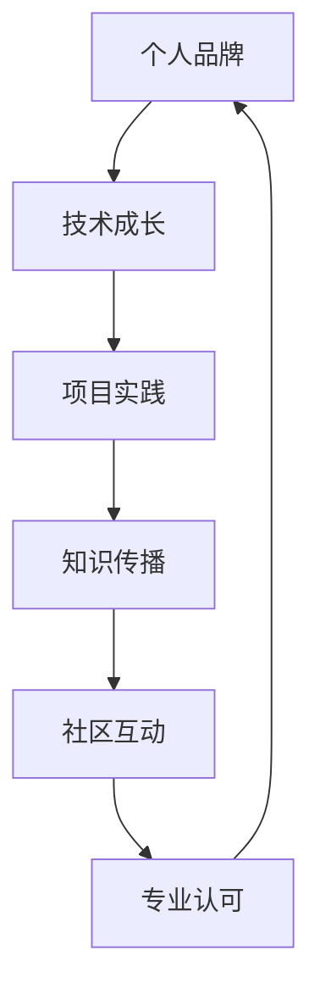

                 

# 打造个人品牌纪录片：讲述你的成长故事

> 关键词：个人品牌建设, 技术成长, 项目管理, 软件开发, 用户体验设计

## 1. 背景介绍

### 1.1 问题由来

在当今数字化时代，个人品牌建设已经成为科技从业者不可忽视的重要一环。随着社交媒体和内容创作的兴起，科技领域的专家、学者、开发者等都在通过各种方式塑造自己的影响力，增强个人品牌知名度，并从中获得更多的职业机会和发展资源。然而，在快速变化的技术环境中，如何有效构建和维护个人品牌，同时展现自己在技术领域的成就和价值，是一个既复杂又具有挑战性的问题。

### 1.2 问题核心关键点

要打造一个成功且持久的人设品牌，必须明确几个核心关键点：

- **技术积累**：不断学习新技术，深化专业知识的深度和广度。
- **持续输出**：通过技术博客、开源项目、论文发表、演讲等形式，不断分享和传播知识。
- **社区互动**：积极参与技术社区，与同行交流互动，建立良好的人脉关系。
- **专业认可**：通过各种认证、比赛、评选等方式，获得行业内的专业认可和评价。
- **品牌故事**：讲述自己的成长故事，构建有吸引力和感染力的个人品牌形象。

### 1.3 问题研究意义

在技术竞争日趋激烈的今天，个人品牌不仅仅是个体在职业上的“名片”，更是技术创新、产品开发的“助燃剂”。通过打造独特、鲜明的个人品牌，科技从业者能够：

1. **提升职业竞争力**：在求职、合作、咨询等场景中脱颖而出，获取更多的机会。
2. **推动技术发展**：成为技术社区中的意见领袖，影响行业趋势和应用实践。
3. **带动团队协作**：吸引志同道合的人才，共同推进技术创新和产品研发。
4. **构建影响力**：通过个人品牌的影响力，促进技术知识的普及和应用。
5. **实现个人价值**：实现技术追求与职业发展的有机结合，实现个人价值最大化。

本文将从个人品牌建设的视角出发，探讨如何通过技术成长和项目实践，构建一个富有影响力的个人品牌，并分享相关的策略和案例。

## 2. 核心概念与联系

### 2.1 核心概念概述

为了构建个人品牌，我们需要掌握以下几个核心概念：

- **个人品牌**：个人在社会和专业领域中的形象和声誉，是个人专业能力、技术背景、行业影响力等多方面综合体现。
- **技术成长**：通过不断学习和实践，深化专业技能和知识储备，提高技术水平和创新能力。
- **项目实践**：在实际项目中应用所学技术，积累经验，提升实际应用能力。
- **知识传播**：通过撰写博客、开发开源项目、发表学术论文等形式，传播和分享技术知识，影响他人。
- **社区互动**：积极参与技术社区，与同行交流协作，扩大影响力。
- **专业认可**：通过各种认证、评选等方式，获得行业内的专业认可和评价。

这些概念之间相互联系，共同构成个人品牌建设的整体框架。技术成长和项目实践为个人品牌的构建提供基础，知识传播和社区互动则帮助扩展影响力，而专业认可是个人品牌稳固的标志。

### 2.2 核心概念原理和架构的 Mermaid 流程图



## 3. 核心算法原理 & 具体操作步骤

### 3.1 算法原理概述

打造个人品牌的过程，本质上是一个不断学习和反馈的迭代过程。核心算法原理包括以下几点：

- **正反馈机制**：通过不断的学习和实践，积累技术成就，获得正反馈，从而推动个人品牌的成长。
- **多维度输出**：在技术博客、开源项目、论文发表、演讲等不同维度进行技术输出，全面展示个人品牌。
- **社交网络拓展**：积极参与技术社区，利用社交网络的力量，扩大个人品牌的影响力。
- **专业认证和评选**：通过各类认证和评选，获得行业内的专业认可，提升个人品牌的权威性。

### 3.2 算法步骤详解

构建个人品牌的过程可以分为以下几个关键步骤：

**Step 1: 技术积累**

- **持续学习**：选择合适的学习资源（如在线课程、专业书籍、技术博客等），系统学习技术知识，参加相关培训和研讨会。
- **实践应用**：在实际项目中应用所学技术，通过编程练习、技术实验等方式加深理解，积累经验。

**Step 2: 知识传播**

- **博客撰写**：创建个人技术博客，记录技术心得、项目经验、学习笔记等，定期更新内容。
- **开源项目**：参与开源项目，贡献代码，解决实际问题，展示技术实力。
- **论文发表**：撰写技术论文，通过学术期刊或会议发表，展现学术研究能力。
- **演讲交流**：参加技术会议、讲座，通过演讲和交流，分享技术见解，结识同行。

**Step 3: 社区互动**

- **技术社区**：加入技术社区，如GitHub、Stack Overflow、Reddit等，积极参与讨论，解答他人问题，分享技术经验。
- **网络社交**：利用社交网络平台，如LinkedIn、Twitter等，展示技术成就，扩大影响力。

**Step 4: 专业认可**

- **认证考试**：参加技术认证考试，如AWS、Google Cloud、Kubernetes等，获得官方认证。
- **评选奖项**：参与技术评选和奖项，如开源贡献奖、技术创新奖等，获得行业认可。

### 3.3 算法优缺点

个人品牌建设有以下几个优点：

- **促进学习**：通过输出知识和经验，不断巩固和提升技术水平。
- **提升影响力**：借助社区和社交网络，扩大个人在技术领域的影响力。
- **获得认可**：通过专业认证和评选，获得行业内外的认可和评价。

同时，也存在一些缺点：

- **时间和精力投入较大**：需要不断学习、实践、输出，耗费大量时间和精力。
- **高竞争性**：技术领域竞争激烈，个人品牌建设需要不断创新和突破。
- **市场变化快**：技术快速变化，个人品牌需要不断适应新技术和趋势。

### 3.4 算法应用领域

个人品牌建设的方法，在多个领域都有广泛应用，如：

- **软件开发**：通过技术博客、开源项目展示编程能力，获得同行认可。
- **人工智能**：在技术社区发表研究论文，参加AI比赛，提升行业影响力。
- **用户体验设计**：撰写设计博客，参与设计社区，展示设计思维和能力。
- **项目管理**：在项目管理平台分享项目经验和案例，提高项目管理能力。
- **系统架构**：在技术博客和社区分享架构设计和开发经验，构建专业形象。

## 4. 数学模型和公式 & 详细讲解 & 举例说明

### 4.1 数学模型构建

个人品牌建设过程中，可以通过以下数学模型来描述和分析：

设个人品牌的影响力为 $P$，技术水平为 $T$，社区影响力为 $C$，专业认可度为 $A$。则有：

$$
P = f(T, C, A)
$$

其中 $f$ 表示非线性函数，反映了技术水平、社区影响力、专业认可度对个人品牌影响力的综合作用。

### 4.2 公式推导过程

设 $T(t)$ 表示在时间 $t$ 时的技术水平，$C(t)$ 表示在时间 $t$ 时的社区影响力，$A(t)$ 表示在时间 $t$ 时的专业认可度。则有：

$$
\frac{dP}{dt} = \alpha \frac{dT}{dt} + \beta \frac{dC}{dt} + \gamma \frac{dA}{dt}
$$

其中 $\alpha, \beta, \gamma$ 为系数，反映了技术水平、社区影响力、专业认可度对个人品牌影响力增长的贡献。

通过求解上述微分方程，可以得到个人品牌影响力随时间的变化规律。

### 4.3 案例分析与讲解

假设一个软件开发人员，在初入行业时，其技术水平为 $T_0$，社区影响力为 $C_0$，专业认可度为 $A_0$。假设其每月分别以 $\delta T, \delta C, \delta A$ 的速度提升技术水平、社区影响力、专业认可度。则其个人品牌影响力 $P(t)$ 随时间变化的公式为：

$$
P(t) = P_0 + \int_0^t \alpha \delta T + \beta \delta C + \gamma \delta A dt
$$

其中 $P_0$ 表示初始影响力。通过设置不同的 $\delta$ 值，可以分析在不同提升策略下的影响力变化。

## 5. 项目实践：代码实例和详细解释说明

### 5.1 开发环境搭建

构建个人品牌的开发环境需要包括以下几个关键组件：

- **IDE选择**：选择适合的技术栈 IDE，如PyCharm、Visual Studio Code、IntelliJ IDEA 等。
- **版本控制**：使用 Git 进行代码版本管理，创建本地仓库和远程仓库。
- **代码托管**：将代码托管到 GitHub、GitLab、Bitbucket 等代码托管平台。
- **博客平台**：选择适合的技术博客平台，如Medium、CSDN、知乎等，进行内容发布。
- **社交网络**：在 LinkedIn、Twitter、Weibo 等社交平台上创建专业账号，分享技术内容。

### 5.2 源代码详细实现

以下是一个简单的开源项目代码实例，展示如何通过 GitHub 进行代码托管和社区互动：

1. **创建项目仓库**：
   ```bash
   git clone https://github.com/<username>/<project_name>.git
   cd <project_name>
   git init
   git remote add origin https://github.com/<username>/<project_name>.git
   git add .
   git commit -m "Initial commit"
   git push -u origin master
   ```

2. **编写代码**：
   ```python
   def hello_world():
       print("Hello, world!")

   hello_world()
   ```

3. **提交代码**：
   ```bash
   git add .
   git commit -m "Add hello_world function"
   git push
   ```

4. **社区互动**：
   - 在 GitHub 上提交 Issue 或 Pull Request，与社区成员讨论代码问题。
   - 通过评论功能，与贡献者交流互动，展示技术思维。
   - 使用 GitHub Issues 或 Markdown 笔记，记录项目进展和技术心得。

### 5.3 代码解读与分析

上述代码实例展示了通过 GitHub 进行代码托管和社区互动的基本流程：

- **克隆项目**：通过克隆 URL 地址，将代码复制到本地。
- **初始化仓库**：使用 `git init` 命令初始化本地仓库。
- **添加远程仓库**：使用 `git remote add` 命令添加远程仓库地址。
- **提交代码**：使用 `git add` 命令添加代码变更，使用 `git commit` 命令提交变更，使用 `git push` 命令推送到远程仓库。
- **社区互动**：通过 Issue 和 Pull Request 功能，与社区成员进行代码讨论和协作。

通过 GitHub 等代码托管平台，开发者可以轻松地展示和分享代码，与社区成员进行互动，提升个人品牌的影响力。

### 5.4 运行结果展示

通过 GitHub 的成功案例展示，开发者可以看到：

- **代码托管**：通过 GitHub 托管代码，可以方便地进行版本管理和协作。
- **社区互动**：通过 Issue 和 Pull Request 功能，展示技术贡献，获得社区认可。
- **代码分享**：通过代码托管平台，分享项目和代码，扩大影响力。

## 6. 实际应用场景

### 6.1 软件开发

在软件开发领域，个人品牌建设尤为重要。以下是几个实际应用场景：

- **开源贡献**：参与开源项目，贡献代码，展示技术能力。
- **技术博客**：撰写技术博客，分享编程经验，建立专业形象。
- **技术会议**：参加技术会议和研讨会，发表演讲，结识同行，扩大影响力。

### 6.2 人工智能

在人工智能领域，个人品牌建设同样关键：

- **学术研究**：在顶级会议和期刊上发表学术论文，展示学术研究能力。
- **开源项目**：参与和发起开源项目，贡献算法和代码，展示技术实力。
- **竞赛表现**：参加 Kaggle、天池等数据竞赛，展示模型性能，获得行业认可。

### 6.3 用户体验设计

用户体验设计领域，个人品牌建设可以通过以下方式实现：

- **设计博客**：撰写设计博客，分享设计思路和案例，展示设计能力。
- **设计社区**：参与设计社区讨论，分享设计经验，结识同行。
- **设计比赛**：参加设计比赛，展示设计成果，获得行业认可。

## 7. 工具和资源推荐

### 7.1 学习资源推荐

为了帮助开发者系统掌握个人品牌建设的理论基础和实践技巧，以下是一些优质的学习资源：

1. **《个人品牌打造的艺术》**：一本系统介绍个人品牌建设的书籍，涵盖技术学习、项目实践、社区互动等多个方面。
2. **《开发者之路》**：一本面向开发者的职业成长指南，涵盖技术学习、项目管理、软技能提升等多个维度。
3. **《技术博客写作指南》**：一本详细介绍技术博客写作技巧的书籍，帮助开发者通过博客建立个人品牌。
4. **《开源社区指南》**：一份详细介绍开源社区互动和贡献的指南，帮助开发者在开源社区建立影响力。
5. **《网络社交艺术》**：一本详细介绍网络社交技巧的书籍，帮助开发者通过社交网络扩大影响力。

### 7.2 开发工具推荐

在个人品牌建设的开发过程中，以下工具可以帮助开发者提升效率：

1. **PyCharm**：一个强大的 IDE，支持 Python 开发，提供丰富的代码补全、调试等功能。
2. **GitHub**：一个优秀的代码托管平台，提供代码版本管理、协作、社区互动等功能。
3. **Medium**：一个流行的技术博客平台，帮助开发者通过博客展示技术成就，扩大影响力。
4. **LinkedIn**：一个专业的社交平台，帮助开发者通过网络展示技术成就，结识同行。
5. **Twitter**：一个流行的社交媒体平台，帮助开发者通过技术分享，扩大影响力。

### 7.3 相关论文推荐

以下是几篇关于个人品牌建设和开发者成长的经典论文：

1. **《技术博客对个人品牌的影响》**：研究技术博客对开发者职业发展的影响。
2. **《开源项目对技术影响的研究》**：研究开源项目对开发者技术积累的影响。
3. **《社交网络对开发者职业发展的贡献》**：研究社交网络对开发者职业发展的影响。
4. **《开发者社区对技术分享的影响》**：研究开发者社区对技术分享的影响。
5. **《技术认证对开发者职业发展的影响》**：研究技术认证对开发者职业发展的影响。

## 8. 总结：未来发展趋势与挑战

### 8.1 研究成果总结

本文系统介绍了如何通过技术成长和项目实践，构建和维护个人品牌。通过个人品牌建设，开发者可以展示技术成就，扩大影响力，获得职业发展机会。

### 8.2 未来发展趋势

未来，个人品牌建设将呈现以下几个趋势：

1. **技术知识共享**：随着知识共享平台的兴起，个人品牌将更加重视通过技术博客、开源项目等方式分享知识。
2. **社交媒体影响力**：社交媒体将发挥越来越重要的作用，成为个人品牌建设的重要渠道。
3. **专业认证和评选**：各类技术认证和评选将更加重视，成为个人品牌认可的重要标志。
4. **跨领域合作**：个人品牌将更加注重跨领域的合作和影响力，推动技术创新和应用。

### 8.3 面临的挑战

尽管个人品牌建设带来了诸多机会，但也面临一些挑战：

1. **技术更新快**：技术领域快速变化，个人品牌需要不断学习新技术，跟上行业发展。
2. **高竞争性**：技术领域竞争激烈，个人品牌需要不断创新和突破。
3. **时间和精力投入大**：个人品牌建设需要大量时间和精力投入，难以平衡工作和生活。
4. **市场变化快**：技术市场变化快，个人品牌需要灵活调整和优化。

### 8.4 研究展望

未来，个人品牌建设需要更多关注以下几个方面：

1. **技术深度**：通过不断学习和实践，提升技术深度，成为领域内的专家。
2. **技术广度**：通过跨领域学习和实践，拓宽技术视野，推动技术创新。
3. **软技能提升**：通过沟通、协作等软技能提升，增强团队协作能力。
4. **持续输出**：通过持续输出和分享，建立个人品牌影响力。

## 9. 附录：常见问题与解答

**Q1：如何平衡个人品牌建设和日常工作？**

A: 合理规划时间和精力，将个人品牌建设融入日常工作中。通过技术博客、开源项目、社交媒体等渠道，展示技术成就，同时不断学习和提升技术水平。

**Q2：如何选择适合自己的技术博客平台？**

A: 选择适合技术博客的平台，如Medium、CSDN、知乎等。考虑平台的受众、内容形式、社区氛围等因素，选择与个人技术方向和风格相匹配的平台。

**Q3：如何选择适合自己的开源项目？**

A: 选择与技术方向相关、社区活跃、问题少的开源项目。通过参与和贡献，展示技术能力，扩大影响力。

**Q4：如何在社交媒体上建立专业形象？**

A: 通过分享技术内容、参与技术讨论、结识同行等方式，建立专业形象。保持内容质量和频率，逐步积累粉丝和影响力。

**Q5：如何选择适合自己的认证考试？**

A: 选择与技术方向相关、认证权威、覆盖范围广的认证考试。通过认证考试，获得行业认可，提升个人品牌价值。

---

作者：禅与计算机程序设计艺术 / Zen and the Art of Computer Programming

