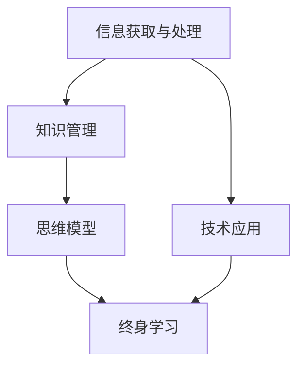

                 

## 1. 背景介绍

### 1.1 问题由来

在信息爆炸的时代，我们每天都会接触到海量的信息，包括新闻、文章、视频、图片等。如何在如此丰富的信息中筛选出真正有价值的内容，并将其转化为个人的知识储备，是每个现代人都面临的挑战。同时，随着技术的快速发展，人工智能、大数据、区块链等新兴技术不断涌现，如何保持与时俱进的学习能力，并利用这些新技术解决实际问题，也是我们必须面对的重要课题。

### 1.2 问题核心关键点

本节将介绍以下几个核心问题：

- 如何高效获取和处理信息？
- 如何将信息转化为个人知识？
- 如何利用技术解决实际问题？
- 如何在实践中不断优化和提升个人能力？

这些核心问题构成了个人思维体系建设的基础，其答案将指导我们如何在信息化社会中不断进步。

## 2. 核心概念与联系

### 2.1 核心概念概述

为更好地理解如何构建个人思维体系，本节将介绍几个密切相关的核心概念：

- 信息获取与处理：指通过各种渠道获取信息，并利用技术和工具对信息进行整理、筛选和归纳的过程。
- 知识管理：指将信息转化为个人知识，建立系统的知识体系，便于检索、应用和分享。
- 技术应用：指将技术知识应用于实际问题解决，提升工作效率和生活质量。
- 思维模型：指通过构建系统的思维框架，指导行动和决策，提升问题解决能力和创新思维。
- 终身学习：指不断更新知识和技能，适应不断变化的社会和技术环境。

这些核心概念之间的逻辑关系可以通过以下Mermaid流程图来展示：



这个流程图展示了几大核心概念之间的关系：

1. 信息获取与处理是知识管理的基础。
2. 知识管理使技术应用更加高效。
3. 技术应用推动思维模型的创新。
4. 思维模型指导终身学习。
5. 终身学习使信息获取与处理、知识管理、技术应用和思维模型等各个环节不断进步。

## 3. 核心算法原理 & 具体操作步骤

### 3.1 算法原理概述

个人思维体系的构建，本质上是利用信息获取、知识管理、技术应用和思维模型等手段，系统化地提升个人能力的过程。这一过程可以分为以下几个关键步骤：

1. 信息获取：通过多渠道、多方式获取相关信息。
2. 知识管理：利用信息整理、分类、存储等技术手段，构建个人知识库。
3. 技术应用：将技术知识应用于具体问题解决，提升工作效率和生活质量。
4. 思维模型：构建系统化的思维框架，指导行动和决策，提升问题解决能力。
5. 终身学习：通过持续学习和应用，不断更新知识和技能，适应不断变化的社会和技术环境。

### 3.2 算法步骤详解

#### 3.2.1 信息获取

信息获取是构建个人思维体系的基础。以下是几种常见的信息获取方法：

1. **订阅新闻源**：通过RSS、邮件订阅等方式，定期获取最新的行业新闻和技术动态。
2. **阅读书籍**：选择与自己领域相关的高质量书籍，系统化学习知识。
3. **观看视频和课程**：通过视频和在线课程，深入了解特定技术或领域。
4. **参加研讨会和会议**：与领域内的专家交流，获取前沿信息和经验。
5. **社交网络**：在LinkedIn、Twitter等社交平台上关注行业领袖和技术博客，获取最新信息。

#### 3.2.2 知识管理

知识管理是将信息转化为个人知识的关键步骤。以下几种方法可以帮助实现这一目标：

1. **信息分类**：利用标签、分类、主题等方式，对获取的信息进行分类和归纳。
2. **笔记系统**：使用Evernote、OneNote等笔记工具，记录和整理获取的信息。
3. **知识库**：建立自己的知识库，如Confluence、Notion等，方便检索和管理知识。
4. **思维导图**：使用XMind、MindMeister等工具，构建知识图谱，帮助理解和记忆。
5. **分享与交流**：将知识分享给他人，通过教别人巩固自己的知识。

#### 3.2.3 技术应用

技术应用是将知识转化为实际价值的重要环节。以下几种方法可以提升技术应用能力：

1. **项目管理工具**：使用Trello、Jira等工具，管理项目进度和资源分配。
2. **编程工具**：熟练掌握编程语言和开发环境，如Python、Git等。
3. **数据分析工具**：使用Pandas、NumPy等库，进行数据处理和分析。
4. **自动化工具**：使用Selenium、AutoIt等工具，实现自动化测试和部署。
5. **云计算平台**：熟悉AWS、Azure、Google Cloud等云平台，实现分布式计算和数据存储。

#### 3.2.4 思维模型

思维模型是系统化思考和决策的基础。以下几种方法可以帮助建立和优化思维模型：

1. **问题分解**：将复杂问题分解为多个小问题，逐步解决。
2. **因果分析**：利用因果图、流程图等方式，理解问题的根本原因和影响。
3. **SWOT分析**：分析项目的优势、劣势、机会和威胁，制定策略。
4. **五力模型**：分析行业竞争力的五个要素，指导市场策略。
5. **敏捷开发**：采用敏捷开发方法，快速迭代和优化产品。

#### 3.2.5 终身学习

终身学习是保持个人思维体系不断更新的关键。以下几种方法可以促成终身学习：

1. **设定学习目标**：明确自己的学习目标，并制定详细的学习计划。
2. **持续学习**：利用在线课程、技术博客、技术社区等方式，不断学习新技术和新知识。
3. **参加培训**：参加线下或线上的培训课程，提升专业技能。
4. **阅读技术论文**：阅读行业内外的技术论文，了解前沿研究成果。
5. **实践与反思**：通过实践和反思，总结经验教训，不断优化自己的思维体系。

## 4. 数学模型和公式 & 详细讲解 & 举例说明

### 4.1 数学模型构建

本节将使用数学语言对个人思维体系的构建过程进行更加严格的刻画。

设个人获取的信息为 $I=\{i_1, i_2, ..., i_n\}$，其中每个信息 $i_j$ 包含 $n_j$ 个属性 $A=\{a_{ij}\}_{i=1}^{n_j}$。通过信息获取、分类、存储等手段，得到个人知识库 $K=\{k_1, k_2, ..., k_m\}$，其中每个知识 $k_i$ 包含 $m_i$ 个属性 $B=\{b_{ik}\}_{i=1}^{m_i}$。利用技术工具，将知识 $k_i$ 应用于具体问题 $P$，得到解决方案 $S=\{s_1, s_2, ..., s_n\}$，其中每个解决方案 $s_j$ 包含 $p_j$ 个属性 $C=\{c_{sj}\}_{i=1}^{p_j}$。最终，通过思维模型 $M$ 对解决方案进行优化和决策，得到最终方案 $F$。

### 4.2 公式推导过程

假设信息 $i_j$ 的属性 $a_{ij}$ 与知识 $k_i$ 的属性 $b_{ik}$ 之间存在映射关系 $f_j^i$，则信息转化为知识的概率为：

$$
P(k_i|i_j) = \prod_{a_{ij} \in A} P(a_{ij}|k_i)
$$

利用信息 $i_j$ 和知识 $k_i$，应用技术工具得到解决方案 $s_j$ 的概率为：

$$
P(s_j|i_j, k_i) = \prod_{c_{sj} \in C} P(c_{sj}|i_j, k_i)
$$

将知识 $k_i$ 应用于具体问题 $P$ 得到最终方案 $F$ 的概率为：

$$
P(F|P, k_i) = \prod_{s_j \in S} P(s_j|P, k_i)
$$

综合上述公式，个人思维体系构建的总体概率为：

$$
P(M|I) = \prod_{i_j \in I} \prod_{k_i \in K} \prod_{s_j \in S} P(F|P, k_i)
$$

### 4.3 案例分析与讲解

以软件开发为例，构建个人思维体系的过程如下：

1. **信息获取**：通过订阅技术博客、参加技术会议、阅读书籍等方式，获取最新的技术动态。
2. **知识管理**：将获取的信息整理分类，建立自己的技术文档和知识库。
3. **技术应用**：利用Git、Jira、Maven等工具，进行版本控制、项目管理和代码部署。
4. **思维模型**：采用敏捷开发方法，将大问题分解为小任务，逐步实现功能。
5. **终身学习**：通过参加培训课程、阅读技术论文、实践新技术等方式，不断提升自己的技术能力。

通过系统化的方法，我们能够高效获取信息、管理知识、应用技术，并不断优化思维模型，从而提升软件开发能力。

## 5. 项目实践：代码实例和详细解释说明

### 5.1 开发环境搭建

在进行思维体系构建的实践前，我们需要准备好开发环境。以下是使用Python进行思维体系构建的环境配置流程：

1. 安装Anaconda：从官网下载并安装Anaconda，用于创建独立的Python环境。

2. 创建并激活虚拟环境：
```bash
conda create -n mindframework python=3.8 
conda activate mindframework
```

3. 安装必要的工具包：
```bash
pip install pandas numpy jupyter notebook
```

4. 安装一些辅助工具：
```bash
pip install pyconfluence 
```

5. 配置开发环境：
```bash
jupyter notebook --notebook-dir=notebooks
```

完成上述步骤后，即可在`mindframework`环境中开始实践。

### 5.2 源代码详细实现

下面以构建个人知识库为例，给出使用Python进行知识管理的代码实现。

首先，定义知识管理类：

```python
import pandas as pd
import numpy as np

class KnowledgeBase:
    def __init__(self, data):
        self.data = data
        self.categories = self.categorize()
    
    def categorize(self):
        categories = {}
        for i in range(len(self.data['title'])):
            category = self.data['category'][i]
            if category not in categories:
                categories[category] = []
            categories[category].append(i)
        return categories
    
    def get_category(self, category):
        return self.data.iloc[self.categories[category]]
    
    def search(self, keyword):
        results = []
        for i in range(len(self.data['title'])):
            if keyword in self.data.iloc[i]['title']:
                results.append(i)
        return self.data.iloc[results]
```

然后，创建数据集：

```python
data = {
    'title': ['Python入门', '机器学习基础', '深度学习实践', 'NLP技术应用', '区块链基础', '人工智能前沿'],
    'category': ['编程', '机器学习', '深度学习', 'NLP', '区块链', '人工智能'],
    'abstract': ['介绍Python基础语法', '讲解机器学习基本概念', '分享深度学习实践经验', '应用NLP技术实例', '探讨区块链技术应用', '介绍最新人工智能研究']
}

df = pd.DataFrame(data)
kb = KnowledgeBase(df)
```

最后，使用知识库进行搜索和分类：

```python
print(kb.get_category('编程'))
print(kb.search('Python'))
```

以上就是使用Python进行知识管理的完整代码实现。可以看到，通过简单的数据处理和分类操作，我们能够构建出具有搜索和分类功能的知识库。

### 5.3 代码解读与分析

让我们再详细解读一下关键代码的实现细节：

**KnowledgeBase类**：
- `__init__`方法：初始化数据集，进行分类操作，创建类别索引。
- `categorize`方法：对数据进行分类，将不同类别的信息索引存储在字典中。
- `get_category`方法：根据类别名获取对应的信息列表。
- `search`方法：根据关键词搜索信息，返回匹配结果的索引列表。

**数据集定义**：
- `data`变量：定义包含标题、类别和摘要的数据集。
- `df`变量：将数据集转换为Pandas DataFrame对象，方便后续操作。

**实例化知识库**：
- `kb`变量：实例化KnowledgeBase类，创建知识库对象。

可以看到，通过上述代码，我们成功构建了一个基于Python的知识管理库，可以实现基本的搜索和分类功能。

## 6. 实际应用场景

### 6.1 软件开发

软件开发过程中，个人思维体系的构建可以显著提升工作效率和质量。通过获取最新的技术动态、管理代码和技术文档、应用敏捷开发方法等手段，我们能够更快速、更准确地完成项目开发。

以敏捷开发为例，构建思维体系的过程如下：

1. **信息获取**：通过订阅技术博客、参加技术会议、阅读书籍等方式，获取最新的技术动态。
2. **知识管理**：将获取的信息整理分类，建立技术文档和知识库。
3. **技术应用**：利用Git、Jira、Maven等工具，进行版本控制、项目管理和代码部署。
4. **思维模型**：采用敏捷开发方法，将大问题分解为小任务，逐步实现功能。
5. **终身学习**：通过参加培训课程、阅读技术论文、实践新技术等方式，不断提升自己的技术能力。

通过系统化的方法，我们能够高效获取信息、管理知识、应用技术，并不断优化思维模型，从而提升软件开发能力。

### 6.2 项目管理

项目管理中，个人思维体系的构建可以显著提升项目管理的效率和效果。通过获取最新的项目管理知识、管理项目文档、应用项目管理工具等手段，我们能够更高效地进行项目规划和执行。

以项目管理为例，构建思维体系的过程如下：

1. **信息获取**：通过订阅项目管理博客、参加项目管理培训、阅读项目管理书籍等方式，获取最新的项目管理知识。
2. **知识管理**：将获取的知识整理分类，建立项目管理文档和知识库。
3. **技术应用**：利用项目管理工具，如Jira、Trello等，进行项目管理和任务分配。
4. **思维模型**：采用项目管理的最佳实践，如敏捷开发、精益管理等，指导项目管理过程。
5. **终身学习**：通过参加培训课程、阅读项目管理论文、实践项目管理新技术等方式，不断提升自己的项目管理能力。

通过系统化的方法，我们能够高效获取信息、管理知识、应用技术，并不断优化思维模型，从而提升项目管理能力。

### 6.3 数据科学

数据科学中，个人思维体系的构建可以显著提升数据处理和分析能力。通过获取最新的数据科学知识、管理数据集、应用数据科学工具等手段，我们能够更高效地进行数据分析和模型构建。

以数据科学为例，构建思维体系的过程如下：

1. **信息获取**：通过订阅数据科学博客、参加数据科学会议、阅读数据科学书籍等方式，获取最新的数据科学知识。
2. **知识管理**：将获取的知识整理分类，建立数据集和知识库。
3. **技术应用**：利用数据科学工具，如Pandas、NumPy等，进行数据处理和分析。
4. **思维模型**：采用数据科学的思维方法，如因果分析、特征工程等，指导数据科学过程。
5. **终身学习**：通过参加培训课程、阅读数据科学论文、实践数据科学新技术等方式，不断提升自己的数据科学能力。

通过系统化的方法，我们能够高效获取信息、管理知识、应用技术，并不断优化思维模型，从而提升数据科学能力。

## 7. 工具和资源推荐

### 7.1 学习资源推荐

为了帮助开发者系统掌握个人思维体系的构建理论基础和实践技巧，这里推荐一些优质的学习资源：

1. **《深度学习》课程**：斯坦福大学开设的深度学习课程，讲解深度学习的基本原理和应用。
2. **《数据科学基础》课程**：Coursera上的数据科学入门课程，讲解数据科学的基础知识和实践技巧。
3. **《项目管理》课程**：PMP认证课程，讲解项目管理的最佳实践和案例分析。
4. **《Python编程》书籍**：《Python核心编程》、《Python数据科学手册》等，讲解Python编程的基本语法和数据科学应用。
5. **《敏捷开发》书籍**：《敏捷软件开发：原则、模式与实践》、《Scrum敏捷管理》等，讲解敏捷开发的方法和实践。

通过对这些资源的学习实践，相信你一定能够快速掌握个人思维体系构建的精髓，并用于解决实际的IT问题。

### 7.2 开发工具推荐

高效的开发离不开优秀的工具支持。以下是几款用于个人思维体系构建开发的常用工具：

1. **Jupyter Notebook**：用于编写和运行Python代码的交互式笔记本，方便调试和分享代码。
2. **Git**：用于版本控制和代码协作的工具，方便管理和共享代码。
3. **Confluence**：用于知识管理和文档协作的平台，方便团队共享和协作。
4. **Trello**：用于项目管理和任务分配的工具，方便跟踪项目进度和资源分配。
5. **Google Drive**：用于文件管理和云存储的平台，方便存储和共享文档和数据。

合理利用这些工具，可以显著提升个人思维体系构建的开发效率，加快创新迭代的步伐。

### 7.3 相关论文推荐

个人思维体系的构建源于学界的持续研究。以下是几篇奠基性的相关论文，推荐阅读：

1. **《深度学习》论文**：Yann LeCun等人的深度学习论文，奠定了深度学习的基本框架和应用场景。
2. **《数据科学基础》论文**：J.D. Gunstig等人的数据科学论文，详细讲解了数据科学的方法和实践。
3. **《项目管理》论文**：Ken Schwaber等人的敏捷项目管理论文，介绍了敏捷开发的最佳实践和案例分析。
4. **《Python编程》论文**：Guido van Rossum等人的Python论文，详细讲解了Python编程的语法和应用。
5. **《敏捷开发》论文**：Martin Fowler等人的敏捷开发论文，介绍了敏捷开发的方法和实践。

这些论文代表了大数据和人工智能领域的最新成果，通过学习这些前沿成果，可以帮助研究者把握学科前进方向，激发更多的创新灵感。

## 8. 总结：未来发展趋势与挑战

### 8.1 总结

本文对个人思维体系的构建方法进行了全面系统的介绍。首先阐述了个人思维体系构建的背景和意义，明确了信息获取、知识管理、技术应用和思维模型等关键组件在构建个人能力中的作用。其次，从原理到实践，详细讲解了个人思维体系构建的数学模型和操作流程，给出了系统化的思维框架。同时，本文还广泛探讨了个人思维体系在软件开发、项目管理、数据科学等多个领域的应用前景，展示了构建个人思维体系的重要性和可行性。此外，本文精选了构建个人思维体系的各类学习资源，力求为读者提供全方位的技术指引。

通过本文的系统梳理，可以看到，个人思维体系的构建是现代科技环境下提升个人能力的重要途径。利用信息获取、知识管理、技术应用和思维模型等手段，我们能够高效获取信息、管理知识、应用技术，并不断优化思维模型，从而在不断变化的社会和技术环境中保持竞争力。

### 8.2 未来发展趋势

展望未来，个人思维体系的构建技术将呈现以下几个发展趋势：

1. **信息获取的多样化**：随着技术的发展，信息的获取将更加多样化和高效化，如语音搜索、图像识别等技术将使得信息获取更加便捷。
2. **知识管理的智能化**：利用人工智能技术，知识管理将变得更加智能化，如自动分类、关联推荐等，提升知识管理的效率和质量。
3. **技术应用的泛化化**：技术工具将更加泛化，应用于更多领域，如教育、医疗、金融等，提升各个领域的生产力和效率。
4. **思维模型的创新化**：通过引入更多先进的技术和方法，如因果分析、逻辑推理等，思维模型将变得更加创新和高效。
5. **终身学习的持续化**：通过技术手段，终身学习将变得更加便捷和可持续，如在线学习平台、虚拟现实等，提升学习效率和效果。

以上趋势凸显了个人思维体系构建技术的广阔前景。这些方向的探索发展，必将进一步提升信息获取、知识管理、技术应用和思维模型等各个环节的效率和质量，为个人能力提升提供新的动力。

### 8.3 面临的挑战

尽管个人思维体系的构建技术已经取得了瞩目成就，但在迈向更加智能化、普适化应用的过程中，它仍面临着诸多挑战：

1. **信息过载**：在信息爆炸的时代，如何从海量的信息中筛选出有价值的内容，是一个重要的挑战。
2. **知识管理复杂化**：随着知识量的增加，如何高效管理和检索知识，也是一个重要的挑战。
3. **技术应用广度化**：技术的广泛应用，需要跨领域的知识储备，是一个重要的挑战。
4. **思维模型通用化**：不同领域和场景下，如何构建通用的思维模型，也是一个重要的挑战。
5. **终身学习持续化**：如何实现终身学习的持续化，需要不断更新学习资源和方法，是一个重要的挑战。

正视这些挑战，积极应对并寻求突破，将是大数据和人工智能技术走向成熟的必由之路。相信随着学界和产业界的共同努力，这些挑战终将一一被克服，大数据和人工智能技术必将在各个领域带来变革性影响。

### 8.4 研究展望

面对大数据和人工智能技术所面临的挑战，未来的研究需要在以下几个方面寻求新的突破：

1. **自动化信息获取**：利用自动化技术，如爬虫、自然语言处理等，实现信息的自动获取和处理。
2. **智能化知识管理**：利用人工智能技术，如自然语言处理、机器学习等，实现知识的自动分类和关联推荐。
3. **泛化化技术应用**：开发更多泛化化技术工具，如智能推荐系统、虚拟现实等，提升技术工具的泛化能力。
4. **创新化思维模型**：引入更多创新化的思维方法，如因果分析、逻辑推理等，提升思维模型的创新能力和应用效果。
5. **持续化终身学习**：利用技术手段，如在线学习平台、虚拟现实等，实现终身学习的持续化和高效化。

这些研究方向将推动大数据和人工智能技术在各个领域的应用，为个人能力提升提供新的思路和方法。

## 9. 附录：常见问题与解答

**Q1：如何高效获取和处理信息？**

A: 利用信息获取工具，如RSS订阅器、邮件客户端、新闻聚合器等，获取最新的信息。使用信息处理工具，如文本分类、摘要生成等，对信息进行分类和摘要化处理，方便管理和使用。

**Q2：如何将信息转化为个人知识？**

A: 利用知识管理工具，如Confluence、Evernote等，建立个人知识库，进行信息的分类、存储和检索。通过阅读、笔记、思维导图等方法，将信息转化为个人知识，方便应用和分享。

**Q3：如何利用技术解决实际问题？**

A: 利用技术工具，如Git、Jira、Trello等，进行版本控制、项目管理、任务分配等。通过学习和实践，掌握技术工具的使用方法，提升技术应用能力。

**Q4：如何构建系统化的思维框架？**

A: 利用思维模型工具，如因果分析、SWOT分析等，建立系统化的思维框架，指导行动和决策。通过不断学习和实践，优化和改进思维模型，提升问题解决能力。

**Q5：如何实现终身学习的持续化？**

A: 利用在线学习平台，如Coursera、edX等，进行持续学习和实践。通过阅读技术论文、参与技术社区等方式，不断更新和完善自己的知识体系。

---

作者：禅与计算机程序设计艺术 / Zen and the Art of Computer Programming

