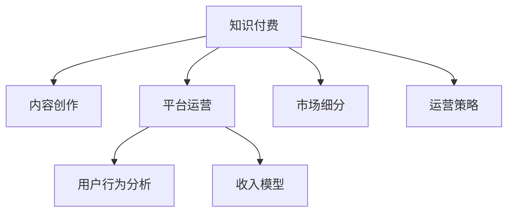

                 

# 打造个人知识付费生态系统的策略

> 关键词：知识付费, 内容创作, 平台运营, 用户行为分析, 收入模型, 市场细分

## 1. 背景介绍

随着互联网的普及和技术的进步，知识付费市场正在快速崛起，成为互联网行业的一个新趋势。相较于传统的免费内容，知识付费模式更加注重内容的专业性、深度和独创性，能够更好地满足用户对高质量知识的需求。在知识和信息爆炸的时代，个人拥有打造知识付费生态系统的绝佳机会。本文将从内容创作、平台运营、用户行为分析等多个角度出发，探讨如何打造个人知识付费生态系统，让更多高质量的知识内容能够得以传播和变现。

## 2. 核心概念与联系

### 2.1 核心概念概述

为了更好地理解本文所述内容，本节将介绍几个关键概念及其联系。

- **知识付费(Knowledge-Based Monetization)**：通过售卖知识、提供咨询、订阅服务等方式，向用户收取费用以获取收益的商业模式。知识付费平台如得到、知乎live、喜马拉雅等，通过引入专业作者、专家和意见领袖提供各类知识内容，满足用户的学习和认知需求。

- **内容创作(Content Creation)**：个人或团队创造、编辑、发布高质量的知识内容，如文章、视频、音频、电子书等。内容创作是知识付费生态系统的核心，其质量和专业性直接影响用户的购买意愿和满意度。

- **平台运营(Platform Operation)**：构建并运营知识付费平台，包括技术架构搭建、内容审核管理、用户关系维护、营销推广等。平台运营能力直接影响平台的用户留存率和内容传播效果。

- **用户行为分析(Usage Analytics)**：通过数据分析方法，研究用户在使用平台时的行为和偏好，如浏览、购买、分享等。用户行为分析有助于优化产品设计，提升用户体验，实现精准营销和个性化推荐。

- **收入模型(Monetization Model)**：平台如何获取收益，如单次购买、订阅、打赏、广告收入等。合理的收入模型是平台长期运营和发展的关键。

- **市场细分(Market Segmentation)**：根据用户需求、购买力、地域、兴趣等因素，将市场细分为不同的用户群体。市场细分有助于平台精准定位用户需求，提供差异化服务，提升用户体验和粘性。

这些概念之间的逻辑关系可以通过以下Mermaid流程图来展示：



这个流程图展示了几大核心概念及其之间的关系：

1. 知识付费平台通过引入专业内容创作者和运营团队，为内容创作和平台运营提供支撑。
2. 内容创作者基于用户需求和市场趋势，创作高质量的知识内容。
3. 平台运营团队构建并维护平台，通过数据分析优化运营策略，提升用户满意度。
4. 用户行为分析提供用户行为数据，指导内容推荐和个性化服务，提升用户体验。
5. 收入模型决定平台盈利方式，需要合理设计以保持平台健康发展。
6. 市场细分有助于平台精准定位，提供差异化服务，提升用户粘性和留存率。

## 3. 核心算法原理 & 具体操作步骤

### 3.1 算法原理概述

打造个人知识付费生态系统，核心在于内容创作、平台运营和用户行为分析三大环节。每个环节都有其核心算法和操作策略，本节将对核心算法进行概述。

- **内容创作算法**：内容推荐算法，如协同过滤、基于内容的推荐算法等，帮助用户发现感兴趣的知识点和内容。
- **平台运营算法**：用户行为分析算法，如用户画像构建、聚类算法、异常检测等，帮助平台优化运营策略。
- **用户行为分析算法**：用户行为预测模型，如基于机器学习的预测模型、序列模型等，帮助平台提升用户粘性和留存率。

### 3.2 算法步骤详解

以下将对各环节的核心算法步骤进行详解：

#### 3.2.1 内容创作算法

**算法步骤**：

1. **数据收集**：收集用户行为数据，包括阅读、观看、点赞、评论、收藏等。
2. **特征提取**：提取文本、标签、时长、用户画像等特征，用于后续算法建模。
3. **相似度计算**：计算不同内容之间的相似度，可以使用余弦相似度、Jaccard系数等。
4. **协同过滤**：基于用户历史行为和兴趣，推荐相关内容。
5. **基于内容的推荐**：通过分析内容的关键词、标签等信息，找到相关内容。
6. **混合推荐算法**：结合协同过滤和基于内容推荐的结果，提升推荐准确度。
7. **模型评估**：使用AUC、RMSE、MAE等指标评估推荐模型效果。

**算法优缺点**：

优点：
- 能够精准推荐用户感兴趣的内容，提高用户满意度。
- 能够最大化内容曝光率，提升内容创作者的收益。

缺点：
- 依赖于数据量和数据质量，数据质量差会导致推荐效果不佳。
- 需要消耗大量计算资源，导致性能瓶颈。

**算法应用领域**：
- 知识付费平台的内容推荐系统，如知乎、得到、喜马拉雅等。
- 电商平台的商品推荐系统，如淘宝、京东等。

#### 3.2.2 平台运营算法

**算法步骤**：

1. **用户画像构建**：根据用户行为数据构建用户画像，包括用户兴趣、偏好、行为模式等。
2. **聚类算法**：将用户分为不同群体，如学习型用户、职业型用户、娱乐型用户等。
3. **异常检测**：检测异常行为，如恶意刷分、垃圾评论等。
4. **数据可视化**：使用图表、仪表盘等工具展示用户行为数据，帮助运营人员进行决策。
5. **策略优化**：根据用户画像和行为数据，优化推荐策略、页面设计等。
6. **机器学习应用**：使用机器学习算法提升运营效率，如异常检测、预测用户流失等。

**算法优缺点**：

优点：
- 能够帮助平台优化运营策略，提升用户留存率。
- 能够帮助平台识别和应对异常行为，维护平台健康。

缺点：
- 依赖于高质量的数据，数据质量差会导致分析结果不准确。
- 需要高水平的数据分析和机器学习能力，对人员要求较高。

**算法应用领域**：
- 知识付费平台的运营决策，如知乎、得到、喜马拉雅等。
- 电商平台的运营优化，如淘宝、京东等。

#### 3.2.3 用户行为分析算法

**算法步骤**：

1. **数据采集**：收集用户行为数据，如浏览、观看、购买、评分等。
2. **特征工程**：设计并提取特征，如用户ID、内容ID、时间戳、观看时长等。
3. **模型训练**：选择并训练模型，如线性回归、随机森林、神经网络等。
4. **预测和评估**：使用训练好的模型进行预测，并评估模型效果。
5. **策略调整**：根据预测结果，调整产品策略，如内容推荐、个性化服务、用户留存等。

**算法优缺点**：

优点：
- 能够帮助平台预测用户行为，优化用户体验和留存率。
- 能够实现精准营销，提升用户转化率。

缺点：
- 依赖于数据量和特征设计，数据量小或特征设计不当会导致预测效果不佳。
- 需要复杂的机器学习模型，实现难度较高。

**算法应用领域**：
- 知识付费平台的个性化推荐和用户管理，如知乎、得到、喜马拉雅等。
- 电商平台的个性化推荐和客户细分，如淘宝、京东等。

### 3.3 算法优缺点

知识付费生态系统的核心算法具有以下优缺点：

**优点**：
- 能够提高内容推荐和用户留存的精准度，提升用户体验和满意度。
- 能够帮助平台优化运营策略，提高运营效率和收益。
- 能够实现精准营销，提升用户转化率和粘性。

**缺点**：
- 依赖于数据量和数据质量，数据质量差会导致算法效果不佳。
- 需要高水平的数据分析和机器学习能力，对人员和技术要求较高。
- 需要消耗大量计算资源，导致性能瓶颈。

### 3.4 算法应用领域

知识付费生态系统的核心算法广泛应用于知识付费平台的各个环节：

- **内容推荐系统**：如知乎、得到、喜马拉雅等平台的内容推荐算法。
- **用户画像构建**：通过用户行为数据构建用户画像，优化个性化推荐。
- **异常检测和预警**：检测和预警平台异常行为，如恶意刷分、垃圾评论等。
- **精准营销**：通过用户行为数据实现精准营销，提升用户转化率。
- **个性化服务**：根据用户行为数据提供个性化推荐和定制化服务。

## 4. 数学模型和公式 & 详细讲解 & 举例说明

### 4.1 数学模型构建

在知识付费生态系统中，涉及的数学模型主要包括：

- **协同过滤推荐模型**：计算用户与内容之间的相似度，如余弦相似度、皮尔逊相关系数等。
- **基于内容的推荐模型**：通过内容特征计算相似度，如TF-IDF、word2vec等。
- **用户行为预测模型**：如随机森林、线性回归、神经网络等，用于预测用户行为和流失风险。

### 4.2 公式推导过程

以下以协同过滤推荐模型为例，推导其计算公式。

设用户$u$对内容$i$的评分$r_{ui} \in [1,5]$，内容集合为$C$，用户集合为$U$。协同过滤算法通过计算用户之间的相似度$S_{ij}$，找到用户$u$最相似的用户$j$，并将用户$j$评分最高的$n$个内容推荐给用户$u$。

协同过滤算法基于用户-物品矩阵$R$计算用户之间的相似度$S$，其计算公式为：

$$
S_{ij} = \frac{R_{i,i_1}R_{j,i_1}}{\sqrt{(R_{i,i_1}^2+R_{j,i_1}^2)}
$$

其中$i_1$为与$u$最相似的用户，$R_{i,i_1}$和$R_{j,i_1}$为$i$和$j$对$i_1$的评分。

用户$i$最相似的内容集合为$I_{i_1}$，则用户$i$推荐的内容集合为：

$$
I_i = \{c | c \in C, r_{ci} > \bar{r} \text{ and } c \notin I_{i_1}\}
$$

其中$\bar{r}$为用户$i$的平均评分，$I_{i_1}$为$i$最相似的内容集合。

**公式推导过程**：

1. **相似度计算**：根据用户行为数据，计算用户之间的相似度$S_{ij}$。
2. **找到最相似用户**：根据相似度$S_{ij}$，找到用户$u$最相似的用户$j$。
3. **推荐内容集合**：根据最相似用户$j$评分最高的$n$个内容，推荐给用户$u$。
4. **过滤已推荐内容**：过滤掉已推荐的内容，避免重复推荐。

### 4.3 案例分析与讲解

以知乎平台为例，分析如何利用协同过滤推荐算法提升内容推荐效果。

知乎平台是一个知识问答社区，拥有大量的用户和内容。通过协同过滤推荐算法，知乎可以推荐用户感兴趣的相关内容，提高用户粘性和留存率。

1. **数据收集**：收集知乎用户的阅读、点赞、评论等行为数据。
2. **特征提取**：提取文本、标签、用户ID等特征，用于计算相似度。
3. **协同过滤推荐**：根据用户行为数据计算用户之间的相似度，找到相似用户，推荐其评分高的内容。
4. **模型评估**：使用AUC、RMSE等指标评估推荐效果，不断优化算法。
5. **应用场景**：知乎的首页推荐、话题推荐、热门内容推荐等。

## 5. 项目实践：代码实例和详细解释说明

### 5.1 开发环境搭建

在进行知识付费生态系统开发前，需要准备好开发环境。以下是使用Python进行知识付费平台开发的开发环境配置流程：

1. 安装Anaconda：从官网下载并安装Anaconda，用于创建独立的Python环境。
2. 创建并激活虚拟环境：
```bash
conda create -n knowledge-payment-env python=3.8 
conda activate knowledge-payment-env
```

3. 安装所需依赖：
```bash
pip install numpy pandas scikit-learn scikit-learn keras tensorflow
```

4. 安装Flask和Django等Web框架：
```bash
pip install flask django
```

5. 安装推荐系统相关库：
```bash
pip install scikit-learn
```

完成上述步骤后，即可在`knowledge-payment-env`环境中开始开发。

### 5.2 源代码详细实现

以下是一个简单的知识付费平台推荐系统代码实现。

首先，定义推荐系统数据集：

```python
import pandas as pd

# 定义数据集
df = pd.read_csv('data/user_item_matrix.csv')
```

然后，定义推荐算法：

```python
from sklearn.metrics.pairwise import cosine_similarity

# 计算相似度
def compute_similarity(R, i, j):
    return cosine_similarity(R[i], R[j])

# 推荐内容
def recommend_content(R, i, n):
    similarity_scores = []
    for j in range(len(R)):
        if j == i:
            continue
        similarity_score = compute_similarity(R, i, j)
        recommended_items = [item for item, score in zip(R[j], R[j]) if score > 0.5]
        similarity_scores.append(similarity_score)
    recommended_items = sorted(recommended_items, key=lambda x: similarity_scores)
    return recommended_items[:n]
```

最后，构建推荐系统接口：

```python
from flask import Flask, request

app = Flask(__name__)

@app.route('/recommend', methods=['POST'])
def recommend():
    user_id = request.json['user_id']
    n = 5
    recommended_items = recommend_content(df, user_id, n)
    return {'items': recommended_items}

if __name__ == '__main__':
    app.run(debug=True)
```

以上代码实现了一个简单的基于协同过滤推荐算法的内容推荐系统。当用户ID为`user_id`时，推荐系统将返回前5个推荐内容。

### 5.3 代码解读与分析

让我们再详细解读一下关键代码的实现细节：

**推荐系统数据集**：
- `pd.read_csv('data/user_item_matrix.csv')`：从CSV文件中读取用户-物品矩阵。

**相似度计算**：
- `compute_similarity(R, i, j)`：使用余弦相似度计算用户$i$和用户$j$的相似度。

**推荐内容**：
- `recommend_content(R, i, n)`：根据相似度得分，推荐给用户$i$前$n$个未推荐过的内容。

**接口构建**：
- `recommend()`：通过Flask构建接口，接收用户ID并返回推荐内容。

通过以上代码，我们可以看到知识付费平台的推荐系统是如何在后端进行处理的。在实际应用中，还可以进一步优化算法和接口设计，以满足更多业务需求。

## 6. 实际应用场景

### 6.1 智能客服

知识付费平台可以引入智能客服功能，使用AI技术实现用户咨询的自动回复。通过收集历史问答数据，训练自然语言处理模型，实现对常见问题的自动回答。智能客服可以大幅提升用户满意度，提高平台的用户留存率。

### 6.2 个性化推荐

知识付费平台可以根据用户的历史行为数据，实现个性化推荐。通过协同过滤、基于内容的推荐等算法，推荐用户可能感兴趣的内容，提升用户粘性。例如，知乎可以推荐用户感兴趣的话题、文章和回答，增强用户活跃度。

### 6.3 内容审核

知识付费平台需要保证内容的质量和合法性。通过引入自然语言处理和机器学习技术，实现对内容的自动审核和分类，避免低质量内容和违规内容的发布。例如，知乎可以自动审核用户发布的内容，识别和删除恶意评论和广告。

### 6.4 广告推荐

知识付费平台可以通过精准的用户行为分析，实现广告的定向推荐。根据用户画像和行为数据，推荐用户可能感兴趣的广告内容，提高广告的点击率和转化率。例如，知乎可以在推荐内容的同时，推荐相关广告，增加平台的广告收入。

### 6.5 用户数据分析

知识付费平台可以通过用户行为数据分析，识别出用户的兴趣点和行为模式，提供差异化的服务和推荐。例如，知乎可以根据用户的历史阅读数据，推荐相关书籍、文章和课程，满足用户的个性化需求。

## 7. 工具和资源推荐

### 7.1 学习资源推荐

为了帮助开发者系统掌握知识付费平台的开发技术，这里推荐一些优质的学习资源：

1. **《Python网络爬虫开发实战》**：介绍如何使用Python进行网络爬虫开发，获取各类数据。
2. **《深度学习入门之TensorFlow》**：介绍TensorFlow的入门知识，构建深度学习模型。
3. **《Flask Web开发》**：介绍如何使用Flask构建Web应用，实现推荐系统接口。
4. **《Django Web开发》**：介绍如何使用Django构建Web应用，优化推荐系统接口。
5. **《机器学习实战》**：介绍常见的机器学习算法和应用，如协同过滤、用户画像构建等。

通过对这些资源的学习实践，相信你一定能够快速掌握知识付费平台的开发技术和优化方法。

### 7.2 开发工具推荐

高效的开发离不开优秀的工具支持。以下是几款用于知识付费平台开发的常用工具：

1. **Jupyter Notebook**：Python开发常用工具，支持交互式编程和数据分析。
2. **PyCharm**：Python IDE，支持代码高亮、自动补全、调试等功能。
3. **Flask和Django**：Python Web框架，支持快速构建Web应用。
4. **TensorFlow和Keras**：深度学习框架，支持构建和训练深度学习模型。
5. **MySQL和MongoDB**：关系型数据库和文档型数据库，支持数据存储和管理。

合理利用这些工具，可以显著提升知识付费平台的开发效率，加快创新迭代的步伐。

### 7.3 相关论文推荐

知识付费平台的研究源于学界的持续研究。以下是几篇奠基性的相关论文，推荐阅读：

1. **《Collaborative Filtering in Social Systems》**：提出协同过滤推荐算法，介绍如何使用协同过滤算法进行内容推荐。
2. **《Machine Learning in Action》**：介绍机器学习算法和应用，如用户画像构建、协同过滤等。
3. **《Adaptive Ranking for a Knowledge-based Recommendation System》**：介绍知识图谱和推荐系统，提出基于知识的推荐算法。

这些论文代表了大语言模型微调技术的发展脉络。通过学习这些前沿成果，可以帮助研究者把握学科前进方向，激发更多的创新灵感。

## 8. 总结：未来发展趋势与挑战

### 8.1 总结

本文对知识付费生态系统的构建进行了全面系统的介绍。首先阐述了知识付费平台的内容创作、平台运营和用户行为分析三大核心环节，明确了各个环节的算法和操作策略。其次，从推荐系统、用户画像、异常检测等多个角度出发，详细讲解了核心算法原理和操作步骤。最后，通过对知识付费平台的实际应用场景进行分析和展望，探讨了未来的发展方向和挑战。

通过本文的系统梳理，可以看到，知识付费平台具有广阔的应用前景，是互联网行业的创新方向之一。在内容创作、平台运营和用户行为分析等方面进行深入研究和优化，可以显著提升平台的运营效果和用户满意度。

### 8.2 未来发展趋势

展望未来，知识付费生态系统将呈现以下几个发展趋势：

1. **内容创作的多元化**：知识付费平台将更加注重内容的多元化和差异化，满足不同用户的需求。例如，知乎将引入更多的专业领域和话题，增加平台的吸引力。

2. **推荐算法的智能化**：推荐算法将更加智能化和个性化，通过深度学习和自然语言处理技术，提升推荐效果和用户满意度。例如，知乎将引入更多的智能推荐算法，提高推荐内容的相关性和多样性。

3. **数据驱动的运营**：平台将更加注重数据驱动的运营决策，通过用户行为数据分析，优化平台运营策略，提高用户留存率和转化率。例如，知乎将通过用户行为数据，优化推荐系统和内容审核机制。

4. **技术融合的多样化**：知识付费平台将与其他技术进行更深入的融合，如区块链、AI辅助创作等，提升平台的创新能力和竞争力。例如，知乎将引入AI辅助创作功能，提高内容的创作效率和质量。

5. **用户粘性的提升**：通过个性化的推荐和服务，提升用户粘性，增加平台的用户留存率和活跃度。例如，知乎将通过推荐系统，提供更精准的内容推荐和个性化服务。

6. **广告效果的提升**：通过精准的用户行为分析和定向广告推荐，提升广告的点击率和转化率，增加平台的广告收入。例如，知乎将在推荐内容的同时，推荐相关广告，提升广告效果。

以上趋势凸显了知识付费平台的发展前景。这些方向的探索发展，必将进一步提升平台的运营效果和用户满意度，构建更优质的知识付费生态系统。

### 8.3 面临的挑战

尽管知识付费平台正在快速发展，但在迈向更加智能化、普适化应用的过程中，仍面临诸多挑战：

1. **数据隐私和安全**：平台需要处理大量的用户数据，如何保证用户隐私和数据安全，是平台运营的重要挑战。
2. **内容的真实性和合法性**：平台需要保证内容的质量和合法性，避免低质量内容和违规内容的发布，需引入自然语言处理和机器学习技术。
3. **推荐算法的精准度**：推荐算法需要处理大量的数据，如何提升算法的精准度和实时性，是平台优化的关键。
4. **用户留存率**：平台需要提升用户粘性，增加用户留存率，需通过个性化的推荐和服务，优化用户体验。
5. **广告收入的提升**：平台需要提升广告收入，需优化广告推荐算法，增加广告的点击率和转化率。

面对这些挑战，平台需要不断优化算法和技术，提升运营效果和用户体验，方能在激烈的市场竞争中取得成功。

### 8.4 研究展望

面对知识付费平台面临的挑战，未来的研究需要在以下几个方面寻求新的突破：

1. **数据隐私保护技术**：研究数据隐私保护技术，如差分隐私、联邦学习等，保护用户隐私和数据安全。
2. **内容的真实性和合法性检测**：研究内容真实性和合法性的检测技术，如基于深度学习的情感分析、自然语言处理等，提升内容的审核效率和质量。
3. **推荐算法的优化**：研究推荐算法的优化方法，如深度学习、协同过滤等，提升推荐效果和实时性。
4. **用户行为预测**：研究用户行为预测方法，如机器学习、深度学习等，提升用户粘性和留存率。
5. **广告推荐算法**：研究广告推荐算法的优化方法，如精准推荐、定向广告等，提升广告收入。

这些研究方向的探索，必将引领知识付费平台迈向更高的台阶，为用户提供更优质的服务，实现平台的长期发展和盈利。

## 9. 附录：常见问题与解答

**Q1：知识付费平台如何确保内容的质量和合法性？**

A: 知识付费平台可以通过以下方式确保内容的质量和合法性：
1. 引入自然语言处理和机器学习技术，实现对内容的自动审核和分类，避免低质量内容和违规内容的发布。
2. 建立内容审核团队，对平台上的内容进行人工审核，及时发现和处理违规内容。
3. 引入用户评价和反馈机制，通过用户投票和评论，识别和删除低质量内容和违规内容。

**Q2：知识付费平台的推荐算法如何实现个性化推荐？**

A: 知识付费平台的个性化推荐可以通过以下方式实现：
1. 收集用户的历史行为数据，如阅读、观看、点赞、评论等，构建用户画像。
2. 引入协同过滤、基于内容的推荐等算法，根据用户画像推荐相关内容。
3. 使用深度学习模型，如神经网络、序列模型等，对用户行为进行预测，提供精准推荐。

**Q3：知识付费平台的广告推荐如何实现精准投放？**

A: 知识付费平台的广告推荐可以通过以下方式实现精准投放：
1. 收集用户行为数据，如浏览、观看、购买等，构建用户画像。
2. 引入机器学习算法，如随机森林、逻辑回归等，预测用户的行为和兴趣。
3. 使用定向广告技术，根据用户画像和行为预测结果，进行精准投放。

**Q4：知识付费平台的推荐系统如何优化推荐效果？**

A: 知识付费平台的推荐系统可以通过以下方式优化推荐效果：
1. 引入多种推荐算法，如协同过滤、基于内容的推荐等，提升推荐的多样性和相关性。
2. 使用深度学习模型，如神经网络、序列模型等，对用户行为进行预测，提供精准推荐。
3. 引入数据增强和迁移学习等技术，提升模型的泛化能力和适应性。

通过本文的系统梳理，可以看到，知识付费平台具有广阔的应用前景，是互联网行业的创新方向之一。在内容创作、平台运营和用户行为分析等方面进行深入研究和优化，可以显著提升平台的运营效果和用户满意度。未来，随着技术的不断进步和市场的不断拓展，知识付费平台必将在更多领域得到应用，为互联网行业带来新的发展机遇。

---

作者：禅与计算机程序设计艺术 / Zen and the Art of Computer Programming

