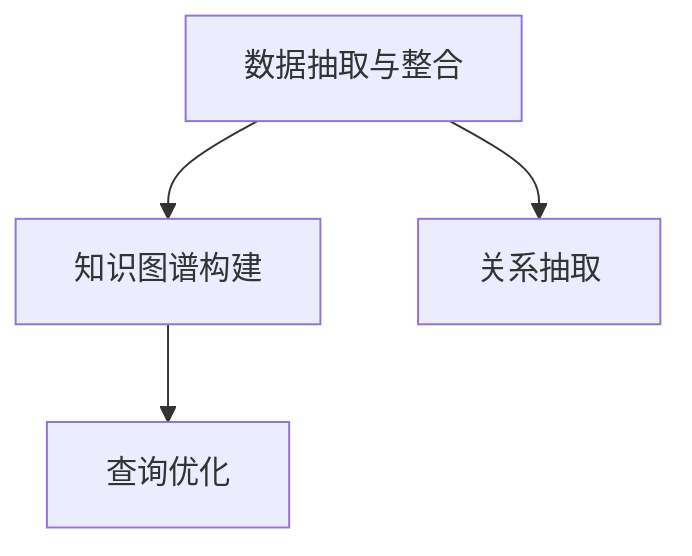

                 

# 打造个人知识图谱:程序员的实践之路

## 1. 背景介绍

### 1.1 问题由来
随着技术发展，信息爆炸，数据、知识等海量增加。面对如此多的信息，如何高效管理和利用这些知识成为了一个重要问题。程序员，作为技术岗位的代表，常常需要处理大量的代码、数据和文档，需要高效地整合和应用这些知识。因此，打造个人知识图谱，对程序员来说，变得尤为重要。

### 1.2 问题核心关键点
打造个人知识图谱的主要目的是将海量的知识进行结构化、层次化的组织，使之便于管理和应用。核心关键点包括：
- 数据获取与清洗：从不同的源获取知识，并将其清洗整理成一致的格式。
- 知识图谱构建：利用知识图谱工具和技术，将数据转换为图谱形式，建立知识之间的关联。
- 应用优化：优化图谱结构，提升查询效率，增加知识可访问性。

## 2. 核心概念与联系

### 2.1 核心概念概述

为了更好地理解个人知识图谱的构建过程，我们先介绍几个核心概念：

- **知识图谱(Knowledge Graph)**：一种大规模语义网络，用于描述实体、属性和关系之间的语义关系。它以图形的方式展示知识的结构，便于查询和理解。
- **图数据库(Graph Database)**：一种新型的数据库，用于存储和管理知识图谱，支持图形查询和分析。
- **数据抽取与整合**：从不同源获取数据，并对其进行清洗和整合，使其成为统一的格式。
- **关系抽取**：从非结构化数据中抽取出实体和关系，形成知识图谱的基本结构。
- **查询优化**：对图谱结构进行优化，提升查询效率和响应速度。

这些核心概念之间的逻辑关系可以通过以下Mermaid流程图来展示：



这个流程图展示了个知识图谱构建的主要流程：首先从不同源获取数据并进行整合，然后通过关系抽取形成图谱的基本结构，最后通过查询优化提升图谱的效率和应用性。

## 3. 核心算法原理 & 具体操作步骤
### 3.1 算法原理概述

个人知识图谱的构建基于知识图谱技术，主要涉及数据抽取、图谱构建和查询优化三个环节。其核心算法原理包括：

- **数据抽取算法**：从不同源（如代码库、文档、博客等）中抽取出实体和关系，并整合成一个统一的结构化数据。
- **图谱构建算法**：将抽取出的结构化数据转换为知识图谱，建立实体、属性和关系之间的语义关系。
- **查询优化算法**：对图谱结构进行优化，提升查询效率和响应速度。

### 3.2 算法步骤详解

以下是个人知识图谱构建的主要算法步骤：

**Step 1: 数据抽取与整合**

1. **数据来源定义**：确定需要抽取的知识源，如GitHub代码库、技术博客、论文等。
2. **数据收集与清洗**：从各个源获取数据，并进行清洗，去除重复和无用的数据。
3. **数据统一格式**：将清洗后的数据转换成统一的格式，如JSON、CSV等，方便后续处理。

**Step 2: 知识图谱构建**

1. **实体识别**：从统一格式的数据中识别出实体，如代码文件、技术术语、人员等。
2. **关系抽取**：识别实体之间的关系，如代码之间的依赖关系、技术之间的关联等。
3. **图谱构建**：利用图谱工具（如Neo4j、Gremlin等）将实体和关系构建为知识图谱。

**Step 3: 查询优化**

1. **图谱存储与索引**：将构建好的图谱存储到图数据库中，并进行索引优化。
2. **查询语句设计**：设计高效的查询语句，提升查询效率。
3. **性能优化**：对图谱进行性能优化，如增加缓存、使用分布式计算等。

### 3.3 算法优缺点

个人知识图谱构建具有以下优点：

- 结构化存储：知识图谱能够将无结构化数据结构化，便于管理和应用。
- 灵活查询：图谱支持灵活的查询方式，可以快速获取需要的知识。
- 知识关联：图谱能够展现知识之间的关联，便于理解知识的上下文。

同时，该方法也存在以下局限性：

- 数据来源有限：图谱构建依赖于已知的数据源，难以覆盖所有相关信息。
- 技术门槛高：需要具备一定的图谱技术和工具使用能力。
- 数据更新难度：图谱更新需要手动维护，费时费力。

尽管存在这些局限性，但个人知识图谱作为一种高效的知识管理方式，仍然广泛应用于技术开发、项目管理、科研等领域。

### 3.4 算法应用领域

个人知识图谱的应用领域非常广泛，具体包括：

- **技术开发**：帮助程序员快速找到需要的技术文档、代码示例等。
- **项目管理**：利用图谱展示项目依赖关系，便于团队协作和管理。
- **科研支持**：通过图谱关联大量研究数据，加速科研过程。
- **知识传播**：构建个人知识图谱，进行知识分享和传播。

## 4. 数学模型和公式 & 详细讲解 & 举例说明

### 4.1 数学模型构建

个人知识图谱的构建主要涉及实体识别、关系抽取和图谱构建三个环节。我们可以用数学语言对这些过程进行描述。

**实体识别**：假设从数据集中抽取出的实体为$E$，用向量$e \in \mathbb{R}^d$表示。

**关系抽取**：假设从数据集中抽取出的关系为$R$，用向量$r \in \mathbb{R}^d$表示。

**图谱构建**：假设图谱中的节点和边分别为$N$和$E$，用矩阵$A \in \mathbb{R}^{N \times E}$表示。

### 4.2 公式推导过程

以下是对实体识别、关系抽取和图谱构建过程的数学推导。

**实体识别公式**：
$$
e_i = \text{Embedding}(\textrm{Input}_1, \textrm{Input}_2, \ldots, \textrm{Input}_n)
$$

其中，$\textrm{Input}_i$表示输入的实体信息，$\text{Embedding}$表示实体识别模型，将输入信息转化为实体向量$e_i$。

**关系抽取公式**：
$$
r_j = \text{Relation}(\textrm{Input}_1, \textrm{Input}_2, \ldots, \textrm{Input}_n)
$$

其中，$\textrm{Input}_i$表示输入的关系信息，$\text{Relation}$表示关系抽取模型，将输入信息转化为关系向量$r_j$。

**图谱构建公式**：
$$
A_{ij} = \text{Graph}(\textrm{Node}_1, \textrm{Node}_2, \ldots, \textrm{Node}_n, \textrm{Edge}_1, \textrm{Edge}_2, \ldots, \textrm{Edge}_n)
$$

其中，$\textrm{Node}_i$表示图谱中的节点，$\textrm{Edge}_i$表示图谱中的边。$\text{Graph}$表示图谱构建模型，将节点和边构建为图谱矩阵$A_{ij}$。

### 4.3 案例分析与讲解

以GitHub代码图谱为例，解释上述公式的应用。

假设从GitHub获取到某个开源项目的数据集，包含项目的代码文件、依赖库、提交记录等信息。首先，需要对这些信息进行清洗和统一格式，然后应用实体识别模型，从代码文件、库名等中抽取实体，如代码文件名、库名等。接着，利用关系抽取模型，从代码文件、提交记录等信息中抽取关系，如代码文件依赖关系、提交记录中的修改信息等。最后，利用图谱构建模型，将这些实体和关系构建为知识图谱，用于展示项目的依赖关系和修改记录。

## 5. 项目实践：代码实例和详细解释说明
### 5.1 开发环境搭建

在进行个人知识图谱构建实践前，需要先准备好开发环境。以下是使用Python进行GraphDatabase开发的准备工作：

1. 安装Anaconda：从官网下载并安装Anaconda，用于创建独立的Python环境。

2. 创建并激活虚拟环境：
```bash
conda create -n graph-env python=3.8
conda activate graph-env
```

3. 安装GraphDatabase：使用pip安装Neo4j或Gremlin等图数据库客户端。
```bash
pip install neo4j[python]
```

4. 安装各类工具包：
```bash
pip install requests beautifulsoup4 pyquery
```

完成上述步骤后，即可在`graph-env`环境中开始实践。

### 5.2 源代码详细实现

以下是使用Python和Neo4j构建GitHub代码图谱的示例代码。

```python
import requests
from bs4 import BeautifulSoup
from pyquery import PyQuery as pq
from neo4j import GraphDatabase

# 获取GitHub项目的HTML页面
url = 'https://github.com/user/repo'
response = requests.get(url)
html = response.text

# 解析HTML页面，提取项目基本信息
soup = BeautifulSoup(html, 'html.parser')
project_title = soup.title.text
project_desc = soup.find('meta', {'name': 'description'}).get('content')

# 获取项目依赖库列表
dependencies = soup.find_all('script', {'data-javascript-url': 'master'});
dependencies = [dependency.get('data-javascript-url') for dependency in dependencies]

# 使用PyQuery提取依赖库名称和版本
dependencies = [pq(dependency).text() for dependency in dependencies]

# 建立图谱关系
client = GraphDatabase.driver('bolt://localhost:7687', auth=('neo4j', 'password'))
with client.session() as session:
    # 创建项目节点
    session.run('CREATE (p:Project {title: $title, description: $description})',
                {'title': project_title, 'description': project_desc})

    # 创建依赖库节点
    for dependency in dependencies:
        session.run('CREATE (d:Dependency {name: $name, version: $version})',
                    {'name': dependency.split('=')[0], 'version': dependency.split('=')[1]})

    # 创建项目与依赖库的关系
    for dependency in dependencies:
        session.run('MATCH (p), (d) WHERE p.title = $title AND d.name = $name MERGE (p)-[:USES]->(d)',
                    {'title': project_title, 'name': dependency.split('=')[0]})
```

这段代码实现了从GitHub项目页面抓取项目基本信息和依赖库信息，并利用Neo4j构建图谱关系。通过上述步骤，可以方便地展示项目的依赖关系，辅助技术开发。

### 5.3 代码解读与分析

让我们再详细解读一下关键代码的实现细节：

**数据抓取**：
```python
import requests
from bs4 import BeautifulSoup

url = 'https://github.com/user/repo'
response = requests.get(url)
html = response.text
```

首先，使用`requests`库获取GitHub项目的HTML页面，使用`BeautifulSoup`库解析页面，提取项目的基本信息和依赖库信息。

**信息提取**：
```python
soup = BeautifulSoup(html, 'html.parser')
project_title = soup.title.text
project_desc = soup.find('meta', {'name': 'description'}).get('content')
```

解析HTML页面，提取项目标题和描述。

**依赖库获取**：
```python
dependencies = soup.find_all('script', {'data-javascript-url': 'master'});
dependencies = [dependency.get('data-javascript-url') for dependency in dependencies]
dependencies = [pq(dependency).text() for dependency in dependencies]
```

通过爬取项目的JavaScript文件，获取项目的依赖库列表，并将其解析成名称和版本。

**图谱构建**：
```python
client = GraphDatabase.driver('bolt://localhost:7687', auth=('neo4j', 'password'))
with client.session() as session:
    # 创建项目节点
    session.run('CREATE (p:Project {title: $title, description: $description})',
                {'title': project_title, 'description': project_desc})

    # 创建依赖库节点
    for dependency in dependencies:
        session.run('CREATE (d:Dependency {name: $name, version: $version})',
                    {'name': dependency.split('=')[0], 'version': dependency.split('=')[1]})

    # 创建项目与依赖库的关系
    for dependency in dependencies:
        session.run('MATCH (p), (d) WHERE p.title = $title AND d.name = $name MERGE (p)-[:USES]->(d)',
                    {'title': project_title, 'name': dependency.split('=')[0]})
```

利用Neo4j建立项目节点和依赖库节点，并通过`MATCH`和`MERGE`语句创建项目与依赖库的关系。通过上述步骤，可以方便地展示项目的依赖关系，辅助技术开发。

## 6. 实际应用场景

### 6.1 软件开发

在软件开发中，个人知识图谱可以辅助程序员快速找到需要的技术文档、代码示例等，加速开发过程。例如，某项目需要在项目中引入新的依赖库，可以利用图谱快速找到该依赖库的版本信息，并查看其在其他项目中的应用案例，从而做出正确的决策。

### 6.2 项目管理

项目经理可以利用个人知识图谱展示项目的依赖关系，便于团队协作和管理。例如，某项目包含多个子模块，可以利用图谱展示模块之间的依赖关系，帮助团队成员理解项目的结构，快速定位问题。

### 6.3 科研支持

研究人员可以利用个人知识图谱进行科研支持。例如，某研究人员在进行数据科学领域的研究，可以利用图谱快速找到相关的数据集、论文和工具，加速科研过程。

### 6.4 未来应用展望

随着技术的不断进步，个人知识图谱的应用场景将更加广泛。未来可能包括：

- **自动化维护**：利用机器学习算法自动维护和更新图谱，减少人工维护的复杂性。
- **知识融合**：将图谱与自然语言处理技术结合，实现知识的自动抽取和整合。
- **多模态数据融合**：将图谱与图像、视频、音频等多模态数据结合，实现更全面、准确的知识展示。
- **智能推荐**：利用图谱进行智能推荐，帮助用户快速找到所需信息。

## 7. 工具和资源推荐

### 7.1 学习资源推荐

为了帮助开发者系统掌握个人知识图谱的理论基础和实践技巧，这里推荐一些优质的学习资源：

1. **《Python知识图谱实战》**：详细介绍Python在知识图谱构建中的应用，包含实体识别、关系抽取、图谱构建等核心技术。
2. **《Neo4j官方文档》**：Neo4j的详细文档，包含使用指南、图谱查询和优化等内容。
3. **《Knowledge Graphs in Practice》**：LinkedIn出品的知识图谱实战指南，涵盖知识图谱构建和应用的最佳实践。
4. **《Graph Database: Concepts and Design》**：图数据库设计领域的经典书籍，详细介绍了图数据库的理论和实践。
5. **《Deep Learning for Knowledge Graphs》**：深度学习在知识图谱中的应用，涵盖知识抽取、图谱构建和应用等内容。

通过对这些资源的学习实践，相信你一定能够快速掌握个人知识图谱的构建技术，并将其应用于实际项目中。

### 7.2 开发工具推荐

高效的开发离不开优秀的工具支持。以下是几款用于个人知识图谱开发的常用工具：

1. **Jupyter Notebook**：数据处理和代码实现的理想工具，支持Python、R等多种语言。
2. **PyQuery**：轻量级的数据抽取工具，适用于HTML和XML等文档的解析。
3. **BeautifulSoup**：HTML解析库，方便从网页中提取数据。
4. **Neo4j**：流行的图数据库，支持复杂的图谱查询和分析。
5. **Gremlin**：Neo4j的查询语言，方便构建和查询图谱。
6. **GraphAware**：基于Neo4j的图谱构建和管理工具。

合理利用这些工具，可以显著提升个人知识图谱的构建效率，加快创新迭代的步伐。

### 7.3 相关论文推荐

个人知识图谱的构建技术涉及多个学科，相关研究也在不断推进。以下是几篇奠基性的相关论文，推荐阅读：

1. **《Neo4j Graph Database》**：Neo4j的官方技术白皮书，详细介绍了图数据库的核心概念和技术。
2. **《Knowledge Graphs: Concepts, Approaches, and Challenges》**：KG领域的经典综述论文，涵盖知识图谱的构建、应用和挑战。
3. **《Practical Graph Querying》**：图数据库查询领域的经典书籍，详细介绍图数据库的查询方法和优化技术。
4. **《The Neo4j Graph Database》**：Neo4j的官方书籍，详细介绍了图数据库的核心技术和最佳实践。
5. **《Semantic Knowledge Graphs》**：KG领域的技术手册，涵盖知识抽取、图谱构建和应用等内容。

这些论文代表了个知识图谱构建技术的发展脉络。通过学习这些前沿成果，可以帮助研究者把握学科前进方向，激发更多的创新灵感。

## 8. 总结：未来发展趋势与挑战

### 8.1 总结

本文对个人知识图谱的构建方法进行了全面系统的介绍。首先阐述了构建个人知识图谱的背景和意义，明确了知识图谱在数据管理、技术开发、科研等领域的重要价值。其次，从原理到实践，详细讲解了知识图谱构建的数学模型、算法步骤和核心技术，给出了知识图谱构建的完整代码实例。同时，本文还广泛探讨了知识图谱在实际应用中的各种场景，展示了知识图谱的广泛应用潜力。最后，本文精选了知识图谱构建的各类学习资源，力求为读者提供全方位的技术指引。

通过本文的系统梳理，可以看到，个人知识图谱作为一种高效的数据管理和技术开发工具，正在成为软件开发、项目管理、科研等领域的重要辅助手段。未来，伴随知识图谱技术的持续演进，相信其在各领域的应用将更加广泛和深入。

### 8.2 未来发展趋势

展望未来，个人知识图谱构建技术将呈现以下几个发展趋势：

1. **自动化构建**：利用自动化工具和技术，自动构建和维护知识图谱，减少人工干预。
2. **多模态融合**：将图谱与其他数据源（如文本、图像、音频等）结合，实现更全面、准确的知识展示。
3. **智能推荐**：利用图谱进行智能推荐，帮助用户快速找到所需信息。
4. **动态更新**：利用机器学习算法，自动更新和维护图谱，确保知识的时效性和准确性。

以上趋势凸显了个人知识图谱构建技术的广阔前景。这些方向的探索发展，必将进一步提升技术开发、项目管理、科研等领域的效率和质量，为社会带来更大的价值。

### 8.3 面临的挑战

尽管个人知识图谱构建技术已经取得了瞩目成就，但在迈向更加智能化、普适化应用的过程中，它仍面临诸多挑战：

1. **数据质量**：图谱构建依赖于高质量的数据源，数据不准确或不完整将影响图谱的构建效果。
2. **技术门槛**：知识图谱构建需要一定的技术储备，技术门槛较高。
3. **复杂性**：图谱构建涉及多源数据整合、关系抽取等复杂过程，操作复杂。
4. **更新难度**：图谱需要定期更新，维护成本较高。
5. **隐私和安全**：图谱可能包含敏感信息，需要保障数据隐私和安全。

尽管存在这些挑战，但随着技术的发展和应用领域的不断拓展，知识图谱构建技术必将克服这些困难，实现更广泛的应用。未来，需要更多的研究和实践，探索新的技术和方法，使知识图谱成为更高效、更普适的数据管理工具。

### 8.4 研究展望

面向未来，知识图谱构建技术需要继续探索新的方向，包括：

1. **自动化构建**：利用自动化工具和技术，自动构建和维护知识图谱，减少人工干预。
2. **多模态融合**：将图谱与其他数据源（如文本、图像、音频等）结合，实现更全面、准确的知识展示。
3. **智能推荐**：利用图谱进行智能推荐，帮助用户快速找到所需信息。
4. **动态更新**：利用机器学习算法，自动更新和维护图谱，确保知识的时效性和准确性。

这些研究方向的探索，必将推动知识图谱技术的不断进步，使其成为更高效、更普适的数据管理工具。未来，需要更多的研究和实践，探索新的技术和方法，使知识图谱构建技术在各领域得到更广泛的应用。

## 9. 附录：常见问题与解答

**Q1：如何高效地构建个人知识图谱？**

A: 构建个人知识图谱需要一定的技术和经验，可以通过以下步骤来高效完成：
1. **数据收集与清洗**：从不同的源获取数据，并进行清洗和统一格式。
2. **实体和关系抽取**：利用NLP技术抽取实体和关系，构建图谱的基本结构。
3. **图谱构建与存储**：利用图数据库（如Neo4j）构建图谱，并进行存储和索引优化。
4. **性能优化**：优化图谱查询语句，增加缓存和分布式计算等。

**Q2：数据源有哪些？**

A: 常见的数据源包括：
1. **代码库**：如GitHub、GitLab等，包含代码文件、依赖库、提交记录等信息。
2. **技术博客**：如Medium、CSDN等，包含技术文章、文档、评论等信息。
3. **文档和论文**：如arXiv、Google Scholar等，包含技术论文、报告等。

**Q3：如何选择知识图谱构建工具？**

A: 选择知识图谱构建工具需要考虑以下几个方面：
1. **易用性**：选择易用性高、操作简单的工具。
2. **扩展性**：选择支持多源数据、复杂查询的工具。
3. **性能**：选择性能优秀、响应速度快的工具。
4. **社区支持**：选择有活跃社区支持、文档丰富的工具。

**Q4：如何提升图谱查询效率？**

A: 提升图谱查询效率可以从以下几个方面入手：
1. **索引优化**：合理设计图谱索引，提高查询效率。
2. **查询语句优化**：设计高效的查询语句，避免重复计算。
3. **分布式计算**：利用分布式计算，加速查询过程。
4. **缓存机制**：利用缓存机制，减少重复计算。

这些建议可以帮助你更好地构建和管理个人知识图谱，提升开发效率和质量。

---

作者：禅与计算机程序设计艺术 / Zen and the Art of Computer Programming

