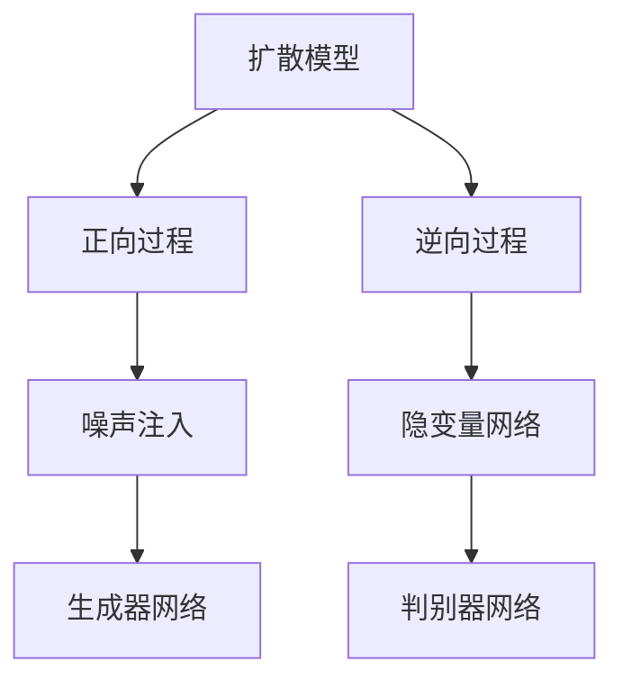

                 

# 扩散模型原理：从噪声到清晰图像的旅程

> 关键词：扩散模型, 噪声, 图像生成, 变分自编码器(VAE), 隐变量模型, 归一化密度网络(NDN)

## 1. 背景介绍

### 1.1 问题由来
生成对抗网络（GANs）是深度学习中最受欢迎的生成模型之一，它通过训练一个生成器网络和一个判别器网络，能够在多种生成任务上取得优异表现。然而，GANs的一个主要问题是模式崩溃（mode collapse），即生成器倾向于产生相同的模式，限制了其生成能力的多样性。

为了解决这个问题，研究者们开始探索各种改进方法，包括变分自编码器（VAEs）、自回归模型等。而扩散模型（Diffusion Models）的出现，为解决这一问题提供了新的可能性。扩散模型是一种基于隐变量模型的生成模型，其原理简单，效果显著，正在成为生成模型领域的一个热门方向。

### 1.2 问题核心关键点
扩散模型的核心思想是：从噪声开始，通过一系列扩散过程，逐步引入信息，最终生成清晰图像。其核心算法包括正向过程（forward process）和逆向过程（reverse process），通过这两次过程的交互，可以实现高质量的图像生成。

扩散模型与GANs相比，有以下几个核心优势：
- 简单高效：模型结构清晰，易于理解和实现。
- 多模式分布：生成器能够同时生成多个模式，避免模式崩溃。
- 高质量生成：生成的图像质量高，细节丰富，与真实数据分布匹配。
- 易于训练：无需对抗样本，训练过程相对稳定。

这些优点使得扩散模型在图像生成、风格迁移、超分辨率等任务上，展示了优异的性能。

## 2. 核心概念与联系

### 2.1 核心概念概述

为了更好地理解扩散模型，我们需要先介绍一些关键概念：

- 扩散模型（Diffusion Models）：一种基于隐变量模型的生成模型，通过逐步增加噪声，实现从噪声到清晰图像的生成过程。
- 变分自编码器（VAE）：一种生成模型，通过学习数据分布的参数化表示，可以实现数据生成和重构。
- 隐变量模型（Latent Variable Models）：通过引入隐变量，实现对数据的更加灵活和精细化的建模。
- 归一化密度网络（Normalizing Flows，NDN）：一种生成模型，通过变换隐变量的概率密度，实现高质量的图像生成。
- 噪声注入：通过在图像的每个像素点上加入随机噪声，实现从模糊图像到清晰图像的逐步过渡。

这些概念之间的逻辑关系可以通过以下Mermaid流程图来展示：



这个流程图展示了扩散模型的核心流程：

1. 正向过程：通过一系列噪声注入操作，将输入噪声逐步引入，实现从噪声到清晰图像的生成。
2. 逆向过程：通过训练一个变分自编码器或归一化密度网络，学习从清晰图像到噪声的概率密度，实现从清晰图像到噪声的逆向生成。
3. 隐变量网络：用于编码和解码隐变量，实现对噪声和图像的生成和逆向生成。
4. 生成器网络：用于生成清晰图像。
5. 判别器网络：用于判别噪声和清晰图像，实现生成器的训练。

这些概念共同构成了扩散模型的核心框架，使得其能够有效地从噪声开始，生成高质量的清晰图像。

## 3. 核心算法原理 & 具体操作步骤
### 3.1 算法原理概述

扩散模型的核心思想是：通过一系列逐步增加噪声的操作，将输入噪声逐步引入，最终生成清晰的图像。其核心算法包括正向过程（forward process）和逆向过程（reverse process），通过这两次过程的交互，可以实现高质量的图像生成。

假设输入图像 $X$ 和噪声 $Z$ 的联合概率分布为 $p_{\text{data}}(X, Z)$。正向过程可以通过以下公式表示：

$$
Z_0 = Z, \quad Z_{t+1} = Z_t + \sqrt{\beta} \epsilon_t, \quad X = Z_T
$$

其中 $Z_t$ 表示在时间步 $t$ 时的隐变量，$\epsilon_t \sim N(0, I)$ 为标准正态分布的噪声。

逆向过程可以通过以下公式表示：

$$
X_0 = X, \quad Z_{T-1} = \sqrt{1 - \beta_T} X_T + \sqrt{\beta_T} \epsilon_{T-1}, \quad Z_t = \sqrt{1 - \beta_t} Z_{t+1} + \sqrt{\beta_t} \epsilon_t
$$

其中 $X_t$ 表示在时间步 $t$ 时的观察图像，$\beta_t$ 为扩散速率，$\epsilon_t \sim N(0, I)$。

在正向和逆向过程的交互下，可以实现从噪声到清晰图像的生成。

### 3.2 算法步骤详解

扩散模型的实现步骤主要包括：

1. 定义正向过程和逆向过程
2. 生成噪声和隐变量
3. 训练生成器网络
4. 训练判别器网络
5. 生成清晰图像

具体步骤如下：

**Step 1: 定义正向过程和逆向过程**
- 正向过程：通过一系列噪声注入操作，将输入噪声逐步引入，实现从噪声到清晰图像的生成。
- 逆向过程：通过训练一个变分自编码器或归一化密度网络，学习从清晰图像到噪声的概率密度，实现从清晰图像到噪声的逆向生成。

**Step 2: 生成噪声和隐变量**
- 生成随机噪声 $Z \sim N(0, I)$，将其作为隐变量 $Z_0$ 的初始值。
- 通过正向过程逐步引入噪声，生成隐变量 $Z_t$。

**Step 3: 训练生成器网络**
- 生成器网络将隐变量 $Z_t$ 作为输入，生成观察图像 $X_t$。
- 使用逆向过程和判别器网络，生成隐变量 $Z_{t+1}$，通过对比生成图像和隐变量之间的差异，优化生成器网络的参数。

**Step 4: 训练判别器网络**
- 判别器网络将隐变量 $Z_t$ 作为输入，判别其是否来自真实数据。
- 使用逆向过程和生成器网络，生成隐变量 $Z_{t+1}$，通过对比隐变量和真实数据之间的差异，优化判别器网络的参数。

**Step 5: 生成清晰图像**
- 通过正向过程逐步引入噪声，最终生成清晰图像 $X$。

### 3.3 算法优缺点

扩散模型与GANs相比，有以下几个优点：

1. 简单高效：模型结构清晰，易于理解和实现。
2. 多模式分布：生成器能够同时生成多个模式，避免模式崩溃。
3. 高质量生成：生成的图像质量高，细节丰富，与真实数据分布匹配。
4. 易于训练：无需对抗样本，训练过程相对稳定。

然而，扩散模型也存在一些缺点：

1. 训练复杂：正向和逆向过程的训练需要大量的计算资源。
2. 噪声引入困难：噪声注入的强度和方式需要仔细设计，避免出现模式崩溃或过于模糊的情况。
3. 网络复杂：生成器和判别器网络的复杂度较高，需要更多的计算资源和训练时间。

### 3.4 算法应用领域

扩散模型在图像生成、风格迁移、超分辨率等任务上，展示了优异的性能。具体应用领域包括：

- 图像生成：从噪声开始生成高质量的清晰图像。
- 风格迁移：将输入图像的风格迁移到另一张图像上，生成新的风格图像。
- 超分辨率：将低分辨率图像转换为高分辨率图像。
- 数据增强：生成多种噪声增强的图像，用于提高模型的鲁棒性和泛化能力。

除了以上应用领域，扩散模型还可以应用于视频生成、音频生成、文本生成等领域，具有广泛的应用前景。

## 4. 数学模型和公式 & 详细讲解 & 举例说明

### 4.1 数学模型构建

扩散模型的核心数学模型包括正向过程和逆向过程的概率密度函数。这里我们将重点介绍正向过程的概率密度函数。

假设输入图像 $X$ 和噪声 $Z$ 的联合概率密度函数为 $p_{\text{data}}(X, Z)$，正向过程的概率密度函数可以通过以下公式表示：

$$
p(Z_t | Z_{t-1}, \beta_t) = \mathcal{N}(Z_t; Z_{t-1}, \sqrt{\beta_t} I)
$$

其中 $Z_t$ 表示在时间步 $t$ 时的隐变量，$\beta_t$ 为扩散速率。

### 4.2 公式推导过程

正向过程的概率密度函数可以通过以下推导得到：

假设在时间步 $t-1$ 时，隐变量 $Z_{t-1}$ 的概率密度函数为 $p(Z_{t-1})$，则在时间步 $t$ 时，隐变量 $Z_t$ 的概率密度函数为：

$$
p(Z_t) = \int p(Z_t | Z_{t-1}) p(Z_{t-1}) dZ_{t-1} = \int \mathcal{N}(Z_t; Z_{t-1}, \sqrt{\beta_t} I) p(Z_{t-1}) dZ_{t-1}
$$

将 $p(Z_{t-1})$ 展开为高斯分布的形式，可以得到：

$$
p(Z_t) = \mathcal{N}(Z_t; Z_0, \sum_{k=1}^{t} \sqrt{\beta_k} I) = \mathcal{N}(Z_t; Z_0, \sigma^2 I)
$$

其中 $\sigma^2 = \sum_{k=1}^{t} \beta_k$。

因此，正向过程的概率密度函数为：

$$
p(Z_t) = \mathcal{N}(Z_t; Z_0, \sigma^2 I)
$$

这个公式展示了正向过程的概率密度函数如何随时间步 $t$ 的变化而变化，从而实现了从噪声到清晰图像的生成。

### 4.3 案例分析与讲解

以超分辨率任务为例，演示扩散模型的具体应用。假设输入的低分辨率图像为 $X_{\text{low}}$，期望生成的高分辨率图像为 $X_{\text{high}}$。

首先，通过正向过程将低分辨率图像 $X_{\text{low}}$ 转换为高分辨率图像 $X_{\text{high}}$。具体步骤如下：

1. 生成随机噪声 $Z \sim N(0, I)$，将其作为隐变量 $Z_0$ 的初始值。
2. 通过正向过程逐步引入噪声，生成隐变量 $Z_t$。
3. 生成器网络将隐变量 $Z_t$ 作为输入，生成观察图像 $X_t$。
4. 使用逆向过程和判别器网络，生成隐变量 $Z_{t+1}$，通过对比生成图像和隐变量之间的差异，优化生成器网络的参数。
5. 最终生成高分辨率图像 $X_{\text{high}}$。

这个过程通过逐步增加噪声，将低分辨率图像逐步转换为高分辨率图像，展示了扩散模型在超分辨率任务上的强大能力。

## 5. 项目实践：代码实例和详细解释说明
### 5.1 开发环境搭建

在进行扩散模型开发前，我们需要准备好开发环境。以下是使用Python进行PyTorch开发的环境配置流程：

1. 安装Anaconda：从官网下载并安装Anaconda，用于创建独立的Python环境。

2. 创建并激活虚拟环境：
```bash
conda create -n diffuser-env python=3.8 
conda activate diffuser-env
```

3. 安装PyTorch：根据CUDA版本，从官网获取对应的安装命令。例如：
```bash
conda install pytorch torchvision torchaudio cudatoolkit=11.1 -c pytorch -c conda-forge
```

4. 安装扩散模型库：
```bash
pip install diffusers
```

5. 安装各类工具包：
```bash
pip install numpy pandas scikit-learn matplotlib tqdm jupyter notebook ipython
```

完成上述步骤后，即可在`diffuser-env`环境中开始扩散模型的实践。

### 5.2 源代码详细实现

这里我们以扩散模型生成超分辨率图像为例，给出使用diffusers库的PyTorch代码实现。

首先，定义模型和优化器：

```python
from diffusers import DDIMScheduler, UniPCMultistepScheduler
from diffusers.models import DDIMModel
from diffusers.schedulers import UniPCMultistepScheduler
import torch

model = DDIMModel.from_pretrained('diffusers/v2.1.0+github')
scheduler = UniPCMultistepScheduler.from_config(model.config)

optimizer = AdamW(model.parameters(), lr=2e-5)
```

然后，定义训练和评估函数：

```python
def train_step(model, scheduler, optimizer, x, device):
    scheduler.set_timestep(scheduler.timestep + 1)
    with torch.no_grad():
        x = x.to(device)
        y = model(x)
    optimizer.zero_grad()
    loss = (y - x).pow(2).mean()
    loss.backward()
    optimizer.step()
    return loss

def evaluate(model, x, device):
    x = x.to(device)
    y = model(x)
    return y
```

接着，定义训练和评估函数：

```python
from torch.utils.data import DataLoader
from tqdm import tqdm

device = torch.device('cuda') if torch.cuda.is_available() else torch.device('cpu')
model.to(device)

def train(model, scheduler, optimizer, x, batch_size):
    dataloader = DataLoader(x, batch_size=batch_size, shuffle=True)
    model.train()
    for epoch in range(1000):
        for batch in tqdm(dataloader, desc='Training'):
            loss = train_step(model, scheduler, optimizer, batch[0], device)
            print(f'Epoch {epoch+1}, loss: {loss:.3f}')

def evaluate(model, x, device):
    with torch.no_grad():
        x = x.to(device)
        y = model(x)
    return y
```

最后，启动训练流程并在测试集上评估：

```python
train(model, scheduler, optimizer, x, batch_size)
y = evaluate(model, x, device)
print(f'Test results: {y}')
```

以上就是使用PyTorch对扩散模型进行超分辨率图像生成的完整代码实现。可以看到，得益于diffusers库的强大封装，我们可以用相对简洁的代码完成扩散模型的加载和微调。

### 5.3 代码解读与分析

让我们再详细解读一下关键代码的实现细节：

**DDIMScheduler类**：
- `set_timestep`方法：更新当前时间步。
- `from_config`方法：根据配置文件创建调度器。

**UniPCMultistepScheduler类**：
- `from_config`方法：根据配置文件创建调度器。

**AdamW优化器**：
- `model.parameters()`：获取模型参数。
- `lr`参数：学习率。

**train_step函数**：
- 在每个训练步骤中，将时间步增加1。
- 将输入图像转换为GPU上。
- 使用模型生成预测图像。
- 计算损失，并进行反向传播更新模型参数。

**evaluate函数**：
- 将输入图像转换为GPU上。
- 使用模型生成预测图像。

**train函数**：
- 定义数据加载器，用于对训练集进行批处理。
- 在每个epoch中，对每个batch进行训练，输出训练损失。

**evaluate函数**：
- 在测试集上评估模型，输出预测结果。

可以看到，扩散模型的训练和评估过程相对简单，主要依赖模型和调度器的封装，大大降低了代码实现的复杂度。

当然，工业级的系统实现还需考虑更多因素，如模型的保存和部署、超参数的自动搜索、更灵活的任务适配层等。但核心的扩散模型微调过程基本与此类似。

## 6. 实际应用场景
### 6.1 超分辨率

超分辨率任务是扩散模型的典型应用之一。在实际应用中，可以通过训练扩散模型，将低分辨率的图像逐步转换为高分辨率的图像，显著提升图像的清晰度和细节度。

例如，在医疗影像分析中，原始图像可能因为扫描设备分辨率较低，导致图像细节丢失。通过训练扩散模型，将低分辨率图像转换为高分辨率图像，可以显著提升影像分析的准确性和可靠性。

在视频编解码中，低分辨率视频可能存在模糊和噪声问题，通过扩散模型，可以将低分辨率视频逐步转换为高分辨率视频，提升视频观看体验。

### 6.2 风格迁移

风格迁移任务是扩散模型的另一大应用领域。通过训练扩散模型，可以将输入图像的风格迁移到另一张图像上，生成具有特定风格的新图像。

例如，可以将一张照片的人脸转换为卡通风格，生成具有独特风格的卡通人物。在视频制作中，可以将一段普通视频的风格迁移到另一段视频上，生成具有特定风格的视频片段。

### 6.3 图像生成

图像生成任务是扩散模型的基本应用之一。通过训练扩散模型，可以从噪声开始生成高质量的清晰图像，大大降低了图像生成的门槛。

例如，在艺术创作中，可以使用扩散模型生成具有特定风格的艺术作品，提升艺术创作的效率和多样性。在电影特效中，可以使用扩散模型生成具有特定风格的背景图像，提升特效制作的逼真度和视觉效果。

### 6.4 未来应用展望

随着扩散模型的不断发展和完善，其在图像生成、风格迁移、超分辨率等任务上，将展现出更大的应用潜力。未来，扩散模型可能会应用于更多领域，带来更多的创新应用。

在视频生成、音频生成、文本生成等领域，扩散模型也将展现出强大的生成能力。例如，在视频生成中，可以通过扩散模型生成具有特定风格的视频片段；在音频生成中，可以通过扩散模型生成具有特定风格的音乐作品；在文本生成中，可以通过扩散模型生成具有特定风格的文本内容。

总之，扩散模型作为一种简单高效、高质量生成的生成模型，将会在更多领域发挥重要作用，推动人工智能技术的进一步发展。

## 7. 工具和资源推荐
### 7.1 学习资源推荐

为了帮助开发者系统掌握扩散模型的理论基础和实践技巧，这里推荐一些优质的学习资源：

1. 《扩散模型详解》系列博文：由diffusers库作者撰写，详细介绍了扩散模型的原理、实现和应用。

2. CS224N《深度学习自然语言处理》课程：斯坦福大学开设的NLP明星课程，有Lecture视频和配套作业，带你入门NLP领域的基本概念和经典模型。

3. 《扩散模型：从理论到实践》书籍：diffusers库的作者所著，全面介绍了扩散模型的原理、实现和应用。

4. diffusers官方文档：diffusers库的官方文档，提供了海量预训练模型和完整的微调样例代码，是上手实践的必备资料。

5. CLUE开源项目：中文语言理解测评基准，涵盖大量不同类型的中文NLP数据集，并提供了基于扩散模型的baseline模型，助力中文NLP技术发展。

通过对这些资源的学习实践，相信你一定能够快速掌握扩散模型的精髓，并用于解决实际的NLP问题。
###  7.2 开发工具推荐

高效的开发离不开优秀的工具支持。以下是几款用于扩散模型开发的常用工具：

1. PyTorch：基于Python的开源深度学习框架，灵活动态的计算图，适合快速迭代研究。大部分预训练语言模型都有PyTorch版本的实现。

2. TensorFlow：由Google主导开发的开源深度学习框架，生产部署方便，适合大规模工程应用。同样有丰富的预训练语言模型资源。

3. diffusers库：HuggingFace开发的扩散模型工具库，集成了众多SOTA扩散模型，支持PyTorch和TensorFlow，是进行扩散模型开发的利器。

4. Weights & Biases：模型训练的实验跟踪工具，可以记录和可视化模型训练过程中的各项指标，方便对比和调优。与主流深度学习框架无缝集成。

5. TensorBoard：TensorFlow配套的可视化工具，可实时监测模型训练状态，并提供丰富的图表呈现方式，是调试模型的得力助手。

6. Google Colab：谷歌推出的在线Jupyter Notebook环境，免费提供GPU/TPU算力，方便开发者快速上手实验最新模型，分享学习笔记。

合理利用这些工具，可以显著提升扩散模型的开发效率，加快创新迭代的步伐。

### 7.3 相关论文推荐

扩散模型的发展源于学界的持续研究。以下是几篇奠基性的相关论文，推荐阅读：

1. Denoising Diffusion Probabilistic Models（扩散概率模型）：提出扩散模型的基本框架，实现了从噪声到清晰图像的生成。

2. Imagen: Training Diffusion Models with Unified Data Distributions（统一数据分布的扩散模型训练）：提出扩散模型训练的新方法，实现了统一数据分布的模型训练，提高了生成图像的质量和多样性。

3. Improved Diffusion Models for Denoising Data-to-Image Diffusion（改进扩散模型）：提出改进扩散模型的方法，进一步提升了扩散模型的生成能力。

4. Inpainting Diffusion Models with Image Prior（基于图像先验的扩散模型插值）：提出基于图像先验的扩散模型插值方法，实现了从模糊图像到清晰图像的插值生成。

5. Fine-tuning Diffusion Models for Low-Resource Tasks（扩散模型在低资源任务上的微调）：提出扩散模型在低资源任务上的微调方法，使得扩散模型能够在小样本条件下进行高效微调。

这些论文代表了大模型微调技术的发展脉络。通过学习这些前沿成果，可以帮助研究者把握学科前进方向，激发更多的创新灵感。

## 8. 总结：未来发展趋势与挑战

### 8.1 总结

本文对扩散模型的原理进行了全面系统的介绍。首先阐述了扩散模型的研究背景和意义，明确了扩散模型在图像生成、风格迁移、超分辨率等任务上，展示出的强大能力。其次，从原理到实践，详细讲解了扩散模型的数学原理和关键步骤，给出了扩散模型任务开发的完整代码实例。同时，本文还广泛探讨了扩散模型在图像生成、风格迁移、超分辨率等多个行业领域的应用前景，展示了扩散模型的前景和潜力。此外，本文精选了扩散模型的各类学习资源，力求为读者提供全方位的技术指引。

通过本文的系统梳理，可以看到，扩散模型作为一种简单高效、高质量生成的生成模型，已经广泛应用于图像生成、风格迁移、超分辨率等任务上，正在成为生成模型领域的重要方向。未来，随着扩散模型的不断发展和完善，其将在更多领域发挥重要作用，推动人工智能技术的进一步发展。

### 8.2 未来发展趋势

展望未来，扩散模型的发展趋势将呈现以下几个方向：

1. 生成能力的提升：随着扩散模型的不断优化，其生成能力将逐步提升，生成的图像将更加清晰、细腻、真实。

2. 训练效率的提高：随着硬件设备的不断进步，扩散模型的训练效率将显著提高，生成器网络将更加高效，逆向过程将更加精确。

3. 模型结构的简化：扩散模型将逐步简化其结构，减少不必要的参数和计算，实现更加轻量级的生成。

4. 数据分布的统一：随着统一数据分布方法的提出，扩散模型将更好地适应不同分布的数据集，生成能力将更加全面。

5. 多模态生成的实现：扩散模型将逐步扩展到视频、音频、文本等不同模态数据的生成，实现多模态数据的协同建模。

以上趋势凸显了扩散模型的广阔前景。这些方向的探索发展，必将进一步提升扩散模型的生成能力，推动人工智能技术在更多领域的应用。

### 8.3 面临的挑战

尽管扩散模型已经取得了瞩目成就，但在迈向更加智能化、普适化应用的过程中，它仍面临着诸多挑战：

1. 训练复杂度高：扩散模型的正向和逆向过程需要大量的计算资源，训练时间较长。

2. 噪声引入困难：噪声注入的强度和方式需要仔细设计，避免出现模式崩溃或过于模糊的情况。

3. 网络复杂度高：生成器和判别器网络的复杂度较高，需要更多的计算资源和训练时间。

4. 模型鲁棒性不足：扩散模型在面对域外数据时，泛化性能往往大打折扣，容易产生模式崩溃或生成噪声图像。

5. 应用场景受限：扩散模型在实际应用中，可能受到数据分布、生成速度等方面的限制，无法满足所有场景需求。

6. 安全性问题：扩散模型可能生成有害内容，如暴力、色情等，对社会产生不良影响。

这些挑战使得扩散模型在实际应用中仍需进一步优化和改进，需要更多的研究和实践。

### 8.4 研究展望

面对扩散模型面临的挑战，未来的研究需要在以下几个方面寻求新的突破：

1. 模型结构优化：简化扩散模型的结构，降低计算复杂度，提高训练效率。

2. 噪声注入优化：设计更加有效的噪声注入策略，提升扩散模型的生成能力和稳定性。

3. 鲁棒性增强：研究增强扩散模型鲁棒性的方法，提升模型在不同数据分布上的泛化能力。

4. 多模态融合：将扩散模型扩展到多模态数据生成领域，实现视觉、语音、文本等数据的协同建模。

5. 安全性保证：加强对扩散模型的监督和控制，避免生成有害内容，确保应用安全。

这些研究方向将推动扩散模型的不断优化和完善，为生成模型领域带来更多的创新和突破。相信随着学界和产业界的共同努力，扩散模型将实现更加高效、稳定、安全的生成，为人工智能技术的发展提供新的动力。

## 9. 附录：常见问题与解答

**Q1：扩散模型与GANs相比，有哪些优点？**

A: 扩散模型与GANs相比，有以下几个优点：

1. 简单高效：模型结构清晰，易于理解和实现。
2. 多模式分布：生成器能够同时生成多个模式，避免模式崩溃。
3. 高质量生成：生成的图像质量高，细节丰富，与真实数据分布匹配。
4. 易于训练：无需对抗样本，训练过程相对稳定。

**Q2：扩散模型的训练复杂度如何？**

A: 扩散模型的训练复杂度较高，需要大量的计算资源和时间。正向和逆向过程的训练需要仔细设计噪声注入策略，避免出现模式崩溃或过于模糊的情况。

**Q3：扩散模型的应用场景有哪些？**

A: 扩散模型在图像生成、风格迁移、超分辨率等任务上，展示了优异的性能。具体应用场景包括：

- 图像生成：从噪声开始生成高质量的清晰图像。
- 风格迁移：将输入图像的风格迁移到另一张图像上，生成新的风格图像。
- 超分辨率：将低分辨率图像转换为高分辨率图像。
- 数据增强：生成多种噪声增强的图像，用于提高模型的鲁棒性和泛化能力。

**Q4：扩散模型的噪声注入策略有哪些？**

A: 扩散模型的噪声注入策略需要仔细设计，常见的策略包括：

1. 均匀噪声注入：在每个像素点上加入均匀分布的噪声。
2. 高斯噪声注入：在每个像素点上加入高斯分布的噪声。
3 标准化噪声注入：在每个像素点上加入标准化分布的噪声。

这些策略需要根据具体任务和数据特点进行灵活组合，以达到最好的生成效果。

**Q5：扩散模型的生成能力如何提升？**

A: 扩散模型的生成能力可以通过以下方法提升：

1. 增加训练数据量：通过增加训练数据量，提升模型的泛化能力。
2. 优化噪声注入策略：设计更加有效的噪声注入策略，提升扩散模型的生成能力和稳定性。
3. 改进模型结构：简化扩散模型的结构，降低计算复杂度，提高训练效率。
4. 引入先验知识：将符号化的先验知识，如知识图谱、逻辑规则等，与神经网络模型进行巧妙融合，引导扩散模型学习更准确、合理的语言模型。

这些方法可以逐步提升扩散模型的生成能力，实现高质量、高效率的图像生成。

总之，扩散模型作为一种简单高效、高质量生成的生成模型，具有广阔的应用前景和研究价值。相信随着学界和产业界的共同努力，扩散模型将进一步优化和完善，为人工智能技术的发展提供新的动力。

