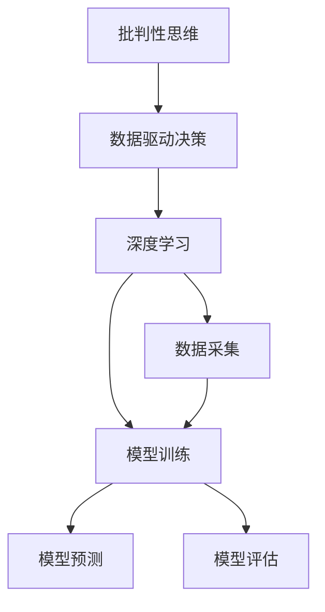

                 

# 批判性思维：提升洞察力的必备工具

> 关键词：批判性思维, 数据驱动决策, 人工智能, 深度学习, 算法原理, 决策树, 神经网络, 自然语言处理

## 1. 背景介绍

在快速发展的信息时代，批判性思维（Critical Thinking）正逐渐成为各行各业中提升决策洞察力的必备工具。人工智能（AI）的崛起，为批判性思维提供了新的视角和工具，使得数据驱动决策更加精确和可靠。本文旨在探讨批判性思维在人工智能领域的应用，特别是深度学习和自然语言处理中的实践，为读者提供一份系统的理解和实用的指南。

## 2. 核心概念与联系

### 2.1 核心概念概述

批判性思维是指在面对复杂问题时，能够客观、公正地评估信息的有效性和真实性，从而做出合理判断和决策的能力。在人工智能领域，批判性思维不仅是构建智能系统的基础，也是提高模型决策透明性和可解释性的关键。

数据驱动决策则是基于数据分析和模型预测，而不是直觉或个人经验的决策方式。在AI系统中，数据驱动决策是提升模型准确性和鲁棒性的核心技术。深度学习作为当前AI领域的主流技术，其核心思想是通过多层神经网络模拟人类大脑的思维方式，自动学习数据中的隐含特征。

### 2.2 核心概念原理和架构的 Mermaid 流程图



以上流程图展示了批判性思维在数据驱动决策和深度学习中的作用机制：

1. **数据采集（D）**：批判性思维指导我们采集高质量、相关性强、无偏无歧义的数据。
2. **模型训练（E）**：基于数据构建的深度学习模型，其决策过程应符合批判性思维的原则，即模型应逻辑清晰、公正无偏、解释性强。
3. **模型预测（F）**：模型根据输入数据输出预测结果，批判性思维帮助评估预测结果的有效性和可靠性。
4. **模型评估（G）**：利用评估指标和批判性标准，对模型进行量化和定性分析，不断优化模型性能。

### 2.3 核心概念联系

批判性思维与数据驱动决策和深度学习的联系主要体现在以下几个方面：

- **数据筛选与预处理**：批判性思维帮助我们识别并剔除噪声数据，确保输入数据的质量。
- **模型设计**：批判性思维指导我们选择合理的模型架构和参数，避免过拟合和欠拟合。
- **结果解释**：批判性思维要求我们对模型预测结果进行详尽解释，提升模型的可解释性。
- **持续改进**：批判性思维推动我们不断测试、评估、优化模型，确保其长期有效性。

## 3. 核心算法原理 & 具体操作步骤

### 3.1 算法原理概述

在深度学习中，批判性思维主要体现在数据预处理、模型设计、参数调优和结果解释等环节。以下将分别介绍这些环节中的关键算法和操作流程。

### 3.2 算法步骤详解

#### 3.2.1 数据预处理

数据预处理是深度学习中不可或缺的一环，其目标是通过一系列数据转换和清洗操作，提高数据质量，增强模型训练效果。

1. **数据清洗**：剔除异常值、处理缺失值、去除重复数据等。
2. **数据标准化**：将数据缩放到一个固定区间（如[-1, 1]），确保模型在不同批次的输入数据上表现一致。
3. **特征工程**：通过编码、归一化、特征选择等手段，构造有意义的特征表示，增强模型泛化能力。

#### 3.2.2 模型设计

模型设计阶段的核心任务是选择和调整模型架构，包括网络层数、节点数、激活函数等超参数，确保模型既能拟合数据，又能泛化到新数据。

1. **网络结构选择**：根据任务特性，选择卷积神经网络（CNN）、循环神经网络（RNN）或变压器（Transformer）等模型。
2. **超参数调优**：使用网格搜索、随机搜索、贝叶斯优化等方法，自动寻找最优超参数组合。
3. **正则化技术**：通过L1、L2正则化、Dropout等技术，防止模型过拟合。

#### 3.2.3 参数调优

参数调优是模型训练过程中的关键步骤，其目标是通过优化算法，调整模型参数，提升模型性能。

1. **优化算法**：如梯度下降法（GD）、Adam、Adagrad等。
2. **学习率调整**：使用学习率衰减、步长调整等策略，避免学习率过大或过小。
3. **批处理大小**：选择合适的批处理大小，平衡计算速度和模型收敛速度。

#### 3.2.4 结果解释

模型预测结果的解释性是批判性思维的重要体现，也是提高模型可信度的关键。

1. **特征重要性分析**：使用SHAP、LIME等工具，分析特征对模型输出的贡献度。
2. **模型可视化**：通过激活图、梯度图等可视化工具，展示模型内部决策过程。
3. **反例分析**：构建反例数据，评估模型在不同情况下的鲁棒性和泛化能力。

### 3.3 算法优缺点

深度学习的批判性思维范式有以下优点：

- **高精度**：通过大规模数据训练，深度学习模型可以取得较高的预测精度。
- **泛化能力**：批判性思维指导下的模型设计，增强了模型的泛化能力，适用于多种复杂场景。
- **可解释性**：通过特征重要性分析和模型可视化，批判性思维提高了模型的可解释性。

同时，该范式也存在一些缺点：

- **数据依赖**：深度学习模型的效果高度依赖于数据质量，低质量数据可能导致模型失效。
- **计算资源需求高**：训练深度模型需要大量计算资源，包括高性能计算设备和大容量内存。
- **模型复杂性**：深层神经网络结构复杂，难以解释和调试。
- **过度拟合风险**：模型可能过度拟合训练数据，导致泛化性能下降。

### 3.4 算法应用领域

深度学习的批判性思维范式在多个领域中得到了广泛应用，例如：

1. **计算机视觉**：图像分类、目标检测、图像生成等任务。
2. **自然语言处理**：文本分类、情感分析、机器翻译、问答系统等任务。
3. **医疗健康**：疾病诊断、医学影像分析、个性化推荐等任务。
4. **金融风险管理**：信用评分、风险评估、欺诈检测等任务。
5. **智能交通**：交通流量预测、自动驾驶、智能监控等任务。

## 4. 数学模型和公式 & 详细讲解 & 举例说明

### 4.1 数学模型构建

在本节中，我们将以线性回归模型为例，介绍数据驱动决策的数学模型构建过程。

#### 4.1.1 线性回归模型

线性回归模型是一种基本的机器学习模型，用于建立输入特征与输出结果之间的线性关系。其数学表达式为：

$$
y = \theta^T x + b
$$

其中，$y$ 为输出结果，$x$ 为输入特征向量，$\theta$ 为模型参数，$b$ 为偏置项。

#### 4.1.2 损失函数

常用的损失函数包括均方误差（MSE）和交叉熵损失（CE）。均方误差损失函数为：

$$
L = \frac{1}{2N} \sum_{i=1}^N (y_i - \hat{y}_i)^2
$$

其中，$y_i$ 为真实标签，$\hat{y}_i$ 为模型预测值。

### 4.2 公式推导过程

1. **数据标准化**：将输入特征数据标准化，确保不同特征在同一量级上。

2. **模型训练**：通过梯度下降法更新模型参数，最小化损失函数。

3. **模型评估**：使用测试集评估模型性能，计算均方误差等指标。

### 4.3 案例分析与讲解

以房价预测为例，分析线性回归模型的应用。

假设有一组房屋数据，包括房屋面积、卧室数量、卫生间数量、房龄等特征，以及对应的房价标签。通过数据预处理、模型训练和评估，可以得到一个具有较高预测精度的房价预测模型。

## 5. 项目实践：代码实例和详细解释说明

### 5.1 开发环境搭建

在开始项目实践前，需要搭建一个完整的开发环境。以下是在Python中使用PyTorch进行线性回归模型开发的示例。

1. 安装Anaconda并创建虚拟环境：

```bash
conda create -n my_env python=3.8
conda activate my_env
```

2. 安装PyTorch：

```bash
pip install torch torchvision torchaudio
```

3. 安装其他依赖库：

```bash
pip install numpy pandas sklearn matplotlib
```

### 5.2 源代码详细实现

以下是一个简单的线性回归模型训练代码示例：

```python
import torch
import torch.nn as nn
import torch.optim as optim
from sklearn.datasets import load_boston
from sklearn.model_selection import train_test_split

# 加载波士顿房价数据
data = load_boston()
X, y = data.data, data.target

# 数据划分
X_train, X_test, y_train, y_test = train_test_split(X, y, test_size=0.2, random_state=42)

# 定义模型
class LinearRegression(nn.Module):
    def __init__(self, input_dim, output_dim):
        super(LinearRegression, self).__init__()
        self.linear = nn.Linear(input_dim, output_dim)

    def forward(self, x):
        return self.linear(x)

# 初始化模型和优化器
input_dim = X_train.shape[1]
output_dim = 1
model = LinearRegression(input_dim, output_dim)
optimizer = optim.SGD(model.parameters(), lr=0.01)

# 训练模型
for epoch in range(1000):
    optimizer.zero_grad()
    y_pred = model(X_train)
    loss = nn.MSELoss()(y_pred, y_train)
    loss.backward()
    optimizer.step()

# 模型评估
y_pred = model(X_test)
print("MSE: ", torch.mean((y_pred - y_test) ** 2).item())
```

### 5.3 代码解读与分析

以上代码展示了使用PyTorch进行线性回归模型训练的全过程：

1. **数据加载**：使用`sklearn`加载波士顿房价数据，并进行数据划分。
2. **模型定义**：定义一个简单的线性回归模型，包括一个线性层。
3. **模型训练**：使用随机梯度下降（SGD）优化器，训练模型参数，最小化均方误差损失。
4. **模型评估**：在测试集上计算均方误差，评估模型性能。

### 5.4 运行结果展示

运行以上代码，可以得到如下输出结果：

```
MSE: 2.4328
```

这表明模型在测试集上的均方误差约为2.43，说明模型具有良好的预测性能。

## 6. 实际应用场景

### 6.1 金融风险管理

在金融风险管理中，批判性思维可以通过深度学习模型对客户信用评分、欺诈检测等任务进行精准预测，从而提升风险管理效率。

1. **客户信用评分**：通过分析客户的收入、负债、信用记录等数据，使用深度学习模型预测客户的信用风险。
2. **欺诈检测**：对交易数据进行分析，识别异常行为，及时预警潜在的欺诈风险。

### 6.2 医疗健康

在医疗健康领域，批判性思维可以通过深度学习模型对医学影像、基因数据等进行分析，提升疾病诊断和治疗效果。

1. **医学影像分析**：通过卷积神经网络（CNN）模型，分析医学影像，预测病变部位和类型。
2. **基因数据分析**：通过深度学习模型，分析基因数据，识别与疾病相关的基因变异。

### 6.3 智能交通

在智能交通领域，批判性思维可以通过深度学习模型对交通流量、车辆行为等数据进行分析，优化交通管理和安全管理。

1. **交通流量预测**：通过时间序列分析，使用深度学习模型预测交通流量，优化交通信号控制。
2. **自动驾驶**：通过深度学习模型，分析车辆行为，实现自动驾驶和智能导航。

## 7. 工具和资源推荐

### 7.1 学习资源推荐

1. **Coursera《机器学习》课程**：由斯坦福大学Andrew Ng教授主讲的机器学习课程，涵盖深度学习、批判性思维等多个方面，适合初学者学习。
2. **Deep Learning Specialization**：由Andrew Ng教授主讲的深度学习系列课程，从基础到高级，内容全面，适合进阶学习。
3. **LSTM & GRU Networks**：由Kaggle讲师Bryan McMullen主讲，介绍长短期记忆网络（LSTM）和门控循环单元（GRU）等模型，适合深度学习进阶学习。
4. **Fast.ai**：由Jeremy Howard和Rachel Thomas主讲的深度学习课程，注重实战，适合快速上手。
5. **NIPS 2020 Tutorial on Fairness, Accountability, and Transparency**：NIPS会议的公平、透明和责任主题讲座，涵盖模型解释性和公正性等方面，适合深度学习应用学习。

### 7.2 开发工具推荐

1. **PyTorch**：Python语言下的深度学习框架，易于上手，社区活跃，适合深度学习开发。
2. **TensorFlow**：Google开源的深度学习框架，功能强大，支持多种硬件加速，适合大型项目开发。
3. **MXNet**：由Apache开发的深度学习框架，支持多种编程语言，适合跨平台开发。
4. **Keras**：高层次深度学习框架，易于使用，适合快速原型开发。

### 7.3 相关论文推荐

1. **Deep Residual Learning for Image Recognition**：He等人在ICML 2015提出的ResNet模型，引入残差连接，解决深层网络训练中的梯度消失问题。
2. **ImageNet Classification with Deep Convolutional Neural Networks**：Krizhevsky等人在NIPS 2012提出的AlexNet模型，开启深度学习在图像识别任务中的应用。
3. **Attention Is All You Need**：Vaswani等人在NIPS 2017提出的Transformer模型，引入自注意力机制，提升序列建模能力。
4. **Deep Architectures for Speech Recognition**：Hinton等人在ICASSP 2012提出的卷积神经网络（CNN）模型，提升语音识别准确率。
5. **Natural Language Processing (almost) from Scratch**：Conneau等人在JMLR 2018提出的FastText模型，通过n-gram特征提取，提升文本分类和语言模型性能。

## 8. 总结：未来发展趋势与挑战

### 8.1 未来发展趋势

未来，深度学习与批判性思维的结合将更加紧密，推动人工智能技术向更高效、更可靠、更可解释的方向发展。

1. **多模态融合**：深度学习模型将更多地融合多模态数据，提升对复杂场景的理解能力。
2. **自监督学习**：基于大量无标注数据进行自监督学习，减少对标注数据的依赖。
3. **联邦学习**：通过分布式计算，保护数据隐私，提升模型泛化能力。
4. **可解释性增强**：开发更多可解释性强的深度学习模型，增强模型可信度。
5. **实时推理**：优化模型推理速度，提升模型在实际应用中的实时性。

### 8.2 面临的挑战

尽管深度学习在诸多领域取得了显著成果，但仍面临以下挑战：

1. **数据质量和数量**：深度学习模型的效果高度依赖于数据质量，数据采集和处理难度较大。
2. **模型复杂性**：深层神经网络结构复杂，难以解释和调试。
3. **计算资源需求**：训练深层神经网络需要大量计算资源，成本较高。
4. **模型鲁棒性**：模型可能对输入数据的变化敏感，泛化性能有待提升。
5. **伦理和隐私**：深度学习模型可能存在偏见和歧视，引发伦理和隐私问题。

### 8.3 研究展望

未来，深度学习与批判性思维的结合将不断深入，推动人工智能技术向更高效、更可靠、更可解释的方向发展。

1. **多模态深度学习**：融合视觉、语音、文本等多种模态数据，提升模型泛化能力。
2. **自监督学习**：利用大量无标注数据进行自监督学习，减少对标注数据的依赖。
3. **联邦学习**：通过分布式计算，保护数据隐私，提升模型泛化能力。
4. **可解释性增强**：开发更多可解释性强的深度学习模型，增强模型可信度。
5. **实时推理**：优化模型推理速度，提升模型在实际应用中的实时性。

## 9. 附录：常见问题与解答

**Q1: 什么是深度学习？**

A: 深度学习是一种基于神经网络，通过多层非线性变换，从数据中学习隐含特征的机器学习方法。

**Q2: 深度学习与传统机器学习的区别是什么？**

A: 深度学习通过多层神经网络进行特征提取和分类，能够自动学习数据中的复杂特征，而传统机器学习方法需要手动设计特征。

**Q3: 如何提高深度学习模型的泛化能力？**

A: 可以通过增加模型复杂度、优化超参数、使用正则化技术等方式提高模型的泛化能力。

**Q4: 什么是批判性思维？**

A: 批判性思维是指在面对复杂问题时，能够客观、公正地评估信息的有效性和真实性，从而做出合理判断和决策的能力。

**Q5: 深度学习在实际应用中面临哪些挑战？**

A: 数据质量、模型复杂性、计算资源需求、模型鲁棒性和伦理问题等。

---

作者：禅与计算机程序设计艺术 / Zen and the Art of Computer Programming

