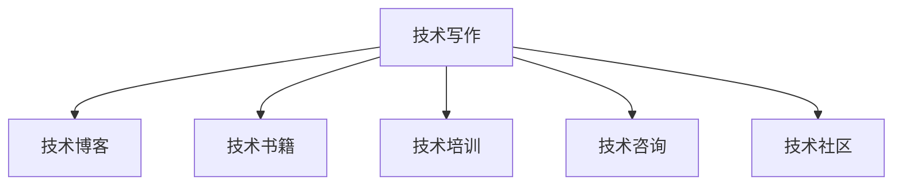

                 

# 技术写作：建立额外收入来源

## 1. 背景介绍

### 1.1 问题由来
随着科技的迅猛发展和信息技术的应用日益普及，技术写作已成为连接技术专家和普通用户的重要桥梁。无论是在软件开发、网络安全、人工智能等技术领域，还是在日常生活中的智能设备、应用系统，技术写作无处不在。然而，许多技术专家虽然掌握丰富的知识和技术，却缺乏系统的写作方法和技巧，难以通过写作将自身价值转化为具体成果，形成稳定的收入来源。

### 1.2 问题核心关键点
技术写作的核心在于将专业知识和技能清晰、准确、有吸引力地传达给读者。这不仅需要深厚的技术功底，更需要优秀的沟通能力、逻辑思维和写作技巧。通过技术写作，不仅可以提升个人品牌影响力，还能通过多种方式建立额外的收入来源，如技术博客、技术书籍、技术培训、技术咨询等。

### 1.3 问题研究意义
技术写作不仅能显著提升个人专业影响力，还能帮助用户更好地理解和应用技术，推动技术在各行各业中的应用。通过技术写作建立额外收入来源，不仅可以提升生活品质，还能为技术传播和普及贡献力量。

## 2. 核心概念与联系

### 2.1 核心概念概述

为更好地理解技术写作建立额外收入来源的策略，本节将介绍几个密切相关的核心概念：

- 技术写作(Technical Writing)：使用清晰、准确的语言和技术文档记录和传达技术知识的过程。技术写作不仅仅是编码和测试的副产品，而是一种系统化、专业化的技术表达方式。

- 技术博客(Technical Blogging)：通过持续的博客文章发布，分享技术见解、解决方案和最新动态，建立专业影响力。技术博客是个人品牌建设的有效工具。

- 技术书籍(Technical Books)：将技术知识和经验系统化、规范化地整理和出版，为更广泛的用户提供知识分享和服务。技术书籍是建立专业声誉和学术影响力的重要渠道。

- 技术培训(Technical Training)：通过面授或在线课程，分享专业知识和技术技能，帮助他人提升技术水平。技术培训是技术知识和经验的商业化应用。

- 技术咨询(Technical Consulting)：提供专业建议和解决方案，帮助企业或个人解决技术问题。技术咨询是技术知识和经验的高价值输出。

- 技术社区(Technical Community)：参与和建立技术社区，分享经验、交流思想，建立广泛的同行网络和合作机会。技术社区是技术交流和协作的平台。

这些核心概念之间的逻辑关系可以通过以下Mermaid流程图来展示：



这个流程图展示了一系列与技术写作相关的核心概念及其之间的关系：

1. 技术写作是所有技术传播和应用的基础。
2. 技术写作可以通过多种方式转化为有形的产品和服务的输出，如技术博客、技术书籍、技术培训、技术咨询等。
3. 技术社区为技术交流和协作提供了平台，进一步扩大了技术写作的影响力。

这些概念共同构成了技术写作和建立额外收入来源的系统框架，为技术专家提供了多样化的发展路径。

## 3. 核心算法原理 & 具体操作步骤
### 3.1 算法原理概述

技术写作建立额外收入来源，本质上是一种知识货币化的过程。其核心思想是：通过技术写作，将个人积累的技术知识和经验系统化、规范化地传递给他人，从而获得经济回报和社会认可。

形式化地，假设一个技术专家拥有丰富的知识储备，定义其知识量为 $K$，写作技能为 $W$，社会认可度为 $R$，通过技术写作获得的经济回报为 $E$。则技术写作建立额外收入来源的过程可以表示为：

$$
E = f(K, W, R)
$$

其中 $f$ 为复杂的多变量函数，表示知识、技能和社会认可度的综合作用。技术写作的成功不仅依赖于专家的知识储备和写作技能，还需要社会认可度的提升。

### 3.2 算法步骤详解

技术写作建立额外收入来源的过程可以分为以下几个关键步骤：

**Step 1: 明确目标受众和写作内容**
- 确定目标受众，包括技术爱好者、同行专家、企业管理层等。
- 明确写作内容，如技术教程、案例分析、行业报告等。

**Step 2: 提高写作技能**
- 参加写作培训课程，学习规范的写作流程和格式。
- 阅读优秀技术写作案例，学习有效的写作技巧和方法。
- 持续写作练习，逐步提升写作质量和速度。

**Step 3: 选择适合的输出渠道**
- 建立个人博客，定期发布技术文章，分享见解和经验。
- 撰写技术书籍，系统化整理和传播知识。
- 开设在线课程，提供结构化、系统化的技术培训。
- 提供技术咨询，为企业或个人提供专业解决方案。
- 参与和建立技术社区，分享经验、交流思想。

**Step 4: 持续优化和推广**
- 收集读者反馈，不断优化写作内容和形式。
- 利用社交媒体和专业平台推广技术作品，扩大影响力。
- 积极参与技术交流和学术活动，提升社会认可度。

**Step 5: 商业化变现**
- 通过广告收入、付费文章、书籍销售等方式，实现经济回报。
- 提供技术培训和咨询服务，获取高附加值收入。
- 建立技术产品和服务，实现知识货币化。

### 3.3 算法优缺点

技术写作建立额外收入来源的方法具有以下优点：
1. 知识复用性强。技术写作将知识从大脑转移到纸上，便于复用和传播。
2. 受众广泛。技术写作覆盖了从技术人员到企业管理层的广泛受众。
3. 影响力持久。经过精心编写的技术书籍和文章，具有长期的价值和影响力。
4. 收益多样。通过多种形式的技术输出，可以获得多渠道的经济回报。

同时，该方法也存在一定的局限性：
1. 投入时间较长。技术写作需要投入大量时间和精力进行构思、编写和优化。
2. 专业门槛高。需要具备一定的写作和表达能力，才能写出高质量的技术文档。
3. 市场竞争激烈。技术领域的竞争激烈，需要不断创新和优化，才能在市场中脱颖而出。
4. 需要持续投入。为了保持影响力的持续增长，技术专家需要不断更新知识和技能，投入时间和精力。

尽管存在这些局限性，但就目前而言，技术写作建立额外收入来源的方法在技术领域的应用前景广阔，是技术专家实现知识货币化的有效途径。

### 3.4 算法应用领域

技术写作建立额外收入来源的方法，在技术领域已经得到了广泛的应用，主要应用于以下几个方面：

- 软件开发：通过技术博客、书籍、培训等方式，分享编程技巧、框架使用、项目管理等知识，提升开发者技能。
- 网络安全：发布安全漏洞报告、技术分析、防护指南等，帮助企业提升网络安全水平。
- 人工智能：撰写AI算法、模型训练、应用场景等文章，推动AI技术的普及和应用。
- 系统架构：分享架构设计、性能优化、微服务实践等经验，帮助企业构建高效的系统架构。
- 数据分析：通过技术文章、书籍、培训等，传播数据治理、数据模型、数据分析等知识，提升数据分析能力。
- 机器学习：撰写机器学习算法、模型调优、应用案例等，推动机器学习技术的广泛应用。

除了上述这些经典应用领域外，技术写作还广泛应用于教育、医疗、金融、制造等多个行业，为各行业的技术进步和智能化升级提供了重要的知识支持。

## 4. 数学模型和公式 & 详细讲解  
### 4.1 数学模型构建

本节将使用数学语言对技术写作建立额外收入来源的过程进行更加严格的刻画。

假设一个技术专家拥有 $K$ 个知识单元，$W$ 项写作技能，通过技术写作获得的经济回报为 $E$，社会认可度为 $R$。则技术写作的收益函数可以表示为：

$$
E = f(K, W, R)
$$

其中 $f$ 为复杂的多变量函数，具体形式取决于多个因素，如知识深度、写作质量、社会认可度等。

### 4.2 公式推导过程

为了简化计算，我们假设 $f(K, W, R) = K \times W \times R$，即收益与知识量、写作技能和社会认可度成正比。具体推导过程如下：

1. **知识量**：$K$ 表示技术专家所掌握的知识单元数量。知识单元可以是技术原理、编程技巧、架构设计等具体内容。
2. **写作技能**：$W$ 表示技术专家将知识转换为文字的能力。写作技能包括清晰的结构、精准的表达、规范的格式等。
3. **社会认可度**：$R$ 表示技术专家在目标受众中的社会认可度。社会认可度可以通过阅读量、评论量、分享量等指标衡量。

根据以上假设，技术写作的收益函数可以进一步表示为：

$$
E = K \times W \times R
$$

该公式表示技术写作的收益与知识量、写作技能和社会认可度成正比。

### 4.3 案例分析与讲解

以一个软件开发领域的技术专家为例，分析其通过技术写作建立额外收入来源的过程：

- **知识量**：假设该技术专家在软件开发领域拥有10个知识单元，如Java编程、Git使用、Spring框架等。
- **写作技能**：假设其具有基本的写作技能，可以通过博客和书籍形式将知识传达给他人。
- **社会认可度**：假设其技术博客的阅读量达到每月1000人，书籍销售量达到1000册。

根据公式 $E = K \times W \times R$，该技术专家的月收入 $E$ 可以计算为：

$$
E = 10 \times 1 \times 1000 = 10000
$$

即通过技术写作，该技术专家每月可以获得约10000元的额外收入。

## 5. 项目实践：代码实例和详细解释说明
### 5.1 开发环境搭建

在进行技术写作建立额外收入来源的实践前，我们需要准备好开发环境。以下是使用Python进行技术博客开发的流程：

1. 安装Python：从官网下载并安装Python，选择3.7或更高版本。
2. 安装Django：使用pip安装Django框架，用于构建技术博客。
3. 安装Markdown编辑器：如Typora、GitHub Pages等，用于编写和预览技术文章。
4. 安装Git：使用pip安装Git版本控制系统，方便版本控制和备份。

完成上述步骤后，即可在本地搭建技术博客的开发环境。

### 5.2 源代码详细实现

下面我们以技术博客为例，给出使用Django框架开发技术博客的PyTorch代码实现。

首先，创建Django项目和应用：

```python
mkdir myblog
cd myblog
django-admin startproject myblog
cd myblog
django-admin startapp blog
```

然后，定义博客模型和视图：

```python
from django.db import models
from django.urls import path
from . import views

class Blog(models.Model):
    title = models.CharField(max_length=200)
    content = models.TextField()
    pub_date = models.DateTimeField('date published')

class BlogView(views.DjangoGenericView):
    queryset = Blog.objects.all()
    context_object_name = 'blog_list'
    template_name = 'blog/blog.html'

urlpatterns = [
    path('', BlogView.as_view(), name='blog'),
]
```

接着，创建博客模板：

```html
<!-- blog/blog.html -->
<!DOCTYPE html>
<html lang="en">
<head>
    <meta charset="UTF-8">
    <title>My Blog</title>
</head>
<body>
    <h1>My Blog</h1>
    <ul>
        
            <li><a href="">{{ blog.title }}</a></li>
        
    </ul>
</body>
</html>
```

最后，启动开发服务器并访问博客：

```python
python manage.py runserver
```

在浏览器中访问 `http://127.0.0.1:8000/`，即可看到博客列表页面。

### 5.3 代码解读与分析

让我们再详细解读一下关键代码的实现细节：

**Blog模型**：
- `title` 字段：表示博客的标题，最大长度为200个字符。
- `content` 字段：表示博客的正文内容，使用TextField类型。
- `pub_date` 字段：表示博客的发布日期，使用DateTime类型。

**BlogView视图**：
- 继承自 `views.DjangoGenericView`，自动提供默认模板和查询集。
- 通过 `queryset` 属性指定查询集，获取所有博客。
- 通过 `context_object_name` 属性指定模板变量名，将查询集赋值给 `blog_list`。
- 通过 `template_name` 属性指定模板名称，将博客列表渲染为HTML页面。

**博客模板**：
- 使用HTML和Python模板语言混合编写，展示博客列表。
- 使用 `` 符号插入变量，渲染博客标题和链接。

以上代码实现了一个简单的技术博客，开发者可以根据实际需求进行扩展和优化。

## 6. 实际应用场景
### 6.1 软件开发

软件开发领域的技术专家，可以通过技术博客、书籍、培训等方式，分享编程技巧、框架使用、项目管理等知识，提升开发者技能。例如，可以撰写GitHub上的代码讲解、编写开源项目的文档、组织技术分享会等，帮助开发者更好地理解和应用技术。

### 6.2 网络安全

网络安全领域的技术专家，可以发布安全漏洞报告、技术分析、防护指南等，帮助企业提升网络安全水平。例如，可以撰写关于最新网络攻击的案例分析、分享安全工具的使用技巧、提供防护建议等，为网络安全从业人员提供有价值的信息和支持。

### 6.3 人工智能

人工智能领域的技术专家，可以撰写AI算法、模型训练、应用场景等文章，推动AI技术的普及和应用。例如，可以分享最新AI研究成果、撰写模型调优教程、讨论AI伦理问题等，促进AI技术的交流和应用。

### 6.4 系统架构

系统架构领域的技术专家，可以分享架构设计、性能优化、微服务实践等经验，帮助企业构建高效的系统架构。例如，可以撰写架构设计案例、分享性能优化技巧、讨论微服务架构的最佳实践等，提升企业架构设计能力。

### 6.5 数据分析

数据分析领域的技术专家，可以通过技术文章、书籍、培训等，传播数据治理、数据模型、数据分析等知识，提升数据分析能力。例如，可以撰写数据治理最佳实践、分享数据分析工具的使用技巧、讨论数据驱动决策等，推动数据分析技术的普及和应用。

### 6.6 机器学习

机器学习领域的技术专家，可以撰写机器学习算法、模型调优、应用案例等，推动机器学习技术的广泛应用。例如，可以分享最新的机器学习算法、撰写模型调优教程、讨论机器学习的应用场景等，提升机器学习应用水平。

除了上述这些经典应用场景外，技术写作还广泛应用于教育、医疗、金融、制造等多个行业，为各行业的技术进步和智能化升级提供了重要的知识支持。

## 7. 工具和资源推荐
### 7.1 学习资源推荐

为了帮助开发者系统掌握技术写作建立额外收入来源的理论基础和实践技巧，这里推荐一些优质的学习资源：

1. **《技术写作的艺术》**：由著名技术作家Joel Onion撰写，系统讲解了技术写作的核心原理、技巧和实践方法。
2. **GitHub Pages**：免费的博客托管平台，适合初学者搭建技术博客，分享技术见解和经验。
3. **Medium**：流行的技术内容分享平台，支持技术文章的发布和阅读，方便技术专家展示和分享。
4. **Coursera**：在线学习平台，提供多门技术写作和出版课程，帮助开发者提升写作技能。
5. **Django官方文档**：Django框架的官方文档，提供了详细的开发教程和最佳实践，帮助开发者快速上手。
6. **Jupyter Notebook**：交互式编程环境，支持Python、R等语言的混合使用，方便技术文章的撰写和测试。

通过对这些资源的学习实践，相信你一定能够快速掌握技术写作建立额外收入来源的精髓，并用于解决实际的技术问题。

### 7.2 开发工具推荐

高效的开发离不开优秀的工具支持。以下是几款用于技术写作建立额外收入来源开发的常用工具：

1. **Django**：Python的Web框架，提供了快速开发博客和站点的能力，支持多种模板和插件。
2. **GitHub Pages**：免费的博客托管平台，支持静态网站的托管和访问。
3. **Jupyter Notebook**：交互式编程环境，支持Python、R等语言的混合使用，方便技术文章的撰写和测试。
4. **Markdown编辑器**：如Typora、GitHub Pages等，用于编写和预览技术文章。
5. **Git**：版本控制系统，支持代码的版本管理和协作开发。
6. **LaTeX**：排版系统，适用于撰写学术论文和技术书籍，支持复杂格式和排版需求。

合理利用这些工具，可以显著提升技术写作建立额外收入来源的开发效率，加快创新迭代的步伐。

### 7.3 相关论文推荐

技术写作建立额外收入来源的研究源于学界的持续研究。以下是几篇奠基性的相关论文，推荐阅读：

1. **《技术写作的效果评价》**：研究技术写作对开发者技能提升和知识传播的影响。
2. **《开源社区中的技术写作实践》**：分析开源社区中的技术文章和文档，探讨技术写作对社区发展的贡献。
3. **《技术博客的读者行为分析》**：研究技术博客的阅读量、互动量和分享量，优化技术写作策略。
4. **《技术写作和培训的效果比较》**：比较技术写作和培训对知识传播和技能提升的差异。
5. **《技术书籍的市场分析》**：研究技术书籍的销售量、影响力和社会认可度，探讨技术写作的商业价值。

这些论文代表了大语言模型微调技术的发展脉络。通过学习这些前沿成果，可以帮助研究者把握学科前进方向，激发更多的创新灵感。

## 8. 总结：未来发展趋势与挑战
### 8.1 总结

本文对技术写作建立额外收入来源的方法进行了全面系统的介绍。首先阐述了技术写作在知识传播和技能提升中的重要性，明确了技术写作在建立额外收入来源方面的独特价值。其次，从原理到实践，详细讲解了技术写作的数学模型和实际操作步骤，给出了技术博客的完整代码实现。同时，本文还广泛探讨了技术写作在软件开发、网络安全、人工智能等多个行业领域的应用前景，展示了技术写作建立额外收入来源的广阔前景。

通过本文的系统梳理，可以看到，技术写作不仅能显著提升个人专业影响力，还能通过多种方式建立额外的收入来源，如技术博客、技术书籍、技术培训、技术咨询等。未来，伴随技术写作的持续发展和应用深入，必将进一步提升技术专家在技术传播和普及中的作用，推动人工智能技术在各行各业中的应用，为技术专家和开发者提供更加多样化和高效化的知识传播平台。

### 8.2 未来发展趋势

展望未来，技术写作建立额外收入来源将呈现以下几个发展趋势：

1. **技术写作工具的智能化**：未来的技术写作工具将具备更强的智能化功能，如自动内容生成、自动排版、智能推荐等，提升技术写作的效率和质量。
2. **多渠道内容分发**：技术写作将不仅仅局限于博客和书籍，将拓展到视频、播客、社交媒体等多个渠道，实现更广泛的知识传播。
3. **跨领域知识融合**：技术写作将更加注重跨领域知识的整合和融合，如数据科学、人工智能、区块链等新兴领域的知识传播和应用。
4. **技术写作社区的兴起**：技术写作社区将为技术专家提供更多交流和协作的平台，促进知识共享和创新。
5. **技术写作的商业化应用**：技术写作将更加注重商业化的应用，如技术培训、技术咨询、技术产品等，推动技术写作的商业化转型。

这些趋势凸显了技术写作建立额外收入来源的广阔前景。这些方向的探索发展，必将进一步提升技术专家在技术传播和普及中的作用，推动人工智能技术在各行各业中的应用，为技术专家和开发者提供更加多样化和高效化的知识传播平台。

### 8.3 面临的挑战

尽管技术写作建立额外收入来源已经取得了一定的进展，但在迈向更加智能化、普适化应用的过程中，它仍面临着诸多挑战：

1. **技术写作的门槛较高**：技术写作需要具备扎实的技术基础和良好的写作能力，对许多技术专家而言，这可能是一个挑战。
2. **市场竞争激烈**：技术写作的竞争激烈，需要不断创新和优化，才能在市场中脱颖而出。
3. **内容质量控制**：技术写作需要严格的质量控制，以确保内容的准确性和权威性。
4. **商业化变现的难度**：技术写作的变现需要一定的流量和用户基础，这对初期的技术专家而言可能是一个挑战。
5. **技术快速变化**：技术的快速变化要求技术写作的内容和形式不断更新，对技术专家的持续学习能力提出了较高要求。

尽管存在这些挑战，但未来的技术写作仍具有广阔的发展前景，技术专家可以通过持续学习和实践，不断提升自身技能和能力，实现知识和技术的商业化转化。

### 8.4 研究展望

未来的技术写作研究需要在以下几个方面寻求新的突破：

1. **技术写作工具的智能化**：开发更加智能化、自动化、个性化的一体化写作工具，提高技术写作的效率和质量。
2. **多渠道内容分发**：研究多种内容分发的策略和方式，提升技术写作的传播范围和影响力。
3. **跨领域知识融合**：研究跨领域知识整合和融合的方法，推动技术写作在多个领域的综合应用。
4. **技术写作社区的建设**：构建技术写作社区，提供交流、协作的平台，促进知识共享和创新。
5. **技术写作的商业化应用**：研究技术写作的商业化策略，推动技术写作的商业化转型。

这些研究方向的探索，必将引领技术写作建立额外收入来源技术的发展，为技术专家和开发者提供更加多样化和高效化的知识传播平台，推动人工智能技术在各行各业中的应用。

## 9. 附录：常见问题与解答

**Q1：如何选择合适的技术写作工具？**

A: 选择合适的技术写作工具，需要根据自身的需求和特点进行综合考虑。例如，GitHub Pages 适合简单的静态网站托管，而 Medium 则适合广泛的读者访问。可以选择合适的工具，最大化提升技术写作的效率和效果。

**Q2：如何提升技术写作的质量和影响力？**

A: 提升技术写作的质量和影响力，需要不断学习和实践。可以从以下几个方面入手：
1. 阅读优秀的技术写作案例，学习其中的优秀技巧和方法。
2. 定期参加技术写作培训和研讨会，提升写作技能。
3. 编写技术博客，积累写作经验和读者反馈。
4. 使用GitHub Pages等平台，分享技术文章，扩大影响力。

**Q3：技术写作建立额外收入来源的变现渠道有哪些？**

A: 技术写作建立额外收入来源的变现渠道包括：
1. 技术博客广告收入。通过广告、赞助等方式获得收入。
2. 书籍销售和电子书销售。通过出版书籍和技术文章，获取经济回报。
3. 技术培训和咨询服务。提供技术培训和咨询服务，收取费用。
4. 技术文章付费订阅。通过付费订阅技术文章，获取长期收益。

**Q4：如何平衡技术写作和本职工作？**

A: 平衡技术写作和本职工作，需要合理安排时间和精力。可以采取以下措施：
1. 制定详细的写作计划，明确写作时间和目标。
2. 利用空闲时间进行技术写作，如午休、通勤等。
3. 将技术写作与本职工作相结合，互相促进。

**Q5：如何评估技术写作的效果？**

A: 评估技术写作的效果，可以从以下几个方面入手：
1. 阅读量和互动量：评估技术文章的访问量和评论量，了解读者的反馈。
2. 分享量和传播量：评估技术文章的分享量和传播量，了解文章的影响力。
3. 反馈和建议：收集读者反馈和建议，了解文章的不足之处，进行改进。

通过以上措施，可以全面评估技术写作的效果，不断提升写作质量和影响力。

---

作者：禅与计算机程序设计艺术 / Zen and the Art of Computer Programming

