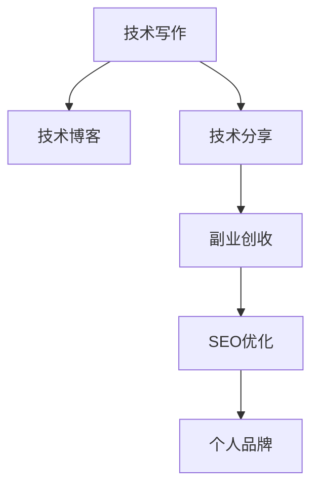

                 

# 技术写作：程序员的副业选择

> 关键词：技术写作, 程序员副业, 技术博客, 技术分享, 副业创收

## 1. 背景介绍

### 1.1 问题由来

在互联网时代，程序员的职业技能不断更新迭代，面临的竞争压力也越来越大。除了主业之外，程序员还需要不断拓展自身技能，以适应行业变化，增加职业竞争力。技术写作作为程序员的一种副业选择，不仅能够提升个人品牌影响力，还能带来额外的收入来源。

然而，技术写作并不只是简单的代码注释和文档编写，它是一门结合技术深度、创意表达和内容结构的综合性技能。许多程序员由于缺乏系统性训练，难以高效地完成高质量的技术写作，从而错失了副业创收的机会。本文将详细阐述技术写作的核心概念、核心算法原理、具体操作步骤，并结合实际项目实践，提供程序员技术写作的完整指南。

### 1.2 问题核心关键点

程序员技术写作的核心在于如何高效地将技术知识和经验转化为文字，并使之易于理解、富有吸引力。具体关键点包括：

- 写作框架：如何构建有逻辑、有条理的技术文档。
- 内容设计：如何选择合适的内容结构，提升读者的阅读体验。
- 语言表达：如何使用简洁、清晰的语言描述复杂技术。
- 视觉辅助：如何合理使用图表、代码片段等辅助工具。
- 互动形式：如何通过问答、示例、代码分析等互动形式提升用户参与度。

本文将围绕这些关键点，深入探讨程序员如何进行高质量的技术写作，并在此过程中实现副业创收。

## 2. 核心概念与联系

### 2.1 核心概念概述

为更好地理解程序员技术写作的过程，本节将介绍几个密切相关的核心概念：

- **技术写作**：将技术知识、经验和研究成果，以文字形式表达和传递的过程。技术写作不仅仅是代码注释和文档编写，更是一门融合技术深度、创意表达和内容结构的综合性技能。
- **技术博客**：程序员在个人或公共平台上分享技术知识、项目经验、职业发展心得等内容的自媒体平台。技术博客是程序员展示技术实力、建立个人品牌的重要渠道。
- **技术分享**：通过技术写作、技术博客等方式，将个人或团队的技术经验和研究成果公开分享，促进技术交流和知识传播。
- **副业创收**：利用技术写作、技术博客等手段，获取广告分成、付费订阅、商业合作等形式的收入。
- **SEO优化**：通过优化技术博客的关键词、内容结构、内链和外链，提高博客在搜索引擎中的排名，增加曝光量和流量。
- **个人品牌**：通过持续的技术写作和分享，建立和维护个人在技术领域的权威性和影响力。

这些核心概念之间的逻辑关系可以通过以下Mermaid流程图来展示：



这个流程图展示了好技术写作的各个阶段及其关联：

1. 技术写作是技术博客的基础，用于生成高质量的内容。
2. 技术分享和技术博客有助于提升技术写作的质量和影响力。
3. 副业创收是技术写作的直接回报。
4. SEO优化和技术分享共同提升博客的曝光度和用户互动。
5. 个人品牌是技术写作和分享的最终成果，有助于进一步提升创收能力。

## 3. 核心算法原理 & 具体操作步骤

### 3.1 算法原理概述

程序员技术写作的核心算法原理可以归纳为以下三点：

1. **内容结构化**：将技术知识按照一定的逻辑结构进行组织，使得读者能够快速理解技术要点。
2. **语言精炼**：使用简洁、明了的语言描述技术细节，避免冗长和复杂的描述。
3. **互动性增强**：通过问答、示例、代码分析等形式，提升读者的参与度和理解深度。

### 3.2 算法步骤详解

技术写作的过程可以分为以下几个关键步骤：

**Step 1: 选题与研究**

- 确定写作主题：根据自身技术兴趣和市场需求，选择适合的主题。
- 研究现有资料：查阅相关书籍、论文、博客等，了解当前领域的技术现状和热点。

**Step 2: 内容规划**

- 确定写作框架：设计有逻辑、有条理的技术文档结构。
- 细化写作内容：按照技术点、示例、案例等分类，规划每个部分的内容。
- 编写大纲：用简洁明了的语言，列出每个部分的主要内容和大纲。

**Step 3: 内容撰写**

- 内容创作：根据大纲，使用精炼的语言描述技术细节。
- 添加视觉辅助：合理使用图表、代码片段等辅助工具，提升内容的可视化效果。
- 设计互动形式：通过问答、示例、代码分析等互动形式，提升读者的参与度。

**Step 4: 内容优化**

- 校对和编辑：检查内容是否准确、完整，修正语法和格式错误。
- 用户反馈：在发布前，邀请技术同行或目标读者提供反馈。
- 迭代优化：根据反馈意见，对内容进行迭代优化。

**Step 5: 发布与推广**

- 选择发布平台：根据目标读者，选择合适的技术博客平台。
- 内容发布：使用优化的内容，发布到选定平台。
- 推广与互动：通过社交媒体、邮件列表等方式推广内容，与读者进行互动。

### 3.3 算法优缺点

技术写作作为程序员的副业选择，具有以下优点：

1. **提升技术水平**：通过写作，深入理解和梳理技术知识，提升自身技术深度。
2. **建立个人品牌**：通过持续的技术写作和分享，建立和维护个人在技术领域的权威性和影响力。
3. **副业创收**：通过广告分成、付费订阅、商业合作等方式，获取额外的收入来源。
4. **扩大影响力**：通过技术写作和分享，获取更广泛的曝光和关注，提升个人职业竞争力。

同时，技术写作也存在一定的局限性：

1. **时间和精力投入**：高质量的技术写作需要投入大量时间和精力，可能会影响主业工作。
2. **内容质量要求高**：读者对技术写作的质量要求较高，需要不断提升写作技能。
3. **内容时效性**：技术更新快，需要不断更新和迭代技术内容，保持文章的最新性。
4. **市场接受度**：技术写作的主题和内容需要符合市场需求，否则可能难以获得足够的关注和反馈。

尽管存在这些局限性，但就目前而言，技术写作作为一种副业选择，在提升技术水平、建立个人品牌和实现副业创收方面，仍具有显著的优势。

### 3.4 算法应用领域

技术写作的应用领域非常广泛，程序员可以通过技术写作在以下几个方面实现副业创收：

- **技术博客**：在Medium、CSDN、知乎等平台上撰写和发布技术文章，获得广告分成和付费订阅。
- **技术教程**：制作和发布视频教程、在线课程，通过平台如Bilibili、网易云课堂等进行商业化运营。
- **技术书籍**：编写技术书籍，并通过出版社或自出版的平台进行销售。
- **技术咨询**：利用技术写作获得的个人品牌影响力和专业技能，提供技术咨询、代码审核等服务。
- **技术培训**：开设线下或线上技术培训班，教授编程技巧和项目管理经验。

除了这些直接的创收方式外，技术写作还能带来许多间接的好处，如提升技术影响力、拓展人脉资源、提升职业竞争力等。

## 4. 数学模型和公式 & 详细讲解  
### 4.1 数学模型构建

本节将使用数学语言对程序员技术写作的过程进行更加严格的刻画。

设 $C$ 为某技术主题的总内容量，$N$ 为目标读者群体的数量，$R$ 为内容的相关性和易懂性。技术写作的目标是最大化 $R$，即提升内容的可读性和相关性，从而增加读者的转化率。

记 $F(x)$ 为写作主题 $x$ 的内容表示，$T(x)$ 为读者对主题 $x$ 的兴趣度。则技术写作的目标函数可以表示为：

$$
\max_{F(x)} R(x) = \frac{1}{N} \sum_{i=1}^N \frac{F(x)}{T(x)}
$$

其中，$R(x)$ 为内容 $x$ 的相关性和易懂性评分，$T(x)$ 为读者对主题 $x$ 的兴趣度评分。

### 4.2 公式推导过程

以下我们以技术博客为例，推导内容评分和兴趣度评分的计算公式。

假设博客 $B$ 包含 $m$ 个技术主题 $x_1, x_2, ..., x_m$，读者 $r$ 的兴趣向量为 $v_r=[v_{r1}, v_{r2}, ..., v_{rm}]^T$，其中 $v_{ri}$ 为读者 $r$ 对主题 $x_i$ 的兴趣评分。则读者 $r$ 对博客 $B$ 的评分 $S_r$ 可以表示为：

$$
S_r = \sum_{i=1}^m v_{ri} \cdot R(x_i)
$$

其中 $R(x_i)$ 为博客 $B$ 中主题 $x_i$ 的内容评分。通过最大化读者评分的总和 $S$，可以选择最符合读者兴趣的博客内容进行写作。

### 4.3 案例分析与讲解

假设博主 A 对数据科学和机器学习感兴趣，并决定在博客上撰写相关的技术文章。他可以选择以下两个主题进行写作：

- **数据科学基础**：介绍数据科学的基本概念和工具，如Pandas、NumPy、Scikit-learn等。
- **机器学习实战**：分享机器学习项目实战经验，如线性回归、分类算法、深度学习等。

为了选择最受欢迎的主题，博主 A 可以收集一定数量的读者兴趣评分，并计算每个主题的读者评分和内容评分。假设数据科学基础的读者评分为 $v_{D}=0.6$，内容评分为 $R_D=0.8$；机器学习实战的读者评分为 $v_{ML}=0.4$，内容评分为 $R_{ML}=0.9$。则博客 A 的读者评分为：

$$
S_A = v_{D} \cdot R_D + v_{ML} \cdot R_{ML} = 0.6 \times 0.8 + 0.4 \times 0.9 = 1.08
$$

根据以上计算结果，博主 A 应选择机器学习实战作为博客内容，以最大化读者评分和内容评分。

## 5. 项目实践：代码实例和详细解释说明
### 5.1 开发环境搭建

在进行技术写作的实践前，我们需要准备好开发环境。以下是使用Python进行技术博客开发的简单环境配置流程：

1. 安装Anaconda：从官网下载并安装Anaconda，用于创建独立的Python环境。

2. 创建并激活虚拟环境：
```bash
conda create -n techblog-env python=3.8 
conda activate techblog-env
```

3. 安装必要的开发工具：
```bash
pip install jupyterlab 
pip install nbconvert nbformat
```

4. 安装相关技术博客平台支持的库：
```bash
pip install pygments markdown-it
```

完成上述步骤后，即可在`techblog-env`环境中开始技术写作的实践。

### 5.2 源代码详细实现

这里以在Medium上发布技术博客为例，给出完整的代码实现。

首先，创建一个Jupyter Notebook文档，命名为`blog.ipynb`，编写Markdown格式的博客内容：

```markdown
---
title: "Python 数据科学基础"
tags:
  - Data Science
  - Python
  - Pandas
  - NumPy
  - Scikit-learn
---

# 数据科学基础

数据科学是一门快速发展的学科，主要涉及数据收集、数据处理、数据分析和数据可视化等方面。Python 作为一门强大的编程语言，在数据科学领域得到了广泛应用。

## 数据处理与分析

### Pandas库

Pandas 是 Python 中最流行的数据处理库之一，提供了高性能的数据结构和数据分析工具。

```python
import pandas as pd

# 读取CSV文件
df = pd.read_csv('data.csv')

# 数据清洗
df = df.dropna()

# 数据统计
mean = df['value'].mean()
median = df['value'].median()
```

### NumPy库

NumPy 提供了多维数组对象和大量数值计算功能，是数据科学中不可或缺的工具。

```python
import numpy as np

# 创建数组
arr = np.array([1, 2, 3, 4, 5])

# 数组运算
arr_sum = np.sum(arr)
arr_mean = np.mean(arr)
```

### Scikit-learn库

Scikit-learn 是 Python 中的机器学习库，提供了丰富的算法和工具。

```python
from sklearn.model_selection import train_test_split
from sklearn.linear_model import LinearRegression

# 数据分割
X_train, X_test, y_train, y_test = train_test_split(X, y, test_size=0.2)

# 线性回归模型
model = LinearRegression()
model.fit(X_train, y_train)
```

## 数据可视化

### Matplotlib库

Matplotlib 是 Python 中最流行的可视化库之一，提供了丰富的绘图功能。

```python
import matplotlib.pyplot as plt

# 绘制折线图
plt.plot(x, y)
plt.show()
```

### Seaborn库

Seaborn 是基于 Matplotlib 的高级绘图库，提供了更加美观和易用的绘图接口。

```python
import seaborn as sns

# 绘制散点图
sns.scatterplot(x, y)
```

### 总结

Python 在数据科学领域具有强大的优势，Pandas、NumPy、Scikit-learn、Matplotlib 和 Seaborn 等库为数据科学提供了高效、易用的工具。

## 参考文献

- [Pandas官方文档](https://pandas.pydata.org/)
- [NumPy官方文档](https://numpy.org/)
- [Scikit-learn官方文档](https://scikit-learn.org/)
- [Matplotlib官方文档](https://matplotlib.org/)
- [Seaborn官方文档](https://seaborn.pydata.org/)
```

然后，使用Jupyter Notebook的`nbconvert`工具将Markdown文档转换为Medium支持的博客格式：

```bash
jupyter nbconvert --to markdown --template basic --file blog.ipynb --output blog.md
```

接着，将生成的`blog.md`文件上传到Medium平台，创建新的博客文章：

1. 登录Medium账号，进入“文章”页面。
2. 点击“新建文章”，上传`blog.md`文件。
3. 填写文章标题、描述等相关信息，发布文章。

这样，一篇高质量的技术博客文章就成功发布了。

### 5.3 代码解读与分析

让我们详细解读一下关键代码的实现细节：

**Markdown文档**：
- 使用Markdown语法编写技术博客的内容，包括标题、列表、代码块、链接等。
- 通过Markdown的富文本格式，可以更方便地插入公式、图表和代码。

**Jupyter Notebook**：
- Jupyter Notebook 提供了交互式的编程环境，可以方便地编写和调试Python代码。
- 使用Notebook的Markdown单元格，可以方便地插入Markdown格式的内容。

**nbconvert工具**：
- `nbconvert`工具可以将Jupyter Notebook文档转换为其他格式，如Markdown、HTML、PDF等。
- 使用`--to markdown`选项，将Notebook转换为Markdown格式。
- 使用`--template basic`选项，选择基本模板，生成更简洁的Markdown文档。

**Medium平台**：
- Medium 是广泛使用的技术博客平台，支持Markdown格式的文章。
- 上传Markdown文件后， Medium会自动渲染为美观的HTML格式。

可以看到，Jupyter Notebook和nbconvert工具的结合使用，极大地简化了技术博客的撰写和发布流程，使得程序员能够更高效地进行技术写作和分享。

当然，在实际的博客开发中，还需要考虑更多因素，如博客风格的定制、SEO优化、社交媒体推广等。但核心的技术写作过程，可以通过以上简单的步骤来完成。

## 6. 实际应用场景

### 6.1 技术博客平台

技术博客平台是程序员进行技术写作和分享的主要渠道，以下是一些主流的技术博客平台：

- **Medium**：全球最大的技术博客平台之一，提供了丰富的阅读和写作社区。
- **CSDN**：国内知名的技术博客平台，覆盖广泛的技术领域。
- **知乎**：国内最受欢迎的技术社区，提供高质量的技术问答和文章。
- **Medium**：以用户为中心的博客平台，支持多种内容形式，如文章、视频、音频等。
- **GitHub**：全球最大的代码托管平台，支持技术博客和项目分享。

这些平台为程序员提供了展示技术实力、建立个人品牌、获取副业收入的广阔空间。通过定期发布高质量的技术文章，程序员可以在这些平台上积累大量的粉丝和关注者，实现副业创收。

### 6.2 技术培训和咨询

技术培训和咨询是程序员技术写作的重要应用场景，以下是一些典型的技术培训和咨询形式：

- **在线课程**：通过技术博客和视频教程，向广大读者传授编程技巧和项目经验。
- **技术讲座**：在公司内部或公开平台上进行技术分享，提升团队技术水平。
- **技术咨询**：利用技术写作获得的个人品牌影响力和专业技能，提供技术咨询、代码审核等服务。
- **技术培训**：开设线下或线上技术培训班，教授编程技巧和项目管理经验。

通过技术培训和咨询，程序员可以将自身的技术知识和经验转化为商业价值，获得额外的收入来源。

### 6.3 数据科学应用

数据科学是程序员技术写作的重要应用领域，以下是一些数据科学应用的典型场景：

- **数据清洗和处理**：通过技术博客分享数据清洗和处理的技巧，提升数据处理效率。
- **数据分析和可视化**：分享数据分析和可视化的工具和技术，提升数据科学分析能力。
- **机器学习实践**：分享机器学习项目的实战经验和代码，提升数据科学实战能力。

通过技术写作和分享，程序员可以不断提升自身的技术水平，并在数据科学领域实现副业创收。

### 6.4 未来应用展望

随着技术写作和分享平台的不断发展和完善，未来技术写作的应用场景将更加广泛。程序员可以通过技术写作和分享，实现以下突破：

- **跨领域融合**：将技术写作与AI、区块链、物联网等新兴技术相结合，探索新的应用场景。
- **智能化升级**：利用自然语言处理和机器学习技术，自动生成高质量的技术文章。
- **内容个性化**：根据读者的兴趣和行为，推送个性化的技术内容，提升用户粘性。
- **国际化扩展**：将技术博客和文章翻译成多种语言，扩大技术写作的国际影响力。

这些应用场景的实现，将使得技术写作和分享平台更加智能化、个性化和国际化，为程序员提供更多的副业创收机会。

## 7. 工具和资源推荐

### 7.1 学习资源推荐

为了帮助程序员系统掌握技术写作和分享的技能，这里推荐一些优质的学习资源：

1. **《技术写作的艺术》（The Art of Technical Writing）**：这本书详细介绍了技术写作的原则和技巧，是技术写作入门的经典之作。
2. **Medium博客平台**：Medium是全球最大的技术博客平台之一，提供了丰富的阅读和写作社区，可以学习到其他技术博主的文章结构和表达技巧。
3. **GitHub博客指南**：GitHub提供了详细的博客开发指南，包括Markdown格式和代码展示技巧，适合技术写作初学者使用。
4. **Udacity技术写作课程**：Udacity开设的技术写作课程，涵盖技术写作的基本原则和实践技巧，适合技术写作的进阶学习。
5. **Coursera技术写作课程**：Coursera提供的技术写作课程，结合视频讲解和互动练习，系统介绍技术写作的方法和工具。

通过对这些资源的学习实践，相信你一定能够快速掌握技术写作的精髓，并用于解决实际的NLP问题。

### 7.2 开发工具推荐

高效的开发离不开优秀的工具支持。以下是几款用于技术写作开发的常用工具：

1. **Jupyter Notebook**：提供交互式的编程环境，适合编写和调试Python代码。
2. **Markdown编辑器**：如Typora、vscode等，适合编写和预览Markdown格式的文章。
3. **代码托管平台**：如GitHub、GitLab、GitHub Gist等，适合托管和分享代码和文档。
4. **博客平台**：如Medium、CSDN、知乎等，适合发布和阅读技术博客文章。
5. **SEO工具**：如Google Analytics、SEMrush等，适合优化技术博客的SEO效果。

合理利用这些工具，可以显著提升技术写作的效率和质量，加速技术写作和分享的过程。

### 7.3 相关论文推荐

技术写作的研究方向涉及多个学科，以下是几篇奠基性的相关论文，推荐阅读：

1. **《技术写作和用户理解》（Technical Writing and User Understanding）**：该论文探讨了技术写作中的用户理解问题，提出了提升技术文章可读性的方法。
2. **《基于语料库的数据科学文献元数据抽取和分类》（Abstract and Classifying Data Science Documents Using Corpus-based Techniques）**：该论文研究了如何从数据科学文献中抽取和分类元数据，提升技术文章的可用性。
3. **《技术写作中的信息架构设计》（Information Architecture Design in Technical Writing）**：该论文介绍了信息架构在技术写作中的应用，提供了系统化的设计方法。
4. **《技术写作中的内容组织》（Content Organization in Technical Writing）**：该论文探讨了技术写作中的内容组织方法，提出了提高技术文章结构化的策略。
5. **《技术写作与多媒体结合》（Technical Writing and Multimedia Integration）**：该论文研究了如何将多媒体元素融入技术写作，提升技术文章的表现力。

这些论文代表了大语言模型微调技术的发展脉络。通过学习这些前沿成果，可以帮助研究者把握学科前进方向，激发更多的创新灵感。

## 8. 总结：未来发展趋势与挑战

### 8.1 总结

本文对程序员技术写作进行了全面系统的介绍。首先阐述了技术写作的核心概念和核心算法原理，明确了技术写作在提升技术水平、建立个人品牌和实现副业创收方面的独特价值。其次，从原理到实践，详细讲解了技术写作的数学模型和具体操作步骤，给出了技术写作任务开发的完整代码实例。同时，本文还广泛探讨了技术写作在博客平台、技术培训、数据科学等领域的实际应用，展示了技术写作范式的广泛适用性。此外，本文精选了技术写作相关的学习资源和开发工具，力求为读者提供全方位的技术指引。

通过本文的系统梳理，可以看到，技术写作作为程序员的副业选择，在提升技术水平、建立个人品牌和实现副业创收方面，具有显著的优势。随着技术写作和分享平台的不断发展和完善，未来技术写作的应用场景将更加广泛，为程序员提供更多的副业创收机会。

### 8.2 未来发展趋势

展望未来，技术写作将呈现以下几个发展趋势：

1. **内容多样化和多媒体化**：技术写作将不仅局限于文字，还会融入图像、视频、音频等多媒体元素，提升内容的丰富性和表现力。
2. **技术写作平台智能化**：利用自然语言处理和机器学习技术，自动生成高质量的技术文章，提升写作效率和质量。
3. **个性化内容推荐**：根据读者的兴趣和行为，推荐个性化的技术内容，提升用户粘性和互动。
4. **国际化扩展**：将技术博客和文章翻译成多种语言，扩大技术写作的国际影响力。
5. **跨领域融合**：将技术写作与AI、区块链、物联网等新兴技术相结合，探索新的应用场景。

这些趋势凸显了技术写作的广阔前景，为程序员提供了更多的副业创收机会。

### 8.3 面临的挑战

尽管技术写作作为一种副业选择，具有显著的优势，但在实现过程中，仍面临以下挑战：

1. **时间管理和平衡**：技术写作需要投入大量时间和精力，可能会影响主业工作。
2. **内容质量和深度**：高质量的技术写作需要不断提升写作技能，保持内容的准确性和深度。
3. **平台选择和运营**：选择合适的内容平台，并有效运营和管理，是技术写作成功的关键。
4. **商业化转化**：将技术写作转化为商业价值，如广告分成、付费订阅、商业合作等，需要良好的市场策略和营销手段。
5. **用户互动和反馈**：与读者保持积极互动，并根据反馈不断优化内容，是提升技术写作效果的关键。

尽管存在这些挑战，但通过持续的努力和学习，技术写作仍然可以成为程序员副业的重要选择，为职业生涯带来新的机遇和挑战。

### 8.4 研究展望

未来的技术写作研究，需要在以下几个方面寻求新的突破：

1. **内容生成与推荐**：研究如何利用自然语言处理和机器学习技术，自动生成高质量的技术文章，并推荐给感兴趣的用户。
2. **交互式写作**：开发交互式写作工具，实时接收读者的反馈，优化写作内容。
3. **知识图谱应用**：将符号化的知识图谱与技术写作相结合，提升技术文章的准确性和权威性。
4. **情感分析与用户体验**：研究如何通过情感分析提升技术文章的可用性和用户满意度。
5. **内容评估与质量控制**：建立科学的技术文章评估体系，保障内容的质量和深度。

这些研究方向将引领技术写作技术的进一步发展和完善，为程序员提供更多的技术写作和分享机会。

## 9. 附录：常见问题与解答

**Q1：技术写作是否需要专业的写作技能？**

A: 技术写作并不要求专业的写作技能，但需要良好的语言表达能力和逻辑思维能力。通过学习和实践，程序员可以逐步提升技术写作水平。

**Q2：技术写作需要花费大量时间，值得吗？**

A: 技术写作虽然需要投入大量时间和精力，但可以通过建立个人品牌、副业创收等方式，获得良好的回报。同时，技术写作也是提升技术水平和拓展人脉的重要手段。

**Q3：如何找到合适的主题进行技术写作？**

A: 选择符合自身技术兴趣和市场需求的主题，可以通过查阅相关文献、跟踪技术热点、参与技术社区讨论等方式获取灵感。

**Q4：如何优化技术博客的SEO效果？**

A: 优化技术博客的SEO效果需要关注关键词、内容结构、内链和外链等方面。可以使用Google Analytics、SEMrush等工具进行SEO分析和优化。

**Q5：如何与读者保持互动和反馈？**

A: 通过评论、邮件列表、社交媒体等方式，与读者进行互动和反馈，不断优化技术写作内容和风格。

这些常见问题的解答，能够帮助程序员更好地理解技术写作的过程和技巧，从而实现副业创收和个人品牌的提升。

---

作者：禅与计算机程序设计艺术 / Zen and the Art of Computer Programming

