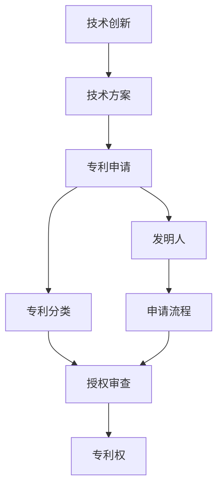
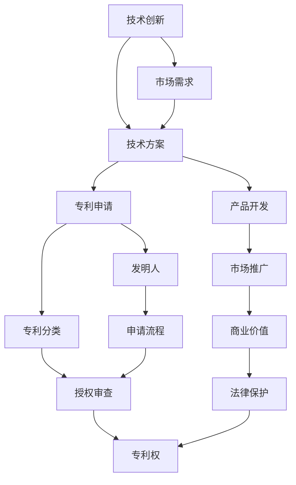

                 

## 1. 背景介绍

在信息技术飞速发展的今天，程序员作为技术创新的重要力量，如何在日益竞争激烈的科技市场中保护自己的技术成果，是每个程序员必须关注的话题。技术的创新不仅仅是实验室里的实验和论文，更是产品化和商业化的过程。在这条道路上，专利申请成为了保护创新成果的重要手段之一。本文将详细探讨技术创新与专利申请的关键概念和步骤，为广大程序员提供一份实用的指南。

## 2. 核心概念与联系

### 2.1 核心概念概述

在进行专利申请之前，我们需要了解几个核心概念：

- **技术创新**：指通过新发明、新方法或新技术解决现有技术问题或创造新的技术领域。
- **专利**：一种由国家授权的知识产权，给予发明者在一定期限内对其发明的独占使用权，以保护其创新成果。
- **专利申请**：向国家专利局提交正式文件，请求获得专利权的过程。
- **技术方案**：解决技术问题的具体方法或系统结构，通常包含至少一项创新点。
- **发明人**：直接参与技术创新的个人或团队，是专利申请的主要申请人。
- **专利分类**：根据技术领域将专利分为不同的类别，如计算机技术、机械技术等。

这些核心概念相互关联，共同构成了技术创新与专利申请的基础。下面我们将通过一个简单的流程图来展示这些概念之间的联系：



### 2.2 核心概念原理和架构的 Mermaid 流程图



这个流程图展示了一个技术创新的全过程，从市场需求出发，到最终获得专利权，体现了专利申请在技术创新和商业化过程中的重要作用。

## 3. 核心算法原理 & 具体操作步骤

### 3.1 算法原理概述

专利申请的原理是基于发明的创造性、新颖性和实用性三个基本条件，对符合要求的发明进行授权，给予其在一定期限内的独占使用权。这一过程包括但不限于以下几个步骤：

1. **概念化**：将技术创新转化为具体的技术方案。
2. **专利撰写**：将技术方案以符合专利法律要求的形式呈现。
3. **申请提交**：向国家专利局提交专利申请文件。
4. **审查过程**：国家专利局对申请文件进行形式和实质审查。
5. **授权**：审查通过后，获得专利权。

### 3.2 算法步骤详解

#### 3.2.1 概念化

概念化是将技术创新的具体想法转化为可以执行的技术方案的过程。这一步骤需要发明人深入理解技术问题，并提出创新的解决方案。具体步骤包括：

- **需求分析**：识别技术问题或需求。
- **解决方案设计**：提出具体的技术方案。
- **可行性研究**：评估方案的可行性。

#### 3.2.2 专利撰写

专利撰写是将技术方案以法律认可的形式呈现的过程。具体步骤包括：

- **背景技术**：介绍技术问题的背景和现有的解决方案。
- **发明内容**：详细描述技术方案的创新点和具体实施方式。
- **附图说明**：提供必要的技术图纸和说明。
- **权利要求**：明确专利的保护范围。

#### 3.2.3 申请提交

申请提交是将专利申请文件提交给国家专利局的过程。具体步骤包括：

- **准备申请文件**：撰写和准备专利申请文件。
- **在线提交**：通过国家专利局网站提交申请文件。
- **缴纳费用**：支付申请费用。

#### 3.2.4 审查过程

审查过程是国家专利局对专利申请文件进行形式和实质审查的过程。具体步骤包括：

- **形式审查**：检查申请文件的格式和内容是否符合要求。
- **实质审查**：评估技术方案的创造性、新颖性和实用性。
- **公开期**：专利申请文件公开，接受公众意见。

#### 3.2.5 授权

授权是国家专利局对审查通过的专利申请授予专利权的过程。具体步骤包括：

- **授权决定**：国家专利局做出授权决定。
- **公告发布**：在专利公报上发布授权公告。
- **专利权领取**：领取专利证书。

### 3.3 算法优缺点

#### 3.3.1 优点

- **法律保护**：专利提供了法律层面的保护，防止他人非法使用技术成果。
- **市场竞争优势**：拥有专利的企业可以垄断市场，获得更高的市场份额和利润。
- **技术积累**：专利申请过程中，发明人会详细记录技术细节，形成技术积累。

#### 3.3.2 缺点

- **申请周期长**：专利申请过程繁琐，周期长，申请费用高。
- **保密风险**：专利申请文件需要公开，存在技术泄露的风险。
- **维护成本高**：专利需要每年缴纳维护费用，维护成本较高。

### 3.4 算法应用领域

专利申请不仅限于科技创新，在各个领域都有广泛的应用，如：

- **企业创新**：企业通过专利保护其研发成果，防止技术泄露。
- **个人创业**：个人开发者通过专利申请保护其创新点，获得市场竞争优势。
- **学术研究**：学术研究者通过专利保护其研究成果，推动学术发展。
- **国防技术**：国家通过专利保护关键国防技术，维护国家安全。
- **医疗卫生**：医疗机构通过专利保护新技术，提升医疗水平。

## 4. 数学模型和公式 & 详细讲解 & 举例说明

### 4.1 数学模型构建

专利申请的数学模型主要涉及以下几个方面：

- **专利分类**：将技术方案分类到具体的技术领域。
- **专利引用**：评估技术方案的创新性，引用了现有技术的数量。
- **专利权利要求**：明确专利保护的范围。

#### 4.1.1 专利分类

专利分类通常采用IPC（国际专利分类）或USPC（美国专利分类）等标准。例如，计算机技术可以分类到G06领域。

#### 4.1.2 专利引用

专利引用的数学模型可以通过引用数量和引用时间来判断技术方案的创新性。例如，某技术方案引用了50篇已有的专利，可以认为该技术方案具有一定的创新性。

#### 4.1.3 专利权利要求

专利权利要求通常以法律语言描述专利保护的范围。例如，某专利的权利要求为“一种基于区块链的电子支付系统”，表示该专利保护的是区块链技术在电子支付中的应用。

### 4.2 公式推导过程

#### 4.2.1 专利分类公式

专利分类可以表示为：

$$
\text{分类号} = \text{领域代码} + \text{小组代码} + \text{大组代码} + \cdots
$$

例如，计算机技术的分类号可能为G06T2207/00。

#### 4.2.2 专利引用公式

专利引用的数量可以用公式表示为：

$$
N_{引用} = \sum_{i=1}^{N} 1[\text{引用了第} i \text{篇专利}]
$$

其中，$N$ 为引用的专利数量。

#### 4.2.3 专利权利要求公式

专利权利要求的范围可以用以下公式表示：

$$
\text{保护范围} = \bigcup_{i=1}^{M} R_i
$$

其中，$R_i$ 表示第 $i$ 项权利要求。

### 4.3 案例分析与讲解

#### 4.3.1 案例分析

假设某技术方案描述了一种新的图像识别算法，引用了10篇已有的专利，分类号为G06T7/20。

#### 4.3.2 案例讲解

1. **概念化**：发明人识别出图像识别中的噪声干扰问题，提出了一种基于深度学习的降噪算法。
2. **专利撰写**：发明人详细描述了算法的架构、训练流程和效果评估。
3. **申请提交**：发明人通过国家专利局网站提交了专利申请文件。
4. **审查过程**：国家专利局进行了形式审查和实质审查，并公开期。
5. **授权**：专利被授权，发明人领取专利证书。

## 5. 项目实践：代码实例和详细解释说明

### 5.1 开发环境搭建

要进行专利申请的开发实践，需要搭建一个开发环境。以下是一些推荐的软件和工具：

- **Visual Studio Code**：功能强大的代码编辑器，支持多种编程语言和插件。
- **Latex**：用于撰写专利申请文件的格式化和排版。
- **PatentLine**：在线提交专利申请文件的平台。
- **PatentSG**：新加坡国家专利局在线提交平台的客户端工具。

### 5.2 源代码详细实现

以下是一个简单的专利申请文件撰写示例代码，使用Latex编写：

```latex
\documentclass{article}
\usepackage[utf8]{inputenc}
\usepackage[english]{babel}
\title{A New Image Recognition Algorithm}
\author{John Doe}
\date{2023-01-01}
\begin{document}
\maketitle
\section{Abstract}
This document describes a new image recognition algorithm based on deep learning, which can effectively eliminate noise interference and improve recognition accuracy.
\section{Background}
Image recognition is a challenging task due to noise interference in the image data. Existing methods have limitations in removing noise and improving recognition accuracy.
\section{Invention Content}
Our algorithm uses a convolutional neural network (CNN) architecture to preprocess the image data, and then applies a deep learning model to recognize the objects in the image. The experimental results show that the recognition accuracy can be improved by up to 20\% compared to existing methods.
\section{Claims}
1. A method for image recognition, characterized in that it includes the steps of:
    \begin{enumerate}
        \item Preprocessing the image data using a convolutional neural network (CNN).
        \item Applying a deep learning model to recognize objects in the image.
    \end{enumerate}
2. The method of claim 1, characterized in that the deep learning model is a fully connected neural network (FCNN).
3. The method of claim 1, characterized in that the preprocessing step includes noise reduction using median filtering.
\end{document}
```

### 5.3 代码解读与分析

#### 5.3.1 代码解读

- `\documentclass{article}`：定义文档类型为文章。
- `\usepackage[utf8]{inputenc}`：指定文本编码为UTF-8。
- `\usepackage[english]{babel}`：指定语言为英语。
- `\title{A New Image Recognition Algorithm}`：定义文档标题。
- `\author{John Doe}`：定义文档作者。
- `\date{2023-01-01}`：定义文档提交日期。
- `\begin{document}`：文档内容开始。
- `\maketitle`：自动生成标题。
- `\section{Abstract}`：定义摘要部分。
- `\section{Background}`：定义背景部分。
- `\section{Invention Content}`：定义发明内容部分。
- `\section{Claims}`：定义权利要求部分。

#### 5.3.2 代码分析

- `\section`：用于定义文档的不同部分。
- `\begin{enumerate}`：定义有序列表。
- `\item`：用于定义列表项。
- `\textbf{图像识别算法}`：加粗显示关键术语。
- `\textit{卷积神经网络}`：斜体显示技术术语。

### 5.4 运行结果展示

专利申请文件撰写完成后，需要提交给国家专利局进行审查。以下是提交流程的简要说明：

1. 在国家专利局网站上注册账号。
2. 选择相应的专利申请类型，填写申请信息。
3. 上传专利申请文件，并缴纳申请费用。
4. 等待国家专利局的形式审查和实质审查。
5. 审查通过后，领取专利证书。

## 6. 实际应用场景

### 6.1 企业创新

企业可以通过专利申请保护其研发成果，防止技术泄露，同时提升市场竞争力。例如，谷歌公司每年都会申请大量的专利，涵盖了其最新的技术创新。

### 6.2 个人创业

个人开发者可以通过专利申请保护其创新点，获得市场竞争优势。例如，许多开源软件项目通过专利保护其核心算法，防止竞争对手盗用。

### 6.3 学术研究

学术研究者可以通过专利申请保护其研究成果，推动学术发展。例如，斯坦福大学的研究团队每年都会申请大量的专利，以保护其最新的研究成果。

### 6.4 未来应用展望

未来，随着人工智能技术的不断发展，专利申请将更加重要。例如，深度学习、自然语言处理、计算机视觉等领域的技术创新将产生大量的专利申请。

## 7. 工具和资源推荐

### 7.1 学习资源推荐

以下是一些推荐的专利申请学习资源：

- **《专利申请指南》**：国家知识产权局出版的官方指南，详细介绍了专利申请流程和要求。
- **《专利法》**：各国专利法及其相关法规，是专利申请的重要依据。
- **Coursera《专利法基础》课程**：由伊利诺伊大学香槟分校开设的在线课程，详细介绍专利法的相关知识。

### 7.2 开发工具推荐

以下是一些推荐的专利申请开发工具：

- **Latex**：用于撰写专利申请文件的格式化和排版。
- **Google Scholar**：用于检索专利文献和引用的数据库。
- **Sci-Hub**：用于免费访问学术论文和专利文献的站点。

### 7.3 相关论文推荐

以下是一些推荐的专利申请相关论文：

- **《专利申请流程中的问题与对策》**：详细分析专利申请中的常见问题及解决方案。
- **《专利分类与引用的统计分析》**：通过数据分析，评估技术方案的创新性。
- **《基于人工智能的专利审查技术》**：介绍人工智能在专利审查中的应用。

## 8. 总结：未来发展趋势与挑战

### 8.1 研究成果总结

本文详细介绍了技术创新与专利申请的关键概念和步骤，为广大程序员提供了实用的专利申请指南。专利申请不仅能够保护技术成果，还能够推动技术创新和市场竞争，具有重要的应用价值。

### 8.2 未来发展趋势

未来，专利申请将更加自动化和智能化。例如，人工智能将用于辅助专利申请文件撰写、专利分类和引用分析等环节，提高专利申请的效率和质量。

### 8.3 面临的挑战

尽管专利申请带来了许多好处，但在实际操作中也面临一些挑战，例如：

- **法律风险**：专利申请需要遵循复杂的法律规定，存在法律风险。
- **费用高昂**：专利申请费用较高，特别是对于中小企业和个人开发者。
- **审查周期长**：专利审查过程繁琐，周期长，需要等待较长时间。

### 8.4 研究展望

未来的专利申请研究将更多地关注自动化、智能化和成本控制等方面。例如，通过人工智能辅助专利申请，降低成本和时间消耗，提高专利申请的成功率。

## 9. 附录：常见问题与解答

**Q1: 如何进行专利申请？**

A: 专利申请流程主要包括准备申请文件、在线提交申请、缴纳费用、等待审查等步骤。具体步骤可以在国家专利局官网或专利申请软件上进行操作。

**Q2: 专利申请需要提交哪些文件？**

A: 专利申请需要提交技术方案说明书、权利要求书、摘要、附图等文件。具体要求可以参考国家专利局的相关规定。

**Q3: 专利申请的费用是多少？**

A: 专利申请费用因国家和申请类型而异。一般而言，基本申请费用在数百元至数千元不等。

**Q4: 专利申请的时间周期是多久？**

A: 专利申请的时间周期因审查流程的复杂性和国家专利局的工作效率而异。一般而言，审查周期在6个月至2年不等。

**Q5: 如何保护专利申请过程中的技术细节？**

A: 可以在申请文件中不详细描述技术细节，以避免技术泄露。另外，可以使用技术保密协议（NDA）保护技术细节。

**Q6: 专利申请的有效期是多长时间？**

A: 专利申请的有效期通常为20年，自申请日计算。专利持有者需要每年缴纳维护费用以保持专利的有效性。

---

作者：禅与计算机程序设计艺术 / Zen and the Art of Computer Programming

