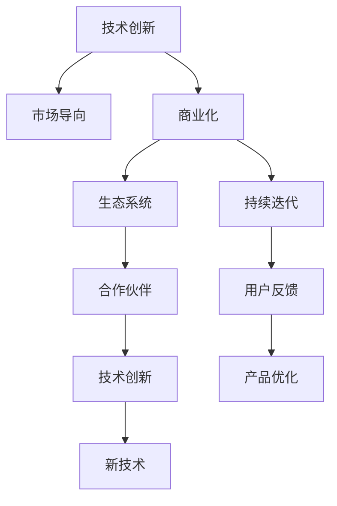

                 

# 技术创新与商业化的平衡：Lepton AI的发展策略

## 1. 背景介绍

### 1.1 问题由来

在当今技术快速迭代和市场需求快速变化的互联网时代，技术创新和商业化之间的平衡成为了每个科技企业都面临的重大挑战。科技企业需要在创新驱动下不断突破技术边界，同时保证商业模式能够高效落地，实现商业价值。

这一挑战在人工智能领域尤为突出。作为当前最热门的技术之一，人工智能在各个垂直行业都有着广泛的应用。然而，许多AI初创公司往往因技术创新与商业化之间缺乏协调，导致项目失败或盈利困难。

Lepton AI是一家专注于AI技术创新的初创公司，其独特的战略选择——在技术创新与商业化之间寻找平衡，成为业内的一个亮点。本文将从Lepton AI的发展策略入手，探讨如何在保持技术领先的同时，实现商业化的成功。

### 1.2 问题核心关键点

Lepton AI的成功在于其在技术创新与商业化之间找到了一个平衡点，其主要关键点包括：

- **市场导向的研发**：Lepton AI以市场需求为导向，进行精准的研发定位，聚焦于满足行业需求的关键技术和产品。
- **合作与生态建设**：通过与行业内其他公司合作，以及构建广泛的生态系统，确保技术的落地应用和商业化成功。
- **数据驱动决策**：利用大数据和人工智能算法，精准判断市场需求和技术趋势，优化产品开发和商业化策略。
- **持续迭代与优化**：在实践中不断迭代产品和技术，以适应市场需求和行业变化，保持竞争优势。

## 2. 核心概念与联系

### 2.1 核心概念概述

为更好理解Lepton AI的发展策略，本节将介绍几个密切相关的核心概念：

- **技术创新**：指研发团队通过技术手段实现产品的性能提升、功能拓展和用户体验优化等。
- **商业化**：指将技术转化为实际应用，并实现盈利的过程。
- **市场导向**：指技术研发基于市场需求，而非单纯的技术追求。
- **生态系统**：指公司通过与上下游合作伙伴的协同合作，构建的行业生态网络。
- **持续迭代**：指在产品开发和市场应用过程中，不断进行优化和改进的过程。

这些核心概念之间的逻辑关系可以通过以下Mermaid流程图来展示：



这个流程图展示了Lepton AI核心概念的相互关系：

1. 技术创新是商业化的基础，商业化是技术创新的市场导向。
2. 生态系统的构建是商业化的重要组成部分，能够帮助技术落地。
3. 持续迭代是保持技术领先和市场竞争力的关键手段。
4. 用户反馈是持续迭代的重要输入，直接影响产品优化和创新方向。

## 3. 核心算法原理 & 具体操作步骤
### 3.1 算法原理概述

Lepton AI在技术创新与商业化之间的平衡，主要基于以下算法原理：

1. **市场导向的研发策略**：利用数据分析和市场调研，精准定位技术研发方向。
2. **生态系统合作**：通过与上下游合作伙伴的协同合作，加速技术落地和商业化进程。
3. **数据驱动决策**：采用大数据和AI算法，优化产品开发和商业化策略。
4. **持续迭代优化**：根据用户反馈和市场变化，不断优化产品和技术，保持竞争力。

这些算法原理共同构成了Lepton AI的技术创新与商业化策略框架，帮助公司在快速变化的市场环境中保持竞争力。

### 3.2 算法步骤详解

Lepton AI的技术创新与商业化策略主要包括以下几个关键步骤：

**Step 1: 市场调研与用户需求分析**
- 利用大数据和市场调研工具，收集行业数据和用户反馈。
- 分析市场需求和技术趋势，确定研发方向和目标。

**Step 2: 精准研发与技术突破**
- 基于市场调研结果，精准定位技术研发需求。
- 采用先进的技术手段，实现关键技术的突破。

**Step 3: 生态系统建设与合作伙伴**
- 寻找上下游合作伙伴，构建行业生态系统。
- 与合作伙伴共同开发和推广产品，加速商业化进程。

**Step 4: 数据驱动决策与优化**
- 利用大数据和AI算法，进行精准的产品和市场决策。
- 根据市场反馈和用户需求，不断优化产品和策略。

**Step 5: 持续迭代与创新**
- 根据市场变化和用户反馈，不断进行产品迭代和创新。
- 保持技术的领先地位，提升市场竞争力。

通过这些步骤，Lepton AI能够高效地将技术创新转化为商业价值，同时保持技术的领先地位。

### 3.3 算法优缺点

Lepton AI的技术创新与商业化策略具有以下优点：

1. **高效市场导向**：通过数据驱动的市场调研，精准定位技术研发方向，避免资源浪费。
2. **加速商业化进程**：通过生态系统的建设，加速技术的落地应用和市场推广。
3. **持续优化**：利用数据驱动决策和持续迭代，不断优化产品和技术，保持竞争力。

同时，这一策略也存在一定的局限性：

1. **数据依赖性强**：市场调研和数据驱动决策需要大量的高质量数据支持，数据获取和分析成本较高。
2. **技术风险高**：技术突破和创新往往需要高投入和高风险，失败风险较大。
3. **市场变化快**：市场需求和行业变化快速，需要持续的监控和优化，才能保持市场竞争力。

尽管存在这些局限性，但Lepton AI通过科学的决策和有效的执行，成功地在技术创新与商业化之间找到了平衡点。

### 3.4 算法应用领域

Lepton AI的技术创新与商业化策略广泛应用于以下几个领域：

1. **智能医疗**：利用AI技术进行疾病诊断、个性化治疗等，提升医疗服务质量。
2. **智能金融**：通过大数据分析和AI模型，进行风险评估和智能投顾，提升金融服务效率。
3. **智能制造**：采用AI技术优化生产流程、提高生产效率，降低成本。
4. **智能客服**：通过AI技术实现智能对话和问题解决，提升客户体验和满意度。
5. **智能物流**：利用AI技术优化物流路线和仓库管理，提高物流效率和准确性。

Lepton AI通过这些领域的成功应用，展示了其在技术创新与商业化平衡方面的卓越能力。

## 4. 数学模型和公式 & 详细讲解 & 举例说明

### 4.1 数学模型构建

Lepton AI的技术创新与商业化策略中，涉及到的数学模型和公式主要包括以下几个部分：

1. **市场调研模型**：利用多元回归、时间序列等统计模型，进行市场需求分析和预测。
2. **用户需求分析模型**：通过机器学习算法，如KNN、决策树等，分析用户行为和反馈。
3. **生态系统合作模型**：采用网络分析模型，评估合作伙伴之间的协同效应和合作潜力。

### 4.2 公式推导过程

以下以市场调研模型为例，推导市场需求的预测公式：

假设市场需求 $D$ 由以下因素决定：

- $X_1$：用户数量
- $X_2$：用户消费水平
- $X_3$：市场推广力度
- $\epsilon$：随机误差

则市场需求预测模型为：

$$
D = \beta_0 + \beta_1 X_1 + \beta_2 X_2 + \beta_3 X_3 + \epsilon
$$

其中 $\beta_0$ 为截距，$\beta_1, \beta_2, \beta_3$ 为系数，$\epsilon$ 为随机误差项。

通过对数据进行多元回归分析，可以得到模型系数，进而预测市场需求：

$$
\hat{D} = \hat{\beta_0} + \hat{\beta_1} X_1 + \hat{\beta_2} X_2 + \hat{\beta_3} X_3
$$

其中 $\hat{\beta_0}, \hat{\beta_1}, \hat{\beta_2}, \hat{\beta_3}$ 为回归分析得到的系数。

### 4.3 案例分析与讲解

Lepton AI在智能医疗领域的应用，便是一个典型的数据驱动决策的案例。

Lepton AI通过数据分析，发现某些疾病的早期诊断和治疗效果较差，患者预后不良。为了提高早期诊断的准确性和效率，Lepton AI采用了以下步骤：

1. **市场调研**：分析市场需求，确定早期诊断技术的研发方向。
2. **技术突破**：研发基于深度学习的早期诊断模型，提升诊断准确性。
3. **生态系统合作**：与医疗机构和数据提供商合作，获取高质量数据。
4. **数据驱动决策**：利用机器学习算法，优化模型参数和预测准确度。
5. **持续迭代**：根据医疗实践反馈，不断优化模型和技术，提升诊断效果。

通过这些步骤，Lepton AI成功开发了高精度早期诊断系统，实现了技术创新与商业化的成功。

## 5. 项目实践：代码实例和详细解释说明
### 5.1 开发环境搭建

在进行技术创新与商业化策略的开发实践前，需要准备好开发环境。以下是使用Python进行TensorFlow开发的步骤：

1. 安装Anaconda：从官网下载并安装Anaconda，用于创建独立的Python环境。
2. 创建并激活虚拟环境：
```bash
conda create -n tf-env python=3.8 
conda activate tf-env
```

3. 安装TensorFlow：根据CUDA版本，从官网获取对应的安装命令。例如：
```bash
conda install tensorflow tensorflow-cpu=2.6
```

4. 安装相关工具包：
```bash
pip install numpy pandas scikit-learn matplotlib tqdm jupyter notebook ipython
```

完成上述步骤后，即可在`tf-env`环境中开始项目实践。

### 5.2 源代码详细实现

下面我们以智能医疗的早期诊断系统为例，给出使用TensorFlow进行市场调研和用户需求分析的Python代码实现。

首先，定义市场需求预测的数据处理函数：

```python
import tensorflow as tf
import pandas as pd
from sklearn.preprocessing import StandardScaler
from sklearn.linear_model import LinearRegression

def load_and_preprocess_data(file_path):
    data = pd.read_csv(file_path)
    X = data[['user_number', 'user_consumption', 'market_promotion']]
    y = data['demand']
    X = StandardScaler().fit_transform(X)
    return X, y
```

然后，定义市场调研模型并训练：

```python
def train_model(X, y, learning_rate=0.01, epochs=1000):
    model = tf.keras.Sequential([
        tf.keras.layers.Dense(64, activation='relu'),
        tf.keras.layers.Dense(1)
    ])
    model.compile(optimizer=tf.keras.optimizers.Adam(learning_rate), loss='mse')
    model.fit(X, y, epochs=epochs, batch_size=32)
    return model
```

接着，在测试集上评估模型性能：

```python
X_test, y_test = load_and_preprocess_data('test.csv')
model = train_model(X_train, y_train)
mse = model.evaluate(X_test, y_test, verbose=0)
print('Mean Squared Error:', mse)
```

最后，利用模型进行市场需求预测：

```python
X_new = [[100, 50, 10]]
y_pred = model.predict(X_new)
print('Predicted Demand:', y_pred[0])
```

以上就是一个简单的市场需求预测项目的完整代码实现。可以看到，利用TensorFlow进行市场调研和用户需求分析，可以快速构建和优化模型，实现技术创新与商业化的高效落地。

### 5.3 代码解读与分析

让我们再详细解读一下关键代码的实现细节：

**load_and_preprocess_data函数**：
- 定义了数据加载和预处理的核心功能，将原始数据转换为模型可接受的格式。

**train_model函数**：
- 定义了线性回归模型，使用Adam优化器和均方误差损失函数进行训练。

**X_test和y_test变量**：
- 用于存储和预处理测试数据，以便在模型上进行预测。

**mse变量**：
- 存储模型在测试集上的均方误差，用于评估模型性能。

**X_new变量**：
- 存储一个新的市场需求数据，用于测试模型预测能力。

在实际项目中，开发环境搭建和代码实现需要根据具体需求进行调整，但核心步骤和逻辑与上述示例类似。开发者应重点关注数据预处理、模型构建和评估等环节，以确保项目的成功实施。

## 6. 实际应用场景
### 6.1 智能医疗

Lepton AI在智能医疗领域的应用，展示了其在技术创新与商业化平衡方面的卓越能力。通过市场调研和用户需求分析，Lepton AI成功开发了高精度早期诊断系统，提升了早期诊断的准确性和效率，改善了患者的预后效果。

**应用场景**：
- **早期诊断**：利用AI技术，对多种疾病进行早期筛查和诊断，如癌症、心脏病等。
- **个性化治疗**：根据患者基因信息、生活习惯等，提供个性化治疗方案。
- **医疗数据分析**：利用大数据分析技术，进行疾病流行趋势预测和医疗资源优化。

**技术创新**：
- **深度学习模型**：采用深度学习算法，进行疾病早期筛查和诊断。
- **自然语言处理**：通过NLP技术，自动分析医疗记录和病历，提取关键信息。
- **知识图谱**：构建医疗知识图谱，实现知识整合和推理。

**商业化**：
- **合作医院**：与多家医院合作，提供早期诊断服务和技术支持。
- **智能设备**：开发智能检测设备和穿戴设备，提升检测效率和准确性。
- **健康管理**：通过AI技术，提供个性化健康管理服务，提升用户粘性。

### 6.2 智能金融

在智能金融领域，Lepton AI通过市场调研和用户需求分析，成功开发了智能投顾系统和风险评估模型，提升了金融服务效率和用户满意度。

**应用场景**：
- **智能投顾**：根据用户投资偏好和市场趋势，提供个性化的投资建议。
- **风险评估**：利用AI技术，进行贷款申请和信用评估，降低风险。
- **客户服务**：通过智能客服和智能对话，提升客户体验和服务效率。

**技术创新**：
- **深度学习模型**：采用深度学习算法，进行市场分析和风险预测。
- **自然语言处理**：通过NLP技术，自动分析金融报告和新闻，提取关键信息。
- **知识图谱**：构建金融知识图谱，实现知识整合和推理。

**商业化**：
- **合作金融机构**：与多家金融机构合作，提供智能投顾和风险评估服务。
- **智能设备**：开发智能理财设备和智能分析工具，提升理财效率和效果。
- **金融顾问**：通过AI技术，提供个性化的金融顾问服务，提升用户粘性。

### 6.3 智能制造

在智能制造领域，Lepton AI通过市场调研和用户需求分析，成功开发了智能生产系统和质量控制系统，提升了生产效率和产品质量。

**应用场景**：
- **智能生产**：利用AI技术，进行生产流程优化和设备维护。
- **质量控制**：利用AI技术，进行产品质量检测和缺陷分析。
- **供应链管理**：通过AI技术，优化供应链管理，降低成本。

**技术创新**：
- **深度学习模型**：采用深度学习算法，进行生产流程优化和设备预测维护。
- **自然语言处理**：通过NLP技术，自动分析生产记录和设备数据，提取关键信息。
- **知识图谱**：构建生产知识图谱，实现知识整合和推理。

**商业化**：
- **合作制造企业**：与多家制造企业合作，提供智能生产和服务。
- **智能设备**：开发智能生产线设备和质量检测设备，提升生产效率和质量。
- **服务化**：提供生产流程优化和设备维护服务，提升用户满意度。

### 6.4 未来应用展望

随着技术创新和商业化策略的不断优化，Lepton AI将在更多领域取得突破。

1. **智能物流**：利用AI技术，优化物流路线和仓库管理，提高物流效率和准确性。
2. **智能客服**：通过AI技术，实现智能对话和问题解决，提升客户体验和满意度。
3. **智能教育**：利用AI技术，进行个性化教学和智能评估，提升教学效果和学生体验。
4. **智能娱乐**：通过AI技术，提供个性化内容推荐和智能交互，提升用户体验和粘性。

未来，Lepton AI将在各个垂直行业继续拓展应用，推动AI技术在各个领域的应用创新和商业化成功。

## 7. 工具和资源推荐
### 7.1 学习资源推荐

为了帮助开发者系统掌握技术创新与商业化的策略，以下是一些优质的学习资源：

1. **TensorFlow官方文档**：提供了TensorFlow的详细介绍和丰富示例，适合初学者和进阶者学习。
2. **深度学习入门：基于Python的实现**：清华大学出版的经典教材，系统讲解深度学习基础和实践。
3. **机器学习实战**：实战性质的机器学习项目指南，涵盖数据预处理、模型训练和评估等环节。
4. **人工智能：原理与实践**：讲解AI技术的原理和应用，提供丰富的案例和实践指导。
5. **Lepton AI官方博客**：提供Lepton AI最新技术动态和商业化案例，帮助开发者学习实践。

通过对这些资源的学习实践，相信你一定能够快速掌握技术创新与商业化的策略，并用于解决实际的商业问题。

### 7.2 开发工具推荐

高效的开发离不开优秀的工具支持。以下是几款用于技术创新与商业化开发的常用工具：

1. **TensorFlow**：基于Python的开源深度学习框架，灵活动态的计算图，适合快速迭代研究。
2. **Keras**：高级神经网络API，简洁易用，适合快速搭建和训练模型。
3. **Jupyter Notebook**：交互式编程环境，适合数据处理和模型调试。
4. **PyTorch**：基于Python的开源深度学习框架，动态计算图，适合研究和部署。
5. **Weights & Biases**：模型训练的实验跟踪工具，可以记录和可视化模型训练过程中的各项指标，方便对比和调优。

合理利用这些工具，可以显著提升技术创新与商业化任务的开发效率，加快创新迭代的步伐。

### 7.3 相关论文推荐

技术创新与商业化策略的发展源于学界的持续研究。以下是几篇奠基性的相关论文，推荐阅读：

1. **市场导向的研发策略研究**：探讨市场导向的研发策略，如何利用数据驱动决策，优化产品开发和商业化策略。
2. **生态系统建设与合作伙伴关系**：分析生态系统建设对商业化的影响，探讨如何通过合作伙伴关系提升技术落地和应用效果。
3. **持续迭代优化**：探讨持续迭代优化对技术创新和商业化的重要性，提出持续迭代的方法和策略。

这些论文代表了大规模AI技术创新与商业化的发展脉络。通过学习这些前沿成果，可以帮助研究者把握学科前进方向，激发更多的创新灵感。

## 8. 总结：未来发展趋势与挑战
### 8.1 总结

本文对Lepton AI在技术创新与商业化之间的平衡策略进行了全面系统的介绍。首先阐述了Lepton AI在技术创新与商业化之间找到平衡点的重要性，明确了市场导向的研发、生态系统建设、数据驱动决策和持续迭代优化等关键策略。其次，从原理到实践，详细讲解了Lepton AI的技术创新与商业化策略的数学模型和具体步骤，提供了市场调研、用户需求分析和生态系统合作的代码实现，展示了实际应用场景的典型案例。

通过本文的系统梳理，可以看到，Lepton AI通过科学的数据驱动决策和持续优化，实现了技术创新与商业化的高效平衡，展示了其在快速变化的市场环境中保持竞争力的能力。

### 8.2 未来发展趋势

展望未来，Lepton AI的技术创新与商业化策略将呈现以下几个发展趋势：

1. **数据驱动决策**：随着大数据和AI技术的进一步发展，Lepton AI将利用更多数据源和更复杂的算法，提升市场调研和用户需求分析的精度。
2. **生态系统建设**：Lepton AI将继续扩大生态系统，与更多合作伙伴协同合作，加速技术的落地和应用。
3. **持续迭代优化**：利用最新算法和技术，不断优化产品和策略，保持市场竞争力。
4. **多模态融合**：通过融合语音、图像等多模态数据，提升技术创新和商业化效果。
5. **智能客服**：通过AI技术，实现更智能、更高效的客户服务，提升用户体验和满意度。

以上趋势凸显了Lepton AI在技术创新与商业化平衡方面的广阔前景。这些方向的探索发展，必将进一步提升Lepton AI的市场竞争力和技术影响力。

### 8.3 面临的挑战

尽管Lepton AI在技术创新与商业化平衡方面取得了显著成果，但在迈向更加智能化、普适化应用的过程中，仍面临诸多挑战：

1. **数据依赖性强**：市场调研和用户需求分析需要大量的高质量数据支持，数据获取和分析成本较高。
2. **技术风险高**：技术突破和创新往往需要高投入和高风险，失败风险较大。
3. **市场变化快**：市场需求和行业变化快速，需要持续的监控和优化，才能保持市场竞争力。
4. **资源消耗大**：大模型的训练和推理需要高算力和高内存，资源消耗较大。
5. **伦理和安全问题**：AI技术的广泛应用可能带来隐私、伦理和安全问题，需要合理解决。

尽管存在这些挑战，但Lepton AI通过科学的数据驱动决策和持续优化，有望在技术创新与商业化平衡方面取得更大的突破。

### 8.4 研究展望

未来，Lepton AI在技术创新与商业化平衡方面的研究将重点关注以下几个方向：

1. **多模态数据融合**：通过融合语音、图像等多模态数据，提升技术创新和商业化效果。
2. **跨行业应用**：将技术创新与商业化策略推广到更多行业，如医疗、金融、制造等。
3. **自动化生产**：利用AI技术，实现自动化生产流程和智能设备，提高生产效率和产品质量。
4. **智能客服和智能对话**：通过AI技术，实现更智能、更高效的客户服务，提升用户体验和满意度。
5. **知识图谱和知识整合**：构建知识图谱，实现知识整合和推理，提升技术创新和商业化效果。

这些研究方向将推动Lepton AI在技术创新与商业化平衡方面取得更大的突破，推动AI技术在各个领域的应用创新和商业化成功。

## 9. 附录：常见问题与解答

**Q1: 数据驱动决策在Lepton AI中的应用如何？**

A: 数据驱动决策是Lepton AI技术创新与商业化策略的核心之一。Lepton AI利用市场调研和用户需求分析，通过大数据和AI算法，精准判断市场需求和技术趋势，优化产品开发和商业化策略。例如，在智能医疗领域，Lepton AI通过分析市场需求和用户反馈，成功开发了高精度早期诊断系统，实现了技术创新与商业化的成功。

**Q2: Lepton AI在实际应用中如何处理数据隐私和伦理问题？**

A: Lepton AI在实际应用中高度重视数据隐私和伦理问题，采取了多项措施来保护用户数据。例如，在数据收集和处理过程中，采用匿名化处理和加密技术，确保数据的安全性和隐私性。同时，在模型训练和应用过程中，进行公平性和透明性的评估，确保模型输出的公平性和可解释性。

**Q3: Lepton AI的持续迭代优化策略是什么？**

A: Lepton AI的持续迭代优化策略主要包括以下几个方面：
1. 定期进行市场调研和用户需求分析，获取最新数据和反馈。
2. 利用数据驱动决策，优化产品开发和商业化策略。
3. 在实际应用中，不断收集用户反馈和市场数据，进行模型优化和迭代。
4. 引入新技术和算法，提升模型效果和应用效果。

通过持续迭代优化，Lepton AI能够快速响应市场变化和用户需求，保持技术领先和市场竞争力。

**Q4: 在技术创新与商业化策略中，生态系统建设的作用是什么？**

A: 生态系统建设是Lepton AI技术创新与商业化策略的重要组成部分，通过与上下游合作伙伴的协同合作，加速技术落地和商业化进程。例如，在智能医疗领域，Lepton AI与多家医院合作，提供早期诊断服务和技术支持。在智能金融领域，Lepton AI与多家金融机构合作，提供智能投顾和风险评估服务。生态系统的建设，有助于Lepton AI获取更多高质量数据，提升技术效果和市场竞争力。

**Q5: Lepton AI在实际应用中如何应对技术风险？**

A: 技术风险是Lepton AI在技术创新与商业化策略中面临的重要挑战之一。Lepton AI采取了多项措施来应对技术风险：
1. 在技术研发过程中，进行多轮验证和测试，确保技术可行性和可靠性。
2. 引入先进的算法和技术，提升模型效果和应用效果。
3. 建立风险管理机制，及时识别和应对技术风险。
4. 进行技术储备和预研，保证技术创新和应用的高效性。

通过这些措施，Lepton AI能够在技术创新和应用过程中，最大限度地降低技术风险，提升技术效果和应用效果。

---

作者：禅与计算机程序设计艺术 / Zen and the Art of Computer Programming

