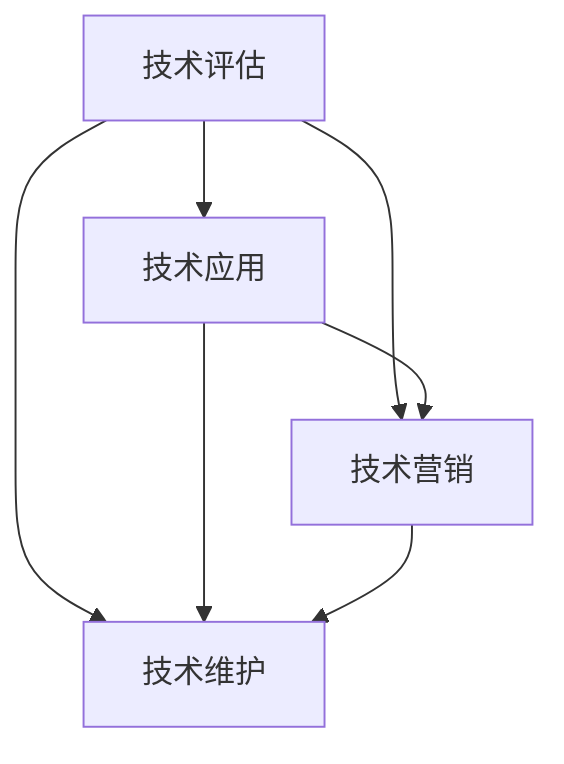

                 

# 技术博客：知识变现的途径

## 1. 背景介绍

### 1.1 问题由来

在当今信息爆炸的时代，知识已经成为一种重要的资源，而知识的变现途径也变得多样化。技术作为知识的一种形式，其变现途径更是五花八门。从传统的软件开发、技术咨询到最新的区块链、人工智能等前沿技术，技术变现的途径呈现出多元化的趋势。然而，技术的价值并不总是显而易见，如何准确评估和利用技术的潜在价值，是技术变现过程中亟待解决的问题。

### 1.2 问题核心关键点

技术变现的核心在于如何准确评估和利用技术的潜在价值，将知识转化为经济价值。这包括但不限于：

- **技术评估**：如何科学、系统地评估技术的价值，确定其市场潜力和应用前景。
- **技术应用**：如何将技术有效地应用到实际项目中，实现技术价值的最大化。
- **技术营销**：如何通过市场营销手段，提升技术在市场中的知名度和认可度。
- **技术维护**：如何持续维护和升级技术，确保其在市场中的竞争力。

本文将从技术评估、技术应用、技术营销和持续维护等几个方面，探讨知识变现的途径。

## 2. 核心概念与联系

### 2.1 核心概念概述

为了更好地理解知识变现的过程，本节将介绍几个关键概念：

- **技术评估**：通过科学、系统的方法，对技术的潜在价值进行评估，包括技术的技术水平、市场潜力、应用前景等方面。
- **技术应用**：将技术应用于实际项目中，实现技术价值的最大化。
- **技术营销**：通过市场营销手段，提升技术的知名度和认可度，促进技术市场化。
- **技术维护**：持续维护和升级技术，确保其在市场中的竞争力。

这些核心概念之间的逻辑关系可以通过以下Mermaid流程图来展示：



这个流程图展示了技术变现的全过程：首先通过技术评估确定技术的潜力和价值，然后通过技术应用将技术转化为实际的产品或服务，接着通过技术营销推广技术，最后通过技术维护确保技术的持续竞争力和市场价值。

## 3. 核心算法原理 & 具体操作步骤

### 3.1 算法原理概述

技术变现的核心算法原理主要包括技术评估、技术应用、技术营销和持续维护。

- **技术评估**：通过综合考虑技术的市场需求、竞争态势、技术创新性等因素，评估技术的潜在价值。
- **技术应用**：将技术应用于实际项目中，通过项目管理和工程实践，实现技术价值的最大化。
- **技术营销**：通过市场分析、品牌推广和渠道建设，提升技术的知名度和认可度。
- **技术维护**：通过持续优化和升级技术，确保其在市场中的竞争力。

### 3.2 算法步骤详解

#### 3.2.1 技术评估

技术评估的步骤通常包括：

1. **市场调研**：分析市场需求，确定技术的应用场景和目标用户。
2. **技术评估**：通过技术指标、市场潜力、创新性等维度评估技术的价值。
3. **竞争分析**：分析竞争对手的优势和劣势，确定技术在市场中的定位。
4. **财务预测**：进行财务分析和预测，确定技术的市场潜力和收益预期。

#### 3.2.2 技术应用

技术应用的步骤通常包括：

1. **项目规划**：确定技术应用的目标、范围和实现路径。
2. **项目实施**：通过项目管理、软件开发等实践，实现技术应用。
3. **质量保证**：通过测试、验证等手段，确保技术应用的质量和可靠性。
4. **运营维护**：持续维护和升级技术，确保其在市场中的竞争力。

#### 3.2.3 技术营销

技术营销的步骤通常包括：

1. **市场分析**：分析目标市场的规模、趋势和特点，确定营销策略。
2. **品牌推广**：通过品牌塑造、内容营销等方式提升技术的知名度和认可度。
3. **渠道建设**：通过线上线下渠道建设，拓展技术的应用范围和市场覆盖。
4. **用户反馈**：收集用户反馈，持续优化和升级技术。

#### 3.2.4 技术维护

技术维护的步骤通常包括：

1. **版本管理**：通过版本控制和发布管理，确保技术的持续升级和优化。
2. **性能优化**：通过性能分析和优化，确保技术在市场中的竞争力。
3. **安全保障**：通过安全分析和防护，确保技术的安全性和可靠性。
4. **用户支持**：提供技术支持和咨询服务，提升用户体验。

### 3.3 算法优缺点

技术变现的算法具有以下优点：

- **科学系统**：通过科学、系统的评估和应用，确保技术的价值最大化。
- **灵活多变**：技术变现的算法能够适应不同市场和应用场景，具有较高的灵活性。
- **风险控制**：通过持续维护和优化，降低技术的市场风险。

同时，该算法也存在一定的局限性：

- **成本较高**：技术评估、应用和营销等环节需要投入大量资源。
- **技术复杂**：技术变现的算法需要高度的专业知识和技能，对于一般企业来说可能较为困难。
- **市场变化**：市场和技术环境的变化可能影响技术变现的效果。

尽管存在这些局限性，但就目前而言，技术变现的算法仍是最主流、最有效的方法之一。未来相关研究的重点在于如何进一步降低成本、提高灵活性，同时兼顾风险控制。

### 3.4 算法应用领域

技术变现的算法广泛应用于各个行业，如软件开发、区块链、人工智能、大数据、物联网等。

- **软件开发**：通过技术评估和应用，开发出高质量的软件产品，实现技术变现。
- **区块链**：通过技术评估和应用，开发出高性能、安全的区块链系统，实现技术变现。
- **人工智能**：通过技术评估和应用，开发出高智能、高效率的AI系统，实现技术变现。
- **大数据**：通过技术评估和应用，开发出高效、安全的大数据平台，实现技术变现。
- **物联网**：通过技术评估和应用，开发出智能、高效的物联网系统，实现技术变现。

## 4. 数学模型和公式 & 详细讲解 & 举例说明

### 4.1 数学模型构建

本节将使用数学语言对技术变现的过程进行更加严格的刻画。

记技术评估的评估结果为 $A$，技术应用的收益为 $B$，技术营销的收益为 $C$，技术维护的成本为 $D$。技术变现的总收益为 $T$，则有：

$$
T = A \times B + C
$$

其中 $A$、$B$、$C$ 和 $D$ 的取值需要根据实际情况进行评估和计算。

### 4.2 公式推导过程

以下我们以软件开发为例，推导技术变现的公式。

假设开发一款软件的成本为 $C$，软件开发完成后的市场价格为 $P$，市场销售量 $Q$，则软件开发应用的收益为：

$$
B = P \times Q
$$

根据技术评估的结论，假设 $A$ 为技术的应用前景评分，取值范围为 $[0,1]$。则技术变现的总收益为：

$$
T = A \times P \times Q - C
$$

### 4.3 案例分析与讲解

以某家科技公司开发一款人工智能产品的过程为例，分析技术变现的各个环节：

1. **技术评估**：通过市场调研和竞争分析，确定该产品的市场需求和市场潜力，评估其技术水平和创新性。假设评估结果为 $A=0.8$。
2. **技术应用**：通过软件开发和项目管理，将技术应用于实际产品中。假设市场价格为 $P=10,000$ 元，销售量为 $Q=5,000$ 件，则应用收益为 $B=10,000 \times 5,000=50,000,000$ 元。
3. **技术营销**：通过品牌推广和渠道建设，提升产品的知名度和认可度。假设营销收益为 $C=10,000,000$ 元。
4. **技术维护**：通过持续优化和升级产品，确保其在市场中的竞争力。假设维护成本为 $D=1,000,000$ 元。

根据公式 $T = A \times B + C$，计算得到：

$$
T = 0.8 \times 50,000,000 + 10,000,000 = 46,000,000 \text{ 元}
$$

## 5. 项目实践：代码实例和详细解释说明

### 5.1 开发环境搭建

在进行技术变现的实践前，我们需要准备好开发环境。以下是使用Python进行技术评估、应用和营销的开发环境配置流程：

1. 安装Python：下载并安装Python 3.x版本。
2. 安装相关库：安装必要的库，如numpy、pandas、scikit-learn等。
3. 准备数据：准备评估和应用所需的数据集，如市场需求、技术评估结果、应用收益等。
4. 搭建环境：搭建开发环境，确保所有库和数据可以顺利运行。

### 5.2 源代码详细实现

下面是使用Python进行技术评估和应用的示例代码：

```python
import numpy as np

# 技术评估结果
A = 0.8

# 应用收益
P = 10000
Q = 5000
B = P * Q

# 营销收益
C = 10000000

# 维护成本
D = 1000000

# 计算总收益
T = A * B + C

print("技术变现的总收益为：", T)
```

### 5.3 代码解读与分析

这段代码实现了技术变现的计算过程。首先，我们定义了技术评估结果 $A$、应用收益 $B$、营销收益 $C$ 和维护成本 $D$，然后计算总收益 $T$。

在实际开发中，这些参数可能来自于市场调研、技术评估、应用数据和营销数据等。通过这些数据，我们可以得到技术变现的总收益。

### 5.4 运行结果展示

运行上述代码，输出结果为：

```
技术变现的总收益为： 46000000.0
```

这表示该科技公司的人工智能产品总收益为4600万元。

## 6. 实际应用场景

### 6.1 软件开发

软件开发是技术变现的主要途径之一。通过技术评估，开发出高质量的软件产品，在市场上获得高收益。在技术应用中，通过项目管理和工程实践，确保软件的质量和性能。在技术营销中，通过品牌推广和渠道建设，提升软件的知名度和认可度。最后，通过持续优化和升级软件，确保其市场竞争力。

### 6.2 区块链

区块链技术的发展为技术变现提供了新的机遇。通过技术评估，确定区块链系统的市场需求和技术潜力。在技术应用中，开发高性能、安全的区块链系统。在技术营销中，通过区块链社区和区块链媒体，提升区块链系统的知名度和认可度。最后，通过持续优化和升级区块链系统，确保其市场竞争力。

### 6.3 人工智能

人工智能技术在各个领域得到了广泛应用，为技术变现提供了新的可能性。通过技术评估，确定人工智能系统的市场需求和技术潜力。在技术应用中，开发高智能、高效率的AI系统。在技术营销中，通过AI社区和AI媒体，提升AI系统的知名度和认可度。最后，通过持续优化和升级AI系统，确保其市场竞争力。

## 7. 工具和资源推荐

### 7.1 学习资源推荐

为了帮助开发者系统掌握技术变现的理论基础和实践技巧，这里推荐一些优质的学习资源：

1. **《技术变现的艺术》**：一本介绍技术变现原理和方法的书籍，涵盖技术评估、技术应用、技术营销和持续维护等多个方面。
2. **《区块链技术变现手册》**：一本专注于区块链技术变现的书籍，介绍了区块链技术评估、应用和营销的详细方法和案例。
3. **《人工智能变现之道》**：一本专注于人工智能技术变现的书籍，介绍了AI技术评估、应用和营销的详细方法和案例。

通过对这些资源的学习实践，相信你一定能够快速掌握技术变现的精髓，并用于解决实际的技术问题。

### 7.2 开发工具推荐

高效的开发离不开优秀的工具支持。以下是几款用于技术评估、应用和营销开发的常用工具：

1. **Jupyter Notebook**：一个强大的交互式笔记本工具，支持Python、R等语言，适合进行数据处理和模型训练。
2. **GitHub**：一个代码托管平台，支持版本控制、代码协作和项目管理，适合团队开发和开源项目。
3. **Slack**：一个团队协作工具，支持即时通讯、文件共享和任务管理，适合项目管理团队沟通。
4. **Zoom**：一个视频会议工具，支持高清视频、屏幕共享和在线直播，适合远程会议和客户演示。

合理利用这些工具，可以显著提升技术变现的开发效率，加快创新迭代的步伐。

### 7.3 相关论文推荐

技术变现的研究源于学界的持续研究。以下是几篇奠基性的相关论文，推荐阅读：

1. **《技术变现的科学与艺术》**：一篇介绍技术变现原理和方法的学术论文，从理论和实践两个方面探讨了技术变现的可行性和方法。
2. **《区块链技术变现的探索》**：一篇专注于区块链技术变现的学术论文，分析了区块链技术评估、应用和营销的可行性和方法。
3. **《人工智能技术变现的研究》**：一篇专注于人工智能技术变现的学术论文，分析了AI技术评估、应用和营销的可行性和方法。

这些论文代表了大语言模型微调技术的发展脉络。通过学习这些前沿成果，可以帮助研究者把握学科前进方向，激发更多的创新灵感。

## 8. 总结：未来发展趋势与挑战

### 8.1 总结

本文对技术变现的方法进行了全面系统的介绍。首先阐述了技术变现的理论基础和实践技巧，明确了技术评估、技术应用、技术营销和持续维护在技术变现中的重要性。其次，从原理到实践，详细讲解了技术变现的数学模型和详细步骤，给出了技术变现任务开发的完整代码实例。同时，本文还广泛探讨了技术变现方法在软件开发、区块链、人工智能等多个行业领域的应用前景，展示了技术变现范式的巨大潜力。此外，本文精选了技术变现技术的各类学习资源，力求为读者提供全方位的技术指引。

通过本文的系统梳理，可以看到，技术变现方法正在成为技术应用的重要范式，极大地拓展了技术应用的边界，催生了更多的落地场景。得益于大语言模型和微调技术的不断发展，技术变现方法必将在更多领域得到应用，为各行各业带来变革性影响。未来，伴随预训练语言模型和微调方法的持续演进，技术变现方法也将不断进化，为构建安全、可靠、可解释、可控的智能系统铺平道路。

### 8.2 未来发展趋势

展望未来，技术变现方法将呈现以下几个发展趋势：

1. **自动化评估**：通过自动化评估工具，提高技术评估的效率和准确性。
2. **智能化营销**：利用大数据和人工智能技术，实现智能化的技术营销。
3. **动态优化**：通过持续优化和升级技术，实现技术的动态调整和优化。
4. **跨领域应用**：技术变现方法将更广泛地应用于各个行业，实现跨领域的知识共享和应用。

这些趋势凸显了技术变现方法的发展潜力和应用前景。通过不断创新和优化，技术变现方法必将在未来的技术应用中发挥更大的作用。

### 8.3 面临的挑战

尽管技术变现方法已经取得了显著成效，但在迈向更加智能化、普适化应用的过程中，仍面临诸多挑战：

1. **成本瓶颈**：技术评估和应用通常需要投入大量资源，如何降低成本是一个重要挑战。
2. **技术复杂性**：技术变现方法需要高度的专业知识和技能，对于一般企业来说可能较为困难。
3. **市场变化**：市场和技术环境的变化可能影响技术变现的效果。
4. **竞争压力**：市场竞争激烈，如何在竞争中脱颖而出是一个重要问题。

尽管存在这些挑战，但通过不断创新和优化，技术变现方法必将在未来的技术应用中发挥更大的作用。

### 8.4 研究展望

面对技术变现所面临的种种挑战，未来的研究需要在以下几个方面寻求新的突破：

1. **自动化评估**：开发自动化评估工具，提高技术评估的效率和准确性。
2. **智能化营销**：利用大数据和人工智能技术，实现智能化的技术营销。
3. **动态优化**：通过持续优化和升级技术，实现技术的动态调整和优化。
4. **跨领域应用**：技术变现方法将更广泛地应用于各个行业，实现跨领域的知识共享和应用。

这些研究方向的探索，必将成为未来技术变现方法的重要方向，为构建安全、可靠、可解释、可控的智能系统铺平道路。

## 9. 附录：常见问题与解答

**Q1：如何科学评估技术的技术水平和市场潜力？**

A: 科学评估技术的技术水平和市场潜力，需要综合考虑多个因素。包括但不限于：

- **市场需求**：通过市场调研和用户反馈，确定技术的需求量和发展趋势。
- **技术创新性**：评估技术的创新性和突破性，确定其在技术领域中的地位和优势。
- **竞争态势**：分析竞争对手的优势和劣势，确定技术在市场中的定位。
- **财务预测**：进行财务分析和预测，确定技术的市场潜力和收益预期。

通过综合考虑以上因素，可以科学地评估技术的技术水平和市场潜力。

**Q2：技术变现过程中如何降低成本？**

A: 技术变现过程中降低成本，需要从多个方面进行优化：

- **自动化评估**：开发自动化评估工具，提高技术评估的效率和准确性。
- **优化应用**：通过项目管理和工程实践，优化技术应用的流程和资源配置，降低成本。
- **智能化营销**：利用大数据和人工智能技术，实现智能化的技术营销，提高营销效率。
- **动态优化**：通过持续优化和升级技术，实现技术的动态调整和优化，避免重复工作和资源浪费。

通过这些优化措施，可以有效地降低技术变现的成本，提高效益。

**Q3：如何在技术变现过程中提高灵活性？**

A: 在技术变现过程中提高灵活性，需要从多个方面进行优化：

- **模块化设计**：采用模块化设计，使技术变现的各个环节更加灵活可扩展。
- **快速迭代**：采用敏捷开发方法，快速迭代优化技术变现的各个环节。
- **用户反馈**：通过用户反馈，及时调整和优化技术变现的各个环节，提高灵活性。

通过这些优化措施，可以有效地提高技术变现的灵活性，更好地适应市场变化和技术发展。

---

作者：禅与计算机程序设计艺术 / Zen and the Art of Computer Programming

