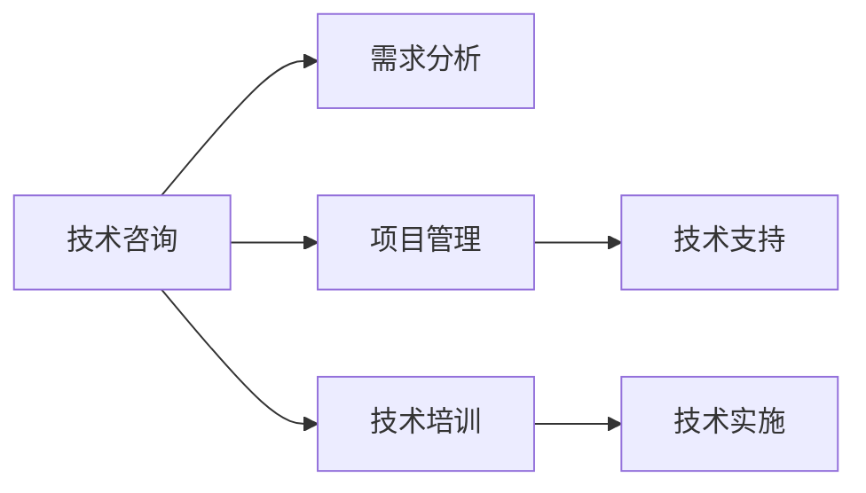

                 

# 技术咨询：高价值服务的提供

> 关键词：技术咨询, 高价值服务, 服务质量, 客户满意度, 项目管理, 技术评估, 技术支持, 技术培训, 技术实施

## 1. 背景介绍

### 1.1 问题由来

在当今快速变化的商业环境中，技术咨询作为一种高附加值服务，正在成为企业战略决策的重要组成部分。然而，技术咨询服务的质量高低直接关系到企业能否有效利用技术创新推动业务增长，并在竞争中保持优势。

### 1.2 问题核心关键点

高质量的技术咨询不仅需要深厚的技术知识，还需要对企业需求的深刻理解、对行业趋势的精准把握，以及对技术实现的严谨态度。这使得技术咨询服务在实际落地时面临诸多挑战：

1. **需求匹配**：如何确保技术咨询的内容与企业实际需求高度契合？
2. **项目管理**：如何高效地管理复杂的技术项目，保证按时交付？
3. **技术支持**：如何提供持续的技术支持和维护，确保系统稳定运行？
4. **培训与实施**：如何快速、有效地培训客户团队，并成功实施新技术？

## 2. 核心概念与联系

### 2.1 核心概念概述

为了更好地理解如何提供高质量的技术咨询服务，本节将介绍几个关键概念及其相互联系：

- **技术咨询**：通过提供专业、定制化的技术解决方案，帮助企业解决技术难题，提升业务效率。
- **项目管理**：运用专业的项目管理方法论，确保技术咨询项目按时、按质、按预算完成。
- **技术支持**：提供持续的技术维护和问题解决，保障技术系统的稳定性和可用性。
- **技术培训**：通过系统化的培训，提升客户团队的技术能力，实现自我管理与优化。
- **技术实施**：将技术方案转化为实际应用，确保技术变革的顺利落地。

这些核心概念共同构成了技术咨询服务的完整流程，帮助企业在技术变革中实现价值最大化。

### 2.2 核心概念原理和架构的 Mermaid 流程图



这个流程图展示了技术咨询服务的核心环节及其相互联系：

1. 技术咨询通过需求分析确定企业具体需求。
2. 在项目管理阶段，运用专业方法论保证项目按时完成。
3. 技术支持贯穿项目全过程，确保系统稳定运行。
4. 技术培训提升客户团队能力，实现自我优化。
5. 技术实施将解决方案转化为实际应用。

## 3. 核心算法原理 & 具体操作步骤

### 3.1 算法原理概述

技术咨询服务的核心在于提供量身定制的技术解决方案，满足企业特定需求。该过程可以概括为：

1. **需求分析**：深入理解企业需求，确定技术咨询目标。
2. **方案设计**：根据需求设计技术解决方案，选择合适的技术和工具。
3. **项目实施**：按计划执行项目，实现技术方案。
4. **评估与反馈**：收集反馈，优化方案，确保效果。

### 3.2 算法步骤详解

以下是技术咨询服务的具体操作步骤：

**Step 1: 需求分析**
- 与客户进行深入沟通，了解业务需求和技术挑战。
- 通过问卷调查、现场考察等方式收集详细信息。
- 分析数据，确定技术咨询的具体目标和优先级。

**Step 2: 方案设计**
- 根据需求，选择合适的技术方案和工具。
- 进行技术可行性分析，评估方案的可行性和成本效益。
- 设计详细实施计划，包括时间表、资源分配等。

**Step 3: 项目实施**
- 组建项目团队，明确各成员职责。
- 按照项目计划执行任务，确保项目按时完成。
- 定期审查项目进展，及时调整方案。

**Step 4: 评估与反馈**
- 收集客户反馈，评估技术咨询效果。
- 根据反馈优化方案，提高服务质量。
- 进行效果评估，确保咨询目标达成。

### 3.3 算法优缺点

技术咨询服务的优点包括：

1. **专业性**：通过专业团队提供解决方案，确保技术实施的准确性和高效性。
2. **全面性**：涵盖需求分析、方案设计、项目实施、评估反馈全流程，实现全方位服务。
3. **持续性**：提供持续的技术支持，确保系统长期稳定运行。
4. **灵活性**：根据企业需求灵活调整服务内容，实现高度定制化。

缺点主要体现在：

1. **成本高**：技术咨询通常需要较高成本投入，特别是对于中小企业来说。
2. **依赖性强**：对咨询团队的专业性和项目管理能力有较高要求。
3. **周期长**：项目周期较长，可能影响企业业务发展速度。
4. **风险高**：技术方案的实施和效果评估需要较高的技术水平，一旦出现问题，可能造成较大损失。

### 3.4 算法应用领域

技术咨询服务广泛应用于以下领域：

- **企业信息化**：帮助企业建设或优化信息化系统，提升运营效率。
- **大数据分析**：提供大数据分析服务，为企业决策提供数据支持。
- **云计算迁移**：指导企业从传统IT架构迁移到云计算平台。
- **物联网应用**：帮助企业构建物联网解决方案，实现智能运营。
- **人工智能应用**：提供AI技术咨询，推动企业业务智能化转型。

## 4. 数学模型和公式 & 详细讲解 & 举例说明

### 4.1 数学模型构建

技术咨询服务的核心在于通过专业方法论，确保项目按时、按质、按预算完成。常见的项目管理模型包括敏捷开发、瀑布模型等。这里以敏捷开发模型为例，构建数学模型：

设 $T$ 为项目总时长，$P$ 为项目任务总数，$n$ 为项目组人数，$\epsilon$ 为项目偏差率。敏捷开发模型可以表示为：

$$
\min_{T, P, n, \epsilon} \left( \frac{T}{P} + \sum_{i=1}^n \left( \frac{t_i}{p_i} \right) \right)
$$

其中，$t_i$ 为第 $i$ 个人的工作时间，$p_i$ 为第 $i$ 个人的工作效率。

### 4.2 公式推导过程

根据敏捷开发模型的目标，我们需要最小化项目总时间和项目偏差率。根据任务分配和人员效率的关系，推导得到：

$$
T = \sum_{i=1}^n t_i \\
\epsilon = \sum_{i=1}^n \frac{t_i}{p_i} - \frac{T}{P}
$$

其中，$t_i = n_i \times t_0$，$n_i$ 为第 $i$ 个任务需要的工人数，$t_0$ 为每个人每项任务的工作时间。

### 4.3 案例分析与讲解

假设某企业需要建立一个电商平台，项目总时长为6个月，项目组有10人，每人每月工作时间为200小时。设每个任务需要的工人数分别为3、5、2、4、2。通过求解上述模型，可以确定最优的人员分配和项目时间表。

## 5. 项目实践：代码实例和详细解释说明

### 5.1 开发环境搭建

在进行技术咨询服务开发前，需要搭建开发环境。以下是Python环境的搭建步骤：

1. 安装Python：从官网下载安装Python最新版本。
2. 安装虚拟环境：使用pip安装virtualenv或conda创建虚拟环境。
3. 安装相关库：使用pip安装必要的库，如numpy、pandas、scikit-learn等。
4. 编写代码：使用Python编写代码实现技术咨询服务的各功能模块。
5. 测试代码：通过单元测试验证代码正确性，确保模块间协同工作。

### 5.2 源代码详细实现

以下是一个简单的技术咨询项目管理模块的Python代码实现：

```python
from datetime import datetime

class Project:
    def __init__(self, name, start_date, end_date, tasks, team_members):
        self.name = name
        self.start_date = start_date
        self.end_date = end_date
        self.tasks = tasks
        self.team_members = team_members
        self.duration = (end_date - start_date).days

    def get_total_work_hours(self):
        total_hours = 0
        for task in self.tasks:
            total_hours += task['hours'] * self.team_members[task['member']]
        return total_hours

    def get_optimal_team_members(self):
        optimal_members = {}
        for task in self.tasks:
            if task['member'] not in optimal_members:
                optimal_members[task['member']] = 0
            optimal_members[task['member']] += task['hours']
        return optimal_members

    def calculate_project_cost(self, task_hours_per_member):
        total_cost = 0
        for member in self.team_members:
            total_cost += task_hours_per_member[member] * 200
        return total_cost

project = Project('E-commerce Platform', datetime(2023, 1, 1), datetime(2023, 6, 30), [{'name': 'User Interface', 'hours': 100}, {'name': 'Database', 'hours': 200}, {'name': 'Backend', 'hours': 150}, {'name': 'Quality Assurance', 'hours': 100}, {'name': 'Deployment', 'hours': 50}], {'user_interface': 2, 'database': 3, 'backend': 2, 'quality_assurance': 1, 'deployment': 1})
total_hours = project.get_total_work_hours()
optimal_members = project.get_optimal_team_members()
total_cost = project.calculate_project_cost(optimal_members)
print(f"Total work hours: {total_hours} hours")
print(f"Optimal team members: {optimal_members}")
print(f"Project cost: ${total_cost}")
```

### 5.3 代码解读与分析

上述代码实现了一个简单的项目模块，包括项目基本信息、总工作小时数、最优人员分配和项目成本计算。代码中使用了Python的基本数据类型和字典，以及datetime库来处理日期和时间。代码的实现简单易懂，但实际的代码实现会更加复杂，需要处理更多的场景和异常情况。

## 6. 实际应用场景

### 6.1 企业信息化

某大型制造企业希望构建ERP系统，提升生产管理效率。技术咨询团队通过需求分析，确定了企业现有的业务流程和信息需求，选择合适的技术方案和工具。通过敏捷开发模型，项目团队按时完成了系统的设计和实施。在系统上线后，技术咨询团队提供了持续的技术支持，帮助企业顺利过渡到新系统，实现了业务流程的优化。

### 6.2 大数据分析

某金融公司需要利用大数据分析客户行为，提升精准营销效果。技术咨询团队帮助公司建立了数据仓库，选择了适合的数据分析工具和算法，设计了详细的分析流程。通过持续的项目管理和技术支持，项目按时完成，数据分析结果显著提升了公司的营销效果。

### 6.3 云计算迁移

某中小型互联网公司希望从传统IT架构迁移到云平台，提升业务扩展能力和资源利用率。技术咨询团队通过需求分析，确定了公司现有的IT架构和业务需求，选择合适的云平台和迁移策略。通过敏捷开发模型，项目团队按时完成了迁移工作，帮助公司实现了云计算环境的优化，提升了系统性能和稳定性。

### 6.4 物联网应用

某物流公司希望通过物联网技术实现智能仓储管理，提升物流效率。技术咨询团队通过需求分析，确定了公司现有的物流流程和业务需求，选择了适合的物联网设备和解决方案。通过敏捷开发模型，项目团队按时完成了系统的设计和实施。在系统上线后，技术咨询团队提供了持续的技术支持，帮助公司顺利过渡到新系统，实现了物流流程的优化。

### 6.5 人工智能应用

某医疗公司希望通过人工智能技术提升患者诊断和治疗效果。技术咨询团队通过需求分析，确定了公司现有的医疗数据和业务需求，选择了适合的人工智能算法和工具。通过敏捷开发模型，项目团队按时完成了系统的设计和实施。在系统上线后，技术咨询团队提供了持续的技术支持，帮助公司顺利过渡到新系统，实现了医疗流程的优化。

## 7. 工具和资源推荐

### 7.1 学习资源推荐

为了帮助开发者提升技术咨询服务的质量，以下是一些优质的学习资源：

1. 《敏捷开发：原则、模式与实践》：详细介绍了敏捷开发模型的原理和实践方法。
2. 《项目管理基础》：讲解了项目管理的核心概念和常用方法论。
3. 《技术咨询：理论与实践》：介绍了技术咨询服务的理论基础和实际案例。
4. 《软件工程：需求分析与设计》：讲解了软件工程的基本原理和设计方法。
5. 《人工智能应用指南》：介绍了人工智能技术在各行各业的应用方法和实践案例。

通过对这些资源的学习，开发者可以更好地理解和掌握技术咨询服务的核心内容，提升自身技术咨询能力。

### 7.2 开发工具推荐

技术咨询服务开发需要各类工具支持，以下是一些推荐工具：

1. Git：版本控制工具，方便团队协作和管理代码。
2. JIRA：项目管理工具，帮助团队跟踪任务进展和问题。
3. Trello：任务管理工具，支持敏捷开发任务看板。
4. Confluence：知识管理工具，方便团队共享文档和知识。
5. Python：编程语言，支持快速开发和数据分析。
6. R：统计分析语言，支持数据处理和可视化。
7. SQL：数据库语言，支持数据存储和查询。
8. Docker：容器化技术，支持软件部署和管理。
9. Kubernetes：容器编排工具，支持大规模分布式系统管理。

合理利用这些工具，可以显著提升技术咨询服务的开发效率和质量，满足客户需求。

### 7.3 相关论文推荐

技术咨询服务的研究和实践已经积累了大量文献，以下是一些经典论文推荐：

1. 《敏捷开发方法论研究》：详细介绍了敏捷开发模型的理论基础和实践方法。
2. 《项目管理：规划、执行与监控》：讲解了项目管理的核心概念和常用方法论。
3. 《技术咨询：理论基础与实践方法》：介绍了技术咨询服务的理论基础和实际案例。
4. 《软件工程：需求分析与设计》：讲解了软件工程的基本原理和设计方法。
5. 《人工智能应用指南》：介绍了人工智能技术在各行各业的应用方法和实践案例。

这些论文代表了大规模技术咨询服务的理论研究和技术实践，是开发者学习的宝贵资源。

## 8. 总结：未来发展趋势与挑战

### 8.1 总结

本文对技术咨询服务的核心概念、算法原理和操作步骤进行了全面系统的介绍。技术咨询服务作为高价值服务，通过专业的方法论和工具，帮助企业解决技术难题，提升业务效率。结合实际案例，本文展示了技术咨询服务在信息化建设、大数据分析、云计算迁移、物联网应用、人工智能应用等各个领域的成功应用。通过详细介绍技术咨询服务的核心概念、算法原理和操作步骤，本文为开发者提供了系统的技术指引。

### 8.2 未来发展趋势

展望未来，技术咨询服务将呈现以下几个发展趋势：

1. **数字化转型**：随着数字化转型的深入，技术咨询服务将更加依赖数据驱动和智能决策，提升服务质量。
2. **智能化升级**：结合人工智能技术，提供更加智能化、个性化的技术咨询服务，实现自动化和精准化。
3. **全球化扩展**：技术咨询服务将走向全球化，跨越地域限制，提供跨国的技术支持。
4. **多模态融合**：结合物联网、云计算、大数据等多种技术，提供多模态融合的技术咨询服务，实现全面覆盖。
5. **可持续发展**：技术咨询服务将更加注重环境友好和可持续发展，推动绿色技术的应用。

### 8.3 面临的挑战

尽管技术咨询服务已经取得了显著成就，但在实际落地过程中，仍面临诸多挑战：

1. **需求匹配**：如何准确理解客户需求，提供量身定制的解决方案，是技术咨询服务面临的最大挑战之一。
2. **项目管理**：在项目规模较大、复杂度较高的情况下，如何高效管理项目，保证按时交付，是一大难题。
3. **技术支持**：在系统上线后，如何提供持续的技术支持和维护，确保系统稳定运行，是一个长期而艰巨的任务。
4. **人才短缺**：高质量的技术咨询需要专业的团队和丰富的经验，但目前技术咨询领域人才短缺，制约了服务的规模化发展。
5. **客户信任**：客户对技术咨询的信任度不高，如何提升客户信任度，拓展市场空间，是一个需要不断努力的方向。

### 8.4 研究展望

面向未来，技术咨询服务需要在以下几个方面寻求新的突破：

1. **需求驱动创新**：结合大数据和人工智能技术，提升需求分析和匹配的准确性和效率。
2. **自动化和智能化**：结合自动化工具和智能化方法，提升技术咨询服务的自动化水平和智能化程度。
3. **多模态融合**：结合多种技术手段，提供多模态融合的技术咨询服务，实现全面覆盖。
4. **可持续发展**：结合环境友好和可持续发展理念，推动绿色技术的应用，提升服务质量。
5. **全球化扩展**：通过技术和服务标准化，实现全球化扩展，提升服务的覆盖范围和影响力。

## 9. 附录：常见问题与解答

**Q1: 技术咨询服务如何与客户需求高度契合？**

A: 技术咨询服务需要通过深入的需求分析，了解客户的具体需求和痛点。结合数据分析和专家经验，制定详细的解决方案，确保方案与客户需求高度契合。在项目实施过程中，定期与客户沟通反馈，根据客户需求进行调整优化，确保方案落地效果。

**Q2: 技术咨询服务如何高效管理复杂项目？**

A: 技术咨询服务需要运用专业的项目管理方法论，如敏捷开发、瀑布模型等。通过任务分解、进度跟踪、质量控制等手段，确保项目按时、按质、按预算完成。在项目实施过程中，定期评估项目进展，及时调整方案，确保项目顺利推进。

**Q3: 技术咨询服务如何提供持续的技术支持和维护？**

A: 技术咨询服务需要建立完善的技术支持体系，包括技术文档、问题解答、在线支持等。在项目实施后，提供持续的技术支持，确保系统稳定运行。定期进行系统维护和升级，及时解决客户问题，提升客户满意度。

**Q4: 技术咨询服务如何提升客户团队能力？**

A: 技术咨询服务需要结合培训和指导，提升客户团队的技术能力。通过系统化的培训课程、实践指导和项目参与，帮助客户团队掌握技术知识和技能。在项目实施过程中，通过知识传递和经验分享，提升客户团队的专业水平和自主管理能力。

**Q5: 技术咨询服务如何确保服务质量？**

A: 技术咨询服务需要建立严格的服务质量管理体系，包括需求分析、方案设计、项目管理、技术支持等各个环节。通过定期评估和反馈，及时发现和解决问题，提升服务质量。在项目实施过程中，结合专家经验和技术手段，确保方案落地效果，提升客户满意度。

---

作者：禅与计算机程序设计艺术 / Zen and the Art of Computer Programming

