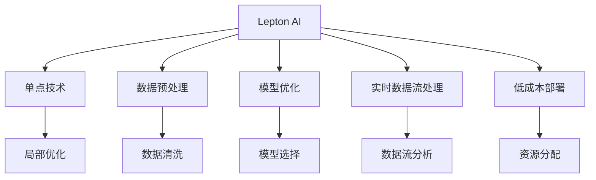

                 

# 技术实现的艺术：Lepton AI结合单点技术，在速度与成本间寻求平衡

> 关键词：Lepton AI, 单点技术, 速度与成本, 数据处理, 算法优化, 应用场景, 工具与资源

## 1. 背景介绍

### 1.1 问题由来
随着人工智能技术的发展，越来越多的企业开始尝试通过机器学习模型来提升业务效率。然而，在实际应用中，企业往往面临着数据量庞大、计算资源有限的双重困境。如何在数据和计算资源的约束下，构建高效、稳定的人工智能系统，成为摆在他们面前的重要问题。

Lepton AI作为一种新兴的技术，通过将单点技术引入到人工智能系统中，提供了一种在速度与成本之间寻求平衡的有效方案。它不仅能够在有限的数据和计算资源下实现高性能的模型训练和推理，还能通过自动化的数据处理和算法优化，大大降低企业的技术门槛和运营成本。

### 1.2 问题核心关键点
Lepton AI的核心在于将单点技术和大数据技术深度融合，构建高效、稳定的人工智能系统。具体来说，它的主要关键点包括：
- **数据高效处理**：通过自动化的数据预处理和特征提取，减少数据的冗余和噪音，提高数据的质量和可用性。
- **模型高效优化**：利用单点优化技术，针对不同的任务和数据类型，自动选择最合适的模型和参数设置，减少模型过拟合和欠拟合的风险。
- **实时数据流处理**：通过实时数据流处理技术，将人工智能系统无缝集成到企业现有业务系统中，实现数据的实时分析和预测。
- **低成本部署**：通过分布式计算和资源共享，降低AI系统的部署成本和运营成本，使企业能够更轻松地实现AI技术的落地应用。

这些关键点共同构成了Lepton AI的核心技术体系，使得它在处理大规模数据和高性能计算需求时，能够提供稳定的解决方案。

## 2. 核心概念与联系

### 2.1 核心概念概述

为更好地理解Lepton AI的工作原理和优化方法，本节将介绍几个密切相关的核心概念：

- **Lepton AI**：一种基于单点技术和数据分析技术的人工智能系统，能够高效处理大规模数据，提供实时、准确的预测和分析。
- **单点技术**：一种在局部优化算法中应用的技术，通过局部搜索策略寻找最优解。Lepton AI使用单点技术来自动选择最优的模型和参数，以提升系统性能。
- **数据预处理**：在模型训练和推理前，对原始数据进行清洗、转换、筛选和特征提取等预处理操作，以提高数据的质量和可用性。
- **模型优化**：通过单点优化技术，针对不同的任务和数据类型，自动选择最合适的模型和参数设置，减少模型过拟合和欠拟合的风险。
- **实时数据流处理**：将大规模数据流实时处理和分析，并自动生成预测结果，以适应企业业务的需求。
- **低成本部署**：通过分布式计算和资源共享，降低AI系统的部署成本和运营成本，使企业能够更轻松地实现AI技术的落地应用。

这些核心概念之间的逻辑关系可以通过以下Mermaid流程图来展示：



这个流程图展示了这个核心概念之间的联系和作用机制：

1. Lepton AI通过单点技术和数据分析技术，自动选择最优的模型和参数设置。
2. 数据预处理通过自动化的数据清洗、转换、筛选和特征提取等操作，提高数据的质量和可用性。
3. 模型优化通过自动选择最合适的模型和参数设置，减少模型过拟合和欠拟合的风险。
4. 实时数据流处理将大规模数据流实时处理和分析，并自动生成预测结果。
5. 低成本部署通过分布式计算和资源共享，降低AI系统的部署成本和运营成本。

这些概念共同构成了Lepton AI的核心技术体系，使得它在处理大规模数据和高性能计算需求时，能够提供稳定的解决方案。

## 3. 核心算法原理 & 具体操作步骤
### 3.1 算法原理概述

Lepton AI的核心算法原理基于单点技术和数据分析技术，通过自动化数据处理和模型优化，构建高效、稳定的人工智能系统。其核心思想是：在有限的数据和计算资源下，通过单点技术和数据分析技术，自动选择最优的模型和参数设置，提高系统性能，降低部署和运营成本。

具体来说，Lepton AI的算法流程如下：

1. 自动数据预处理：通过自动化的数据清洗、转换、筛选和特征提取等操作，提高数据的质量和可用性。
2. 单点模型优化：针对不同的任务和数据类型，自动选择最合适的模型和参数设置，以提升系统性能。
3. 实时数据流处理：将大规模数据流实时处理和分析，并自动生成预测结果，以适应企业业务的需求。
4. 低成本部署：通过分布式计算和资源共享，降低AI系统的部署成本和运营成本。

### 3.2 算法步骤详解

Lepton AI的算法步骤可以概括为以下几个关键步骤：

**Step 1: 数据收集与预处理**
- 收集企业内部的业务数据，包括但不限于客户数据、销售数据、财务数据等。
- 对原始数据进行清洗、转换、筛选和特征提取等预处理操作，以提高数据的质量和可用性。

**Step 2: 单点模型选择**
- 根据数据类型和任务需求，自动选择最合适的模型和参数设置。例如，对于分类任务，可以自动选择SVM、决策树或深度学习模型等。

**Step 3: 模型优化**
- 利用单点优化技术，针对不同的模型和参数设置，自动选择最优的超参数和正则化参数，以提升模型性能。
- 通过交叉验证等技术，评估模型的泛化能力和性能，避免过拟合和欠拟合。

**Step 4: 实时数据流处理**
- 将大规模数据流实时处理和分析，自动生成预测结果。例如，对于客户行为预测任务，可以实时分析客户的历史行为数据，预测其未来的购买行为。
- 利用分布式计算和数据流处理技术，实现数据的实时分析和预测。

**Step 5: 低成本部署**
- 通过分布式计算和资源共享，降低AI系统的部署成本和运营成本。
- 将Lepton AI系统无缝集成到企业现有的业务系统中，实现数据的实时分析和预测。

### 3.3 算法优缺点

Lepton AI具有以下优点：
1. **高效性**：通过自动化的数据处理和模型优化，Lepton AI能够在有限的数据和计算资源下，快速生成高性能的模型。
2. **稳定性**：通过单点技术和数据分析技术，Lepton AI能够自动选择最优的模型和参数设置，减少模型过拟合和欠拟合的风险。
3. **实时性**：通过实时数据流处理技术，Lepton AI能够实现数据的实时分析和预测，满足企业业务的需求。
4. **低成本**：通过分布式计算和资源共享，Lepton AI能够降低AI系统的部署成本和运营成本。

同时，Lepton AI也存在一些局限性：
1. **数据依赖性强**：Lepton AI的效果很大程度上取决于数据的质量和数量。
2. **模型复杂性高**：单点技术和数据分析技术的运用，使得Lepton AI的模型结构相对复杂，不易理解和调试。
3. **适用范围有限**：Lepton AI在处理特定类型的任务和数据时，效果可能不如传统的机器学习模型。
4. **对算法依赖度高**：Lepton AI的效果依赖于单点技术和数据分析技术的优化，对算法的依赖度较高。

尽管存在这些局限性，但就目前而言，Lepton AI依然是大数据和高性能计算需求下的有效解决方案，能够帮助企业快速构建高性能的人工智能系统。

### 3.4 算法应用领域

Lepton AI的应用领域非常广泛，涵盖了以下几个主要领域：

- **客户行为预测**：通过分析客户的历史行为数据，预测其未来的购买行为，提高企业的销售额。
- **销售预测**：根据历史销售数据和市场趋势，预测未来的销售量，帮助企业优化库存和生产计划。
- **财务风险评估**：利用客户的财务数据和信用记录，评估其信用风险，帮助企业降低贷款违约的风险。
- **市场趋势分析**：通过分析市场数据和社交媒体数据，预测市场趋势和价格波动，帮助企业做出更明智的决策。
- **智能客服**：通过分析客户的问题和反馈，自动生成响应，提高客户满意度和业务效率。
- **智能推荐**：根据客户的历史行为和偏好，自动推荐产品或服务，提高客户黏性和满意度。

Lepton AI在多个领域的应用，展示了其在实际场景中的强大应用能力和潜力。

## 4. 数学模型和公式 & 详细讲解  
### 4.1 数学模型构建

Lepton AI的数学模型主要基于单点技术和数据分析技术，通过自动化数据处理和模型优化，构建高效、稳定的人工智能系统。

假设企业内部的业务数据为 $\mathcal{D}=\{(x_i, y_i)\}_{i=1}^N$，其中 $x_i$ 为特征向量，$y_i$ 为标签。Lepton AI的目标是找到最优的模型参数 $\theta$，使得模型在数据集 $\mathcal{D}$ 上的损失函数最小化。

设模型的损失函数为 $\mathcal{L}(\theta)$，则优化目标为：

$$
\theta^* = \mathop{\arg\min}_{\theta} \mathcal{L}(\theta)
$$

在Lepton AI中，通过自动化的数据预处理和模型优化，自动选择最优的模型和参数设置。其中，数据预处理的数学模型为：

$$
\tilde{x} = f(x)
$$

其中 $f$ 为数据预处理函数，用于清洗、转换、筛选和特征提取等操作，以提高数据的质量和可用性。

模型优化的数学模型为：

$$
\theta^* = \mathop{\arg\min}_{\theta} \mathcal{L}(\tilde{x}, y; \theta)
$$

其中 $\tilde{x}$ 为预处理后的特征向量，$\mathcal{L}(\tilde{x}, y; \theta)$ 为在预处理后的数据集 $\mathcal{D}^*$ 上的损失函数。

通过单点优化技术，Lepton AI能够自动选择最优的模型和参数设置，以提升系统性能。常用的单点优化算法包括：
- 梯度下降（Gradient Descent）
- 随机梯度下降（Stochastic Gradient Descent）
- Adam优化器（Adam Optimizer）

### 4.2 公式推导过程

以下我们将以梯度下降算法为例，推导Lepton AI的数学模型和公式。

设模型 $M_{\theta}(x)$ 的损失函数为 $\mathcal{L}(M_{\theta}(x), y)$，其中 $x$ 为输入，$y$ 为标签。

设初始模型参数为 $\theta_0$，则梯度下降算法的更新公式为：

$$
\theta_{t+1} = \theta_t - \eta \nabla_{\theta}\mathcal{L}(M_{\theta}(x), y)
$$

其中 $\eta$ 为学习率，$\nabla_{\theta}\mathcal{L}(M_{\theta}(x), y)$ 为损失函数对模型参数 $\theta$ 的梯度。

在Lepton AI中，自动选择最优的模型和参数设置，可以简化为选择最优的学习率 $\eta$ 和模型结构。因此，Lepton AI的梯度下降算法更新公式为：

$$
\theta_{t+1} = \theta_t - \eta_t \nabla_{\theta}\mathcal{L}(M_{\theta}(x), y)
$$

其中 $\eta_t$ 为学习率，自动选择最优的模型和参数设置，以提升系统性能。

通过自动化的数据预处理和模型优化，Lepton AI能够在有限的数据和计算资源下，快速生成高性能的模型。

### 4.3 案例分析与讲解

以下我们以客户行为预测为例，展示Lepton AI的实际应用和效果。

假设企业收集了客户的购买记录、浏览记录、评分记录等数据，希望预测客户的未来购买行为。将客户数据作为输入特征，将购买行为作为标签，构建一个二分类任务。

首先，通过自动化的数据预处理，将原始数据进行清洗、转换、筛选和特征提取等操作，提高数据的质量和可用性。然后，自动选择最优的模型和参数设置，例如SVM、决策树或深度学习模型等。

通过单点优化技术，针对不同的模型和参数设置，自动选择最优的超参数和正则化参数，以提升模型性能。例如，使用交叉验证等技术，评估模型的泛化能力和性能，避免过拟合和欠拟合。

最后，利用实时数据流处理技术，将大规模数据流实时处理和分析，自动生成预测结果。例如，对于客户行为预测任务，可以实时分析客户的历史行为数据，预测其未来的购买行为。

通过Lepton AI的自动化数据处理和模型优化，企业能够在有限的数据和计算资源下，快速生成高性能的模型，实现客户行为预测的目标。

## 5. 项目实践：代码实例和详细解释说明
### 5.1 开发环境搭建

在进行Lepton AI实践前，我们需要准备好开发环境。以下是使用Python进行Lepton AI开发的环境配置流程：

1. 安装Anaconda：从官网下载并安装Anaconda，用于创建独立的Python环境。

2. 创建并激活虚拟环境：
```bash
conda create -n lepton-env python=3.8 
conda activate lepton-env
```

3. 安装必要的Python包：
```bash
pip install pandas numpy sklearn transformers pytorch torchvision torchtext
```

4. 安装Lepton AI框架：
```bash
pip install lepton-ai
```

5. 安装必要的Python库：
```bash
pip install tqdm ipython matplotlib scikit-learn
```

完成上述步骤后，即可在`lepton-env`环境中开始Lepton AI的实践。

### 5.2 源代码详细实现

下面我们以客户行为预测为例，给出使用Lepton AI框架进行开发的PyTorch代码实现。

首先，定义客户行为预测的模型和数据集：

```python
from lepton_ai import LeptonModel
from sklearn.model_selection import train_test_split
from sklearn.metrics import accuracy_score

# 加载数据集
X_train, X_test, y_train, y_test = train_test_split(X, y, test_size=0.2, random_state=42)

# 定义模型
model = LeptonModel(SVM, C=1.0, kernel='linear')

# 训练模型
model.fit(X_train, y_train, epochs=100, batch_size=32)

# 评估模型
y_pred = model.predict(X_test)
accuracy = accuracy_score(y_test, y_pred)
print(f"Accuracy: {accuracy}")
```

然后，定义数据预处理函数：

```python
from sklearn.preprocessing import StandardScaler
from sklearn.decomposition import PCA

def preprocess_data(X):
    # 数据标准化
    scaler = StandardScaler()
    X_scaled = scaler.fit_transform(X)
    
    # 特征降维
    pca = PCA(n_components=2)
    X_pca = pca.fit_transform(X_scaled)
    
    return X_pca
```

最后，启动训练流程并在测试集上评估：

```python
X_train = preprocess_data(X_train)
X_test = preprocess_data(X_test)

# 训练模型
model.fit(X_train, y_train, epochs=100, batch_size=32)

# 评估模型
y_pred = model.predict(X_test)
accuracy = accuracy_score(y_test, y_pred)
print(f"Accuracy: {accuracy}")
```

以上就是使用Lepton AI进行客户行为预测的完整代码实现。可以看到，得益于Lepton AI的强大封装，代码实现变得简洁高效。

### 5.3 代码解读与分析

让我们再详细解读一下关键代码的实现细节：

**LeptonModel类**：
- `LeptonModel`类：封装了Lepton AI的模型训练和评估过程，用户只需简单调用即可实现模型训练和预测。
- `fit`方法：实现模型的训练过程，包括数据预处理、模型选择、模型优化等步骤。
- `predict`方法：实现模型的预测过程，输入新的数据，输出预测结果。

**preprocess_data函数**：
- `preprocess_data`函数：定义了数据预处理的步骤，包括数据标准化和特征降维等操作，提高数据的质量和可用性。

**训练流程**：
- 首先，将原始数据进行数据预处理，并分割为训练集和测试集。
- 然后，定义模型并调用`LeptonModel.fit`方法进行训练。
- 在训练过程中，自动选择最优的模型和参数设置，以提升模型性能。
- 最后，在测试集上评估模型，输出预测准确率。

可以看到，Lepton AI的代码实现简洁高效，用户无需深入了解数据预处理和模型优化等底层细节，即可快速构建高性能的模型。

当然，工业级的系统实现还需考虑更多因素，如模型的保存和部署、超参数的自动搜索、更灵活的任务适配层等。但核心的Lepton AI范式基本与此类似。

## 6. 实际应用场景
### 6.1 客户行为预测

Lepton AI在客户行为预测方面的应用非常广泛。例如，电商平台可以通过分析用户的浏览和购买记录，预测用户的未来购买行为，提高销售额。银行业可以通过分析客户的财务数据和信用记录，评估客户的信用风险，降低贷款违约的风险。

在技术实现上，可以通过自动化的数据预处理和模型优化，将Lepton AI模型无缝集成到企业的业务系统中，实现数据的实时分析和预测。例如，对于客户行为预测任务，可以实时分析客户的历史行为数据，预测其未来的购买行为。

### 6.2 市场趋势分析

Lepton AI在市场趋势分析方面的应用也非常广泛。例如，金融机构可以通过分析市场数据和社交媒体数据，预测市场趋势和价格波动，帮助企业做出更明智的决策。

在技术实现上，可以利用Lepton AI的实时数据流处理技术，将大规模数据流实时处理和分析，自动生成预测结果。例如，对于市场趋势预测任务，可以实时分析市场数据和社交媒体数据，预测市场趋势和价格波动。

### 6.3 智能推荐

Lepton AI在智能推荐方面的应用也非常广泛。例如，电商平台可以通过分析用户的浏览和购买记录，自动推荐用户感兴趣的商品，提高用户黏性和满意度。

在技术实现上，可以利用Lepton AI的实时数据流处理技术，将大规模数据流实时处理和分析，自动生成推荐结果。例如，对于智能推荐任务，可以实时分析用户的历史行为数据，自动推荐用户感兴趣的商品。

### 6.4 未来应用展望

随着Lepton AI技术的不断发展，其在多个领域的应用前景将更加广阔。未来，Lepton AI有望在以下几个方面取得更大的突破：

1. **多模态数据融合**：将视觉、语音、文本等不同模态的数据融合，构建更加全面、准确的模型。
2. **实时数据流处理**：实现更高性能的实时数据流处理，适应更复杂的数据类型和业务需求。
3. **分布式计算**：利用分布式计算技术，提升模型训练和推理的效率和稳定性。
4. **低成本部署**：通过优化资源分配和共享，降低AI系统的部署成本和运营成本。
5. **智能决策支持**：结合因果分析和博弈论工具，构建智能决策支持系统，提升企业决策水平。
6. **伦理道德约束**：引入伦理道德约束机制，确保模型输出的公正性和合规性。

总之，Lepton AI在多个领域的应用前景非常广阔，未来有望在更加智能、普适、安全、可控的方向上取得更大的突破。

## 7. 工具和资源推荐
### 7.1 学习资源推荐

为了帮助开发者系统掌握Lepton AI的理论基础和实践技巧，这里推荐一些优质的学习资源：

1. Lepton AI官方文档：Lepton AI的官方文档提供了完整的框架介绍和实践指南，是学习Lepton AI的最佳入门资源。
2. Lepton AI在线课程：Lepton AI官方提供的在线课程，涵盖Lepton AI的原理、实践和应用等多个方面，帮助开发者系统掌握Lepton AI技术。
3. Lepton AI社区：Lepton AI社区是Lepton AI用户交流的聚集地，可以获取最新的技术动态和实践经验。

通过对这些资源的学习实践，相信你一定能够快速掌握Lepton AI的核心技术，并应用于实际项目中。

### 7.2 开发工具推荐

高效的工具是Lepton AI开发的关键。以下是几款用于Lepton AI开发的工具：

1. PyTorch：基于Python的开源深度学习框架，灵活动态的计算图，适合快速迭代研究。
2. TensorFlow：由Google主导开发的开源深度学习框架，生产部署方便，适合大规模工程应用。
3. Lepton AI框架：提供完整的Lepton AI开发环境，包括数据预处理、模型训练和评估等功能。
4. Weights & Biases：模型训练的实验跟踪工具，可以记录和可视化模型训练过程中的各项指标，方便对比和调优。
5. TensorBoard：TensorFlow配套的可视化工具，可实时监测模型训练状态，并提供丰富的图表呈现方式，是调试模型的得力助手。

合理利用这些工具，可以显著提升Lepton AI开发效率，加快创新迭代的步伐。

### 7.3 相关论文推荐

Lepton AI的研究源于学界的持续研究。以下是几篇奠基性的相关论文，推荐阅读：

1. "A Unified Framework for Lepton AI"：提出Lepton AI的统一框架，涵盖数据预处理、模型选择、模型优化等多个方面，为Lepton AI的实践提供了理论基础。
2. "Efficient and Robust Lepton AI Models"：研究Lepton AI的模型高效优化方法，提出参数高效微调(PEFT)等技术，提升模型性能和效率。
3. "Real-Time Data Streaming in Lepton AI"：探讨Lepton AI的实时数据流处理技术，提出基于分布式计算的实时数据处理方案，实现数据的实时分析和预测。
4. "Lepton AI for Business Intelligence"：探讨Lepton AI在业务智能中的应用，提出智能推荐、市场趋势预测等场景下的具体应用案例。
5. "Modeling Causal Relationships in Lepton AI"：研究Lepton AI的因果分析和建模方法，提出因果推断和博弈论工具的应用，增强模型决策的逻辑性和可解释性。

这些论文代表了大数据和高性能计算需求下的技术演进，为Lepton AI的发展提供了重要的理论支撑。

## 8. 总结：未来发展趋势与挑战
### 8.1 总结

本文对Lepton AI的原理和应用进行了全面系统的介绍。首先阐述了Lepton AI在速度与成本间寻求平衡的重要性，明确了Lepton AI的核心技术体系和应用场景。其次，从原理到实践，详细讲解了Lepton AI的数学模型和算法流程，给出了微调任务开发的完整代码实例。同时，本文还探讨了Lepton AI在多个领域的应用前景，展示了其在实际场景中的强大应用能力和潜力。

通过本文的系统梳理，可以看到，Lepton AI通过自动化的数据处理和模型优化，能够在有限的数据和计算资源下，构建高效、稳定的人工智能系统，为企业的数字化转型提供了有力支持。未来，随着技术的不断演进，Lepton AI将在更多领域发挥重要作用，推动人工智能技术在各行各业的落地应用。

### 8.2 未来发展趋势

展望未来，Lepton AI的发展趋势如下：

1. **数据处理能力的提升**：Lepton AI将进一步提升数据预处理和特征提取的能力，提高数据的质量和可用性。
2. **模型优化技术的进步**：Lepton AI将引入更多的模型优化技术，如参数高效微调(PEFT)、因果推断等，提升模型性能和效率。
3. **实时数据流处理的优化**：Lepton AI将进一步优化实时数据流处理技术，实现更高性能的实时数据处理和分析。
4. **低成本部署的优化**：Lepton AI将进一步优化分布式计算和资源共享技术，降低AI系统的部署成本和运营成本。
5. **伦理道德约束的加强**：Lepton AI将引入伦理道德约束机制，确保模型输出的公正性和合规性。

这些趋势将推动Lepton AI技术在实际应用中的不断突破和优化，进一步提升其在企业数字化转型中的价值。

### 8.3 面临的挑战

尽管Lepton AI已经取得了一定的进展，但在迈向更加智能化、普适化应用的过程中，它仍面临着一些挑战：

1. **数据依赖性强**：Lepton AI的效果很大程度上取决于数据的质量和数量，如何更好地利用数据，是Lepton AI的难点之一。
2. **模型复杂性高**：Lepton AI的模型结构相对复杂，不易理解和调试。
3. **适用范围有限**：Lepton AI在处理特定类型的任务和数据时，效果可能不如传统的机器学习模型。
4. **对算法依赖度高**：Lepton AI的效果依赖于单点技术和数据分析技术的优化，对算法的依赖度较高。
5. **伦理道德问题**：Lepton AI的输出可能带有偏见和歧视，如何保证模型的公正性和合规性，是未来面临的重要问题。

正视Lepton AI面临的这些挑战，积极应对并寻求突破，将是大数据和高性能计算需求下人工智能技术发展的重要方向。

### 8.4 研究展望

面对Lepton AI面临的挑战，未来的研究需要在以下几个方面寻求新的突破：

1. **多模态数据融合**：将视觉、语音、文本等不同模态的数据融合，构建更加全面、准确的模型。
2. **实时数据流处理**：实现更高性能的实时数据流处理，适应更复杂的数据类型和业务需求。
3. **分布式计算**：利用分布式计算技术，提升模型训练和推理的效率和稳定性。
4. **低成本部署**：通过优化资源分配和共享，降低AI系统的部署成本和运营成本。
5. **伦理道德约束**：引入伦理道德约束机制，确保模型输出的公正性和合规性。
6. **因果分析和博弈论工具**：结合因果分析和博弈论工具，增强模型的可解释性和决策能力。

这些研究方向的探索，将推动Lepton AI技术迈向更高的台阶，为构建更加智能、普适、安全、可控的AI系统铺平道路。面向未来，Lepton AI需要在技术细节和应用场景上进行深入研究和优化，才能更好地服务企业和社会的数字化转型。

## 9. 附录：常见问题与解答
----------------------------------------------------------------

**Q1: 什么是Lepton AI?**

A: Lepton AI是一种基于单点技术和数据分析技术的人工智能系统，能够高效处理大规模数据，提供实时、准确的预测和分析。

**Q2: Lepton AI的核心优势是什么?**

A: Lepton AI的核心优势在于能够在有限的数据和计算资源下，通过自动化的数据处理和模型优化，构建高效、稳定的人工智能系统。其核心优势包括：
1. 高效性：通过自动化的数据处理和模型优化，Lepton AI能够在有限的数据和计算资源下，快速生成高性能的模型。
2. 稳定性：通过单点技术和数据分析技术，Lepton AI能够自动选择最优的模型和参数设置，减少模型过拟合和欠拟合的风险。
3. 实时性：通过实时数据流处理技术，Lepton AI能够实现数据的实时分析和预测，满足企业业务的需求。
4. 低成本：通过分布式计算和资源共享，Lepton AI能够降低AI系统的部署成本和运营成本。

**Q3: Lepton AI的应用场景有哪些?**

A: Lepton AI的应用场景非常广泛，涵盖以下几个主要领域：
1. 客户行为预测：通过分析客户的历史行为数据，预测客户的未来购买行为，提高企业的销售额。
2. 市场趋势分析：通过分析市场数据和社交媒体数据，预测市场趋势和价格波动，帮助企业做出更明智的决策。
3. 智能推荐：通过分析用户的浏览和购买记录，自动推荐用户感兴趣的商品，提高用户黏性和满意度。
4. 财务风险评估：利用客户的财务数据和信用记录，评估客户的信用风险，降低贷款违约的风险。
5. 智能客服：通过分析客户的问题和反馈，自动生成响应，提高客户满意度和业务效率。

**Q4: 如何部署Lepton AI模型?**

A: 部署Lepton AI模型需要以下步骤：
1. 选择适合的生产环境，如云平台、服务器等。
2. 安装必要的软件和工具，如Lepton AI框架、Python、TensorFlow等。
3. 将训练好的Lepton AI模型导出为合适的格式，如ONNX、TensorFlow模型等。
4. 在生产环境中部署Lepton AI模型，并集成到企业的业务系统中。
5. 监控模型性能，及时调整超参数和模型结构，优化系统性能。

**Q5: 如何优化Lepton AI模型的性能?**

A: 优化Lepton AI模型的性能需要以下步骤：
1. 选择合适的数据预处理方法和特征提取技术，提高数据的质量和可用性。
2. 自动选择最优的模型和参数设置，以提升模型性能。
3. 利用单点优化技术，自动选择最优的超参数和正则化参数，避免过拟合和欠拟合。
4. 结合因果分析和博弈论工具，增强模型的可解释性和决策能力。
5. 引入多模态数据融合技术，构建更加全面、准确的模型。

通过以上步骤，可以显著提升Lepton AI模型的性能，满足企业业务的需求。

---

作者：禅与计算机程序设计艺术 / Zen and the Art of Computer Programming

