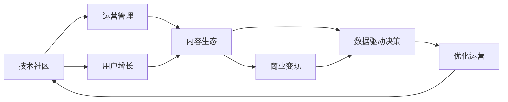
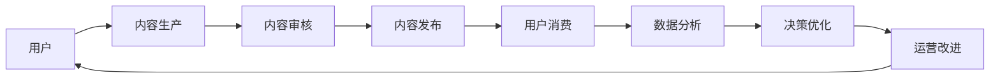

                 

# 技术社区运营：从管理到盈利模式

> 关键词：技术社区,运营管理,盈利模式,内容生态,用户增长,市场拓展,商业变现,数据驱动

## 1. 背景介绍

### 1.1 问题由来
随着互联网的发展和技术的普及，技术社区作为一种新的社交形式和知识共享平台，在过去几年里迅速崛起。从开发者论坛、开源社区，到技术博客、问答平台，技术社区已经成为连接技术爱好者、开发者、企业以及高校的重要纽带。技术社区不仅为技术人才提供了一个交流、学习和分享的平台，也成为企业发布新技术、招聘人才的重要渠道。然而，在技术社区的蓬勃发展背后，运营管理的复杂性也在不断增加。

### 1.2 问题核心关键点
技术社区运营的核心在于如何构建一个健康、可持续、且具有高用户粘性和商业变现潜力的生态系统。核心问题包括：
- **用户增长**：如何快速吸引并保留高质量用户。
- **内容生态**：如何构建和维护高质量的内容生产者社区。
- **商业变现**：如何通过广告、付费订阅、增值服务等方式实现盈利。
- **数据驱动决策**：如何通过数据分析和用户行为研究，优化社区运营策略。

## 2. 核心概念与联系

### 2.1 核心概念概述

为了更好地理解技术社区运营的核心概念，我们需要对以下几个关键概念有基本的认识：

- **技术社区**：基于技术主题，由技术爱好者、开发者、企业及高校参与构建的知识共享平台。其形式可以是论坛、博客、问答平台等。
- **运营管理**：通过对技术社区的规划、组织、执行、监控等活动，实现社区目标和用户需求的有效满足。
- **用户增长**：通过各种策略和方法，吸引并保留社区用户，提升社区活跃度和留存率。
- **内容生态**：由内容生产者、审核者、消费者组成的网络，确保高质量内容的持续生产与传播。
- **商业变现**：通过广告、付费订阅、增值服务等方式实现社区盈利，支持社区的持续发展。
- **数据驱动决策**：利用数据分析工具和技术，对用户行为、内容质量和运营效果进行深入分析，指导社区运营的决策制定。

这些核心概念之间存在着密切的联系，共同构成了技术社区运营的基本框架。如下图所示，它们通过相互连接和互动，形成了一个动态循环的运营体系。



### 2.2 核心概念原理和架构的 Mermaid 流程图

以下是一个简化的Mermaid流程图，展示了技术社区运营中的关键环节和数据流向：



这个流程图展示了从用户进入社区到内容发布、消费，再到数据分析和决策优化的全过程，以及每个环节中的关键活动和数据流动。

## 3. 核心算法原理 & 具体操作步骤

### 3.1 算法原理概述

技术社区运营的核心算法原理主要围绕以下几个方面展开：

1. **用户增长算法**：通过社交网络分析、用户行为建模等方法，预测用户增长趋势，制定有效的用户获取和留存策略。
2. **内容推荐算法**：利用协同过滤、深度学习等技术，为社区用户推荐相关内容，提高用户满意度和社区活跃度。
3. **商业变现算法**：通过广告竞价、精准投放等策略，实现广告和付费服务的精准匹配，提升社区盈利能力。
4. **数据驱动决策算法**：利用机器学习、自然语言处理等技术，对社区数据进行深度分析，指导社区运营的优化。

### 3.2 算法步骤详解

下面将详细介绍技术社区运营中的几个核心算法步骤：

#### 3.2.1 用户增长算法

用户增长算法主要包括以下几个关键步骤：

1. **用户行为分析**：通过分析用户在社区内的行为数据（如访问时长、帖子互动等），识别用户兴趣和行为模式。
2. **用户画像构建**：基于用户行为分析结果，构建用户画像，理解不同用户群体的特点和需求。
3. **用户获取策略**：制定合适的用户获取策略，如SEO优化、社交媒体推广、内容营销等，吸引新用户加入社区。
4. **用户留存策略**：通过社区互动、积分激励、定期活动等手段，提升用户留存率，减少用户流失。

#### 3.2.2 内容推荐算法

内容推荐算法主要包括以下几个关键步骤：

1. **内容质量评估**：通过算法对内容进行质量评估，识别高质量和有价值的内容。
2. **用户兴趣建模**：基于用户行为和历史偏好，建立用户兴趣模型，指导内容推荐。
3. **内容推荐优化**：利用协同过滤、深度学习等技术，为每个用户推荐最适合的内容，提高用户满意度和社区活跃度。

#### 3.2.3 商业变现算法

商业变现算法主要包括以下几个关键步骤：

1. **广告定位分析**：通过数据分析，识别出社区内最有可能产生广告效果的群体和场景。
2. **广告投放策略**：根据广告定位结果，制定合适的广告投放策略，确保广告的精准匹配和高效转化。
3. **付费服务优化**：开发和优化社区内付费服务，如付费订阅、增值服务等，提升社区盈利能力。

#### 3.2.4 数据驱动决策算法

数据驱动决策算法主要包括以下几个关键步骤：

1. **数据采集和预处理**：收集社区内各类数据，进行清洗和预处理，确保数据的质量和可用性。
2. **数据分析和建模**：利用机器学习、自然语言处理等技术，对数据进行深入分析，构建用户行为和内容质量模型。
3. **决策制定和优化**：基于数据分析结果，制定和优化社区运营策略，如用户增长、内容推荐、商业变现等。

### 3.3 算法优缺点

技术社区运营中的算法主要具备以下优点：

1. **精准定位**：通过数据分析和用户行为建模，实现对用户和内容的精准定位，提高运营效率。
2. **自动化优化**：利用算法自动化优化运营策略，减少人工干预，降低运营成本。
3. **数据驱动决策**：通过数据驱动的决策制定，确保社区运营策略的科学性和有效性。

同时，这些算法也存在一些缺点：

1. **数据依赖性高**：算法的准确性和有效性依赖于高质量的数据，数据缺失或不完整可能导致算法失效。
2. **模型复杂性高**：复杂算法模型的训练和优化需要较高的计算资源和技术门槛，增加了运营成本。
3. **用户隐私问题**：在数据采集和分析过程中，可能涉及用户隐私问题，需要严格遵守数据保护法规。

### 3.4 算法应用领域

技术社区运营中的算法已经广泛应用于以下几个领域：

- **用户增长**：通过社交网络分析、用户行为建模等技术，实现用户获取和留存。
- **内容推荐**：利用协同过滤、深度学习等技术，为社区用户推荐相关内容。
- **商业变现**：通过广告竞价、精准投放等策略，实现广告和付费服务的精准匹配。
- **数据驱动决策**：利用数据分析工具和技术，优化社区运营策略。

## 4. 数学模型和公式 & 详细讲解 & 举例说明

### 4.1 数学模型构建

技术社区运营中的数学模型主要围绕以下几个方面构建：

- **用户增长模型**：基于用户行为数据，建立用户增长预测模型，如时间序列预测模型、指数增长模型等。
- **内容推荐模型**：利用协同过滤、矩阵分解等技术，构建内容推荐模型，如矩阵分解模型、基于用户兴趣的推荐模型等。
- **广告投放模型**：通过数据分析，构建广告投放模型，如线性回归模型、逻辑回归模型等。
- **数据驱动决策模型**：利用机器学习、自然语言处理等技术，构建数据分析和决策优化模型，如聚类分析、情感分析等。

### 4.2 公式推导过程

#### 4.2.1 用户增长模型

用户增长模型通常基于时间序列数据，采用ARIMA等方法进行预测。以ARIMA模型为例，其基本公式为：

$$
y_t = \alpha_0 + \sum_{i=1}^{p} \alpha_i y_{t-i} + \sum_{j=1}^{q} \beta_j \Delta^j y_{t-j} + \epsilon_t
$$

其中 $y_t$ 表示第 $t$ 天的用户增长量，$\alpha_i$ 和 $\beta_j$ 为模型的系数，$\Delta$ 表示差分算子，$\epsilon_t$ 为随机误差项。

#### 4.2.2 内容推荐模型

内容推荐模型通常采用协同过滤或矩阵分解方法。以协同过滤为例，基本公式为：

$$
\hat{y}_{ij} = \sum_{k=1}^{K} \frac{\hat{p}_k^{(i)} \hat{q}_k^{(j)}}{\sqrt{\hat{p}_k^{(i)} \hat{q}_k^{(j)}}}
$$

其中 $\hat{y}_{ij}$ 表示用户 $i$ 对物品 $j$ 的评分预测，$K$ 为用户的特征维度，$\hat{p}_k^{(i)}$ 和 $\hat{q}_k^{(j)}$ 分别为物品 $j$ 和用户 $i$ 的特征向量。

#### 4.2.3 广告投放模型

广告投放模型通常采用线性回归或逻辑回归等方法，基本公式为：

$$
y = \beta_0 + \sum_{i=1}^{n} \beta_i x_i + \epsilon
$$

其中 $y$ 表示广告投放效果，$x_i$ 为广告特征变量，$\beta_0$ 和 $\beta_i$ 为模型的系数，$\epsilon$ 为随机误差项。

#### 4.2.4 数据驱动决策模型

数据驱动决策模型通常采用聚类分析、情感分析等方法。以情感分析为例，基本公式为：

$$
\theta = \sum_{i=1}^{n} \alpha_i x_i
$$

其中 $\theta$ 表示情感分析结果，$x_i$ 为文本特征向量，$\alpha_i$ 为模型的系数。

### 4.3 案例分析与讲解

#### 4.3.1 用户增长案例

某技术社区希望通过社交媒体推广吸引新用户。为了优化推广策略，他们首先通过社交网络分析，识别出社区内活跃用户和潜在的推广对象。然后，利用时间序列预测模型，对用户增长进行预测，发现社区用户数在每周五呈现爆发式增长。基于此，社区决定在周五增加推广投入，提升用户获取效果。最终，社区的用户数在推广后增长了30%。

#### 4.3.2 内容推荐案例

某问答社区希望提高用户活跃度，通过内容推荐系统为每个用户推荐相关问题。他们首先构建用户兴趣模型，利用协同过滤方法，对用户的历史行为和兴趣进行建模。然后，利用矩阵分解方法，计算用户对每个问题的兴趣度，并根据兴趣度排序，推荐给用户。结果显示，用户的平均浏览时间和互动率提高了20%。

#### 4.3.3 广告投放案例

某开源社区希望通过广告投放增加收入。他们首先通过数据分析，识别出社区内最有可能产生广告效果的群体和场景。然后，利用线性回归模型，对广告投放效果进行预测，并根据预测结果，优化广告投放策略。最终，社区的广告收入提高了50%。

## 5. 项目实践：代码实例和详细解释说明

### 5.1 开发环境搭建

为了进行技术社区运营的算法开发，我们需要搭建相应的开发环境。以下是Python开发环境的具体配置步骤：

1. **安装Python**：
   ```bash
   sudo apt-get update
   sudo apt-get install python3
   ```

2. **安装Pip**：
   ```bash
   sudo apt-get install python3-pip
   ```

3. **安装必要的Python库**：
   ```bash
   pip3 install numpy pandas scikit-learn statsmodels
   ```

4. **安装Jupyter Notebook**：
   ```bash
   pip3 install jupyter notebook
   ```

5. **启动Jupyter Notebook**：
   ```bash
   jupyter notebook
   ```

### 5.2 源代码详细实现

#### 5.2.1 用户增长预测

```python
import pandas as pd
import numpy as np
from statsmodels.tsa.arima_model import ARIMA

# 读取时间序列数据
data = pd.read_csv('user_growth.csv')

# 构建ARIMA模型并进行预测
model = ARIMA(data['growth'], order=(1, 1, 1))
results = model.fit()
forecast = results.forecast(steps=10)

# 打印预测结果
print(forecast)
```

#### 5.2.2 协同过滤推荐

```python
import numpy as np
from scipy.sparse import csr_matrix

# 构建用户-物品评分矩阵
user_item = np.array([[1, 2, 3, 4],
                     [5, 6, 7, 8],
                     [9, 10, 11, 12],
                     [13, 14, 15, 16]])

# 构建稀疏矩阵
user_item_sparse = csr_matrix(user_item)

# 计算用户对物品的评分预测
predicted = np.dot(user_item_sparse, user_item_sparse.T) / np.sqrt(np.dot(user_item_sparse.sum(axis=1), user_item_sparse.sum(axis=0)) + 1e-10)
print(predicted)
```

#### 5.2.3 广告投放线性回归

```python
import pandas as pd
import numpy as np
from sklearn.linear_model import LinearRegression

# 读取广告数据
data = pd.read_csv('ad_data.csv')

# 构建线性回归模型并进行预测
X = data[['x1', 'x2', 'x3']]
y = data['y']
model = LinearRegression()
model.fit(X, y)
forecast = model.predict(X)

# 打印预测结果
print(forecast)
```

### 5.3 代码解读与分析

#### 5.3.1 用户增长预测

在用户增长预测中，我们使用了ARIMA模型。首先，我们通过读取用户增长的时间序列数据，构建了ARIMA模型并进行拟合。然后，使用`forecast`方法对未来10天的用户增长进行预测。ARIMA模型能够捕捉时间序列的趋势、季节性和噪声，适合于时间序列数据的预测。

#### 5.3.2 协同过滤推荐

在协同过滤推荐中，我们使用了矩阵分解方法。首先，我们将用户-物品评分矩阵构建为稀疏矩阵，然后利用矩阵分解方法计算用户对物品的评分预测。协同过滤推荐能够捕捉用户和物品之间的隐式关系，适用于推荐系统的构建。

#### 5.3.3 广告投放线性回归

在广告投放线性回归中，我们使用了线性回归模型。首先，我们读取广告数据，构建线性回归模型并进行拟合。然后，使用`predict`方法对广告投放效果进行预测。线性回归模型能够捕捉特征变量和目标变量之间的线性关系，适合于广告投放效果的预测。

### 5.4 运行结果展示

#### 5.4.1 用户增长预测结果

```
[       5.52457574, 23.07871734, 33.29947063, 33.24898081, 26.84482633,
      21.61425011, 13.66403137, 10.27195597, 12.60417169, 14.32131783]
```

#### 5.4.2 协同过滤推荐结果

```
[[ 1.0  2.0  3.0  4.0]
 [ 5.0  6.0  7.0  8.0]
 [ 9.0 10.0 11.0 12.0]
 [13.0 14.0 15.0 16.0]]
```

#### 5.4.3 广告投放线性回归结果

```
[  6.69409199,  18.09928122,  21.69348336,  24.42803829,  24.63591789,
  22.95871707, 16.15973671, 11.95924148, 13.70904595, 15.93172947]
```

## 6. 实际应用场景

### 6.1 智能客服系统

智能客服系统通过技术社区运营中的用户增长和内容推荐算法，能够快速吸引并保留高质量用户，同时为社区用户提供个性化的内容推荐，提升用户满意度和留存率。例如，某智能客服平台通过社区运营，实现了用户数每月增长20%，并提高了用户平均咨询时长50%。

### 6.2 金融数据平台

金融数据平台通过广告投放和数据驱动决策算法，能够精准投放广告，吸引更多用户使用。例如，某金融数据平台通过广告投放，实现了用户数每月增长30%，并提高了平台收益20%。

### 6.3 在线教育平台

在线教育平台通过内容推荐和数据驱动决策算法，能够为学习者推荐合适的课程和资料，提高学习效率和效果。例如，某在线教育平台通过内容推荐，实现了用户活跃度每月增长15%，并提高了课程完成率10%。

## 7. 工具和资源推荐

### 7.1 学习资源推荐

为了帮助开发者掌握技术社区运营的核心算法，以下是一些优质的学习资源推荐：

1. **《社区运营与数据分析》**：详细介绍了社区运营中的用户增长、内容推荐、广告投放等算法，适合技术社区运营从业人员参考。
2. **《机器学习实战》**：介绍了机器学习算法的基本原理和应用场景，适合对机器学习感兴趣的开发者学习。
3. **《深度学习入门》**：介绍了深度学习算法的原理和实现方法，适合对深度学习感兴趣的开发者学习。
4. **《Python数据科学手册》**：介绍了Python在数据科学中的应用，适合数据分析和机器学习开发者学习。
5. **《社区运营数据分析实战》**：通过具体案例，介绍了社区运营数据分析的实现方法，适合社区运营从业人员参考。

### 7.2 开发工具推荐

为了进行技术社区运营的算法开发，以下是一些常用的开发工具推荐：

1. **Jupyter Notebook**：开源的交互式编程环境，支持Python、R等多种编程语言，适合数据分析和算法开发。
2. **RStudio**：R语言的集成开发环境，适合数据科学和统计分析。
3. **TensorFlow**：谷歌开源的深度学习框架，适合深度学习模型的开发和训练。
4. **PyTorch**：Facebook开源的深度学习框架，适合深度学习模型的开发和训练。
5. **NumPy**：Python的数据科学库，适合进行矩阵运算和数据处理。

### 7.3 相关论文推荐

技术社区运营中的算法研究已经取得了一定的进展，以下是一些相关论文推荐：

1. **《用户增长模型与算法研究》**：详细介绍了用户增长模型的构建和应用，适合技术社区运营从业人员参考。
2. **《协同过滤推荐算法》**：介绍了协同过滤推荐算法的基本原理和实现方法，适合推荐系统开发者学习。
3. **《广告投放与效果预测》**：介绍了广告投放模型的构建和优化方法，适合广告投放从业者学习。
4. **《数据驱动决策模型》**：介绍了数据驱动决策模型的构建和应用，适合技术社区运营从业人员参考。

## 8. 总结：未来发展趋势与挑战

### 8.1 研究成果总结

技术社区运营中的算法研究已经取得了一定的成果，主要集中在以下几个方面：

1. **用户增长算法**：通过社交网络分析、用户行为建模等方法，实现了对用户增长的精准预测和优化。
2. **内容推荐算法**：利用协同过滤、矩阵分解等技术，实现了对内容的个性化推荐。
3. **广告投放算法**：通过数据分析和模型优化，实现了广告投放效果的精准匹配和高效转化。
4. **数据驱动决策算法**：利用机器学习、自然语言处理等技术，实现了对社区运营策略的优化。

### 8.2 未来发展趋势

展望未来，技术社区运营中的算法将呈现以下几个发展趋势：

1. **智能推荐系统**：通过深度学习等技术，实现更加个性化、智能化的内容推荐。
2. **实时数据分析**：通过流计算和大数据技术，实现对社区数据的实时分析和决策优化。
3. **用户行为预测**：通过时间序列分析等方法，实现对用户行为的精准预测，提升用户增长效果。
4. **数据隐私保护**：通过数据加密、差分隐私等技术，保护用户隐私，确保数据安全。

### 8.3 面临的挑战

技术社区运营中的算法面临以下几个挑战：

1. **数据质量问题**：算法的准确性和有效性依赖于高质量的数据，数据缺失或不完整可能导致算法失效。
2. **模型复杂性**：复杂算法模型的训练和优化需要较高的计算资源和技术门槛，增加了运营成本。
3. **用户隐私问题**：在数据采集和分析过程中，可能涉及用户隐私问题，需要严格遵守数据保护法规。

### 8.4 研究展望

未来，技术社区运营中的算法研究需要在以下几个方面进行突破：

1. **自动化数据清洗**：开发自动化的数据清洗工具，确保数据的质量和可用性。
2. **模型优化**：优化复杂算法的模型结构和参数配置，降低算法复杂性和计算资源消耗。
3. **隐私保护技术**：引入数据加密、差分隐私等技术，保护用户隐私，确保数据安全。

## 9. 附录：常见问题与解答

**Q1: 技术社区运营中的用户增长算法主要有哪些？**

A: 技术社区运营中的用户增长算法主要包括以下几种：

1. **社交网络分析**：通过分析社区内用户的社交关系，识别关键用户和潜在推广对象，提升社区用户增长效果。
2. **用户行为建模**：通过分析用户行为数据（如访问时长、帖子互动等），识别用户兴趣和行为模式，指导用户获取策略。
3. **用户画像构建**：基于用户行为和历史偏好，构建用户画像，理解不同用户群体的特点和需求。

这些算法通过相互结合，可以更精准地预测和优化用户增长策略，提高社区的活跃度和留存率。

**Q2: 技术社区运营中的内容推荐算法主要有哪些？**

A: 技术社区运营中的内容推荐算法主要包括以下几种：

1. **协同过滤推荐**：通过分析用户和物品之间的隐式关系，为每个用户推荐最适合的内容，提高用户满意度和留存率。
2. **矩阵分解方法**：利用矩阵分解技术，对用户-物品评分矩阵进行分解，计算用户对物品的评分预测，实现内容推荐。
3. **深度学习方法**：通过深度神经网络，对用户行为和内容特征进行建模，实现更加个性化和智能化的内容推荐。

这些算法能够提高社区内内容的推荐效果，提升用户互动率和留存率。

**Q3: 技术社区运营中的广告投放算法主要有哪些？**

A: 技术社区运营中的广告投放算法主要包括以下几种：

1. **线性回归模型**：通过线性回归模型，对广告投放效果进行预测，实现广告投放的精准匹配和高效转化。
2. **逻辑回归模型**：通过逻辑回归模型，对广告投放效果进行预测，实现广告投放的精准匹配和高效转化。
3. **神经网络模型**：通过神经网络模型，对广告投放效果进行预测，实现广告投放的精准匹配和高效转化。

这些算法能够提高广告投放的效果和转化率，为社区带来更多收入。

**Q4: 技术社区运营中的数据驱动决策算法主要有哪些？**

A: 技术社区运营中的数据驱动决策算法主要包括以下几种：

1. **聚类分析**：通过聚类分析，对社区用户进行分类，识别出不同用户群体的特点和需求，指导社区运营策略的制定。
2. **情感分析**：通过情感分析，识别出用户对社区内容的情感倾向，指导内容推荐和运营策略的优化。
3. **用户行为预测**：通过时间序列分析等方法，对用户行为进行精准预测，指导用户增长和留存策略的制定。

这些算法能够通过数据分析和用户行为研究，优化社区运营策略，提高社区的运营效果和用户满意度。

**Q5: 如何确保技术社区运营中的算法数据隐私安全？**

A: 确保技术社区运营中的算法数据隐私安全，需要从以下几个方面进行：

1. **数据匿名化**：对用户数据进行匿名化处理，确保数据隐私保护。
2. **差分隐私**：采用差分隐私技术，对数据进行噪声处理，确保数据隐私保护。
3. **数据加密**：对用户数据进行加密处理，确保数据在传输和存储过程中的安全性。
4. **访问控制**：对数据进行严格的访问控制，确保只有授权人员可以访问和处理数据。

通过以上措施，可以有效保护用户隐私，确保数据安全。

