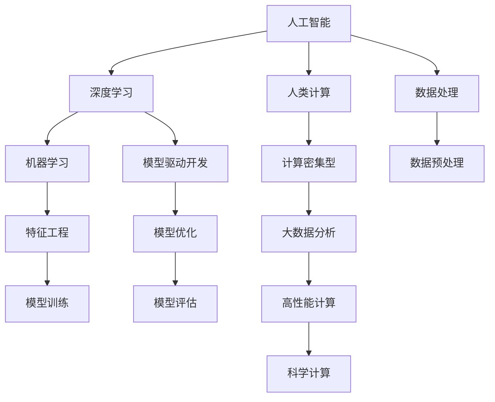

                 

# 技能提升：适应人类计算时代的新需求

## 1. 背景介绍

在人类文明的发展历程中，计算技术始终扮演着重要的角色。从早期的机械计算到现代的电子计算机，每一次技术的飞跃，都极大地推动了社会的进步和人类认知能力的提升。进入21世纪，尤其是随着人工智能（AI）和深度学习（DL）技术的迅猛发展，计算能力已经不再是制约科学研究的瓶颈，而成为推动新一轮技术革命的关键引擎。

在这个崭新的计算时代，如何提升我们的技能，适应这种快速变化的技术环境，已经成为每位计算机科学与技术从业者所面临的重大挑战。本文将探讨适应人类计算时代新需求的关键技能提升，从理论到实践，为读者提供一份全面且深入的指南。

## 2. 核心概念与联系

### 2.1 核心概念概述

要适应人类计算时代的新需求，首先需要理解一些核心概念及其相互之间的联系：

- **人工智能（AI）**：一种模拟人类智能行为的技术，涵盖了机器学习、深度学习、自然语言处理、计算机视觉等多个领域。
- **深度学习（DL）**：一种基于多层神经网络的学习方法，通过多层非线性变换捕捉数据的复杂关系。
- **人类计算（Human Computing）**：利用人类智能和计算能力相结合的技术，通过人机协作实现更高效、更智能的任务处理。
- **模型驱动开发（Model-Driven Development, MDD）**：一种软件开发方法，将模型作为开发的核心，通过模型驱动软件生成和测试，提升开发效率和质量。
- **机器学习（ML）**：一种让机器通过数据学习并优化自身性能的技术，涉及数据预处理、特征工程、模型训练和评估等多个环节。
- **计算密集型（Computationally Intensive）**：指需要大量计算资源才能完成的任务，如深度学习模型训练、高性能科学计算等。

这些概念相互交织，共同构成了现代计算技术的基础框架，了解这些概念及其联系，有助于更好地理解人类计算时代的新需求和提升技能。

### 2.2 核心概念原理和架构的 Mermaid 流程图



通过这个流程图，我们可以清晰地看到各个概念之间的联系。例如，深度学习是人工智能的一个子集，而计算密集型则是深度学习模型的重要特性。人类计算和大数据分析则体现了人工智能和深度学习在实际应用中的重要应用场景。

## 3. 核心算法原理 & 具体操作步骤

### 3.1 算法原理概述

在人工智能和深度学习领域，模型驱动开发（MDD）和机器学习（ML）是两大核心算法原理，它们相互配合，共同推动技术进步。

MDD方法将模型作为软件开发生命周期的核心，通过模型驱动开发工具自动生成软件架构和代码，实现从需求到软件的自动映射。具体来说，MDD通常包括以下几个关键步骤：

1. **需求建模**：将用户需求转化为数学模型或形式化规范。
2. **模型映射**：将需求模型映射为软件架构模型，包括组件、接口、连接关系等。
3. **代码生成**：利用代码生成器自动生成具体的代码实现。
4. **模型验证**：通过模型驱动的测试工具，验证软件模型是否满足需求。

ML方法则侧重于通过数据训练模型，提升模型的预测和决策能力。其核心步骤包括：

1. **数据准备**：收集、清洗、标注数据，准备模型训练和测试数据。
2. **特征工程**：选择、提取、变换特征，提升模型的性能。
3. **模型训练**：使用训练数据集训练模型，优化模型参数。
4. **模型评估**：在测试数据集上评估模型性能，选择最佳模型。

### 3.2 算法步骤详解

#### 3.2.1 MDD方法

**Step 1: 需求建模**
- 使用UML（统一建模语言）或EER（实体-关系建模）等工具，将用户需求转化为模型。
- 例如，对于一个人工智能助手系统，可以建模为包括语言理解、任务调度、知识库访问等组件的架构。

**Step 2: 模型映射**
- 使用模型映射工具，将需求模型映射为具体的软件架构模型。
- 例如，使用MD2L（Model Driven to Language）工具，将UML模型转换为代码。

**Step 3: 代码生成**
- 使用代码生成器，根据软件架构模型自动生成代码。
- 例如，使用ModelScope（Microsoft）或MyModel（IBM）等工具，生成具体的Java、Python等代码。

**Step 4: 模型验证**
- 使用模型驱动的测试工具，验证生成的代码是否满足需求。
- 例如，使用Model Testing Environment（MTE）工具，进行自动测试和验证。

#### 3.2.2 ML方法

**Step 1: 数据准备**
- 收集、清洗、标注数据，准备模型训练和测试数据。
- 例如，对于图像分类任务，需要收集大量的图像数据，并进行标注。

**Step 2: 特征工程**
- 选择、提取、变换特征，提升模型的性能。
- 例如，对于文本分类任务，可以提取词频、TF-IDF等特征，提升模型的准确率。

**Step 3: 模型训练**
- 使用训练数据集训练模型，优化模型参数。
- 例如，使用TensorFlow、PyTorch等框架，训练深度神经网络模型。

**Step 4: 模型评估**
- 在测试数据集上评估模型性能，选择最佳模型。
- 例如，使用交叉验证等方法，评估模型的准确率、召回率、F1分数等指标。

### 3.3 算法优缺点

**MDD方法的优缺点**

**优点**
- 提升开发效率：自动生成代码，减少人工编写工作量。
- 提升代码质量：自动验证和测试，减少错误率。
- 提高一致性：统一建模和开发，确保软件一致性。

**缺点**
- 学习曲线陡峭：需要学习复杂的技术工具。
- 模型复杂：模型映射和验证可能较复杂。
- 依赖工具：依赖特定的工具和平台。

**ML方法的优缺点**

**优点**
- 模型表现优秀：通过数据训练，模型可以具备较高的预测准确率。
- 通用性强：适用于多种数据类型和任务。
- 适应性强：可以通过不断训练优化模型性能。

**缺点**
- 数据依赖性强：依赖高质量标注数据，数据收集成本高。
- 计算资源消耗大：需要大量计算资源进行模型训练。
- 模型可解释性差：复杂模型难以解释其内部工作机制。

### 3.4 算法应用领域

**MDD方法**
- **软件开发**：适用于大型软件系统的开发，提高开发效率和质量。
- **AI系统开发**：适用于构建智能助手、自动化流程等AI系统。
- **数据分析**：适用于数据驱动的决策系统，如推荐系统、金融风控等。

**ML方法**
- **图像识别**：适用于图像分类、目标检测等任务。
- **自然语言处理**：适用于文本分类、情感分析、机器翻译等任务。
- **推荐系统**：适用于商品推荐、新闻推荐等任务。

## 4. 数学模型和公式 & 详细讲解 & 举例说明

### 4.1 数学模型构建

在深度学习中，常用的数学模型包括神经网络、卷积神经网络（CNN）、循环神经网络（RNN）等。以卷积神经网络为例，其数学模型可以表示为：

$$
h(x) = \sigma\left(W_1x + b_1 + W_2h(x-1)\right)
$$

其中，$x$ 表示输入，$h(x)$ 表示输出，$\sigma$ 为激活函数，$W_1$ 和 $W_2$ 为卷积核，$b_1$ 为偏置项。

### 4.2 公式推导过程

以多层感知机（MLP）为例，其公式推导过程如下：

**输入层**
- 输入 $x_0$，输出 $x_1$

**隐藏层 1**
- $x_1 = \sigma(W_1x_0 + b_1)$

**隐藏层 2**
- $x_2 = \sigma(W_2x_1 + b_2)$

**输出层**
- $y = \sigma(W_3x_2 + b_3)$

其中，$\sigma$ 表示激活函数，$W_i$ 和 $b_i$ 表示权重和偏置项。

### 4.3 案例分析与讲解

**案例分析：图像分类**

在图像分类任务中，可以使用卷积神经网络（CNN）进行建模和训练。具体步骤如下：

1. **数据准备**：收集、清洗、标注图像数据。
2. **特征工程**：提取图像的局部特征，如边缘、角点等。
3. **模型训练**：使用训练数据集训练卷积神经网络，优化模型参数。
4. **模型评估**：在测试数据集上评估模型性能，选择最佳模型。

## 5. 项目实践：代码实例和详细解释说明

### 5.1 开发环境搭建

#### 5.1.1 安装依赖

- 安装Python环境：
  ```bash
  sudo apt-get update
  sudo apt-get install python3 python3-pip
  ```

- 安装TensorFlow：
  ```bash
  pip install tensorflow
  ```

- 安装Keras：
  ```bash
  pip install keras
  ```

#### 5.1.2 创建虚拟环境

- 创建虚拟环境：
  ```bash
  python3 -m venv myenv
  source myenv/bin/activate
  ```

### 5.2 源代码详细实现

#### 5.2.1 数据准备

- 使用Keras自带的MNIST数据集：
  ```python
  from keras.datasets import mnist
  (x_train, y_train), (x_test, y_test) = mnist.load_data()
  ```

- 数据预处理：
  ```python
  x_train = x_train / 255.0
  x_test = x_test / 255.0
  ```

#### 5.2.2 模型构建

- 定义卷积神经网络模型：
  ```python
  from keras.models import Sequential
  from keras.layers import Conv2D, MaxPooling2D, Flatten, Dense, Dropout
  
  model = Sequential()
  model.add(Conv2D(32, kernel_size=(3, 3), activation='relu', input_shape=(28, 28, 1)))
  model.add(MaxPooling2D(pool_size=(2, 2)))
  model.add(Conv2D(64, kernel_size=(3, 3), activation='relu'))
  model.add(MaxPooling2D(pool_size=(2, 2)))
  model.add(Flatten())
  model.add(Dense(128, activation='relu'))
  model.add(Dropout(0.5))
  model.add(Dense(10, activation='softmax'))
  ```

#### 5.2.3 模型训练

- 编译模型：
  ```python
  model.compile(optimizer='adam', loss='categorical_crossentropy', metrics=['accuracy'])
  ```

- 训练模型：
  ```python
  model.fit(x_train.reshape((-1, 28, 28, 1)), y_train, epochs=10, batch_size=128)
  ```

#### 5.2.4 模型评估

- 在测试集上评估模型：
  ```python
  score = model.evaluate(x_test.reshape((-1, 28, 28, 1)), y_test, verbose=0)
  print('Test loss:', score[0])
  print('Test accuracy:', score[1])
  ```

### 5.3 代码解读与分析

在上述代码中，我们首先使用Keras的MNIST数据集，对数据进行了预处理。然后定义了一个包含卷积层、池化层、全连接层的卷积神经网络模型，并使用adam优化器和交叉熵损失函数进行编译。最后使用训练集对模型进行了10次迭代训练，并在测试集上评估了模型的准确率。

### 5.4 运行结果展示

- 训练过程中，每轮迭代结束后，会输出当前损失函数和准确率。
- 训练完成后，会在测试集上输出最终的损失函数和准确率。

## 6. 实际应用场景

### 6.1 智慧医疗

在智慧医疗领域，深度学习可以应用于医学影像分析、疾病诊断、个性化医疗等多个方面。例如，使用卷积神经网络（CNN）对医学影像进行分类，可以大幅提升医生的诊断效率和准确率。

### 6.2 智能推荐系统

智能推荐系统可以根据用户的历史行为数据，推荐符合其兴趣的个性化内容。使用深度学习模型，如协同过滤、基于矩阵分解的方法，可以提升推荐系统的精准度和多样性。

### 6.3 金融风控

金融风控是金融领域的重要应用，深度学习可以用于信用评分、欺诈检测、风险评估等任务。例如，使用循环神经网络（RNN）对交易数据进行建模，可以识别异常交易行为，及时发现并阻止潜在的欺诈行为。

## 7. 工具和资源推荐

### 7.1 学习资源推荐

- **Coursera**：提供大量深度学习和人工智能相关的课程，包括斯坦福大学、麻省理工学院等名校的课程。
- **Kaggle**：提供丰富的数据集和竞赛，适合学习和实践深度学习技能。
- **Fast.ai**：提供实用的深度学习课程和实践项目，适合初学者和进阶者。

### 7.2 开发工具推荐

- **Jupyter Notebook**：交互式的开发环境，支持代码编写和数据可视化。
- **GitHub**：代码托管平台，方便版本控制和团队协作。
- **Google Colab**：免费的GPU云计算服务，适合进行深度学习实验。

### 7.3 相关论文推荐

- **Deep Learning**：Ian Goodfellow等著，深度学习的经典教材，涵盖理论基础和实践应用。
- **Hands-On Machine Learning with Scikit-Learn, Keras, and TensorFlow**：Aurélien Géron著，介绍了深度学习的常用工具和技术。
- **Neural Networks and Deep Learning**：Michael Nielsen著，介绍了深度学习的数学基础和实现细节。

## 8. 总结：未来发展趋势与挑战

### 8.1 研究成果总结

本文从理论到实践，详细探讨了人工智能和深度学习技术的发展，并介绍了模型驱动开发（MDD）和机器学习（ML）两种核心算法原理。通过具体案例分析，展示了深度学习在智慧医疗、智能推荐、金融风控等实际应用场景中的应用。

### 8.2 未来发展趋势

未来的计算技术将更加注重模型驱动和数据驱动的融合，利用人工智能和深度学习技术，提升软件开发的效率和质量。具体趋势包括：

1. **自动化与智能化**：利用深度学习进行自动化测试、代码生成、持续集成等，提升软件开发效率。
2. **跨学科融合**：与其他学科（如医学、金融、交通等）进行深度融合，推动跨学科研究和技术创新。
3. **云计算与边缘计算**：利用云计算和边缘计算技术，提升大规模数据处理和实时计算的能力。

### 8.3 面临的挑战

尽管深度学习技术已经取得了巨大的进展，但在实际应用中仍面临诸多挑战：

1. **数据隐私和安全**：深度学习模型的训练和应用需要大量数据，但数据隐私和安全问题亟需解决。
2. **模型复杂性和可解释性**：深度学习模型通常较为复杂，难以解释其内部工作机制，需要更多解释性技术支持。
3. **计算资源消耗**：深度学习模型的训练和推理需要大量计算资源，如何优化资源消耗，提升计算效率，是一个重要的研究方向。
4. **模型泛化能力**：如何提升模型的泛化能力，使其在不同场景下具有较好的适应性，也是一个重要的研究课题。

### 8.4 研究展望

未来，深度学习技术将在更多领域得到广泛应用，推动人类计算时代的快速发展。为了应对未来的挑战，需要持续进行技术创新和研究：

1. **模型解释性研究**：开发更多解释性技术，如注意力机制、可解释性网络等，提升深度学习模型的可解释性。
2. **隐私保护技术**：研究和应用隐私保护技术，如差分隐私、联邦学习等，保护数据隐私。
3. **计算资源优化**：开发更高效的计算模型和算法，提升深度学习模型的计算效率。
4. **跨领域应用研究**：将深度学习技术与更多领域进行融合，推动跨学科创新。

## 9. 附录：常见问题与解答

### 9.1 常见问题

**Q1：深度学习与传统机器学习的区别是什么？**

A: 深度学习是一种基于神经网络的机器学习技术，通过多层非线性变换，自动提取特征，实现端到端的预测和决策。相较于传统机器学习，深度学习不需要手工设计特征，具有更强的自适应能力。

**Q2：模型驱动开发（MDD）的优点是什么？**

A: 模型驱动开发（MDD）的优点包括：提升开发效率、提升代码质量、提高一致性等。通过自动生成代码和验证，减少人工编写和调试工作量，提升开发效率和代码质量。

**Q3：如何进行数据预处理？**

A: 数据预处理是深度学习中非常重要的一步，包括以下几个步骤：
- 数据清洗：去除缺失值、异常值等。
- 数据归一化：将数据转化为标准化的数值范围。
- 特征选择：选择对预测任务有用的特征。
- 特征工程：对原始数据进行变换，提取高层次特征。

**Q4：如何提升深度学习模型的泛化能力？**

A: 提升深度学习模型的泛化能力，需要考虑以下几个方面：
- 数据集的多样性：增加数据集的多样性，覆盖更多的场景。
- 模型的正则化：使用L1、L2正则化等方法，避免过拟合。
- 模型的结构优化：调整模型的结构，如增加或减少层数，调整激活函数等。
- 模型的集成学习：通过集成多个模型，提升模型的泛化能力。

---

作者：禅与计算机程序设计艺术 / Zen and the Art of Computer Programming

