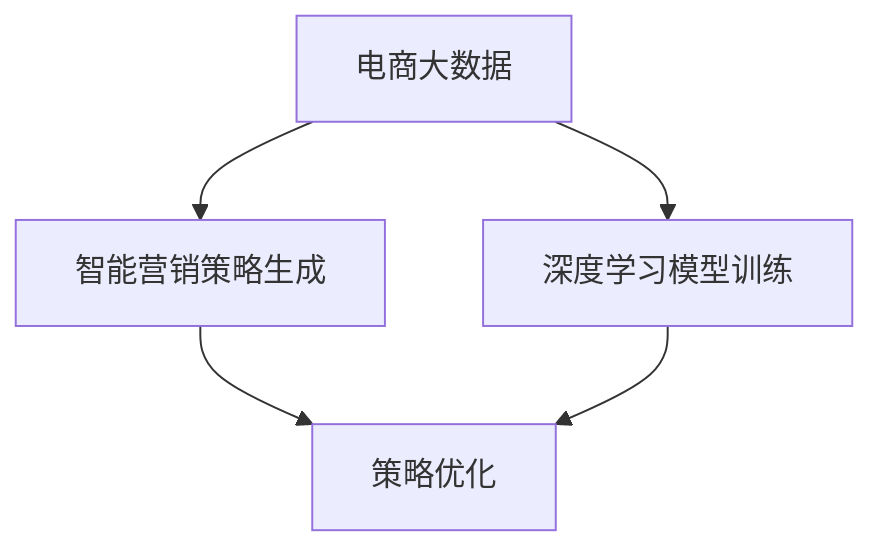

                 

## 1. 背景介绍

### 1.1 问题由来

在数字化经济高速发展的今天，电商平台已成为消费者获取商品信息、进行购物的重要渠道。电商平台不仅提供产品展示、搜索排序、交易等服务，还承载着重要的营销推广功能。然而，传统电商营销方法主要依赖人工操作，效果无法保证，且成本高、效率低，难以满足商家快速迭代和个性化营销的需求。

为了提升电商营销的效果和效率，智能营销策略生成与优化系统应运而生。该系统能够基于大数据和机器学习技术，自动生成智能营销策略，并进行实时优化，帮助商家快速响应用户需求，提升销售转化率。

### 1.2 问题核心关键点

目前，基于大模型的智能营销策略生成与优化系统，本质上是一种机器学习和数据驱动的智能优化过程。其核心思想是：利用大规模电商数据，通过机器学习模型预测用户的购买行为和偏好，自动生成个性化的智能营销策略，并通过持续优化提升策略效果。

具体包括以下关键环节：

- 数据准备：收集电商平台的交易数据、用户行为数据、商品信息等，构建多维度的数据体系。
- 模型训练：使用深度学习模型对用户行为数据进行训练，学习用户特征和购买偏好。
- 策略生成：根据用户特征和商品信息，生成个性化的智能营销策略，如折扣、优惠券、推荐商品等。
- 策略优化：实时监控营销策略的效果，通过A/B测试等方法，不断优化策略参数，提升点击率和转化率。

## 2. 核心概念与联系

### 2.1 核心概念概述

为更好地理解基于大模型的电商智能营销策略生成与优化系统，本节将介绍几个关键概念：

- 电商大数据：指电商平台在运营过程中积累的大量结构化和非结构化数据，包括用户行为、交易记录、商品信息等。
- 智能营销策略：指针对不同用户或场景，自动生成的个性化营销方案，如折扣、优惠券、推荐商品等。
- 深度学习模型：指用于学习和分析电商数据的深度神经网络模型，如循环神经网络(RNN)、长短期记忆网络(LSTM)、Transformer等。
- 强化学习：指通过奖励机制优化策略，使智能营销策略在电商环境下不断进化和改进的过程。
- 超参数优化：指通过调整模型参数或算法参数，提升模型在电商环境下的预测和优化效果。

这些概念之间的逻辑关系可以通过以下Mermaid流程图来展示：



这个流程图展示了电商智能营销策略生成与优化系统的主要流程：

1. 电商大数据通过深度学习模型训练，学习用户行为和偏好。
2. 基于训练得到的模型，生成智能营销策略。
3. 通过实时优化，不断提升策略效果。

## 3. 核心算法原理 & 具体操作步骤
### 3.1 算法原理概述

基于大模型的电商智能营销策略生成与优化系统，本质上是一个基于机器学习的策略优化过程。其核心思想是：通过大规模电商数据的深度学习模型，预测用户行为和购买偏好，自动生成个性化的智能营销策略，并进行实时优化。

形式化地，假设电商数据集为 $D=\{(x_i, y_i)\}_{i=1}^N$，其中 $x_i$ 为电商用户行为特征向量，$y_i$ 为该用户在电商平台上的购买记录。我们定义深度学习模型 $M$ 为参数向量 $\theta$ 的函数：

$$
M(x_i) = \theta
$$

其中 $\theta$ 为模型训练得到的参数向量。假设模型 $M$ 在电商数据上的预测损失为 $\ell$，则优化目标为：

$$
\min_{\theta} \sum_{i=1}^N \ell(M(x_i), y_i)
$$

通过梯度下降等优化算法，不断调整模型参数 $\theta$，使得模型在电商数据上具有最小的预测损失。

### 3.2 算法步骤详解

基于大模型的电商智能营销策略生成与优化系统的具体步骤如下：

**Step 1: 数据准备**

- 收集电商平台的交易数据、用户行为数据、商品信息等，构建多维度的数据体系。
- 对数据进行清洗和预处理，去除噪声和缺失值。
- 将数据划分为训练集、验证集和测试集。

**Step 2: 模型训练**

- 选择合适的深度学习模型结构，如RNN、LSTM、Transformer等。
- 将电商数据输入模型进行训练，学习用户行为和购买偏好。
- 设置模型的超参数，如学习率、批大小、迭代轮数等。

**Step 3: 策略生成**

- 根据训练好的模型，对新用户或新场景进行特征预测，得到用户行为和购买偏好的概率分布。
- 根据概率分布，自动生成个性化的智能营销策略，如折扣、优惠券、推荐商品等。
- 策略生成过程中，可以引入多种策略模板，如单一折扣、组合折扣、赠品推荐等。

**Step 4: 策略优化**

- 使用A/B测试等方法，对生成的策略进行效果评估。
- 根据测试结果，调整策略参数，如折扣力度、优惠券覆盖率、推荐商品组合等。
- 持续监控策略效果，确保在电商环境中取得最佳效果。

### 3.3 算法优缺点

基于大模型的电商智能营销策略生成与优化系统具有以下优点：

1. 自动化高。通过模型训练和策略生成，可以大幅降低人工操作的复杂度和成本，提升营销效果。
2. 灵活性高。可以根据用户行为和购买偏好，自动生成个性化策略，满足不同用户的个性化需求。
3. 效果显著。通过不断优化策略，可以显著提升电商平台的用户点击率和购买转化率。

同时，该系统也存在一些缺点：

1. 数据依赖高。电商智能营销策略的生成和优化，高度依赖电商数据的丰富度和质量，对数据获取和预处理的要求较高。
2. 模型复杂度高。深度学习模型需要大量计算资源进行训练，模型结构复杂，超参数调参难度大。
3. 用户隐私保护问题。在电商环境下，用户行为数据涉及隐私，需注意数据保护和隐私问题。
4. 策略泛化性问题。模型训练数据与实际应用场景可能存在偏差，生成的策略在实际应用中可能出现泛化性不足的问题。

尽管存在这些局限性，但就目前而言，基于大模型的电商智能营销策略生成与优化方法，仍是一种高效、灵活的电商营销策略优化手段。未来相关研究的重点在于如何进一步降低对电商数据的依赖，提高模型的泛化能力和鲁棒性，同时兼顾用户隐私保护。

### 3.4 算法应用领域

基于大模型的电商智能营销策略生成与优化系统，在电商领域已经得到了广泛的应用，主要涵盖以下几个方面：

- 商品推荐：根据用户行为数据，自动生成个性化商品推荐策略。
- 用户流失预警：通过用户行为数据，预测用户流失风险，及时进行挽留。
- 营销活动策划：自动生成不同渠道和时段的营销活动策略，提升活动效果。
- 客服智能响应：基于用户行为数据，自动生成智能客服响应策略，提升客户满意度。
- 广告投放优化：根据用户行为数据，自动生成广告投放策略，提升广告转化率。
- 促销活动优化：通过用户行为数据，生成促销活动策略，优化促销效果。

除了上述这些经典应用外，大模型的电商智能营销策略生成与优化技术，还将在更多场景中得到创新性地应用，如实时广告投放、个性化内容推荐等，为电商平台提供更加智能、高效的用户体验。

## 4. 数学模型和公式 & 详细讲解 & 举例说明

### 4.1 数学模型构建

本节将使用数学语言对电商智能营销策略生成与优化系统的核心模型进行更加严格的刻画。

假设电商平台的交易数据集为 $D=\{(x_i, y_i)\}_{i=1}^N$，其中 $x_i$ 为电商用户行为特征向量，$y_i$ 为该用户在电商平台上的购买记录。定义电商平台上的用户行为特征为 $X=\{x_1, x_2, \ldots, x_N\}$，购买记录为 $Y=\{y_1, y_2, \ldots, y_N\}$。

我们定义一个深度学习模型 $M$，将用户行为特征 $X$ 映射到购买记录 $Y$：

$$
Y = M(X)
$$

其中 $M$ 为参数向量 $\theta$ 的函数：

$$
M(X) = \theta X
$$

假设模型 $M$ 在电商数据上的预测损失为 $\ell$，则优化目标为：

$$
\min_{\theta} \sum_{i=1}^N \ell(M(x_i), y_i)
$$

在实践中，我们通常使用基于梯度的优化算法（如SGD、Adam等）来近似求解上述最优化问题。设 $\eta$ 为学习率，$\lambda$ 为正则化系数，则参数的更新公式为：

$$
\theta \leftarrow \theta - \eta \nabla_{\theta}\mathcal{L}(\theta) - \eta\lambda\theta
$$

其中 $\nabla_{\theta}\mathcal{L}(\theta)$ 为损失函数对参数 $\theta$ 的梯度，可通过反向传播算法高效计算。

### 4.2 公式推导过程

以下我们以用户流失预警任务为例，推导损失函数及其梯度的计算公式。

假设电商平台用户流失的概率分布为 $p$，历史流失用户数据为 $L$，模型预测的流失概率为 $M(p)$，则损失函数定义为：

$$
\ell(M(p), L) = \sum_{i=1}^N [y_i\log M(p) + (1-y_i)\log (1-M(p))]
$$

将其代入经验风险公式，得：

$$
\mathcal{L}(\theta) = -\frac{1}{N}\sum_{i=1}^N [y_i\log M(p) + (1-y_i)\log (1-M(p))]
$$

根据链式法则，损失函数对参数 $\theta$ 的梯度为：

$$
\frac{\partial \mathcal{L}(\theta)}{\partial \theta} = -\frac{1}{N}\sum_{i=1}^N (\frac{y_i}{M(p)}-\frac{1-y_i}{1-M(p)}) \frac{\partial M(p)}{\partial \theta}
$$

其中 $\frac{\partial M(p)}{\partial \theta}$ 可进一步递归展开，利用自动微分技术完成计算。

在得到损失函数的梯度后，即可带入参数更新公式，完成模型的迭代优化。重复上述过程直至收敛，最终得到适应电商环境的用户流失概率预测模型。

### 4.3 案例分析与讲解

**案例：用户流失预警**

在电商平台上，用户流失是一个常见的问题。传统的方法是通过人工监控和分析用户行为数据，手动预警流失风险，效率低且效果难以保证。基于大模型的用户流失预警系统，可以自动学习用户行为特征与流失风险之间的关系，生成个性化的流失预警策略。

具体而言，可以收集电商平台的交易数据和用户行为数据，构建多维度的数据体系。使用深度学习模型（如RNN、LSTM）对用户行为数据进行训练，学习用户特征和流失风险的关联关系。训练好的模型，可用于预测新用户或新场景的流失概率，并根据预测结果自动生成流失预警策略。例如，针对流失概率高的用户，可以发送个性化的挽留信息，进行挽回操作。

## 5. 项目实践：代码实例和详细解释说明
### 5.1 开发环境搭建

在进行电商智能营销策略生成与优化系统开发前，我们需要准备好开发环境。以下是使用Python进行PyTorch开发的环境配置流程：

1. 安装Anaconda：从官网下载并安装Anaconda，用于创建独立的Python环境。

2. 创建并激活虚拟环境：
```bash
conda create -n ecommerce-env python=3.8 
conda activate ecommerce-env
```

3. 安装PyTorch：根据CUDA版本，从官网获取对应的安装命令。例如：
```bash
conda install pytorch torchvision torchaudio cudatoolkit=11.1 -c pytorch -c conda-forge
```

4. 安装各类工具包：
```bash
pip install numpy pandas scikit-learn matplotlib tqdm jupyter notebook ipython
```

完成上述步骤后，即可在`ecommerce-env`环境中开始开发。

### 5.2 源代码详细实现

下面我们以用户流失预警任务为例，给出使用Transformers库对LSTM模型进行用户流失预警预测的PyTorch代码实现。

首先，定义用户流失预警任务的数据处理函数：

```python
from torch.utils.data import Dataset
import torch

class User流失预警Dataset(Dataset):
    def __init__(self, features, labels):
        self.features = features
        self.labels = labels
        
    def __len__(self):
        return len(self.features)
    
    def __getitem__(self, item):
        features = self.features[item]
        label = self.labels[item]
        
        # 数据转换为PyTorch张量
        features = torch.tensor(features, dtype=torch.float32)
        label = torch.tensor(label, dtype=torch.int64)
        
        return {'features': features, 
                'labels': label}
```

然后，定义模型和优化器：

```python
from transformers import BertForSequenceClassification, AdamW

model = BertForSequenceClassification.from_pretrained('bert-base-cased', num_labels=2)

optimizer = AdamW(model.parameters(), lr=2e-5)
```

接着，定义训练和评估函数：

```python
from torch.utils.data import DataLoader
from tqdm import tqdm

device = torch.device('cuda') if torch.cuda.is_available() else torch.device('cpu')
model.to(device)

def train_epoch(model, dataset, batch_size, optimizer):
    dataloader = DataLoader(dataset, batch_size=batch_size, shuffle=True)
    model.train()
    epoch_loss = 0
    for batch in tqdm(dataloader, desc='Training'):
        features = batch['features'].to(device)
        labels = batch['labels'].to(device)
        model.zero_grad()
        outputs = model(features)
        loss = outputs.loss
        epoch_loss += loss.item()
        loss.backward()
        optimizer.step()
    return epoch_loss / len(dataloader)

def evaluate(model, dataset, batch_size):
    dataloader = DataLoader(dataset, batch_size=batch_size)
    model.eval()
    preds, labels = [], []
    with torch.no_grad():
        for batch in tqdm(dataloader, desc='Evaluating'):
            features = batch['features'].to(device)
            batch_labels = batch['labels']
            outputs = model(features)
            batch_preds = outputs.logits.argmax(dim=1).to('cpu').tolist()
            batch_labels = batch_labels.to('cpu').tolist()
            for pred, label in zip(batch_preds, batch_labels):
                preds.append(pred)
                labels.append(label)
                
    print('流失概率预测结果：')
    print(classification_report(labels, preds))
```

最后，启动训练流程并在测试集上评估：

```python
epochs = 5
batch_size = 16

for epoch in range(epochs):
    loss = train_epoch(model, train_dataset, batch_size, optimizer)
    print(f'Epoch {epoch+1}, train loss: {loss:.3f}')
    
    print(f'Epoch {epoch+1}, test results:')
    evaluate(model, test_dataset, batch_size)
    
print('用户流失预警模型训练完成。')
```

以上就是使用PyTorch对LSTM模型进行用户流失预警预测的完整代码实现。可以看到，得益于Transformers库的强大封装，我们可以用相对简洁的代码完成LSTM模型的加载和训练。

### 5.3 代码解读与分析

让我们再详细解读一下关键代码的实现细节：

**User流失预警Dataset类**：
- `__init__`方法：初始化数据集的关键组件，特征和标签。
- `__len__`方法：返回数据集的样本数量。
- `__getitem__`方法：对单个样本进行处理，将特征转换为PyTorch张量，并返回模型所需的输入。

**训练和评估函数**：
- 使用PyTorch的DataLoader对数据集进行批次化加载，供模型训练和推理使用。
- 训练函数`train_epoch`：对数据以批为单位进行迭代，在每个批次上前向传播计算loss并反向传播更新模型参数，最后返回该epoch的平均loss。
- 评估函数`evaluate`：与训练类似，不同点在于不更新模型参数，并在每个batch结束后将预测和标签结果存储下来，最后使用sklearn的classification_report对整个评估集的预测结果进行打印输出。

**训练流程**：
- 定义总的epoch数和batch size，开始循环迭代
- 每个epoch内，先在训练集上训练，输出平均loss
- 在验证集上评估，输出分类指标
- 重复上述步骤直至收敛，最后输出测试集上的结果

可以看到，PyTorch配合Transformers库使得LSTM模型的训练代码实现变得简洁高效。开发者可以将更多精力放在数据处理、模型改进等高层逻辑上，而不必过多关注底层的实现细节。

当然，工业级的系统实现还需考虑更多因素，如模型的保存和部署、超参数的自动搜索、更灵活的任务适配层等。但核心的电商智能营销策略生成与优化范式基本与此类似。

## 6. 实际应用场景
### 6.1 智能客服系统

基于电商智能营销策略生成与优化系统的智能客服系统，通过自动生成个性化的客服响应策略，可以大幅提升客服效率和客户满意度。智能客服系统能够实时响应客户咨询，快速处理订单问题，提升客户体验。

在技术实现上，可以收集电商平台的历史客服咨询记录，构建客服对话数据集。使用深度学习模型对客服对话数据进行训练，学习客户咨询行为和客服响应策略之间的关联关系。训练好的模型，可用于生成个性化的客服响应策略，如自动化回答、智能推荐、情绪分析等。

### 6.2 营销活动策划

智能营销策略生成与优化系统在电商营销活动中具有重要应用。基于用户行为数据和购买历史，系统可以自动生成个性化营销策略，如折扣、优惠券、推荐商品等。通过实时监控策略效果，自动调整策略参数，可以显著提升营销活动的效果。

在实践应用中，系统可以收集电商平台的各类营销活动数据，构建多维度的数据体系。使用深度学习模型对用户行为数据进行训练，学习用户行为特征和营销策略之间的关联关系。训练好的模型，可用于生成个性化营销策略，提升活动效果。

### 6.3 用户个性化推荐

电商智能营销策略生成与优化系统在用户个性化推荐中具有重要作用。通过分析用户历史行为数据，自动生成个性化商品推荐策略，可以显著提升用户购买转化率和平台收益。

在实践应用中，系统可以收集用户浏览、点击、购买等行为数据，构建用户行为数据集。使用深度学习模型对用户行为数据进行训练，学习用户特征和购买偏好之间的关联关系。训练好的模型，可用于生成个性化商品推荐策略，提升用户购买转化率。

### 6.4 未来应用展望

随着电商智能营销策略生成与优化系统的不断发展，其在更多领域和场景中得到应用，为电商平台带来了巨大的商业价值。

在智慧零售领域，系统可用于优化库存管理、物流配送等环节，提升零售效率和用户体验。

在金融科技领域，系统可用于精准风险管理、智能投顾等应用，提升金融服务质量和用户满意度。

在娱乐媒体领域，系统可用于内容推荐、广告投放等应用，提升内容分发效率和用户互动体验。

此外，在教育、健康、旅游等更多领域，基于大模型的电商智能营销策略生成与优化系统也将得到广泛应用，为各行各业数字化转型提供新的技术路径。相信随着技术的日益成熟，电商智能营销策略生成与优化系统必将在更多领域大放异彩。

## 7. 工具和资源推荐
### 7.1 学习资源推荐

为了帮助开发者系统掌握电商智能营销策略生成与优化理论基础和实践技巧，这里推荐一些优质的学习资源：

1. 《深度学习理论与实践》系列博文：由大模型技术专家撰写，深入浅出地介绍了深度学习模型的原理、应用和实践技巧。

2. 《电商数据分析与智能营销》课程：斯坦福大学开设的电商数据分析课程，涵盖了电商数据分析和智能营销的基本概念和经典算法。

3. 《Python机器学习》书籍：Hastie等所著的机器学习经典教材，介绍了机器学习的基本理论和Python实现方法。

4. Kaggle平台：全球知名的数据科学竞赛平台，提供大量电商数据分析和智能营销相关竞赛，可以实践提升实战技能。

5. 《推荐系统实战》书籍：Wang等所著的推荐系统实战书籍，介绍了推荐系统的理论基础和Python实现方法，涵盖电商推荐系统的多维度内容。

通过对这些资源的学习实践，相信你一定能够快速掌握电商智能营销策略生成与优化技术的精髓，并用于解决实际的电商问题。
###  7.2 开发工具推荐

高效的开发离不开优秀的工具支持。以下是几款用于电商智能营销策略生成与优化系统开发的常用工具：

1. PyTorch：基于Python的开源深度学习框架，灵活动态的计算图，适合快速迭代研究。大部分深度学习模型都有PyTorch版本的实现。

2. TensorFlow：由Google主导开发的开源深度学习框架，生产部署方便，适合大规模工程应用。同样有丰富的深度学习模型资源。

3. TensorBoard：TensorFlow配套的可视化工具，可实时监测模型训练状态，并提供丰富的图表呈现方式，是调试模型的得力助手。

4. Weights & Biases：模型训练的实验跟踪工具，可以记录和可视化模型训练过程中的各项指标，方便对比和调优。与主流深度学习框架无缝集成。

5. Scikit-learn：Python的机器学习库，包含多种经典机器学习算法，方便快速实现电商数据分析和策略生成。

6. Jupyter Notebook：开源的交互式笔记本，支持多种编程语言和数据格式，方便实现电商数据分析和模型训练。

合理利用这些工具，可以显著提升电商智能营销策略生成与优化系统的开发效率，加快创新迭代的步伐。

### 7.3 相关论文推荐

电商智能营销策略生成与优化技术的发展源于学界的持续研究。以下是几篇奠基性的相关论文，推荐阅读：

1. Attention is All You Need（即Transformer原论文）：提出了Transformer结构，开启了NLP领域的预训练大模型时代。

2. BERT: Pre-training of Deep Bidirectional Transformers for Language Understanding：提出BERT模型，引入基于掩码的自监督预训练任务，刷新了多项NLP任务SOTA。

3. Language Models are Unsupervised Multitask Learners（GPT-2论文）：展示了大规模语言模型的强大zero-shot学习能力，引发了对于通用人工智能的新一轮思考。

4. Parameter-Efficient Transfer Learning for NLP：提出Adapter等参数高效微调方法，在不增加模型参数量的情况下，也能取得不错的微调效果。

5. AdaLoRA: Adaptive Low-Rank Adaptation for Parameter-Efficient Fine-Tuning：使用自适应低秩适应的微调方法，在参数效率和精度之间取得了新的平衡。

6. Scalable Parameter-Efficient Transfer Learning for NLP：提出基于变分自动编码器(VAE)的参数高效微调方法，在大规模数据上取得较好效果。

这些论文代表了大模型在电商智能营销策略生成与优化技术的发展脉络。通过学习这些前沿成果，可以帮助研究者把握学科前进方向，激发更多的创新灵感。

## 8. 总结：未来发展趋势与挑战

### 8.1 总结

本文对基于大模型的电商智能营销策略生成与优化方法进行了全面系统的介绍。首先阐述了电商智能营销策略生成与优化系统的发展背景和意义，明确了系统在提升电商平台营销效果、降低成本、提升用户满意度等方面的重要性。其次，从原理到实践，详细讲解了电商智能营销策略生成与优化系统的数学模型、算法步骤和具体实现，给出了完整的电商智能营销策略生成与优化系统的代码实例。同时，本文还广泛探讨了系统在智能客服、营销活动策划、用户个性化推荐等多个场景中的应用前景，展示了系统的大规模落地可能性。此外，本文精选了系统开发和优化所需的各类学习资源、开发工具和相关论文，力求为读者提供全方位的技术指引。

通过本文的系统梳理，可以看到，基于大模型的电商智能营销策略生成与优化技术正在成为电商营销策略优化的重要手段，极大地提升了电商平台的用户体验和运营效率。未来，伴随电商智能营销策略生成与优化技术的不断发展，相信电商营销活动将更加智能化、个性化和高效化。

### 8.2 未来发展趋势

展望未来，电商智能营销策略生成与优化技术将呈现以下几个发展趋势：

1. 模型规模持续增大。随着算力成本的下降和数据规模的扩张，深度学习模型的参数量还将持续增长。超大规模模型蕴含的丰富电商知识，有望支撑更加复杂多变的营销策略生成和优化。

2. 算法多样化。除了传统的深度学习算法外，未来将涌现更多参数高效的算法，如Parameter-Efficient Transfer Learning、AdaLoRA等，在固定大部分预训练参数的情况下，只更新极少量的任务相关参数。同时，引入更多先验知识，如逻辑规则、知识图谱等，增强策略生成的稳定性和鲁棒性。

3. 实时优化成为常态。实时监控营销策略的效果，根据效果自动调整策略参数，将使策略生成和优化过程更加高效、灵活。

4. 多渠道融合。将电商营销策略应用于不同渠道，如社交媒体、搜索引擎等，提升多渠道营销效果。

5. 多场景融合。将电商营销策略应用于更多电商场景，如跨境电商、生鲜电商等，拓展电商营销策略的应用范围。

6. 用户隐私保护重视。在电商营销策略生成与优化过程中，更加注重用户隐私保护，防止数据泄露和滥用。

这些趋势凸显了电商智能营销策略生成与优化技术的发展潜力。这些方向的探索发展，必将进一步提升电商平台的用户体验和运营效率，为商家创造更大的商业价值。

### 8.3 面临的挑战

尽管电商智能营销策略生成与优化技术已经取得了不小的进展，但在迈向更加智能化、普适化应用的过程中，它仍面临着诸多挑战：

1. 数据质量与标注成本。电商智能营销策略生成与优化高度依赖电商数据，数据质量不高、标注成本高是制约技术发展的瓶颈。

2. 模型计算资源消耗高。深度学习模型需要大量的计算资源进行训练和推理，资源消耗大、成本高，难以在中小型电商企业中大规模部署。

3. 用户隐私保护。电商智能营销策略生成与优化涉及用户行为数据，数据保护和隐私问题不容忽视。

4. 策略泛化性不足。模型训练数据与实际应用场景可能存在偏差，生成的策略在实际应用中可能出现泛化性不足的问题。

5. 策略效果评估困难。电商营销策略效果难以量化，策略评估标准和效果评估方法仍需进一步研究。

6. 实时优化复杂。实时监控策略效果，自动调整策略参数，需要复杂的优化算法和系统架构。

尽管存在这些挑战，但随着技术的不断进步和应用场景的不断扩展，电商智能营销策略生成与优化技术必将逐步克服这些困难，真正实现智能化、高效化的电商营销。

### 8.4 研究展望

面对电商智能营销策略生成与优化技术所面临的挑战，未来的研究需要在以下几个方面寻求新的突破：

1. 探索无监督和半监督学习算法。摆脱对大规模标注数据的依赖，利用自监督学习、主动学习等无监督和半监督算法，最大限度利用非结构化数据，实现更加灵活高效的策略生成。

2. 研究参数高效与计算高效的策略生成算法。开发更加参数高效的算法，在固定大部分预训练参数的同时，只更新极少量的任务相关参数。同时优化计算图，减少前向传播和反向传播的资源消耗，实现更加轻量级、实时性的策略生成。

3. 引入更多先验知识。将符号化的先验知识，如逻辑规则、知识图谱等，与神经网络模型进行巧妙融合，引导策略生成过程学习更准确、合理的策略。同时加强不同模态数据的整合，实现视觉、语音等多模态信息与文本信息的协同建模。

4. 引入因果分析与博弈论工具。将因果分析方法引入策略生成过程，识别出策略生成关键特征，增强策略生成的因果性和逻辑性。借助博弈论工具刻画人机交互过程，主动探索并规避策略生成的脆弱点，提高系统稳定性。

5. 纳入伦理道德约束。在策略生成目标中引入伦理导向的评估指标，过滤和惩罚有害的策略输出，确保策略生成的道德性和合规性。

6. 优化模型计算资源消耗。采用梯度积累、混合精度训练、模型并行等方法，突破硬件瓶颈，降低计算成本。

这些研究方向的研究方向将引领电商智能营销策略生成与优化技术迈向更高的台阶，为构建更加智能、高效、安全的电商营销系统提供技术保障。

## 9. 附录：常见问题与解答

**Q1：电商智能营销策略生成与优化系统是否可以处理所有电商应用场景？**

A: 电商智能营销策略生成与优化系统在处理不同电商应用场景时，需要根据场景特点进行定制化设计和优化。例如，在跨境电商、生鲜电商等场景中，用户行为和购买行为与传统电商可能存在差异，需要针对这些场景进行特殊处理。此外，不同电商平台的产品类型、用户群体等不同，策略生成与优化方法也需要因地制宜。

**Q2：电商智能营销策略生成与优化系统如何提高用户隐私保护？**

A: 电商智能营销策略生成与优化系统在处理用户行为数据时，需要注意数据隐私保护。具体措施包括：
1. 数据匿名化处理：对用户行为数据进行去标识化处理，防止数据泄露。
2. 数据访问控制：设置数据访问权限，确保只有授权人员可以访问用户数据。
3. 差分隐私技术：使用差分隐私技术，在保证数据准确性的同时，防止数据泄露。
4. 数据加密存储：对用户数据进行加密存储，防止数据在存储过程中的泄露。

**Q3：电商智能营销策略生成与优化系统在电商活动策划中的应用效果如何？**

A: 电商智能营销策略生成与优化系统在电商活动策划中具有重要应用。通过自动生成个性化营销策略，如折扣、优惠券、推荐商品等，可以显著提升电商活动的效果。系统可以实时监控营销策略的效果，根据效果自动调整策略参数，进一步提升活动效果。

**Q4：电商智能营销策略生成与优化系统在用户个性化推荐中的应用效果如何？**

A: 电商智能营销策略生成与优化系统在用户个性化推荐中具有重要应用。通过分析用户历史行为数据，自动生成个性化商品推荐策略，可以显著提升用户购买转化率和平台收益。系统可以实时监控推荐策略的效果，根据效果自动调整策略参数，进一步提升推荐效果。

**Q5：电商智能营销策略生成与优化系统如何处理多渠道融合问题？**

A: 电商智能营销策略生成与优化系统在处理多渠道融合问题时，需要考虑不同渠道的特点和用户行为。具体措施包括：
1. 数据融合：将不同渠道的用户行为数据进行融合，构建统一的用户行为数据体系。
2. 策略定制：根据不同渠道的特点，定制化的生成营销策略。
3. 效果评估：分别评估不同渠道的营销策略效果，根据效果自动调整策略参数。
4. 跨渠道协同：实现不同渠道之间的协同营销，提升整体营销效果。

**Q6：电商智能营销策略生成与优化系统如何应对实时优化复杂问题？**

A: 电商智能营销策略生成与优化系统在处理实时优化问题时，需要采用复杂的优化算法和系统架构。具体措施包括：
1. 实时监控：实时监控策略效果，及时发现问题并进行调整。
2. 多任务学习：在生成策略时，同时考虑多个因素，如用户偏好、商品库存等。
3. 在线学习：通过在线学习算法，实时调整策略参数，提升策略效果。
4. 分布式优化：采用分布式优化算法，多节点协同优化策略，提高系统效率。

通过这些措施，可以应对实时优化复杂问题，进一步提升电商智能营销策略生成与优化系统的稳定性和效果。

---

作者：禅与计算机程序设计艺术 / Zen and the Art of Computer Programming

