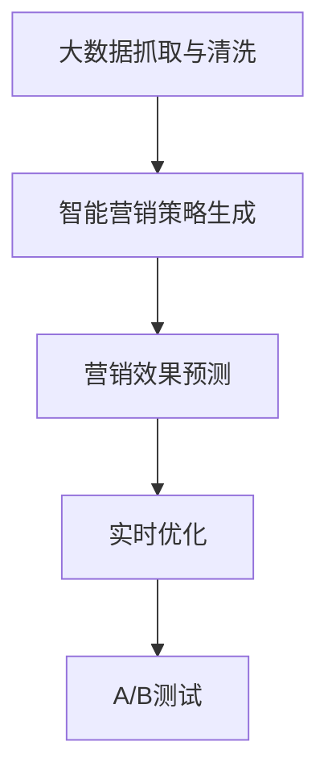

                 

## 1. 背景介绍

在当前高度竞争的电商市场中，商家面临着如何在海量商品和消费者中精准找到自己的目标客户，并制定有效的营销策略以提高销售转化率的巨大挑战。传统的基于规则或历史数据驱动的营销策略制定方法已难以满足日益增长的个性化需求。基于大模型的电商智能营销系统通过深度学习技术，能够自动生成和预测智能营销策略的效果，从而帮助商家快速制定和优化营销策略，提升销售业绩。

### 1.1 问题由来

随着电商市场的快速发展，消费者行为和偏好不断变化，商家需要更加灵活、高效的营销策略来应对市场的动态变化。传统的基于规则或经验驱动的营销策略制定方式已无法适应复杂多变的市场环境。为此，需要引入更智能、更高效的解决方案。

### 1.2 问题核心关键点

电商智能营销系统能够基于大数据和深度学习技术，自动生成个性化的营销策略，并对策略效果进行预测。其核心技术包括：
- 大数据抓取与清洗：从各电商平台收集用户行为数据，并对其进行清洗和标准化处理。
- 智能营销策略生成：通过大模型自动生成针对不同用户群体的个性化营销策略。
- 营销效果预测：使用大模型预测不同策略的效果，指导商家选择最优策略。
- 实时优化：根据预测效果实时调整策略，提升营销效果。

### 1.3 问题研究意义

大模型在电商智能营销中的应用，将显著提升营销策略的智能化和个性化水平，帮助商家更高效地达成销售目标。研究大模型在电商智能营销中的应用，对于推动电商营销的智能化进程，提升营销决策的科学性，具有重要意义：

1. 数据驱动的决策：大模型基于海量数据训练生成策略，比传统经验驱动更具数据科学性和准确性。
2. 策略生成效率：通过大模型自动生成策略，大幅提高策略生成的效率，缩短决策周期。
3. 精准预测效果：利用大模型进行策略效果预测，帮助商家精准选择最优策略，提高投资回报率。
4. 实时优化策略：根据实时反馈调整策略，实现动态优化，提高策略效果。

## 2. 核心概念与联系

### 2.1 核心概念概述

为更好地理解电商智能营销系统的核心技术，本节将介绍几个密切相关的核心概念：

- **大数据抓取与清洗**：从不同电商平台收集用户行为数据，并对数据进行去重、格式化等处理，形成可供模型训练的数据集。
- **智能营销策略生成**：利用大模型自动生成针对不同用户群体和场景的个性化营销策略，如折扣优惠、个性化推荐、社交媒体营销等。
- **营销效果预测**：使用大模型预测不同策略的效果，如转化率、点击率、用户满意度等，指导商家选择最优策略。
- **实时优化**：根据实时反馈调整策略，实现动态优化，提高策略效果。
- **A/B测试**：通过A/B测试验证策略效果，评估不同策略的优劣。

这些核心概念之间的逻辑关系可以通过以下Mermaid流程图来展示：



这个流程图展示了大模型在电商智能营销中的核心概念及其之间的联系：

1. 大数据抓取与清洗是大模型训练的基础。
2. 智能营销策略生成是核心功能，使用大模型自动生成个性化策略。
3. 营销效果预测是对策略效果的预测，指导商家选择最优策略。
4. 实时优化和A/B测试帮助进一步提升策略效果。

## 3. 核心算法原理 & 具体操作步骤
### 3.1 算法原理概述

电商智能营销系统基于监督学习进行大模型微调，核心原理是利用大模型学习用户行为与购买决策之间的关系，通过监督数据训练生成个性化策略，并对策略效果进行预测。

假设大数据抓取与清洗后的数据集为 $D=\{(x_i, y_i)\}_{i=1}^N$，其中 $x_i$ 表示用户行为数据， $y_i$ 表示购买决策。定义模型 $M_{\theta}$，其中 $\theta$ 为模型参数，则电商智能营销系统的优化目标是最小化经验风险，即找到最优参数：

$$
\theta^* = \mathop{\arg\min}_{\theta} \mathcal{L}(M_{\theta},D)
$$

其中 $\mathcal{L}$ 为针对电商营销任务设计的损失函数，用于衡量模型预测输出与真实标签之间的差异。常见的损失函数包括交叉熵损失、均方误差损失等。

通过梯度下降等优化算法，微调过程不断更新模型参数 $\theta$，最小化损失函数 $\mathcal{L}$，使得模型输出逼近真实标签。由于 $\theta$ 已经通过预训练获得了较好的初始化，因此即便在有限的数据集 $D$ 上进行微调，也能较快收敛到理想的模型参数 $\hat{\theta}$。

### 3.2 算法步骤详解

基于监督学习的大模型微调电商智能营销系统一般包括以下几个关键步骤：

**Step 1: 准备大数据和标注数据**
- 选择合适的电商平台和数据源，收集用户行为数据。
- 对收集到的数据进行清洗、格式化和标准化处理。
- 定义标注数据集 $D=\{(x_i,y_i)\}_{i=1}^N$，其中 $x_i$ 表示用户行为，$y_i$ 表示购买决策。

**Step 2: 添加任务适配层**
- 根据任务类型，在预训练模型顶层设计合适的输出层和损失函数。
- 对于分类任务，通常在顶层添加线性分类器和交叉熵损失函数。
- 对于生成任务，通常使用语言模型的解码器输出概率分布，并以负对数似然为损失函数。

**Step 3: 设置微调超参数**
- 选择合适的优化算法及其参数，如 AdamW、SGD 等，设置学习率、批大小、迭代轮数等。
- 设置正则化技术及强度，包括权重衰减、Dropout、Early Stopping等。
- 确定冻结预训练参数的策略，如仅微调顶层，或全部参数都参与微调。

**Step 4: 执行梯度训练**
- 将训练集数据分批次输入模型，前向传播计算损失函数。
- 反向传播计算参数梯度，根据设定的优化算法和学习率更新模型参数。
- 周期性在验证集上评估模型性能，根据性能指标决定是否触发 Early Stopping。
- 重复上述步骤直到满足预设的迭代轮数或 Early Stopping 条件。

**Step 5: 测试和部署**
- 在测试集上评估微调后模型 $M_{\hat{\theta}}$ 的性能，对比微调前后的精度提升。
- 使用微调后的模型对新样本进行推理预测，集成到实际的应用系统中。
- 持续收集新的数据，定期重新微调模型，以适应数据分布的变化。

以上是基于监督学习微调大模型进行电商智能营销系统的一般流程。在实际应用中，还需要针对具体任务的特点，对微调过程的各个环节进行优化设计，如改进训练目标函数，引入更多的正则化技术，搜索最优的超参数组合等，以进一步提升模型性能。

### 3.3 算法优缺点

基于监督学习的大模型微调电商智能营销系统具有以下优点：
1. 简单高效。只需准备少量标注数据，即可对预训练模型进行快速适配，获得较大的性能提升。
2. 通用适用。适用于各种电商营销任务，包括用户行为分析、个性化推荐、广告投放优化等，设计简单的任务适配层即可实现微调。
3. 效果显著。在学术界和工业界的诸多任务上，基于微调的方法已经刷新了多项电商营销任务SOTA。
4. 参数高效。利用参数高效微调技术，在固定大部分预训练权重不变的情况下，仍可取得不错的提升。
5. 实时优化。能够根据实时反馈快速调整策略，提高策略效果。

同时，该方法也存在一定的局限性：
1. 依赖标注数据。微调的效果很大程度上取决于标注数据的质量和数量，获取高质量标注数据的成本较高。
2. 迁移能力有限。当目标任务与预训练数据的分布差异较大时，微调的性能提升有限。
3. 负面效果传递。预训练模型的固有偏见、有害信息等，可能通过微调传递到下游任务，造成负面影响。
4. 可解释性不足。微调模型的决策过程通常缺乏可解释性，难以对其推理逻辑进行分析和调试。

尽管存在这些局限性，但就目前而言，基于监督学习的微调方法仍是大模型应用的最主流范式。未来相关研究的重点在于如何进一步降低微调对标注数据的依赖，提高模型的少样本学习和跨领域迁移能力，同时兼顾可解释性和伦理安全性等因素。

### 3.4 算法应用领域

基于大模型微调的监督学习方法，在电商智能营销领域已经得到了广泛的应用，具体包括：

- **用户行为分析**：分析用户浏览、点击、购买等行为，发现用户兴趣和消费模式，实现精准营销。
- **个性化推荐**：根据用户历史行为，生成个性化商品推荐，提升用户满意度和转化率。
- **广告投放优化**：通过分析广告投放效果，优化广告投放策略，提高广告点击率和转化率。
- **动态定价**：根据用户行为和市场动态，自动调整商品价格，提升销售业绩。
- **客户细分**：将用户划分为不同群体，实现差异化营销策略。

除了上述这些核心应用外，电商智能营销系统还被创新性地应用到更多场景中，如智能客服、库存管理、内容推荐等，为电商营销带来全新的突破。随着预训练模型和微调方法的不断进步，相信电商智能营销系统将在更多领域得到应用，为电商行业的智能化转型提供新的动力。

## 4. 数学模型和公式 & 详细讲解 & 举例说明

### 4.1 数学模型构建

本节将使用数学语言对基于监督学习的大模型微调电商智能营销系统进行更加严格的刻画。

假设大数据抓取与清洗后的数据集为 $D=\{(x_i, y_i)\}_{i=1}^N$，其中 $x_i$ 表示用户行为数据， $y_i$ 表示购买决策。定义模型 $M_{\theta}$，其中 $\theta$ 为模型参数。

定义模型 $M_{\theta}$ 在数据样本 $(x,y)$ 上的损失函数为 $\ell(M_{\theta}(x),y)$，则在数据集 $D$ 上的经验风险为：

$$
\mathcal{L}(\theta) = \frac{1}{N} \sum_{i=1}^N \ell(M_{\theta}(x_i),y_i)
$$

其中 $\ell$ 为电商营销任务设计的损失函数，用于衡量模型预测输出与真实标签之间的差异。常见的损失函数包括交叉熵损失、均方误差损失等。

通过梯度下降等优化算法，微调过程不断更新模型参数 $\theta$，最小化损失函数 $\mathcal{L}$，使得模型输出逼近真实标签。由于 $\theta$ 已经通过预训练获得了较好的初始化，因此即便在有限的数据集 $D$ 上进行微调，也能较快收敛到理想的模型参数 $\hat{\theta}$。

### 4.2 公式推导过程

以下我们以二分类任务为例，推导交叉熵损失函数及其梯度的计算公式。

假设模型 $M_{\theta}$ 在输入 $x$ 上的输出为 $\hat{y}=M_{\theta}(x) \in [0,1]$，表示样本属于正类的概率。真实标签 $y \in \{0,1\}$。则二分类交叉熵损失函数定义为：

$$
\ell(M_{\theta}(x),y) = -[y\log \hat{y} + (1-y)\log (1-\hat{y})]
$$

将其代入经验风险公式，得：

$$
\mathcal{L}(\theta) = -\frac{1}{N}\sum_{i=1}^N [y_i\log M_{\theta}(x_i)+(1-y_i)\log(1-M_{\theta}(x_i))]
$$

根据链式法则，损失函数对参数 $\theta_k$ 的梯度为：

$$
\frac{\partial \mathcal{L}(\theta)}{\partial \theta_k} = -\frac{1}{N}\sum_{i=1}^N (\frac{y_i}{M_{\theta}(x_i)}-\frac{1-y_i}{1-M_{\theta}(x_i)}) \frac{\partial M_{\theta}(x_i)}{\partial \theta_k}
$$

其中 $\frac{\partial M_{\theta}(x_i)}{\partial \theta_k}$ 可进一步递归展开，利用自动微分技术完成计算。

在得到损失函数的梯度后，即可带入参数更新公式，完成模型的迭代优化。重复上述过程直至收敛，最终得到适应电商营销任务的最优模型参数 $\theta^*$。

## 5. 项目实践：代码实例和详细解释说明

### 5.1 开发环境搭建

在进行微调实践前，我们需要准备好开发环境。以下是使用Python进行PyTorch开发的环境配置流程：

1. 安装Anaconda：从官网下载并安装Anaconda，用于创建独立的Python环境。

2. 创建并激活虚拟环境：
```bash
conda create -n pytorch-env python=3.8 
conda activate pytorch-env
```

3. 安装PyTorch：根据CUDA版本，从官网获取对应的安装命令。例如：
```bash
conda install pytorch torchvision torchaudio cudatoolkit=11.1 -c pytorch -c conda-forge
```

4. 安装Transformers库：
```bash
pip install transformers
```

5. 安装各类工具包：
```bash
pip install numpy pandas scikit-learn matplotlib tqdm jupyter notebook ipython
```

完成上述步骤后，即可在`pytorch-env`环境中开始微调实践。

### 5.2 源代码详细实现

下面我们以电商智能营销系统中的用户行为分析任务为例，给出使用Transformers库对BERT模型进行微调的PyTorch代码实现。

首先，定义用户行为分析任务的数据处理函数：

```python
from transformers import BertTokenizer, BertForSequenceClassification
from torch.utils.data import Dataset
import torch

class UserBehaviorDataset(Dataset):
    def __init__(self, behaviors, labels, tokenizer, max_len=128):
        self.behaviors = behaviors
        self.labels = labels
        self.tokenizer = tokenizer
        self.max_len = max_len
        
    def __len__(self):
        return len(self.behaviors)
    
    def __getitem__(self, item):
        behavior = self.behaviors[item]
        label = self.labels[item]
        
        encoding = self.tokenizer(behavior, return_tensors='pt', max_length=self.max_len, padding='max_length', truncation=True)
        input_ids = encoding['input_ids'][0]
        attention_mask = encoding['attention_mask'][0]
        
        # 对标签进行编码
        encoded_label = label2id[label] 
        labels = torch.tensor(encoded_label, dtype=torch.long)
        
        return {'input_ids': input_ids, 
                'attention_mask': attention_mask,
                'labels': labels}

# 标签与id的映射
label2id = {'buy': 0, 'click': 1, 'view': 2, 'search': 3, 'favor': 4}
id2label = {v: k for k, v in label2id.items()}

# 创建dataset
tokenizer = BertTokenizer.from_pretrained('bert-base-cased')

train_dataset = UserBehaviorDataset(train_behaviors, train_labels, tokenizer)
dev_dataset = UserBehaviorDataset(dev_behaviors, dev_labels, tokenizer)
test_dataset = UserBehaviorDataset(test_behaviors, test_labels, tokenizer)
```

然后，定义模型和优化器：

```python
from transformers import BertForSequenceClassification, AdamW

model = BertForSequenceClassification.from_pretrained('bert-base-cased', num_labels=len(label2id))

optimizer = AdamW(model.parameters(), lr=2e-5)
```

接着，定义训练和评估函数：

```python
from torch.utils.data import DataLoader
from tqdm import tqdm
from sklearn.metrics import classification_report

device = torch.device('cuda') if torch.cuda.is_available() else torch.device('cpu')
model.to(device)

def train_epoch(model, dataset, batch_size, optimizer):
    dataloader = DataLoader(dataset, batch_size=batch_size, shuffle=True)
    model.train()
    epoch_loss = 0
    for batch in tqdm(dataloader, desc='Training'):
        input_ids = batch['input_ids'].to(device)
        attention_mask = batch['attention_mask'].to(device)
        labels = batch['labels'].to(device)
        model.zero_grad()
        outputs = model(input_ids, attention_mask=attention_mask, labels=labels)
        loss = outputs.loss
        epoch_loss += loss.item()
        loss.backward()
        optimizer.step()
    return epoch_loss / len(dataloader)

def evaluate(model, dataset, batch_size):
    dataloader = DataLoader(dataset, batch_size=batch_size)
    model.eval()
    preds, labels = [], []
    with torch.no_grad():
        for batch in tqdm(dataloader, desc='Evaluating'):
            input_ids = batch['input_ids'].to(device)
            attention_mask = batch['attention_mask'].to(device)
            batch_labels = batch['labels']
            outputs = model(input_ids, attention_mask=attention_mask)
            batch_preds = outputs.logits.argmax(dim=2).to('cpu').tolist()
            batch_labels = batch_labels.to('cpu').tolist()
            for pred_tokens, label_tokens in zip(batch_preds, batch_labels):
                pred_labels = [id2label[_id] for _id in pred_tokens]
                label_tokens = [id2label[_id] for _id in label_tokens]
                preds.append(pred_labels[:len(label_tokens)])
                labels.append(label_tokens)
                
    print(classification_report(labels, preds))
```

最后，启动训练流程并在测试集上评估：

```python
epochs = 5
batch_size = 16

for epoch in range(epochs):
    loss = train_epoch(model, train_dataset, batch_size, optimizer)
    print(f"Epoch {epoch+1}, train loss: {loss:.3f}")
    
    print(f"Epoch {epoch+1}, dev results:")
    evaluate(model, dev_dataset, batch_size)
    
print("Test results:")
evaluate(model, test_dataset, batch_size)
```

以上就是使用PyTorch对BERT进行电商用户行为分析任务微调的完整代码实现。可以看到，得益于Transformers库的强大封装，我们可以用相对简洁的代码完成BERT模型的加载和微调。

### 5.3 代码解读与分析

让我们再详细解读一下关键代码的实现细节：

**UserBehaviorDataset类**：
- `__init__`方法：初始化行为、标签、分词器等关键组件。
- `__len__`方法：返回数据集的样本数量。
- `__getitem__`方法：对单个样本进行处理，将行为输入编码为token ids，将标签编码为数字，并对其进行定长padding，最终返回模型所需的输入。

**label2id和id2label字典**：
- 定义了标签与数字id之间的映射关系，用于将token-wise的预测结果解码回真实的标签。

**训练和评估函数**：
- 使用PyTorch的DataLoader对数据集进行批次化加载，供模型训练和推理使用。
- 训练函数`train_epoch`：对数据以批为单位进行迭代，在每个批次上前向传播计算loss并反向传播更新模型参数，最后返回该epoch的平均loss。
- 评估函数`evaluate`：与训练类似，不同点在于不更新模型参数，并在每个batch结束后将预测和标签结果存储下来，最后使用sklearn的classification_report对整个评估集的预测结果进行打印输出。

**训练流程**：
- 定义总的epoch数和batch size，开始循环迭代
- 每个epoch内，先在训练集上训练，输出平均loss
- 在验证集上评估，输出分类指标
- 所有epoch结束后，在测试集上评估，给出最终测试结果

可以看到，PyTorch配合Transformers库使得BERT微调的代码实现变得简洁高效。开发者可以将更多精力放在数据处理、模型改进等高层逻辑上，而不必过多关注底层的实现细节。

当然，工业级的系统实现还需考虑更多因素，如模型的保存和部署、超参数的自动搜索、更灵活的任务适配层等。但核心的微调范式基本与此类似。

## 6. 实际应用场景
### 6.1 智能客服系统

基于大模型微调的电商智能营销系统，可以广泛应用于智能客服系统的构建。传统客服往往需要配备大量人力，高峰期响应缓慢，且一致性和专业性难以保证。而使用微调后的电商智能营销系统，可以7x24小时不间断服务，快速响应客户咨询，用自然流畅的语言解答各类常见问题。

在技术实现上，可以收集电商平台的客服对话记录，将问题和最佳答复构建成监督数据，在此基础上对预训练电商智能营销模型进行微调。微调后的电商智能营销模型能够自动理解用户意图，匹配最合适的答复模板进行回复。对于客户提出的新问题，还可以接入检索系统实时搜索相关内容，动态组织生成回答。如此构建的智能客服系统，能大幅提升客户咨询体验和问题解决效率。

### 6.2 金融舆情监测

金融机构需要实时监测市场舆论动向，以便及时应对负面信息传播，规避金融风险。传统的人工监测方式成本高、效率低，难以应对网络时代海量信息爆发的挑战。基于大模型微调的电商智能营销系统，可以为金融舆情监测提供新的解决方案。

具体而言，可以收集金融领域相关的新闻、报道、评论等文本数据，并对其进行主题标注和情感标注。在此基础上对预训练电商智能营销模型进行微调，使其能够自动判断文本属于何种主题，情感倾向是正面、中性还是负面。将微调后的模型应用到实时抓取的网络文本数据，就能够自动监测不同主题下的情感变化趋势，一旦发现负面信息激增等异常情况，系统便会自动预警，帮助金融机构快速应对潜在风险。

### 6.3 个性化推荐系统

当前的推荐系统往往只依赖用户的历史行为数据进行物品推荐，无法深入理解用户的真实兴趣偏好。基于大模型微调的电商智能营销系统，可以更好地挖掘用户行为背后的语义信息，从而提供更精准、多样的推荐内容。

在实践中，可以收集用户浏览、点击、评论、分享等行为数据，提取和用户交互的物品标题、描述、标签等文本内容。将文本内容作为模型输入，用户的后续行为（如是否点击、购买等）作为监督信号，在此基础上微调预训练电商智能营销模型。微调后的模型能够从文本内容中准确把握用户的兴趣点。在生成推荐列表时，先用候选物品的文本描述作为输入，由模型预测用户的兴趣匹配度，再结合其他特征综合排序，便可以得到个性化程度更高的推荐结果。

### 6.4 未来应用展望

随着大模型和微调方法的不断发展，基于微调范式将在更多领域得到应用，为电商行业带来变革性影响。

在智慧医疗领域，基于微调的电商智能营销系统可以为医疗问答、病历分析、药物研发等应用提供新的解决方案。

在智能教育领域，微调技术可应用于作业批改、学情分析、知识推荐等方面，因材施教，促进教育公平，提高教学质量。

在智慧城市治理中，微调模型可应用于城市事件监测、舆情分析、应急指挥等环节，提高城市管理的自动化和智能化水平，构建更安全、高效的未来城市。

此外，在企业生产、社会治理、文娱传媒等众多领域，基于大模型微调的人工智能应用也将不断涌现，为经济社会发展注入新的动力。相信随着技术的日益成熟，微调方法将成为人工智能落地应用的重要范式，推动人工智能技术在垂直行业的规模化落地。

## 7. 工具和资源推荐
### 7.1 学习资源推荐

为了帮助开发者系统掌握大模型微调的理论基础和实践技巧，这里推荐一些优质的学习资源：

1. 《Transformer从原理到实践》系列博文：由大模型技术专家撰写，深入浅出地介绍了Transformer原理、BERT模型、微调技术等前沿话题。

2. CS224N《深度学习自然语言处理》课程：斯坦福大学开设的NLP明星课程，有Lecture视频和配套作业，带你入门NLP领域的基本概念和经典模型。

3. 《Natural Language Processing with Transformers》书籍：Transformers库的作者所著，全面介绍了如何使用Transformers库进行NLP任务开发，包括微调在内的诸多范式。

4. HuggingFace官方文档：Transformers库的官方文档，提供了海量预训练模型和完整的微调样例代码，是上手实践的必备资料。

5. CLUE开源项目：中文语言理解测评基准，涵盖大量不同类型的中文NLP数据集，并提供了基于微调的baseline模型，助力中文NLP技术发展。

通过对这些资源的学习实践，相信你一定能够快速掌握大模型微调的精髓，并用于解决实际的NLP问题。
###  7.2 开发工具推荐

高效的开发离不开优秀的工具支持。以下是几款用于大模型微调开发的常用工具：

1. PyTorch：基于Python的开源深度学习框架，灵活动态的计算图，适合快速迭代研究。大部分预训练语言模型都有PyTorch版本的实现。

2. TensorFlow：由Google主导开发的开源深度学习框架，生产部署方便，适合大规模工程应用。同样有丰富的预训练语言模型资源。

3. Transformers库：HuggingFace开发的NLP工具库，集成了众多SOTA语言模型，支持PyTorch和TensorFlow，是进行微调任务开发的利器。

4. Weights & Biases：模型训练的实验跟踪工具，可以记录和可视化模型训练过程中的各项指标，方便对比和调优。与主流深度学习框架无缝集成。

5. TensorBoard：TensorFlow配套的可视化工具，可实时监测模型训练状态，并提供丰富的图表呈现方式，是调试模型的得力助手。

6. Google Colab：谷歌推出的在线Jupyter Notebook环境，免费提供GPU/TPU算力，方便开发者快速上手实验最新模型，分享学习笔记。

合理利用这些工具，可以显著提升大模型微调任务的开发效率，加快创新迭代的步伐。

### 7.3 相关论文推荐

大模型和微调技术的发展源于学界的持续研究。以下是几篇奠基性的相关论文，推荐阅读：

1. Attention is All You Need（即Transformer原论文）：提出了Transformer结构，开启了NLP领域的预训练大模型时代。

2. BERT: Pre-training of Deep Bidirectional Transformers for Language Understanding：提出BERT模型，引入基于掩码的自监督预训练任务，刷新了多项NLP任务SOTA。

3. Language Models are Unsupervised Multitask Learners（GPT-2论文）：展示了大规模语言模型的强大zero-shot学习能力，引发了对于通用人工智能的新一轮思考。

4. Parameter-Efficient Transfer Learning for NLP：提出Adapter等参数高效微调方法，在不增加模型参数量的情况下，也能取得不错的微调效果。

5. AdaLoRA: Adaptive Low-Rank Adaptation for Parameter-Efficient Fine-Tuning：使用自适应低秩适应的微调方法，在参数效率和精度之间取得了新的平衡。

这些论文代表了大模型微调技术的发展脉络。通过学习这些前沿成果，可以帮助研究者把握学科前进方向，激发更多的创新灵感。

## 8. 总结：未来发展趋势与挑战

### 8.1 总结

本文对基于大模型的电商智能营销策略生成与效果预测系统进行了全面系统的介绍。首先阐述了电商智能营销系统的背景和研究意义，明确了微调在电商智能营销中的应用价值。其次，从原理到实践，详细讲解了微调的数学原理和关键步骤，给出了电商智能营销系统的完整代码实现。同时，本文还广泛探讨了微调方法在智能客服、金融舆情、个性化推荐等多个领域的应用前景，展示了微调范式的巨大潜力。此外，本文精选了微调技术的各类学习资源，力求为读者提供全方位的技术指引。

通过本文的系统梳理，可以看到，基于大模型的电商智能营销系统，利用深度学习技术，自动生成个性化营销策略，并对策略效果进行预测，显著提升了电商营销的智能化水平，帮助商家更高效地达成销售目标。未来，伴随大模型的不断发展，电商智能营销系统将进一步提升智能度和个性化水平，为电商行业的智能化转型提供新的动力。

### 8.2 未来发展趋势

展望未来，电商智能营销系统的未来发展趋势主要包括以下几个方面：

1. **更精准的个性化推荐**：随着深度学习技术的不断进步，电商智能营销系统能够更好地理解用户行为和兴趣，生成更加精准、个性化的推荐结果，提升用户满意度和转化率。

2. **动态定价和库存管理**：通过深度学习模型对市场动态进行实时预测，实现动态定价和库存优化，提高销售额和运营效率。

3. **多渠道整合营销**：利用深度学习模型整合多渠道营销数据，实现跨渠道协同优化，提升整体营销效果。

4. **实时客户体验优化**：基于深度学习模型实时分析客户行为数据，动态调整营销策略，提高客户满意度和忠诚度。

5. **自动化营销运营**：通过深度学习模型自动生成和优化营销内容，提升内容创意和投放效率。

6. **实时效果监控与优化**：利用深度学习模型实时监控营销活动效果，动态调整策略，实现闭环优化。

以上趋势凸显了电商智能营销系统的广阔前景。这些方向的探索发展，必将进一步提升电商营销的智能化水平，推动电商行业的数字化转型。

### 8.3 面临的挑战

尽管电商智能营销系统在大模型微调技术支持下取得了显著进展，但在迈向更加智能化、普适化应用的过程中，仍面临诸多挑战：

1. **标注成本高昂**：获取高质量标注数据成本高、周期长，成为制约微调效果提升的瓶颈。如何降低标注成本，优化标注流程，是未来需要突破的重要方向。

2. **模型泛化能力有限**：当电商智能营销系统面对不同市场、不同消费者群体时，模型的泛化性能可能受到影响。如何提升模型的泛化能力，以适应不同场景的需求，是未来研究的重要课题。

3. **实时性要求高**：电商营销活动需要实时响应市场变化，快速生成和调整策略。如何在保证效果的同时，实现实时性要求，是未来需要解决的技术难题。

4. **可解释性不足**：电商智能营销模型往往过于复杂，难以解释其内部工作机制和决策逻辑。如何提升模型的可解释性，增强用户的信任和接受度，是未来需要重视的方向。

5. **安全性和隐私保护**：电商智能营销模型可能涉及用户隐私数据，需要保障数据安全，防止数据泄露。如何在保护用户隐私的同时，提供优质的服务，是未来需要关注的重要问题。

6. **系统集成复杂**：电商智能营销系统需要与电商平台、广告平台等多方系统集成，集成复杂度较高。如何实现高效、稳定的系统集成，是未来需要解决的关键问题。

正视电商智能营销系统面临的这些挑战，积极应对并寻求突破，将是大模型微调技术走向成熟的关键。相信随着技术的发展和产业的推动，这些挑战终将逐一被克服，电商智能营销系统必将在电商行业中发挥更大的作用。

### 8.4 研究展望

面对电商智能营销系统所面临的种种挑战，未来的研究需要在以下几个方面寻求新的突破：

1. **少样本学习和自监督学习**：探索少样本学习和自监督学习的方法，降低对标注数据的依赖，提高模型的泛化能力。

2. **模型压缩和高效计算**：开发更加高效的计算模型，减少计算资源消耗，提高实时响应能力。

3. **多模态融合**：利用深度学习模型整合多模态数据，实现跨模态协同优化，提升整体营销效果。

4. **因果推断与强化学习**：引入因果推断和强化学习思想，增强电商智能营销系统的决策能力，提升效果预测的准确性和鲁棒性。

5. **安全性和隐私保护**：引入隐私保护技术，保障用户数据安全，提升用户信任。

6. **模型集成与部署优化**：开发更高效的系统集成与部署方法，提升系统的稳定性和可维护性。

这些研究方向的应用，将进一步推动电商智能营销系统的发展，实现更加智能化、高效化的电商营销。面向未来，电商智能营销系统需要在保持技术领先的同时，关注用户体验和业务价值，真正实现技术驱动的电商行业转型升级。

## 9. 附录：常见问题与解答

**Q1：电商智能营销系统是否适用于所有电商模式？**

A: 电商智能营销系统适用于大多数电商模式，但不同电商模式的用户行为和市场环境存在差异，需要针对具体场景进行优化调整。例如，B2B电商与B2C电商在用户行为和市场动态上存在较大差异，需要设计不同的营销策略。

**Q2：电商智能营销系统在落地部署时需要注意哪些问题？**

A: 电商智能营销系统在落地部署时，需要注意以下问题：

1. **数据质量控制**：确保输入数据的质量，减少数据噪声和偏差，提升模型效果。

2. **模型适配**：根据具体业务场景，对电商智能营销模型进行适配，提升模型效果和可解释性。

3. **实时计算资源**：电商营销活动需要实时响应市场变化，确保系统能够高效、稳定地运行。

4. **安全性与隐私保护**：保障用户数据安全，防止数据泄露和滥用，提升用户信任和接受度。

5. **监控与优化**：实时监控模型运行状态和营销效果，根据反馈动态调整策略，提升系统效果。

6. **系统集成**：确保电商智能营销系统与电商平台、广告平台等多方系统高效集成，提升系统可用性。

以上问题需要在系统设计和实现中综合考虑，确保电商智能营销系统能够在实际应用中发挥最佳效果。

**Q3：电商智能营销系统如何实现动态定价？**

A: 电商智能营销系统可以通过以下步骤实现动态定价：

1. **数据采集**：从电商平台收集实时销售数据，包括商品价格、库存、销量等。

2. **模型训练**：基于收集到的数据，训练动态定价模型，如线性回归、随机森林等。

3. **实时预测**：将实时数据输入动态定价模型，预测最优价格。

4. **策略调整**：根据预测结果，自动调整商品价格，实现动态定价。

5. **效果监控**：实时监控定价效果，根据反馈调整模型参数，优化定价策略。

动态定价模型需要结合市场动态和用户行为数据，实现实时定价优化。通过深度学习技术，电商智能营销系统能够更加精准地预测用户需求，动态调整商品价格，提升销售业绩。

**Q4：电商智能营销系统如何提高个性化推荐效果？**

A: 电商智能营销系统可以通过以下步骤提高个性化推荐效果：

1. **数据采集**：从电商平台收集用户行为数据，包括浏览记录、点击记录、购买记录等。

2. **模型训练**：基于收集到的数据，训练个性化推荐模型，如协同过滤、基于内容的推荐等。

3. **特征工程**：对用户行为数据进行特征提取和工程处理，提高模型效果。

4. **实时推荐**：根据用户行为数据实时生成推荐结果，推送给用户。

5. **效果监控**：实时监控推荐效果，根据反馈调整模型参数，优化推荐策略。

个性化推荐模型需要结合用户行为数据和商品属性数据，实现个性化推荐。通过深度学习技术，电商智能营销系统能够更好地理解用户兴趣和偏好，生成更加精准、个性化的推荐结果，提升用户满意度和转化率。

---

作者：禅与计算机程序设计艺术 / Zen and the Art of Computer Programming

