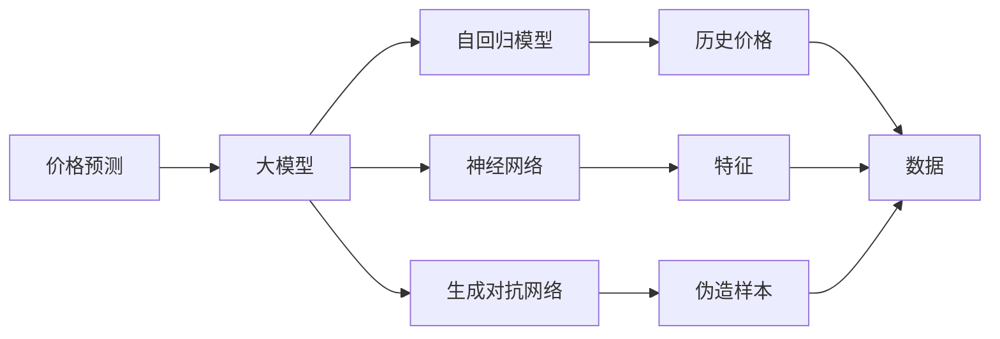

                 

# 探讨AI大模型在电商平台价格预测中的作用

> 关键词：
- 大模型
- 电商平台
- 价格预测
- 深度学习
- 自回归模型
- 神经网络
- 生成对抗网络

## 1. 背景介绍

随着电商平台的发展，用户对于商品价格的敏感度逐渐增强。合理的价格预测不仅能提升用户体验，还能增加电商平台的销售额。传统的价格预测方法往往依赖于手工特征提取和统计模型，难以应对商品价格动态变化和复杂市场环境。近年来，基于大模型的价格预测技术迅速发展，成为电商领域的一大利器。

本文将围绕AI大模型在电商平台价格预测中的作用进行探讨，首先介绍大模型在价格预测中的理论基础和优势，接着详细介绍几种常用的AI大模型架构和技术，最后结合实际案例进行具体分析，并展望未来电商价格预测的发展趋势。

## 2. 核心概念与联系

### 2.1 核心概念概述

在探讨价格预测之前，首先需要理解几个关键概念：

- 价格预测（Price Prediction）：利用历史数据和市场信息，对未来商品价格的趋势进行预测。
- 电商平台（E-commerce Platform）：通过互联网进行商品交易和服务提供的平台。
- 大模型（Large Model）：以自回归（如GPT）或自编码（如BERT）模型为代表的大规模预训练语言模型。
- 深度学习（Deep Learning）：基于神经网络的机器学习技术，具有强大的模式识别和预测能力。
- 自回归模型（Autoregressive Model）：一类通过预测序列中每个元素的模型，包括自回归（AR）、移动平均（MA）、自回归移动平均（ARMA）等。
- 神经网络（Neural Network）：一种模仿人类神经系统的计算模型，由大量神经元和连接构成。
- 生成对抗网络（Generative Adversarial Network, GAN）：一种通过对抗训练生成逼真样本的技术。

以上概念共同构成了电商平台价格预测的核心技术体系，具有紧密的联系和交互。

### 2.2 核心概念原理和架构的 Mermaid 流程图



这个流程图展示了核心概念之间的关系和架构：

1. 价格预测通过大模型进行预测。
2. 大模型可以是自回归模型、神经网络模型或生成对抗网络模型。
3. 自回归模型利用历史价格进行预测。
4. 神经网络通过提取特征进行预测。
5. 生成对抗网络用于生成伪造样本。
6. 数据是价格预测的输入，包括历史价格、特征和伪造样本。

## 3. 核心算法原理 & 具体操作步骤

### 3.1 算法原理概述

基于大模型的价格预测，本质上是利用大模型学习历史数据中的价格动态变化规律，通过深度学习和迁移学习的方式，对未来价格进行预测。

假设历史价格数据为 $D = \{p_{1}, p_{2}, \cdots, p_{N}\}$，其中 $p_i$ 表示第 $i$ 天的价格。利用大模型 $M$，可以建立价格预测模型 $P$，用于对未来价格 $p_{N+1}$ 进行预测。形式化地，预测模型的输入 $x_i = \{p_{1}, p_{2}, \cdots, p_{i}\}$，输出 $y_i = p_{i+1}$，则模型可以表示为：

$$
p_{N+1} = P(x_N)
$$

其中 $P$ 是模型函数，$x_N$ 是历史价格数据。

### 3.2 算法步骤详解

基于大模型的价格预测主要包括以下几个步骤：

**Step 1: 数据预处理和清洗**

1. 数据收集：从电商平台获取历史交易数据，包括时间、价格、销量等。
2. 数据清洗：处理缺失值、异常值，确保数据质量。
3. 数据划分：将数据分为训练集、验证集和测试集。

**Step 2: 构建大模型**

1. 选择模型架构：选择自回归模型、神经网络模型或生成对抗网络模型。
2. 模型训练：在大规模数据集上训练大模型，学习价格变化的规律。
3. 迁移学习：将训练好的大模型微调到价格预测任务上，进行参数调整和优化。

**Step 3: 预测价格**

1. 特征提取：利用训练好的大模型提取历史价格的特征。
2. 价格预测：使用训练好的模型进行价格预测。
3. 结果评估：利用测试集评估预测结果的准确性。

**Step 4: 模型部署**

1. 模型部署：将训练好的模型部署到电商平台的后端系统。
2. 实时预测：在电商平台的交易系统进行实时价格预测。
3. 模型更新：定期更新模型参数，确保预测结果的准确性。

### 3.3 算法优缺点

**优点**：

1. 预测准确性高：大模型通过学习历史数据中的价格变化规律，可以较好地预测未来价格。
2. 泛化能力强：大模型具备较强的泛化能力，能够适应不同类型和规模的电商平台。
3. 自动化程度高：利用大模型的自动化特征提取和预测功能，减少人工干预，提升预测效率。
4. 灵活性高：大模型可以根据需要，快速调整和优化，适应不同的价格预测需求。

**缺点**：

1. 数据依赖度高：预测结果依赖于历史数据的质量和数量，数据偏差可能导致预测误差。
2. 计算资源消耗大：大模型的训练和预测需要大量的计算资源，需要较高的硬件配置。
3. 模型复杂度高：大模型的参数量较大，复杂度高，容易出现过拟合问题。
4. 实时性要求高：电商平台需要实时预测价格，对大模型的响应速度要求较高。

### 3.4 算法应用领域

基于大模型的价格预测技术，可以应用于以下领域：

1. **电商平台**：实时预测商品价格，提高销售额和用户体验。
2. **金融行业**：预测股票、债券等金融资产价格，指导投资决策。
3. **零售业**：预测商品需求量和价格，进行库存管理和价格策略调整。
4. **房地产**：预测房地产价格变化，为买卖双方提供参考。
5. **物流行业**：预测运输成本，优化物流路线和配送策略。

## 4. 数学模型和公式 & 详细讲解

### 4.1 数学模型构建

我们以自回归模型为例，介绍大模型在价格预测中的数学模型构建。

假设历史价格序列为 $D = \{p_{1}, p_{2}, \cdots, p_{N}\}$，其中 $p_i$ 表示第 $i$ 天的价格。利用自回归模型，可以建立如下模型：

$$
p_{N+1} = \alpha_0 + \sum_{i=1}^{t} \alpha_i p_{N+1-i} + \epsilon_{N+1}
$$

其中 $\alpha_0$ 是截距项，$\alpha_i$ 是自回归系数，$\epsilon_{N+1}$ 是随机误差项。利用大模型 $M$ 对自回归模型进行训练，可以得到模型参数 $\theta$。

### 4.2 公式推导过程

在训练大模型时，可以通过最小化均方误差（Mean Squared Error, MSE）来优化模型参数 $\theta$：

$$
\theta = \mathop{\arg\min}_{\theta} \frac{1}{N} \sum_{i=1}^{N} (p_{i+1} - \hat{p}_{i+1})^2
$$

其中 $\hat{p}_{i+1}$ 是模型预测的价格。

### 4.3 案例分析与讲解

假设我们有一组历史价格数据 $D = \{100, 105, 110, 115, 120\}$，利用自回归模型进行预测，得到模型参数 $\theta = \{0.5, 0.5\}$，则预测结果为：

$$
p_{6} = 0.5 \times 115 + 0.5 \times 120 + \epsilon_6 \approx 118.5
$$

其中 $\epsilon_6$ 是随机误差项。

## 5. 项目实践：代码实例和详细解释说明

### 5.1 开发环境搭建

在进行价格预测实践前，我们需要准备好开发环境。以下是使用Python进行TensorFlow开发的环境配置流程：

1. 安装Anaconda：从官网下载并安装Anaconda，用于创建独立的Python环境。

2. 创建并激活虚拟环境：
```bash
conda create -n tf-env python=3.8 
conda activate tf-env
```

3. 安装TensorFlow：根据CUDA版本，从官网获取对应的安装命令。例如：
```bash
conda install tensorflow -c conda-forge
```

4. 安装其他必需工具包：
```bash
pip install numpy pandas scikit-learn matplotlib tensorflow-estimator tqdm jupyter notebook ipython
```

完成上述步骤后，即可在`tf-env`环境中开始价格预测实践。

### 5.2 源代码详细实现

这里我们以基于LSTM的神经网络模型为例，给出使用TensorFlow进行价格预测的代码实现。

首先，定义价格预测的模型：

```python
import tensorflow as tf
from tensorflow.keras.models import Sequential
from tensorflow.keras.layers import LSTM, Dense

# 定义模型架构
model = Sequential()
model.add(LSTM(50, input_shape=(N, 1)))
model.add(Dense(1))
```

然后，定义模型训练函数：

```python
def train_model(model, X_train, y_train, batch_size=32, epochs=10):
    # 编译模型
    model.compile(loss='mse', optimizer='adam')
    
    # 训练模型
    model.fit(X_train, y_train, batch_size=batch_size, epochs=epochs, validation_split=0.2)
    
    return model
```

接着，使用历史价格数据进行模型训练：

```python
# 构建训练集和测试集
X_train = []
y_train = []
for i in range(N-1):
    X_train.append(data[i:i+1])
    y_train.append(data[i+1])
    
# 构建模型
model = train_model(model, X_train, y_train)
```

最后，使用测试集进行模型评估：

```python
# 构建测试集
X_test = []
y_test = []
for i in range(N-1, 2*N-2):
    X_test.append(data[i:i+1])
    y_test.append(data[i+1])
    
# 评估模型
mse = model.evaluate(X_test, y_test)
print(f'Mean Squared Error: {mse:.2f}')
```

以上就是使用TensorFlow对神经网络模型进行价格预测的完整代码实现。可以看到，TensorFlow提供的高级API使得模型构建和训练非常简洁高效。

### 5.3 代码解读与分析

让我们再详细解读一下关键代码的实现细节：

**LSTM模型**：
- `Sequential`：顺序模型，用于串联多个神经网络层。
- `LSTM`：长短时记忆网络，用于处理时间序列数据。
- `Dense`：全连接层，用于输出预测结果。

**训练函数**：
- `compile`：编译模型，定义损失函数和优化器。
- `fit`：训练模型，指定训练数据、批次大小、训练轮数等参数。
- `evaluate`：评估模型，返回均方误差。

**训练流程**：
- 首先定义模型架构。
- 使用训练集数据进行模型训练。
- 使用测试集数据进行模型评估。

可以看到，TensorFlow的API设计非常友好，便于开发者快速构建和训练神经网络模型。

当然，工业级的系统实现还需考虑更多因素，如模型的保存和部署、超参数的自动搜索、更灵活的任务适配层等。但核心的预测范式基本与此类似。

## 6. 实际应用场景

### 6.1 电商平台

电商平台通过实时预测商品价格，可以提升用户购买意愿和购物体验。具体而言，可以在商品详情页、搜索推荐、库存管理等环节，利用价格预测模型进行动态调价。例如：

- 商品详情页：根据用户浏览历史和竞品价格，预测商品价格，动态展示价格区间。
- 搜索推荐：根据用户搜索关键词和历史浏览记录，预测商品价格，推荐性价比更高的商品。
- 库存管理：根据价格预测结果，合理分配库存，避免缺货和积压。

### 6.2 金融行业

金融机构需要实时预测股票、债券等金融资产价格，以便及时调整投资组合和风险管理策略。利用大模型进行价格预测，可以显著提高预测的准确性和时效性。例如：

- 股票价格预测：利用历史交易数据和市场信息，预测未来股票价格走势。
- 债券价格预测：利用宏观经济指标和市场情绪，预测债券收益率和波动性。
- 风险管理：根据价格预测结果，制定合理的风险控制策略，规避金融风险。

### 6.3 零售业

零售业可以通过价格预测，优化商品定价和库存管理。具体而言，可以在商品促销、库存调整、需求预测等环节，利用价格预测模型进行动态调价。例如：

- 商品促销：根据季节和节假日，预测商品价格，制定促销策略。
- 库存调整：根据价格预测结果，合理分配库存，避免过剩或缺货。
- 需求预测：根据历史销售数据和价格趋势，预测商品需求量，优化采购计划。

### 6.4 未来应用展望

随着大模型和价格预测技术的不断发展，未来在更多领域的应用前景将更加广阔：

1. **智能城市**：预测交通流量、环境污染等城市运行指标，优化城市管理。
2. **医疗健康**：预测疾病传播趋势、药品价格，提高医疗服务效率。
3. **供应链管理**：预测物流成本、市场供需变化，优化供应链管理。
4. **能源行业**：预测能源价格、市场供需变化，指导能源投资决策。
5. **娱乐媒体**：预测电影票房、音乐销量，优化内容生产和营销策略。

以上应用场景展示了大模型在价格预测中的强大潜力。未来，随着技术的不断进步，基于大模型的价格预测技术将进一步融入各行各业，推动智能化的发展进程。

## 7. 工具和资源推荐

### 7.1 学习资源推荐

为了帮助开发者系统掌握大模型在价格预测中的应用，这里推荐一些优质的学习资源：

1. TensorFlow官方文档：详细介绍了TensorFlow的基本原理和高级API，是学习价格预测模型的必备资料。
2. Keras官方文档：Keras提供了简单易用的高级API，适用于快速构建和训练神经网络模型。
3. Deep Learning Specialization课程：由斯坦福大学教授Andrew Ng主讲的深度学习课程，涵盖深度学习的基本理论和实践应用。
4. Machine Learning Mastery博客：提供丰富的机器学习和深度学习实战案例，涵盖价格预测等众多应用场景。
5. GitHub上的TensorFlow价格预测项目：大量现成的代码和教程，适合初学者快速上手实践。

通过对这些资源的学习实践，相信你一定能够快速掌握大模型在价格预测中的精髓，并用于解决实际的NLP问题。

### 7.2 开发工具推荐

高效的开发离不开优秀的工具支持。以下是几款用于价格预测开发的常用工具：

1. TensorFlow：基于Python的开源深度学习框架，灵活动态的计算图，适合快速迭代研究。
2. Keras：基于TensorFlow的高层API，提供简单易用的模型构建接口。
3. PyTorch：基于Python的开源深度学习框架，灵活高效，适用于动态图计算。
4. Jupyter Notebook：支持多种编程语言和格式，适合快速原型设计和模型测试。
5. Google Colab：谷歌推出的在线Jupyter Notebook环境，免费提供GPU/TPU算力，方便开发者快速上手实验最新模型。

合理利用这些工具，可以显著提升价格预测任务的开发效率，加快创新迭代的步伐。

### 7.3 相关论文推荐

大模型在价格预测领域的发展源于学界的持续研究。以下是几篇奠基性的相关论文，推荐阅读：

1. Sequence to Sequence Learning with Neural Networks：提出基于LSTM的序列到序列模型，用于机器翻译和文本生成任务。
2. Deep Learning for Time Series Forecasting：总结了深度学习在时间序列预测中的应用，涵盖LSTM、CNN等模型。
3. Predicting Stock Market Movements using Deep Learning：提出基于LSTM的股票价格预测模型，应用于金融市场预测。
4. Forecasting Credit Card Transactions with Deep Learning：提出基于LSTM的信用卡消费预测模型，应用于风险管理和欺诈检测。
5. A Deep Learning Approach for Demand Forecasting：提出基于LSTM的需求预测模型，应用于供应链管理和库存优化。

这些论文代表了大模型在价格预测领域的发展脉络。通过学习这些前沿成果，可以帮助研究者把握学科前进方向，激发更多的创新灵感。

## 8. 总结：未来发展趋势与挑战

### 8.1 研究成果总结

本文对基于大模型的价格预测技术进行了全面系统的介绍，主要包含以下几个方面：

1. 背景介绍：探讨了电商平台、金融行业、零售业等领域的实际需求，以及价格预测的重要性。
2. 核心概念：详细介绍了大模型、神经网络、自回归模型、生成对抗网络等核心概念及其联系。
3. 核心算法：解释了自回归模型、神经网络模型等大模型的算法原理和具体操作步骤。
4. 实际应用：分析了电商平台、金融行业、零售业等领域的实际应用场景，展示了价格预测的广阔前景。
5. 工具资源：推荐了TensorFlow、Keras、PyTorch等常用工具和相关学习资源，便于开发者快速上手实践。

通过本文的系统梳理，可以看到，基于大模型的价格预测技术正在成为各行各业的重要工具，极大地提升了预测的准确性和实时性。未来，随着技术的不断进步，大模型在价格预测中的应用将更加广泛和深入。

### 8.2 未来发展趋势

展望未来，基于大模型的价格预测技术将呈现以下几个发展趋势：

1. 模型规模持续增大：随着算力成本的下降和数据规模的扩张，预训练语言模型的参数量还将持续增长。超大规模语言模型蕴含的丰富语言知识，有望支撑更加复杂多变的价格预测需求。
2. 微调方法日趋多样：除了传统的全参数微调外，未来会涌现更多参数高效的微调方法，如Prefix-Tuning、LoRA等，在节省计算资源的同时也能保证预测精度。
3. 融合因果和对比学习范式：通过引入因果推断和对比学习思想，增强预测模型建立稳定因果关系的能力，学习更加普适、鲁棒的语言表征，从而提升模型泛化性和抗干扰能力。
4. 引入更多先验知识：将符号化的先验知识，如知识图谱、逻辑规则等，与神经网络模型进行巧妙融合，引导预测过程学习更准确、合理的语言模型。

这些趋势凸显了大模型在价格预测领域的广阔前景。这些方向的探索发展，必将进一步提升预测系统的性能和应用范围，为各行各业带来变革性影响。

### 8.3 面临的挑战

尽管基于大模型的价格预测技术已经取得了显著进展，但在迈向更加智能化、普适化应用的过程中，仍面临诸多挑战：

1. 数据依赖度高：预测结果依赖于历史数据的质量和数量，数据偏差可能导致预测误差。
2. 计算资源消耗大：大模型的训练和预测需要大量的计算资源，需要较高的硬件配置。
3. 模型复杂度高：大模型的参数量较大，复杂度高，容易出现过拟合问题。
4. 实时性要求高：电商平台需要实时预测价格，对大模型的响应速度要求较高。
5. 模型解释性不足：大模型往往缺乏可解释性，难以解释其内部工作机制和决策逻辑。
6. 安全性有待保障：预测模型可能学习到有害信息，通过预测结果产生误导性输出，给实际应用带来安全隐患。

这些挑战需要学界和产业界共同努力，不断优化模型和算法，提升预测系统的可靠性和安全性。

### 8.4 研究展望

面对基于大模型的价格预测技术所面临的种种挑战，未来的研究需要在以下几个方面寻求新的突破：

1. 探索无监督和半监督微调方法：摆脱对大规模标注数据的依赖，利用自监督学习、主动学习等无监督和半监督范式，最大限度利用非结构化数据，实现更加灵活高效的预测。
2. 研究参数高效和计算高效的预测范式：开发更加参数高效的预测方法，在固定大部分预训练参数的情况下，只更新极少量的任务相关参数。同时优化预测模型的计算图，减少前向传播和反向传播的资源消耗，实现更加轻量级、实时性的部署。
3. 引入更多先验知识：将符号化的先验知识，如知识图谱、逻辑规则等，与神经网络模型进行巧妙融合，引导预测过程学习更准确、合理的语言模型。

这些研究方向的探索，必将引领基于大模型的价格预测技术迈向更高的台阶，为各行各业带来更加智能化、高效化的预测服务。

## 9. 附录：常见问题与解答

**Q1：如何选择合适的价格预测模型？**

A: 选择合适的价格预测模型需要考虑多方面因素，包括数据类型、预测目的、计算资源等。一般来说，以下几种模型比较常用：

- **自回归模型**：适用于时间序列数据，能够捕捉历史价格的变化规律。
- **神经网络模型**：适用于复杂非线性关系，能够学习更多特征之间的关联。
- **生成对抗网络（GAN）**：适用于生成逼真样本，能够提升模型的泛化能力。

根据具体需求，选择适合的模型进行预测。

**Q2：大模型在预测过程中如何进行特征提取？**

A: 大模型在进行预测时，需要首先对输入数据进行特征提取。以神经网络模型为例，可以通过嵌入层将原始数据转换为向量表示，然后通过模型对向量进行预测。具体步骤如下：

1. 输入数据预处理：将原始数据进行归一化、标准化等处理，去除噪声和异常值。
2. 嵌入层：将处理后的数据通过嵌入层转换为向量表示。
3. 模型预测：将向量输入模型进行预测，得到预测结果。

其中嵌入层可以根据需求自定义，如使用预训练嵌入或自学习嵌入。

**Q3：预测结果的评估指标有哪些？**

A: 价格预测结果的评估指标主要包括：

1. **均方误差（Mean Squared Error, MSE）**：衡量预测值与真实值之间的差异。
2. **平均绝对误差（Mean Absolute Error, MAE）**：衡量预测值与真实值之间的绝对差异。
3. **决定系数（R-squared）**：衡量预测值与真实值之间的相关性。
4. **均方根误差（Root Mean Squared Error, RMSE）**：衡量预测值与真实值之间的差异，并取平方根。

这些指标可以综合评估预测模型的准确性和可靠性。

**Q4：如何避免预测过程中的过拟合问题？**

A: 过拟合是预测过程中常见的问题，可以通过以下方法缓解：

1. 数据增强：通过回译、近义替换等方式扩充训练集。
2. 正则化：使用L2正则、Dropout、Early Stopping等避免过拟合。
3. 对抗训练：引入对抗样本，提高模型鲁棒性。
4. 参数高效微调：只调整少量参数(如Adapter、Prefix等)，减小过拟合风险。

这些策略往往需要根据具体任务和数据特点进行灵活组合。只有在数据、模型、训练、预测等各环节进行全面优化，才能最大限度地发挥大模型在价格预测中的威力。

**Q5：预测模型在落地部署时需要注意哪些问题？**

A: 将预测模型转化为实际应用，还需要考虑以下因素：

1. 模型裁剪：去除不必要的层和参数，减小模型尺寸，加快推理速度。
2. 量化加速：将浮点模型转为定点模型，压缩存储空间，提高计算效率。
3. 服务化封装：将模型封装为标准化服务接口，便于集成调用。
4. 弹性伸缩：根据请求流量动态调整资源配置，平衡服务质量和成本。
5. 监控告警：实时采集系统指标，设置异常告警阈值，确保服务稳定性。
6. 安全防护：采用访问鉴权、数据脱敏等措施，保障数据和模型安全。

大模型预测为电商平台提供了强大的价格预测功能，但如何将强大的性能转化为稳定、高效、安全的业务价值，还需要工程实践的不断打磨。唯有从数据、算法、工程、业务等多个维度协同发力，才能真正实现人工智能技术在垂直行业的规模化落地。总之，预测需要开发者根据具体任务，不断迭代和优化模型、数据和算法，方能得到理想的效果。

---

作者：禅与计算机程序设计艺术 / Zen and the Art of Computer Programming

